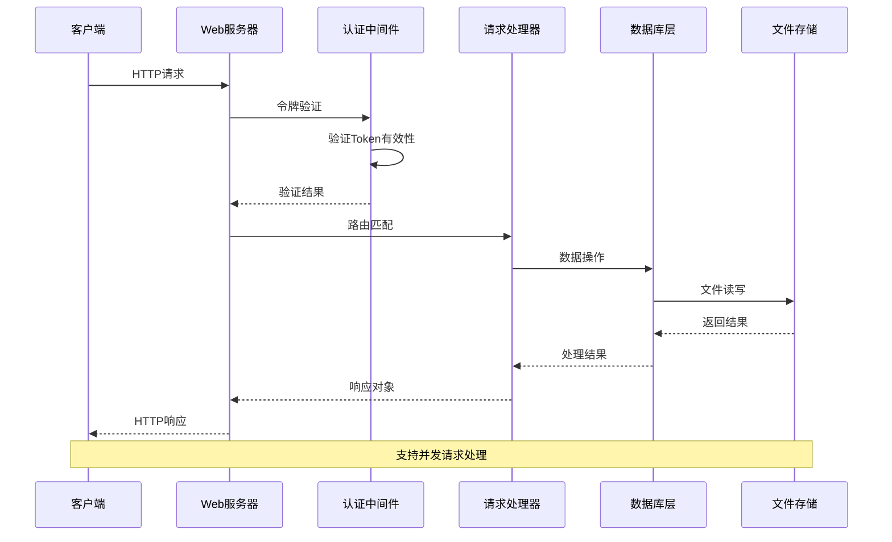
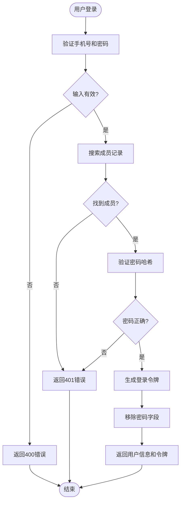
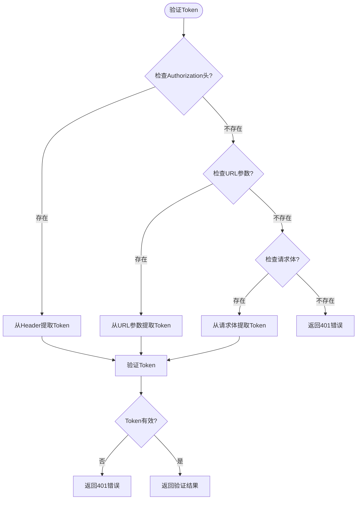

# API接口文档

<cite>
**本文档引用的文件**
- [main.py](file://src/main.py)
- [boot.py](file://src/boot.py)
- [microdot.py](file://src/lib/microdot.py)
- [index.html](file://src/static/index.html)
- [app.js](file://src/static/app.js)
- [config.json](file://src/data/config.json)
- [members.jsonl](file://src/data/members.jsonl)
- [login_logs.jsonl](file://src/data/login_logs.jsonl)
- [poems.jsonl](file://src/data/poems.jsonl)
- [activities.jsonl](file://src/data/activities.jsonl)
- [finance.jsonl](file://src/data/finance.jsonl)
- [tasks.jsonl](file://src/data/tasks.jsonl)
- [points_logs.jsonl](file://src/data/points_logs.jsonl)
</cite>

## 目录
1. [简介](#简介)
2. [项目结构](#项目结构)
3. [核心组件](#核心组件)
4. [架构概览](#架构概览)
5. [详细组件分析](#详细组件分析)
6. [依赖关系分析](#依赖关系分析)
7. [性能考虑](#性能考虑)
8. [故障排除指南](#故障排除指南)
9. [结论](#结论)

## 简介

围炉诗社·理事台是一个基于MicroPython的轻量级Web应用，专为传统诗社管理而设计。该系统提供了完整的API接口，支持内容管理、成员管理、财务管理、活动管理和事务处理等功能模块。

本项目采用ESP32微控制器作为运行平台，使用自研的轻量级Web框架Microdot，实现了高性能的RESTful API服务。系统支持JSON Lines数据存储格式，确保数据的可靠性和可扩展性。

**更新** 新增令牌认证相关API，包括登录、权限验证、备份恢复等接口

## 项目结构

项目采用模块化设计，主要包含以下核心组件：

```mermaid
graph TB
subgraph "应用层"
UI[用户界面]
API[RESTful API]
end
subgraph "业务逻辑层"
Poems[诗词管理]
Activities[活动管理]
Tasks[事务管理]
Members[成员管理]
Finance[财务管理]
Settings[系统设置]
Auth[认证授权]
Backup[备份恢复]
end
subgraph "数据存储层"
PoemsDB[poems.jsonl]
ActivitiesDB[activities.jsonl]
TasksDB[tasks.jsonl]
MembersDB[members.jsonl]
FinanceDB[finance.jsonl]
SettingsDB[settings.json]
LoginLogsDB[login_logs.jsonl]
PointsLogsDB[points_logs.jsonl]
end
subgraph "系统层"
Boot[启动脚本]
Config[配置文件]
WiFi[网络连接]
Token[令牌管理]
End
UI --> API
API --> Poems
API --> Activities
API --> Tasks
API --> Members
API --> Finance
API --> Settings
API --> Auth
API --> Backup
Poems --> PoemsDB
Activities --> ActivitiesDB
Tasks --> TasksDB
Members --> MembersDB
Finance --> FinanceDB
Settings --> SettingsDB
Auth --> LoginLogsDB
Auth --> PointsLogsDB
Boot --> Config
Boot --> WiFi
Token --> Auth
```

**图表来源**
- [main.py](file://src/main.py#L1-L2205)
- [boot.py](file://src/boot.py#L1-L153)

**章节来源**
- [main.py](file://src/main.py#L1-L2205)
- [boot.py](file://src/boot.py#L1-L153)

## 核心组件

### Web服务器框架

系统使用自研的Microdot框架，这是一个轻量级的Web服务器实现，专门为MicroPython环境设计：

- **Request类**: 处理HTTP请求解析，支持查询参数、请求头和JSON体
- **Response类**: 构建HTTP响应，自动处理Content-Type和Content-Length
- **Microdot类**: 提供路由注册和请求处理机制

### 数据库管理

系统采用JSON Lines格式存储数据，每个实体对应一个独立的数据文件：

- **JsonlDB类**: 提供统一的数据库访问接口
- **支持的操作**: 增删改查、分页查询、全文搜索
- **性能优化**: 内存优化的文件扫描和偏移量缓存

### 令牌认证系统

**新增** 系统实现了基于JWT的令牌认证机制：

- **Token格式**: user_id:expire_timestamp:signature
- **签名算法**: SHA256(user_id:expire_timestamp:secret_key)[:32]
- **默认有效期**: 30天（可配置）
- **支持的验证方式**: Header Authorization Bearer Token、URL参数token、POST请求体token

**章节来源**
- [microdot.py](file://src/lib/microdot.py#L1-L226)
- [main.py](file://src/main.py#L96-L190)

## 架构概览

系统采用三层架构设计，确保了良好的分离关注点和可维护性：



**图表来源**
- [main.py](file://src/main.py#L171-L189)
- [microdot.py](file://src/lib/microdot.py#L138-L195)

## 详细组件分析

### 认证与授权机制

**更新** 系统实现了完整的令牌认证和权限控制系统：



**图表来源**
- [main.py](file://src/main.py#L1398-L1430)

**章节来源**
- [main.py](file://src/main.py#L1398-L1430)

### 令牌验证流程

**新增** 令牌验证支持多种方式：



**图表来源**
- [main.py](file://src/main.py#L171-L189)

**章节来源**
- [main.py](file://src/main.py#L171-L189)

### 诗词管理API

诗词管理模块提供了完整的CRUD操作：

#### GET /api/poems
- **功能**: 获取诗词列表
- **认证**: 需要登录
- **参数**: 
  - page: 页码，默认1
  - limit: 每页数量，默认10
  - q: 搜索关键词
- **响应**: 诗词数组

#### POST /api/poems
- **功能**: 创建新诗词
- **认证**: 需要登录
- **请求体**: 包含title、content、type、date等字段
- **响应**: 新创建的诗词对象

#### POST /api/poems/update
- **功能**: 更新诗词信息
- **认证**: 需要登录
- **请求体**: 包含id以及要更新的字段
- **响应**: {"status": "success"}

#### POST /api/poems/delete
- **功能**: 删除诗词
- **认证**: 需要登录
- **请求体**: 包含要删除的id
- **响应**: {"status": "success"}

**章节来源**
- [main.py](file://src/main.py#L783-L857)

### 活动管理API

活动管理模块支持活动的全生命周期管理：

#### GET /api/activities
- **功能**: 获取活动列表
- **参数**: 
  - page: 页码，默认1
  - limit: 每页数量，默认50
  - q: 搜索关键词
- **响应**: 活动数组

#### POST /api/activities
- **功能**: 创建新活动
- **认证**: 需要理事权限
- **请求体**: 包含title、desc、date、location、status等字段
- **响应**: 新创建的活动对象

#### POST /api/activities/update
- **功能**: 更新活动信息
- **认证**: 需要理事权限
- **请求体**: 包含id以及要更新的字段
- **响应**: {"status": "success"}

#### POST /api/activities/delete
- **功能**: 删除活动
- **认证**: 需要理事权限
- **请求体**: 包含要删除的id
- **响应**: {"status": "success"}

**章节来源**
- [main.py](file://src/main.py#L859-L910)

### 事务管理API

事务管理模块提供任务分配和积分奖励功能：

#### GET /api/tasks
- **功能**: 获取任务列表
- **认证**: 需要登录
- **参数**: 
  - page: 页码，默认0
  - limit: 每页数量，默认0
  - q: 搜索关键词
- **响应**: 任务数组或分页数据

#### POST /api/tasks/claim
- **功能**: 领取任务
- **认证**: 需要登录
- **请求体**: 
  - task_id: 任务ID
  - member_name: 成员姓名
  - member_id: 成员ID
- **响应**: {"status": "success"}

#### POST /api/tasks/unclaim
- **功能**: 撤销领取任务
- **认证**: 需要登录
- **请求体**: 
  - task_id: 任务ID
- **响应**: {"status": "success"}

#### POST /api/tasks/submit
- **功能**: 提交任务完成
- **认证**: 需要登录
- **请求体**: 
  - task_id: 任务ID
- **响应**: {"status": "success"}

#### POST /api/tasks/approve
- **功能**: 审批任务
- **认证**: 需要理事权限
- **请求体**: 
  - task_id: 任务ID
  - force: 强制验收标志
- **响应**: {"status": "success", "gained": 奖励积分}

#### POST /api/tasks/reject
- **功能**: 拒绝任务
- **认证**: 需要理事权限
- **请求体**: 
  - task_id: 任务ID
- **响应**: {"status": "success"}

#### POST /api/tasks/delete
- **功能**: 删除任务
- **认证**: 需要理事权限
- **请求体**: 
  - task_id: 任务ID
- **响应**: {"status": "success"}

#### POST /api/tasks/complete
- **功能**: 快速完成任务
- **认证**: 需要理事权限
- **请求体**: 
  - task_id: 任务ID
  - member_name: 成员姓名
- **响应**: {"status": "success", "gained": 奖励积分}

**章节来源**
- [main.py](file://src/main.py#L912-L1173)

### 成员管理API

成员管理模块支持成员的全生命周期管理：

#### GET /api/members
- **功能**: 获取成员列表
- **认证**: 需要登录
- **参数**: 
  - page: 页码，默认0
  - limit: 每页数量，默认0
  - q: 搜索关键词
  - public: 公开模式标志
- **响应**: 成员数组或分页数据

#### POST /api/members
- **功能**: 创建新成员
- **认证**: 需要理事权限
- **请求体**: 包含name、alias、phone、role、points、password等字段
- **响应**: 新创建的成员对象

#### POST /api/members/update
- **功能**: 更新成员信息
- **认证**: 需要理事权限
- **请求体**: 包含id以及要更新的字段
- **响应**: {"status": "success"}

#### POST /api/members/change_password
- **功能**: 修改密码
- **认证**: 需要登录
- **请求体**: 
  - id: 成员ID
  - old_password: 原密码
  - new_password: 新密码
- **响应**: {"status": "success"}

#### POST /api/members/delete
- **功能**: 删除成员
- **认证**: 需要超级管理员权限
- **请求体**: 
  - id: 成员ID
- **响应**: {"status": "success"}

**章节来源**
- [main.py](file://src/main.py#L1175-L1358)

### 财务管理API

财务管理模块提供收支记录的管理：

#### GET /api/finance
- **功能**: 获取财务记录
- **认证**: 需要登录
- **参数**: 
  - page: 页码，默认1
  - limit: 每页数量，默认100
- **响应**: 财务记录数组

#### POST /api/finance
- **功能**: 添加新的财务记录
- **认证**: 需要财务权限
- **请求体**: 包含type、amount、summary、handler、date等字段
- **响应**: 新创建的财务记录

#### POST /api/finance/update
- **功能**: 更新财务记录
- **认证**: 需要财务权限
- **请求体**: 包含id以及要更新的字段
- **响应**: {"status": "success"}

#### POST /api/finance/delete
- **功能**: 删除财务记录
- **认证**: 需要财务权限
- **请求体**: 包含要删除的id
- **响应**: {"status": "success"}

**章节来源**
- [main.py](file://src/main.py#L1466-L1523)

### 认证相关API

**新增** 系统提供完整的认证和用户管理接口：

#### POST /api/login
- **功能**: 用户登录
- **请求体**: 
  - phone: 手机号
  - password: 密码
- **响应**: 用户信息对象（包含token和有效期）

#### POST /api/profile/update
- **功能**: 更新个人资料
- **认证**: 需要登录
- **请求体**: 
  - id: 用户ID
  - alias: 雅号
  - birthday: 生日
- **响应**: {"success": true}

**章节来源**
- [main.py](file://src/main.py#L1398-L1464)

### 系统设置API

系统设置模块提供自定义字段管理功能：

#### GET /api/settings/fields
- **功能**: 获取自定义字段配置
- **认证**: 需要登录
- **响应**: 字段定义数组

#### POST /api/settings/fields
- **功能**: 更新自定义字段配置
- **认证**: 需要理事权限
- **请求体**: 字段定义数组
- **响应**: {"status": "success"}

#### GET /api/settings/system
- **功能**: 获取系统设置
- **认证**: 需要登录
- **响应**: 系统名称和积分名称

#### POST /api/settings/system
- **功能**: 更新系统设置
- **认证**: 需要理事权限
- **请求体**: 
  - system_name: 系统名称
  - points_name: 积分名称
- **响应**: {"status": "success"}

#### GET /api/settings/salt
- **功能**: 获取密码盐值
- **认证**: 需要管理员权限
- **响应**: {"password_salt": 盐值}

#### POST /api/settings/salt
- **功能**: 更新密码盐值
- **认证**: 需要管理员权限
- **请求体**: 
  - password_salt: 新盐值
- **响应**: {"status": "success"}

#### GET /api/settings/token_expire
- **功能**: 获取登录有效期
- **认证**: 需要管理员权限
- **响应**: {"token_expire_days": 有效期天数}

#### POST /api/settings/token_expire
- **功能**: 更新登录有效期
- **认证**: 需要管理员权限
- **请求体**: 
  - token_expire_days: 新有效期天数
- **响应**: {"status": "success"}

**章节来源**
- [main.py](file://src/main.py#L1533-L1603)

### 系统信息API

#### GET /api/system/info
- **功能**: 获取系统状态信息
- **认证**: 需要登录
- **响应**: 
  - platform: 平台信息
  - free_storage: 可用存储空间
  - total_storage: 总存储空间
  - free_ram: 可用内存
  - uptime: 运行时间
  - system_time: 系统时间
  - wifi_rssi: WiFi信号强度
  - wifi_ssid: WiFi名称
  - wifi_mode: WiFi模式
  - sta_active: STA模式状态
  - ap_active: AP模式状态
  - cpu_temp: CPU温度

#### GET /api/system/stats
- **功能**: 获取各模块数据统计
- **认证**: 需要登录
- **响应**: 
  - members: 成员数量
  - poems: 诗词数量
  - activities: 活动数量
  - tasks: 任务数量
  - finance: 财务记录数量

**章节来源**
- [main.py](file://src/main.py#L1699-L1795)

### 备份恢复API

**新增** 系统提供完整的数据备份和恢复功能：

#### GET /api/backup/export
- **功能**: 导出全站数据备份
- **认证**: 需要管理员权限
- **响应**: 完整的备份数据对象

#### POST /api/backup/import
- **功能**: 导入数据备份
- **认证**: 需要管理员权限
- **请求体**: 备份数据对象
- **响应**: {"status": "success", "message": "数据恢复成功"}

#### GET /api/backup/tables
- **功能**: 获取可备份的表列表
- **认证**: 需要管理员权限
- **响应**: {"tables": 表名数组}

#### GET /api/backup/export-table
- **功能**: 分表导出
- **认证**: 需要管理员权限
- **参数**: 
  - name: 表名
  - page: 页码，默认1
  - limit: 每页条数，默认100
- **响应**: 分表数据对象

#### POST /api/backup/import-table
- **功能**: 分表导入
- **认证**: 需要管理员权限
- **参数**: 
  - name: 表名
- **请求体**: 表数据对象
- **响应**: {"status": "success", "table": 表名, "count": 记录数}

**章节来源**
- [main.py](file://src/main.py#L1797-L2187)

### 权限控制API

**新增** 系统提供权限验证和角色管理功能：

#### GET /api/login_logs
- **功能**: 获取登录日志
- **认证**: 需要登录
- **参数**: 
  - page: 页码，默认1
  - limit: 每页数量，默认20
- **响应**: 登录日志数组

#### GET /api/points/yearly_ranking
- **功能**: 获取年度积分排行榜
- **认证**: 需要登录
- **响应**: 排行榜数据数组

**章节来源**
- [main.py](file://src/main.py#L1525-L1531)
- [main.py](file://src/main.py#L1360-L1396)

## 依赖关系分析

系统采用松耦合的设计，各模块间通过清晰的接口进行交互：

```mermaid
graph TB
subgraph "外部依赖"
MicroPython[MicroPython运行时]
ESP32[ESP32硬件]
Network[网络库]
End
subgraph "内部模块"
Main[主应用]
Microdot[Web框架]
JsonlDB[数据库层]
Handlers[业务处理器]
Auth[认证模块]
Backup[备份模块]
End
subgraph "数据文件"
Poems[poems.jsonl]
Members[members.jsonl]
Activities[activities.jsonl]
Finance[finance.jsonl]
Tasks[tasks.jsonl]
Settings[settings.json]
LoginLogs[login_logs.jsonl]
PointsLogs[points_logs.jsonl]
End
MicroPython --> Main
ESP32 --> Main
Network --> Main
Main --> Microdot
Main --> JsonlDB
Main --> Handlers
Main --> Auth
Main --> Backup
JsonlDB --> Poems
JsonlDB --> Members
JsonlDB --> Activities
JsonlDB --> Finance
JsonlDB --> Tasks
JsonlDB --> Settings
JsonlDB --> LoginLogs
JsonlDB --> PointsLogs
Handlers --> JsonlDB
Auth --> LoginLogs
Auth --> PointsLogs
Backup --> JsonlDB
```

**图表来源**
- [main.py](file://src/main.py#L1-L2205)
- [microdot.py](file://src/lib/microdot.py#L1-L226)

**章节来源**
- [main.py](file://src/main.py#L1-L2205)
- [microdot.py](file://src/lib/microdot.py#L1-L226)

## 性能考虑

### 内存优化策略

系统针对ESP32的内存限制进行了专门优化：

- **流式文件处理**: 使用偏移量缓存避免一次性加载整个文件
- **分页查询**: 默认每页10-50条记录，支持大数据集的高效访问
- **内存回收**: 定期执行垃圾回收，监控可用内存
- **令牌缓存**: 前端本地缓存用户信息，减少重复请求

### 网络性能

- **静态文件服务**: 直接从文件系统读取，减少内存占用
- **JSON Lines格式**: 高效的序列化和反序列化
- **并发处理**: 支持多个客户端同时连接
- **令牌验证**: 采用轻量级的SHA256签名验证

### 存储优化

- **增量写入**: 使用追加模式写入，避免文件重写
- **临时文件**: 更新操作使用临时文件，确保数据一致性
- **文件迁移**: 自动从旧的JSON格式迁移到JSONL格式
- **备份压缩**: 大数据量备份时采用分表导出策略

## 故障排除指南

### 常见问题及解决方案

#### 连接问题
- **症状**: 设备无法连接到WiFi
- **原因**: 配置文件错误或网络不可用
- **解决**: 检查config.json中的WiFi配置，确认网络可用性

#### API响应错误
- **400 Bad Request**: 请求格式错误或缺少必需参数
- **401 Unauthorized**: 认证失败，检查用户名和密码或令牌
- **403 Forbidden**: 权限不足，检查用户角色和权限级别
- **404 Not Found**: 资源不存在或ID错误
- **500 Internal Server Error**: 服务器内部错误

#### 认证问题
- **令牌过期**: 重新登录获取新令牌
- **密码错误**: 检查密码输入是否正确
- **权限不足**: 确认用户角色是否具备相应权限

#### 数据库问题
- **文件损坏**: 检查JSON Lines格式是否正确
- **磁盘空间不足**: 清理不必要的数据文件
- **权限问题**: 确认文件读写权限

#### 备份恢复问题
- **备份文件格式错误**: 检查备份文件的JSON格式
- **导入失败**: 确认备份文件包含完整的数据结构
- **内存不足**: 大数据量导入时可能需要多次分批导入

**章节来源**
- [boot.py](file://src/boot.py#L28-L104)
- [main.py](file://src/main.py#L1-L2205)

## 结论

围炉诗社·理事台项目展示了如何在资源受限的嵌入式环境中构建功能完整的Web应用。通过精心设计的架构和优化策略，系统能够在ESP32平台上提供稳定可靠的API服务。

**更新** 新增的令牌认证系统显著提升了系统的安全性，支持多种验证方式和灵活的权限控制。备份恢复功能确保了数据的安全性和可恢复性。

### 主要优势

1. **轻量级设计**: 专为MicroPython环境优化
2. **高性能**: 针对内存和存储限制的优化
3. **易扩展**: 模块化架构便于功能扩展
4. **可靠性**: JSON Lines格式确保数据持久性
5. **安全性**: 完整的令牌认证和权限控制系统
6. **数据保护**: 全面的备份恢复机制

### 技术特点

- 基于Microdot的轻量级Web框架
- JSON Lines数据存储格式
- 内存优化的文件处理机制
- 完整的RESTful API设计
- 多层次的权限控制机制
- 安全的令牌认证系统
- 全面的数据备份恢复功能

该系统为传统诗社管理提供了一个优雅的数字化解决方案，既保持了传统文化的韵味，又融入了现代技术的便利性和安全性。