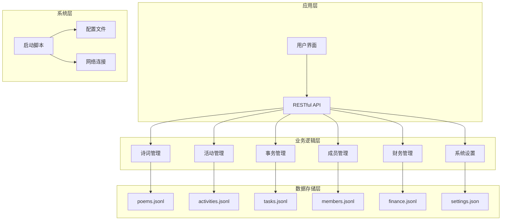
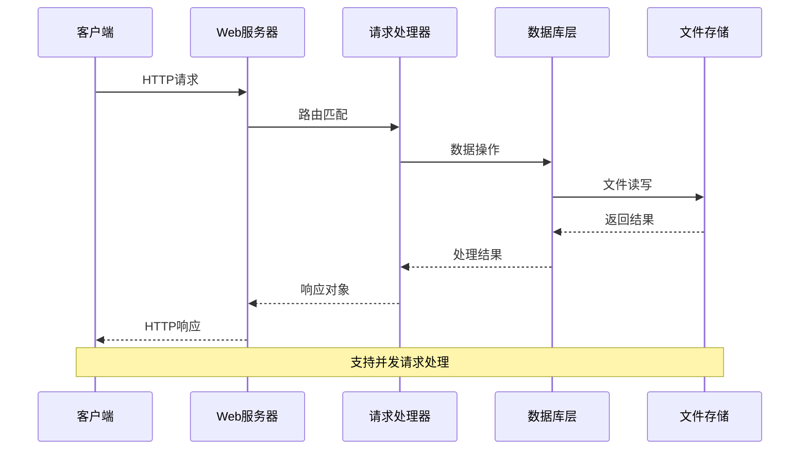
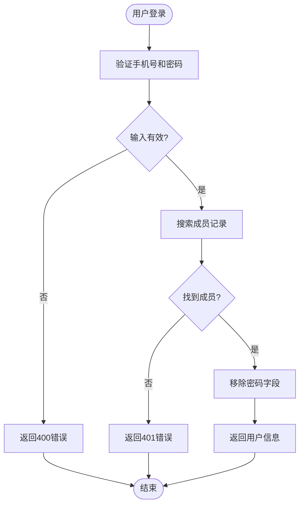
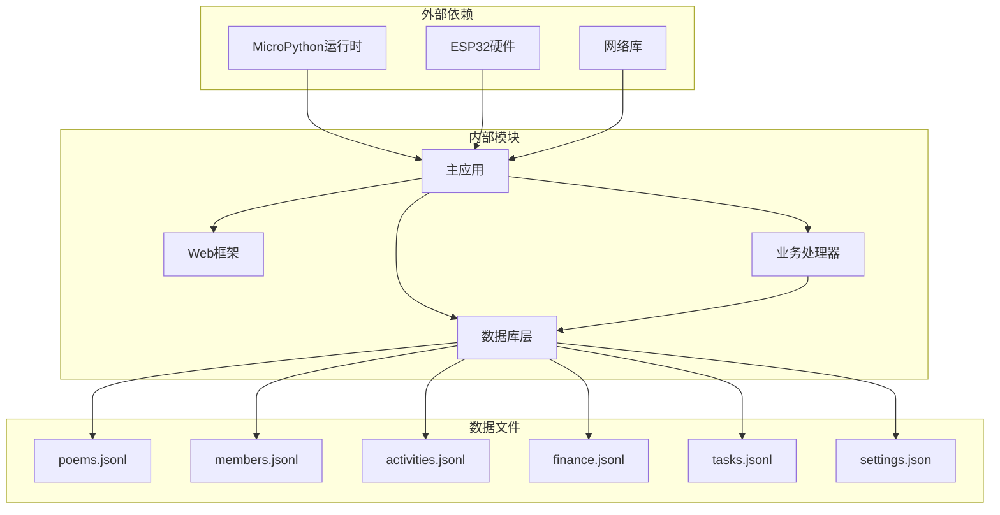

# API接口文档

<cite>
**本文档引用的文件**
- [main.py](file://main.py)
- [boot.py](file://boot.py)
- [microdot.py](file://lib/microdot.py)
- [index.html](file://static/index.html)
- [app.js](file://static/app.js)
- [config.json](file://data/config.json)
- [settings.json](file://data/settings.json)
- [poems.jsonl](file://data/poems.jsonl)
- [members.jsonl](file://data/members.jsonl)
- [activities.jsonl](file://data/activities.jsonl)
- [finance.jsonl](file://data/finance.jsonl)
- [tasks.jsonl](file://data/tasks.jsonl)
</cite>

## 目录
1. [简介](#简介)
2. [项目结构](#项目结构)
3. [核心组件](#核心组件)
4. [架构概览](#架构概览)
5. [详细组件分析](#详细组件分析)
6. [依赖关系分析](#依赖关系分析)
7. [性能考虑](#性能考虑)
8. [故障排除指南](#故障排除指南)
9. [结论](#结论)

## 简介

围炉诗社·理事台是一个基于MicroPython的轻量级Web应用，专为传统诗社管理而设计。该系统提供了完整的API接口，支持内容管理、成员管理、财务管理、活动管理和事务处理等功能模块。

本项目采用ESP32微控制器作为运行平台，使用自研的轻量级Web框架Microdot，实现了高性能的RESTful API服务。系统支持JSON Lines数据存储格式，确保数据的可靠性和可扩展性。

## 项目结构

项目采用模块化设计，主要包含以下核心组件：

**图表来源**
- [main.py](file://main.py#L1-L548)
- [boot.py](file://boot.py#L1-L122)

**章节来源**
- [main.py](file://main.py#L1-L548)
- [boot.py](file://boot.py#L1-L122)

## 核心组件

### Web服务器框架

系统使用自研的Microdot框架，这是一个轻量级的Web服务器实现，专门为MicroPython环境设计：

- **Request类**: 处理HTTP请求解析，支持查询参数、请求头和JSON体
- **Response类**: 构建HTTP响应，自动处理Content-Type和Content-Length
- **Microdot类**: 提供路由注册和请求处理机制

### 数据库管理

系统采用JSON Lines格式存储数据，每个实体对应一个独立的数据文件：

- **JsonlDB类**: 提供统一的数据库访问接口
- **支持的操作**: 增删改查、分页查询、全文搜索
- **性能优化**: 内存优化的文件扫描和偏移量缓存

**章节来源**
- [microdot.py](file://lib/microdot.py#L1-L183)
- [main.py](file://main.py#L53-L267)

## 架构概览

系统采用三层架构设计，确保了良好的分离关注点和可维护性：

**图表来源**
- [main.py](file://main.py#L299-L540)
- [microdot.py](file://lib/microdot.py#L104-L152)

## 详细组件分析

### 认证与授权机制

系统实现了基于手机号和密码的简单认证机制：

**图表来源**
- [main.py](file://main.py#L485-L503)

**章节来源**
- [main.py](file://main.py#L485-L503)

### 诗词管理API

诗词管理模块提供了完整的CRUD操作：

#### GET /api/poems
- **功能**: 获取诗词列表
- **参数**: 
  - page: 页码，默认1
  - limit: 每页数量，默认10
  - q: 搜索关键词
- **响应**: 诗词数组

#### POST /api/poems
- **功能**: 创建新诗词
- **请求体**: 包含title、content、type、date等字段
- **响应**: 新创建的诗词对象

#### POST /api/poems/update
- **功能**: 更新诗词信息
- **请求体**: 包含id以及要更新的字段
- **响应**: {"status": "success"}

#### POST /api/poems/delete
- **功能**: 删除诗词
- **请求体**: 包含要删除的id
- **响应**: {"status": "success"}

**章节来源**
- [main.py](file://main.py#L309-L370)

### 活动管理API

活动管理模块支持活动的全生命周期管理：

#### GET /api/activities
- **功能**: 获取活动列表
- **参数**: 
  - page: 页码，默认1
  - limit: 每页数量，默认50
  - q: 搜索关键词
- **响应**: 活动数组

#### POST /api/activities
- **功能**: 创建新活动
- **请求体**: 包含title、desc、date、location、status等字段
- **响应**: 新创建的活动对象

#### POST /api/activities/update
- **功能**: 更新活动信息
- **请求体**: 包含id以及要更新的字段
- **响应**: {"status": "success"}

#### POST /api/activities/delete
- **功能**: 删除活动
- **请求体**: 包含要删除的id
- **响应**: {"status": "success"}

**章节来源**
- [main.py](file://main.py#L371-L409)

### 事务管理API

事务管理模块提供任务分配和积分奖励功能：

#### GET /api/tasks
- **功能**: 获取所有任务
- **响应**: 任务数组

#### POST /api/tasks/complete
- **功能**: 完成任务并发放积分
- **请求体**: 
  - task_id: 任务ID
  - member_name: 成员姓名
- **响应**: {"status": "success", "gained": 奖励积分}

**章节来源**
- [main.py](file://main.py#L410-L450)

### 成员管理API

成员管理模块支持成员的全生命周期管理：

#### GET /api/members
- **功能**: 获取所有成员
- **响应**: 成员数组

#### POST /api/members
- **功能**: 创建新成员
- **请求体**: 包含name、alias、phone、role、points、password等字段
- **响应**: 新创建的成员对象

#### POST /api/members/update
- **功能**: 更新成员信息
- **请求体**: 包含id以及要更新的字段
- **响应**: {"status": "success"}

#### POST /api/members/delete
- **功能**: 删除成员
- **请求体**: 包含要删除的id
- **响应**: {"status": "success"}

**章节来源**
- [main.py](file://main.py#L451-L484)

### 财务管理API

财务管理模块提供收支记录的管理：

#### GET /api/finance
- **功能**: 获取财务记录
- **响应**: 最近100条财务记录

#### POST /api/finance
- **功能**: 添加新的财务记录
- **请求体**: 包含type、amount、summary、handler、date等字段
- **响应**: 新创建的财务记录

**章节来源**
- [main.py](file://main.py#L504-L516)

### 系统设置API

系统设置模块提供自定义字段管理功能：

#### GET /api/settings/fields
- **功能**: 获取自定义字段配置
- **响应**: 字段定义数组

#### POST /api/settings/fields
- **功能**: 更新自定义字段配置
- **请求体**: 字段定义数组
- **响应**: {"status": "success"}

**章节来源**
- [main.py](file://main.py#L517-L527)

### 系统信息API

#### GET /api/system/info
- **功能**: 获取系统状态信息
- **响应**: 
  - platform: 平台信息
  - free_storage: 可用存储空间
  - total_storage: 总存储空间
  - free_ram: 可用内存

**章节来源**
- [main.py](file://main.py#L528-L540)

## 依赖关系分析

系统采用松耦合的设计，各模块间通过清晰的接口进行交互：

**图表来源**
- [main.py](file://main.py#L1-L17)
- [microdot.py](file://lib/microdot.py#L1-L183)

**章节来源**
- [main.py](file://main.py#L1-L17)
- [microdot.py](file://lib/microdot.py#L1-L183)

## 性能考虑

### 内存优化策略

系统针对ESP32的内存限制进行了专门优化：

- **流式文件处理**: 使用偏移量缓存避免一次性加载整个文件
- **分页查询**: 默认每页10-50条记录，支持大数据集的高效访问
- **内存回收**: 定期执行垃圾回收，监控可用内存

### 网络性能

- **静态文件服务**: 直接从文件系统读取，减少内存占用
- **JSON Lines格式**: 高效的序列化和反序列化
- **并发处理**: 支持多个客户端同时连接

### 存储优化

- **增量写入**: 使用追加模式写入，避免文件重写
- **临时文件**: 更新操作使用临时文件，确保数据一致性
- **文件迁移**: 自动从旧的JSON格式迁移到JSONL格式

## 故障排除指南

### 常见问题及解决方案

#### 连接问题
- **症状**: 设备无法连接到WiFi
- **原因**: 配置文件错误或网络不可用
- **解决**: 检查config.json中的WiFi配置，确认网络可用性

#### API响应错误
- **400 Bad Request**: 请求格式错误或缺少必需参数
- **401 Unauthorized**: 认证失败，检查用户名和密码
- **404 Not Found**: 资源不存在或ID错误
- **500 Internal Server Error**: 服务器内部错误

#### 数据库问题
- **文件损坏**: 检查JSON Lines格式是否正确
- **磁盘空间不足**: 清理不必要的数据文件
- **权限问题**: 确认文件读写权限

**章节来源**
- [boot.py](file://boot.py#L22-L87)
- [main.py](file://main.py#L13-L15)

## 结论

围炉诗社·理事台项目展示了如何在资源受限的嵌入式环境中构建功能完整的Web应用。通过精心设计的架构和优化策略，系统能够在ESP32平台上提供稳定可靠的API服务。

### 主要优势

1. **轻量级设计**: 专为MicroPython环境优化
2. **高性能**: 针对内存和存储限制的优化
3. **易扩展**: 模块化架构便于功能扩展
4. **可靠性**: JSON Lines格式确保数据持久性

### 技术特点

- 基于Microdot的轻量级Web框架
- JSON Lines数据存储格式
- 内存优化的文件处理机制
- 简单的认证授权机制
- 完整的RESTful API设计

该系统为传统诗社管理提供了一个优雅的数字化解决方案，既保持了传统文化的韵味，又融入了现代技术的便利性。