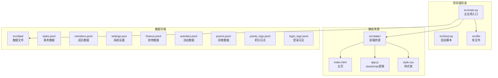
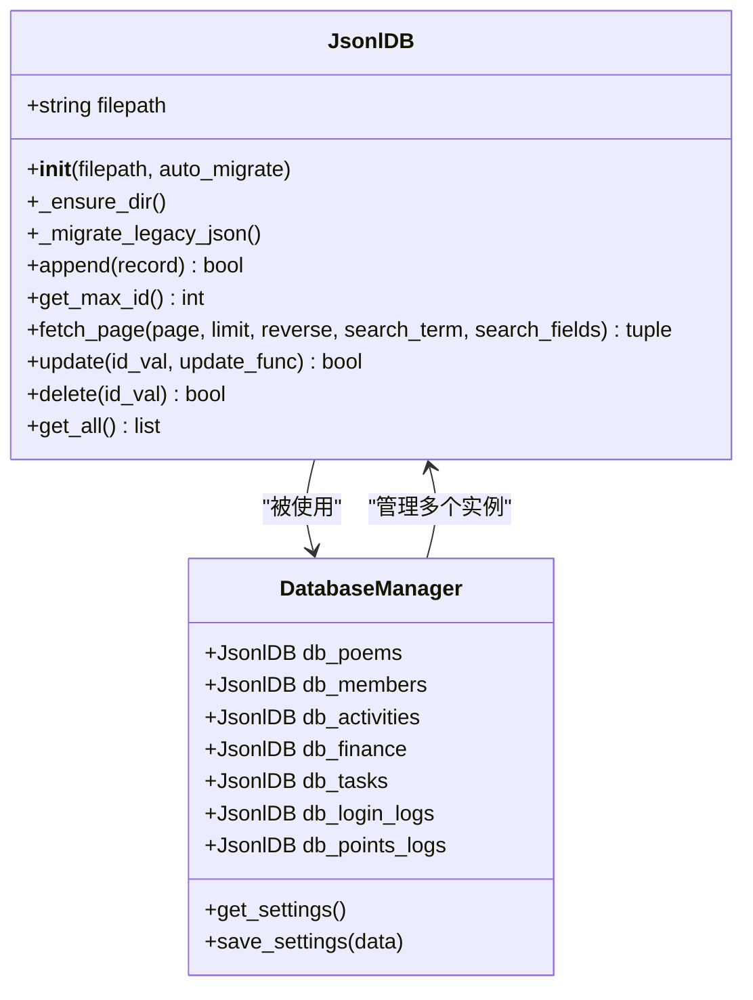
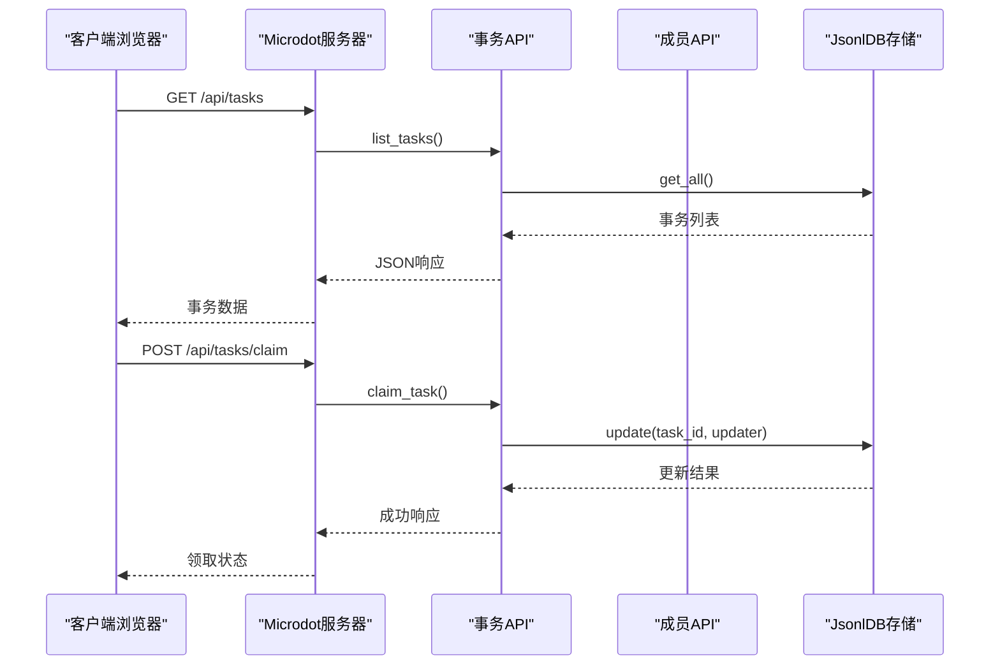
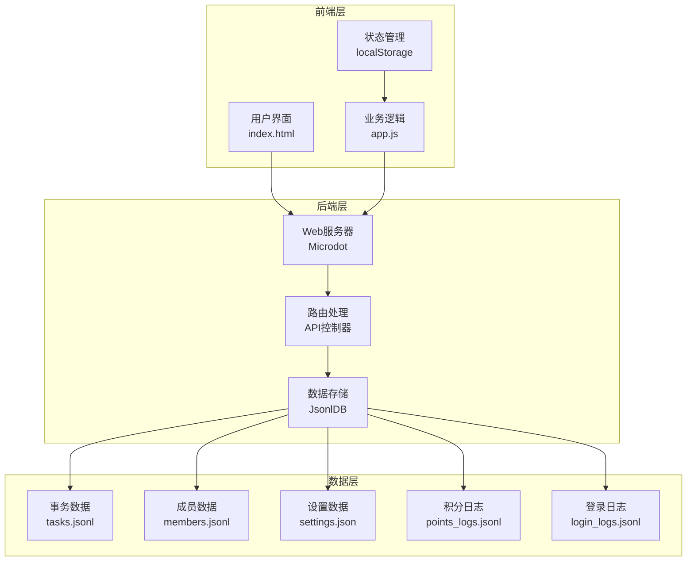
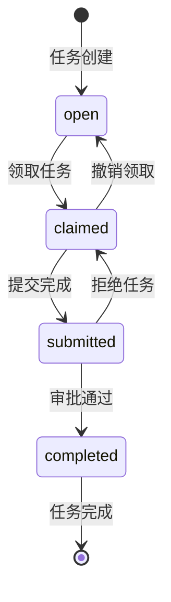
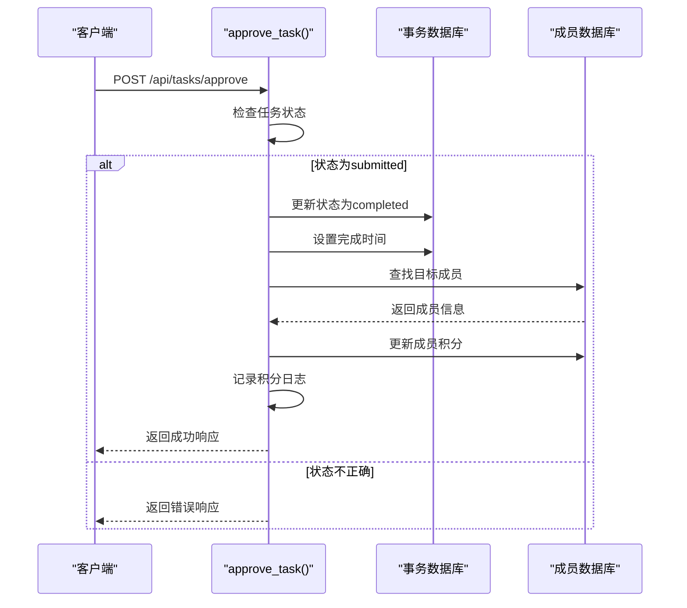
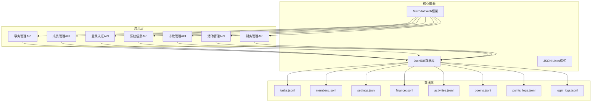

# 事务管理API

<cite>
**本文档引用的文件**
- [main.py](file://src/main.py)
- [app.js](file://src/static/app.js)
- [tasks.jsonl](file://src/data/tasks.jsonl)
- [members.jsonl](file://src/data/members.jsonl)
- [settings.json](file://src/data/settings.json)
</cite>

## 更新摘要
**变更内容**
- 新增完整的任务管理系统，包含6个API端点
- 实现完整的任务工作流：open、claimed、submitted、completed状态管理
- 新增自动积分奖励发放机制
- 更新事务实体数据结构，增加时间戳字段
- 新增任务审批和拒绝功能

## 目录
1. [简介](#简介)
2. [项目结构](#项目结构)
3. [核心组件](#核心组件)
4. [架构概览](#架构概览)
5. [详细组件分析](#详细组件分析)
6. [依赖关系分析](#依赖关系分析)
7. [性能考虑](#性能考虑)
8. [故障排除指南](#故障排除指南)
9. [结论](#结论)

## 简介

围炉诗社·理事台项目是一个基于MicroPython的Web应用，专门为围炉诗社的日常运营提供管理功能。本项目实现了完整的事务管理系统，支持事务的创建、查询、状态转换、完成标记等功能，同时集成了积分奖励机制和成员管理功能。

该项目采用轻量级的Microdot框架，使用JSON Lines格式作为数据存储方案，提供了直观的Web界面和RESTful API接口。系统特别针对ESP32设备进行了优化，能够在资源受限的环境中高效运行。

**更新** 新增了完整的任务工作流管理系统，支持多阶段的任务管理和自动积分奖励发放。

## 项目结构

项目采用模块化的文件组织方式，主要包含以下核心目录和文件：



**图表来源**
- [main.py](file://src/main.py#L1-L1164)
- [app.js](file://src/static/app.js#L1-L2163)

**章节来源**
- [main.py](file://src/main.py#L1-L1164)
- [app.js](file://src/static/app.js#L1-L2163)

## 核心组件

### 数据库管理器 (JsonlDB)

系统的核心数据存储采用自定义的JsonlDB类，这是一个专门为嵌入式环境设计的JSON Lines数据库管理器：



**图表来源**
- [main.py](file://src/main.py#L76-L282)

### Web应用服务器

应用使用Microdot框架构建，提供RESTful API接口和静态文件服务：



**图表来源**
- [main.py](file://src/main.py#L507-L528)

**章节来源**
- [main.py](file://src/main.py#L76-L282)

## 架构概览

系统采用前后端分离的架构设计，前端使用纯JavaScript实现，后端提供RESTful API服务：



**图表来源**
- [main.py](file://src/main.py#L19-L377)
- [app.js](file://src/static/app.js#L1-L2163)

## 详细组件分析

### 事务管理API

#### 事务列表查询接口

**接口定义**
- 方法: GET
- 路径: `/api/tasks`
- 功能: 获取所有事务的完整列表

**请求参数**
- 无参数

**响应数据结构**
```javascript
[
  {
    "id": 1,
    "title": "整理雅集诗稿",
    "description": "整理上周雅集各位社员的诗作，录入系统。",
    "status": "open",
    "assignee": null,
    "reward": 20,
    "creator": "超级管理员",
    "created_at": "2026-01-25T10:30:00",
    "claimed_at": null,
    "submitted_at": null,
    "completed_at": null
  }
]
```

**响应示例**
```json
[
  {
    "id": 1,
    "title": "整理雅集诗稿",
    "description": "整理上周雅集各位社员的诗作，录入系统。",
    "status": "open",
    "assignee": null,
    "reward": 20,
    "creator": "超级管理员",
    "created_at": "2026-01-25T10:30:00",
    "claimed_at": null,
    "submitted_at": null,
    "completed_at": null
  }
]
```

**章节来源**
- [main.py](file://src/main.py#L481-L483)
- [tasks.jsonl](file://src/data/tasks.jsonl#L1-L2)

#### 创建事务接口

**接口定义**
- 方法: POST
- 路径: `/api/tasks`
- 功能: 创建新的事务任务

**请求参数**
```javascript
{
  "title": "整理雅集诗稿",
  "description": "整理上周雅集各位社员的诗作，录入系统。",
  "reward": 20,
  "creator": "超级管理员"
}
```

**响应数据结构**
```javascript
{
  "id": 2,
  "title": "整理雅集诗稿",
  "description": "整理上周雅集各位社员的诗作，录入系统。",
  "status": "open",
  "assignee": null,
  "reward": 20,
  "creator": "超级管理员",
  "created_at": "2026-01-25T10:30:00",
  "claimed_at": null,
  "submitted_at": null,
  "completed_at": null
}
```

**章节来源**
- [main.py](file://src/main.py#L485-L505)

#### 领取任务接口

**接口定义**
- 方法: POST
- 路径: `/api/tasks/claim`
- 功能: 领取指定的开放任务

**请求参数**
```javascript
{
  "task_id": 1,
  "member_name": "张社长"
}
```

**响应数据结构**
```javascript
{
  "status": "success"
}
```

**状态转换流程图**



**图表来源**
- [main.py](file://src/main.py#L507-L528)

**章节来源**
- [main.py](file://src/main.py#L507-L528)

#### 撤销领取接口

**接口定义**
- 方法: POST
- 路径: `/api/tasks/unclaim`
- 功能: 撤销已领取的任务

**请求参数**
```javascript
{
  "task_id": 1
}
```

**响应数据结构**
```javascript
{
  "status": "success"
}
```

**章节来源**
- [main.py](file://src/main.py#L529-L548)

#### 提交完成接口

**接口定义**
- 方法: POST
- 路径: `/api/tasks/submit`
- 功能: 将已完成的任务提交等待审批

**请求参数**
```javascript
{
  "task_id": 1
}
```

**响应数据结构**
```javascript
{
  "status": "success"
}
```

**章节来源**
- [main.py](file://src/main.py#L550-L568)

#### 审批通过接口

**接口定义**
- 方法: POST
- 路径: `/api/tasks/approve`
- 功能: 审批通过任务完成，发放积分奖励

**请求参数**
```javascript
{
  "task_id": 1
}
```

**响应数据结构**
```javascript
{
  "status": "success",
  "gained": 20
}
```

**审批流程序列图**



**图表来源**
- [main.py](file://src/main.py#L570-L621)

**章节来源**
- [main.py](file://src/main.py#L570-L621)

#### 拒绝任务接口

**接口定义**
- 方法: POST
- 路径: `/api/tasks/reject`
- 功能: 拒绝任务，退回给领取者重做

**请求参数**
```javascript
{
  "task_id": 1
}
```

**响应数据结构**
```javascript
{
  "status": "success"
}
```

**章节来源**
- [main.py](file://src/main.py#L622-L640)

#### 删除任务接口

**接口定义**
- 方法: POST
- 路径: `/api/tasks/delete`
- 功能: 删除指定的任务

**请求参数**
```javascript
{
  "task_id": 1
}
```

**响应数据结构**
```javascript
{
  "status": "success"
}
```

**章节来源**
- [main.py](file://src/main.py#L642-L649)

#### 事务完成标记接口（兼容模式）

**接口定义**
- 方法: POST
- 路径: `/api/tasks/complete`
- 功能: 兼容旧版本的直接完成任务接口

**请求参数**
```javascript
{
  "task_id": 1,
  "member_name": "张社长"
}
```

**响应数据结构**
```javascript
{
  "status": "success",
  "gained": 20
}
```

**章节来源**
- [main.py](file://src/main.py#L651-L689)

### 事务实体数据结构

事务实体包含以下字段：

| 字段名 | 类型 | 必填 | 描述 | 示例值 |
|--------|------|------|------|--------|
| id | number | 是 | 事务唯一标识符 | 1 |
| title | string | 是 | 事务标题 | "整理雅集诗稿" |
| description | string | 否 | 事务描述 | "整理上周雅集各位社员的诗作..." |
| status | string | 是 | 事务状态 | "open" |
| assignee | string/null | 否 | 指派人姓名 | "张社长" |
| reward | number | 否 | 奖励积分 | 20 |
| creator | string | 否 | 发布者姓名 | "超级管理员" |
| created_at | string | 否 | 创建时间 | "2026-01-25T10:30:00" |
| claimed_at | string/null | 否 | 领取时间 | "2026-01-25T11:00:00" |
| submitted_at | string/null | 否 | 提交时间 | "2026-01-25T14:00:00" |
| completed_at | string/null | 否 | 完成时间 | "2026-01-25T15:00:00" |

**状态枚举值**
- `open`: 待领取状态
- `claimed`: 进行中状态
- `submitted`: 待验收状态
- `completed`: 已完成状态

**章节来源**
- [tasks.jsonl](file://src/data/tasks.jsonl#L1-L2)

### 成员管理API

#### 成员列表查询

**接口定义**
- 方法: GET
- 路径: `/api/members`
- 功能: 获取所有成员信息

**响应示例**
```json
[
  {
    "id": 1,
    "phone": "13800000000",
    "name": "超级管理员",
    "password": "T1SERFFAHAHiipY6",
    "alias": "超级管理员",
    "role": "super_admin",
    "points": 100,
    "joined_at": "2024-01-01"
  }
]
```

**章节来源**
- [main.py](file://src/main.py#L692-L694)
- [members.jsonl](file://src/data/members.jsonl#L1-L4)

### 登录认证API

#### 用户登录

**接口定义**
- 方法: POST
- 路径: `/api/login`
- 功能: 用户身份验证

**请求参数**
```javascript
{
  "phone": "13800000000",
  "password": "T1SERFFAHAHiipY6"
}
```

**响应示例**
```json
{
  "id": 1,
  "phone": "13800000000",
  "name": "超级管理员",
  "alias": "超级管理员",
  "role": "super_admin",
  "points": 100,
  "joined_at": "2024-01-01"
}
```

**章节来源**
- [main.py](file://src/main.py#L132-L155)

### 系统信息API

#### 系统状态查询

**接口定义**
- 方法: GET
- 路径: `/api/system/info`
- 功能: 获取系统运行状态信息

**响应示例**
```json
{
  "platform": "ESP32",
  "free_storage": 1048576,
  "total_storage": 4194304,
  "free_ram": 81920
}
```

**章节来源**
- [main.py](file://src/main.py#L349-L364)

## 依赖关系分析

系统的关键依赖关系如下：



**图表来源**
- [main.py](file://src/main.py#L12-L18)
- [main.py](file://src/main.py#L285-L291)

**章节来源**
- [main.py](file://src/main.py#L12-L18)
- [main.py](file://src/main.py#L285-L291)

## 性能考虑

### 数据存储优化

系统采用JSON Lines格式存储数据，具有以下优势：
- **内存友好**: 支持流式读取，无需一次性加载整个文件
- **并发安全**: 文件锁定机制防止数据损坏
- **迁移兼容**: 自动从旧的JSON格式迁移

### API性能特性

- **分页查询**: 支持大数据集的分页浏览
- **搜索优化**: 提供全文搜索功能
- **缓存策略**: 前端实现数据缓存机制

### 内存管理

系统针对ESP32设备进行了专门优化：
- **垃圾回收**: 定期执行内存清理
- **资源限制**: 控制并发连接数
- **存储优化**: 使用压缩算法减少存储空间

## 故障排除指南

### 常见问题及解决方案

**问题1: 任务状态转换失败**
- **原因**: 任务状态不符合转换条件
- **解决**: 检查任务当前状态是否允许该操作

**问题2: 积分未更新**
- **原因**: 成员名称不匹配或数据库写入失败
- **解决**: 检查成员名称是否与数据库一致

**问题3: API响应超时**
- **原因**: 数据库文件过大或磁盘I/O性能问题
- **解决**: 考虑清理历史数据或优化存储结构

**问题4: 前端页面显示异常**
- **原因**: JavaScript错误或网络连接问题
- **解决**: 检查浏览器控制台错误信息

### 调试工具

系统提供了以下调试功能：
- **系统状态查询**: `/api/system/info`
- **错误日志**: 控制台输出详细的错误信息
- **数据验证**: API请求参数的完整性检查

**章节来源**
- [main.py](file://src/main.py#L570-L621)

## 结论

围炉诗社·理事台项目成功实现了一个功能完整的事务管理系统，具有以下特点：

### 技术优势
- **轻量化设计**: 针对嵌入式设备优化，适合ESP32部署
- **模块化架构**: 清晰的代码结构便于维护和扩展
- **实时响应**: 基于Microdot框架的高性能Web服务
- **数据持久化**: 采用JSON Lines格式确保数据可靠性
- **完整工作流**: 支持多阶段的任务管理和审批流程

### 功能完整性
- **事务管理**: 完整的事务生命周期管理，支持多状态流转
- **积分系统**: 自动化的奖励计算和发放机制
- **用户认证**: 安全的登录验证机制
- **数据管理**: 全面的数据增删改查功能
- **审计日志**: 完整的操作记录和积分变动日志

### 扩展潜力
系统具备良好的扩展性，可以轻松添加新的功能模块，如：
- 更复杂的权限管理系统
- 实时通知功能
- 数据备份和恢复机制
- 多语言支持
- 移动端应用支持

**更新** 新增的完整任务管理系统为围炉诗社的数字化转型提供了更加完善的技术基础，展现了传统文学社团与现代技术相结合的可能性。