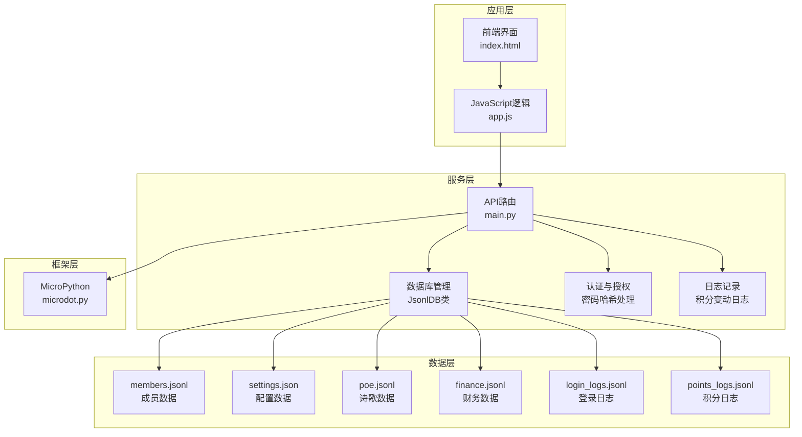
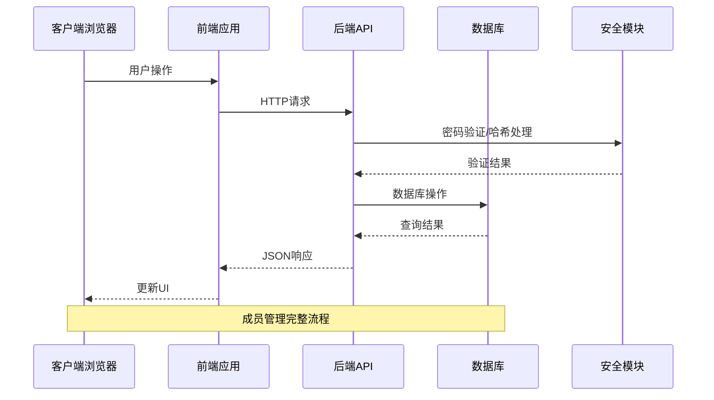
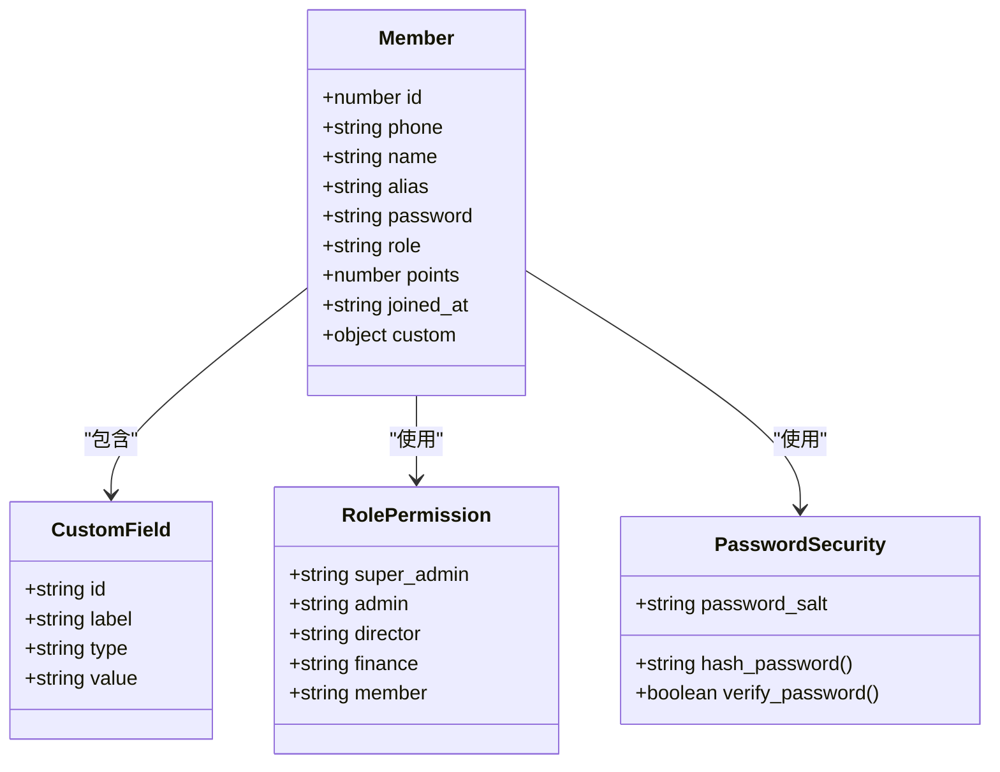
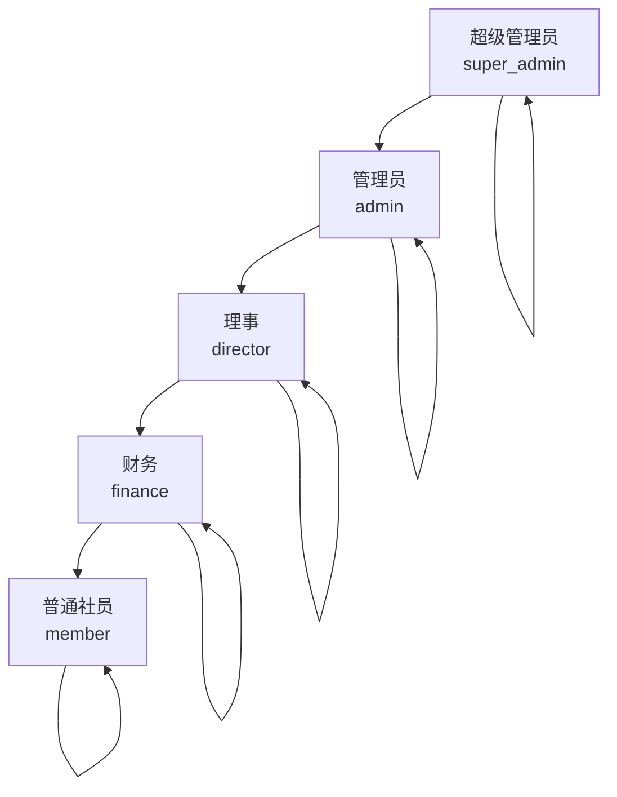
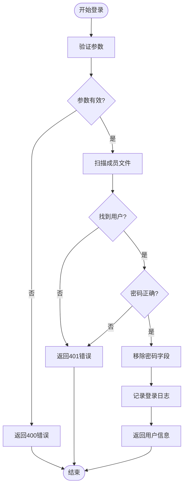
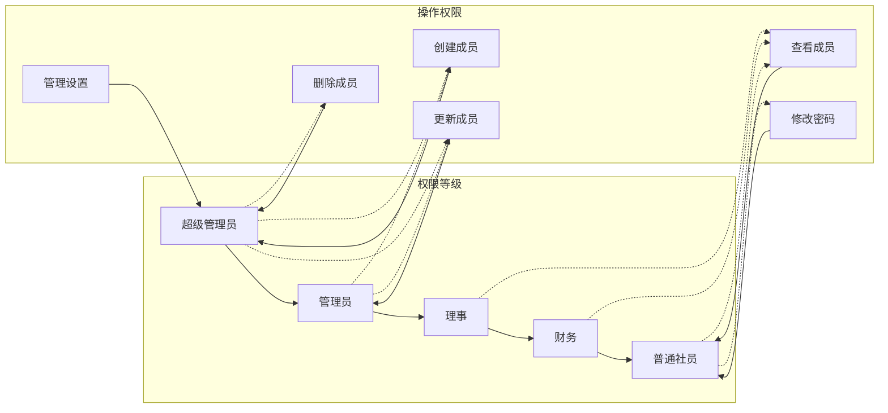
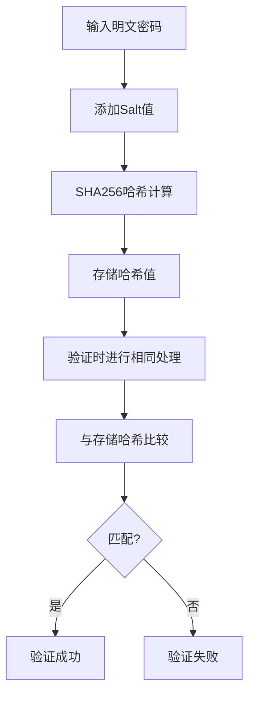
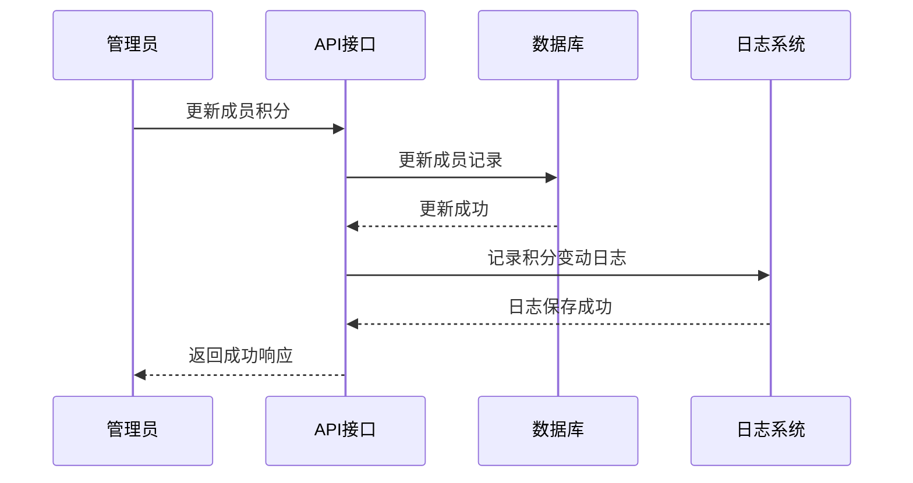
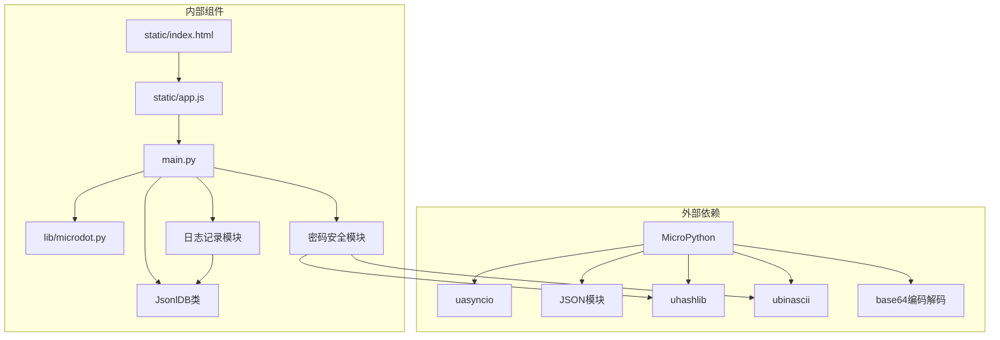

# 成员管理API

<cite>
**本文档引用的文件**
- [main.py](file://src/main.py)
- [app.js](file://src/static/app.js)
- [index.html](file://src/static/index.html)
- [members.jsonl](file://src/data/members.jsonl)
- [settings.json](file://src/data/settings.json)
- [microdot.py](file://src/lib/microdot.py)
</cite>

## 更新摘要
**变更内容**
- 新增密码修改功能接口 `/api/members/change_password`
- 增强成员更新功能，支持自动密码哈希处理
- 新增积分变动日志记录机制
- 新增密码哈希处理和验证功能
- 新增密码迁移功能用于安全升级

## 目录
1. [简介](#简介)
2. [项目结构](#项目结构)
3. [核心组件](#核心组件)
4. [架构概览](#架构概览)
5. [详细组件分析](#详细组件分析)
6. [依赖关系分析](#依赖关系分析)
7. [性能考虑](#性能考虑)
8. [故障排除指南](#故障排除指南)
9. [结论](#结论)

## 简介

围炉诗社·理事台项目是一个基于MicroPython的轻量级Web应用，专为传统诗社管理设计。该项目实现了完整的成员管理系统，支持成员信息维护、权限控制、积分管理和自定义字段系统。系统采用JSON Lines格式存储数据，提供RESTful API接口供前端调用。

**更新** 本次更新增强了密码安全管理，新增了密码修改、哈希处理和迁移功能，提升了系统的整体安全性。

## 项目结构

项目采用模块化设计，主要包含以下核心组件：



**图表来源**
- [main.py](file://src/main.py#L1-L1164)
- [app.js](file://src/static/app.js#L1-L2163)
- [microdot.py](file://src/lib/microdot.py#L1-L183)

**章节来源**
- [main.py](file://src/main.py#L1-L1164)
- [app.js](file://src/static/app.js#L1-L2163)
- [index.html](file://src/static/index.html#L1-L515)

## 核心组件

### JsonlDB 数据库管理器

JsonlDB是项目的核心数据访问层，提供了完整的JSON Lines格式数据库操作功能：

- **文件存储**: 使用`.jsonl`扩展名存储每条记录一行的JSON格式
- **内存优化**: 支持大数据集的流式处理和分页查询
- **搜索功能**: 提供全文搜索和字段过滤能力
- **事务支持**: 基于文件重写的方式实现原子性更新

### 成员管理API

系统提供完整的成员生命周期管理接口：

- **成员查询**: 支持分页、搜索和排序
- **成员创建**: 验证手机号唯一性和基础字段完整性，自动密码哈希处理
- **成员更新**: 支持部分字段更新，自动密码哈希处理和积分变动日志记录
- **密码修改**: 用户修改自己的密码，支持旧密码验证
- **成员删除**: 安全删除机制，防止误删
- **用户认证**: 基于手机号和密码的登录验证，支持哈希密码验证

### 安全增强功能

**更新** 新增了多层次的安全保护机制：

- **密码哈希**: 所有密码使用SHA256算法加盐存储
- **密码验证**: 支持新旧两种密码格式的兼容验证
- **密码迁移**: 提供一次性密码迁移功能，将明文密码升级为哈希存储
- **积分日志**: 记录所有积分变动，便于审计和追踪

**章节来源**
- [main.py](file://src/main.py#L28-L47)
- [main.py](file://src/main.py#L756-L790)
- [main.py](file://src/main.py#L915-L932)

## 架构概览

系统采用前后端分离的架构设计，前端使用纯HTML/CSS/JavaScript，后端基于MicroPython的轻量级Web框架：



**图表来源**
- [main.py](file://src/main.py#L756-L790)
- [app.js](file://src/static/app.js#L171-L213)

**章节来源**
- [main.py](file://src/main.py#L293-L336)
- [microdot.py](file://src/lib/microdot.py#L94-L152)

## 详细组件分析

### 成员实体数据结构

成员实体采用灵活的JSON格式存储，支持标准字段和自定义字段扩展：



**图表来源**
- [members.jsonl](file://src/data/members.jsonl#L1-L4)
- [settings.json](file://src/data/settings.json#L1-L5)

#### 标准字段说明

| 字段名 | 类型 | 必填 | 描述 | 默认值 |
|--------|------|------|------|--------|
| id | number | 是 | 成员唯一标识符 | 自动生成 |
| phone | string | 是 | 手机号（登录凭证） | - |
| name | string | 是 | 真实姓名 | - |
| alias | string | 否 | 雅号/花名 | - |
| password | string | 是 | 登录密码（哈希存储） | - |
| role | string | 是 | 角色权限 | "member" |
| points | number | 否 | 积分余额 | 0 |
| joined_at | string | 否 | 加入日期 | 当前日期 |
| custom | object | 否 | 自定义字段集合 | {} |

#### 角色权限体系

系统实现多层级权限控制：



**图表来源**
- [app.js](file://src/static/app.js#L517-L518)
- [members.jsonl](file://src/data/members.jsonl#L1-L4)

### 成员管理API详解

#### 成员列表查询 (/api/members GET)

**功能描述**: 获取所有成员信息，支持权限控制和数据脱敏

**请求参数**: 无

**响应数据**: 成员对象数组

**安全特性**: 
- 返回数据自动移除敏感字段
- 基于用户角色显示不同内容

**章节来源**
- [main.py](file://src/main.py#L692-L694)
- [main.py](file://src/main.py#L691-L712)

#### 成员创建 (/api/members POST)

**功能描述**: 创建新成员，执行手机号唯一性验证和密码哈希处理

**请求参数**:
```javascript
{
    "name": "字符串, 必填",
    "phone": "字符串, 必填",
    "password": "字符串, 必填",
    "alias": "字符串, 可选",
    "role": "字符串, 可选, 默认'member'",
    "points": "数字, 可选, 默认0",
    "joined_at": "字符串, 可选",
    "custom": "对象, 可选"
}
```

**业务规则**:
- 手机号必须唯一
- 必填字段验证
- 自动分配ID和加入日期
- **更新**: 密码自动进行哈希处理存储

**章节来源**
- [main.py](file://src/main.py#L696-L712)
- [app.js](file://src/static/app.js#L605-L621)

#### 成员更新 (/api/members/update POST)

**功能描述**: 更新现有成员信息，支持部分字段更新和自动密码哈希处理

**请求参数**:
```javascript
{
    "id": "数字, 必填",
    "name": "字符串, 可选",
    "alias": "字符串, 可选", 
    "phone": "字符串, 可选",
    "role": "字符串, 可选",
    "points": "数字, 可选",
    "password": "字符串, 可选",
    "custom": "对象, 可选"
}
```

**更新策略**:
- 仅更新提供的字段
- **更新**: 密码为空时不修改，非空时自动哈希处理
- 支持自定义字段动态更新
- **更新**: 自动处理积分字段类型转换
- **更新**: 记录积分变动日志

**章节来源**
- [main.py](file://src/main.py#L714-L754)
- [app.js](file://src/static/app.js#L622-L634)

#### 密码修改 (/api/members/change_password POST)

**功能描述**: 用户修改自己的密码，支持旧密码验证和新密码哈希处理

**请求参数**:
```javascript
{
    "id": "数字, 必填",
    "old_password": "字符串, 必填",
    "new_password": "字符串, 必填"
}
```

**业务规则**:
- 验证用户身份和旧密码
- 新密码长度至少4位
- 自动进行密码哈希处理
- 支持旧版明文密码兼容验证

**安全特性**:
- 仅允许用户修改自己的密码
- 旧密码验证确保操作合法性
- 新密码自动哈希存储

**章节来源**
- [main.py](file://src/main.py#L756-L790)
- [app.js](file://src/static/app.js#L171-L213)

#### 成员删除 (/api/members/delete POST)

**功能描述**: 删除指定成员

**请求参数**:
```javascript
{
    "id": "数字, 必填"
}
```

**安全措施**:
- 仅超级管理员可执行删除操作
- 删除前进行存在性检查

**章节来源**
- [main.py](file://src/main.py#L792-L795)
- [app.js](file://src/static/app.js#L762-L770)

#### 用户登录 (/api/login POST)

**功能描述**: 用户身份认证

**请求参数**:
```javascript
{
    "phone": "字符串, 必填",
    "password": "字符串, 必填"
}
```

**认证流程**:


**图表来源**
- [main.py](file://src/main.py#L838-L860)

**安全特性**:
- 明文密码传输（生产环境需HTTPS）
- 登录成功后自动移除密码字段
- 逐行扫描确保安全性
- **更新**: 支持新旧两种密码格式验证

**章节来源**
- [main.py](file://src/main.py#L838-L860)
- [app.js](file://src/static/app.js#L138-L155)

### 自定义字段系统

系统支持灵活的自定义字段配置，通过settings.json管理字段定义：

**字段配置结构**:
```javascript
[
    {
        "id": "cf_1769341584847",  // 字段唯一标识
        "label": "入社日期",        // 字段显示名称
        "type": "date",            // 字段类型
        "required": false          // 是否必填
    }
]
```

**字段类型支持**:
- `text`: 文本输入
- `number`: 数字输入  
- `date`: 日期选择
- `email`: 邮箱验证

**章节来源**
- [settings.json](file://src/data/settings.json#L1-L5)
- [app.js](file://src/static/app.js#L1840-L1879)

### 权限控制机制

系统实现基于角色的权限控制（RBAC）：



**图表来源**
- [app.js](file://src/static/app.js#L517-L518)
- [main.py](file://src/main.py#L691-L795)

**章节来源**
- [app.js](file://src/static/app.js#L517-L518)
- [index.html](file://src/static/index.html#L38-L39)

### 安全增强功能

#### 密码哈希处理

系统实现了安全的密码存储机制：



**图表来源**
- [main.py](file://src/main.py#L28-L47)

#### 积分变动日志

系统记录所有积分变动，便于审计和追踪：



**图表来源**
- [main.py](file://src/main.py#L300-L311)
- [main.py](file://src/main.py#L730-L753)

**章节来源**
- [main.py](file://src/main.py#L28-L47)
- [main.py](file://src/main.py#L300-L311)
- [main.py](file://src/main.py#L730-L753)

## 依赖关系分析

系统各组件之间的依赖关系如下：



**图表来源**
- [main.py](file://src/main.py#L1-L17)
- [microdot.py](file://src/lib/microdot.py#L1-L10)

**章节来源**
- [main.py](file://src/main.py#L1-L17)
- [microdot.py](file://src/lib/microdot.py#L1-L10)

## 性能考虑

### 数据存储优化

1. **JSON Lines格式**: 每条记录独立存储，支持高效追加和随机访问
2. **内存优化**: 大文件操作采用流式处理，避免内存溢出
3. **索引策略**: 基于ID的快速查找，支持范围查询
4. **日志轮转**: 登录日志自动清理，限制最大数量

### API性能特性

1. **异步处理**: 基于MicroPython的异步I/O模型
2. **缓存机制**: 前端对常用数据进行缓存
3. **分页查询**: 支持大数据集的分页浏览
4. **哈希缓存**: 密码哈希计算结果可被复用

### 安全考虑

1. **数据传输**: 建议在生产环境中启用HTTPS
2. **密码存储**: 已升级为哈希存储，支持明文迁移
3. **输入验证**: 严格的参数验证和错误处理
4. **权限控制**: 基于角色的细粒度权限管理

## 故障排除指南

### 常见问题及解决方案

**登录失败**
- 检查手机号和密码是否正确
- 确认用户是否存在
- 验证网络连接稳定性
- **更新**: 检查密码格式（新版本使用哈希存储）

**成员创建失败**
- 确认手机号唯一性
- 检查必填字段完整性
- 验证JSON格式正确性
- **更新**: 确认密码长度符合要求

**权限不足**
- 确认当前用户角色
- 检查操作权限范围
- 联系超级管理员提升权限

**数据同步问题**
- 检查文件系统权限
- 验证磁盘空间充足
- 确认文件格式正确

**密码相关问题**
- **新增**: 密码修改失败时检查旧密码是否正确
- **新增**: 密码迁移完成后需要重新登录
- **新增**: 修改Salt后需要重新执行密码迁移

**章节来源**
- [main.py](file://src/main.py#L756-L790)
- [app.js](file://src/static/app.js#L171-L213)

## 结论

围炉诗社·理事台项目提供了一个功能完整、架构清晰的成员管理系统。系统采用轻量级设计，适合资源受限的嵌入式环境，同时保持了良好的扩展性和易用性。

**主要优势**:
- 简洁的API设计，易于理解和使用
- 灵活的自定义字段系统
- 完整的权限控制机制
- 高效的数据存储方案
- **更新**: 增强的安全保护机制，包括密码哈希存储和积分日志记录

**改进建议**:
- 考虑添加API版本控制
- 实现更完善的错误处理
- 考虑添加数据备份机制
- **更新**: 考虑添加密码强度验证和复杂度要求

该系统为传统诗社管理提供了理想的数字化解决方案，既保持了传统文化的韵味，又融入了现代技术的便利。