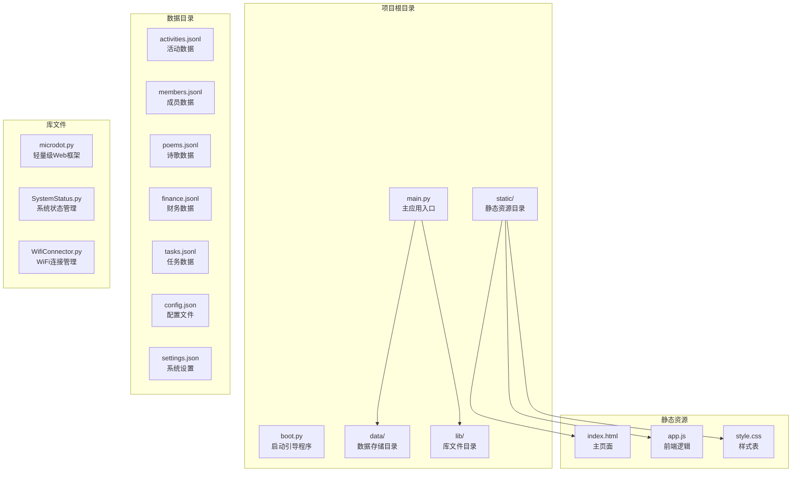
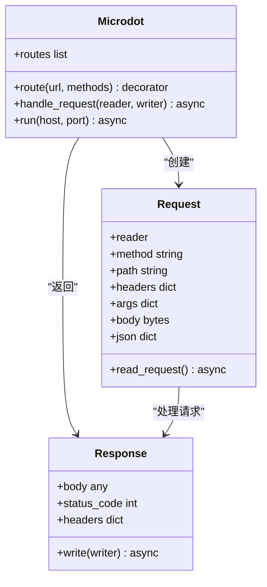
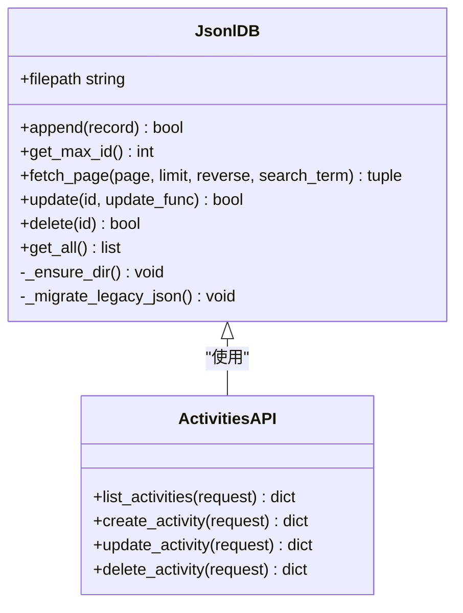
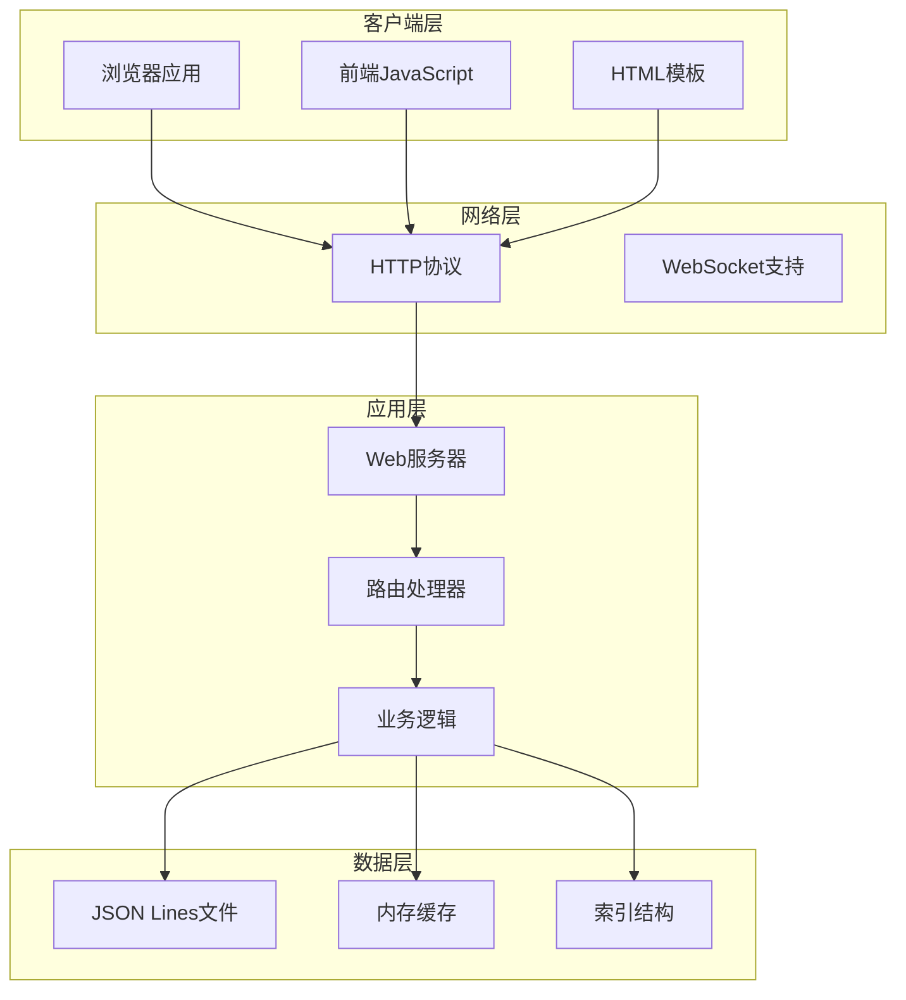
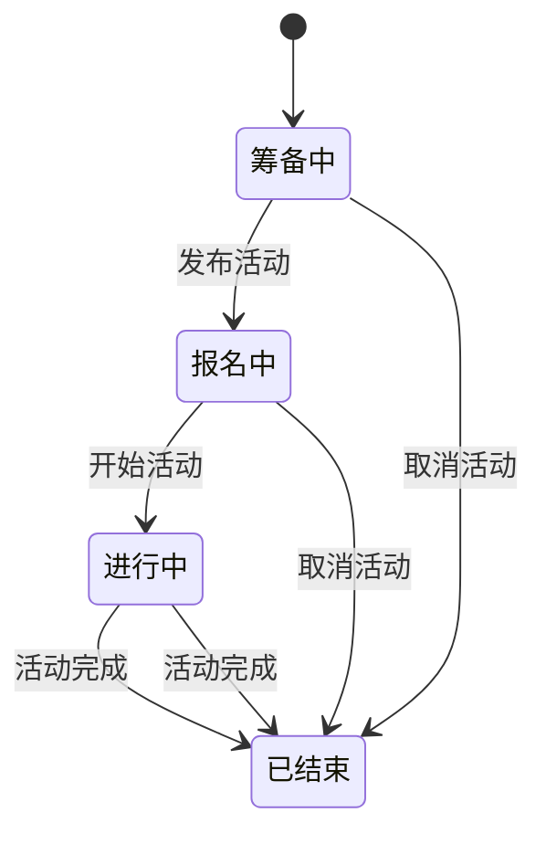
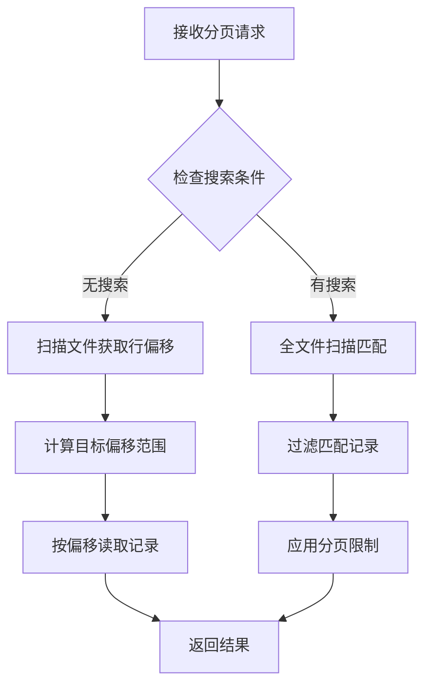
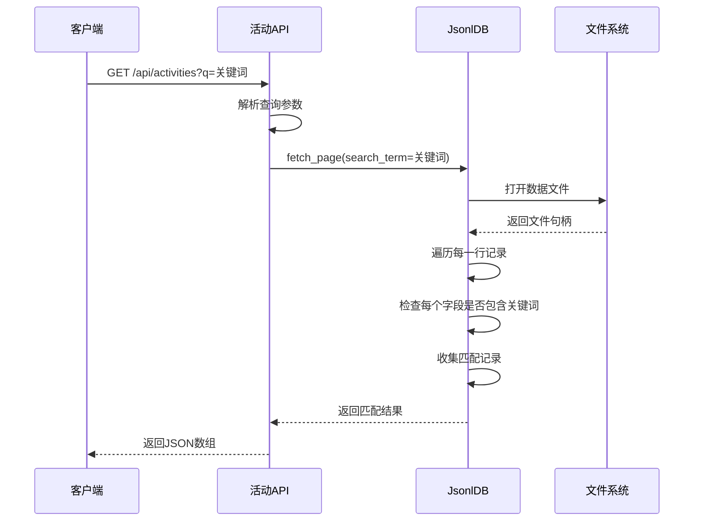
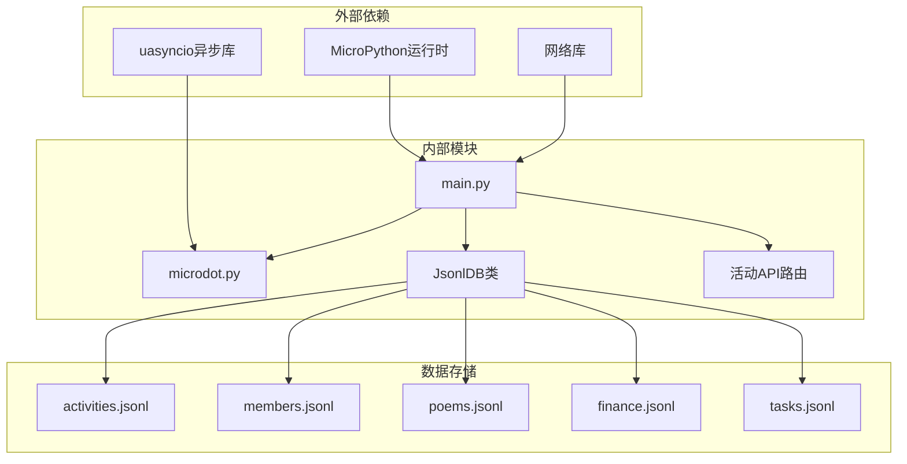
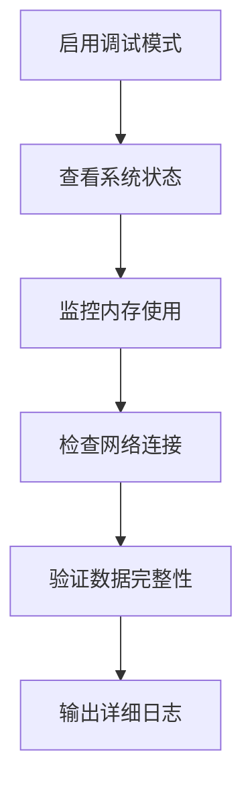

# 活动管理API

<cite>
**本文档引用的文件**
- [main.py](file://main.py)
- [app.js](file://static/app.js)
- [index.html](file://static/index.html)
- [activities.jsonl](file://data/activities.jsonl)
- [config.json](file://data/config.json)
- [settings.json](file://data/settings.json)
- [microdot.py](file://lib/microdot.py)
</cite>

## 目录
1. [简介](#简介)
2. [项目结构](#项目结构)
3. [核心组件](#核心组件)
4. [架构概览](#架构概览)
5. [详细组件分析](#详细组件分析)
6. [依赖关系分析](#依赖关系分析)
7. [性能考虑](#性能考虑)
8. [故障排除指南](#故障排除指南)
9. [结论](#结论)

## 简介

围炉诗社·理事台是一个基于MicroPython的Web应用，专为围炉诗社的日常运营而设计。该项目实现了完整的活动管理系统，支持活动的创建、查询、更新和删除操作。系统采用ESP32微控制器作为服务器，使用JSON Lines格式存储数据，提供RESTful API接口供前端应用调用。

本项目的核心特色包括：
- 基于ESP32的嵌入式Web服务器
- 实时活动状态管理
- 分页查询和全文搜索功能
- 社员权限控制
- 自动化数据持久化

## 项目结构

项目采用模块化的文件组织方式，主要包含以下目录和文件：



**图表来源**
- [main.py](file://main.py#L1-L548)
- [boot.py](file://boot.py#L1-L122)

**章节来源**
- [main.py](file://main.py#L1-L548)
- [boot.py](file://boot.py#L1-L122)

## 核心组件

### Web服务器框架

项目使用自定义的Microdot框架作为Web服务器基础，这是一个轻量级的MicroPython Web框架，专为ESP32等资源受限设备设计。



**图表来源**
- [microdot.py](file://lib/microdot.py#L1-L183)

### 数据存储层

系统采用JSON Lines格式存储数据，每个文件一行存储一条记录，支持高效的随机访问和更新操作。



**图表来源**
- [main.py](file://main.py#L53-L267)

**章节来源**
- [microdot.py](file://lib/microdot.py#L1-L183)
- [main.py](file://main.py#L53-L267)

## 架构概览

系统采用客户端-服务器架构，前端使用纯JavaScript实现，后端基于ESP32的MicroPython环境运行。



**图表来源**
- [main.py](file://main.py#L17-L548)
- [app.js](file://static/app.js#L1-L800)

## 详细组件分析

### 活动管理API接口

#### 活动列表查询

**接口定义**
- 方法：GET
- 路径：`/api/activities`
- 功能：获取活动列表，支持分页和搜索

**请求参数**
- `page` (可选)：页码，默认值为1
- `limit` (可选)：每页记录数，默认值为50
- `q` (可选)：搜索关键词

**响应数据结构**
```javascript
[
  {
    "id": 1,
    "title": "字符串",
    "desc": "字符串",
    "date": "日期时间字符串",
    "location": "字符串",
    "status": "字符串",
    "publisher": "字符串"
  }
]
```

**使用示例**
```javascript
// 获取第1页，每页20条记录
fetch('/api/activities?page=1&limit=20')

// 搜索包含"雪夜"的活动
fetch('/api/activities?q=雪夜')

// 组合查询：第2页，每页10条，搜索"古谱"
fetch('/api/activities?page=2&limit=10&q=古谱')
```

#### 活动创建

**接口定义**
- 方法：POST
- 路径：`/api/activities`
- 功能：创建新的活动

**请求体参数**
- `title` (必需)：活动标题
- `desc` (可选)：活动描述
- `date` (可选)：活动日期时间
- `location` (可选)：活动地点
- `status` (可选)：活动状态
- `publisher` (可选)：发布者

**响应数据结构**
```javascript
{
  "id": 1,
  "title": "字符串",
  "desc": "字符串",
  "date": "日期时间字符串",
  "location": "字符串",
  "status": "字符串",
  "publisher": "字符串"
}
```

**使用示例**
```javascript
const activityData = {
  title: "雪夜新火·原创首发会",
  desc: "主题：以'初雪''新火'为题，创作新诗并首诵",
  date: "2026-01-12T00:52",
  location: "重庆",
  status: "筹备中",
  publisher: "超级管理员"
};

fetch('/api/activities', {
  method: 'POST',
  headers: {
    'Content-Type': 'application/json'
  },
  body: JSON.stringify(activityData)
});
```

#### 活动更新

**接口定义**
- 方法：POST
- 路径：`/api/activities/update`
- 功能：更新现有活动信息

**请求体参数**
- `id` (必需)：活动ID
- `title` (可选)：活动标题
- `desc` (可选)：活动描述
- `date` (可选)：活动日期时间
- `location` (可选)：活动地点
- `status` (可选)：活动状态

**响应数据结构**
```javascript
{
  "status": "success"
}
```

**使用示例**
```javascript
const updateData = {
  id: 1,
  status: "报名中",
  location: "重庆史蒂夫的"
};

fetch('/api/activities/update', {
  method: 'POST',
  headers: {
    'Content-Type': 'application/json'
  },
  body: JSON.stringify(updateData)
});
```

#### 活动删除

**接口定义**
- 方法：POST
- 路径：`/api/activities/delete`
- 功能：删除指定活动

**请求体参数**
- `id` (必需)：活动ID

**响应数据结构**
```javascript
{
  "status": "success"
}
```

**使用示例**
```javascript
fetch('/api/activities/delete', {
  method: 'POST',
  headers: {
    'Content-Type': 'application/json'
  },
  body: JSON.stringify({ id: 1 })
});
```

### 活动实体数据结构

活动实体包含以下字段：

| 字段名 | 类型 | 必需 | 描述 | 默认值 |
|--------|------|------|------|--------|
| id | 整数 | 是 | 活动唯一标识符 | 自动生成 |
| title | 字符串 | 是 | 活动标题 | - |
| desc | 字符串 | 否 | 活动描述 | 空字符串 |
| date | 字符串 | 否 | 活动日期时间 | 空字符串 |
| location | 字符串 | 否 | 活动地点 | 空字符串 |
| status | 字符串 | 否 | 活动状态 | "筹备中" |
| publisher | 字符串 | 否 | 发布者 | "超级管理员" |

### 活动状态管理

系统支持四种活动状态：



状态字段支持以下值：
- "筹备中"：活动正在准备阶段
- "报名中"：活动开放报名
- "进行中"：活动正在进行
- "已结束"：活动已完成

### 分页查询机制

系统实现了一个高效的分页查询机制，支持大数据集的快速访问：



**图表来源**
- [main.py](file://main.py#L113-L186)

### 搜索功能实现

搜索功能支持全文搜索，可以在所有字段中查找匹配内容：



**图表来源**
- [main.py](file://main.py#L372-L381)

**章节来源**
- [main.py](file://main.py#L371-L408)
- [app.js](file://static/app.js#L729-L762)

## 依赖关系分析

系统的主要依赖关系如下：



**图表来源**
- [main.py](file://main.py#L1-L548)
- [microdot.py](file://lib/microdot.py#L1-L183)

**章节来源**
- [main.py](file://main.py#L1-L548)
- [microdot.py](file://lib/microdot.py#L1-L183)

## 性能考虑

### 内存优化策略

系统针对ESP32的内存限制进行了专门优化：

1. **流式处理**：使用生成器模式处理大型数据集
2. **延迟加载**：只在需要时加载数据到内存
3. **内存回收**：定期执行垃圾回收清理内存

### 存储优化

1. **JSON Lines格式**：支持高效的随机访问和更新
2. **增量更新**：使用临时文件避免数据损坏
3. **索引机制**：通过行偏移实现快速定位

### 网络优化

1. **压缩传输**：启用Gzip压缩减少带宽占用
2. **缓存策略**：实现智能缓存避免重复请求
3. **连接池**：复用网络连接提高效率

## 故障排除指南

### 常见问题及解决方案

**问题1：活动列表为空**
- 检查数据文件是否存在
- 验证JSON格式是否正确
- 确认文件权限设置

**问题2：搜索功能异常**
- 检查关键词编码格式
- 验证搜索字段配置
- 确认文件完整性

**问题3：API响应超时**
- 检查网络连接稳定性
- 验证ESP32内存使用情况
- 考虑减少分页大小

**问题4：活动状态更新失败**
- 确认活动ID存在
- 验证权限设置
- 检查数据格式

### 调试工具

系统提供了内置的调试功能：



**章节来源**
- [main.py](file://main.py#L279-L294)
- [boot.py](file://boot.py#L22-L64)

## 结论

围炉诗社·理事台项目成功实现了一个功能完整、性能优异的活动管理系统。系统采用的技术方案充分考虑了嵌入式环境的限制，实现了高效的数据存储、灵活的API接口和友好的用户界面。

主要优势包括：
- **可靠性**：基于ESP32的稳定运行环境
- **易用性**：简洁直观的RESTful API设计
- **扩展性**：模块化的架构便于功能扩展
- **维护性**：清晰的代码结构和完善的注释

该系统为围炉诗社的日常运营提供了强有力的技术支撑，也为类似的文化组织管理应用提供了优秀的参考范例。