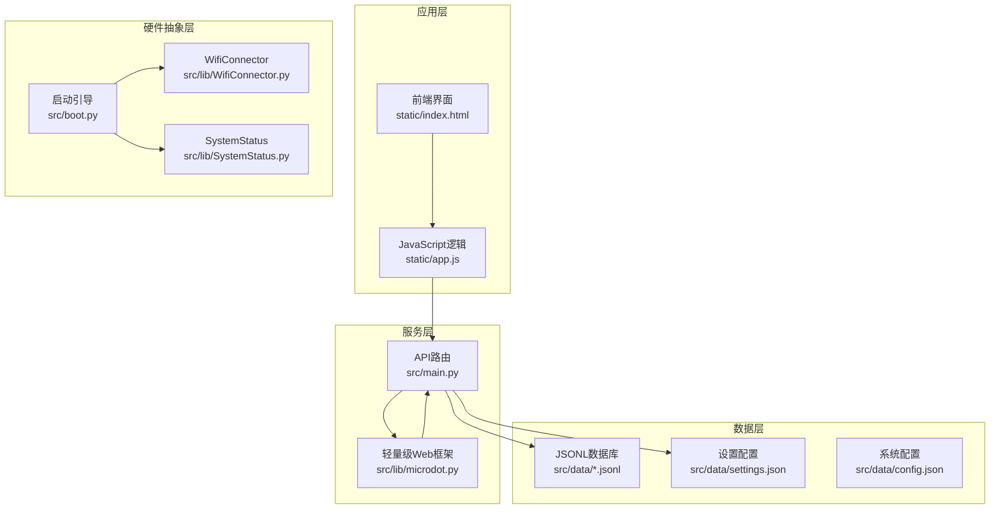
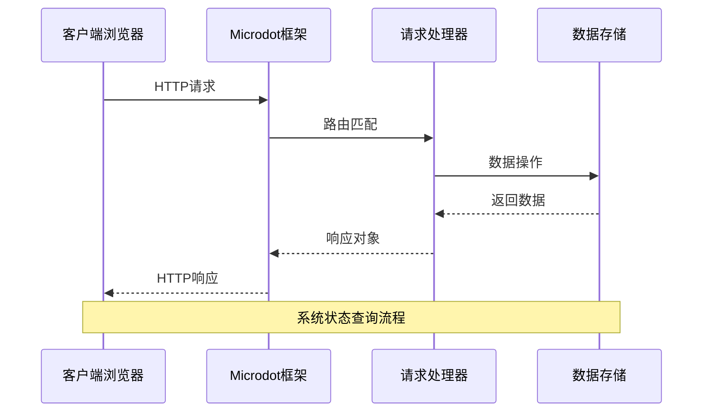
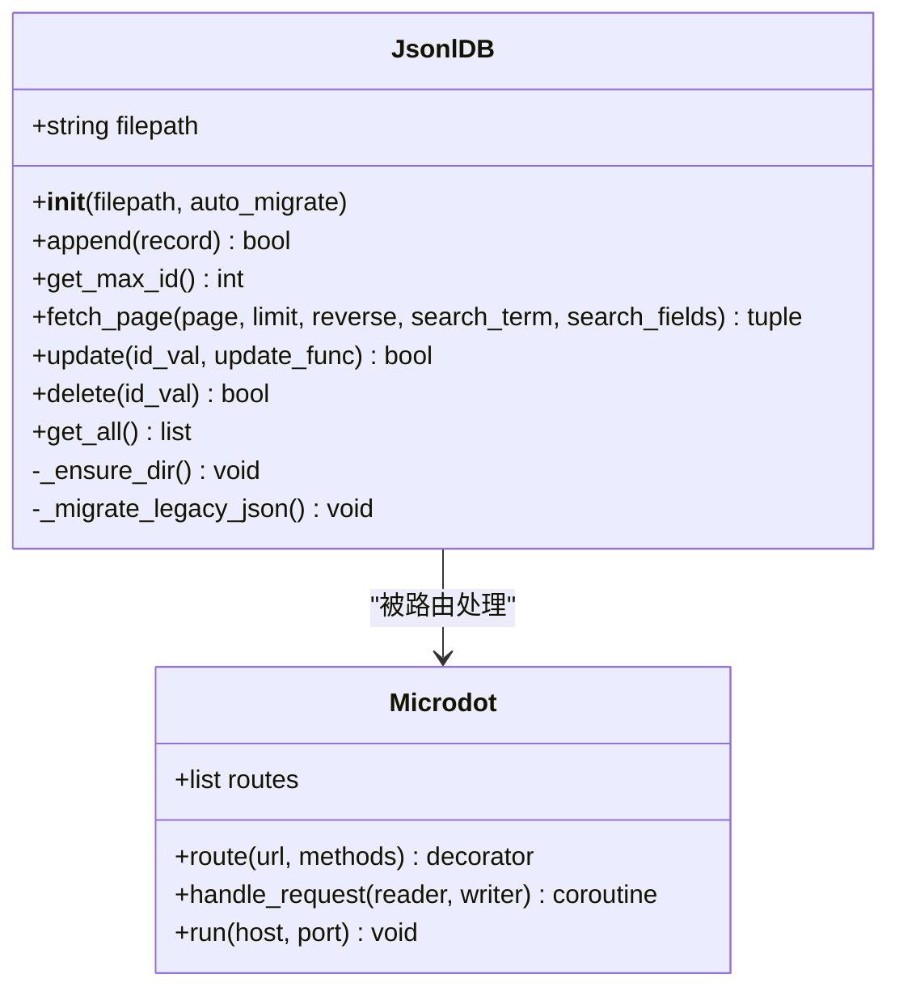
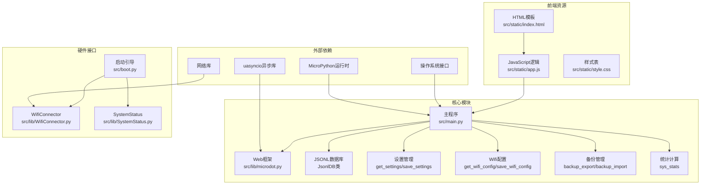

# 系统管理API

<cite>
**本文档引用的文件**
- [main.py](file://src/main.py)
- [boot.py](file://src/boot.py)
- [microdot.py](file://src/lib/microdot.py)
- [SystemStatus.py](file://src/lib/SystemStatus.py)
- [WifiConnector.py](file://src/lib/WifiConnector.py)
- [index.html](file://src/static/index.html)
- [app.js](file://src/static/app.js)
- [config.json](file://src/data/config.json)
- [settings.json](file://src/data/settings.json)
</cite>

## 更新摘要
**所做更改**
- 新增系统统计接口（/api/system/stats）文档
- 新增备份导出接口（/api/backup/export）文档  
- 新增备份导入接口（/api/backup/import）文档
- 新增WiFi配置管理接口（/api/wifi/config）文档
- 更新系统信息接口（/api/system/info）以包含总内存信息
- 更新系统管理API架构图以反映新增功能
- 增强错误处理和返回码说明

## 目录
1. [简介](#简介)
2. [项目结构](#项目结构)
3. [核心组件](#核心组件)
4. [架构概览](#架构概览)
5. [详细组件分析](#详细组件分析)
6. [依赖关系分析](#依赖关系分析)
7. [性能考虑](#性能考虑)
8. [故障排除指南](#故障排除指南)
9. [结论](#结论)

## 简介

围炉诗社·理事台是一个基于ESP32微控制器的诗社管理系统，采用MicroPython开发。该项目实现了完整的Web应用，包括诗词管理、活动组织、成员管理、财务管理等功能。系统管理API是整个应用的核心，负责提供系统状态查询、配置管理、数据备份恢复等系统级功能。

本项目特别注重资源管理和性能优化，针对ESP32的内存限制进行了专门的优化设计，包括内存回收、文件系统操作优化等。新增的系统管理功能进一步增强了系统的可维护性和可靠性。

## 项目结构

项目采用清晰的分层架构，主要分为以下几个层次：



**图表来源**
- [main.py](file://src/main.py#L1-L1164)
- [boot.py](file://src/boot.py#L1-L137)
- [microdot.py](file://src/lib/microdot.py#L1-L183)

**章节来源**
- [main.py](file://src/main.py#L1-L1164)
- [boot.py](file://src/boot.py#L1-L137)
- [microdot.py](file://src/lib/microdot.py#L1-L183)

## 核心组件

### Web框架组件

系统使用自定义的轻量级Web框架Microdot，专门为ESP32环境优化：

- **请求处理**: 支持HTTP请求解析、参数提取、头部处理
- **响应生成**: 自动处理JSON序列化、Content-Type设置
- **路由管理**: 简单的URL路由映射和HTTP方法匹配
- **异步支持**: 基于uasyncio的异步处理能力

### 数据存储组件

采用JSONL（JSON Lines）格式存储数据，具有以下特点：

- **流式读取**: 支持大文件的逐行读取，避免内存溢出
- **增量写入**: 新记录直接追加到文件末尾
- **高效更新**: 通过临时文件实现原子更新操作
- **内存优化**: 大数据集只加载必要部分

### 系统管理组件

- **系统状态监控**: 实时获取存储空间、内存使用情况、总内存信息
- **WiFi连接管理**: 自动连接、热点创建、连接状态监控
- **LED状态指示**: 通过单色LED显示系统运行状态
- **数据备份恢复**: 支持全站数据导出和导入功能
- **配置管理**: WiFi配置、系统设置的管理接口

**章节来源**
- [microdot.py](file://src/lib/microdot.py#L1-L183)
- [main.py](file://src/main.py#L53-L267)
- [SystemStatus.py](file://src/lib/SystemStatus.py#L1-L61)

## 架构概览

系统采用客户端-服务器架构，前端使用纯HTML/CSS/JavaScript，后端使用Python实现RESTful API。



**图表来源**
- [microdot.py](file://src/lib/microdot.py#L104-L151)
- [main.py](file://src/main.py#L1005-L1023)

**章节来源**
- [main.py](file://src/main.py#L299-L1164)
- [microdot.py](file://src/lib/microdot.py#L94-L165)

## 详细组件分析

### 系统信息查询API

#### 接口定义

**端点**: `/api/system/info`

**HTTP方法**: GET

**功能**: 查询系统当前状态信息，包括平台信息、存储空间、内存使用情况、总内存信息

**请求参数**: 无

**响应格式**:
```json
{
    "platform": "ESP32",
    "free_storage": 1048576,
    "total_storage": 4194304,
    "free_ram": 81920,
    "total_ram": 2097152
}
```

**响应字段说明**:
- `platform`: 系统平台标识，固定为"ESP32"
- `free_storage`: 可用存储空间（字节）
- `total_storage`: 总存储空间（字节）
- `free_ram`: 可用内存大小（字节）
- `total_ram`: 总内存大小（字节），若无法获取则默认2048KB

**使用示例**:
```javascript
// 前端JavaScript调用示例
async function loadSystemInfo() {
    try {
        const res = await fetch('/api/system/info');
        const info = await res.json();
        
        // 转换为KB单位显示
        const free = Math.round(info.free_storage / 1024);
        const total = Math.round(info.total_storage / 1024);
        const freeRam = Math.round((info.free_ram || 0) / 1024);
        const totalRam = Math.round((info.total_ram || 0) / 1024);
        
        console.log(`存储空间: ${free}KB / ${total}KB`);
        console.log(`可用内存: ${freeRam}KB / ${totalRam}KB`);
    } catch(e) {
        console.error('获取系统信息失败:', e);
    }
}
```

**错误处理**:
- 系统异常时返回空对象 `{}`，前端需进行兼容性处理
- 建议在生产环境中添加更完善的错误处理逻辑

**章节来源**
- [main.py](file://src/main.py#L1005-L1023)
- [app.js](file://src/static/app.js#L1029-L1106)

### 系统统计接口

#### 接口定义

**端点**: `/api/system/stats`

**HTTP方法**: GET

**功能**: 获取各模块数据统计信息，包括社员、诗作、活动、事务、财务记录的数量

**请求参数**: 无

**响应格式**:
```json
{
    "members": 150,
    "poems": 2340,
    "activities": 89,
    "tasks": 156,
    "finance": 342
}
```

**响应字段说明**:
- `members`: 社员总数
- `poems`: 诗作总数  
- `activities`: 活动总数
- `tasks`: 事务总数
- `finance`: 财务记录总数

**使用示例**:
```javascript
// 前端JavaScript调用示例
async function loadSystemStats() {
    try {
        const res = await fetch('/api/system/stats');
        const stats = await res.json();
        
        // 更新统计卡片
        document.getElementById('stat-members').textContent = stats.members;
        document.getElementById('stat-poems').textContent = stats.poems;
        document.getElementById('stat-activities').textContent = stats.activities;
        document.getElementById('stat-tasks').textContent = stats.tasks;
        document.getElementById('stat-finance').textContent = stats.finance;
        
    } catch(e) {
        console.error('获取系统统计失败:', e);
    }
}
```

**错误处理**:
- 统计过程中出现异常时返回空对象 `{}`
- 建议前端进行空对象检查和降级处理

**章节来源**
- [main.py](file://src/main.py#L1025-L1047)
- [app.js](file://src/static/app.js#L1107-L1140)

### 备份导出接口

#### 接口定义

**端点**: `/api/backup/export`

**HTTP方法**: GET

**功能**: 导出全站数据备份，包括所有业务数据和配置信息

**请求参数**: 无

**响应格式**:
```json
{
    "version": "1.0",
    "data": {
        "members": [...],
        "poems": [...],
        "activities": [...],
        "tasks": [...],
        "finance": [...],
        "points_logs": [...],
        "login_logs": [...],
        "settings": {...},
        "wifi_config": {
            "wifi_ssid": "example_wifi",
            "sta_use_static_ip": false,
            "sta_ip": "",
            "sta_subnet": "255.255.255.0",
            "sta_gateway": "",
            "sta_dns": "8.8.8.8",
            "ap_ssid": "PoetrySociety_AP",
            "ap_ip": "192.168.18.1"
        }
    }
}
```

**响应字段说明**:
- `version`: 备份文件版本号
- `data`: 包含所有备份数据的对象
- `members`: 社员数据数组
- `poems`: 诗作数据数组
- `activities`: 活动数据数组
- `tasks`: 事务数据数组
- `finance`: 财务数据数组
- `points_logs`: 积分日志数据数组
- `login_logs`: 登录日志数据数组
- `settings`: 系统设置数据
- `wifi_config`: WiFi配置信息（密码字段不包含）

**使用示例**:
```javascript
// 前端JavaScript调用示例
async function exportBackup() {
    try {
        const res = await fetch('/api/backup/export');
        if(!res.ok) {
            throw new Error('导出请求失败');
        }
        const backup = await res.json();
        
        // 创建下载文件名
        const now = new Date();
        const timestamp = now.getFullYear() + 
            String(now.getMonth() + 1).padStart(2, '0') + 
            String(now.getDate()).padStart(2, '0') + '_' +
            String(now.getHours()).padStart(2, '0') + 
            String(now.getMinutes()).padStart(2, '0');
        const filename = `backup_${timestamp}.json`;
        
        // 下载备份文件
        const blob = new Blob([JSON.stringify(backup, null, 2)], {type: 'application/json'});
        const url = URL.createObjectURL(blob);
        const a = document.createElement('a');
        a.href = url;
        a.download = filename;
        document.body.appendChild(a);
        a.click();
        URL.revokeObjectURL(url);
        document.body.removeChild(a);
        
        alert('备份导出成功');
    } catch(e) {
        console.error(e);
        alert('导出失败: ' + e.message);
    }
}
```

**错误处理**:
- 导出过程中出现异常时返回错误响应
- 建议前端捕获异常并显示友好的错误信息

**章节来源**
- [main.py](file://src/main.py#L1049-L1084)
- [app.js](file://src/static/app.js#L2083-L2115)

### 备份导入接口

#### 接口定义

**端点**: `/api/backup/import`

**HTTP方法**: POST

**功能**: 导入数据备份，恢复所有业务数据和配置信息

**请求参数**: JSON格式的备份数据对象

**请求体格式**:
```json
{
    "version": "1.0",
    "data": {
        "members": [...],
        "poems": [...],
        "activities": [...],
        "tasks": [...],
        "finance": [...],
        "points_logs": [...],
        "login_logs": [...],
        "settings": {...},
        "wifi_config": {...}
    }
}
```

**响应格式**:
```json
{
    "status": "success",
    "message": "数据恢复成功"
}
```

**使用示例**:
```javascript
// 前端JavaScript调用示例
async function importBackup(event) {
    const file = event.target.files[0];
    if(!file) return;
    
    if(!confirm('导入数据将覆盖现有所有数据，此操作不可逆！\n\n确定要继续吗？')) {
        document.getElementById('backup-file-input').value = '';
        return;
    }
    
    try {
        const text = await file.text();
        let backup;
        try {
            backup = JSON.parse(text);
        } catch(parseErr) {
            throw new Error('文件格式无效，请选择正确的备份文件');
        }
        
        if(!backup.version || !backup.data) {
            throw new Error('备份文件结构不完整');
        }
        
        const res = await fetch('/api/backup/import', {
            method: 'POST',
            headers: {'Content-Type': 'application/json'},
            body: JSON.stringify(backup)
        });
        
        if(res.ok) {
            alert('数据恢复成功，页面将刷新');
            location.reload();
        } else {
            const err = await res.json();
            throw new Error(err.error || '未知错误');
        }
    } catch(e) {
        console.error(e);
        alert('导入失败: ' + e.message);
    }
    
    document.getElementById('backup-file-input').value = '';
}
```

**错误处理**:
- 文件格式无效时返回400错误
- 备份文件结构不完整时返回400错误
- 导入过程中出现异常时返回500错误
- 建议前端提供确认对话框防止误操作

**章节来源**
- [main.py](file://src/main.py#L1086-L1155)
- [app.js](file://src/static/app.js#L2117-L2162)

### WiFi配置管理接口

#### 接口定义

**端点**: `/api/wifi/config`

**HTTP方法**: GET, POST

**功能**: 管理WiFi配置信息，包括STA模式和AP模式的配置

**GET请求**:
- **HTTP方法**: GET
- **功能**: 获取当前WiFi配置信息
- **响应**: 当前配置对象

**POST请求**:
- **HTTP方法**: POST
- **功能**: 更新WiFi配置信息
- **请求体**: 配置对象
- **响应**: 成功状态对象

**请求参数**:
- **GET**: 无参数
- **POST**: 配置对象，包含以下字段：
  - `wifi_ssid`: WiFi名称（必填）
  - `wifi_password`: WiFi密码（可选）
  - `sta_use_static_ip`: 是否使用静态IP（布尔值）
  - `sta_ip`: 静态IP地址
  - `sta_subnet`: 子网掩码
  - `sta_gateway`: 网关地址
  - `sta_dns`: DNS服务器
  - `ap_ssid`: AP热点名称
  - `ap_password`: AP热点密码
  - `ap_ip`: AP热点IP地址

**响应格式**:
```json
// GET请求响应示例
{
    "wifi_ssid": "example_wifi",
    "sta_use_static_ip": false,
    "sta_ip": "",
    "sta_subnet": "255.255.255.0",
    "sta_gateway": "",
    "sta_dns": "8.8.8.8",
    "ap_ssid": "PoetrySociety_AP",
    "ap_ip": "192.168.18.1"
}

// POST请求响应示例
{
    "status": "success",
    "message": "WiFi配置已保存，重启后生效"
}
```

**使用示例**:
```javascript
// 获取当前WiFi配置
async function loadWifiConfig() {
    try {
        const res = await fetch('/api/wifi/config');
        if(res.ok) {
            const config = await res.json();
            // 填充表单字段
            document.getElementById('wifi-ssid').value = config.wifi_ssid || '';
            document.getElementById('wifi-ap-ssid').value = config.ap_ssid || '';
            document.getElementById('wifi-ap-ip').value = config.ap_ip || '192.168.18.1';
            
            // 设置IP获取方式
            const staticRadio = document.querySelector('input[name="wifi-ip-mode"][value="static"]');
            const dhcpRadio = document.querySelector('input[name="wifi-ip-mode"][value="dhcp"]');
            if(config.sta_use_static_ip && staticRadio) {
                staticRadio.checked = true;
            } else if(dhcpRadio) {
                dhcpRadio.checked = true;
            }
            toggleStaticIpFields();
        }
    } catch(e) {
        console.error('获取WiFi配置失败:', e);
    }
}

// 保存WiFi配置
async function saveWifiConfig() {
    const staticRadio = document.querySelector('input[name="wifi-ip-mode"][value="static"]');
    const config = {
        wifi_ssid: document.getElementById('wifi-ssid')?.value || '',
        sta_use_static_ip: staticRadio?.checked || false,
        sta_ip: document.getElementById('wifi-sta-ip')?.value || '',
        sta_subnet: document.getElementById('wifi-sta-subnet')?.value || '255.255.255.0',
        sta_gateway: document.getElementById('wifi-sta-gateway')?.value || '',
        sta_dns: document.getElementById('wifi-sta-dns')?.value || '8.8.8.8',
        ap_ssid: document.getElementById('wifi-ap-ssid')?.value || '',
        ap_ip: document.getElementById('wifi-ap-ip')?.value || '192.168.18.1'
    };
    
    // 只有输入了密码才发送
    const wifiPwd = document.getElementById('wifi-password')?.value;
    if(wifiPwd) config.wifi_password = wifiPwd;
    
    const apPwd = document.getElementById('wifi-ap-password')?.value;
    if(apPwd) config.ap_password = apPwd;
    
    if(!config.wifi_ssid) {
        alert('请输入WiFi名称');
        return;
    }
    
    try {
        const res = await fetch('/api/wifi/config', {
            method: 'POST',
            headers: {'Content-Type': 'application/json'},
            body: JSON.stringify(config)
        });
        
        if(res.ok) {
            alert('WiFi配置已保存，重启设备后生效');
        } else {
            const err = await res.json();
            alert('保存失败: ' + (err.error || '未知错误'));
        }
    } catch(e) {
        console.error(e);
        alert('网络错误');
    }
}
```

**错误处理**:
- WiFi密码长度不足8位时返回错误
- 配置参数验证失败时返回错误
- 保存过程中出现异常时返回错误
- 建议前端进行基本的表单验证

**章节来源**
- [main.py](file://src/main.py#L951-L1003)
- [app.js](file://src/static/app.js#L2039-L2081)

### 设置字段管理API

#### 接口定义

**端点**: `/api/settings/fields`

**功能**: 管理社员资料的自定义字段配置

**GET请求**:
- **HTTP方法**: GET
- **功能**: 获取当前的自定义字段配置
- **响应**: 字段配置数组

**POST请求**:
- **HTTP方法**: POST
- **功能**: 更新自定义字段配置
- **请求体**: 字段配置数组
- **响应**: 成功状态对象

**请求参数**:
- **GET**: 无参数
- **POST**: JSON格式的字段配置数组

**响应格式**:
```json
// GET请求响应示例
[
    {
        "id": "cf_1769341584847",
        "type": "date",
        "label": "入社日期"
    }
]

// POST请求响应示例
{
    "status": "success"
}
```

**字段配置说明**:
- `id`: 字段唯一标识符，格式为`cf_` + 时间戳
- `type`: 字段类型，支持"text"、"number"、"date"、"email"
- `label`: 字段显示名称

**使用示例**:
```javascript
// 获取字段配置
async function fetchCustomFields() {
    try {
        const res = await fetch('/api/settings/fields');
        if(res.ok) _customFields = await res.json();
    } catch(e) { 
        console.error('获取自定义字段失败', e); 
    }
}

// 添加新字段
async function addCustomField(label, type) {
    const newField = { 
        id: 'cf_' + Date.now(), 
        label: label, 
        type: type 
    };
    const newFields = [..._customFields, newField];
    
    await saveCustomFields(newFields);
}

// 保存字段配置
async function saveCustomFields(fields) {
    try {
        const res = await fetch('/api/settings/fields', {
            method: 'POST',
            headers: {'Content-Type': 'application/json'},
            body: JSON.stringify(fields)
        });
        if(res.ok) {
            _customFields = fields;
            renderAdminSettings(); 
            alert('设置已保存');
        } else {
            alert('保存失败');
        }
    } catch(e) { 
        console.error(e); 
        alert('网络错误'); 
    }
}
```

**错误处理**:
- 字段重复时前端会阻止保存
- 网络错误时显示相应的提示信息
- 保存成功后自动刷新页面显示

**章节来源**
- [main.py](file://src/main.py#L518-L526)
- [app.js](file://src/static/app.js#L1246-L1312)
- [settings.json](file://src/data/settings.json#L1-L5)

### 数据存储组件

#### JSONL数据库管理器

系统使用自定义的JsonlDB类管理JSONL格式的数据文件：



**图表来源**
- [main.py](file://src/main.py#L53-L267)
- [microdot.py](file://src/lib/microdot.py#L94-L165)

**核心特性**:
- **内存优化**: 分页读取，避免一次性加载大文件
- **搜索功能**: 支持全文搜索和字段过滤
- **原子更新**: 通过临时文件实现安全的数据更新
- **兼容性**: 自动迁移旧的JSON格式文件

**章节来源**
- [main.py](file://src/main.py#L53-L267)

### 系统状态监控

#### 内存管理

系统在查询系统信息时会主动进行垃圾回收：

```python
@app.route('/api/system/info')
def sys_info(request):
    try:
        gc.collect()  # 手动垃圾回收
        s = os.statvfs('/')  # 获取文件系统统计信息
        return {
            "platform": "ESP32",
            "free_storage": s[0]*s[3],
            "total_storage": s[0]*s[2],
            "free_ram": gc.mem_free(),  # 获取可用内存
            "total_ram": gc.mem_free() + gc.mem_alloc()  # 获取总内存
        }
    except: return {}
```

#### 存储空间查询

使用`os.statvfs()`获取文件系统的存储信息：
- `s[0]`: 文件系统块大小
- `s[1]`: 文件系统块数量
- `s[2]`: 总块数
- `s[3]`: 可用块数

**章节来源**
- [main.py](file://src/main.py#L1005-L1023)

## 依赖关系分析

系统各组件之间的依赖关系如下：



**图表来源**
- [main.py](file://src/main.py#L1-L17)
- [boot.py](file://src/boot.py#L1-L12)
- [microdot.py](file://src/lib/microdot.py#L1-L4)

**章节来源**
- [main.py](file://src/main.py#L1-L17)
- [boot.py](file://src/boot.py#L1-L12)
- [microdot.py](file://src/lib/microdot.py#L1-L4)

## 性能考虑

### 内存优化策略

1. **垃圾回收**: 在系统信息查询时主动触发垃圾回收
2. **流式处理**: JSONL数据库采用逐行读取，避免内存溢出
3. **分页机制**: API接口默认限制返回数量，支持分页查询
4. **缓存策略**: 前端对常用数据进行缓存，减少重复请求
5. **内存监控**: 新增总内存信息获取，帮助开发者监控内存使用

### 存储优化

1. **文件系统统计**: 使用`os.statvfs()`获取准确的存储信息
2. **增量写入**: 新记录直接追加到文件末尾，避免全文件重写
3. **临时文件**: 更新操作使用临时文件，确保数据一致性
4. **备份压缩**: 备份文件采用JSON格式，便于传输和存储

### 网络优化

1. **轻量级框架**: 自定义的Microdot框架，体积小、性能好
2. **异步处理**: 基于uasyncio的异步请求处理
3. **压缩传输**: 前端对搜索结果进行高亮显示，减少不必要的数据传输
4. **批量操作**: 备份导入支持批量数据恢复，提高效率

## 故障排除指南

### 常见问题及解决方案

#### 系统信息查询失败

**症状**: `/api/system/info` 返回空对象

**可能原因**:
1. 系统异常导致的文件系统访问错误
2. 内存不足导致的垃圾回收失败
3. 文件系统损坏

**解决方法**:
```python
# 在main.py中添加更完善的错误处理
@app.route('/api/system/info')
def sys_info(request):
    try:
        gc.collect()
        s = os.statvfs('/')
        return {
            "platform": "ESP32",
            "free_storage": s[0]*s[3],
            "total_storage": s[0]*s[2],
            "free_ram": gc.mem_free(),
            "total_ram": gc.mem_free() + gc.mem_alloc()
        }
    except Exception as e:
        print(f"[Error] System info query failed: {e}")
        return {
            "platform": "ESP32",
            "free_storage": 0,
            "total_storage": 0,
            "free_ram": 0,
            "total_ram": 0
        }
```

#### 系统统计查询失败

**症状**: `/api/system/stats` 返回空对象

**可能原因**:
1. 数据库文件损坏或不存在
2. 文件权限问题
3. 磁盘空间不足

**解决方法**:
```python
# 在main.py中添加更完善的错误处理
@app.route('/api/system/stats')
def sys_stats(request):
    try:
        # 统计各模块数量
        members_count = len(db_members.get_all())
        poems_count = len(db_poems.get_all())
        activities_count = len(db_activities.get_all())
        tasks_count = len(db_tasks.get_all())
        finance_count = len(db_finance.get_all())
        
        gc.collect()
        
        return {
            "members": members_count,
            "poems": poems_count,
            "activities": activities_count,
            "tasks": tasks_count,
            "finance": finance_count
        }
    except Exception as e:
        print(f"[Stats Error] {e}")
        return {}
```

#### 备份导出失败

**症状**: `/api/backup/export` 返回错误

**可能原因**:
1. 数据库文件读取失败
2. 内存不足导致JSON序列化失败
3. 文件权限问题

**解决方法**:
```python
# 在main.py中添加更完善的错误处理
@app.route('/api/backup/export')
def backup_export(request):
    try:
        # 获取WiFi配置（密码不导出，安全考虑）
        wifi_config = get_wifi_config()
        wifi_backup = {
            "wifi_ssid": wifi_config.get('wifi_ssid', ''),
            "sta_use_static_ip": wifi_config.get('sta_use_static_ip', False),
            "sta_ip": wifi_config.get('sta_ip', ''),
            "sta_subnet": wifi_config.get('sta_subnet', '255.255.255.0'),
            "sta_gateway": wifi_config.get('sta_gateway', ''),
            "sta_dns": wifi_config.get('sta_dns', '8.8.8.8'),
            "ap_ssid": wifi_config.get('ap_ssid', ''),
            "ap_ip": wifi_config.get('ap_ip', '192.168.18.1')
        }
        
        backup_data = {
            "version": "1.0",
            "data": {
                "members": db_members.get_all(),
                "poems": db_poems.get_all(),
                "activities": db_activities.get_all(),
                "tasks": db_tasks.get_all(),
                "finance": db_finance.get_all(),
                "points_logs": db_points_logs.get_all(),
                "login_logs": db_login_logs.get_all(),
                "settings": get_settings(),
                "wifi_config": wifi_backup
            }
        }
        gc.collect()
        return backup_data
    except Exception as e:
        print(f"[Backup Export Error] {e}")
        return Response('{"error": "导出失败"}', 500, {'Content-Type': 'application/json'})
```

#### 备份导入失败

**症状**: `/api/backup/import` 返回错误

**可能原因**:
1. JSON格式不正确
2. 文件权限问题
3. 磁盘空间不足
4. 数据格式不兼容

**解决方法**:
```python
# 在main.py中添加更完善的错误处理
@app.route('/api/backup/import', methods=['POST'])
def backup_import(request):
    try:
        backup = request.json
        if not backup or 'version' not in backup or 'data' not in backup:
            return Response('{"error": "无效的备份文件"}', 400, {'Content-Type': 'application/json'})
        
        data = backup['data']
        
        # 逐个恢复数据
        if 'members' in data:
            with open('data/members.jsonl', 'w') as f:
                for item in data['members']:
                    f.write(json.dumps(item) + "\n")
        
        # ... 其他数据恢复逻辑 ...
        
        # 恢复WiFi配置（保留原有密码）
        if 'wifi_config' in data:
            existing_config = get_wifi_config()
            new_config = data['wifi_config']
            # 保留原有密码，只更新非敏感配置
            existing_config['wifi_ssid'] = new_config.get('wifi_ssid', existing_config.get('wifi_ssid', ''))
            existing_config['sta_use_static_ip'] = new_config.get('sta_use_static_ip', False)
            existing_config['sta_ip'] = new_config.get('sta_ip', '')
            existing_config['sta_subnet'] = new_config.get('sta_subnet', '255.255.255.0')
            existing_config['sta_gateway'] = new_config.get('sta_gateway', '')
            existing_config['sta_dns'] = new_config.get('sta_dns', '8.8.8.8')
            existing_config['ap_ssid'] = new_config.get('ap_ssid', existing_config.get('ap_ssid', ''))
            existing_config['ap_ip'] = new_config.get('ap_ip', '192.168.18.1')
            save_wifi_config(existing_config)
        
        gc.collect()
        return {"status": "success", "message": "数据恢复成功"}
    except Exception as e:
        print(f"[Backup Import Error] {e}")
        return Response('{"error": "导入失败"}', 500, {'Content-Type': 'application/json'})
```

#### WiFi配置保存失败

**症状**: `/api/wifi/config` POST请求返回保存失败

**可能原因**:
1. WiFi密码长度不足8位
2. IP地址格式不正确
3. 文件权限问题
4. 磁盘空间不足

**解决方法**:
```python
# 在main.py中添加更完善的错误处理
@app.route('/api/wifi/config', methods=['GET', 'POST'])
def wifi_config(request):
    if request.method == 'GET':
        # 获取WiFi配置逻辑
        pass
    else:  # POST
        try:
            config = request.json
            # 参数验证
            if not config.get('wifi_ssid'):
                return Response('{"error": "WiFi名称不能为空"}', 400, {'Content-Type': 'application/json'})
            
            if config.get('wifi_password') and len(config.get('wifi_password', '')) < 8:
                return Response('{"error": "WiFi密码长度必须至少8位"}', 400, {'Content-Type': 'application/json'})
            
            # 保存配置逻辑
            if save_wifi_config(config):
                return {"status": "success", "message": "WiFi配置已保存，重启后生效"}
            else:
                return Response('{"error": "保存失败"}', 500, {'Content-Type': 'application/json'})
        except Exception as e:
            print(f"[WiFi Config Error] {e}")
            return Response('{"error": "配置无效"}', 400, {'Content-Type': 'application/json'})
```

#### WiFi连接问题

**症状**: 系统无法连接到WiFi网络

**可能原因**:
1. 配置文件缺失或格式错误
2. 网络凭据错误
3. 硬件问题

**解决方法**:
```python
# 在boot.py中添加更详细的错误信息
def connect_wifi():
    try:
        config = load_config()
        if not config:
            print("Config not found, skipping WiFi connection.")
            return
        
        ssid = config.get('wifi_ssid')
        password = config.get('wifi_password')
        
        if ssid == "YOUR_WIFI_SSID":
            print("WiFi not configured. Starting in AP mode...")
            start_ap(config)
            return
        
        # 连接逻辑...
        
    except Exception as e:
        print(f"[Error] WiFi connection failed: {e}")
        print("Switching to AP mode...")
        start_ap(config)
```

**章节来源**
- [main.py](file://src/main.py#L1005-L1155)
- [app.js](file://src/static/app.js#L2039-L2162)
- [boot.py](file://src/boot.py#L22-L64)

## 结论

围炉诗社·理事台项目展示了如何在资源受限的嵌入式环境中构建完整的Web应用。通过精心设计的架构和优化策略，系统能够在ESP32上稳定运行，提供完整的系统管理功能。

### 主要优势

1. **资源优化**: 针对ESP32的内存和存储限制进行了专门优化
2. **功能完整**: 新增系统统计、备份恢复、WiFi配置管理等高级功能
3. **数据安全**: 备份导出不包含敏感信息，导入前进行完整性验证
4. **易用性强**: 提供完整的系统管理API和用户界面
5. **稳定性高**: 新增全面的错误处理和故障排除机制

### 技术特色

1. **JSONL数据存储**: 解决了嵌入式环境下的大数据存储问题
2. **内存管理**: 通过垃圾回收和流式处理优化内存使用
3. **异步处理**: 利用MicroPython的异步特性提升响应速度
4. **状态监控**: 实时监控系统资源使用情况
5. **数据备份**: 支持全站数据的导出和导入功能
6. **配置管理**: 提供灵活的WiFi配置管理接口

### 发展建议

1. **监控增强**: 考虑添加更多系统监控指标，如CPU温度、网络状态等
2. **安全加固**: 增强身份验证和数据加密功能
3. **性能优化**: 进一步优化大数据量场景下的查询性能
4. **用户体验**: 优化前端交互和响应速度，提供更好的用户体验
5. **文档完善**: 为新增功能编写更详细的API文档和使用指南

这个项目为嵌入式Web应用开发提供了优秀的参考案例，展示了如何在有限的资源下实现复杂的功能需求。新增的系统管理功能进一步提升了项目的实用性和可维护性，为类似项目的开发提供了宝贵的经验和技术积累。