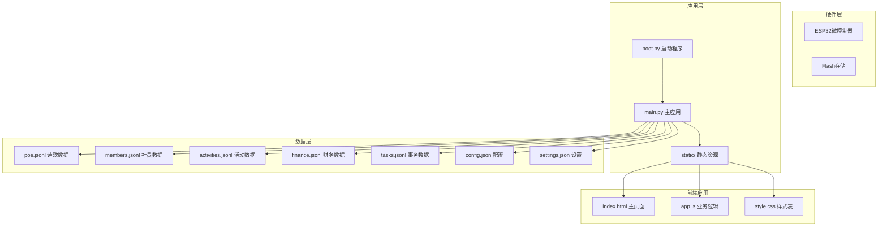
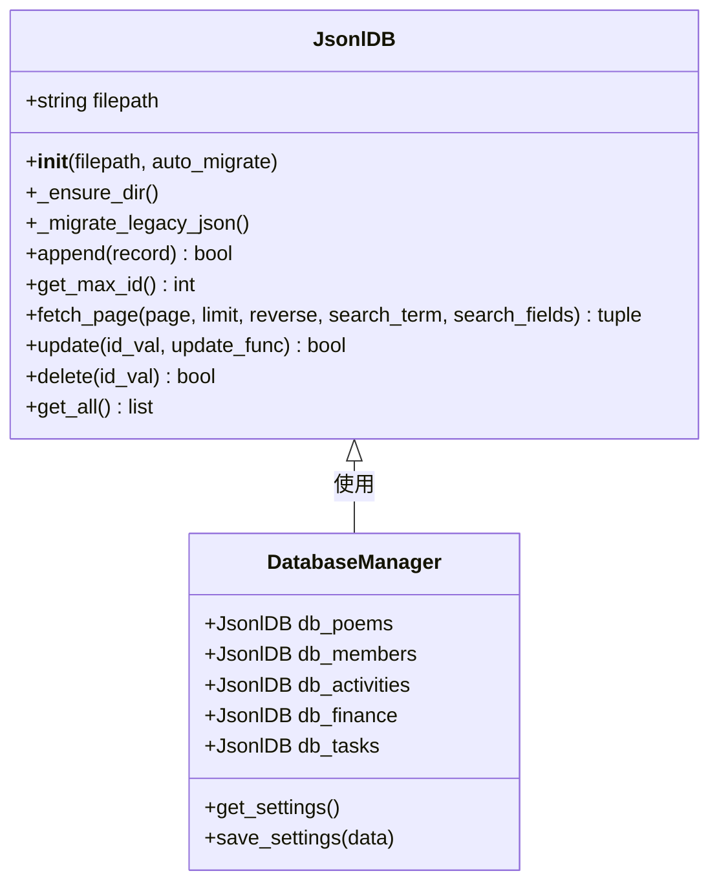
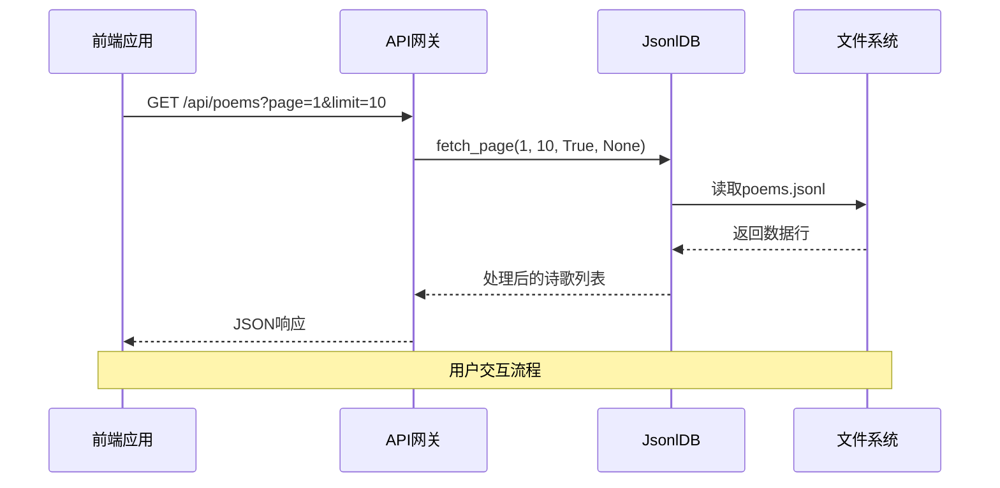
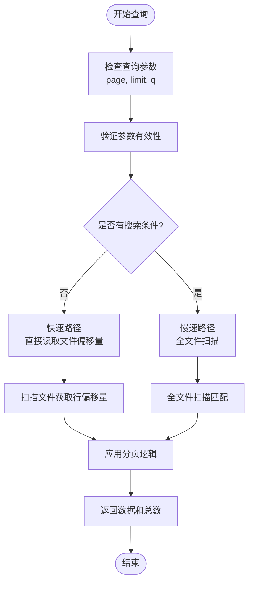
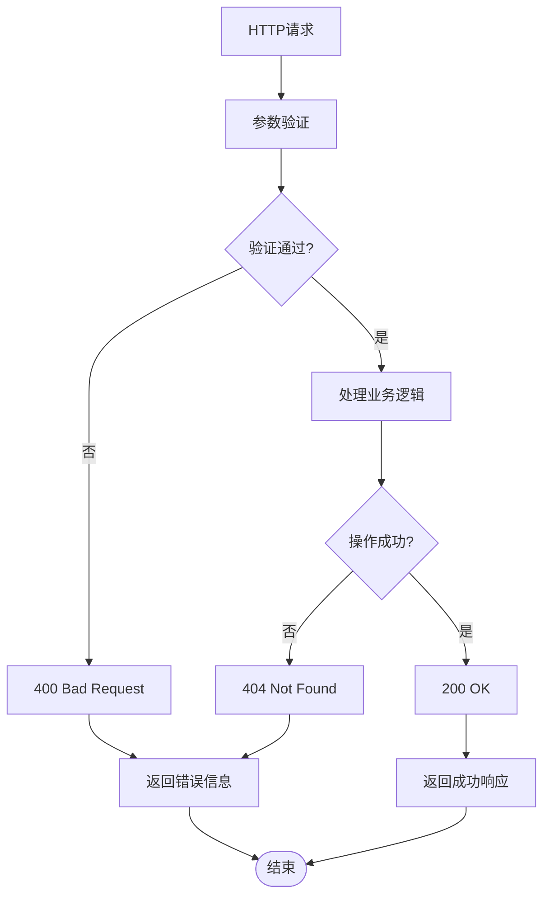
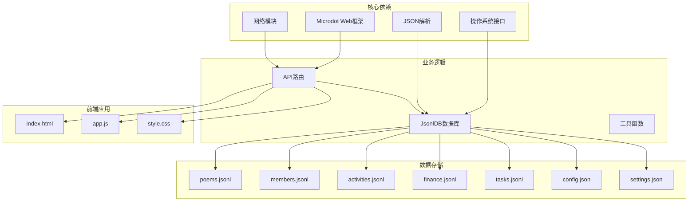

# 诗歌管理API

<cite>
**本文档引用的文件**
- [main.py](file://main.py)
- [app.js](file://static/app.js)
- [index.html](file://static/index.html)
- [poems.jsonl](file://data/poems.jsonl)
- [config.json](file://data/config.json)
- [settings.json](file://data/settings.json)
- [boot.py](file://boot.py)
</cite>

## 目录
1. [简介](#简介)
2. [项目结构](#项目结构)
3. [核心组件](#核心组件)
4. [架构概览](#架构概览)
5. [详细组件分析](#详细组件-analysis)
6. [依赖关系分析](#依赖关系分析)
7. [性能考虑](#性能考虑)
8. [故障排除指南](#故障排除指南)
9. [结论](#结论)

## 简介

围炉诗社·理事台是一个基于MicroPython的Web应用，专门为围炉诗社提供诗歌管理和运营支持。本项目实现了完整的诗歌管理API，包括诗歌的增删改查、分页查询、搜索功能等核心功能。

该系统采用ESP32微控制器作为服务器，使用JSON Lines格式存储数据，提供RESTful API接口供前端JavaScript应用调用。系统支持本地草稿功能，允许用户在离线状态下创作诗歌，并在网络可用时同步到服务器。

## 项目结构

项目采用模块化设计，主要包含以下组件：

**图表来源**
- [main.py](file://main.py#L1-L548)
- [boot.py](file://boot.py#L1-L122)

**章节来源**
- [main.py](file://main.py#L1-L548)
- [boot.py](file://boot.py#L1-L122)

## 核心组件

### 数据库管理器 (JsonlDB)

系统使用自定义的JSON Lines数据库管理器来处理数据存储：

**图表来源**
- [main.py](file://main.py#L53-L258)

### API路由系统

系统提供完整的RESTful API接口：

| 接口 | 方法 | 描述 | 参数 |
|------|------|------|------|
| `/api/poems` | GET | 获取诗歌列表 | `page`, `limit`, `q` |
| `/api/poems` | POST | 创建新诗歌 | JSON数据 |
| `/api/poems/update` | POST | 更新现有诗歌 | JSON数据（含id） |
| `/api/poems/delete` | POST | 删除诗歌 | JSON数据（含id） |

**章节来源**
- [main.py](file://main.py#L308-L369)

## 架构概览

系统采用客户端-服务器架构，前端使用JavaScript构建单页应用，后端使用MicroPython提供API服务：

**图表来源**
- [main.py](file://main.py#L309-L329)
- [app.js](file://static/app.js#L165-L212)

**章节来源**
- [main.py](file://main.py#L299-L369)
- [app.js](file://static/app.js#L1-L800)

## 详细组件分析

### 诗歌实体数据结构

诗歌实体包含以下字段：

| 字段名 | 类型 | 必填 | 默认值 | 描述 |
|--------|------|------|--------|------|
| `id` | 整数 | 是 | 自动生成 | 诗歌唯一标识符 |
| `title` | 字符串 | 是 | 无 | 诗歌标题 |
| `content` | 字符串 | 是 | 无 | 诗歌内容 |
| `type` | 字符串 | 否 | "绝句" | 诗歌类型（绝句/律诗/词/现代诗/文章） |
| `author` | 字符串 | 否 | "超级管理员" | 作者名称 |
| `date` | 字符串 | 否 | 当前时间 | 发布日期时间 |

**章节来源**
- [poems.jsonl](file://data/poems.jsonl#L1-L4)

### 分页查询机制

系统支持高效的分页查询，使用内存优化的算法：

**图表来源**
- [main.py](file://main.py#L113-L185)

### 搜索功能实现

搜索功能支持全文检索，具有以下特性：

- **大小写不敏感**：自动转换为小写进行比较
- **字段遍历**：扫描对象的所有键值对
- **性能优化**：无搜索条件时使用快速路径
- **内存友好**：逐行读取文件，避免内存溢出

**章节来源**
- [main.py](file://main.py#L155-L185)

### 错误处理机制

系统实现了完善的错误处理：

**图表来源**
- [main.py](file://main.py#L334-L369)

**章节来源**
- [main.py](file://main.py#L334-L369)

## 依赖关系分析

系统各组件之间的依赖关系如下：

**图表来源**
- [main.py](file://main.py#L1-L17)
- [boot.py](file://boot.py#L1-L122)

**章节来源**
- [main.py](file://main.py#L1-L17)
- [boot.py](file://boot.py#L1-L122)

## 性能考虑

### 内存优化策略

1. **流式文件读取**：使用`readline()`逐行读取，避免一次性加载整个文件
2. **延迟计算**：仅在需要时计算最大ID和文件大小
3. **垃圾回收**：定期执行垃圾回收释放内存

### 网络性能优化

1. **缓存机制**：前端应用维护数据缓存，减少重复请求
2. **分页加载**：默认每页10条记录，支持无限滚动
3. **搜索优化**：无搜索条件时跳过全文件扫描

### 存储效率

1. **JSON Lines格式**：每行一条记录，便于增量更新
2. **增量备份**：支持从传统JSON格式迁移
3. **压缩存储**：利用ESP32的Flash存储特性

## 故障排除指南

### 常见问题及解决方案

| 问题 | 可能原因 | 解决方案 |
|------|----------|----------|
| API请求超时 | 网络连接不稳定 | 检查WiFi配置，重启路由器 |
| 数据库写入失败 | Flash存储空间不足 | 清理不必要的数据文件 |
| 搜索结果异常 | 编码问题导致字符匹配失败 | 使用URL编码传递搜索参数 |
| 分页显示错误 | 服务器时间不同步 | 确保系统时间正确设置 |

### 调试技巧

1. **查看系统状态**：访问`/api/system/info`获取设备信息
2. **检查日志输出**：关注控制台打印的错误信息
3. **验证数据格式**：确保JSON数据符合规范
4. **测试网络连接**：确认ESP32能够正常连接WiFi

**章节来源**
- [main.py](file://main.py#L528-L539)

## 结论

围炉诗社·理事台项目成功实现了完整的诗歌管理API系统，具有以下特点：

1. **轻量级设计**：基于MicroPython，适合嵌入式环境部署
2. **功能完整**：支持诗歌的全生命周期管理
3. **用户体验良好**：提供草稿功能和流畅的交互体验
4. **扩展性强**：模块化设计便于功能扩展

该系统为围炉诗社提供了可靠的数字化管理平台，既满足了日常运营需求，又为未来的功能扩展奠定了坚实基础。