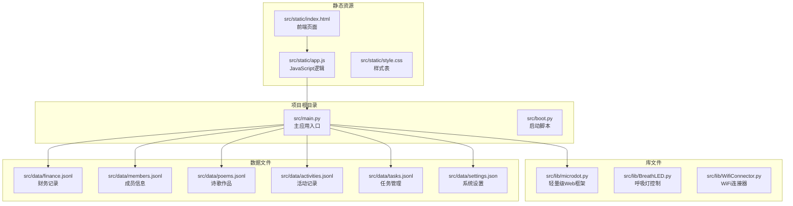
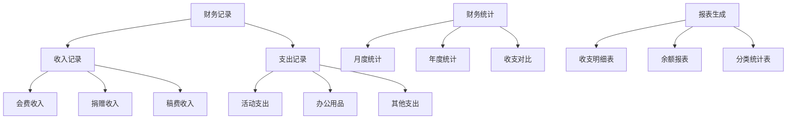
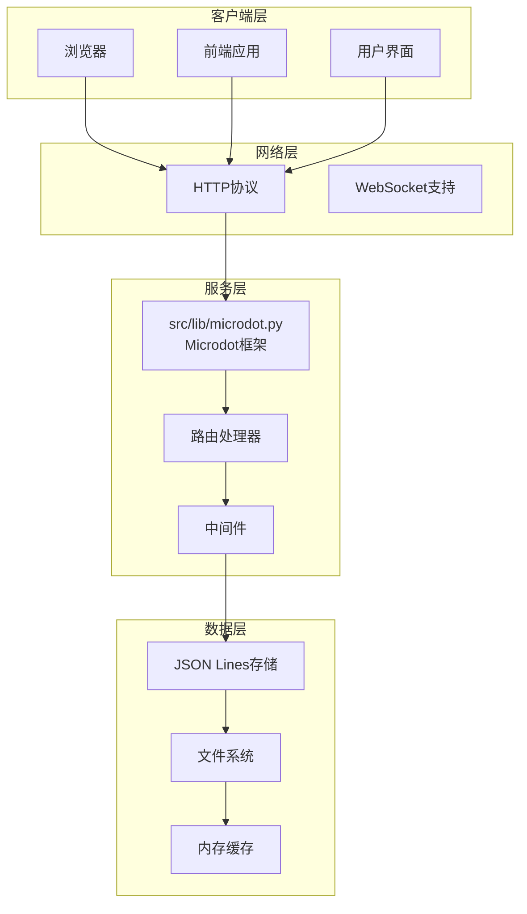
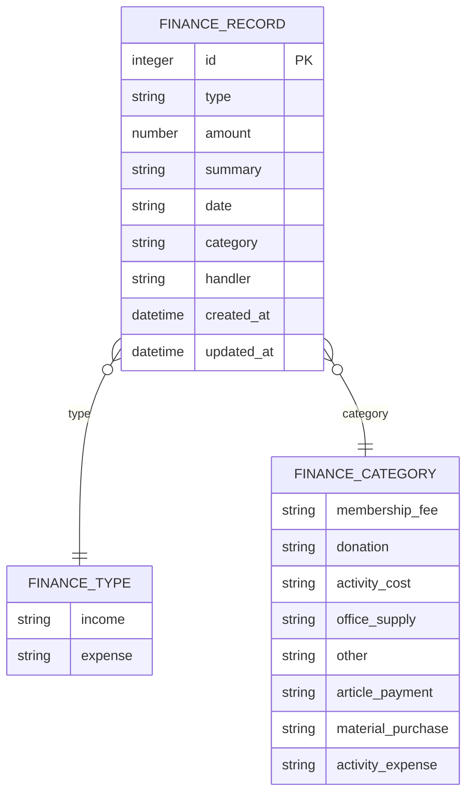
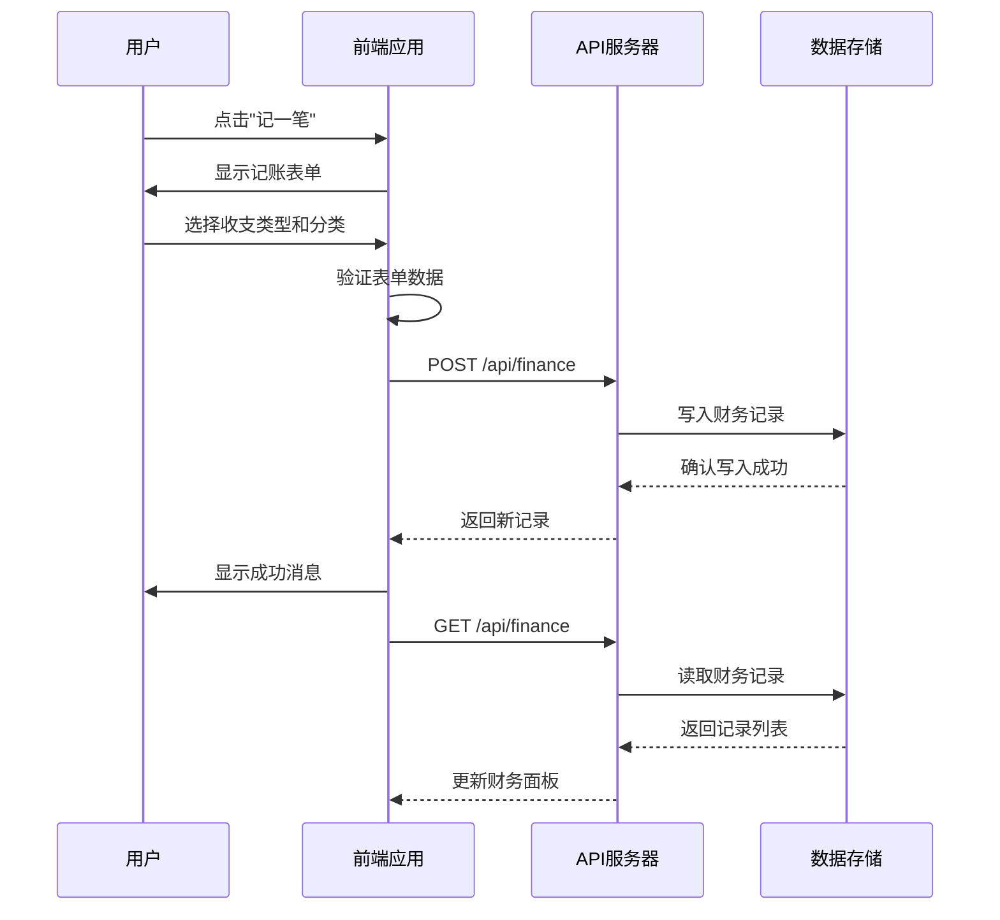
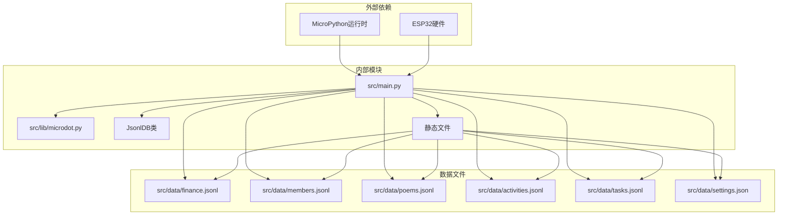

# 财务管理API

<cite>
**本文档引用的文件**
- [main.py](file://src/main.py)
- [microdot.py](file://src/lib/microdot.py)
- [finance.jsonl](file://src/data/finance.jsonl)
- [index.html](file://src/static/index.html)
- [app.js](file://src/static/app.js)
- [style.css](file://src/static/style.css)
- [members.jsonl](file://src/data/members.jsonl)
- [settings.json](file://src/data/settings.json)
</cite>

## 更新摘要
**变更内容**
- 增强财务分类系统，新增预定义分类选项
- 改进财务记录管理功能，支持更多分类类型
- 更新财务分类选项，包含会费、活动费用、物资采购、稿费等

## 目录
1. [简介](#简介)
2. [项目结构](#项目结构)
3. [核心组件](#核心组件)
4. [架构概览](#架构概览)
5. [详细组件分析](#详细组件分析)
6. [依赖关系分析](#依赖关系分析)
7. [性能考虑](#性能考虑)
8. [故障排除指南](#故障排除指南)
9. [结论](#结论)

## 简介

围炉诗社·理事台项目是一个基于MicroPython的轻量级Web应用，专门为围炉诗社提供日常运营管理功能。该项目实现了完整的财务管理模块，支持财务记录的增删改查、收支统计和报表展示。

本项目采用ESP32微控制器作为运行平台，通过内置的HTTP服务器提供RESTful API接口。财务数据采用JSON Lines格式存储，确保了数据的可靠性和可维护性。

## 项目结构

项目采用模块化设计，主要包含以下核心目录和文件：



**图表来源**
- [main.py](file://src/main.py#L1-L887)
- [microdot.py](file://src/lib/microdot.py#L1-L183)

**章节来源**
- [main.py](file://src/main.py#L1-L887)
- [microdot.py](file://src/lib/microdot.py#L1-L183)

## 核心组件

### Web应用框架

项目使用自定义的Microdot框架，这是一个轻量级的HTTP服务器实现，专为MicroPython环境设计。该框架提供了基本的路由、请求处理和响应生成功能。

### 数据存储层

系统采用JSON Lines格式存储所有数据，每个文件一行存储一条记录。这种设计具有以下优势：
- **原子性写入**：每条记录独立存储，避免数据损坏
- **高效读取**：支持按需读取特定记录
- **易于迁移**：支持从传统JSON格式自动迁移

### 财务管理模块

财务模块是整个系统的核心功能之一，提供了完整的财务生命周期管理：



**图表来源**
- [main.py](file://src/main.py#L798-L809)
- [finance.jsonl](file://src/data/finance.jsonl#L1-L3)

**章节来源**
- [main.py](file://src/main.py#L798-L809)
- [finance.jsonl](file://src/data/finance.jsonl#L1-L3)

## 架构概览

系统采用客户端-服务器架构，前端使用纯HTML/CSS/JavaScript实现，后端基于MicroPython的HTTP服务器。



**图表来源**
- [main.py](file://src/main.py#L19-L183)
- [microdot.py](file://src/lib/microdot.py#L94-L183)

## 详细组件分析

### 财务API接口

#### 基础接口规范

系统提供两个核心的财务API接口：

| 接口 | 方法 | 描述 | 请求参数 | 响应数据 |
|------|------|------|----------|----------|
| `/api/finance` | GET | 获取财务记录列表 | page, limit, q | 财务记录数组 |
| `/api/finance` | POST | 添加新的财务记录 | 财务记录对象 | 新记录详情 |

#### GET /api/finance

该接口用于获取财务记录列表，支持分页和搜索功能。

**请求参数**
- `page` (可选): 页码，默认值为1
- `limit` (可选): 每页记录数，默认值为100
- `q` (可选): 搜索关键词

**响应数据结构**
```javascript
[
  {
    "id": 1,
    "amount": 500,
    "summary": "2026年春季会费收取",
    "date": "2026-01-20",
    "type": "income",
    "category": "会费",
    "handler": "张社长"
  }
]
```

#### POST /api/finance

该接口用于添加新的财务记录。

**请求体参数**
- `type`: 收支类型，"income" 或 "expense"
- `amount`: 金额，数值类型
- `summary`: 摘要说明
- `handler`: 经办人
- `date`: 日期，默认为当前日期
- `category`: 分类（可选）

**响应数据**
返回创建成功的完整记录信息。

**章节来源**
- [main.py](file://src/main.py#L798-L809)

### 财务实体数据结构

财务记录采用统一的数据结构，确保数据的一致性和完整性：



**图表来源**
- [finance.jsonl](file://src/data/finance.jsonl#L1-L3)

#### 字段详细说明

| 字段名 | 类型 | 必填 | 描述 | 示例值 |
|--------|------|------|------|--------|
| `id` | 整数 | 是 | 记录唯一标识符 | 1 |
| `type` | 字符串 | 是 | 收支类型 | "income" |
| `amount` | 数字 | 是 | 金额，单位为分 | 500 |
| `summary` | 字符串 | 是 | 摘要说明 | "春季会费收取" |
| `date` | 日期字符串 | 否 | 交易日期 | "2026-01-20" |
| `category` | 字符串 | 否 | 分类标签 | "会费" |
| `handler` | 字符串 | 否 | 经办人 | "张社长" |

**章节来源**
- [finance.jsonl](file://src/data/finance.jsonl#L1-L3)

### 收支类型和分类

系统支持两种基本的收支类型：

#### 收支类型
- **收入 (income)**: 所有正向资金流入
- **支出 (expense)**: 所有负向资金流出

#### 收支分类

**更新** 系统增强了财务分类系统，新增了多个预定义分类选项：

##### 收入分类
- **会费**: 社员缴纳的会费
- **捐赠**: 外部捐赠款项
- **稿费**: 作品发表获得的稿费收入

##### 支出分类
- **活动费用**: 诗社活动相关支出
- **物资采购**: 日常办公和活动物资采购
- **其他**: 未归类的其他收支

**章节来源**
- [main.py](file://src/main.py#L798-L809)
- [finance.jsonl](file://src/data/finance.jsonl#L1-L3)

### 前端集成

前端应用通过JavaScript与财务API进行交互，实现了完整的财务管理工作流。



**图表来源**
- [app.js](file://src/static/app.js#L1243-L1285)
- [main.py](file://src/main.py#L798-L809)

**章节来源**
- [app.js](file://src/static/app.js#L1243-L1285)
- [index.html](file://src/static/index.html#L251-L272)

### 数据持久化机制

系统采用JSON Lines格式存储财务数据，确保数据的可靠性和可维护性。

#### 存储特点
- **逐行存储**: 每条记录占一行
- **原子写入**: 新记录追加到文件末尾
- **顺序访问**: 支持按时间顺序读取
- **容错性强**: 单条记录损坏不影响其他记录

#### 文件格式示例
```json
{"id": 1, "amount": 500, "summary": "2026年春季会费收取", "date": "2026-01-20", "type": "income", "category": "会费", "handler": "张社长"}
{"handler": "社长", "amount": 1500, "summary": "上年结余", "date": "2026-01-25", "id": 2, "type": "income"}
```

**章节来源**
- [finance.jsonl](file://src/data/finance.jsonl#L1-L3)

## 依赖关系分析

系统各组件之间的依赖关系如下：



**图表来源**
- [main.py](file://src/main.py#L1-L887)
- [microdot.py](file://src/lib/microdot.py#L1-L183)

**章节来源**
- [main.py](file://src/main.py#L1-L887)
- [microdot.py](file://src/lib/microdot.py#L1-L183)

## 性能考虑

### 存储性能优化

系统针对嵌入式环境进行了专门的性能优化：

#### JSON Lines存储优势
- **零竞争写入**: 新记录总是追加到文件末尾
- **顺序读取优化**: 支持从文件末尾向前扫描
- **内存友好**: 不需要将整个文件加载到内存
- **容错性强**: 单条记录损坏不影响整体数据

#### 分页策略
- **默认限制**: 列表查询默认返回最多100条记录
- **内存控制**: 避免大量数据一次性传输
- **延迟加载**: 支持按需加载更多记录

### 网络性能

#### HTTP服务器优化
- **轻量级实现**: 自定义Microdot框架减少资源占用
- **异步处理**: 支持并发请求处理
- **最小响应**: 只传输必要的数据

#### 前端缓存策略
- **本地存储**: 使用localStorage缓存用户信息
- **索引数据库**: 使用IndexedDB存储草稿
- **增量更新**: 只更新变化的数据

## 故障排除指南

### 常见问题及解决方案

#### 登录认证问题
**症状**: 用户无法登录系统
**可能原因**:
- 凭据错误
- 成员数据损坏
- 密码不匹配

**解决步骤**:
1. 检查成员数据文件格式
2. 验证手机号和密码
3. 确认用户角色权限

#### 财务记录异常
**症状**: 财务记录显示异常或丢失
**可能原因**:
- 文件写入失败
- 编码问题
- 权限不足

**解决步骤**:
1. 检查文件系统空间
2. 验证JSON格式正确性
3. 确认文件权限设置

#### API调用错误
**症状**: 前端无法获取财务数据
**可能原因**:
- 服务器未启动
- 网络连接问题
- 路由配置错误

**解决步骤**:
1. 检查服务器日志
2. 验证网络连接
3. 确认路由映射

**章节来源**
- [main.py](file://src/main.py#L774-L796)
- [app.js](file://src/static/app.js#L1243-L1285)

### 错误处理机制

系统实现了多层次的错误处理机制：

#### 服务器端错误处理
- **异常捕获**: 所有API调用都包含try-catch块
- **状态码返回**: 标准化的HTTP状态码
- **错误日志**: 详细的错误信息记录

#### 客户端错误处理
- **网络错误**: 自动重试机制
- **数据验证**: 前端表单验证
- **用户提示**: 友好的错误信息显示

## 结论

围炉诗社·理事台项目的财务管理API设计简洁而实用，充分考虑了嵌入式环境的限制和实际使用需求。系统通过合理的架构设计和优化策略，在保证功能完整性的同时，实现了良好的性能表现。

### 主要优势

1. **轻量级设计**: 基于MicroPython的精简实现
2. **数据可靠性**: JSON Lines格式确保数据安全
3. **易用性**: 直观的前端界面和API设计
4. **扩展性**: 模块化架构便于功能扩展
5. **分类完善**: 增强的财务分类系统支持多种业务场景

### 技术特色

- **嵌入式优化**: 针对ESP32硬件特性优化
- **实时同步**: 前后端数据实时同步
- **权限控制**: 基于角色的访问控制
- **审计追踪**: 完整的操作记录
- **灵活分类**: 支持会费、捐赠、稿费等多种收入类型

### 发展建议

1. **安全增强**: 考虑添加HTTPS支持和更严格的权限验证
2. **性能优化**: 实现数据缓存和索引机制
3. **功能扩展**: 添加更多财务分析和报表功能
4. **监控完善**: 增加系统状态监控和告警机制
5. **分类扩展**: 根据实际业务需求继续丰富分类体系

该系统为围炉诗社提供了一个稳定可靠的财务管理解决方案，能够满足日常运营的基本需求，并为未来的功能扩展奠定了良好的基础。