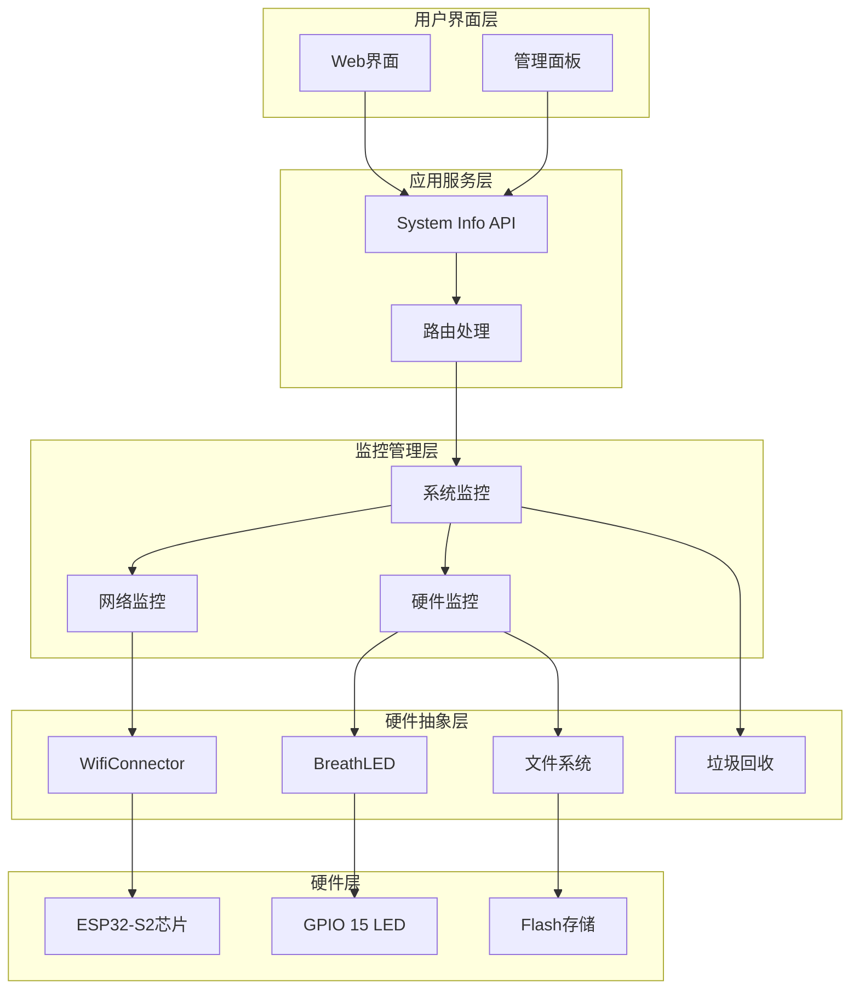
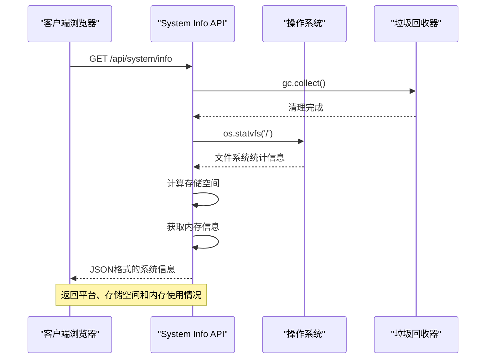
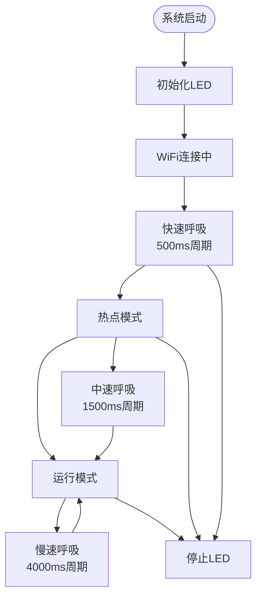
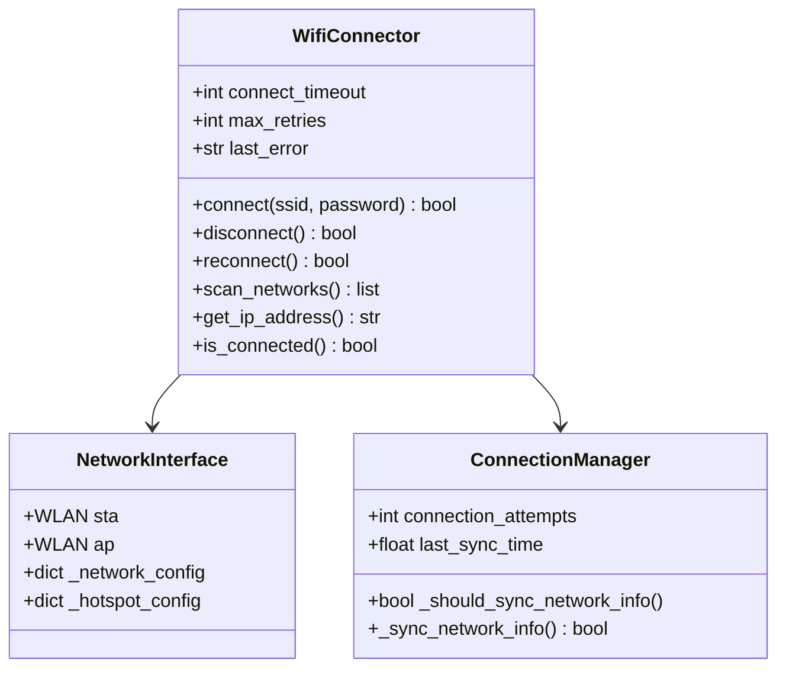
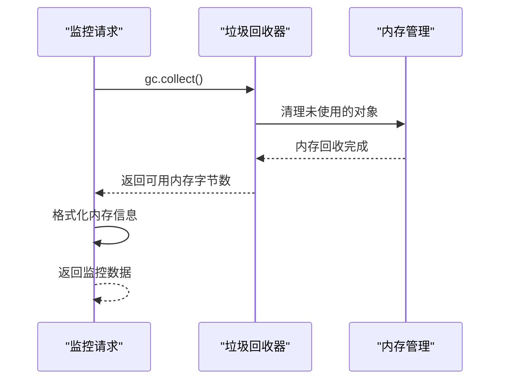
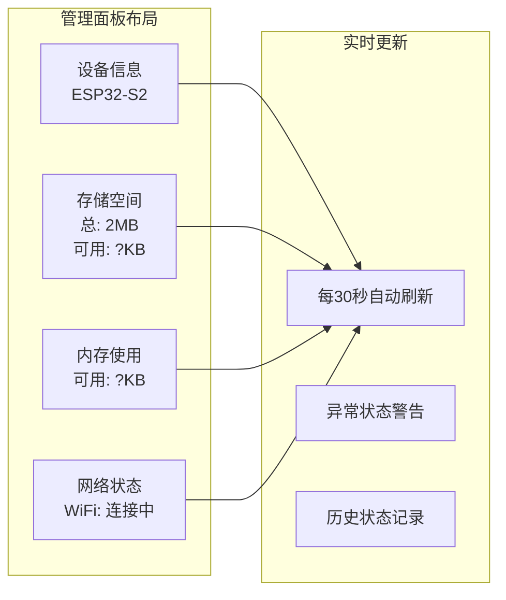
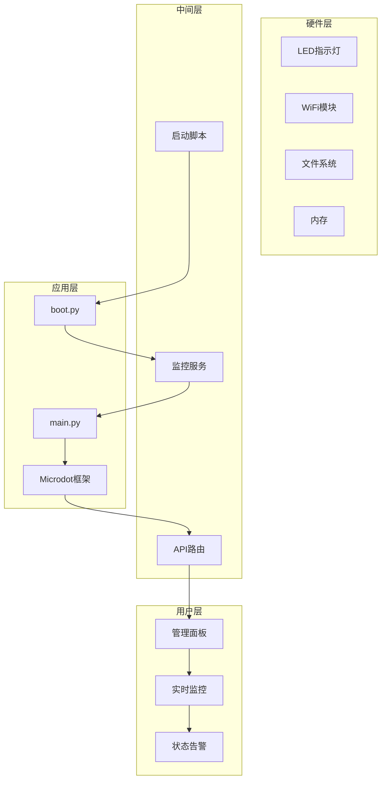

# 系统监控

<cite>
**本文档引用的文件**
- [README.md](file://README.md)
- [main.py](file://src/main.py)
- [boot.py](file://src/boot.py)
- [SystemStatus.py](file://src/lib/SystemStatus.py)
- [BreathLED.py](file://src/lib/BreathLED.py)
- [WifiConnector.py](file://src/lib/WifiConnector.py)
- [microdot.py](file://src/lib/microdot.py)
- [index.html](file://src/static/index.html)
- [app.js](file://src/static/app.js)
- [config.json](file://src/data/config.json)
</cite>

## 目录
1. [简介](#简介)
2. [系统架构概览](#系统架构概览)
3. [核心监控组件](#核心监控组件)
4. [硬件状态监控](#硬件状态监控)
5. [网络状态监控](#网络状态监控)
6. [存储空间监控](#存储空间监控)
7. [内存使用监控](#内存使用监控)
8. [系统状态可视化](#系统状态可视化)
9. [监控数据流分析](#监控数据流分析)
10. [性能优化策略](#性能优化策略)
11. [故障排除指南](#故障排除指南)
12. [总结](#总结)

## 简介

围炉诗社·理事台系统监控模块是该嵌入式Web应用的核心组成部分，专门负责实时监控ESP32-S2微控制器的各项关键指标。该系统集成了硬件状态监控、网络连接状态监控、存储空间监控和内存使用监控四大功能模块，为诗社管理提供了全面的系统健康保障。

系统监控功能基于MicroPython环境构建，充分利用了ESP32-S2的硬件特性，包括240MHz主频、320KB SRAM、2MB PSRAM和4MB Flash存储空间。通过呼吸LED指示灯、网络连接状态和系统信息API，用户可以实时了解系统的运行状态。

## 系统架构概览

系统监控架构采用分层设计，从底层硬件抽象到上层用户界面展示形成了完整的监控体系：



**图表来源**
- [main.py](file://src/main.py#L867-L878)
- [SystemStatus.py](file://src/lib/SystemStatus.py#L19-L61)
- [WifiConnector.py](file://src/lib/WifiConnector.py#L11-L26)

## 核心监控组件

### 系统信息API

系统监控的核心是`/api/system/info`端点，它提供了实时的系统状态信息：



**图表来源**
- [main.py](file://src/main.py#L867-L878)

### 监控数据结构

系统监控API返回的数据结构包含以下关键字段：

| 字段 | 描述 | 单位 |
|------|------|------|
| platform | 平台标识 | 字符串 |
| free_storage | 可用存储空间 | 字节 |
| total_storage | 总存储空间 | 字节 |
| free_ram | 可用RAM空间 | 字节 |

**章节来源**
- [main.py](file://src/main.py#L867-L878)

## 硬件状态监控

### LED状态指示系统

系统采用了基于GPIO 15的呼吸LED指示灯，通过不同的呼吸周期来表示不同的系统状态：



**图表来源**
- [SystemStatus.py](file://src/lib/SystemStatus.py#L20-L58)
- [BreathLED.py](file://src/lib/BreathLED.py#L11-L26)

### LED状态配置

| 状态 | 呼吸周期 | LED行为 | 用途 |
|------|----------|---------|------|
| 连接中 | 500ms | 快速呼吸 | WiFi连接过程中 |
| 热点模式 | 1500ms | 中速呼吸 | AP模式启用 |
| 运行中 | 4000ms | 缓慢呼吸 | 系统正常运行 |
| 停止 | - | 熄灭 | 系统关闭 |

**章节来源**
- [SystemStatus.py](file://src/lib/SystemStatus.py#L20-L58)

## 网络状态监控

### WiFi连接管理

系统集成了增强型WiFi连接器，提供了完整的网络状态监控能力：



**图表来源**
- [WifiConnector.py](file://src/lib/WifiConnector.py#L11-L120)

### 网络状态检测

系统通过多种方式监控网络连接状态：

1. **连接状态检查**：实时检测WiFi连接状态
2. **IP地址监控**：跟踪网络配置变化
3. **信号强度评估**：监控WiFi信号质量
4. **自动重连机制**：在网络断开时自动重连

**章节来源**
- [WifiConnector.py](file://src/lib/WifiConnector.py#L253-L339)

## 存储空间监控

### 文件系统监控

系统监控模块通过`os.statvfs()`函数获取文件系统的详细信息：

```mermaid
flowchart TD
Request[存储空间请求] --> StatVFS[os.statvfs('/')]
StatVFS --> CalcFree[计算可用空间]
CalcFree --> CalcTotal[计算总空间]
CalcTotal --> FormatData[格式化数据]
FormatData --> Return[返回监控数据]
subgraph "statvfs返回字段"
F_frsize[文件系统块大小]
F_blocks[总块数]
F_bfree[可用块数]
F_bavail[可用块数(特权用户)]
end
StatVFS --> F_frsize
StatVFS --> F_blocks
StatVFS --> F_bfree
StatVFS --> F_bavail
```

**图表来源**
- [main.py](file://src/main.py#L867-L878)

### 存储空间计算

系统使用以下公式计算存储空间信息：

- **可用存储空间** = `statvfs[0] × statvfs[3]`
- **总存储空间** = `statvfs[0] × statvfs[2]`

其中各字段含义：
- `statvfs[0]`：文件系统块大小（字节）
- `statvfs[2]`：总块数
- `statvfs[3]`：可用块数

**章节来源**
- [main.py](file://src/main.py#L867-L878)

## 内存使用监控

### 垃圾回收集成

系统监控模块集成了MicroPython的垃圾回收机制，确保内存使用的准确性：



**图表来源**
- [main.py](file://src/main.py#L867-L878)

### 内存监控流程

1. **垃圾回收触发**：每次监控请求前执行垃圾回收
2. **内存统计**：获取可用内存字节数
3. **数据格式化**：将字节数转换为更易读的格式
4. **响应返回**：向客户端返回内存使用信息

**章节来源**
- [main.py](file://src/main.py#L867-L878)

## 系统状态可视化

### 管理面板展示

系统在管理面板中提供了直观的系统状态展示：



**图表来源**
- [index.html](file://src/static/index.html#L83-L106)

### 前端数据绑定

前端JavaScript通过以下方式实现数据绑定：

1. **API调用**：定期调用`/api/system/info`端点
2. **数据解析**：解析返回的JSON数据
3. **DOM更新**：更新页面上的显示元素
4. **格式转换**：将字节转换为KB显示

**章节来源**
- [app.js](file://src/static/app.js#L1358-L1382)

## 监控数据流分析

### 完整监控流程

系统监控数据流从硬件层到用户界面层的完整路径：



**图表来源**
- [boot.py](file://src/boot.py#L1-L122)
- [main.py](file://src/main.py#L1-L50)

### 数据更新机制

系统采用轮询机制实现数据的实时更新：

1. **定时轮询**：前端每30秒请求一次系统信息
2. **增量更新**：只更新发生变化的数据项
3. **错误处理**：网络异常时显示离线状态
4. **缓存策略**：合理使用浏览器缓存减少请求

**章节来源**
- [app.js](file://src/static/app.js#L1358-L1382)

## 性能优化策略

### 内存优化

系统采用了多项内存优化策略：

1. **垃圾回收集成**：每次监控请求前执行垃圾回收
2. **按需加载**：只在需要时加载监控数据
3. **数据压缩**：返回精简的监控信息
4. **资源清理**：及时清理不再使用的对象

### 网络优化

1. **连接池复用**：复用HTTP连接减少开销
2. **请求合并**：将多个监控请求合并处理
3. **缓存策略**：合理使用缓存减少网络流量
4. **超时控制**：设置合理的请求超时时间

## 故障排除指南

### 常见问题诊断

| 问题症状 | 可能原因 | 解决方案 |
|----------|----------|----------|
| LED不亮 | LED初始化失败 | 检查GPIO 15连接 |
| WiFi连接失败 | 配置错误 | 检查config.json设置 |
| 存储空间显示异常 | 文件系统错误 | 重启设备并检查SD卡 |
| 内存监控不准确 | 垃圾回收未执行 | 确认gc.collect()调用 |

### 调试工具

1. **串口调试**：通过串口输出系统状态信息
2. **日志记录**：记录网络连接和系统事件
3. **性能分析**：监控内存使用峰值
4. **网络诊断**：测试WiFi连接质量

**章节来源**
- [boot.py](file://src/boot.py#L117-L122)
- [main.py](file://src/main.py#L349-L364)

## 总结

围炉诗社·理事台的系统监控模块是一个功能完整、设计合理的嵌入式监控解决方案。通过硬件状态监控、网络状态监控、存储空间监控和内存使用监控四大核心功能，为诗社管理提供了全面的系统健康保障。

系统的主要优势包括：

1. **实时性**：通过轮询机制实现实时状态监控
2. **可视化**：提供直观的管理面板界面
3. **可靠性**：完善的错误处理和故障恢复机制
4. **可扩展性**：模块化的架构设计便于功能扩展
5. **性能优化**：针对嵌入式环境的内存和性能优化

该监控系统不仅满足了当前的功能需求，还为未来的功能扩展奠定了良好的基础，是围炉诗社数字化管理的重要基础设施。