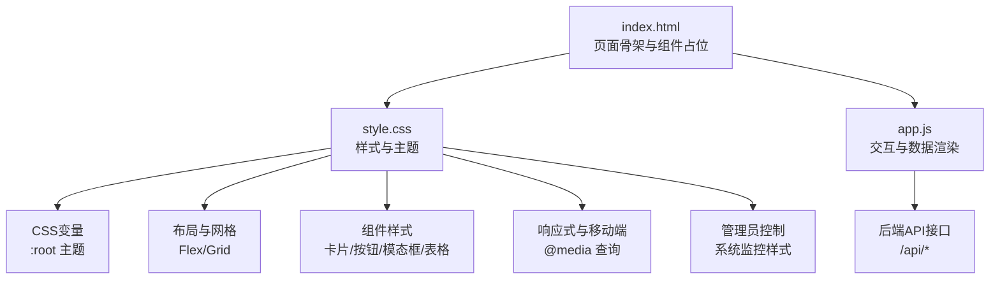
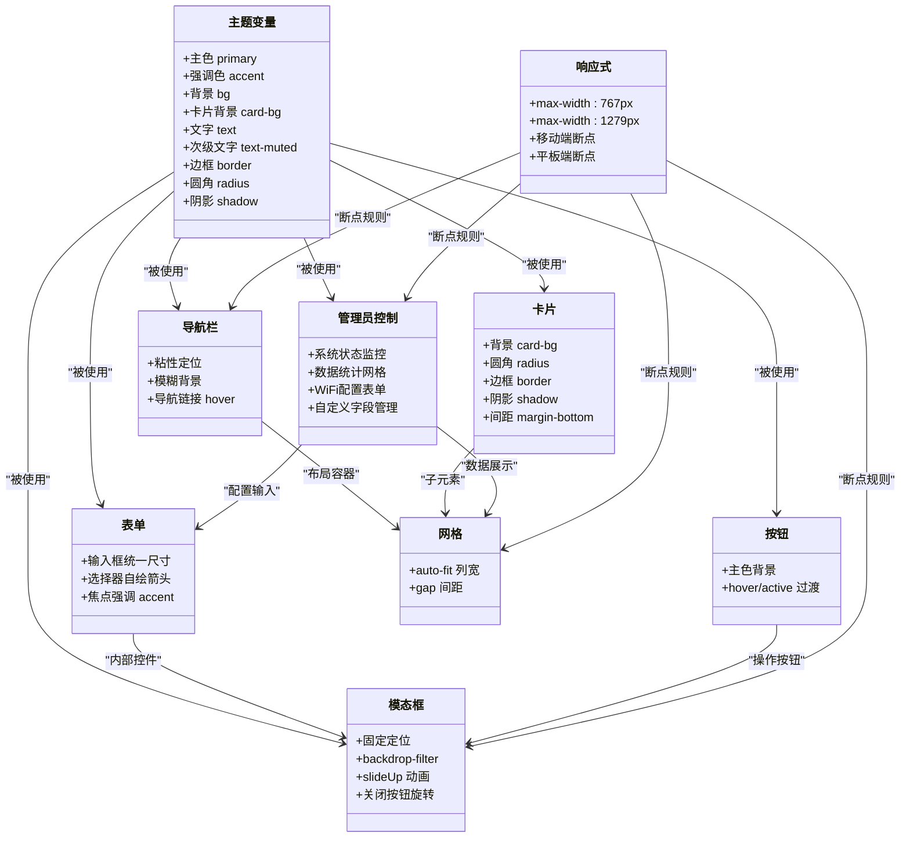
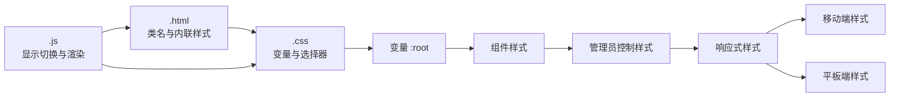

# CSS样式系统

<cite>
**本文引用的文件**
- [style.css](file://src/static/style.css)
- [index.html](file://src/static/index.html)
- [app.js](file://src/static/app.js)
</cite>

## 更新摘要
**变更内容**
- 新增增强的响应式设计模式，包含移动端、平板端和PC端的完整适配策略
- 改进的卡片布局系统，新增首页三栏布局和系统状态网格
- 完整的管理员控制样式支持，涵盖系统监控、数据统计、WiFi配置等功能
- 监控界面的完整样式实现，包括进度条、状态标签和操作按钮
- 优化的任务状态管理和操作按钮样式

## 目录
1. [简介](#简介)
2. [项目结构](#项目结构)
3. [核心组件](#核心组件)
4. [架构总览](#架构总览)
5. [详细组件分析](#详细组件分析)
6. [依赖关系分析](#依赖关系分析)
7. [性能考量](#性能考量)
8. [故障排查指南](#故障排查指南)
9. [结论](#结论)
10. [附录](#附录)

## 简介
本文件为"围炉诗社·理事台"项目的CSS样式系统综合文档，聚焦于：
- CSS变量与主题系统
- 颜色方案与视觉层次
- 响应式设计与移动端优化
- 组件样式组织：卡片、按钮、模态框、表格等
- 网格系统与Flexbox布局
- 动画与过渡效果
- 样式定制化：主题切换、字体与间距
- 浏览器兼容性与性能优化建议

## 项目结构
前端采用极简单页架构，HTML负责页面骨架与组件占位，CSS提供样式与主题，JS负责交互与数据渲染。样式文件位于 src/static/style.css，页面入口为 src/static/index.html，交互逻辑集中在 src/static/app.js。

**图表来源**
- [index.html](file://src/static/index.html#L1-L515)
- [style.css](file://src/static/style.css#L1-L920)
- [app.js](file://src/static/app.js#L1-L2163)

**章节来源**
- [index.html](file://src/static/index.html#L1-L515)
- [style.css](file://src/static/style.css#L1-L920)
- [app.js](file://src/static/app.js#L1-L2163)

## 核心组件
- 主题变量与基础样式
  - 使用 :root 定义主色、强调色、背景、卡片背景、文字、边框、圆角半径、阴影等变量，统一主题风格。
  - 全局重置与排版：盒模型、字体族、行高、颜色基线。
- 导航栏与容器
  - 导航条采用粘性定位与模糊背景，增强层级感；容器最大宽度与内边距控制内容宽度。
- 卡片系统
  - 通用卡片具备背景、圆角、边框、阴影与间距，作为模块化组件的基础容器。
- 表单与选择器
  - 输入框、选择器、文本域统一尺寸、边框、圆角与过渡；选择器自绘下拉箭头，消除系统默认样式差异。
- 按钮
  - 统一主色背景、白色文字、圆角与过渡；悬停与按下态提供微动效。
- 仪表盘网格
  - 自适应网格布局，自动列宽与间距，展示统计卡片。
- 列表与表格
  - 表头与单元格对齐、边框与货币类数值强调色；支持横向滚动容器。
- 社员网格
  - 自动填充网格，卡片悬停阴影；徽章与删除按钮样式。
- 诗词卡片
  - 引用块左侧强调色竖线、诗歌体排版、元信息区分隔线。
- 模态框
  - 固定定位、毛玻璃背景、滑入动画、关闭按钮旋转动效。
- 统计卡片
  - Flex布局三列统计，移动端换行适配。
- 事务列表
  - 任务项左右布局，奖励积分强调色。
- 管理员控制面板
  - 系统状态监控、数据统计、WiFi配置、自定义字段管理等完整样式支持。
- 响应式与移动端
  - 小屏导航垂直堆叠、横向滚动、按钮换行、统计卡片换行与间距调整；输入字号提升避免缩放。

**章节来源**
- [style.css](file://src/static/style.css#L1-L920)

## 架构总览
样式系统围绕"变量驱动的主题 + 组件化样式 + 响应式断点"的架构展开。HTML通过类名与内联样式结合，CSS通过变量与选择器实现一致风格；JS负责动态切换显示区域与渲染内容，同时配合CSS动画与过渡提升交互体验。

**图表来源**
- [style.css](file://src/static/style.css#L1-L920)

## 详细组件分析

### 主题系统与CSS变量
- 变量定义位置与命名：在 :root 中集中声明主色、强调色、背景、卡片背景、文字、次级文字、边框、圆角、阴影等。
- 使用方式：全局通过 var(--变量名) 引用，确保主题一致性与可替换性。
- 设计要点：主色用于品牌与重要元素，强调色用于交互反馈与强调信息，背景与卡片背景区分层级，圆角与阴影统一视觉质感。

**章节来源**
- [style.css](file://src/static/style.css#L2-L12)

### 导航栏与容器
- 导航条采用半透明背景与模糊滤镜，底部边框与阴影增强分层；粘性定位保证滚动时始终可见。
- 容器限制最大宽度并设置左右内边距，确保在大屏与小屏均保持良好阅读宽度。
- 品牌区包含图标与标题，链接区采用 Flex 布局，悬停态改变背景与文字色。

**章节来源**
- [style.css](file://src/static/style.css#L25-L80)
- [index.html](file://src/static/index.html#L24-L42)

### 卡片系统
- 通用卡片具备统一背景、圆角、边框与阴影，适合承载内容区块。
- 间距与排版：卡片内统一使用内边距，标题层级与段落行高保持一致。

**章节来源**
- [style.css](file://src/static/style.css#L98-L105)

### 表单与选择器
- 输入框、选择器、文本域统一尺寸、圆角与边框；获得焦点时强调色边框。
- 选择器自绘下拉箭头，消除系统默认样式差异，提升一致性。
- iOS 适配：移除原生外观，避免灰色背景影响。

**章节来源**
- [style.css](file://src/static/style.css#L118-L144)

### 按钮
- 统一主色背景、白色文字、圆角与过渡；悬停态轻微上浮与透明度变化，按下态复位。
- 适用于模态框、卡片、统计卡片等场景的操作按钮。

**章节来源**
- [style.css](file://src/static/style.css#L146-L158)

### 仪表盘网格
- 使用 CSS Grid 的 auto-fit 与 minmax 实现自适应列宽，自动换行。
- 间距与对齐：统一 gap 与内边距，居中展示统计信息。

**章节来源**
- [style.css](file://src/static/style.css#L161-L175)

### 系统状态监控网格
- **新增** 系统状态监控网格布局，采用三列自适应设计，包含设备信息、存储空间和运行内存监控。
- 支持状态进度条显示，包含警告和危险状态的渐变色彩。
- 响应式适配：移动端单列布局，平板端双列布局。

**章节来源**
- [style.css](file://src/static/style.css#L177-L241)
- [index.html](file://src/static/index.html#L84-L113)

### 数据统计网格
- **新增** 数据统计网格采用五列布局，展示各类统计数据卡片。
- 卡片包含图标、数值和名称，支持悬停效果和渐变背景。
- 响应式适配：移动端双列布局，平板端三列布局。

**章节来源**
- [style.css](file://src/static/style.css#L243-L289)
- [index.html](file://src/static/index.html#L115-L154)

### 列表与表格
- 表头加粗与分隔线，单元格统一内边距；货币数值使用等宽字体并按收支类型着色。
- 表格容器支持横向滚动，避免小屏溢出。

**章节来源**
- [style.css](file://src/static/style.css#L291-L308)

### 社员网格
- 自动填充网格，卡片悬停阴影提升交互反馈。
- 角色徽章与积分徽章统一风格，删除按钮采用轻量样式。

**章节来源**
- [style.css](file://src/static/style.css#L309-L344)

### 诗词卡片
- 引用块左侧强调色竖线，诗歌体排版提升阅读体验。
- 元信息区使用细线分隔，强调作者与时间。

**章节来源**
- [style.css](file://src/static/style.css#L346-L373)

### 模态框
- 固定定位与毛玻璃背景，backdrop-filter 提升视觉通透感。
- 内容区圆角与阴影，滑入动画提升打开体验；关闭按钮旋转动效增强交互反馈。
- 支持触摸滚动与滚动性能优化。

**章节来源**
- [style.css](file://src/static/style.css#L375-L426)

### 统计卡片
- Flex 布局三列等分，移动端换行适配；标题小字与数值大字形成对比。
- 边框分隔与统一内边距，保持信息密度与可读性。

**章节来源**
- [style.css](file://src/static/style.css#L428-L438)

### 事务列表
- 左右布局，右侧为操作按钮；奖励积分使用强调色突出。
- **新增** 任务状态标签和多种操作按钮样式。

**章节来源**
- [style.css](file://src/static/style.css#L485-L494)
- [style.css](file://src/static/style.css#L792-L820)

### 管理员控制面板
- **新增** 完整的管理员控制面板样式，包含系统状态监控、数据统计、WiFi配置等功能。
- 系统状态监控：设备信息、存储空间、运行内存的可视化展示。
- 数据统计：社员、诗作、活动、事务、财务记录的统计卡片。
- WiFi配置：支持STA客户端模式和AP热点模式的完整配置界面。
- 自定义字段管理：灵活的字段管理系统，支持文本、数字、日期、邮箱等多种类型。

**章节来源**
- [index.html](file://src/static/index.html#L84-L313)
- [style.css](file://src/static/style.css#L867-L920)

### 响应式设计与移动端优化
- **增强** 响应式断点策略：移动端(<768px)、平板端(768px-1279px)、PC端(>=1280px)。
- 小屏导航：垂直堆叠、横向滚动与防收缩，链接间距与字号优化。
- 统计卡片：两列换行，边框分隔，适配窄屏。
- 输入优化：小屏输入字号提升，防止移动端缩放导致的布局抖动。
- 滚动优化：容器开启触摸滚动，提升滚动性能。
- **新增** 首页三栏布局在移动端变为单列，在平板端变为单列，确保最佳用户体验。

**章节来源**
- [style.css](file://src/static/style.css#L533-L736)
- [style.css](file://src/static/style.css#L540-L723)

### 动画与过渡
- 页面切换：卡片显示采用淡入动画，平滑过渡。
- 模态框：滑入动画，提升打开体验。
- 按钮：悬停与按下态的透明度与位移动效。
- 关闭按钮：旋转动效，增强交互反馈。
- **新增** 加载动画：圆形加载指示器，使用CSS动画实现无限旋转效果。

**章节来源**
- [style.css](file://src/static/style.css#L93-L96)
- [style.css](file://src/static/style.css#L426)
- [style.css](file://src/static/style.css#L157-L158)
- [style.css](file://src/static/style.css#L420-L424)
- [style.css](file://src/static/style.css#L738-L758)

## 依赖关系分析
- HTML 与 CSS
  - HTML 通过类名引用 CSS 类，如 .navbar、.card、.modal、.table 等。
  - 内联样式用于临时覆盖或动态状态，如登录卡片、按钮宽度等。
- CSS 与 JS
  - JS 控制显示/隐藏与切换区域，配合 CSS 动画与过渡。
  - JS 动态生成内容时，部分样式通过内联样式注入，减少对CSS的侵入。
- 主题变量与组件
  - 所有组件样式依赖 :root 变量，便于主题切换与定制。

**图表来源**
- [index.html](file://src/static/index.html#L1-L515)
- [style.css](file://src/static/style.css#L1-L920)
- [app.js](file://src/static/app.js#L1-L2163)

**章节来源**
- [index.html](file://src/static/index.html#L1-L515)
- [style.css](file://src/static/style.css#L1-L920)
- [app.js](file://src/static/app.js#L1-L2163)

## 性能考量
- CSS 变量与选择器复用：减少重复样式，降低体积与维护成本。
- 动画与过渡：使用 transform 与 opacity，避免触发布局与重绘。
- 滚动优化：容器开启 -webkit-overflow-scrolling: touch，提升滚动性能。
- 字体与排版：使用系统字体栈，避免额外字体加载阻塞。
- 响应式断点：合理使用 max-width，避免过度嵌套选择器导致匹配开销。
- **新增** 渐变背景和线性渐变进度条：使用硬件加速优化，提升渲染性能。

## 故障排查指南
- 登录态异常
  - 现象：页面未进入主应用或导航不可见。
  - 排查：检查 localStorage 中用户信息是否存在；确认登录请求返回状态。
  - 相关代码路径：[checkLogin](file://src/static/app.js#L107-L121)，[login](file://src/static/app.js#L132-L155)
- 模态框无法关闭
  - 现象：点击关闭按钮无效。
  - 排查：确认 toggleModal 是否正确切换 display；检查关闭按钮事件绑定。
  - 相关代码路径：[toggleModal](file://src/static/app.js#L259-L262)，[关闭按钮事件](file://src/static/style.css#L420-L424)
- 表单样式异常
  - 现象：选择器箭头缺失或输入框背景异常。
  - 排查：确认选择器背景图 URL 与 SVG 填充色；iOS 平台需移除原生外观。
  - 相关代码路径：[选择器样式](file://src/static/style.css#L138-L144)，[输入框样式](file://src/static/style.css#L118-L131)
- 移动端输入缩放
  - 现象：输入时页面缩放。
  - 排查：确认 viewport 设置与输入字号提升。
  - 相关代码路径：[viewport 设置](file://src/static/index.html#L4-L6)，[输入字号提升](file://src/static/style.css#L662-L664)
- 响应式布局错乱
  - 现象：小屏导航拥挤或统计卡片换行异常。
  - 排查：检查 @media 断点与 Flex/Grid 属性。
  - 相关代码路径：[小屏导航](file://src/static/style.css#L540-L599)，[统计卡片](file://src/static/style.css#L671-L709)
- **新增** 管理员控制面板样式问题
  - 现象：系统状态监控或数据统计显示异常。
  - 排查：确认响应式断点是否正确应用；检查渐变背景和进度条样式。
  - 相关代码路径：[系统状态网格](file://src/static/style.css#L177-L241)，[数据统计网格](file://src/static/style.css#L243-L289)

**章节来源**
- [app.js](file://src/static/app.js#L107-L155)
- [style.css](file://src/static/style.css#L118-L144)
- [style.css](file://src/static/style.css#L420-L424)
- [style.css](file://src/static/style.css#L540-L723)
- [index.html](file://src/static/index.html#L4-L6)

## 结论
本样式系统以变量驱动的主题为核心，结合组件化与响应式策略，实现了统一、可扩展且易维护的视觉体系。通过合理的动画与过渡、移动端优化与滚动性能提升，兼顾了可用性与性能。新增的管理员控制面板和监控界面样式进一步增强了系统的功能性，完整的响应式设计确保了在各种设备上的良好体验。建议后续在主题切换与字体系统方面进一步完善，以满足更丰富的定制需求。

## 附录

### 主题变量清单
- 主色：用于品牌与重要元素
- 强调色：用于交互反馈与强调信息
- 背景：页面整体背景
- 卡片背景：内容卡片背景
- 文字：正文主色
- 次级文字：辅助信息
- 边框：分隔线与输入框边框
- 圆角：组件圆角半径
- 阴影：组件阴影

**章节来源**
- [style.css](file://src/static/style.css#L2-L12)

### 响应式断点与策略
- **增强** 响应式断点规范：
  - 移动端: < 768px (max-width: 767px)
  - 平板端: 768px - 1279px (max-width: 1279px)
  - PC端: >= 1280px (默认样式)
- 小屏断点：max-width: 767px
  - 导航栏垂直堆叠、链接横向滚动、统计卡片换行
- 中小屏断点：max-width: 1279px
  - 首页三栏布局变为单列、系统状态监控网格适配

**章节来源**
- [style.css](file://src/static/style.css#L533-L736)
- [style.css](file://src/static/style.css#L540-L723)

### 组件样式规范速览
- 导航栏：粘性定位 + 模糊背景 + 链接 hover
- 卡片：背景 + 圆角 + 边框 + 阴影
- 表单：统一尺寸 + 自绘选择器箭头 + 焦点强调
- 按钮：主色背景 + hover/active 过渡
- 网格：auto-fit 列宽 + gap 间距
- 模态框：固定定位 + 毛玻璃 + 滑入动画 + 关闭旋转
- 表格：表头分隔 + 货币数值强调色
- 诗词卡片：引用竖线 + 诗歌体排版
- 社员网格：悬停阴影 + 角色徽章 + 删除按钮
- 统计卡片：Flex 三列 + 移动端换行
- **新增** 系统状态监控：三列网格 + 渐变进度条
- **新增** 数据统计网格：五列布局 + 悬停效果
- **新增** 管理员控制面板：完整功能样式支持
- **新增** 响应式布局：移动端单列 + 平板端单列

**章节来源**
- [style.css](file://src/static/style.css#L25-L920)
- [index.html](file://src/static/index.html#L84-L313)

### 管理员控制样式规范
- **系统状态监控**：设备信息 + 存储空间 + 运行内存三列布局
- **数据统计**：社员、诗作、活动、事务、财务记录统计卡片
- **WiFi配置**：STA模式和AP模式的完整配置界面
- **自定义字段管理**：灵活的字段管理系统
- **任务状态标签**：不同状态的颜色标识和样式
- **操作按钮**：任务相关的各种操作按钮样式

**章节来源**
- [index.html](file://src/static/index.html#L84-L313)
- [style.css](file://src/static/style.css#L867-L920)
- [style.css](file://src/static/style.css#L792-L865)