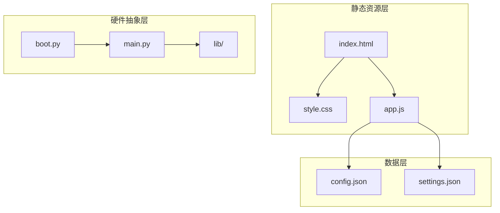
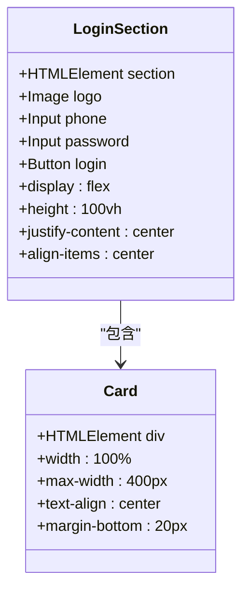
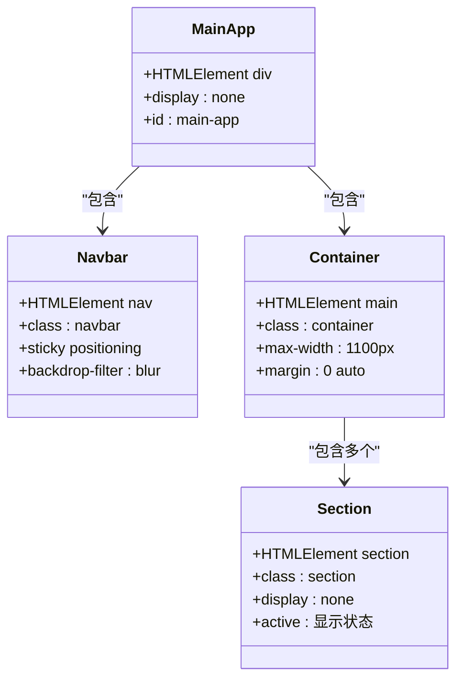
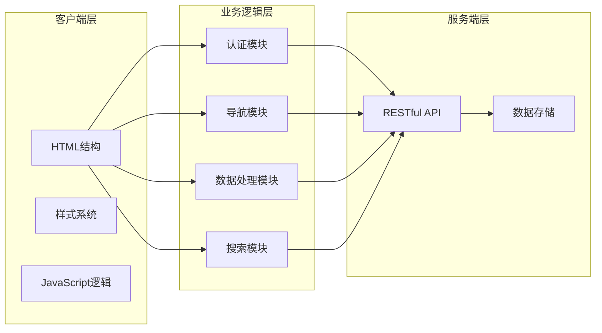
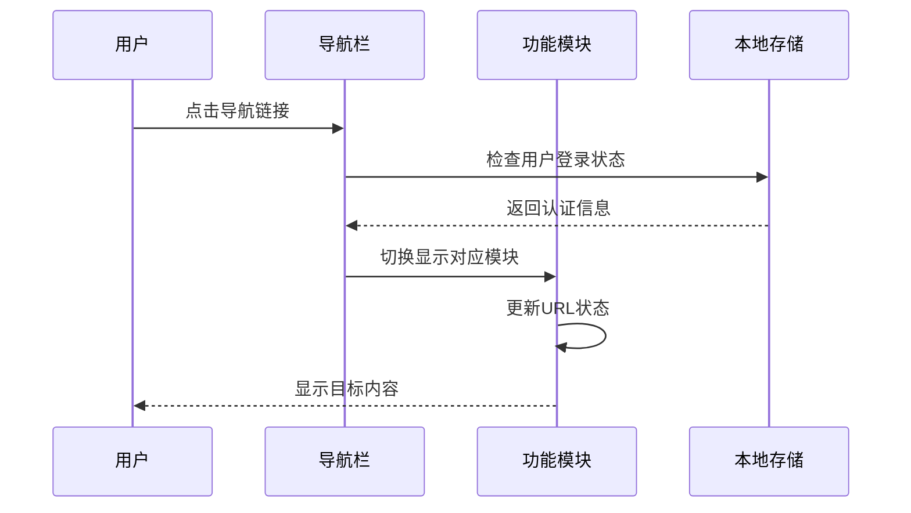
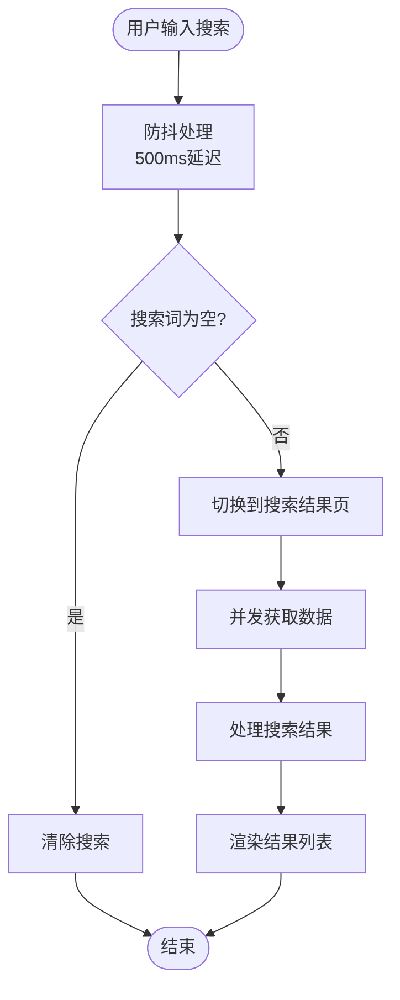
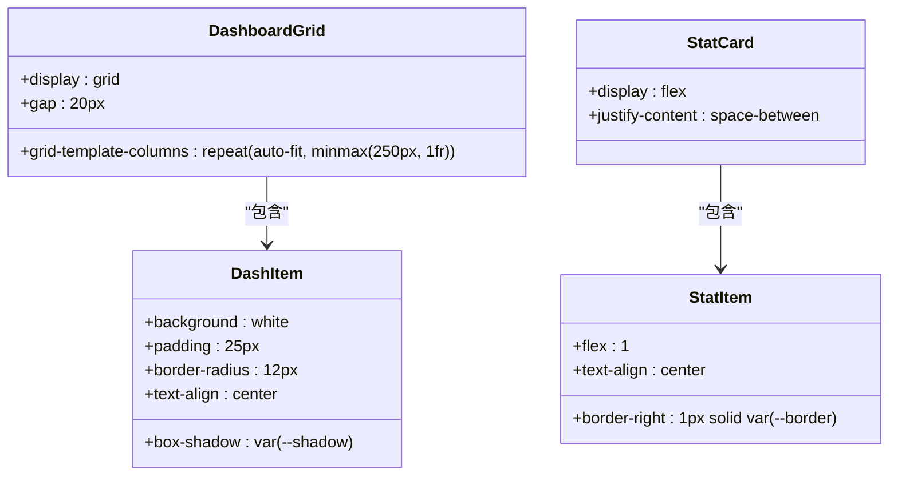
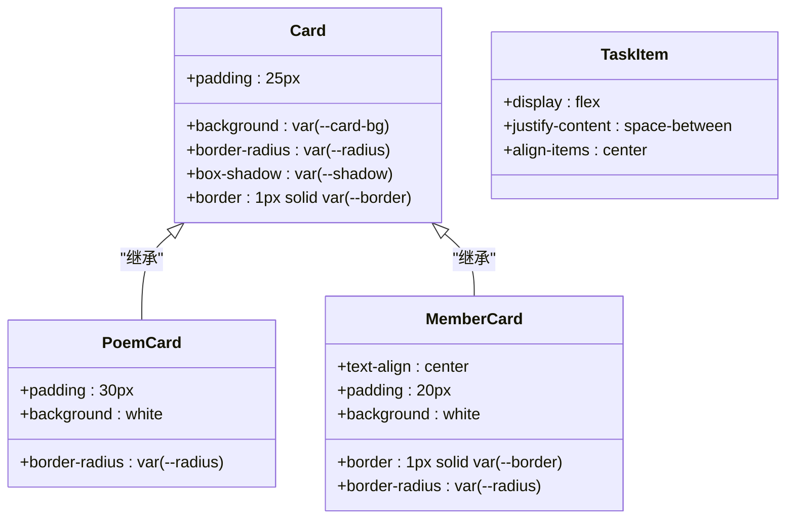
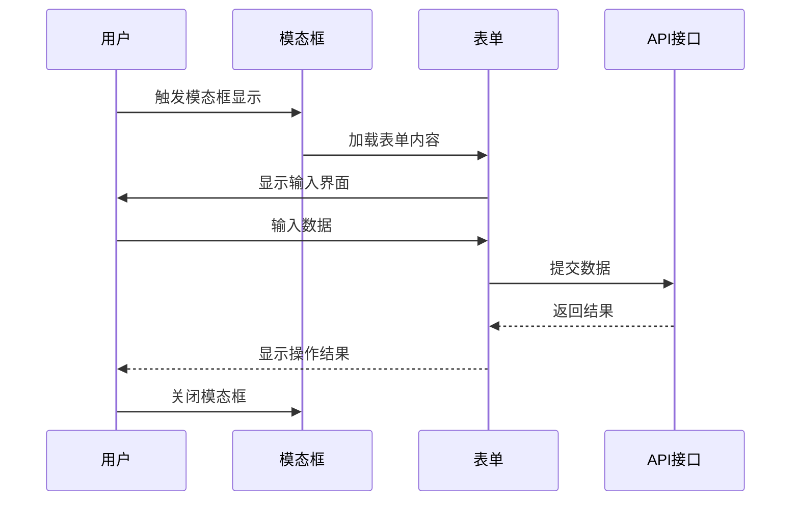
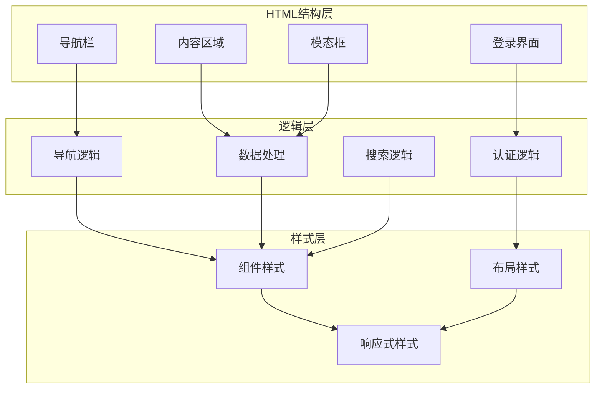

# HTML结构设计

<cite>
**本文档引用的文件**
- [index.html](file://static/index.html)
- [style.css](file://static/style.css)
- [app.js](file://static/app.js)
- [config.json](file://data/config.json)
- [settings.json](file://data/settings.json)
</cite>

## 目录
1. [简介](#简介)
2. [项目结构](#项目结构)
3. [核心组件](#核心组件)
4. [架构概览](#架构概览)
5. [详细组件分析](#详细组件分析)
6. [依赖关系分析](#依赖关系分析)
7. [性能考虑](#性能考虑)
8. [故障排除指南](#故障排除指南)
9. [结论](#结论)

## 简介

围炉诗社·理事台是一个基于Web技术构建的诗社管理系统，采用HTML5语义化结构设计，实现了响应式布局和良好的可访问性。该项目通过单一页面应用(SPA)架构，提供了登录界面、主应用界面以及多个功能模块的完整HTML结构设计。

## 项目结构

项目采用简洁的三层架构：静态资源层、样式层和交互层。主要文件组织如下：

**图表来源**
- [index.html](file://static/index.html#L1-L269)
- [style.css](file://static/style.css#L1-L385)
- [app.js](file://static/app.js#L1-L1312)

**章节来源**
- [index.html](file://static/index.html#L1-L269)
- [style.css](file://static/style.css#L1-L385)
- [app.js](file://static/app.js#L1-L1312)

## 核心组件

### 登录界面组件

登录界面采用全屏居中布局，包含品牌标识、用户凭据输入和认证按钮。该组件使用Flexbox实现垂直和水平居中，确保在不同屏幕尺寸下的良好显示效果。

**图表来源**
- [index.html](file://static/index.html#L10-L20)

### 主应用界面组件

主应用界面采用模块化设计，包含导航栏、内容区域和多个功能模块。界面结构清晰，便于维护和扩展。

**图表来源**
- [index.html](file://static/index.html#L22-L172)

**章节来源**
- [index.html](file://static/index.html#L10-L172)

## 架构概览

系统采用客户端-服务器架构，HTML结构作为前端展示层，JavaScript负责业务逻辑处理，CSS提供样式渲染。

**图表来源**
- [app.js](file://static/app.js#L61-L147)
- [index.html](file://static/index.html#L1-L269)

## 详细组件分析

### 导航栏结构设计

导航栏采用响应式设计，支持桌面端和移动端的不同布局需求。导航链接采用Flexbox布局，确保在不同屏幕尺寸下的良好显示效果。

**图表来源**
- [index.html](file://static/index.html#L24-L39)
- [app.js](file://static/app.js#L109-L147)

### 全局搜索栏实现

全局搜索栏采用防抖机制和异步搜索处理，支持多模块搜索结果的聚合显示。

**图表来源**
- [app.js](file://static/app.js#L1129-L1215)

### 仪表盘网格布局

仪表盘采用CSS Grid布局实现响应式网格系统，支持不同屏幕尺寸下的自适应调整。

**图表来源**
- [style.css](file://static/style.css#L150-L165)
- [style.css](file://static/style.css#L304-L314)

### 卡片系统设计

卡片系统采用统一的设计语言，提供一致的视觉体验和交互反馈。

**图表来源**
- [style.css](file://static/style.css#L88-L95)
- [style.css](file://static/style.css#L222-L250)
- [style.css](file://static/style.css#L185-L221)

### 模态框系统

模态框系统支持多种类型的对话框，包括表单输入、详情查看和确认操作。

**图表来源**
- [index.html](file://static/index.html#L174-L263)
- [app.js](file://static/app.js#L149-L153)

**章节来源**
- [index.html](file://static/index.html#L174-L263)
- [style.css](file://static/style.css#L251-L302)
- [app.js](file://static/app.js#L149-L153)

## 依赖关系分析

系统各组件之间的依赖关系清晰明确，遵循单一职责原则。

**图表来源**
- [index.html](file://static/index.html#L1-L269)
- [style.css](file://static/style.css#L1-L385)
- [app.js](file://static/app.js#L1-L1312)

**章节来源**
- [index.html](file://static/index.html#L1-L269)
- [style.css](file://static/style.css#L1-L385)
- [app.js](file://static/app.js#L1-L1312)

## 性能考虑

系统在设计时充分考虑了性能优化，采用了多种策略提升用户体验：

### 响应式设计优化
- 使用CSS Grid和Flexbox实现高效的布局计算
- 移动端优先的设计理念，确保在小屏幕设备上的良好表现
- 防抖机制减少不必要的API调用

### 内存管理
- IndexedDB本地存储草稿，减少服务器压力
- 数据缓存机制避免重复请求相同数据
- 模态框按需加载，减少初始渲染负担

### 可访问性优化
- 语义化HTML标签的正确使用
- 键盘导航支持
- 屏幕阅读器兼容性

## 故障排除指南

### 常见问题及解决方案

**登录失败**
- 检查用户名和密码格式
- 确认网络连接正常
- 清除浏览器缓存后重试

**页面加载缓慢**
- 检查网络连接质量
- 关闭不必要的浏览器标签
- 清理浏览器缓存

**搜索功能异常**
- 确认搜索关键词长度
- 检查API服务状态
- 刷新页面重试

**模态框显示问题**
- 检查CSS样式冲突
- 确认JavaScript脚本加载
- 尝试重新打开浏览器

**章节来源**
- [app.js](file://static/app.js#L75-L98)
- [app.js](file://static/app.js#L1218-L1242)

## 结论

围炉诗社·理事台项目展现了优秀的HTML结构设计实践，通过语义化标签、响应式布局和模块化组件设计，构建了一个功能完善、易于维护的Web应用。项目在保持代码简洁性的同时，充分考虑了用户体验和可访问性要求，为类似项目的开发提供了良好的参考范例。

系统的核心优势包括：
- 清晰的HTML语义化结构
- 灵活的响应式设计
- 高效的数据处理机制
- 完善的错误处理和故障排除机制
- 良好的可扩展性和维护性

这些特性使得项目不仅满足当前的功能需求，也为未来的功能扩展和技术演进奠定了坚实的基础。