# JavaScript交互逻辑

<cite>
**本文引用的文件**
- [index.html](file://src/static/index.html)
- [app.js](file://src/static/app.js)
- [style.css](file://src/static/style.css)
- [main.py](file://src/main.py)
- [boot.py](file://src/boot.py)
- [config.json](file://src/data/config.json)
- [settings.json](file://src/data/settings.json)
</cite>

## 更新摘要
**变更内容**
- 新增850多行聊天室功能实现，包括WebSocket连接管理、实时消息同步
- 新增用户认证状态处理和Token过期管理
- 新增首页聊天预览和增量消息加载机制
- 新增聊天室状态监控和内存管理
- 新增响应式设计支持和移动端优化

## 目录
1. [简介](#简介)
2. [项目结构](#项目结构)
3. [核心组件](#核心组件)
4. [架构总览](#架构总览)
5. [详细组件分析](#详细组件分析)
6. [依赖关系分析](#依赖关系分析)
7. [性能考量](#性能考量)
8. [故障排查指南](#故障排查指南)
9. [结论](#结论)
10. [附录](#附录)

## 简介
本文件面向"围炉诗社·理事台"项目的前端JavaScript交互逻辑，系统性梳理前端路由与页面切换、事件处理、API数据获取与异步请求、错误处理策略、用户认证与权限控制、**实时数据更新与轮询机制**、表单验证与数据绑定、模态框管理与DOM操作、动画效果、性能优化与内存管理、调试方法以及与后端API的集成方式与数据格式处理。文档同时给出关键流程的时序图与类图，帮助读者快速理解代码结构与交互路径。

**更新** 本版本重点反映了新增的聊天室功能、WebSocket连接管理、实时消息同步、用户认证状态处理等重大更新。

## 项目结构
该项目采用前后端分离的极简架构：
- 前端静态资源位于 static/ 目录，包含入口HTML、样式与脚本。
- 后端使用Microdot框架提供REST API，数据以JSON Lines文件形式持久化在 data/ 目录。
- 设备侧启动脚本 boot.py 负责初始化网络与引导应用。

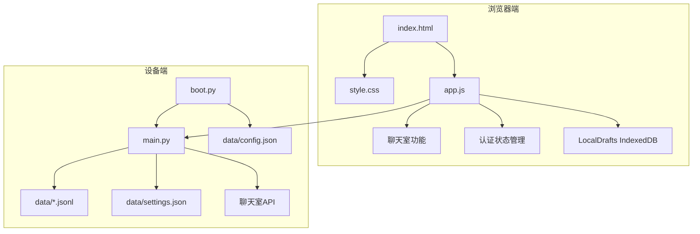

**图表来源**
- [index.html](file://src/static/index.html#L1-L792)
- [app.js](file://src/static/app.js#L1-L3997)
- [main.py](file://src/main.py#L2442-L2603)
- [boot.py](file://src/boot.py#L1-L122)

**章节来源**
- [index.html](file://src/static/index.html#L1-L792)
- [app.js](file://src/static/app.js#L1-L3997)
- [style.css](file://src/static/style.css#L1-L464)
- [main.py](file://src/main.py#L1-L2621)
- [boot.py](file://src/boot.py#L1-L122)

## 核心组件
- **完整的SPA架构**：基于单页应用模式，通过统一的页面显示函数控制各section的显隐，实现无刷新页面切换。
- **用户认证系统**：基于localStorage存储用户信息，登录成功后隐藏登录区并显示主应用，支持密码哈希验证和Token过期管理。
- **IndexedDB本地草稿**：实现完整的本地草稿存储系统，支持草稿的创建、保存、发布和删除。
- **导航与页面切换**：通过统一的页面显示函数控制各section的显隐，并根据当前页自动触发数据拉取。
- **数据获取与缓存**：对Poems、Activities、Members、Finance、Tasks等模块分别维护缓存数组，支持分页与搜索。
- **表单与模态框**：Poem、Member、Activity、Finance等表单均通过模态框承载，提交前进行基础校验。
- **全局搜索**：支持跨模块搜索，服务端返回结果，前端高亮关键词并提供跳转。
- **自定义字段**：管理员可在后台配置成员自定义字段，前端动态渲染。
- **权限控制**：根据角色显示/隐藏管理按钮与功能。
- **错误处理**：统一的alert提示与console错误记录；部分接口返回错误码时进行分支处理。
- **动画与交互**：页面切换与模态框展示使用CSS动画；移动端适配良好。
- **实时聊天室**：**新增**完整的聊天室功能，支持实时消息同步、用户状态指示、响应式设计。
- **轮询机制**：**新增**基于定时器的消息轮询，实现近实时的聊天体验。
- **聊天室状态管理**：**新增**聊天室连接状态、用户在线状态、消息缓存管理。

**章节来源**
- [app.js](file://src/static/app.js#L616-L690)
- [app.js](file://src/static/app.js#L3404-L3427)
- [app.js](file://src/static/app.js#L3487-L3505)

## 架构总览
前端通过fetch调用后端API，后端以Microdot提供路由，数据持久化于JSON Lines文件。设备侧启动脚本负责网络初始化与应用启动。新增的聊天室功能通过轮询机制实现实时消息同步，支持登录用户和游客两种身份。

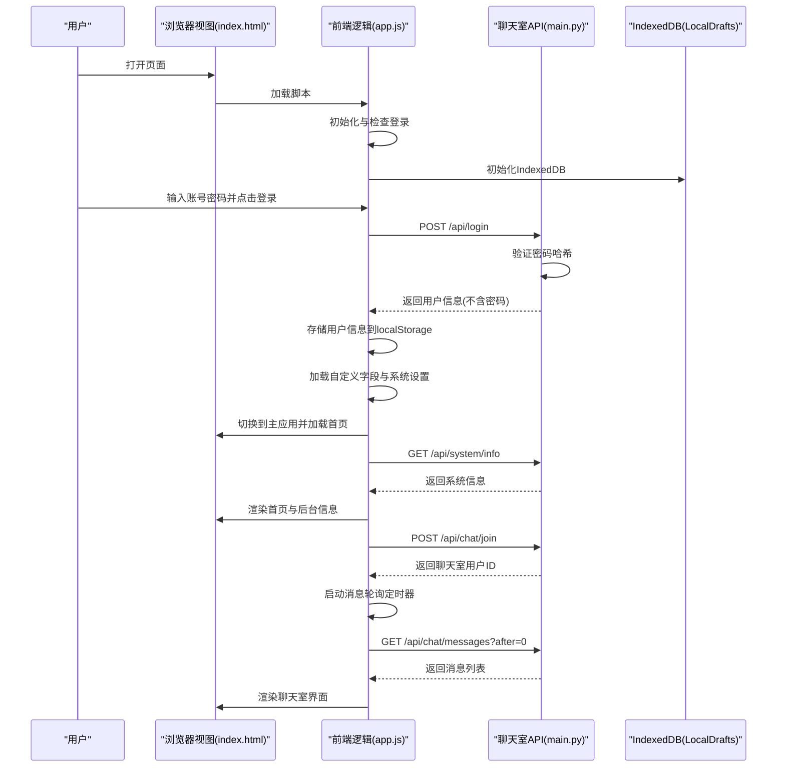

**图表来源**
- [index.html](file://src/static/index.html#L1-L792)
- [app.js](file://src/static/app.js#L3404-L3427)
- [app.js](file://src/static/app.js#L3487-L3505)
- [main.py](file://src/main.py#L2442-L2488)

## 详细组件分析

### 登录与会话管理
- **登录流程**：前端收集手机号与密码，调用登录接口；后端验证密码哈希值；成功后将用户信息写入localStorage并切换到主应用。
- **会话保持**：页面加载时检查localStorage中的用户信息，若存在则直接进入主应用。
- **退出登录**：清除localStorage并回到登录页。
- **密码安全**：后端使用SHA256哈希存储密码，支持密码迁移功能。
- **Token管理**：**新增**Token过期时间管理，支持30天有效期配置。

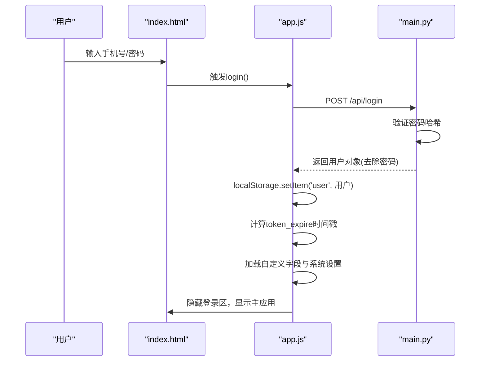

**图表来源**
- [app.js](file://src/static/app.js#L358-L397)
- [main.py](file://src/main.py#L551-L574)

**章节来源**
- [app.js](file://src/static/app.js#L225-L276)
- [app.js](file://src/static/app.js#L358-L397)
- [main.py](file://src/main.py#L28-L47)
- [main.py](file://src/main.py#L551-L574)

### IndexedDB本地草稿系统
- **数据库初始化**：自动创建名为"PoetryDraftsDB"的对象存储空间，键路径为"id"。
- **草稿管理**：支持草稿的保存、读取、删除操作，自动处理IndexedDB的异步特性。
- **草稿标识**：本地草稿具有"isLocal"标志，在UI中显示特殊样式。
- **草稿合并**：首页加载时将本地草稿与服务器数据合并显示。

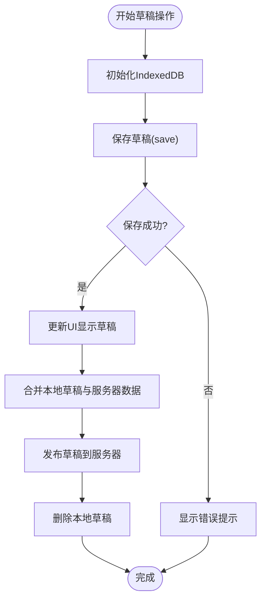

**图表来源**
- [app.js](file://src/static/app.js#L117-L174)
- [app.js](file://src/static/app.js#L385-L444)

**章节来源**
- [app.js](file://src/static/app.js#L117-L174)
- [app.js](file://src/static/app.js#L385-L444)

### 页面导航与切换
- **SPA架构**：基于单页应用模式，通过统一的页面显示函数控制各section的显隐。
- **历史跟踪**：记录上一个页面，支持搜索结果页面的历史返回。
- **权限控制**：根据用户角色决定是否显示"新增成员/活动"按钮。
- **自动数据拉取**：根据当前页面自动触发对应的数据拉取函数。
- **聊天室集成**：**新增**聊天室页面的导航集成，支持聊天室功能开关控制。

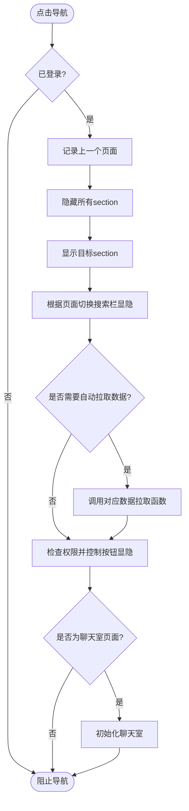

**图表来源**
- [app.js](file://src/static/app.js#L616-L690)
- [app.js](file://src/static/app.js#L3404-L3427)

**章节来源**
- [app.js](file://src/static/app.js#L616-L690)
- [app.js](file://src/static/app.js#L3404-L3427)

### 数据获取与缓存（Poems）
- **分页策略**：每次请求固定数量条目，依据返回长度判断是否还有下一页。
- **本地草稿合并**：第一页刷新时合并本地IndexedDB草稿，后续加载更多仅追加服务器数据。
- **渲染与按钮控制**：根据是否还有更多数据控制"加载更多"按钮显隐。
- **草稿状态标识**：本地草稿在UI中显示特殊样式和标签。

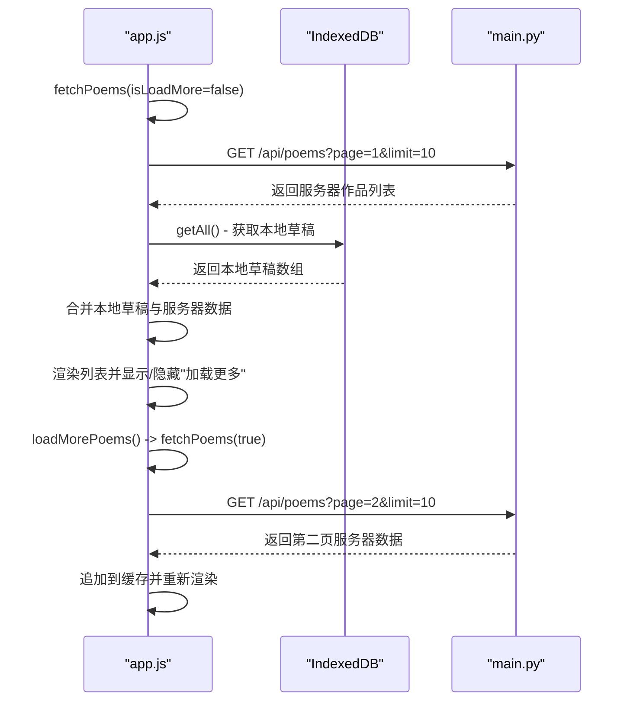

**图表来源**
- [app.js](file://src/static/app.js#L766-L800)
- [app.js](file://src/static/app.js#L800-L844)

**章节来源**
- [app.js](file://src/static/app.js#L766-L844)
- [app.js](file://src/static/app.js#L846-L900)

### 聊天室功能（新增）
- **聊天室初始化**：**新增**完整的聊天室功能，支持用户加入、消息发送、用户列表显示。
- **消息轮询**：**新增**基于定时器的消息轮询机制，每10秒自动刷新聊天内容。
- **用户状态管理**：**新增**登录用户和游客两种身份，支持用户在线状态显示。
- **消息格式化**：**新增**消息时间格式化、HTML转义、用户身份标识等功能。
- **聊天室状态**：**新增**聊天室内存使用、用户数量、消息数量等状态监控。

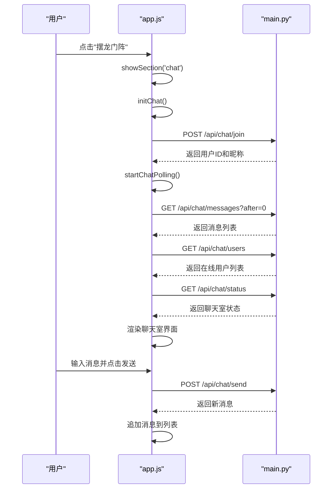

**图表来源**
- [app.js](file://src/static/app.js#L3404-L3427)
- [app.js](file://src/static/app.js#L3487-L3505)
- [main.py](file://src/main.py#L2442-L2488)

**章节来源**
- [app.js](file://src/static/app.js#L3382-L3996)
- [main.py](file://src/main.py#L2414-L2603)

### 首页聊天预览（新增）
- **增量加载**：**新增**首页聊天预览功能，支持增量消息加载和缓存管理。
- **定时刷新**：**新增**每10秒自动刷新首页聊天预览，保持实时性。
- **内存优化**：**新增**消息缓存限制，最多保留50条消息避免内存占用过高。
- **状态检测**：**新增**服务器重启检测机制，自动全量重载消息。

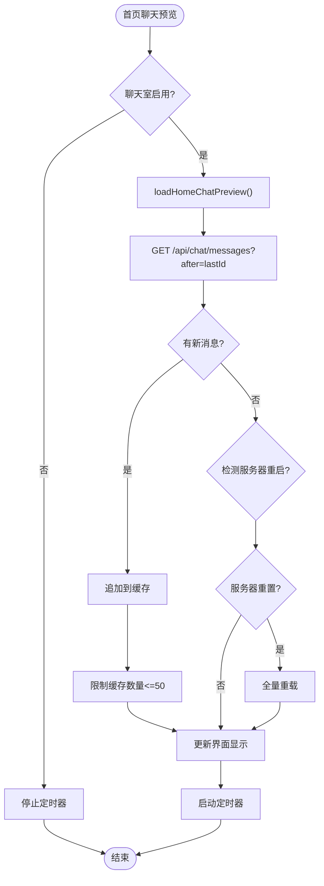

**图表来源**
- [app.js](file://src/static/app.js#L3828-L3871)
- [app.js](file://src/static/app.js#L3873-L3891)

**章节来源**
- [app.js](file://src/static/app.js#L3828-L3891)

### 成员管理（Members）
- **新增/编辑**：收集基础字段与自定义字段，提交前进行必填校验；密码为空则不更新。
- **删除**：仅超级管理员可删除。
- **渲染**：根据角色显示编辑/删除按钮。
- **自定义字段**：动态渲染管理员配置的自定义字段。

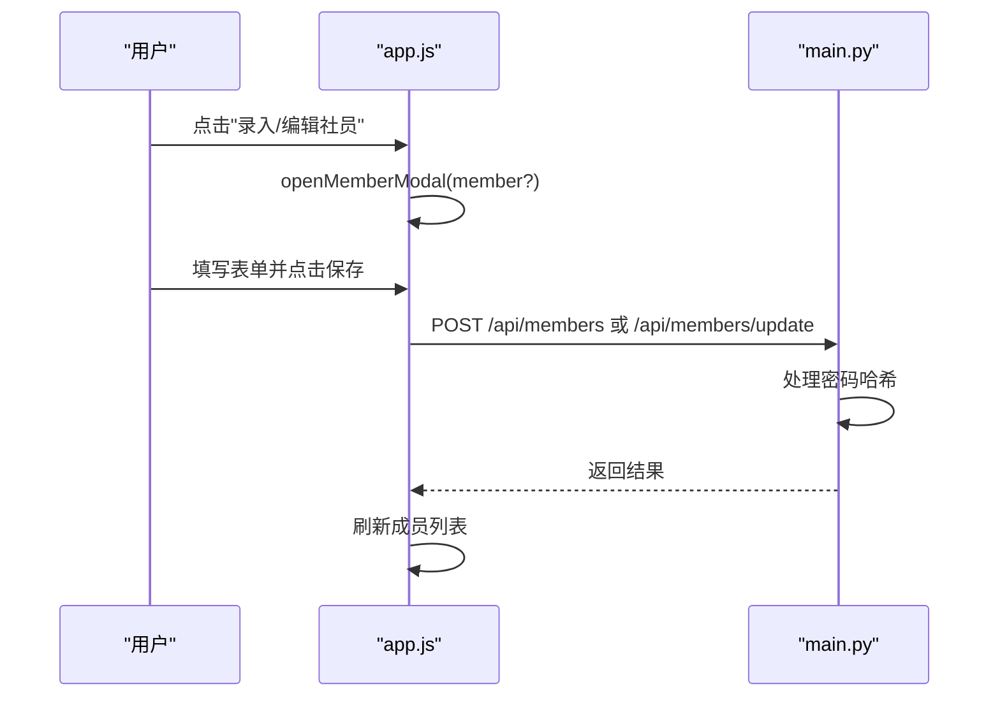

**图表来源**
- [app.js](file://src/static/app.js#L591-L629)
- [app.js](file://src/static/app.js#L631-L695)
- [main.py](file://src/main.py#L513-L549)

**章节来源**
- [app.js](file://src/static/app.js#L591-L695)
- [main.py](file://src/main.py#L508-L549)

### 活动管理（Activities）
- **发起/编辑**：支持选择状态、时间、地点等；编辑时复用相同模态框。
- **查看详情**：只读展示，管理员可编辑/删除。
- **删除**：确认后调用删除接口并刷新列表。

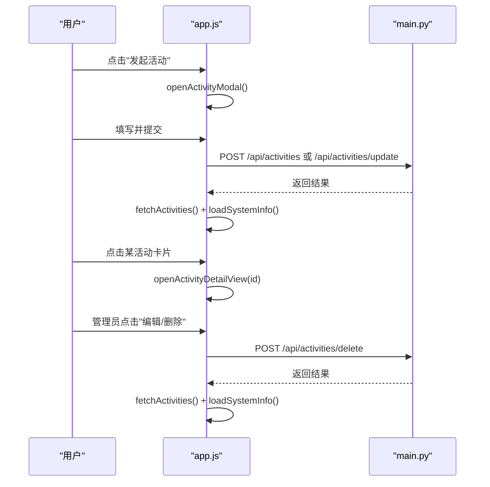

**图表来源**
- [app.js](file://src/static/app.js#L861-L880)
- [app.js](file://src/static/app.js#L882-L924)
- [app.js](file://src/static/app.js#L1037-L1092)
- [main.py](file://src/main.py#L428-L466)

**章节来源**
- [app.js](file://src/static/app.js#L804-L936)
- [app.js](file://src/static/app.js#L1037-L1104)
- [main.py](file://src/main.py#L428-L466)

### 财务管理（Finance）
- **记账**：区分收入/支出，提交金额、摘要、经办人等。
- **统计**：计算总收入、总支出与结余，并渲染表格。

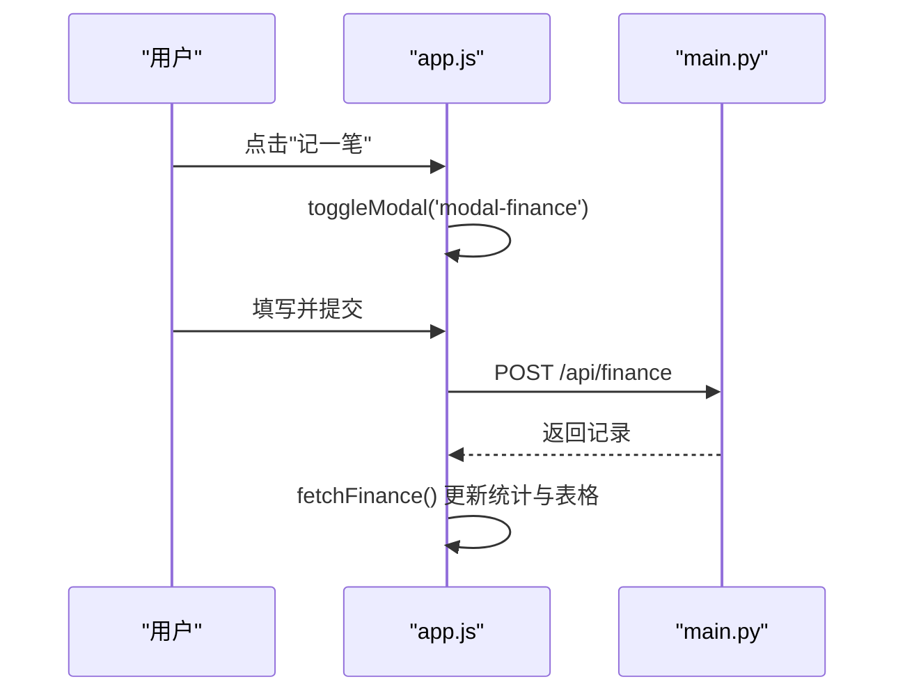

**图表来源**
- [app.js](file://src/static/app.js#L991-L1033)
- [main.py](file://src/main.py#L575-L587)

**章节来源**
- [app.js](file://src/static/app.js#L707-L732)
- [app.js](file://src/static/app.js#L991-L1033)
- [main.py](file://src/main.py#L575-L587)

### 事务与积分（Tasks）
- **展示**：列出任务标题、描述与奖励积分。
- **完成**：管理员确认后调用完成接口，更新任务状态并给成员加分。

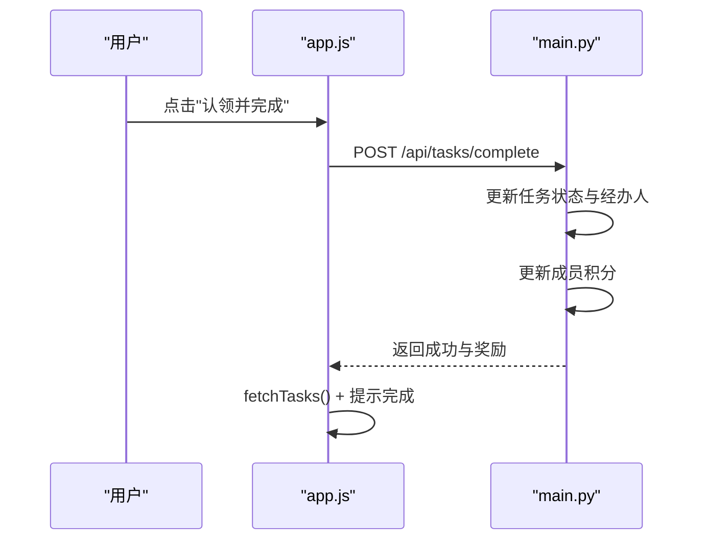

**图表来源**
- [app.js](file://src/static/app.js#L779-L802)
- [main.py](file://src/main.py#L467-L507)

**章节来源**
- [app.js](file://src/static/app.js#L734-L780)
- [main.py](file://src/main.py#L467-L507)

### 全局搜索（Search）
- **输入监听**：防抖500ms后发起搜索请求。
- **并行请求**：同时查询Poems与Activities，Tasks本地过滤。
- **结果渲染**：按模块分组展示，支持关键词高亮；点击跳转到对应编辑/查看界面。
- **搜索结果页面**：独立的搜索结果显示页面，支持历史返回。

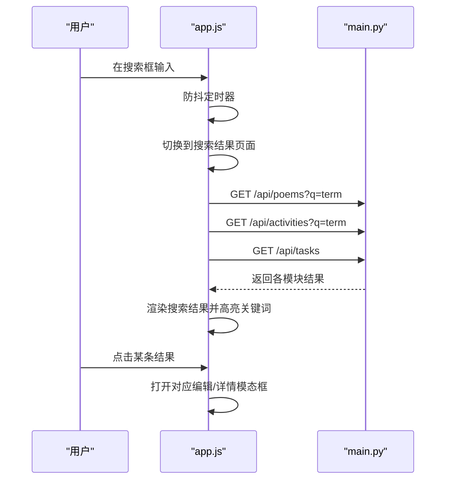

**图表来源**
- [app.js](file://src/static/app.js#L1284-L1357)
- [app.js](file://src/static/app.js#L1360-L1371)

**章节来源**
- [app.js](file://src/static/app.js#L1264-L1371)

### 自定义字段管理（Admin）
- **字段定义**：管理员可添加/删除自定义字段类型（文本/数字/日期/邮箱）。
- **前端渲染**：成员表单动态生成对应输入项。
- **后端持久化**：字段定义保存在settings.json中。

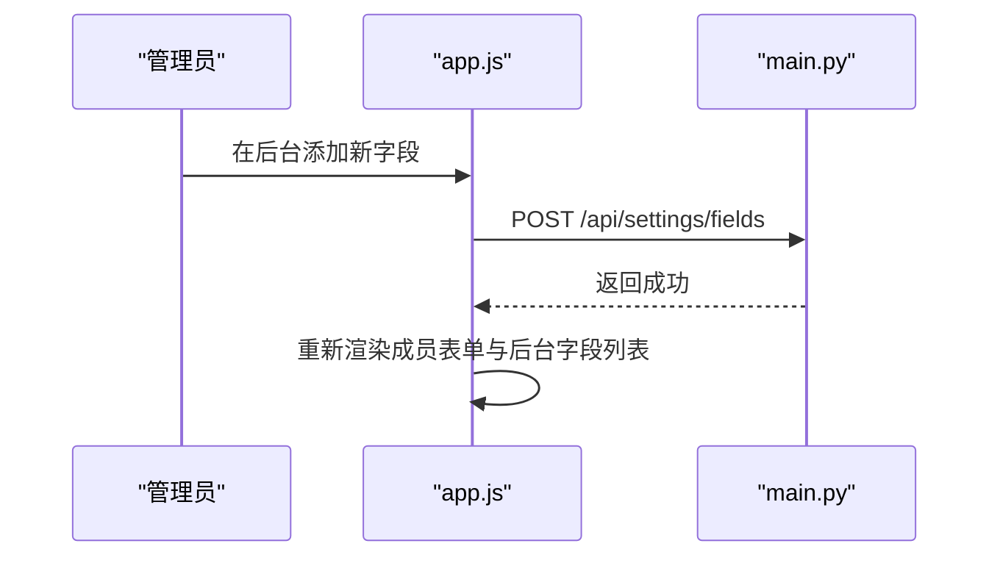

**图表来源**
- [app.js](file://src/static/app.js#L1483-L1522)
- [main.py](file://src/main.py#L596-L604)

**章节来源**
- [app.js](file://src/static/app.js#L1400-L1522)
- [main.py](file://src/main.py#L596-L604)

### 模态框管理与DOM操作
- **显示/隐藏**：统一的切换函数控制模态框显隐。
- **动画**：模态框内容使用滑入动画，关闭按钮带旋转过渡。
- **DOM注入**：根据上下文动态注入按钮与表单控件。

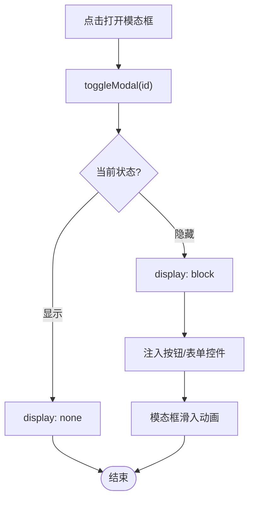

**图表来源**
- [app.js](file://src/static/app.js#L704-L748)
- [style.css](file://src/static/style.css#L251-L302)

**章节来源**
- [app.js](file://src/static/app.js#L704-L748)
- [style.css](file://src/static/style.css#L251-L302)

### 实时数据更新与轮询机制（新增）
- **轮询实现**：**新增**基于setInterval的轮询机制，每10秒自动刷新聊天室数据。
- **增量加载**：**新增**消息增量加载机制，支持after参数实现增量获取。
- **内存管理**：**新增**聊天室消息缓存管理，支持内存使用限制和自动清理。
- **状态监控**：**新增**聊天室状态监控，包括内存使用、用户数量、消息数量等。
- **错误处理**：**新增**轮询过程中的错误处理和重试机制。

**章节来源**
- [app.js](file://src/static/app.js#L3487-L3505)
- [app.js](file://src/static/app.js#L3828-L3871)
- [app.js](file://src/static/app.js#L3873-L3891)
- [main.py](file://src/main.py#L2343-L2365)

### 表单验证、数据绑定与用户输入处理
- **基础校验**：登录、发布作品、记账、录入成员等均进行必填项校验。
- **数据绑定**：通过DOM元素的value属性读取与设置，提交时组装为JSON对象。
- **输入限制**：日期时间使用本地ISO字符串格式，金额使用数值类型。
- **草稿保存**：支持草稿的临时保存和恢复。
- **聊天室输入**：**新增**消息长度限制（256字符）、输入框事件绑定、发送按钮状态控制。

**章节来源**
- [app.js](file://src/static/app.js#L3737-L3789)
- [app.js](file://src/static/app.js#L3945-L3996)
- [app.js](file://src/static/app.js#L3706-L3732)

### 权限控制与角色管理
- **角色映射**：超级管理员、管理员、理事、财务、普通社员。
- **权限判定**：仅特定角色显示"新增成员/活动"按钮；编辑/删除按钮仅超级管理员可见。
- **草稿权限**：作者可编辑自己的草稿，管理员可管理所有草稿。
- **聊天室权限**：**新增**聊天室功能开关控制，支持管理员配置聊天室状态。

**章节来源**
- [app.js](file://src/static/app.js#L45-L64)
- [app.js](file://src/static/app.js#L680-L690)
- [app.js](file://src/static/app.js#L3896-L3929)

## 依赖关系分析
- **前端依赖**：index.html引入app.js与style.css；app.js依赖fetch API与localStorage；使用IndexedDB进行本地草稿存储；**新增**依赖聊天室API进行实时通信。
- **后端依赖**：main.py依赖Microdot框架与文件系统；数据层封装JsonlDB类，提供分页、搜索、更新、删除等能力；**新增**聊天室API提供实时消息服务。
- **启动流程**：boot.py负责WiFi连接与AP回退，随后导入main.py并启动应用。
- **配置管理**：config.json管理WiFi配置，settings.json管理应用设置。

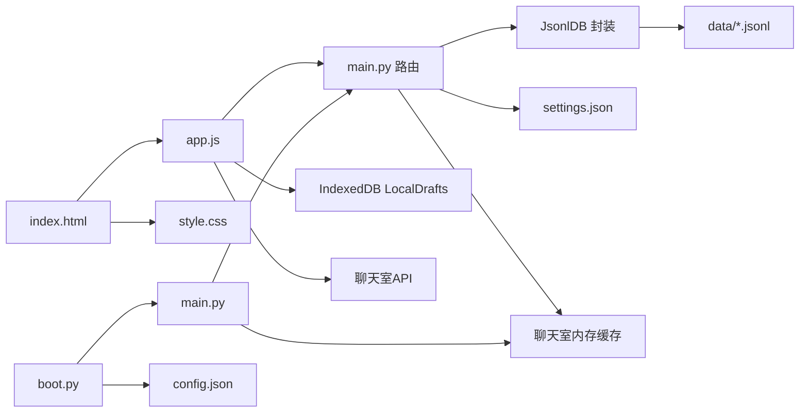

**图表来源**
- [index.html](file://src/static/index.html#L1-L792)
- [app.js](file://src/static/app.js#L1-L3997)
- [style.css](file://src/static/style.css#L1-L464)
- [main.py](file://src/main.py#L2442-L2603)
- [boot.py](file://src/boot.py#L1-L122)

**章节来源**
- [main.py](file://src/main.py#L284-L291)
- [boot.py](file://src/boot.py#L1-L122)
- [config.json](file://src/data/config.json#L1-L6)
- [settings.json](file://src/data/settings.json#L1-L5)

## 性能考量
- **请求合并与并发**：搜索阶段使用Promise.all并行请求多个模块，缩短首屏等待时间。
- **防抖与竞态控制**：搜索输入使用500ms防抖，配合请求ID避免旧请求覆盖新结果。
- **缓存策略**：各模块维护内存缓存数组，分页加载与本地草稿合并提升体验。
- **DOM最小化更新**：列表渲染采用一次性innerHTML拼接，减少多次重排。
- **内存管理**：页面切换时隐藏非活跃section，避免DOM堆积；IndexedDB访问失败时降级处理。
- **IndexedDB优化**：使用事务批量操作，避免频繁的数据库访问。
- **聊天室优化**：**新增**消息缓存限制（最多50条），内存使用限制（默认128KB），自动清理过期消息。
- **轮询优化**：**新增**10秒轮询间隔，避免过于频繁的请求；支持增量加载减少数据传输。
- **错误处理优化**：**新增**轮询过程中的错误处理和重试机制，提升稳定性。

**章节来源**
- [app.js](file://src/static/app.js#L3828-L3871)
- [app.js](file://src/static/app.js#L3873-L3891)
- [app.js](file://src/static/app.js#L3830-L3871)
- [main.py](file://src/main.py#L2343-L2365)

## 故障排查指南
- **登录失败**：检查后端登录接口返回状态；确认账号密码正确且存在于成员数据中；验证密码哈希是否正确。
- **数据拉取异常**：查看控制台错误日志；确认后端路由可用且数据文件存在。
- **搜索无结果**：确认服务端搜索参数编码正确；检查任务模块是否返回了预期数据。
- **IndexedDB不可用**：本地草稿保存/读取会降级，不影响服务器数据流。
- **权限不足**：确认当前用户角色具备相应操作权限。
- **草稿丢失**：检查IndexedDB是否正常工作，确认草稿ID格式正确。
- **聊天室连接失败**：**新增**检查聊天室API是否可用，确认聊天室功能是否启用。
- **消息发送失败**：**新增**检查Token是否过期，确认用户身份验证是否正常。
- **轮询异常**：**新增**检查定时器是否正常运行，确认网络连接稳定。

**章节来源**
- [main.py](file://src/main.py#L551-L574)
- [app.js](file://src/static/app.js#L3432-L3460)
- [app.js](file://src/static/app.js#L3737-L3789)
- [app.js](file://src/static/app.js#L3828-L3871)

## 结论
本项目前端以轻量脚本实现完整的业务交互，结合后端REST API与JSON Lines数据存储，形成简洁高效的本地化管理系统。通过统一的页面切换、完善的表单校验与权限控制、并发搜索与缓存策略，实现了良好的用户体验。新增的IndexedDB本地草稿功能、完整的用户认证系统、**聊天室功能**以及**轮询机制**进一步提升了应用的实用性和实时性。未来可在高频变更场景引入WebSocket或更高效的轮询策略，并进一步优化内存与渲染性能。

## 附录
- **启动流程**：boot.py初始化WiFi与AP模式，导入main.py并启动Microdot应用。
- **数据模型**：Poems、Members、Activities、Finance、Tasks均以JSON Lines存储，支持分页与搜索。
- **样式与动画**：采用现代化卡片布局与滑入/淡入动画，移动端适配良好。
- **配置文件**：config.json管理WiFi配置，settings.json管理应用设置和自定义字段。
- **聊天室配置**：**新增**聊天室缓存大小、游客上限、用户上限等配置项。
- **API接口**：**新增**聊天室相关API接口，包括join、leave、send、messages、users、status等。

**章节来源**
- [boot.py](file://src/boot.py#L88-L122)
- [main.py](file://src/main.py#L284-L291)
- [style.css](file://src/static/style.css#L1-L464)
- [config.json](file://src/data/config.json#L1-L6)
- [settings.json](file://src/data/settings.json#L1-L5)