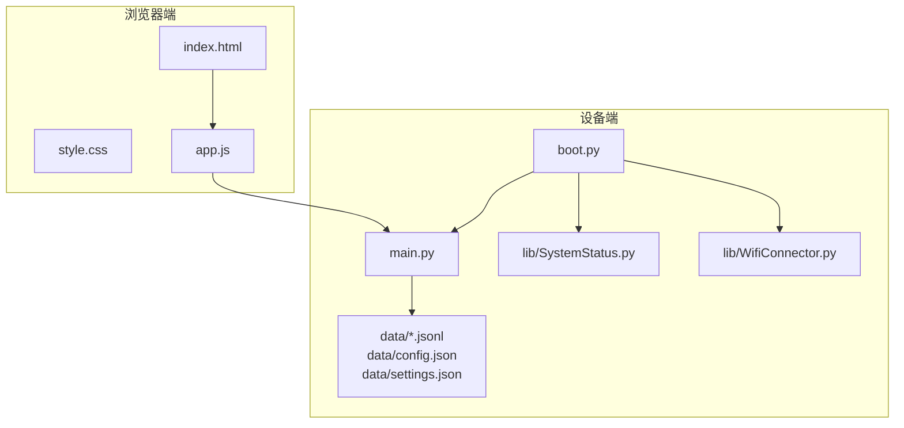
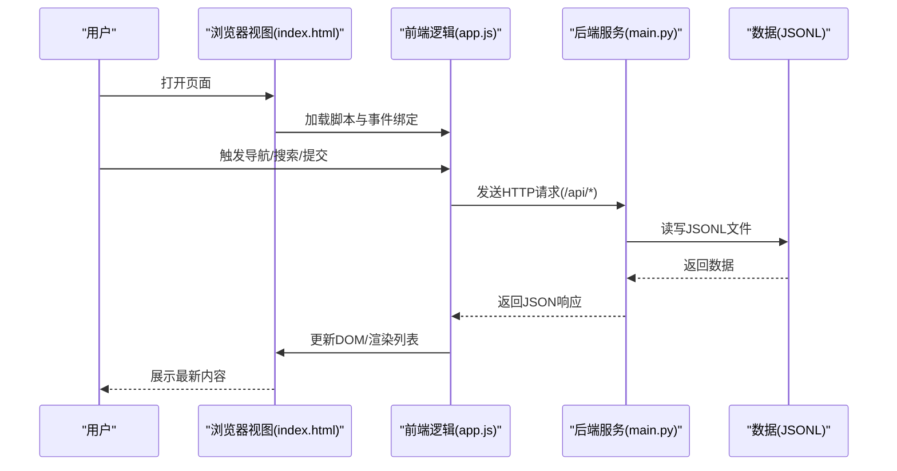
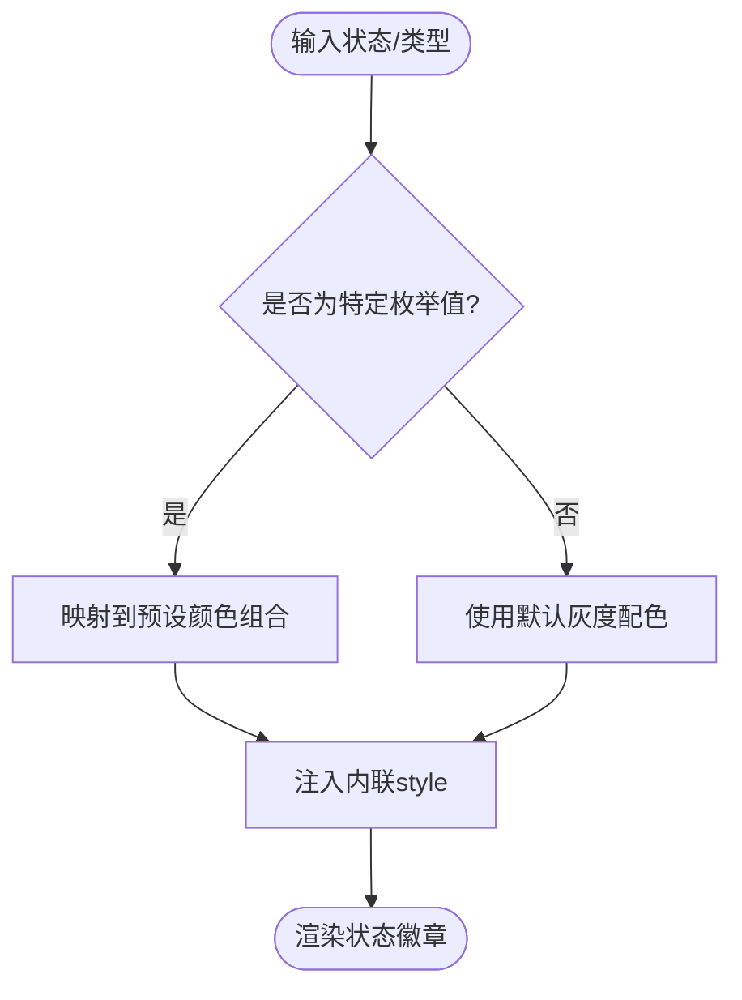
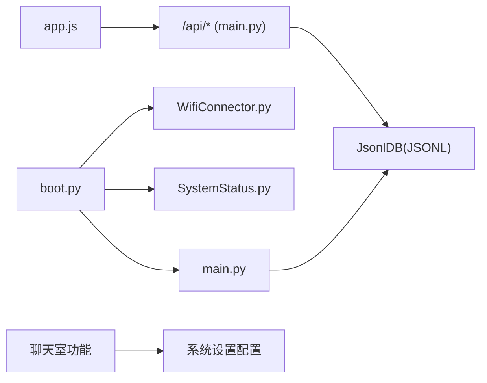

# UI组件与交互

<cite>
**本文引用的文件**
- [index.html](file://src/static/index.html)
- [style.css](file://src/static/style.css)
- [app.js](file://src/static/app.js)
- [main.py](file://src/main.py)
- [boot.py](file://src/boot.py)
- [SystemStatus.py](file://src/lib/SystemStatus.py)
- [WifiConnector.py](file://src/lib/WifiConnector.py)
- [config.json](file://src/data/config.json)
- [settings.json](file://src/data/settings.json)
</cite>

## 目录
1. [简介](#简介)
2. [项目结构](#项目结构)
3. [核心组件](#核心组件)
4. [架构总览](#架构总览)
5. [组件详解](#组件详解)
6. [聊天室功能](#聊天室功能)
7. [依赖关系分析](#依赖关系分析)
8. [性能考量](#性能考量)
9. [故障排查指南](#故障排查指南)
10. [结论](#结论)
11. [附录](#附录)

## 简介
本文件面向"围炉诗社·理事台"项目的前端UI组件与交互系统，聚焦以下目标：
- 卡片组件、按钮组件与状态徽章的实现细节与样式定制
- 列表渲染、动态内容更新与DOM操作优化
- 状态样式系统（getPoemTypeStyle、getStatusStyle）的设计模式与颜色语义
- 用户交互反馈、加载状态显示与错误状态处理
- 响应式设计、触摸友好交互与无障碍访问支持
- 组件复用策略、样式隔离与主题定制方案
- **新增** 聊天室功能的界面设计与交互实现

## 项目结构
项目采用前后端分离的嵌入式Web架构：
- 前端静态资源位于 src/static/，包含HTML页面、CSS样式与JavaScript逻辑
- 后端基于Microdot框架，提供REST API，数据以JSONL文件持久化
- 设备侧启动脚本 boot.py 与系统状态LED控制 lib/SystemStatus.py、WiFi连接 lib/WifiConnector.py 协同工作

**图表来源**
- [index.html](file://src/static/index.html#L1-L792)
- [style.css](file://src/static/style.css#L1-L1814)
- [app.js](file://src/static/app.js#L1-L3997)
- [main.py](file://src/main.py#L1-L2621)
- [boot.py](file://src/boot.py#L1-L122)

**章节来源**
- [index.html](file://src/static/index.html#L1-L792)
- [style.css](file://src/static/style.css#L1-L1814)
- [app.js](file://src/static/app.js#L1-L3997)
- [main.py](file://src/main.py#L1-L2621)
- [boot.py](file://src/boot.py#L1-L122)

## 核心组件
- 卡片组件（.card/.poem-card/.member-card）
  - 作用：承载内容区块，统一圆角、阴影、边框与内边距
  - 样式来源：卡片基础样式与各业务卡片特化样式
- 按钮组件（button）
  - 作用：触发交互动作，支持悬停与按下反馈
  - 样式来源：通用按钮样式与业务场景按钮变体
- 状态徽章（points-badge）
  - 作用：展示状态或数值标签，如活动状态、积分徽章
  - 样式来源：points-badge通用样式与动态状态样式注入

**章节来源**
- [style.css](file://src/static/style.css#L176-L183)
- [style.css](file://src/static/style.css#L224-L243)
- [style.css](file://src/static/style.css#L543-L551)

## 架构总览
前端通过 app.js 发起API请求，后端 main.py 提供REST接口，数据以JSONL文件存储。设备侧 boot.py 负责WiFi/AP启动与LED状态指示。

**图表来源**
- [index.html](file://src/static/index.html#L1-L792)
- [app.js](file://src/static/app.js#L1-L3997)
- [main.py](file://src/main.py#L827-L834)

## 组件详解

### 卡片组件（Card）
- 结构与职责
  - 通用卡片容器：.card 用于页面主要区块
  - 业务卡片：.poem-card（藏诗阁）、.member-card（成员网格）
- 样式特征
  - 圆角、阴影、边框与背景色统一，提升信息层级感
  - 内容区排版（标题、正文、元信息）通过子元素组织
- 交互与渲染
  - 列表渲染时，卡片作为列表项容器，配合动态内容更新
  - 草稿标识通过左侧边框强调本地草稿状态

**章节来源**
- [style.css](file://src/static/style.css#L176-L183)
- [style.css](file://src/static/style.css#L600-L626)
- [style.css](file://src/static/style.css#L491-L542)
- [app.js](file://src/static/app.js#L825-L898)

### 按钮组件（Button）
- 结构与职责
  - 通用按钮：.card内按钮、模态框内操作按钮
  - 小按钮：编辑/删除等微操作按钮
- 样式特征
  - 主题色背景、白色文字、圆角与过渡动画
  - 悬停缩小、按下回弹的触觉反馈
- 交互与渲染
  - 通过点击事件触发业务流程（新建、编辑、删除、发布）
  - 在提交过程中禁用按钮并显示"提交中…"文案，避免重复提交

**章节来源**
- [style.css](file://src/static/style.css#L224-L243)
- [style.css](file://src/static/style.css#L552-L597)
- [app.js](file://src/static/app.js#L1716-L1735)
- [app.js](file://src/static/app.js#L1867-L1886)

### 状态徽章（Points Badge）
- 结构与职责
  - 通用徽章：points-badge，用于展示状态或数值
  - 活动状态徽章：直接渲染在卡片右上角
- 样式特征
  - 圆角背景、紧凑内边距、小字号与半粗体字重
- 动态样式注入
  - 通过 getStatusStyle(status) 注入背景色与文字色
  - 诗词类型徽章通过 getPoemTypeStyle(type) 注入颜色语义

**章节来源**
- [style.css](file://src/static/style.css#L543-L551)
- [app.js](file://src/static/app.js#L1967-L1973)
- [app.js](file://src/static/app.js#L1958-L1965)

### 列表渲染与动态更新
- 藏诗阁列表
  - 分页加载：每页10条，支持"加载更多"
  - 本地草稿合并：第一页合并本地草稿，后续页仅服务器数据
  - 渲染：map生成卡片，注入编辑/删除按钮与草稿标识
- 成员列表
  - 基于缓存渲染，支持编辑/删除按钮（权限控制）
- 活动列表
  - 点击卡片打开只读详情模态框，状态徽章动态着色
- 事务列表
  - 完成任务后刷新，奖励积分更新

**章节来源**
- [app.js](file://src/static/app.js#L766-L814)
- [app.js](file://src/static/app.js#L1215-L1286)
- [app.js](file://src/static/app.js#L1924-L1956)
- [app.js](file://src/static/app.js#L1527-L1632)
- [app.js](file://src/static/app.js#L1669-L1714)

### DOM操作优化
- 一次性拼接HTML再写入容器，减少多次DOM写入
- 模态框切换通过display属性控制，避免频繁重建
- 搜索结果采用乐观UI：先显示"正在搜索"，再异步填充
- 列表分页与"加载更多"按钮可见性控制，避免重复请求

**章节来源**
- [app.js](file://src/static/app.js#L825-L898)
- [app.js](file://src/static/app.js#L1100-L1124)
- [app.js](file://src/static/app.js#L816-L823)

### 状态样式系统（设计模式与颜色语义）
- getPoemTypeStyle(type)
  - 设计模式：根据枚举值映射到预设的颜色组合，形成"类型语义化"的视觉编码
  - 颜色语义：不同诗体对应不同背景/文字色，便于快速识别
- getStatusStyle(status)
  - 设计模式：根据活动状态映射到不同语义色（筹备中/报名中/进行中/已结束）
  - 语义化：橙色表示进行中，蓝色表示进行中，绿色表示进行中，灰色表示已结束
- 使用方式
  - 在渲染时将样式字符串注入到内联style，确保状态徽章即时反映最新状态

**图表来源**
- [app.js](file://src/static/app.js#L1967-L1973)

**章节来源**
- [app.js](file://src/static/app.js#L1967-L1973)

### 用户交互反馈、加载与错误处理
- 登录/提交反馈
  - 成功/失败提示与错误文案
  - 提交按钮禁用与文案替换，防止重复提交
- 加载状态
  - 搜索结果"正在搜索…"、列表"加载中…"
  - 分页"加载更多"按钮状态切换
- 错误处理
  - 网络异常与服务器错误捕获，统一提示
  - IndexedDB不可用时降级处理（草稿保存）

**章节来源**
- [app.js](file://src/static/app.js#L358-L397)
- [app.js](file://src/static/app.js#L1100-L1124)
- [app.js](file://src/static/app.js#L1368-L1440)
- [app.js](file://src/static/app.js#L1716-L1735)

### 响应式设计、触摸友好与无障碍
- 响应式布局
  - 移动端导航横向滚动、按钮换行、统计卡片堆叠
  - 输入字体大小在移动端固定，避免缩放
- 触摸友好
  - 模态框内容区域使用弹性布局，按钮间距与尺寸适中
  - 活动卡片点击区域扩大，状态徽章独立定位
- 无障碍
  - 图标替代文本（logo）与可读标题
  - 按钮具备焦点可见性（hover/active），键盘可达性良好

**章节来源**
- [style.css](file://src/static/style.css#L820-L1029)
- [index.html](file://src/static/index.html#L24-L25)
- [style.css](file://src/static/style.css#L224-L243)

### 组件复用策略、样式隔离与主题定制
- 复用策略
  - 卡片容器与按钮样式在多处复用，通过类名组合实现差异化
  - 模态框结构统一，通过切换display控制可见性
- 样式隔离
  - 使用CSS变量（:root）集中管理主题色，降低耦合
  - 业务样式（poem-card、member-card）与通用样式解耦
- 主题定制
  - 通过修改:root中的变量即可整体更换主题色系
  - 支持在不改动业务逻辑的情况下扩展新样式

**章节来源**
- [style.css](file://src/static/style.css#L2-L12)
- [style.css](file://src/static/style.css#L176-L183)
- [style.css](file://src/static/style.css#L224-L243)

## 聊天室功能

### 聊天室界面设计
- 首页集成
  - 首页第二行采用响应式布局，PC端并排显示，移动端堆叠
  - 今日推荐与摆龙门阵区域，支持在线用户数量显示
- 专用页面
  - 独立的聊天室页面，采用主侧边栏布局
  - 主区域显示消息列表，侧边栏显示在线用户列表和系统状态
- 响应式适配
  - 移动端自动切换为上下布局，消息区域高度自适应
  - 用户列表在移动端独立为上方区域

**章节来源**
- [index.html](file://src/static/index.html#L94-L147)
- [style.css](file://src/static/style.css#L1402-L1523)

### 用户列表显示与在线状态
- 在线用户列表
  - 实时显示当前在线用户，支持滚动查看
  - 用户头像采用圆形设计，首字母显示
  - 游客用户使用特殊颜色标识
- 在线状态指示
  - 在线用户数量实时更新
  - 用户列表支持按在线状态排序
- 用户权限区分
  - 管理员、理事等角色使用不同颜色标识
  - 游客用户使用橙色标识

**章节来源**
- [index.html](file://src/static/index.html#L129-L145)
- [style.css](file://src/static/style.css#L1658-L1700)

### 消息输入区域
- 输入区域设计
  - 支持多行文本输入，自动调整高度
  - 字符计数显示，支持256字限制
  - 发送按钮状态随输入内容变化
- 消息显示样式
  - 左右对称的消息气泡设计
  - 自己发送的消息使用主题色背景
  - 游客消息使用特殊样式区分
- 输入交互优化
  - 支持Shift+Enter换行，Enter发送
  - 输入框获得焦点时显示发送按钮
  - 字数接近限制时显示警告色

**章节来源**
- [index.html](file://src/static/index.html#L118-L127)
- [style.css](file://src/static/style.css#L1525-L1656)

### 聊天室状态管理
- 系统状态显示
  - 内存使用情况实时监控
  - 消息数量统计
  - 游客上限与聊天室上限配置
- 聊天室配置
  - 支持管理员配置聊天室功能开关
  - 可设置游客参与上限和总人数上限
  - 支持配置消息缓存大小
- 聊天室功能控制
  - 维护模式下可完全禁用聊天室
  - 支持临时关闭聊天室功能
  - 游客访问控制与权限管理

**章节来源**
- [index.html](file://src/static/index.html#L136-L144)
- [main.py](file://src/main.py#L1631-L1690)

## 依赖关系分析
- 前端依赖
  - app.js 依赖 HTML结构与CSS类名，通过fetch与后端通信
  - 模态框依赖全局toggleModal函数，列表依赖渲染函数
  - **新增** 聊天室功能依赖WebSocket连接（如需实现实时通信）
- 后端依赖
  - main.py 提供REST接口，依赖JsonlDB进行JSONL读写
  - boot.py 依赖 WifiConnector 与 SystemStatus 控制网络与LED
  - **新增** 聊天室API依赖系统设置配置
- 数据依赖
  - data/*.jsonl 为各业务数据源；config.json 与 settings.json 为运行配置

**图表来源**
- [app.js](file://src/static/app.js#L1-L3997)
- [main.py](file://src/main.py#L827-L834)
- [boot.py](file://src/boot.py#L1-L122)
- [WifiConnector.py](file://src/lib/WifiConnector.py#L1-L800)
- [SystemStatus.py](file://src/lib/SystemStatus.py#L1-L61)

**章节来源**
- [main.py](file://src/main.py#L827-L834)
- [boot.py](file://src/boot.py#L1-L122)

## 性能考量
- 列表渲染
  - 采用map拼接HTML后一次性写入，减少DOM重排
  - 分页与"加载更多"避免一次性渲染大量节点
- 搜索
  - 前端防抖（500ms）与并发请求，避免频繁网络请求
  - 服务器端搜索（Poems/Activities）与客户端任务过滤结合
- 缓存
  - 列表数据缓存于全局数组，减少重复请求
  - 首页活动列表缓存，点击详情时优先使用缓存
  - **新增** 聊天室消息缓存，支持配置缓存大小
- IndexedDB
  - 本地草稿存储，避免网络异常导致的数据丢失
- **新增** 聊天室性能优化
  - 消息分页加载，避免一次性渲染过多消息
  - 在线用户列表虚拟滚动，提升大用户量场景性能
  - 消息发送去抖动，避免频繁网络请求

**章节来源**
- [app.js](file://src/static/app.js#L766-L814)
- [app.js](file://src/static/app.js#L1100-L1124)
- [app.js](file://src/static/app.js#L1098-L1106)
- [main.py](file://src/main.py#L1681-L1688)

## 故障排查指南
- 登录失败
  - 检查账号密码是否正确，确认后端登录接口返回
- 列表空白
  - 确认API路径与参数（page/limit/q），检查网络连通性
- 搜索无结果
  - 确认服务器端搜索接口可用，检查查询参数编码
- 模态框无法关闭
  - 检查toggleModal函数是否被覆盖，确认事件绑定
- 本地草稿无法保存
  - IndexedDB不可用时会降级，检查浏览器兼容性与存储权限
- **新增** 聊天室问题
  - 检查聊天室功能开关设置
  - 确认用户权限是否允许访问聊天室
  - 检查消息缓存配置是否合理
  - 验证网络连接是否稳定

**章节来源**
- [app.js](file://src/static/app.js#L358-L397)
- [app.js](file://src/static/app.js#L1100-L1124)
- [app.js](file://src/static/app.js#L1368-L1440)

## 结论
本项目在嵌入式Web环境下实现了清晰的UI组件体系与流畅的交互体验。通过卡片、按钮与状态徽章的标准化设计，结合分页、搜索与缓存策略，满足了多业务场景下的性能与可用性需求。状态样式系统以语义化颜色提升信息识别效率，主题定制通过CSS变量实现低耦合扩展。

**新增的聊天室功能**进一步丰富了系统的社交互动能力，采用现代化的界面设计和响应式布局，支持多种用户角色和权限控制。聊天室功能与现有系统无缝集成，提供了完整的在线交流解决方案。

未来可在无障碍与国际化方面进一步完善，同时考虑为聊天室功能添加WebSocket支持以实现实时通信。

## 附录
- API路由概览（来自后端）
  - GET /api/poems、POST /api/poems、POST /api/poems/update、POST /api/poems/delete
  - GET /api/activities、POST /api/activities、POST /api/activities/update、POST /api/activities/delete
  - GET /api/tasks、POST /api/tasks/complete
  - GET /api/members、POST /api/members、POST /api/members/update、POST /api/members/delete
  - POST /api/finance、GET /api/finance
  - GET /api/settings/fields、POST /api/settings/fields
  - GET /api/system/info、GET /api/system/stats
  - GET /api/login
  - **新增** GET /api/chat/messages、GET /api/chat/users、GET /api/chat/status

**章节来源**
- [main.py](file://src/main.py#L837-L882)
- [main.py](file://src/main.py#L1631-L1690)
- [main.py](file://src/main.py#L1692-L1724)
- [main.py](file://src/main.py#L1727-L1820)
- [main.py](file://src/main.py#L1821-L1900)
- [main.py](file://src/main.py#L1918-L1970)