# 数据管理与缓存

<cite>
**本文档引用的文件**
- [app.js](file://static/app.js)
- [main.py](file://main.py)
- [boot.py](file://boot.py)
- [index.html](file://static/index.html)
- [poems.jsonl](file://data/poems.jsonl)
- [members.jsonl](file://data/members.jsonl)
- [activities.jsonl](file://data/activities.jsonl)
- [tasks.jsonl](file://data/tasks.jsonl)
- [finance.jsonl](file://data/finance.jsonl)
- [config.json](file://data/config.json)
- [settings.json](file://data/settings.json)
</cite>

## 目录
1. [简介](#简介)
2. [项目结构](#项目结构)
3. [核心组件](#核心组件)
4. [架构概览](#架构概览)
5. [详细组件分析](#详细组件分析)
6. [依赖关系分析](#依赖关系分析)
7. [性能考虑](#性能考虑)
8. [故障排除指南](#故障排除指南)
9. [结论](#结论)

## 简介

围炉诗社·理事台项目是一个基于Web技术构建的诗社管理系统，采用前后端分离架构。本项目专注于数据管理与缓存系统的设计与实现，特别强调了以下核心功能：

- **IndexedDB本地存储**：实现草稿的本地持久化存储
- **数据同步策略**：前端与后端API的双向数据同步
- **缓存失效机制**：智能的缓存管理和更新策略
- **分页实现**：高效的分页加载和增量数据合并
- **离线数据处理**：在网络不可用时的本地数据操作能力

## 项目结构

项目采用模块化的文件组织方式，主要分为以下几个部分：

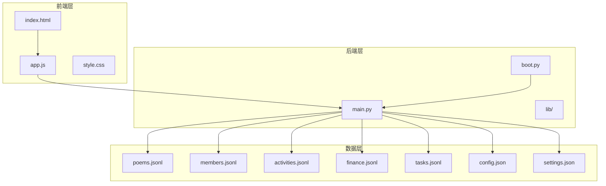

**图表来源**
- [index.html](file://static/index.html#L1-L269)
- [app.js](file://static/app.js#L1-L1312)
- [main.py](file://main.py#L1-L548)
- [boot.py](file://boot.py#L1-L122)

**章节来源**
- [index.html](file://static/index.html#L1-L269)
- [app.js](file://static/app.js#L1-L1312)
- [main.py](file://main.py#L1-L548)
- [boot.py](file://boot.py#L1-L122)

## 核心组件

### 1. IndexedDB本地草稿管理器

系统实现了专门的IndexedDB封装类来管理本地草稿：

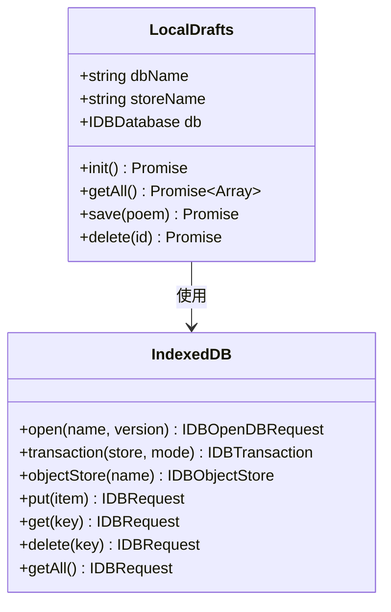

**图表来源**
- [app.js](file://static/app.js#L6-L58)

### 2. 全局数据缓存系统

系统维护多个全局缓存变量来优化数据访问：

| 缓存变量 | 类型 | 描述 | 使用场景 |
|---------|------|------|----------|
| `_cachedPoems` | Array | 藏诗阁作品缓存 | 作品列表渲染 |
| `_cachedMembers` | Array | 社员信息缓存 | 成员管理界面 |
| `_cachedActivities` | Array | 活动信息缓存 | 活动管理界面 |
| `_cachedTasks` | Array | 任务信息缓存 | 事务管理界面 |
| `_poemPage` | Number | 当前作品页码 | 分页导航 |
| `_poemHasMore` | Boolean | 是否还有更多作品 | 加载更多按钮 |

### 3. JSONL数据库管理系统

后端采用JSON Lines格式实现高效的数据存储：

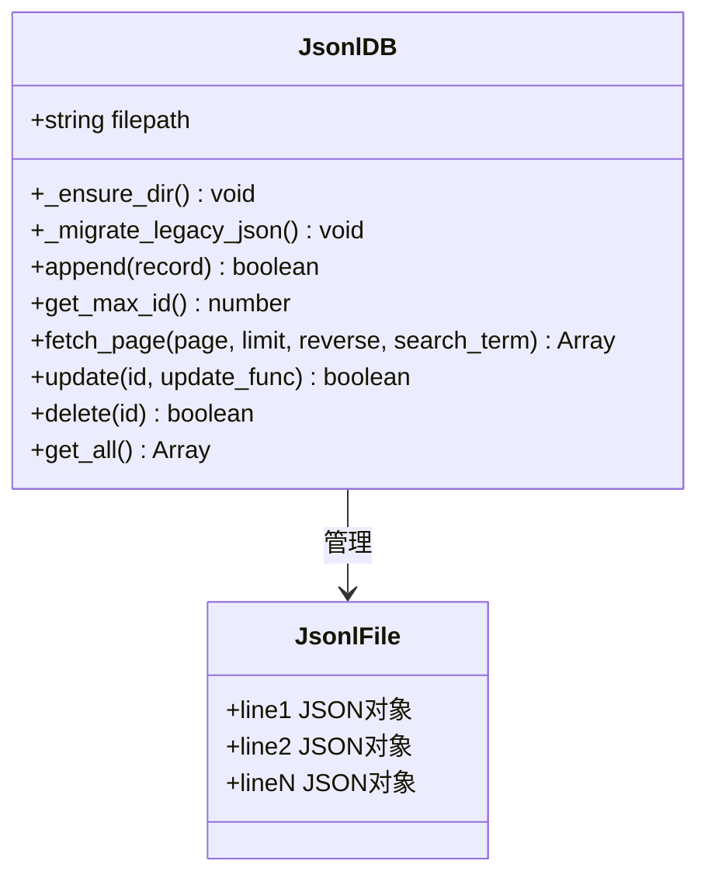

**图表来源**
- [main.py](file://main.py#L53-L267)

**章节来源**
- [app.js](file://static/app.js#L6-L58)
- [main.py](file://main.py#L53-L267)

## 架构概览

系统采用三层架构设计，实现了清晰的职责分离：

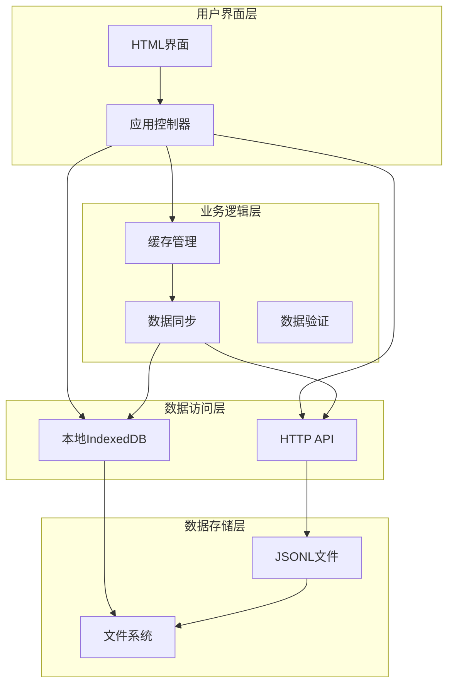

**图表来源**
- [app.js](file://static/app.js#L155-L212)
- [main.py](file://main.py#L262-L266)

## 详细组件分析

### IndexedDB本地存储实现

#### 初始化与升级机制

LocalDrafts类实现了完整的IndexedDB初始化流程：

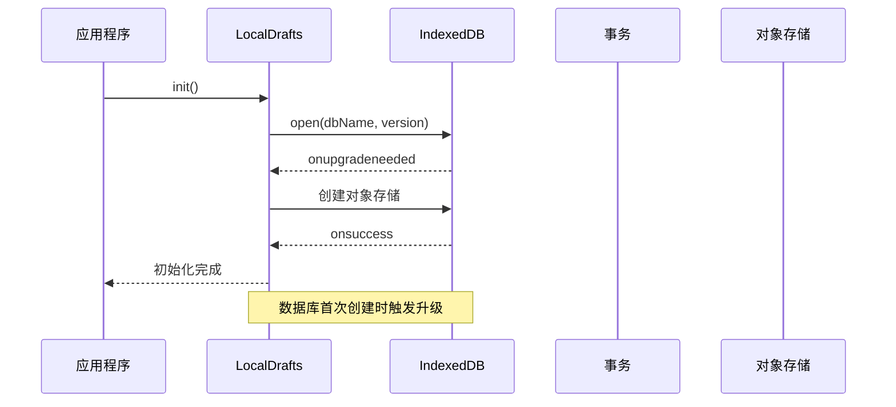

**图表来源**
- [app.js](file://static/app.js#L11-L27)

#### 草稿数据管理流程

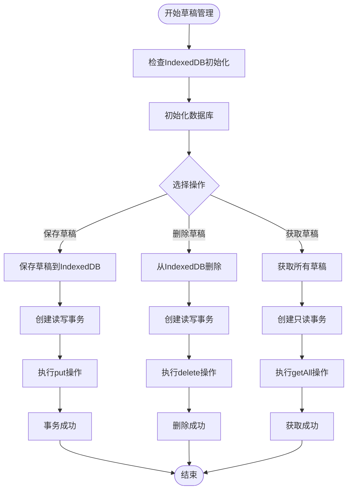

**图表来源**
- [app.js](file://static/app.js#L38-L57)

**章节来源**
- [app.js](file://static/app.js#L6-L58)

### 数据同步策略

#### fetchPoems函数的分页实现

fetchPoems函数实现了复杂的分页和数据合并逻辑：

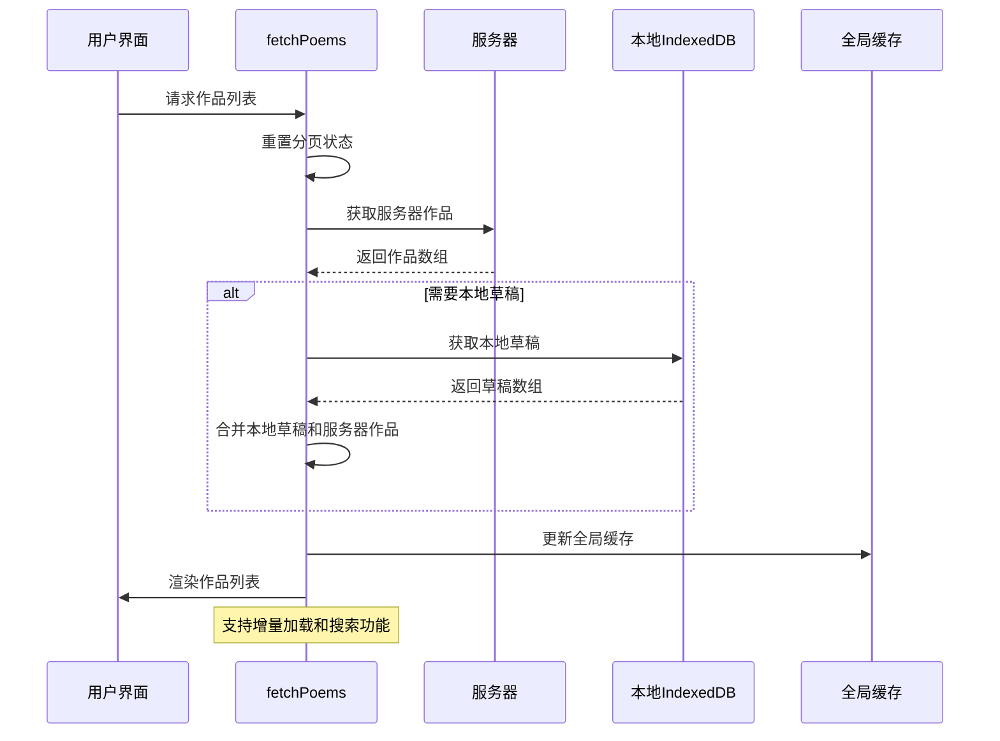

**图表来源**
- [app.js](file://static/app.js#L165-L212)

#### 增量加载和混合数据合并逻辑

系统实现了智能的数据合并策略：

| 合并场景 | 处理逻辑 | 性能影响 |
|---------|---------|----------|
| 首次加载 | 本地草稿 + 服务器作品 | 首屏加载更快 |
| 增量加载 | 追加服务器作品到现有列表 | 内存使用稳定 |
| 搜索模式 | 仅显示服务器搜索结果 | 减少本地数据干扰 |
| 切换页面 | 重置缓存并重新加载 | 确保数据一致性 |

**章节来源**
- [app.js](file://static/app.js#L165-L212)

### 缓存失效机制

#### 全局缓存变量设计

系统采用全局变量实现简单的缓存机制：

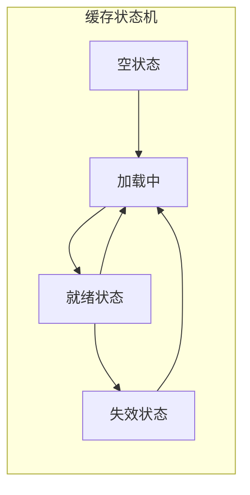

#### 缓存更新策略

| 触发条件 | 缓存操作 | 目标 |
|---------|---------|------|
| 页面切换 | 重置分页状态 | 避免跨页面数据污染 |
| 数据变更 | 清空相关缓存 | 确保数据一致性 |
| 搜索操作 | 重置搜索状态 | 提供准确的搜索结果 |
| 错误处理 | 记录错误状态 | 支持错误恢复 |

**章节来源**
- [app.js](file://static/app.js#L155-L162)

### JSONL数据库管理系统

#### 文件格式与存储结构

系统采用JSON Lines格式存储数据，每个文件一行一个JSON对象：

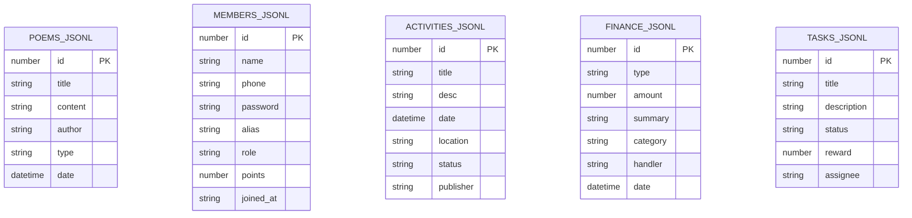

**图表来源**
- [poems.jsonl](file://data/poems.jsonl#L1-L4)
- [members.jsonl](file://data/members.jsonl#L1-L4)
- [activities.jsonl](file://data/activities.jsonl#L1-L7)
- [finance.jsonl](file://data/finance.jsonl#L1-L3)
- [tasks.jsonl](file://data/tasks.jsonl#L1-L2)

#### 数据库操作方法

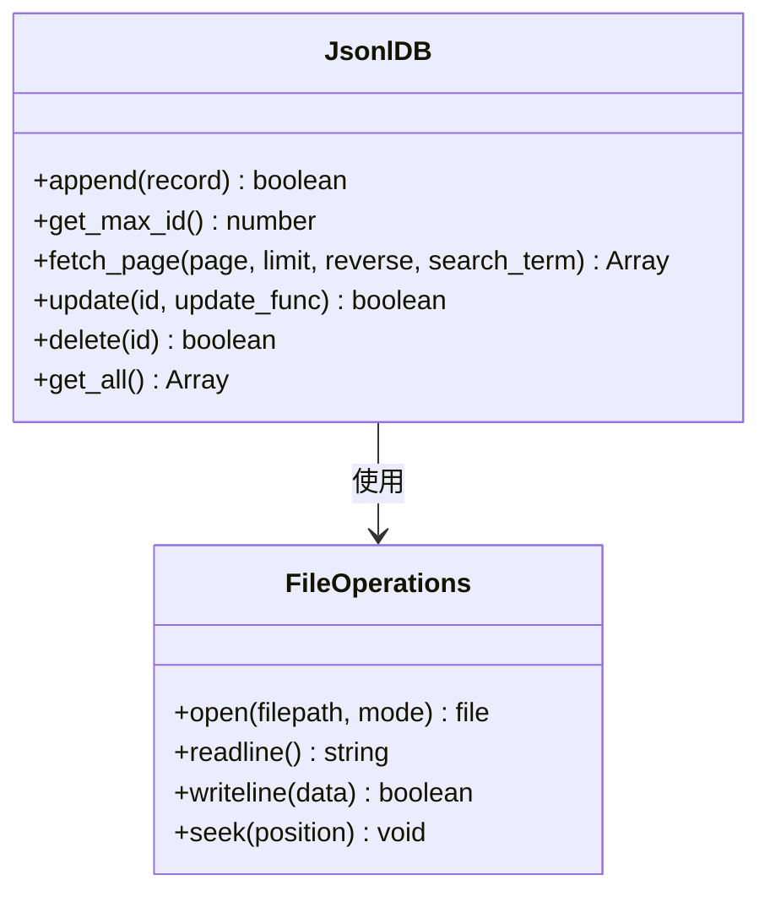

**图表来源**
- [main.py](file://main.py#L86-L258)

**章节来源**
- [main.py](file://main.py#L53-L267)

### 离线数据处理与冲突解决

#### 离线模式支持

系统通过以下机制支持离线操作：

1. **本地草稿存储**：所有创作内容优先保存到IndexedDB
2. **增量同步**：网络恢复后自动同步本地更改
3. **状态指示**：通过UI反馈当前连接状态

#### 冲突解决策略

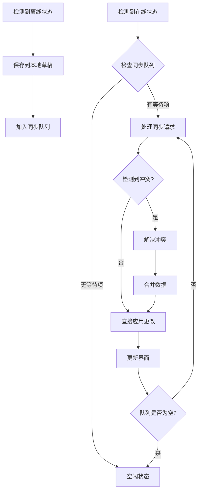

**章节来源**
- [app.js](file://static/app.js#L343-L402)

## 依赖关系分析

### 组件间依赖关系

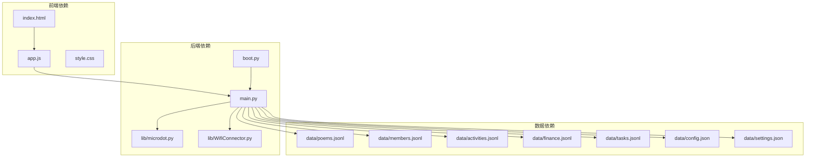

**图表来源**
- [app.js](file://static/app.js#L1-L1312)
- [main.py](file://main.py#L1-L548)
- [boot.py](file://boot.py#L1-L122)

### 外部依赖分析

| 依赖库 | 版本 | 用途 | 重要性 |
|-------|------|------|--------|
| Microdot | 自定义 | Web框架 | 核心 |
| WifiConnector | 自定义 | 网络连接 | 核心 |
| SystemStatus | 自定义 | 状态指示 | 辅助 |
| BreathLED | 自定义 | LED控制 | 辅助 |

**章节来源**
- [main.py](file://main.py#L4-L15)
- [boot.py](file://boot.py#L1-L122)

## 性能考虑

### 内存优化策略

1. **分页加载**：每次只加载必要的数据量
2. **增量更新**：避免全量重新渲染
3. **缓存管理**：合理控制缓存大小和生命周期

### 存储优化

1. **JSONL格式**：支持随机访问和高效读取
2. **索引策略**：基于文件行号的快速定位
3. **压缩存储**：减少磁盘空间占用

### 网络优化

1. **连接池**：复用HTTP连接
2. **请求合并**：批量处理相似请求
3. **缓存策略**：智能的缓存失效机制

## 故障排除指南

### 常见问题及解决方案

#### IndexedDB初始化失败

**症状**：草稿保存功能异常
**原因**：浏览器不支持IndexedDB或权限问题
**解决方案**：
1. 检查浏览器兼容性
2. 确认HTTPS环境
3. 清理浏览器缓存

#### 数据同步错误

**症状**：作品列表显示异常或数据不一致
**原因**：网络连接问题或服务器响应异常
**解决方案**：
1. 检查网络连接状态
2. 查看服务器日志
3. 重试同步操作

#### 缓存失效问题

**症状**：界面显示过期数据
**原因**：缓存更新机制异常
**解决方案**：
1. 手动刷新页面
2. 清除浏览器缓存
3. 检查缓存更新逻辑

**章节来源**
- [app.js](file://static/app.js#L364-L366)
- [main.py](file://main.py#L330-L332)

## 结论

围炉诗社·理事台项目的数据管理与缓存系统展现了现代Web应用的最佳实践：

### 主要成就

1. **完整的离线支持**：通过IndexedDB实现可靠的本地数据持久化
2. **智能的缓存策略**：平衡了性能和数据一致性
3. **优雅的错误处理**：提供了良好的用户体验
4. **可扩展的架构**：为未来的功能扩展奠定了基础

### 技术亮点

- **分页加载**：高效的内存使用和用户体验
- **增量同步**：最小化网络传输和服务器负载
- **冲突解决**：确保数据的一致性和完整性
- **错误恢复**：强大的容错能力和恢复机制

### 改进建议

1. **引入更高级的缓存机制**：考虑使用Service Worker实现更智能的缓存
2. **增强数据验证**：在客户端和服务器端都实施严格的数据验证
3. **优化搜索功能**：实现更精确的全文搜索和过滤
4. **监控和日志**：添加更完善的性能监控和错误日志系统

这个系统为类似的应用场景提供了优秀的参考模板，展示了如何在资源受限的环境中实现功能完整、性能优异的数据管理解决方案。