# 模态框与对话框

<cite>
**本文档引用的文件**
- [app.js](file://static/app.js)
- [index.html](file://static/index.html)
- [style.css](file://static/style.css)
</cite>

## 目录
1. [简介](#简介)
2. [项目结构](#项目结构)
3. [核心组件](#核心组件)
4. [架构概览](#架构概览)
5. [详细组件分析](#详细组件分析)
6. [依赖关系分析](#依赖关系分析)
7. [性能考虑](#性能考虑)
8. [故障排除指南](#故障排除指南)
9. [结论](#结论)

## 简介

围炉诗社·理事台项目采用原生JavaScript实现了一个轻量级但功能完整的模态框与对话框系统。该系统为用户提供了统一的交互体验，支持多种业务场景的表单输入和数据管理。

本系统的核心特点包括：
- 统一的toggleModal函数实现
- 多种类型模态框的差异化处理
- 完整的数据绑定和表单验证
- 响应式设计和现代化视觉效果
- 本地草稿存储和云端同步

## 项目结构

模态框系统主要分布在以下文件中：

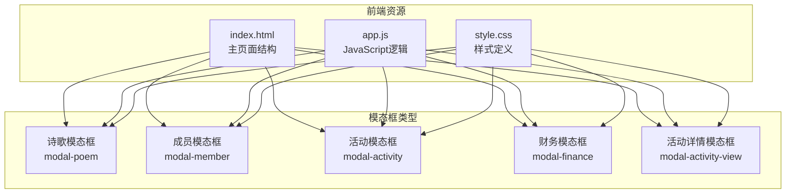

**图表来源**
- [index.html](file://static/index.html#L174-L263)
- [style.css](file://static/style.css#L251-L302)

**章节来源**
- [index.html](file://static/index.html#L1-L269)
- [style.css](file://static/style.css#L1-L385)

## 核心组件

### toggleModal函数 - 通用实现

toggleModal是整个模态框系统的核心控制器，实现了统一的显示/隐藏逻辑：

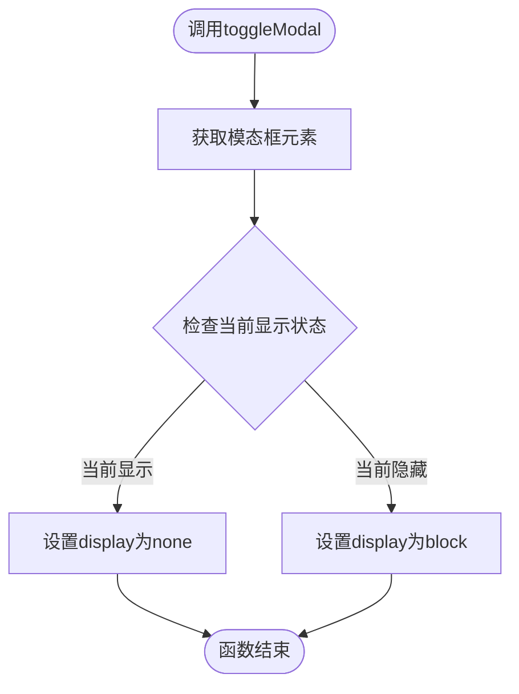

**图表来源**
- [app.js](file://static/app.js#L149-L153)

该函数具有以下特性：
- **简单高效**：仅通过CSS display属性控制显示状态
- **通用性强**：适用于所有模态框类型
- **状态切换**：自动检测当前状态并执行相反操作
- **无副作用**：不涉及复杂的DOM操作或事件监听

### 模态框生命周期管理

每个模态框都遵循统一的生命周期模式：

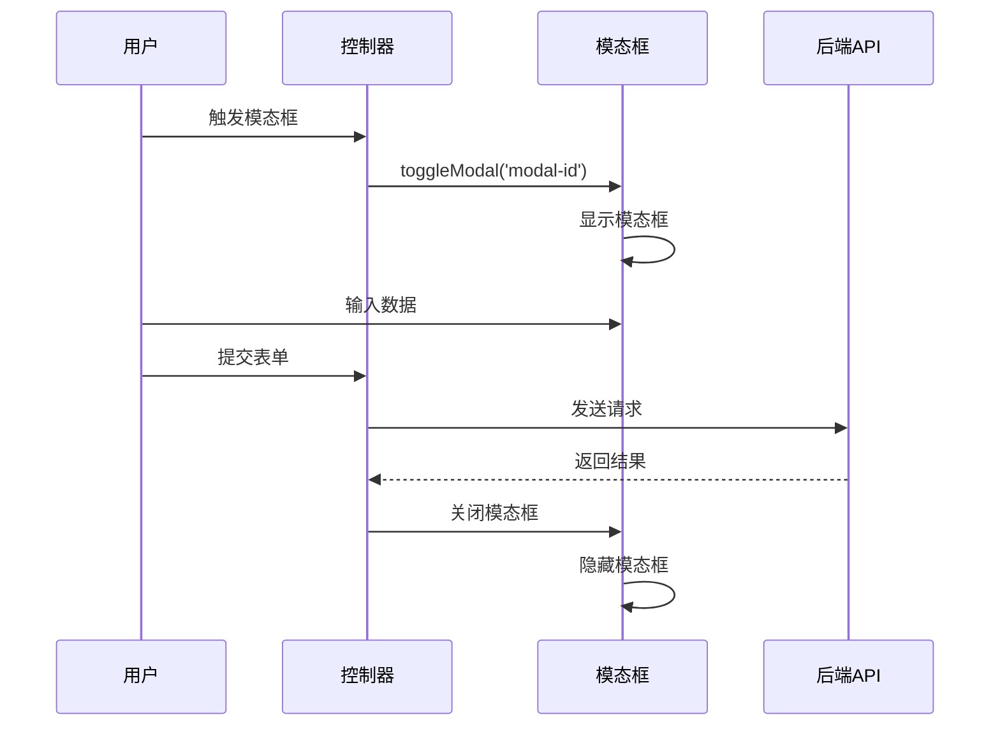

**图表来源**
- [app.js](file://static/app.js#L149-L153)
- [index.html](file://static/index.html#L174-L263)

**章节来源**
- [app.js](file://static/app.js#L149-L153)

## 架构概览

### 模态框系统架构

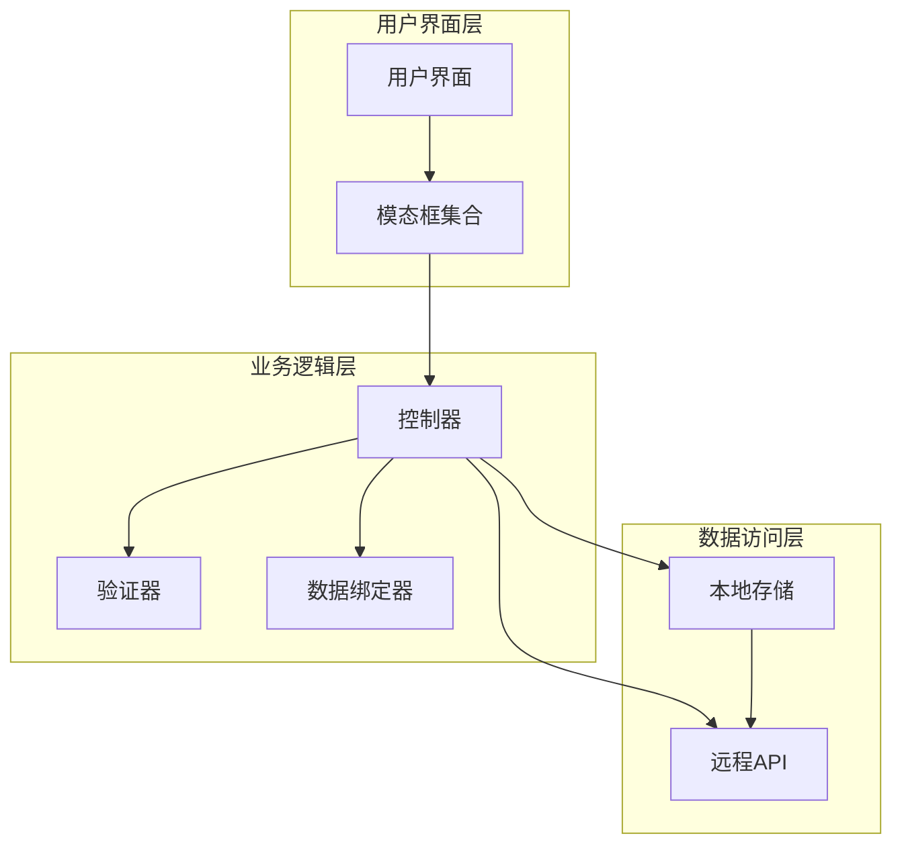

**图表来源**
- [app.js](file://static/app.js#L1-L1312)
- [index.html](file://static/index.html#L1-L269)

### 数据流架构

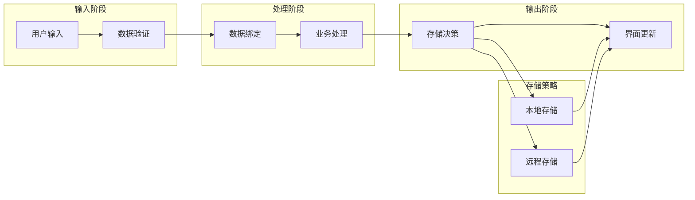

**图表来源**
- [app.js](file://static/app.js#L343-L402)
- [app.js](file://static/app.js#L580-L644)

## 详细组件分析

### 诗歌编辑模态框 (modal-poem)

#### 功能特性

诗歌编辑模态框是最复杂的功能模块，支持多种操作模式：

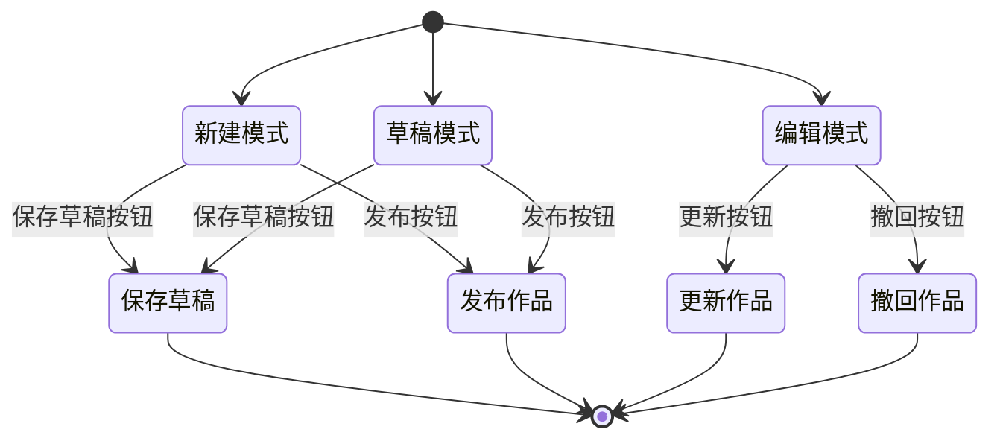

**图表来源**
- [app.js](file://static/app.js#L299-L341)
- [app.js](file://static/app.js#L343-L464)

#### 数据绑定机制

诗歌模态框实现了智能的数据绑定：

| 字段 | 类型 | 绑定方式 | 验证规则 |
|------|------|----------|----------|
| 标题 | 文本 | 受控组件 | 必填，长度限制 |
| 正文 | 文本域 | 受控组件 | 必填，内容验证 |
| 体裁 | 下拉选择 | 受控组件 | 预定义选项 |
| 时间 | 日期时间 | 受控组件 | 有效日期 |
| 作者 | 自动填充 | 计算属性 | 当前用户信息 |

#### 表单验证流程

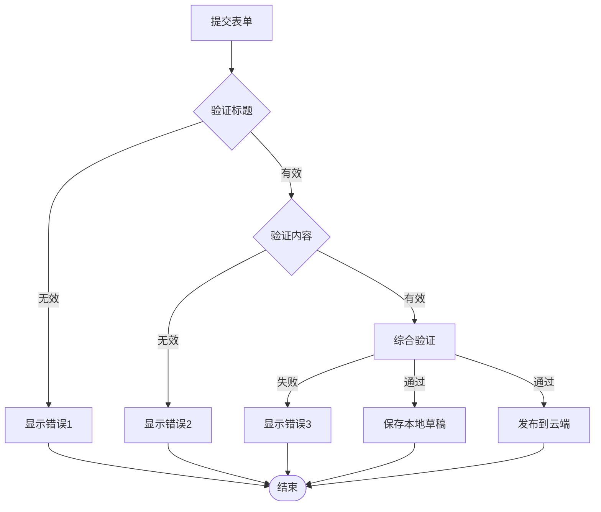

**图表来源**
- [app.js](file://static/app.js#L343-L402)

**章节来源**
- [app.js](file://static/app.js#L299-L464)

### 成员管理模态框 (modal-member)

#### 自定义字段系统

成员管理模态框支持动态自定义字段：

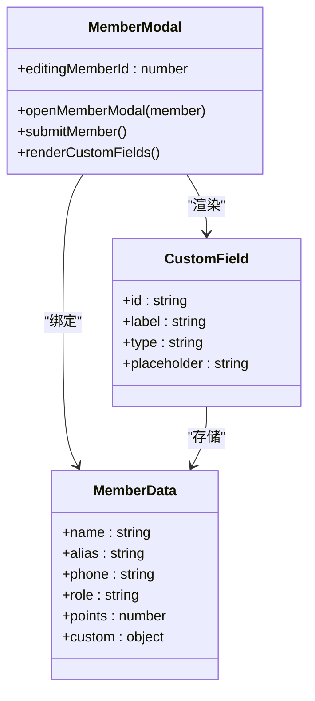

**图表来源**
- [app.js](file://static/app.js#L541-L578)
- [app.js](file://static/app.js#L580-L644)

#### 权限控制机制

成员管理功能根据用户角色提供不同的操作权限：

| 角色 | 创建权限 | 编辑权限 | 删除权限 |
|------|----------|----------|----------|
| 超级管理员 | ✅ 允许 | ✅ 允许 | ✅ 允许 |
| 管理员 | ✅ 允许 | ✅ 允许 | ❌ 禁止 |
| 理事 | ✅ 允许 | ✅ 允许 | ❌ 禁止 |
| 财务 | ❌ 禁止 | ❌ 禁止 | ❌ 禁止 |
| 社员 | ❌ 禁止 | ❌ 禁止 | ❌ 禁止 |

**章节来源**
- [app.js](file://static/app.js#L541-L644)

### 活动创建模态框 (modal-activity)

#### 状态管理系统

活动模态框实现了完整的生命周期状态管理：

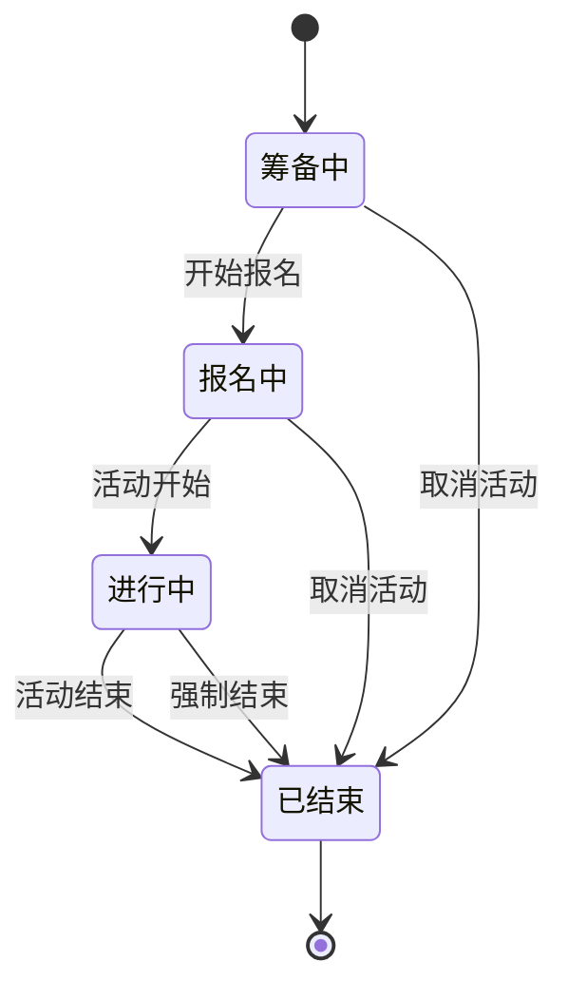

**图表来源**
- [app.js](file://static/app.js#L786-L805)
- [app.js](file://static/app.js#L807-L849)

#### 详情查看模态框

活动详情模态框提供只读视图，支持编辑和删除操作：

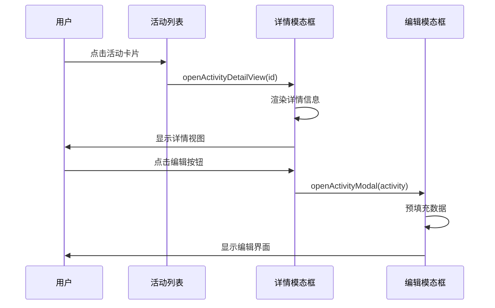

**图表来源**
- [app.js](file://static/app.js#L960-L1015)

**章节来源**
- [app.js](file://static/app.js#L786-L849)
- [app.js](file://static/app.js#L960-L1027)

### 财务记账模态框 (modal-finance)

#### 财务数据模型

财务模态框支持收入和支出两种类型：

| 字段 | 类型 | 必填 | 描述 |
|------|------|------|------|
| 类型 | 下拉选择 | 是 | 收入/支出 |
| 金额 | 数字输入 | 是 | 金额数值 |
| 摘要 | 文本输入 | 是 | 交易描述 |
| 经办人 | 文本输入 | 否 | 处理人员 |
| 日期 | 日期选择 | 否 | 默认当天 |

**章节来源**
- [app.js](file://static/app.js#L916-L956)

## 依赖关系分析

### 模态框间依赖关系

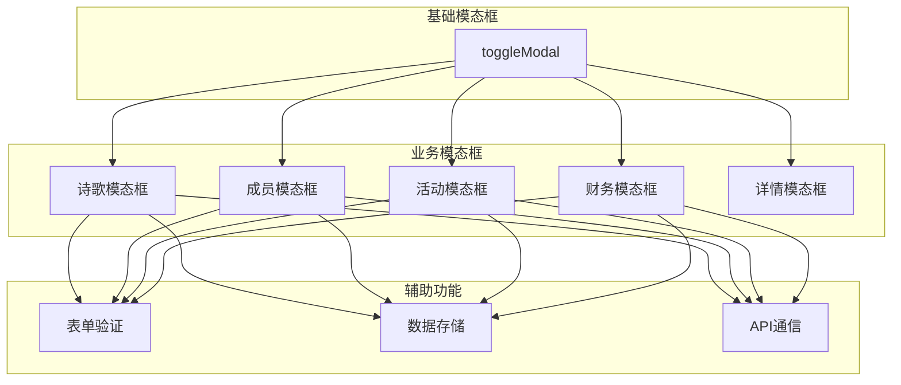

**图表来源**
- [app.js](file://static/app.js#L149-L153)
- [app.js](file://static/app.js#L343-L402)

### 样式依赖关系

模态框系统采用统一的样式架构：

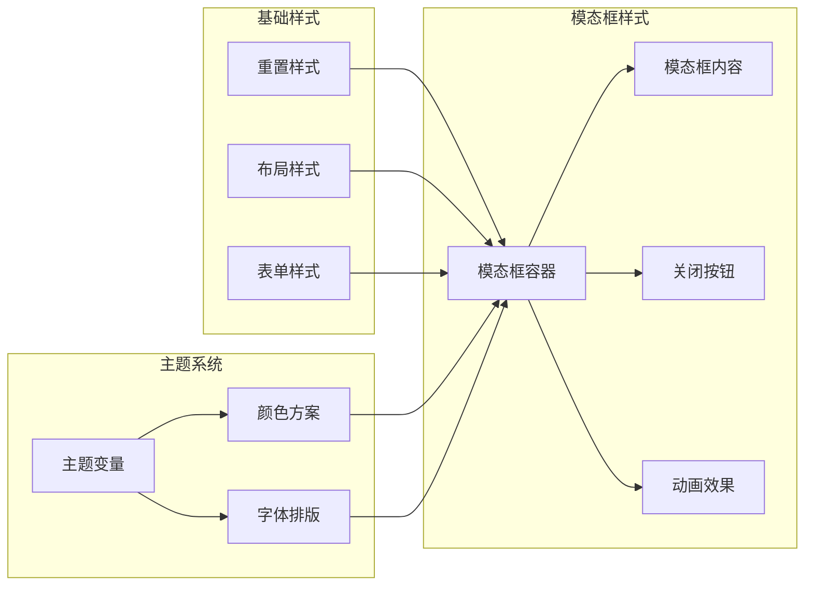

**图表来源**
- [style.css](file://static/style.css#L251-L302)

**章节来源**
- [style.css](file://static/style.css#L251-L302)

## 性能考虑

### 内存管理

模态框系统采用了高效的内存管理模式：

1. **懒加载策略**：模态框内容按需渲染
2. **事件委托**：减少事件监听器数量
3. **缓存机制**：重要数据缓存避免重复请求
4. **垃圾回收**：及时清理临时变量和DOM引用

### 网络优化

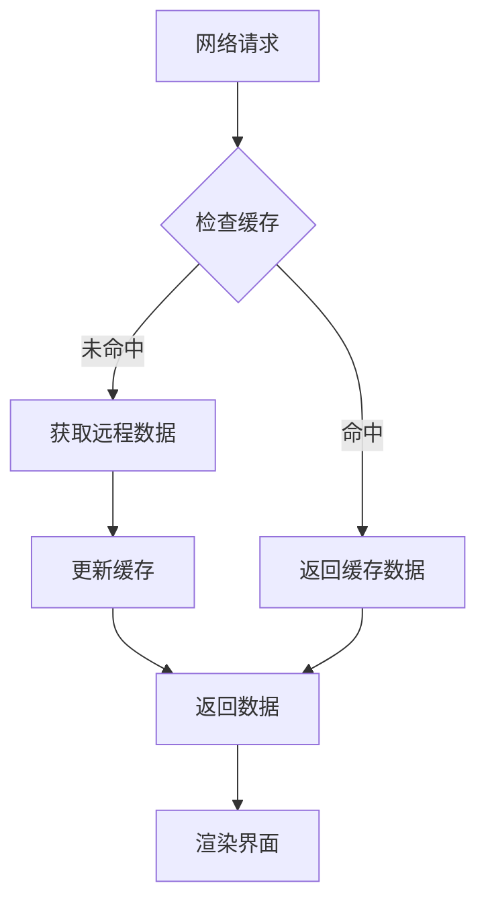

**图表来源**
- [app.js](file://static/app.js#L165-L212)

### 响应式设计

模态框系统支持多设备适配：

| 设备类型 | 屏幕宽度 | 模态框尺寸 | 动画效果 |
|----------|----------|------------|----------|
| 桌面端 | > 768px | 最大宽度500px | 完整动画 |
| 平板端 | 480-768px | 最大宽度90% | 简化动画 |
| 手机端 | < 480px | 100%宽度 | 基础动画 |

**章节来源**
- [style.css](file://static/style.css#L328-L377)

## 故障排除指南

### 常见问题诊断

#### 模态框无法显示

**可能原因**：
1. CSS样式冲突
2. JavaScript错误阻止执行
3. DOM元素不存在
4. 权限不足

**解决方案**：
1. 检查控制台错误日志
2. 验证CSS类名正确性
3. 确认DOM元素加载完成
4. 检查用户权限配置

#### 表单提交失败

**可能原因**：
1. 网络连接问题
2. 服务器端验证失败
3. 数据格式不正确
4. 会话过期

**解决方案**：
1. 检查网络连接状态
2. 查看服务器响应错误
3. 验证数据格式和类型
4. 重新登录系统

#### 数据同步问题

**可能原因**：
1. IndexedDB存储异常
2. 缓存数据过期
3. 并发写入冲突
4. 浏览器兼容性问题

**解决方案**：
1. 清除浏览器缓存
2. 检查IndexedDB状态
3. 实施乐观锁机制
4. 兼容性降级处理

**章节来源**
- [app.js](file://static/app.js#L343-L402)
- [app.js](file://static/app.js#L580-L644)

## 结论

围炉诗社·理事台项目的模态框与对话框系统展现了优秀的前端架构设计：

### 主要优势

1. **简洁高效**：toggleModal函数实现简单直接，易于维护
2. **功能完整**：支持多种业务场景，覆盖核心管理需求
3. **用户体验**：现代化界面设计，良好的交互反馈
4. **性能优化**：合理的缓存策略和内存管理
5. **可扩展性**：模块化设计便于功能扩展

### 技术亮点

- **统一的状态管理**：所有模态框遵循相同的生命周期模式
- **智能的数据绑定**：自动化的表单数据处理
- **完善的错误处理**：多层次的异常捕获和用户提示
- **响应式设计**：适配各种设备和屏幕尺寸
- **本地存储集成**：支持离线工作和数据持久化

### 改进建议

1. **增强可访问性**：添加键盘导航和屏幕阅读器支持
2. **动画优化**：实现更流畅的过渡效果
3. **国际化支持**：添加多语言本地化功能
4. **测试覆盖**：增加单元测试和集成测试
5. **性能监控**：实施运行时性能指标收集

该系统为围炉诗社的日常运营提供了强大的技术支持，其设计理念和实现方式值得其他类似项目参考借鉴。