# 用户认证系统

<cite>
**本文档引用的文件**
- [src/static/app.js](file://src/static/app.js)
- [src/static/index.html](file://src/static/index.html)
- [src/main.py](file://src/main.py)
- [src/data/settings.json](file://src/data/settings.json)
- [src/data/config.json](file://src/data/config.json)
</cite>

## 更新摘要
**变更内容**
- 新增密码哈希安全系统和Salt配置机制
- 添加密码迁移功能，支持从明文密码到哈希存储的转换
- 增强登录流程的安全性，实现向后兼容的密码验证
- 更新系统设置界面，支持Salt值管理和密码迁移操作

## 目录
1. [简介](#简介)
2. [项目结构](#项目结构)
3. [核心组件](#核心组件)
4. [架构概览](#架构概览)
5. [详细组件分析](#详细组件分析)
6. [安全增强功能](#安全增强功能)
7. [依赖关系分析](#依赖关系分析)
8. [性能考虑](#性能考虑)
9. [故障排除指南](#故障排除指南)
10. [结论](#结论)

## 简介

围炉诗社·理事台项目是一个基于Web的管理系统，采用前后端分离架构。本项目实现了完整的用户认证系统，包括登录验证、会话管理、权限控制等功能。系统采用localStorage进行本地状态持久化，支持自动登录和权限检查机制。

**更新** 本次更新增强了密码安全系统，引入了SHA256密码哈希、Salt配置和密码迁移功能，显著提升了系统的安全性。

## 项目结构

该项目采用简洁的三层架构设计：

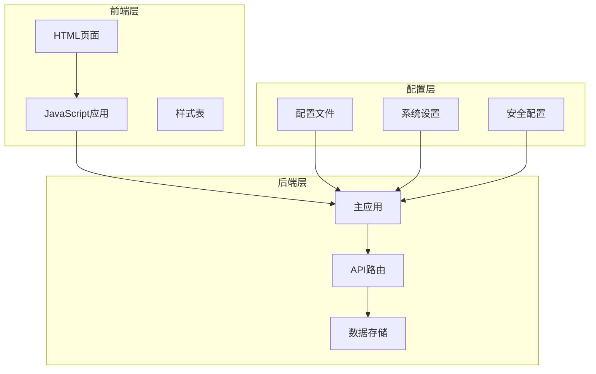

**图表来源**
- [src/static/index.html](file://src/static/index.html#L1-L345)
- [src/static/app.js](file://src/static/app.js#L1-L1853)
- [src/main.py](file://src/main.py#L1-L887)

**章节来源**
- [src/static/index.html](file://src/static/index.html#L1-L345)
- [src/static/app.js](file://src/static/app.js#L1-L1853)
- [src/main.py](file://src/main.py#L1-L887)

## 核心组件

### 认证状态管理

系统通过全局变量管理用户认证状态：

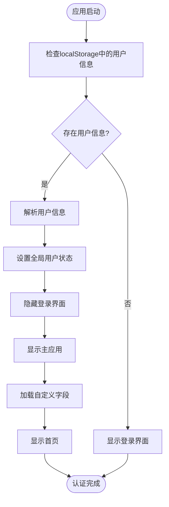

**图表来源**
- [src/static/app.js](file://src/static/app.js#L107-L121)

### 登录流程

系统实现了完整的登录验证流程，现已集成密码哈希验证：

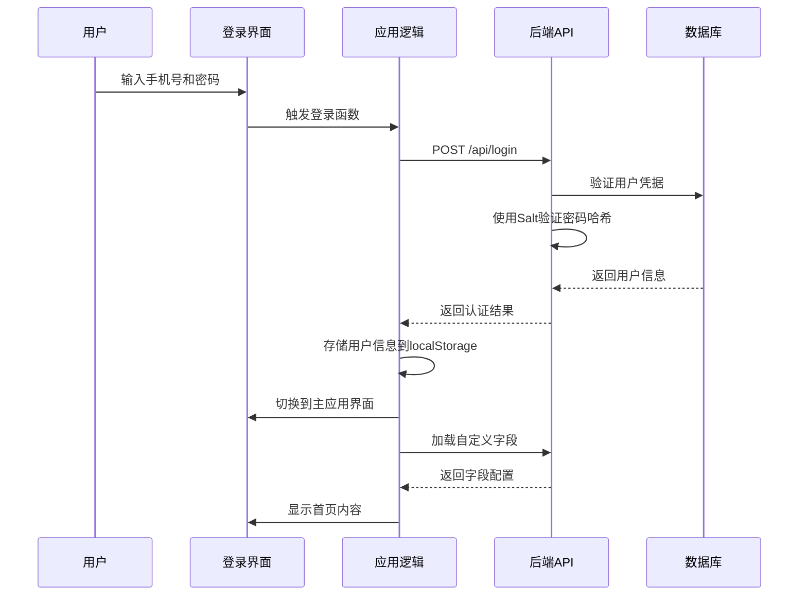

**图表来源**
- [src/static/app.js](file://src/static/app.js#L132-L155)
- [src/main.py](file://src/main.py#L774-L796)

**章节来源**
- [src/static/app.js](file://src/static/app.js#L107-L155)
- [src/main.py](file://src/main.py#L774-L796)

## 架构概览

系统采用前后端分离架构，前端负责用户界面和交互逻辑，后端提供RESTful API服务。新增的安全架构包括密码哈希处理和Salt配置管理。

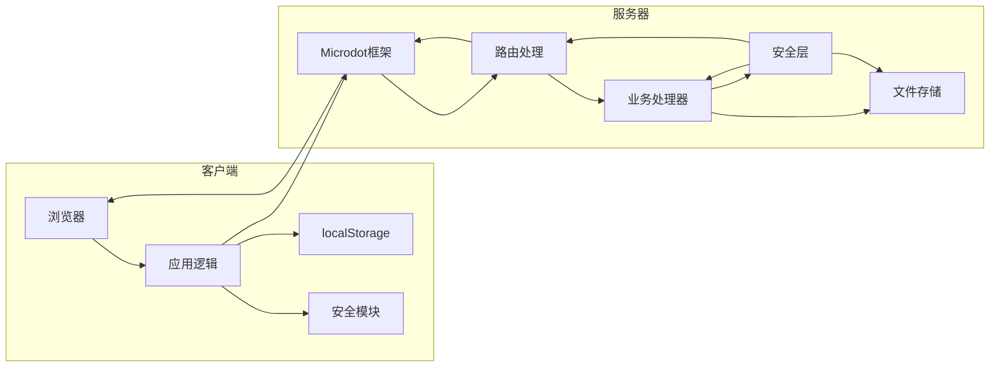

**图表来源**
- [src/static/app.js](file://src/static/app.js#L1-L10)
- [src/main.py](file://src/main.py#L1-L17)

## 详细组件分析

### 认证状态检测组件

认证状态检测是系统的核心组件，负责维护用户的登录状态：

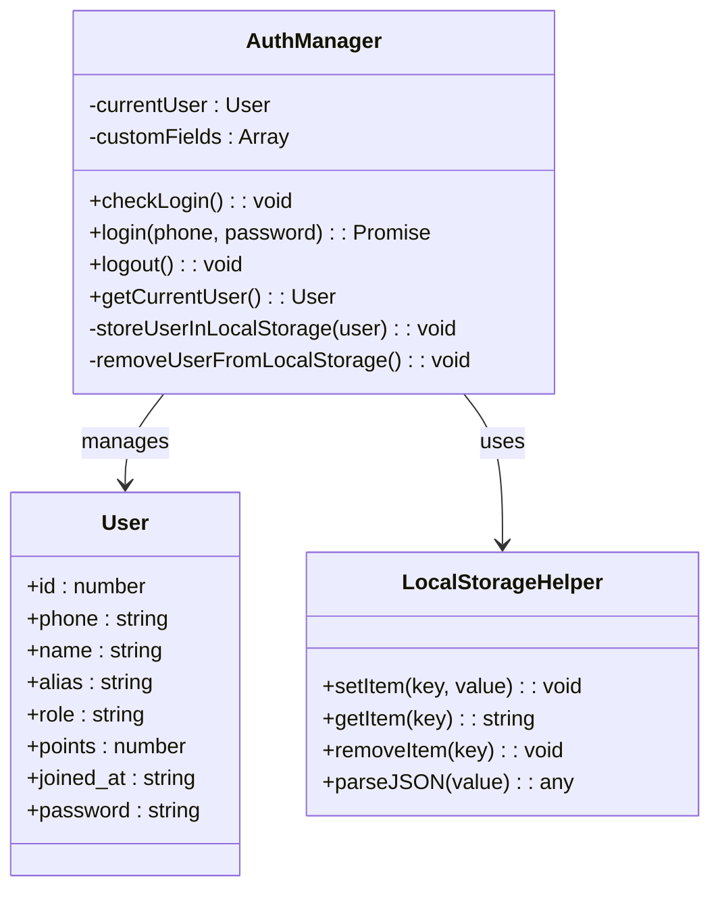

**图表来源**
- [src/static/app.js](file://src/static/app.js#L1-L6)
- [src/static/app.js](file://src/static/app.js#L107-L161)

#### 登录验证流程

登录验证流程实现了多层安全检查，包括密码哈希验证：

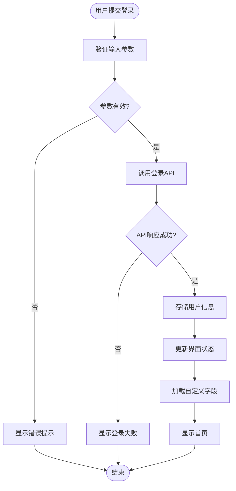

**图表来源**
- [src/static/app.js](file://src/static/app.js#L132-L155)

**章节来源**
- [src/static/app.js](file://src/static/app.js#L107-L161)

### 会话管理组件

系统采用localStorage进行会话状态管理，实现了自动登录功能：

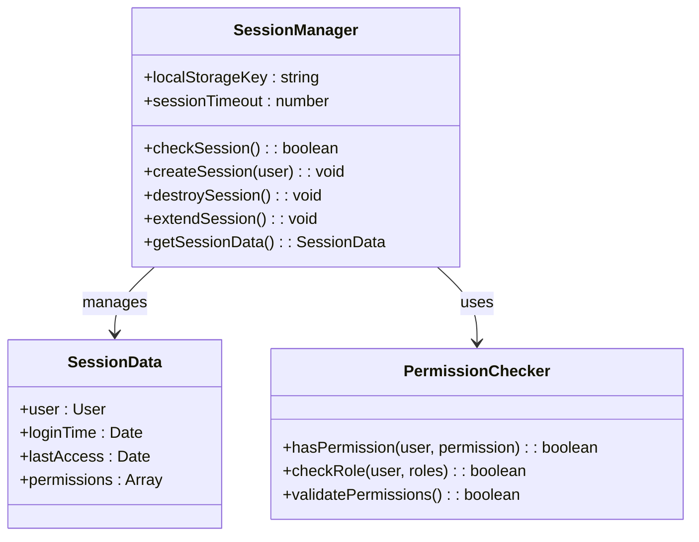

**图表来源**
- [src/static/app.js](file://src/static/app.js#L107-L161)
- [src/static/app.js](file://src/static/app.js#L197-L204)

#### 权限检查机制

系统实现了基于角色的权限控制：

| 角色 | 权限描述 | 可执行操作 |
|------|----------|------------|
| super_admin | 超级管理员 | 所有操作权限 |
| admin | 管理员 | 系统管理、数据维护 |
| director | 理事 | 内容审核、活动管理 |
| finance | 财务 | 财务记录、收支管理 |
| member | 普通成员 | 查看内容、基本操作 |

**章节来源**
- [src/static/app.js](file://src/static/app.js#L197-L204)
- [src/main.py](file://src/main.py#L774-L796)

### 本地存储机制

系统使用localStorage进行用户状态持久化：

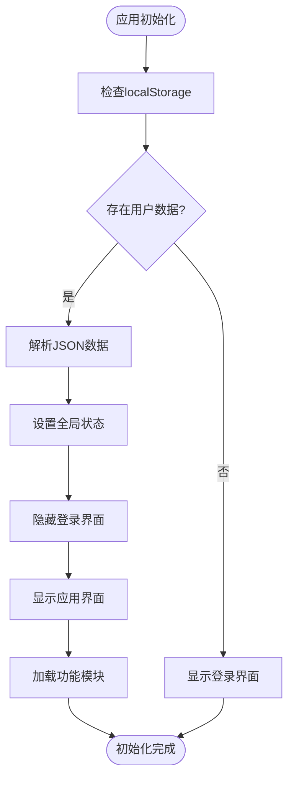

**图表来源**
- [src/static/app.js](file://src/static/app.js#L107-L121)

**章节来源**
- [src/static/app.js](file://src/static/app.js#L107-L121)

### 导航和路由保护

系统实现了基于认证状态的导航控制：

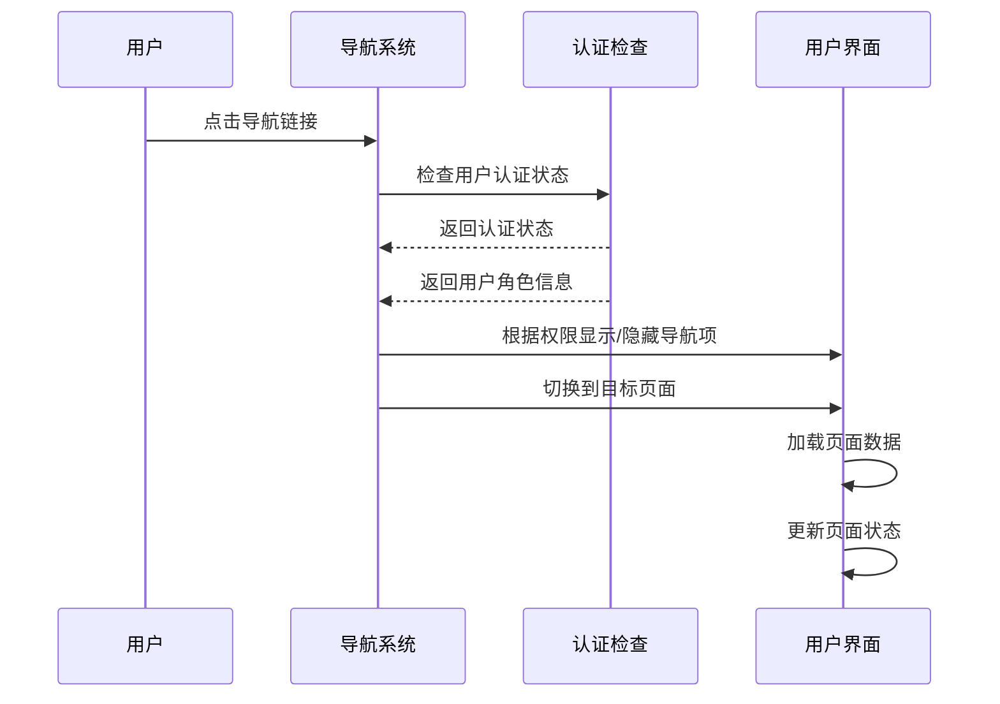

**图表来源**
- [src/static/app.js](file://src/static/app.js#L166-L204)

**章节来源**
- [src/static/app.js](file://src/static/app.js#L166-L204)

## 安全增强功能

### 密码哈希安全系统

系统新增了基于SHA256的密码哈希安全系统，提供更强的密码保护：

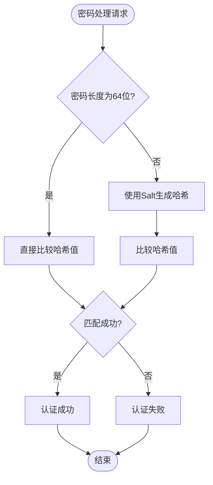

**图表来源**
- [src/main.py](file://src/main.py#L28-L47)

#### Salt配置管理

系统支持动态配置Salt值，增强密码安全性：

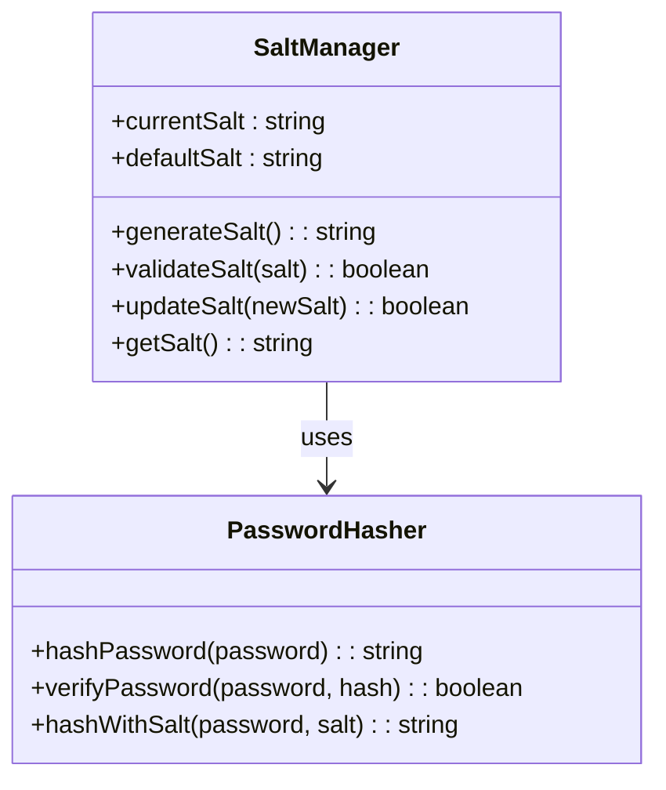

**图表来源**
- [src/main.py](file://src/main.py#L28-L47)
- [src/main.py](file://src/main.py#L829-L845)

#### 密码迁移功能

系统提供一次性密码迁移功能，支持从明文密码到哈希存储的转换：

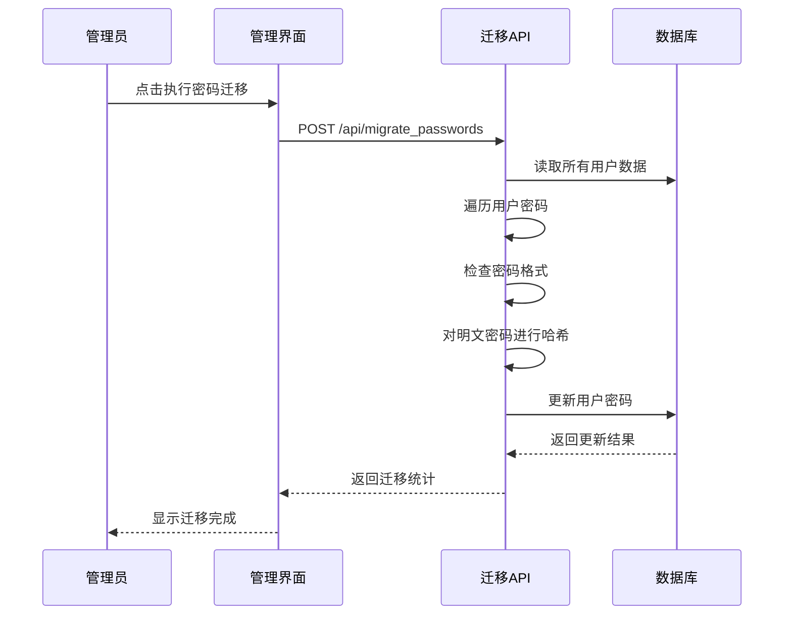

**图表来源**
- [src/static/app.js](file://src/static/app.js#L1833-L1852)
- [src/main.py](file://src/main.py#L847-L865)

**章节来源**
- [src/main.py](file://src/main.py#L28-L47)
- [src/main.py](file://src/main.py#L829-L865)
- [src/static/app.js](file://src/static/app.js#L1833-L1852)

## 依赖关系分析

系统各组件之间的依赖关系如下：

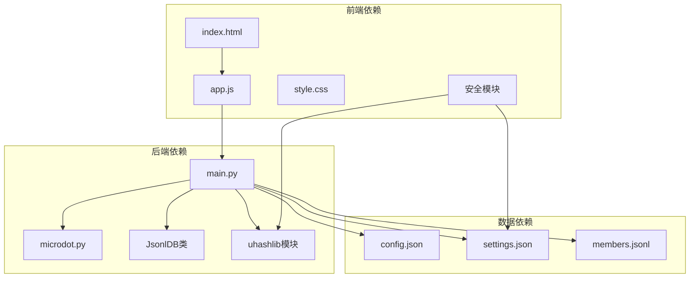

**图表来源**
- [src/static/app.js](file://src/static/app.js#L1-L10)
- [src/main.py](file://src/main.py#L1-L17)

**章节来源**
- [src/main.py](file://src/main.py#L1-L887)
- [src/static/app.js](file://src/static/app.js#L1-L1853)

## 性能考虑

### 认证性能优化

系统在认证过程中采用了多项性能优化措施：

1. **异步处理**: 所有网络请求都采用异步方式，避免阻塞UI线程
2. **缓存策略**: 用户信息和自定义字段在首次加载后进行缓存
3. **防抖机制**: 全局搜索功能实现了500ms的防抖延迟
4. **懒加载**: 页面内容按需加载，减少初始渲染时间
5. **哈希缓存**: Salt值在内存中缓存，避免重复读取配置文件

### 数据存储优化

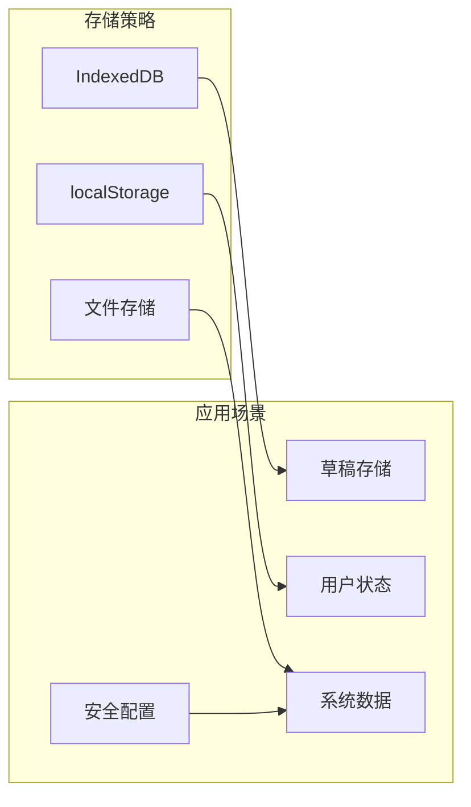

**图表来源**
- [src/static/app.js](file://src/static/app.js#L47-L104)

**章节来源**
- [src/static/app.js](file://src/static/app.js#L47-L104)

## 故障排除指南

### 常见认证问题

| 问题类型 | 症状 | 解决方案 |
|----------|------|----------|
| 登录失败 | 提示账号或密码错误 | 检查用户名密码是否正确，确认数据库中是否存在该用户 |
| 自动登录失效 | 刷新页面后需要重新登录 | 检查localStorage是否被清理，确认浏览器允许localStorage |
| 权限不足 | 无法访问某些功能 | 检查用户角色配置，确认权限级别是否足够 |
| 网络连接问题 | API请求超时 | 检查网络连接，确认服务器正常运行 |
| 密码哈希错误 | 登录失败但密码正确 | 检查Salt配置是否正确，确认密码迁移已完成 |

### 安全相关问题

| 问题类型 | 症状 | 解决方案 |
|----------|------|----------|
| Salt配置错误 | 密码验证失败 | 检查settings.json中的password_salt配置 |
| 密码迁移失败 | 部分用户无法登录 | 检查迁移过程中的错误日志，重新执行迁移 |
| 向后兼容问题 | 旧密码无法使用 | 确认verify_password函数的兼容逻辑正常工作 |

### 调试方法

1. **浏览器开发者工具**: 使用Network标签监控API请求
2. **控制台日志**: 检查JavaScript错误和警告
3. **localStorage检查**: 在Application标签中查看存储的数据
4. **服务器日志**: 检查后端错误日志
5. **密码哈希验证**: 使用后端提供的验证函数测试密码

**章节来源**
- [src/static/app.js](file://src/static/app.js#L132-L155)
- [src/main.py](file://src/main.py#L774-L796)

## 结论

围炉诗社·理事台项目的用户认证系统实现了以下关键特性：

1. **完整的认证流程**: 从登录验证到会话管理的全流程覆盖
2. **灵活的权限控制**: 基于角色的细粒度权限管理
3. **可靠的本地存储**: 基于localStorage的状态持久化
4. **良好的用户体验**: 自动登录、权限控制、导航保护等人性化设计
5. **可扩展的架构**: 清晰的前后端分离设计，便于功能扩展
6. **增强的安全性**: 新增的密码哈希系统、Salt配置和密码迁移功能

**更新** 系统在安全性方面有了重大提升，通过引入SHA256密码哈希、Salt配置和密码迁移功能，显著增强了用户密码的保护能力。新的安全架构支持向后兼容，确保现有用户能够平滑过渡到新的安全模式。

系统在安全性方面采用了先进的防护措施，包括密码哈希、Salt配置、向后兼容的密码验证等。对于生产环境，建议定期更新Salt值，及时执行密码迁移，并监控登录日志以发现潜在的安全威胁。