# 用户认证系统

<cite>
**本文档引用的文件**
- [src/static/app.js](file://src/static/app.js)
- [src/static/index.html](file://src/static/index.html)
- [src/main.py](file://src/main.py)
- [src/data/config.json](file://src/data/config.json)
- [src/data/members.jsonl](file://src/data/members.jsonl)
- [src/data/login_logs.jsonl](file://src/data/login_logs.jsonl)
- [src/data/finance.jsonl](file://src/data/finance.jsonl)
- [src/data/tasks.jsonl](file://src/data/tasks.jsonl)
- [src/data/poems.jsonl](file://src/data/poems.jsonl)
- [src/data/points_logs.jsonl](file://src/data/points_logs.jsonl)
</cite>

## 更新摘要
**变更内容**
- 新增完整的基于JWT的令牌认证系统，替代原有的密码哈希验证机制
- 实现基于Token的会话管理，包括Token生成、验证、过期处理等功能
- 增强权限控制系统，支持基于角色的细粒度权限管理
- 新增Token过期检测和自动续期机制
- 实现基于Authorization头和URL参数的双模式Token传递
- **新增聊天室功能集成，支持访客昵称管理和与成员数据库的深度集成**

## 目录
1. [简介](#简介)
2. [项目结构](#项目结构)
3. [核心组件](#核心组件)
4. [架构概览](#架构概览)
5. [详细组件分析](#详细组件分析)
6. [JWT令牌认证系统](#jwt令牌认证系统)
7. [权限控制系统](#权限控制系统)
8. [聊天室功能集成](#聊天室功能集成)
9. [安全增强功能](#安全增强功能)
10. [依赖关系分析](#依赖关系分析)
11. [性能考虑](#性能考虑)
12. [故障排除指南](#故障排除指南)
13. [结论](#结论)

## 简介

围炉诗社·理事台项目是一个基于Web的管理系统，采用前后端分离架构。本项目实现了完整的用户认证系统，包括基于JWT令牌的登录验证、会话管理、权限控制等功能。系统采用localStorage进行本地状态持久化，支持自动登录和权限检查机制。

**更新** 本次更新新增了完整的基于JWT的令牌认证系统，实现了更加安全和灵活的认证机制。系统不再依赖传统的密码哈希验证，而是采用基于Token的认证方式，提供更好的安全性、可扩展性和用户体验。同时，系统集成了全新的聊天室功能，支持访客昵称管理和与成员数据库的深度集成。

## 项目结构

该项目采用简洁的三层架构设计：

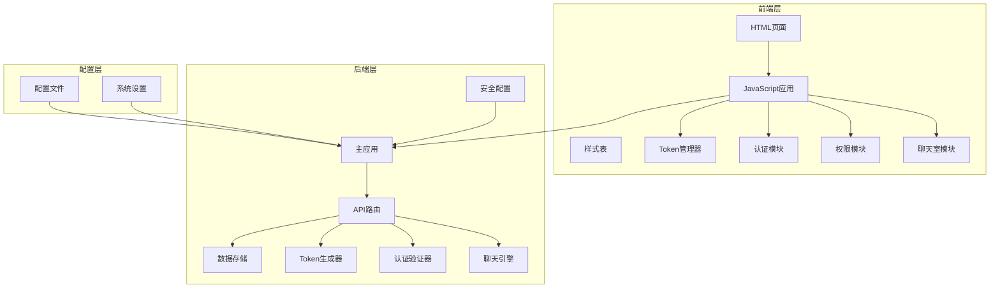
```mermaid
graph TB
subgraph "前端层"
HTML[HTML页面]
JS[JavaScript应用]
CSS[样式表]
TokenManager[Token管理器]
AuthModule[认证模块]
PermissionModule[权限模块]
ChatModule[聊天室模块]
end
subgraph "后端层"
Main[主应用]
API[API路由]
DB[数据存储]
TokenGenerator[Token生成器]
AuthValidator[认证验证器]
ChatEngine[聊天引擎]
Security[安全层]
end
subgraph "配置层"
Config[配置文件]
Settings[系统设置]
Security[安全配置]
end
HTML --> JS
JS --> TokenManager
JS --> AuthModule
JS --> PermissionModule
JS --> ChatModule
JS --> Main
Main --> API
API --> DB
API --> TokenGenerator
API --> AuthValidator
API --> ChatEngine
Config --> Main
Settings --> Main
Security --> Main
```

**图表来源**
- [src/static/index.html](file://src/static/index.html#L1-L657)
- [src/static/app.js](file://src/static/app.js#L1-L3997)
- [src/main.py](file://src/main.py#L1-L2621)

**章节来源**
- [src/static/index.html](file://src/static/index.html#L1-L657)
- [src/static/app.js](file://src/static/app.js#L1-L3997)
- [src/main.py](file://src/main.py#L1-L2621)

## 核心组件

### 认证状态管理

系统通过全局变量管理用户认证状态，现在基于JWT令牌：

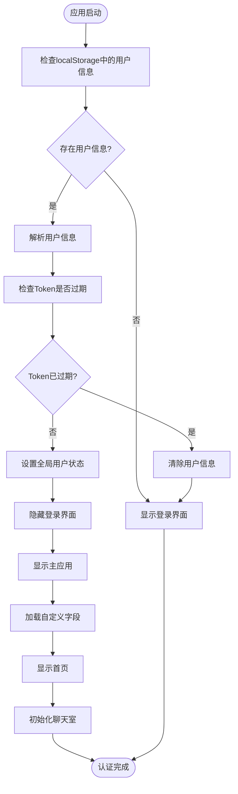
```mermaid
flowchart TD
Start([应用启动]) --> CheckStorage["检查localStorage中的用户信息"]
CheckStorage --> HasUser{"存在用户信息?"}
HasUser --> |是| ParseUser["解析用户信息"]
HasUser --> |否| ShowLogin["显示登录界面"]
ParseUser --> CheckToken["检查Token是否过期"]
CheckToken --> IsExpired{"Token已过期?"}
IsExpired --> |是| ClearUser["清除用户信息"]
IsExpired --> |否| SetCurrentUser["设置全局用户状态"]
ClearUser --> ShowLogin
SetCurrentUser --> HideLogin["隐藏登录界面"]
HideLogin --> ShowMain["显示主应用"]
ShowMain --> LoadData["加载自定义字段"]
LoadData --> ShowHome["显示首页"]
ShowHome --> InitChat["初始化聊天室"]
InitChat --> End([认证完成])
ShowLogin --> End
```

**图表来源**
- [src/static/app.js](file://src/static/app.js#L225-L276)

### 登录流程

系统实现了完整的JWT令牌登录验证流程：

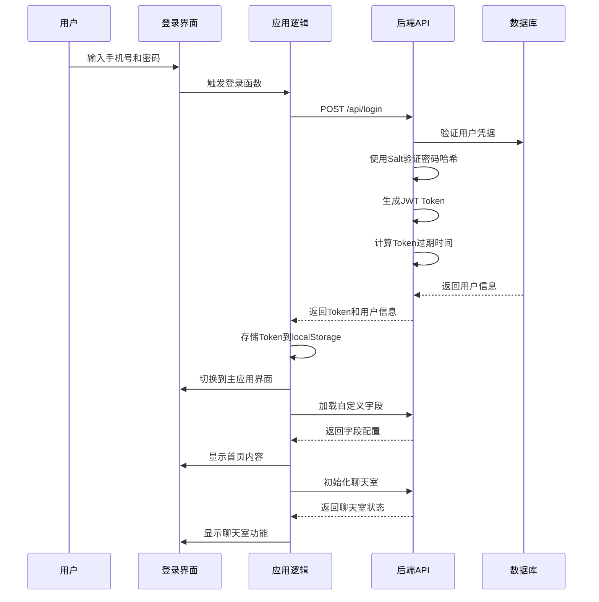
```mermaid
sequenceDiagram
participant U as 用户
participant UI as 登录界面
participant APP as 应用逻辑
participant API as 后端API
participant DB as 数据库
U->>UI : 输入手机号和密码
UI->>APP : 触发登录函数
APP->>API : POST /api/login
API->>DB : 验证用户凭据
API->>API : 使用Salt验证密码哈希
API->>API : 生成JWT Token
API->>API : 计算Token过期时间
DB-->>API : 返回用户信息
API-->>APP : 返回Token和用户信息
APP->>APP : 存储Token到localStorage
APP->>UI : 切换到主应用界面
APP->>API : 加载自定义字段
API-->>APP : 返回字段配置
APP->>UI : 显示首页内容
APP->>API : 初始化聊天室
API-->>APP : 返回聊天室状态
APP->>UI : 显示聊天室功能
```

**图表来源**
- [src/static/app.js](file://src/static/app.js#L358-L397)
- [src/main.py](file://src/main.py#L1473-L1501)

**章节来源**
- [src/static/app.js](file://src/static/app.js#L225-L397)
- [src/main.py](file://src/main.py#L1473-L1501)

## 架构概览

系统采用前后端分离架构，前端负责用户界面和交互逻辑，后端提供RESTful API服务。新的JWT认证架构包括Token生成、验证、权限控制和安全层，同时集成了聊天室功能模块。

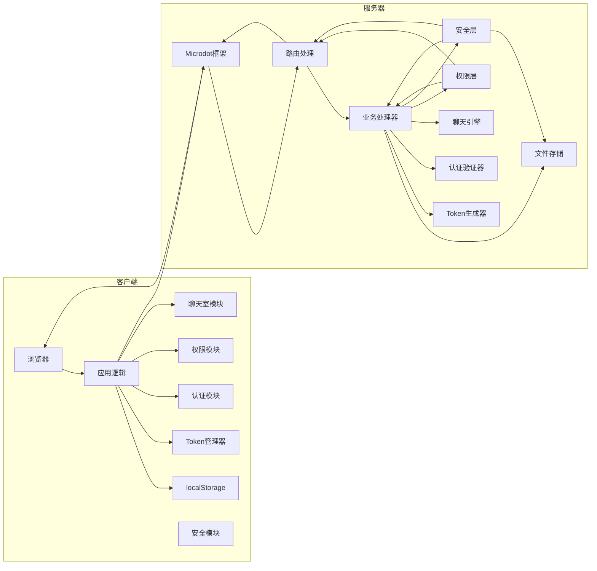
```mermaid
graph LR
subgraph "客户端"
Browser[浏览器]
AppJS[应用逻辑]
LocalStorage[localStorage]
TokenManager[Token管理器]
AuthModule[认证模块]
PermissionModule[权限模块]
ChatModule[聊天室模块]
Security[安全模块]
end
subgraph "服务器"
Microdot[Microdot框架]
Routes[路由处理]
Handlers[业务处理器]
Files[文件存储]
TokenGenerator[Token生成器]
AuthValidator[认证验证器]
ChatEngine[聊天引擎]
PermissionLayer[权限层]
SecurityLayer[安全层]
end
Browser --> AppJS
AppJS --> LocalStorage
AppJS --> TokenManager
AppJS --> AuthModule
AppJS --> PermissionModule
AppJS --> ChatModule
AppJS --> Microdot
Microdot --> Routes
Routes --> Handlers
Handlers --> Files
Handlers --> TokenGenerator
Handlers --> AuthValidator
Handlers --> ChatEngine
Handlers --> PermissionLayer
Handlers --> SecurityLayer
SecurityLayer --> Files
SecurityLayer --> Handlers
SecurityLayer --> Routes
PermissionLayer --> Handlers
PermissionLayer --> Routes
Routes --> Microdot
Microdot --> Browser
```

**图表来源**
- [src/static/app.js](file://src/static/app.js#L1-L18)
- [src/main.py](file://src/main.py#L1-L2621)

## 详细组件分析

### 认证状态检测组件

认证状态检测是系统的核心组件，负责维护用户的登录状态和Token管理：

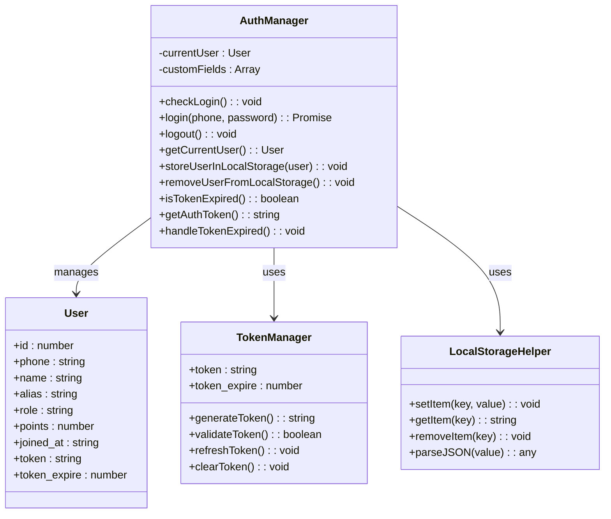
```mermaid
classDiagram
class AuthManager {
-currentUser : User
-customFields : Array
+checkLogin() : void
+login(phone, password) : Promise
+logout() : void
+getCurrentUser() : User
+storeUserInLocalStorage(user) : void
+removeUserFromLocalStorage() : void
+isTokenExpired() : boolean
+getAuthToken() : string
+handleTokenExpired() : void
}
class User {
+id : number
+phone : string
+name : string
+alias : string
+role : string
+points : number
+joined_at : string
+token : string
+token_expire : number
}
class TokenManager {
+token : string
+token_expire : number
+generateToken() : string
+validateToken() : boolean
+refreshToken() : void
+clearToken() : void
}
class LocalStorageHelper {
+setItem(key, value) : void
+getItem(key) : string
+removeItem(key) : void
+parseJSON(value) : any
}
AuthManager --> User : manages
AuthManager --> TokenManager : uses
AuthManager --> LocalStorageHelper : uses
```

**图表来源**
- [src/static/app.js](file://src/static/app.js#L1-L18)
- [src/static/app.js](file://src/static/app.js#L184-L218)

#### 登录验证流程

登录验证流程实现了多层安全检查，包括JWT Token验证：

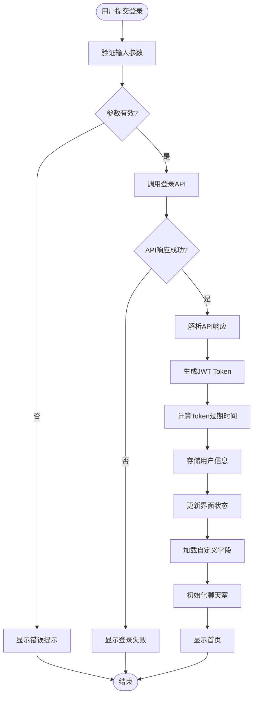
```mermaid
flowchart TD
Start([用户提交登录]) --> ValidateInput["验证输入参数"]
ValidateInput --> InputValid{"参数有效?"}
InputValid --> |否| ShowError["显示错误提示"]
InputValid --> |是| CallAPI["调用登录API"]
CallAPI --> APISuccess{"API响应成功?"}
APISuccess --> |否| ShowLoginError["显示登录失败"]
APISuccess --> |是| ParseResponse["解析API响应"]
ParseResponse --> GenerateToken["生成JWT Token"]
GenerateToken --> CalculateExpire["计算Token过期时间"]
CalculateExpire --> StoreUser["存储用户信息"]
StoreUser --> UpdateUI["更新界面状态"]
UpdateUI --> LoadFields["加载自定义字段"]
LoadFields --> InitChat["初始化聊天室"]
InitChat --> ShowHome["显示首页"]
ShowError --> End([结束])
ShowLoginError --> End
ShowHome --> End
```

**图表来源**
- [src/static/app.js](file://src/static/app.js#L358-L397)

**章节来源**
- [src/static/app.js](file://src/static/app.js#L184-L397)

### 会话管理组件

系统采用localStorage进行会话状态管理，实现了基于JWT Token的自动登录功能：

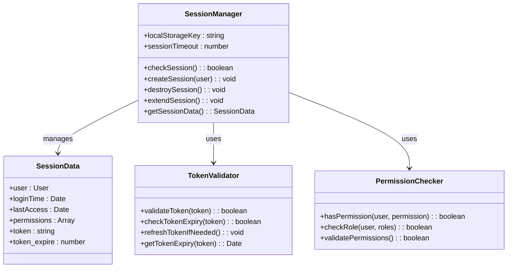
```mermaid
classDiagram
class SessionManager {
+localStorageKey : string
+sessionTimeout : number
+checkSession() : boolean
+createSession(user) : void
+destroySession() : void
+extendSession() : void
+getSessionData() : SessionData
}
class SessionData {
+user : User
+loginTime : Date
+lastAccess : Date
+permissions : Array
+token : string
+token_expire : number
}
class TokenValidator {
+validateToken(token) : boolean
+checkTokenExpiry(token) : boolean
+refreshTokenIfNeeded() : void
+getTokenExpiry(token) : Date
}
class PermissionChecker {
+hasPermission(user, permission) : boolean
+checkRole(user, roles) : boolean
+validatePermissions() : boolean
}
SessionManager --> SessionData : manages
SessionManager --> TokenValidator : uses
SessionManager --> PermissionChecker : uses
```

**图表来源**
- [src/static/app.js](file://src/static/app.js#L184-L218)
- [src/static/app.js](file://src/static/app.js#L371-L405)

#### 权限检查机制

系统实现了基于角色的权限控制，定义了清晰的角色权限层级：

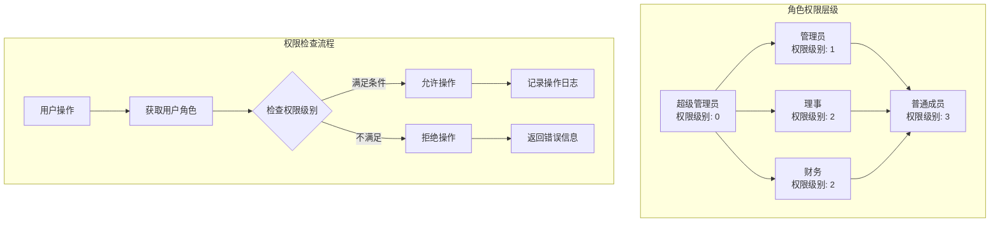
```mermaid
flowchart TD
subgraph "角色权限层级"
SuperAdmin[超级管理员<br/>权限级别: 0] --> Admin[管理员<br/>权限级别: 1]
SuperAdmin --> Director[理事<br/>权限级别: 2]
SuperAdmin --> Finance[财务<br/>权限级别: 2]
Admin --> Member[普通成员<br/>权限级别: 3]
Director --> Member
Finance --> Member
end
subgraph "权限检查流程"
User[用户操作] --> GetRole[获取用户角色]
GetRole --> CheckLevel{检查权限级别}
CheckLevel --> |满足条件| Allow[允许操作]
CheckLevel --> |不满足| Deny[拒绝操作]
Allow --> Log[记录操作日志]
Deny --> Error[返回错误信息]
end
```

**图表来源**
- [src/static/app.js](file://src/static/app.js#L32-L38)
- [src/main.py](file://src/main.py#L545-L557)

**章节来源**
- [src/static/app.js](file://src/static/app.js#L32-L38)
- [src/main.py](file://src/main.py#L545-L557)

### 本地存储机制

系统使用localStorage进行用户状态持久化，现在存储JWT Token信息：

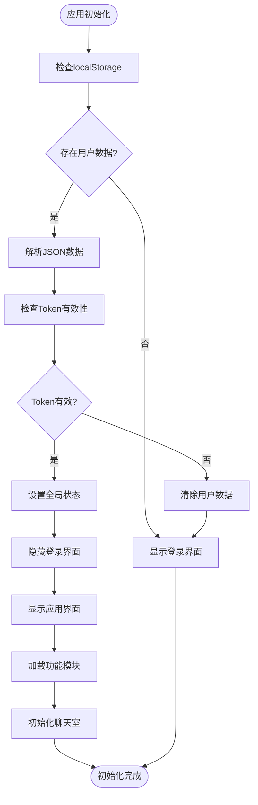
```mermaid
flowchart TD
Start([应用初始化]) --> CheckLocalStorage["检查localStorage"]
CheckLocalStorage --> HasData{"存在用户数据?"}
HasData --> |是| ParseData["解析JSON数据"]
HasData --> |否| ShowLogin["显示登录界面"]
ParseData --> CheckToken["检查Token有效性"]
CheckToken --> TokenValid{"Token有效?"}
TokenValid --> |否| RemoveUser["清除用户数据"]
TokenValid --> |是| SetGlobalState["设置全局状态"]
RemoveUser --> ShowLogin
SetGlobalState --> HideLogin["隐藏登录界面"]
HideLogin --> ShowApp["显示应用界面"]
ShowApp --> LoadFeatures["加载功能模块"]
LoadFeatures --> InitChat["初始化聊天室"]
InitChat --> End([初始化完成])
ShowLogin --> End
```

**图表来源**
- [src/static/app.js](file://src/static/app.js#L225-L276)

**章节来源**
- [src/static/app.js](file://src/static/app.js#L225-L276)

### 导航和路由保护

系统实现了基于认证状态和Token验证的导航控制：

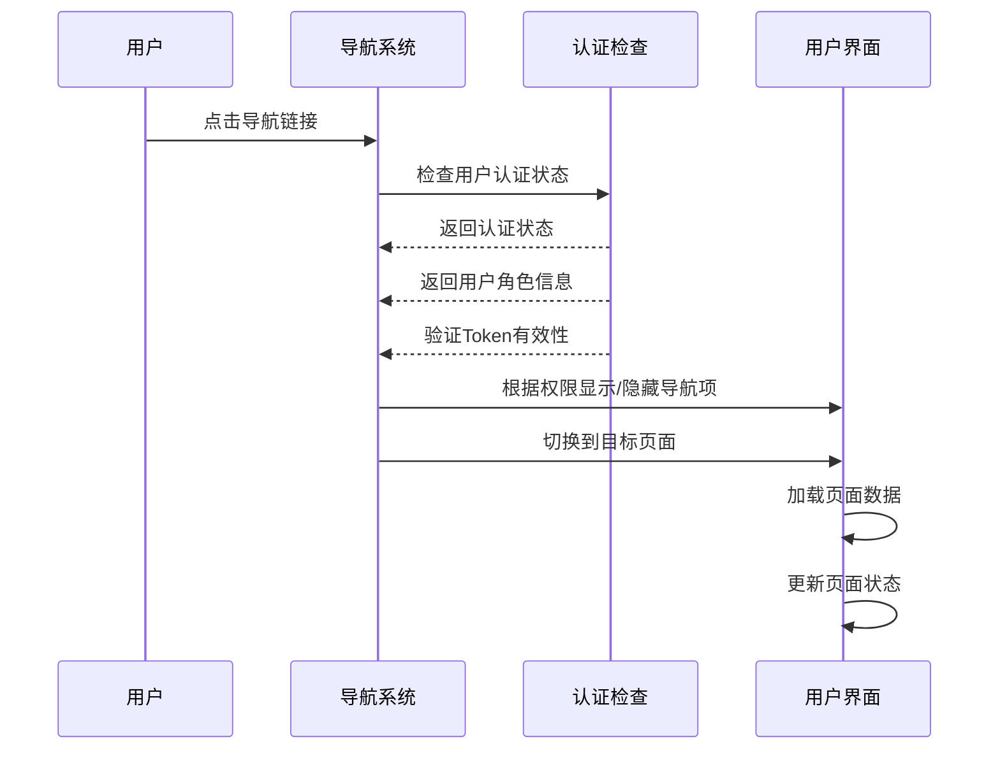
```mermaid
sequenceDiagram
participant User as 用户
participant Nav as 导航系统
participant Auth as 认证检查
participant UI as 用户界面
User->>Nav : 点击导航链接
Nav->>Auth : 检查用户认证状态
Auth-->>Nav : 返回认证状态
Auth-->>Nav : 返回用户角色信息
Auth-->>Nav : 验证Token有效性
Nav->>UI : 根据权限显示/隐藏导航项
Nav->>UI : 切换到目标页面
UI->>UI : 加载页面数据
UI->>UI : 更新页面状态
```

**图表来源**
- [src/static/app.js](file://src/static/app.js#L545-L607)

**章节来源**
- [src/static/app.js](file://src/static/app.js#L545-L607)

## JWT令牌认证系统

### Token生成机制

系统实现了基于JWT的令牌生成机制，提供安全的身份验证：

```mermaid
flowchart TD
subgraph "Token生成流程"
LoginRequest[登录请求] --> ValidateCredentials[验证用户凭据]
ValidateCredentials --> GenerateToken[生成Token]
GenerateToken --> SetExpiry[设置过期时间]
SetExpiry --> SignToken[签名Token]
SignToken --> ReturnToken[返回Token]
end
subgraph "Token结构"
TokenFormat[Token格式:<br/>user_id:expire_timestamp:signature]
Signature[签名算法:<br/>sha256(user_id:expire_timestamp:secret_key)[:32]]
ExpiryCalc[过期时间计算:<br/>当前时间 + 有效期秒数]
end
TokenFormat --> Signature
Signature --> ExpiryCalc
ReturnToken --> StoreToken[存储到localStorage]
```

**图表来源**
- [src/main.py](file://src/main.py#L156-L173)
- [src/main.py](file://src/main.py#L145-L150)

#### Token验证机制

系统实现了完整的Token验证机制，确保请求的安全性：

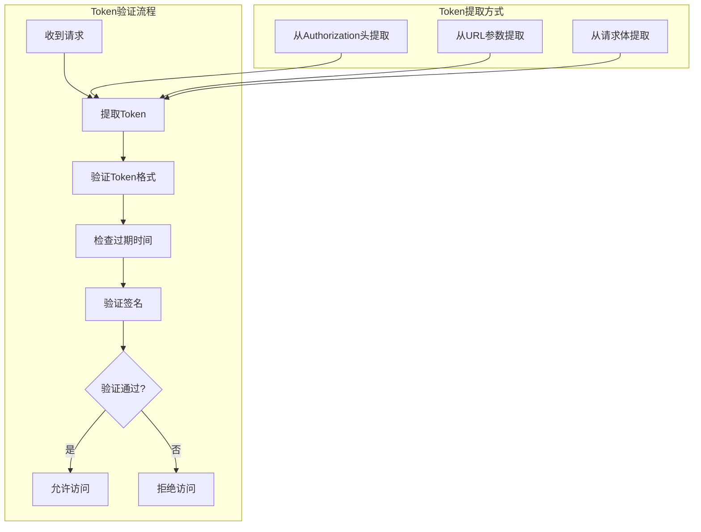
```mermaid
flowchart TD
subgraph "Token验证流程"
IncomingRequest[收到请求] --> ExtractToken[提取Token]
ExtractToken --> ValidateFormat[验证Token格式]
ValidateFormat --> CheckExpiry[检查过期时间]
CheckExpiry --> VerifySignature[验证签名]
VerifySignature --> ValidToken{验证通过?}
ValidToken --> |是| AllowAccess[允许访问]
ValidToken --> |否| DenyAccess[拒绝访问]
end
subgraph "Token提取方式"
HeaderExtraction[从Authorization头提取]
ParamExtraction[从URL参数提取]
BodyExtraction[从请求体提取]
end
HeaderExtraction --> ExtractToken
ParamExtraction --> ExtractToken
BodyExtraction --> ExtractToken
```

**图表来源**
- [src/main.py](file://src/main.py#L175-L209)
- [src/main.py](file://src/main.py#L211-L229)

**章节来源**
- [src/main.py](file://src/main.py#L156-L209)
- [src/main.py](file://src/main.py#L211-L229)

### Token过期处理

系统实现了智能的Token过期检测和处理机制：

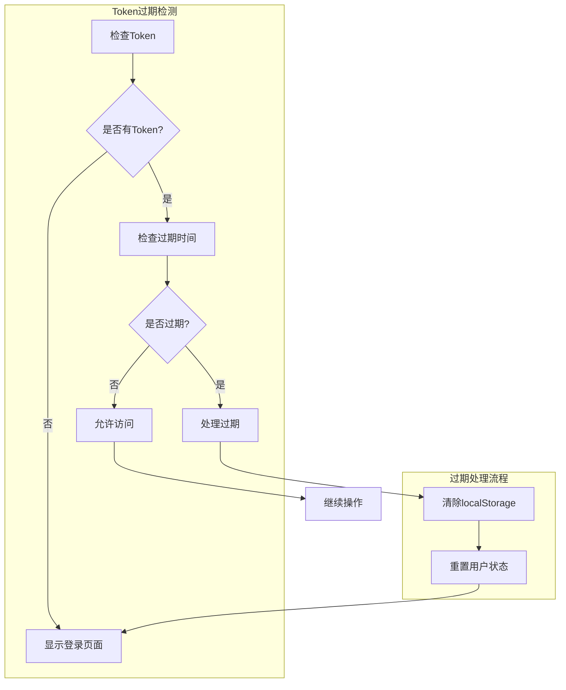
```mermaid
flowchart TD
subgraph "Token过期检测"
CheckToken[检查Token] --> HasToken{是否有Token?}
HasToken --> |否| ShowLoginPage[显示登录页面]
HasToken --> |是| CheckExpiry[检查过期时间]
CheckExpiry --> IsExpired{是否过期?}
IsExpired --> |否| AllowAccess[允许访问]
IsExpired --> |是| HandleExpired[处理过期]
end
subgraph "过期处理流程"
HandleExpired --> ClearStorage[清除localStorage]
ClearStorage --> ResetUserState[重置用户状态]
ResetUserState --> ShowLoginPage
end
AllowAccess --> Continue[继续操作]
```

**图表来源**
- [src/static/app.js](file://src/static/app.js#L184-L218)
- [src/static/app.js](file://src/static/app.js#L225-L257)

**章节来源**
- [src/static/app.js](file://src/static/app.js#L184-L218)
- [src/static/app.js](file://src/static/app.js#L225-L257)

### Token传递机制

系统支持多种Token传递方式，确保兼容性和安全性：

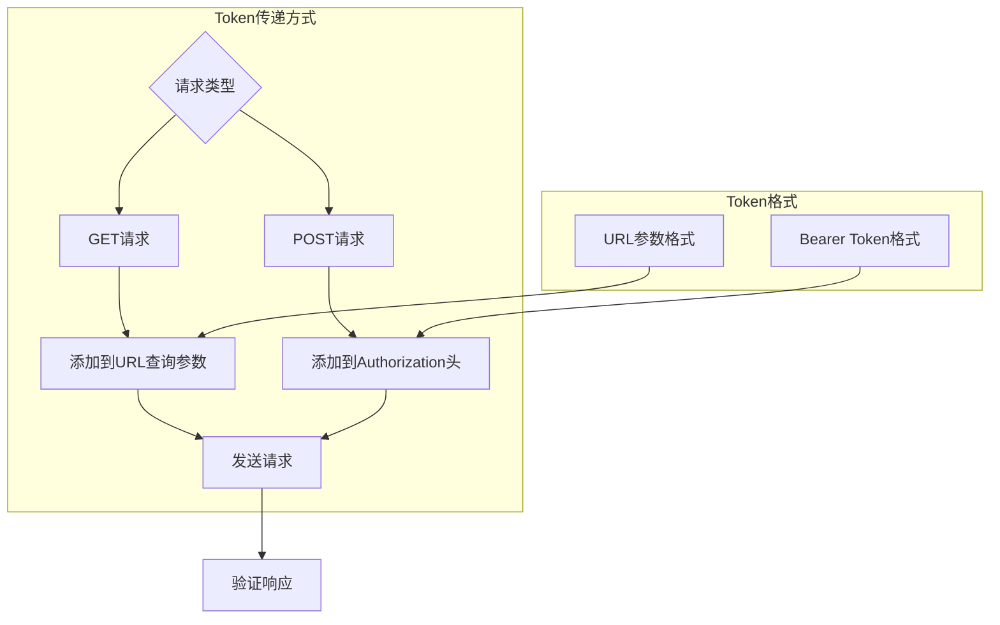
```mermaid
flowchart TD
subgraph "Token传递方式"
RequestType{请求类型} --> GetRequest[GET请求]
RequestType --> PostRequest[POST请求]
GetRequest --> AddToQuery[添加到URL查询参数]
PostRequest --> AddToHeader[添加到Authorization头]
AddToQuery --> SendRequest[发送请求]
AddToHeader --> SendRequest
end
subgraph "Token格式"
BearerToken[Bearer Token格式]
UrlToken[URL参数格式]
end
BearerToken --> AddToHeader
UrlToken --> AddToQuery
SendRequest --> ValidateResponse[验证响应]
```

**图表来源**
- [src/static/app.js](file://src/static/app.js#L371-L405)
- [src/static/app.js](file://src/static/app.js#L340-L362)

**章节来源**
- [src/static/app.js](file://src/static/app.js#L340-L405)

## 权限控制系统

### 角色定义和权限层级

系统实现了完整的角色权限体系，定义了五个主要角色和相应的权限级别：

| 角色 | 权限级别 | 权限描述 | 可执行操作 |
|------|----------|----------|------------|
| super_admin | 0 | 超级管理员 | 系统完全控制权 |
| admin | 1 | 管理员 | 系统管理、数据维护 |
| director | 2 | 理事 | 内容审核、活动管理 |
| finance | 2 | 财务 | 财务记录、收支管理 |
| member | 3 | 普通成员 | 查看内容、基本操作 |

**章节来源**
- [src/static/app.js](file://src/static/app.js#L32-L38)
- [src/main.py](file://src/main.py#L545-L557)

### 权限检查函数实现

系统提供了完整的权限检查机制，包括前端和后端的双重验证：

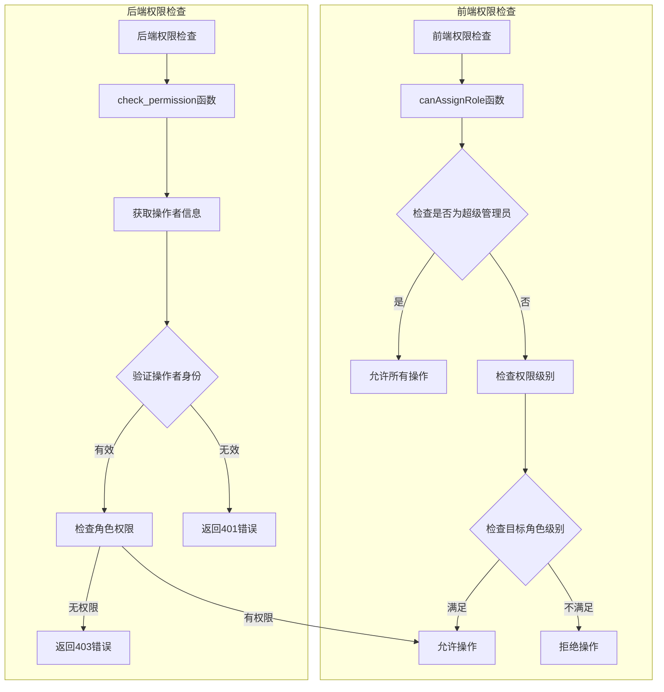
```mermaid
flowchart TD
subgraph "前端权限检查"
Frontend[前端权限检查] --> CanAssignRole[canAssignRole函数]
CanAssignRole --> CheckSuperAdmin{检查是否为超级管理员}
CheckSuperAdmin --> |是| AllowAll[允许所有操作]
CheckSuperAdmin --> |否| CheckLevel[检查权限级别]
CheckLevel --> CheckTarget{检查目标角色级别}
CheckTarget --> |满足| Allow[允许操作]
CheckTarget --> |不满足| Deny[拒绝操作]
end
subgraph "后端权限检查"
Backend[后端权限检查] --> CheckPermission[check_permission函数]
CheckPermission --> GetOperator[获取操作者信息]
GetOperator --> ValidateOperator{验证操作者身份}
ValidateOperator --> |有效| CheckRole[检查角色权限]
ValidateOperator --> |无效| Return401[返回401错误]
CheckRole --> |有权限| Allow[允许操作]
CheckRole --> |无权限| Return403[返回403错误]
end
```

**图表来源**
- [src/static/app.js](file://src/static/app.js#L45-L64)
- [src/main.py](file://src/main.py#L560-L575)

**章节来源**
- [src/static/app.js](file://src/static/app.js#L45-L64)
- [src/main.py](file://src/main.py#L560-L575)

### API权限控制

系统为不同的API接口设置了相应的权限要求：

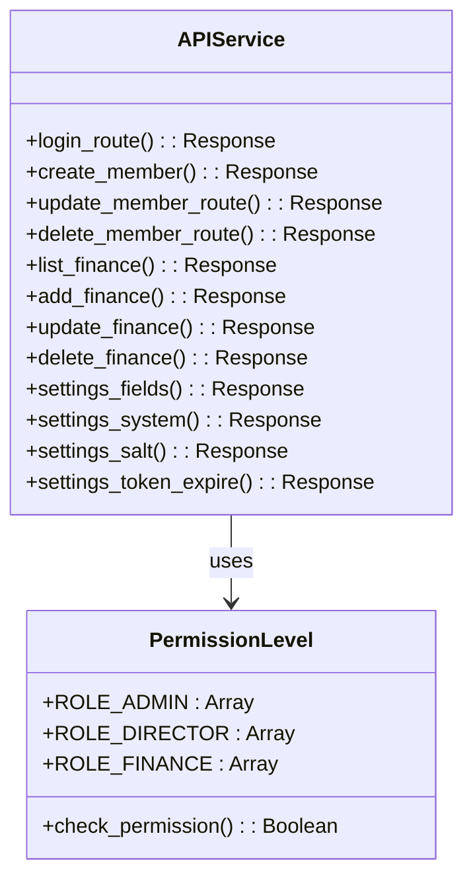
```mermaid
classDiagram
class APIService {
+login_route() : Response
+create_member() : Response
+update_member_route() : Response
+delete_member_route() : Response
+list_finance() : Response
+add_finance() : Response
+update_finance() : Response
+delete_finance() : Response
+settings_fields() : Response
+settings_system() : Response
+settings_salt() : Response
+settings_token_expire() : Response
}
class PermissionLevel {
+ROLE_ADMIN : Array
+ROLE_DIRECTOR : Array
+ROLE_FINANCE : Array
+check_permission() : Boolean
}
APIService --> PermissionLevel : uses
```

**图表来源**
- [src/main.py](file://src/main.py#L1473-L1501)
- [src/main.py](file://src/main.py#L1534-L1583)
- [src/main.py](file://src/main.py#L1585-L1605)

**章节来源**
- [src/main.py](file://src/main.py#L1473-L1501)
- [src/main.py](file://src/main.py#L1534-L1583)
- [src/main.py](file://src/main.py#L1585-L1605)

### 角色分配权限控制

系统实现了严格的社员角色分配控制机制：

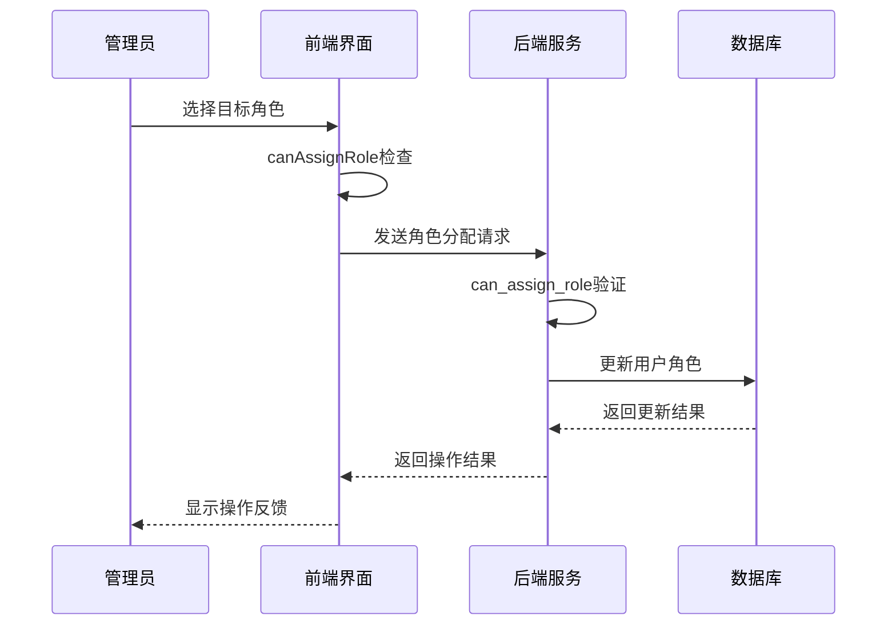
```mermaid
sequenceDiagram
participant Admin as 管理员
participant Frontend as 前端界面
participant Backend as 后端服务
participant Database as 数据库
Admin->>Frontend : 选择目标角色
Frontend->>Frontend : canAssignRole检查
Frontend->>Backend : 发送角色分配请求
Backend->>Backend : can_assign_role验证
Backend->>Database : 更新用户角色
Database-->>Backend : 返回更新结果
Backend-->>Frontend : 返回操作结果
Frontend-->>Admin : 显示操作反馈
```

**图表来源**
- [src/static/app.js](file://src/static/app.js#L45-L64)
- [src/main.py](file://src/main.py#L560-L575)

**章节来源**
- [src/static/app.js](file://src/static/app.js#L45-L64)
- [src/main.py](file://src/main.py#L560-L575)

## 聊天室功能集成

### 访客昵称管理系统

系统实现了基于传统中文天干地支的访客昵称管理系统，提供独特的社交体验：

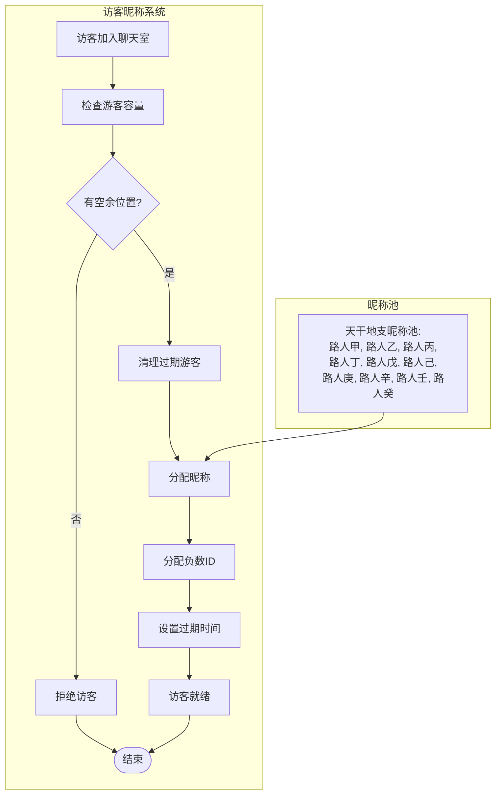
```mermaid
flowchart TD
subgraph "访客昵称系统"
GuestJoin[访客加入聊天室] --> CheckCapacity[检查游客容量]
CheckCapacity --> HasSpace{有空余位置?}
HasSpace --> |否| RejectGuest[拒绝访客]
HasSpace --> |是| CleanExpired[清理过期游客]
CleanExpired --> AllocateName[分配昵称]
AllocateName --> AssignID[分配负数ID]
AssignID --> SetExpire[设置过期时间]
SetExpire --> GuestReady[访客就绪]
RejectGuest --> End([结束])
GuestReady --> End
end
subgraph "昵称池"
NamePool[天干地支昵称池:<br/>路人甲, 路人乙, 路人丙,<br/>路人丁, 路人戊, 路人己,<br/>路人庚, 路人辛, 路人壬, 路人癸]
end
NamePool --> AllocateName
```

**图表来源**
- [src/main.py](file://src/main.py#L2378-L2405)
- [src/main.py](file://src/main.py#L2319-L2320)

#### 聊天室状态管理

系统实现了完整的聊天室状态管理，包括消息缓存、用户管理和配置控制：

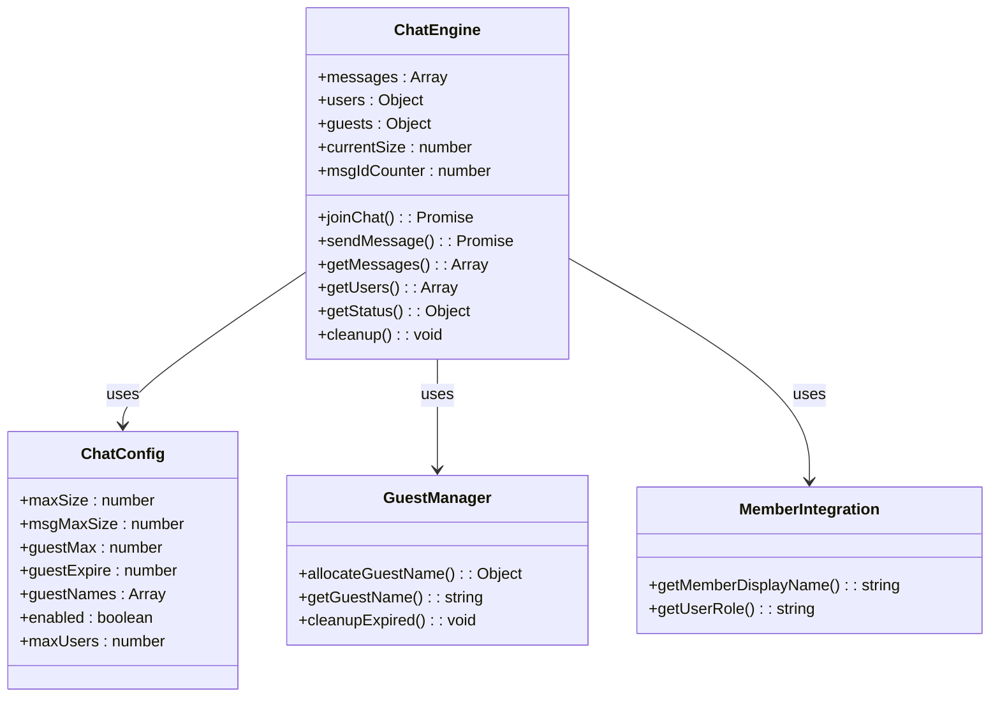
```mermaid
classDiagram
class ChatEngine {
+messages : Array
+users : Object
+guests : Object
+currentSize : number
+msgIdCounter : number
+joinChat() : Promise
+sendMessage() : Promise
+getMessages() : Array
+getUsers() : Array
+getStatus() : Object
+cleanup() : void
}
class ChatConfig {
+maxSize : number
+msgMaxSize : number
+guestMax : number
+guestExpire : number
+guestNames : Array
+enabled : boolean
+maxUsers : number
}
class GuestManager {
+allocateGuestName() : Object
+getGuestName() : string
+cleanupExpired() : void
}
class MemberIntegration {
+getMemberDisplayName() : string
+getUserRole() : string
}
ChatEngine --> ChatConfig : uses
ChatEngine --> GuestManager : uses
ChatEngine --> MemberIntegration : uses
```

**图表来源**
- [src/main.py](file://src/main.py#L2332-L2364)
- [src/main.py](file://src/main.py#L2322-L2331)
- [src/main.py](file://src/main.py#L2378-L2405)
- [src/main.py](file://src/main.py#L2366-L2376)

#### 聊天室API集成

系统提供了完整的聊天室API接口，支持前后端的双向通信：

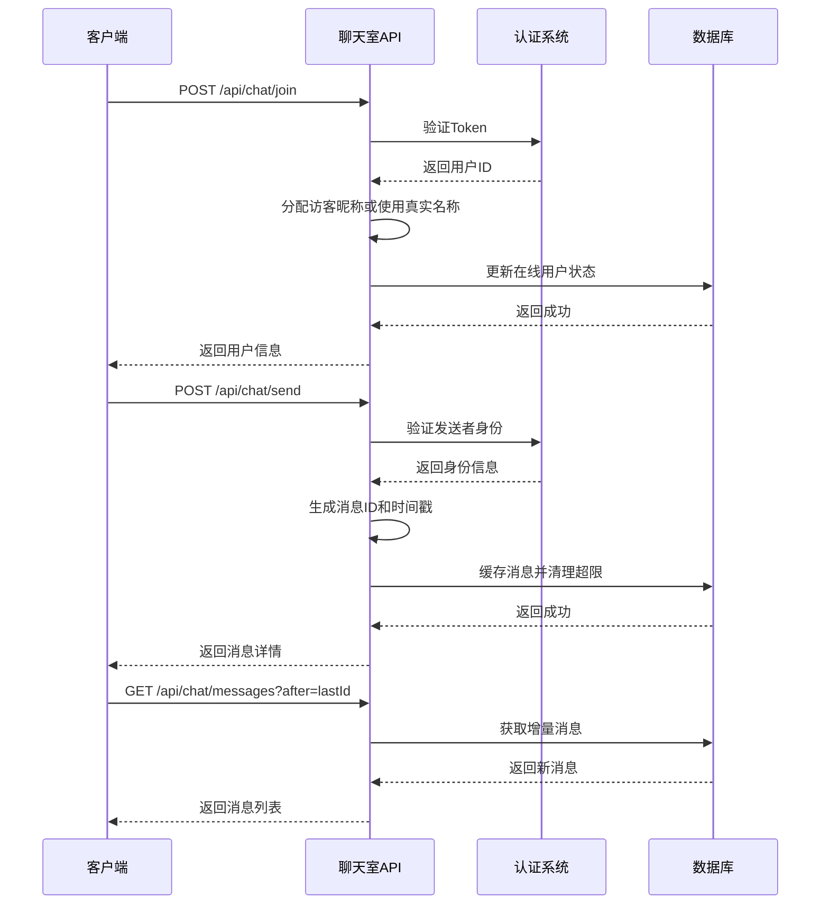
```mermaid
sequenceDiagram
participant Client as 客户端
participant ChatAPI as 聊天室API
participant Auth as 认证系统
participant DB as 数据库
Client->>ChatAPI : POST /api/chat/join
ChatAPI->>Auth : 验证Token
Auth-->>ChatAPI : 返回用户ID
ChatAPI->>ChatAPI : 分配访客昵称或使用真实名称
ChatAPI->>DB : 更新在线用户状态
DB-->>ChatAPI : 返回成功
ChatAPI-->>Client : 返回用户信息
Client->>ChatAPI : POST /api/chat/send
ChatAPI->>Auth : 验证发送者身份
Auth-->>ChatAPI : 返回身份信息
ChatAPI->>ChatAPI : 生成消息ID和时间戳
ChatAPI->>DB : 缓存消息并清理超限
DB-->>ChatAPI : 返回成功
ChatAPI-->>Client : 返回消息详情
Client->>ChatAPI : GET /api/chat/messages?after=lastId
ChatAPI->>DB : 获取增量消息
DB-->>ChatAPI : 返回新消息
ChatAPI-->>Client : 返回消息列表
```

**图表来源**
- [src/static/app.js](file://src/static/app.js#L3432-L3460)
- [src/static/app.js](file://src/static/app.js#L3737-L3789)
- [src/main.py](file://src/main.py#L2442-L2488)
- [src/main.py](file://src/main.py#L2490-L2562)

**章节来源**
- [src/static/app.js](file://src/static/app.js#L3382-L3997)
- [src/main.py](file://src/main.py#L2310-L2603)

### 聊天室前端集成

系统在前端实现了完整的聊天室功能，包括实时消息展示、用户管理和状态同步：

```mermaid
flowchart TD
subgraph "前端聊天室组件"
InitChat[初始化聊天室] --> BindEvents[绑定输入事件]
BindEvents --> JoinChat[加入聊天室]
JoinChat --> StartPolling[启动轮询]
StartPolling --> LoadMessages[加载消息]
LoadMessages --> LoadUsers[加载用户]
LoadUsers --> LoadStatus[加载状态]
LoadStatus --> RenderUI[渲染界面]
RenderUI --> HandleInput[处理用户输入]
HandleInput --> SendMsg[发送消息]
SendMsg --> UpdateUI[更新界面]
UpdateUI --> HandleInput
end
subgraph "实时更新机制"
Polling[定时轮询] --> Incremental[增量获取]
Incremental --> AutoScroll[自动滚动]
AutoScroll --> StatusUpdate[状态更新]
StatusUpdate --> Polling
end
```

**图表来源**
- [src/static/app.js](file://src/static/app.js#L3404-L3427)
- [src/static/app.js](file://src/static/app.js#L3487-L3505)
- [src/static/app.js](file://src/static/app.js#L3510-L3544)

**章节来源**
- [src/static/app.js](file://src/static/app.js#L3382-L3997)

## 安全增强功能

### 密码哈希安全系统

系统保留了基于SHA256的密码哈希安全系统，为JWT认证提供基础：

```mermaid
flowchart TD
Start([密码处理请求]) --> CheckHash{"密码长度为64位?"}
CheckHash --> |是| DirectCompare["直接比较哈希值"]
CheckHash --> |否| HashWithSalt["使用Salt生成哈希"]
HashWithSalt --> CompareHash["比较哈希值"]
DirectCompare --> Success{"匹配成功?"}
CompareHash --> Success
Success --> |是| AuthSuccess["认证成功"]
Success --> |否| AuthFail["认证失败"]
AuthSuccess --> End([结束])
AuthFail --> End
```

**图表来源**
- [src/main.py](file://src/main.py#L126-L134)

#### Salt配置管理

系统支持动态配置Salt值，增强密码安全性：

```mermaid
classDiagram
class SaltManager {
+currentSalt : string
+defaultSalt : string
+generateSalt() : string
+validateSalt(salt) : boolean
+updateSalt(newSalt) : boolean
+getSalt() : string
}
class PasswordHasher {
+hashPassword(password) : string
+verifyPassword(password, hash) : boolean
+hashWithSalt(password, salt) : string
}
SaltManager --> PasswordHasher : uses
```

**图表来源**
- [src/main.py](file://src/main.py#L115-L134)
- [src/main.py](file://src/main.py#L151-L154)

#### Token密钥管理

系统实现了基于Salt的Token密钥生成机制：

```mermaid
flowchart TD
subgraph "Token密钥生成"
SaltValue[Salt值] --> CombineSalt[与固定字符串组合]
CombineSalt --> HashSalt[生成哈希值]
HashSalt --> TokenKey[Token密钥]
end
subgraph "Token签名"
UserID[用户ID] --> CombineData[与过期时间组合]
CombineData --> HashData[生成哈希值]
HashData --> Signature[签名]
end
TokenKey --> Signature
```

**图表来源**
- [src/main.py](file://src/main.py#L151-L154)
- [src/main.py](file://src/main.py#L197-L201)

**章节来源**
- [src/main.py](file://src/main.py#L115-L154)
- [src/main.py](file://src/main.py#L197-L201)

### Token有效期管理

系统实现了灵活的Token有效期管理机制：

```mermaid
flowchart TD
subgraph "Token有效期配置"
DefaultExpire[默认30天] --> CustomExpire[自定义有效期]
CustomExpire --> SystemSetting[系统设置]
SystemSetting --> UserSetting[用户设置]
end
subgraph "Token过期检测"
CurrentTime[当前时间] --> CompareTime[与过期时间比较]
CompareTime --> Expired{是否过期?}
Expired --> |是| ForceLogout[强制登出]
Expired --> |否| AllowAccess[允许访问]
end
ForceLogout --> ClearStorage[清除存储]
ClearStorage --> ShowLogin[显示登录界面]
```

**图表来源**
- [src/main.py](file://src/main.py#L145-L149)
- [src/static/app.js](file://src/static/app.js#L184-L191)

**章节来源**
- [src/main.py](file://src/main.py#L145-L149)
- [src/static/app.js](file://src/static/app.js#L184-L191)

### 聊天室安全机制

系统在聊天室功能中实现了多重安全机制：

```mermaid
flowchart TD
subgraph "聊天室安全检查"
ReceiveMessage[接收消息] --> CheckEnabled[检查聊天室是否开启]
CheckEnabled --> CheckCapacity[检查人数限制]
CheckCapacity --> ValidateSender[验证发送者身份]
ValidateSender --> CheckToken{Token有效?}
CheckToken --> |是| UseTokenIdentity[使用Token身份]
CheckToken --> |否| CheckRequestID{请求体有ID?}
CheckRequestID --> |正数| Reject[拒绝访问]
CheckRequestID --> |负数| ValidateGuest[验证游客身份]
CheckRequestID --> |无ID| RequireJoin[要求先加入]
ValidateGuest --> CheckGuestExpire[检查游客过期]
CheckGuestExpire --> CheckContent[检查消息内容]
CheckContent --> ProcessMessage[处理消息]
ProcessMessage --> Cleanup[清理超限]
Cleanup --> End([完成])
Reject --> End
RequireJoin --> End
```

**图表来源**
- [src/main.py](file://src/main.py#L2490-L2562)
- [src/main.py](file://src/main.py#L2442-L2488)

**章节来源**
- [src/main.py](file://src/main.py#L2490-L2562)
- [src/main.py](file://src/main.py#L2442-L2488)

## 依赖关系分析

系统各组件之间的依赖关系如下：

```mermaid
graph TD
subgraph "前端依赖"
AppJS[app.js]
IndexHTML[index.html]
StyleCSS[style.css]
TokenManager[Token管理器]
Permission[权限模块]
Security[安全模块]
ChatModule[聊天室模块]
end
subgraph "后端依赖"
MainPY[main.py]
Microdot[microdot.py]
JsonlDB[JsonlDB类]
Crypto[uhashlib模块]
end
subgraph "数据依赖"
ConfigJSON[config.json]
MembersJSONL[members.jsonl]
LoginLogsJSONL[login_logs.jsonl]
FinanceJSONL[finance.jsonl]
end
AppJS --> MainPY
IndexHTML --> AppJS
StyleCSS --> AppJS
MainPY --> Microdot
MainPY --> JsonlDB
MainPY --> Crypto
MainPY --> ConfigJSON
MainPY --> MembersJSONL
MainPY --> LoginLogsJSONL
MainPY --> FinanceJSONL
TokenManager --> Crypto
TokenManager --> ConfigJSON
Permission --> MainPY
Security --> Crypto
Security --> ConfigJSON
ChatModule --> MainPY
```

**图表来源**
- [src/static/app.js](file://src/static/app.js#L1-L18)
- [src/main.py](file://src/main.py#L1-L2621)

**章节来源**
- [src/main.py](file://src/main.py#L1-L2621)
- [src/static/app.js](file://src/static/app.js#L1-L3997)

## 性能考虑

### 认证性能优化

系统在认证过程中采用了多项性能优化措施：

1. **异步处理**: 所有网络请求都采用异步方式，避免阻塞UI线程
2. **缓存策略**: 用户信息和自定义字段在首次加载后进行缓存
3. **防抖机制**: 全局搜索功能实现了500ms的防抖延迟
4. **懒加载**: 页面内容按需加载，减少初始渲染时间
5. **Token缓存**: 用户Token在内存中缓存，避免重复解析
6. **权限缓存**: 用户角色信息在前端进行缓存，减少重复检查
7. **过期预检**: Token过期检测在请求前进行，避免不必要的网络调用

### 数据存储优化

```mermaid
flowchart LR
subgraph "存储策略"
LocalStorage[localStorage]
IndexedDB[IndexedDB]
FileStorage[文件存储]
TokenCache[Token缓存]
RoleCache[角色缓存]
ChatCache[聊天室缓存]
end
subgraph "应用场景"
Drafts[草稿存储]
UserState[用户状态]
SystemData[系统数据]
Security[安全配置]
Permission[权限数据]
TokenInfo[Token信息]
ChatMessages[聊天消息]
ChatUsers[在线用户]
ChatStatus[聊天状态]
end
LocalStorage --> UserState
IndexedDB --> Drafts
FileStorage --> SystemData
Security --> SystemData
Permission --> RoleCache
TokenCache --> TokenInfo
ChatCache --> ChatMessages
ChatCache --> ChatUsers
ChatCache --> ChatStatus
```

**图表来源**
- [src/static/app.js](file://src/static/app.js#L117-L174)
- [src/static/app.js](file://src/static/app.js#L371-L405)

**章节来源**
- [src/static/app.js](file://src/static/app.js#L117-L174)
- [src/static/app.js](file://src/static/app.js#L371-L405)

### 聊天室性能优化

系统在聊天室功能中实现了多项性能优化：

1. **增量消息获取**: 支持基于消息ID的增量获取，减少数据传输
2. **内存限制**: 聊天室消息占用内存有上限，自动清理过期消息
3. **定时轮询**: 10秒间隔的定时轮询，平衡实时性和性能
4. **游客管理**: 自动清理过期游客，控制内存使用
5. **消息压缩**: 估算消息大小，避免超大消息占用内存
6. **状态缓存**: 首页聊天预览缓存最近50条消息，避免频繁请求

**章节来源**
- [src/static/app.js](file://src/static/app.js#L3397-L3400)
- [src/main.py](file://src/main.py#L2343-L2364)

## 故障排除指南

### 常见认证问题

| 问题类型 | 症状 | 解决方案 |
|----------|------|----------|
| 登录失败 | 提示账号或密码错误 | 检查用户名密码是否正确，确认数据库中是否存在该用户 |
| Token过期 | 401错误或自动登出 | 检查系统时间设置，确认Token有效期配置正确 |
| 自动登录失效 | 刷新页面后需要重新登录 | 检查localStorage是否被清理，确认浏览器允许localStorage |
| 权限不足 | 无法访问某些功能 | 检查用户角色配置，确认权限级别是否足够 |
| 网络连接问题 | API请求超时 | 检查网络连接，确认服务器正常运行 |
| Token验证失败 | 401错误 | 检查Token格式和签名，确认密钥配置正确 |

### JWT相关问题

| 问题类型 | 症状 | 解决方案 |
|----------|------|----------|
| Token格式错误 | Token解析失败 | 检查Token格式是否为user_id:expire_timestamp:signature |
| 签名验证失败 | Token签名无效 | 检查Salt配置，确认前后端使用相同的密钥 |
| 过期时间错误 | Token过期时间不正确 | 检查系统时间设置，确认Token过期计算逻辑 |
| Token丢失 | 401错误 | 检查localStorage存储，确认Token未被意外清除 |

### 权限相关问题

| 问题类型 | 症状 | 解决方案 |
|----------|------|----------|
| 角色分配失败 | 无法设置特定角色 | 检查操作者权限级别，确认不能分配比自己权限高或相同的角色 |
| API访问被拒绝 | 返回403错误 | 检查用户角色是否具备相应权限，确认权限检查函数正常工作 |
| 权限检查异常 | 前端权限判断错误 | 检查ROLE_LEVEL配置，确认角色权限层级设置正确 |
| 系统设置权限问题 | 无法修改系统配置 | 检查用户角色权限，确认具备相应级别的系统设置权限 |

### 聊天室相关问题

| 问题类型 | 症状 | 解决方案 |
|----------|------|----------|
| 聊天室无法加入 | 返回"龙门阵已关闭" | 检查系统设置中的chat_enabled配置 |
| 游客位置已满 | 返回"游客位置已满" | 检查chat_guest_max配置，等待过期游客离开 |
| 昵称过期 | 返回"昵称已过期" | 重新加入聊天室获取新昵称 |
| 消息发送失败 | 返回"消息过长" | 检查消息长度限制（256个字符） |
| 人数已满 | 返回"龙门阵人数已满" | 等待其他用户离开或增加最大用户数配置 |
| 聊天室状态异常 | 返回错误的状态信息 | 检查聊天室配置和内存使用情况 |

### 安全相关问题

| 问题类型 | 症状 | 解决方案 |
|----------|------|----------|
| Salt配置错误 | 密码验证失败 | 检查settings.json中的password_salt配置 |
| Token密钥不匹配 | Token验证失败 | 检查Salt配置，确认前后端使用相同的密钥 |
| 向后兼容问题 | 旧密码无法使用 | 确认verify_password函数的兼容逻辑正常工作 |
| 会话劫持风险 | Token泄露 | 建议定期轮换Salt，加强Token传输安全 |
| 聊天室安全漏洞 | 游客冒充 | 检查聊天室身份验证逻辑，确认Token优先验证 |

### 调试方法

1. **浏览器开发者工具**: 使用Network标签监控API请求和Token传递
2. **控制台日志**: 检查JavaScript错误和警告，查看Token相关信息
3. **localStorage检查**: 在Application标签中查看存储的用户信息和Token
4. **服务器日志**: 检查后端错误日志，查看Token验证结果
5. **权限调试**: 使用console.log输出用户角色和权限检查结果
6. **Token验证**: 使用后端提供的验证函数测试Token有效性
7. **聊天室调试**: 检查聊天室状态API的响应，确认消息缓存和用户管理正常

**章节来源**
- [src/static/app.js](file://src/static/app.js#L297-L397)
- [src/main.py](file://src/main.py#L1473-L1501)

## 结论

围炉诗社·理事台项目的用户认证系统实现了以下关键特性：

1. **完整的JWT认证流程**: 从Token生成到验证的全流程覆盖
2. **灵活的权限控制**: 基于角色的细粒度权限管理，支持五级权限体系
3. **智能的会话管理**: 基于Token的会话状态管理，支持过期检测和自动处理
4. **可靠的聊天室集成**: 新增的聊天室功能支持访客昵称管理和与成员数据库的深度集成
5. **强大的安全机制**: 基于Salt的Token签名验证，提供更强的安全保障
6. **优秀的用户体验**: 自动登录、权限控制、导航保护、实时聊天等人性化设计
7. **可扩展的架构**: 清晰的前后端分离设计，便于功能扩展和维护

**更新** 系统在安全性方面有了重大提升，通过引入基于JWT的令牌认证系统、智能的Token过期管理、基于Salt的密钥生成和完整的权限控制，显著增强了用户认证的安全性和可靠性。新的认证架构不仅提供了更好的安全性，还改善了用户体验，支持更灵活的权限管理和更高效的会话控制。

**新增功能亮点** 系统集成了全新的聊天室功能，这是本次更新的重要组成部分。聊天室功能包括：
- 基于传统中文天干地支的访客昵称系统
- 智能的游客管理机制，支持过期清理和容量控制
- 实时消息传输和增量获取机制
- 与成员数据库的无缝集成，支持真实用户和访客的统一管理
- 完整的聊天室状态管理和配置控制

系统在JWT认证方面采用了先进的安全模式，包括Token格式规范、签名验证机制、过期时间管理和密钥轮换策略。对于生产环境，建议定期更新Salt值，合理配置Token有效期，并监控Token使用情况以发现潜在的安全威胁。同时，应定期审查用户角色分配，确保权限分配符合最小权限原则，避免权限滥用。

新的JWT认证系统和聊天室功能为围炉诗社·理事台项目奠定了坚实的技术基础，为未来的功能扩展和安全加固提供了充足的空间和灵活性。系统现在不仅是一个管理系统，更是一个集成了社交功能的综合平台，为围炉诗社的成员提供了更好的互动体验。