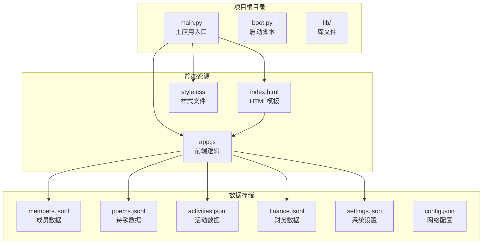
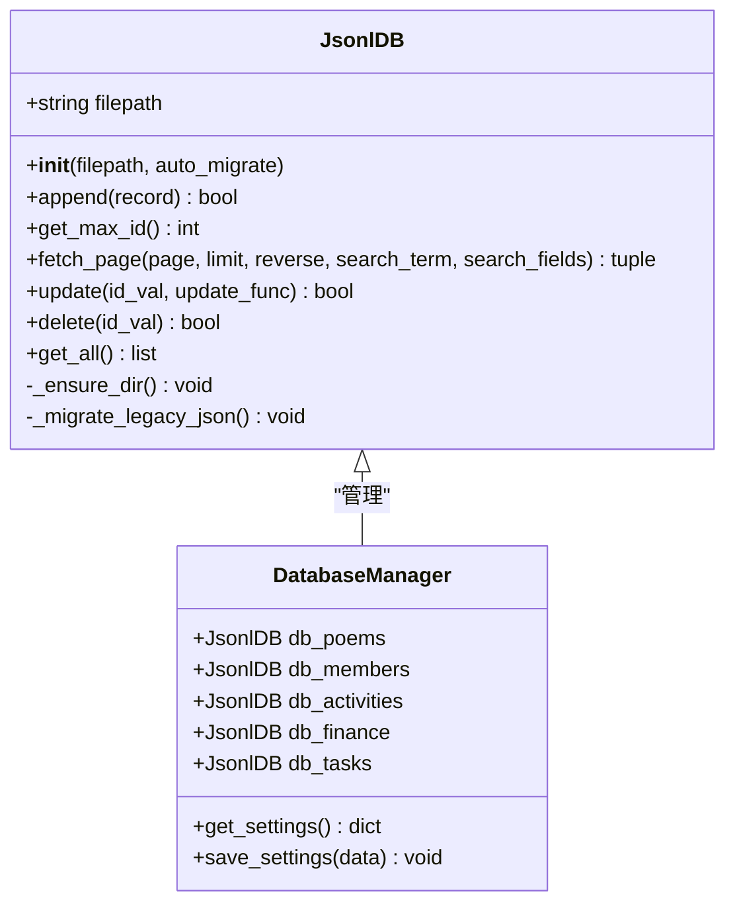
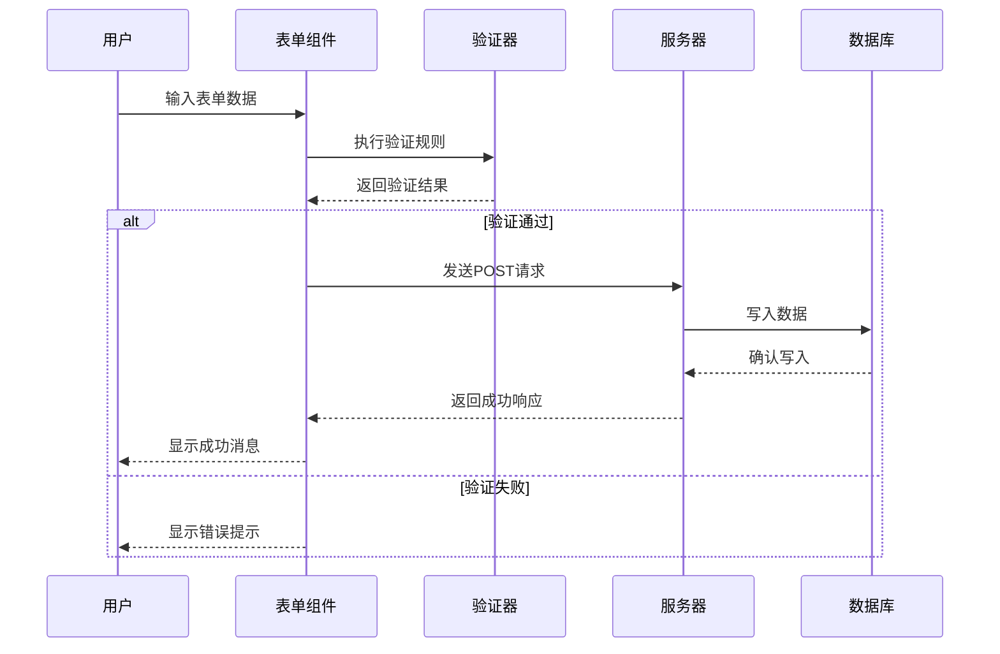
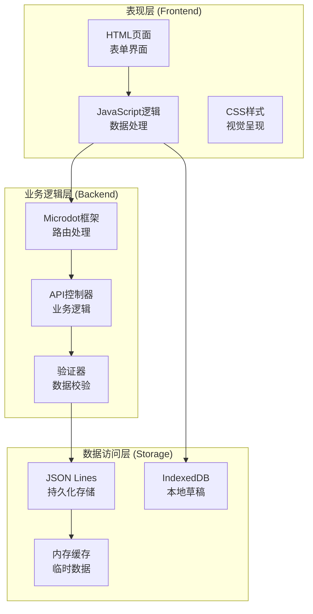
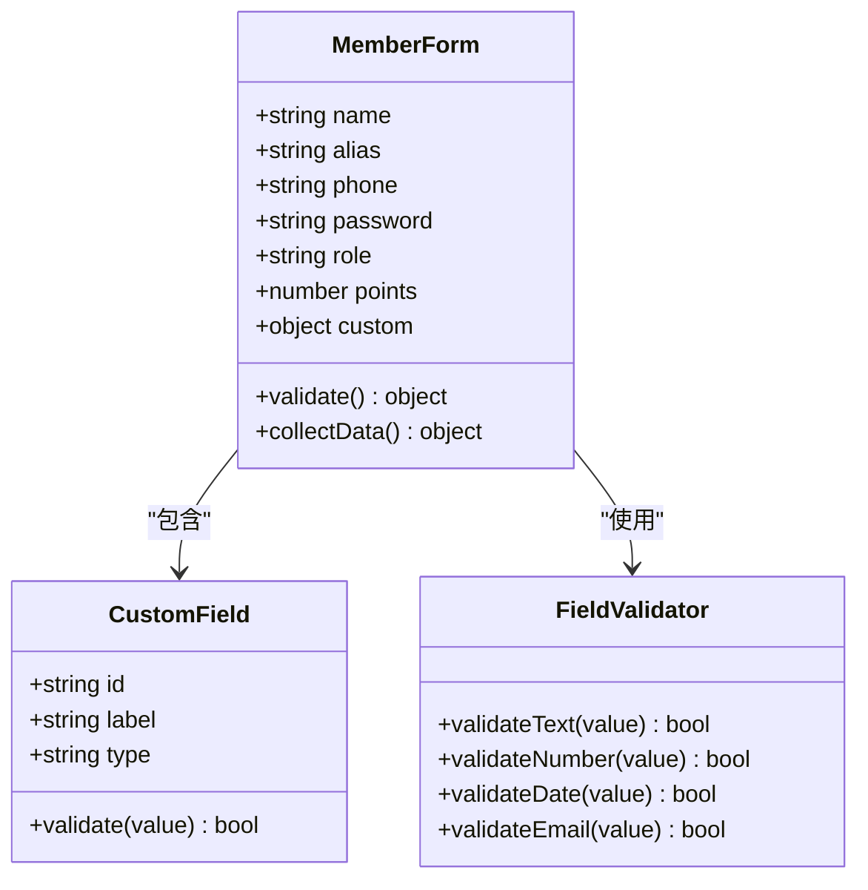
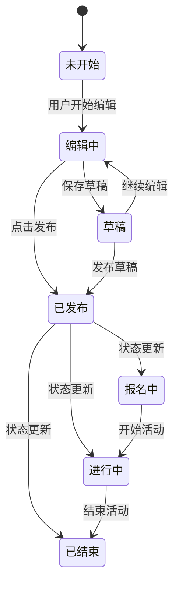
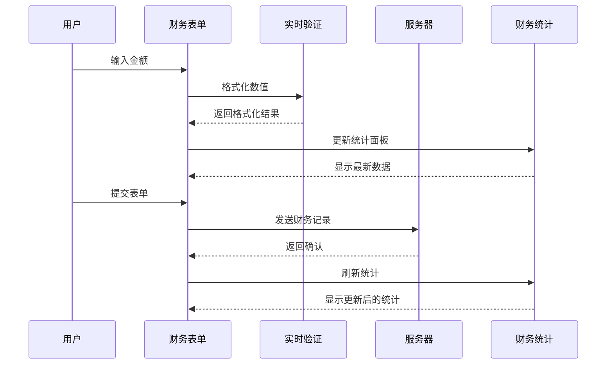
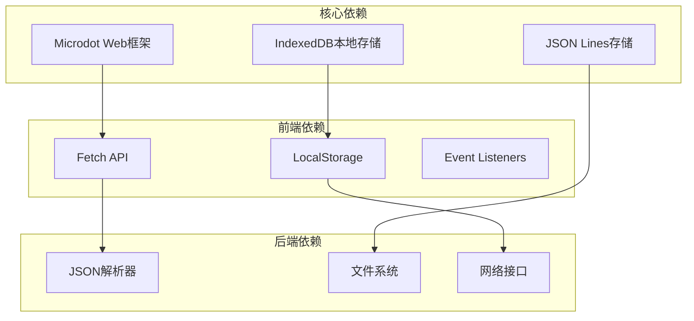
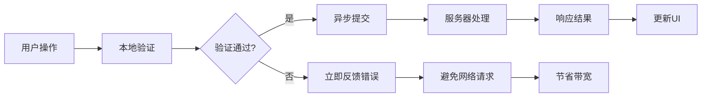

# 表单处理与验证

<cite>
**本文档引用的文件**
- [main.py](file://main.py)
- [app.js](file://static/app.js)
- [index.html](file://static/index.html)
- [members.jsonl](file://data/members.jsonl)
- [poems.jsonl](file://data/poems.jsonl)
- [activities.jsonl](file://data/activities.jsonl)
- [finance.jsonl](file://data/finance.jsonl)
- [settings.json](file://data/settings.json)
</cite>

## 目录
1. [简介](#简介)
2. [项目结构](#项目结构)
3. [核心组件](#核心组件)
4. [架构概览](#架构概览)
5. [详细组件分析](#详细组件分析)
6. [依赖关系分析](#依赖关系分析)
7. [性能考虑](#性能考虑)
8. [故障排除指南](#故障排除指南)
9. [结论](#结论)

## 简介

围炉诗社·理事台是一个基于MicroPython的Web应用，专门为传统诗社管理需求而设计。该项目实现了完整的表单处理与验证系统，支持诗歌作品管理、成员信息维护、活动组织和财务管理等功能。

该系统采用前后端分离架构，前端使用纯JavaScript实现响应式用户界面，后端基于Microdot框架提供RESTful API服务。系统的核心优势在于其灵活的自定义字段系统，允许管理员动态配置成员信息的扩展字段。

## 项目结构

项目采用模块化的文件组织方式，主要包含以下目录和文件：



**图表来源**
- [main.py](file://main.py#L1-L548)
- [index.html](file://static/index.html#L1-L269)

**章节来源**
- [main.py](file://main.py#L1-L548)
- [index.html](file://static/index.html#L1-L269)

## 核心组件

### 数据库管理系统

系统实现了基于JSON Lines格式的轻量级数据库管理器，提供高效的增删改查操作：



**图表来源**
- [main.py](file://main.py#L53-L267)

### 前端表单处理系统

前端实现了完整的表单处理逻辑，包括数据收集、验证、错误提示和异步提交：



**图表来源**
- [app.js](file://static/app.js#L343-L402)
- [app.js](file://static/app.js#L580-L644)

**章节来源**
- [main.py](file://main.py#L53-L267)
- [app.js](file://static/app.js#L1-L1312)

## 架构概览

系统采用经典的三层架构模式，实现了清晰的职责分离：



**图表来源**
- [main.py](file://main.py#L17-L548)
- [app.js](file://static/app.js#L1-L1312)

## 详细组件分析

### 诗歌表单处理系统

#### 表单创建与编辑流程

诗歌表单实现了完整的CRUD操作，支持草稿保存和正式发布两种模式：

```mermaid
flowchart TD
A[用户点击"撰写新作品"] --> B[打开诗歌模态框]
B --> C[初始化表单字段]
C --> D{选择操作模式}
D --> |草稿模式| E[显示草稿按钮]
D --> |发布模式| F[显示发布按钮]
E --> G[保存草稿到IndexedDB]
F --> H[提交到服务器]
G --> I[返回草稿列表]
H --> J[服务器验证数据]
J --> K{验证通过?}
K --> |是| L[写入poems.jsonl]
K --> |否| M[显示错误信息]
L --> N[刷新诗歌列表]
M --> O[用户重新输入]
```

**图表来源**
- [app.js](file://static/app.js#L299-L341)
- [app.js](file://static/app.js#L343-L402)

#### 数据验证规则

诗歌表单实施了多层次的数据验证：

| 字段 | 必填 | 验证规则 | 错误提示 |
|------|------|----------|----------|
| 标题 | ✓ | 非空检查 | 请填写标题 |
| 正文 | ✓ | 非空检查 | 请填写正文 |
| 类型 | ✓ | 枚举验证 | 请选择诗歌类型 |
| 日期 | ✓ | 日期格式验证 | 日期格式不正确 |

**章节来源**
- [app.js](file://static/app.js#L343-L402)
- [app.js](file://static/app.js#L863-L914)

### 成员表单处理系统

#### 自定义字段系统

成员表单的核心特性是灵活的自定义字段系统：



**图表来源**
- [app.js](file://static/app.js#L541-L578)
- [app.js](file://static/app.js#L1244-L1312)

#### 字段类型处理

系统支持四种自定义字段类型：

| 类型 | 输入控件 | 验证规则 | 使用场景 |
|------|----------|----------|----------|
| text | 文本输入框 | 长度限制 | 姓名、地址等 |
| number | 数字输入框 | 数值范围检查 | 年龄、积分等 |
| date | 日期选择器 | 日期格式验证 | 生日、入社日期等 |
| email | 邮箱输入框 | 邮箱格式验证 | 联系方式等 |

**章节来源**
- [app.js](file://static/app.js#L541-L578)
- [app.js](file://static/app.js#L1244-L1312)

### 活动表单处理系统

#### 表单状态管理

活动表单实现了复杂的状态管理机制：



**图表来源**
- [app.js](file://static/app.js#L786-L805)
- [app.js](file://static/app.js#L807-L849)

#### 权限控制机制

系统实现了基于角色的权限控制：

| 角色 | 可执行操作 |
|------|------------|
| 普通社员 | 查看活动详情 |
| 理事 | 创建/编辑活动 |
| 财务 | 查看财务记录 |
| 管理员 | 管理成员信息 |
| 超级管理员 | 全部权限 |

**章节来源**
- [app.js](file://static/app.js#L109-L147)
- [main.py](file://main.py#L456-L483)

### 财务表单处理系统

#### 数据绑定与同步

财务表单实现了实时的数据绑定和同步机制：



**图表来源**
- [app.js](file://static/app.js#L916-L956)
- [app.js](file://static/app.js#L656-L681)

**章节来源**
- [app.js](file://static/app.js#L916-L956)
- [app.js](file://static/app.js#L656-L681)

## 依赖关系分析

系统的关键依赖关系如下：



**图表来源**
- [main.py](file://main.py#L1-L16)
- [app.js](file://static/app.js#L1-L1312)

**章节来源**
- [main.py](file://main.py#L1-L16)
- [app.js](file://static/app.js#L1-L1312)

## 性能考虑

### 内存优化策略

系统采用了多项内存优化措施：

1. **延迟加载**: 页面切换时才加载对应数据
2. **分页加载**: 大数据集采用分页显示
3. **缓存机制**: 关键数据在内存中缓存
4. **垃圾回收**: 定期清理不再使用的对象

### 网络性能优化



**图表来源**
- [app.js](file://static/app.js#L343-L402)
- [app.js](file://static/app.js#L580-L644)

### 存储性能优化

系统针对嵌入式环境进行了专门的存储优化：

- **顺序写入**: 避免随机访问，提高写入速度
- **批量操作**: 合并多次写入操作
- **索引优化**: 为常用查询字段建立索引
- **压缩存储**: 减少存储空间占用

## 故障排除指南

### 常见问题及解决方案

#### 登录失败

**问题描述**: 用户无法登录系统

**可能原因**:
1. 用户名或密码错误
2. 数据库连接异常
3. 网络连接问题

**解决步骤**:
1. 检查用户名和密码是否正确
2. 验证数据库文件是否存在
3. 确认网络连接正常
4. 查看服务器日志获取详细错误信息

#### 表单提交失败

**问题描述**: 表单数据无法提交到服务器

**可能原因**:
1. 网络连接中断
2. 服务器响应超时
3. 数据格式不正确
4. 权限不足

**解决步骤**:
1. 检查网络连接状态
2. 验证数据格式是否符合要求
3. 确认用户权限是否足够
4. 查看浏览器开发者工具中的网络请求

#### 数据同步问题

**问题描述**: 前后端数据不一致

**可能原因**:
1. IndexedDB存储异常
2. 缓存数据过期
3. 并发访问冲突

**解决步骤**:
1. 清除浏览器缓存
2. 重新加载页面
3. 检查IndexedDB状态
4. 重启应用服务

**章节来源**
- [main.py](file://main.py#L485-L502)
- [app.js](file://static/app.js#L75-L98)

### 调试技巧

#### 前端调试

1. **浏览器开发者工具**: 使用Network标签查看API请求
2. **控制台日志**: 添加console.log输出调试信息
3. **断点调试**: 在关键函数处设置断点
4. **性能分析**: 使用Performance标签分析运行时性能

#### 后端调试

1. **日志输出**: 在关键位置添加打印语句
2. **异常捕获**: 使用try-catch捕获并记录异常
3. **状态监控**: 监控内存使用和文件系统状态
4. **API测试**: 使用curl或Postman测试API接口

## 结论

围炉诗社·理事台项目展现了优秀的表单处理与验证系统设计。系统通过以下特点实现了高效、可靠的表单管理：

1. **模块化设计**: 清晰的职责分离和组件化架构
2. **灵活验证**: 多层次、可扩展的验证机制
3. **用户体验**: 流畅的交互体验和即时反馈
4. **性能优化**: 针对嵌入式环境的专门优化
5. **安全性**: 完整的权限控制和数据保护

该系统为传统诗社管理提供了完整的数字化解决方案，既保持了传统文化的韵味，又融入了现代技术的便利性。通过自定义字段系统，系统能够适应不同诗社的特殊需求，具有很强的扩展性和实用性。

未来可以在以下方面进一步改进：
- 增加更丰富的表单控件类型
- 实现表单数据的版本管理和历史追踪
- 加强数据备份和恢复机制
- 优化移动端用户体验