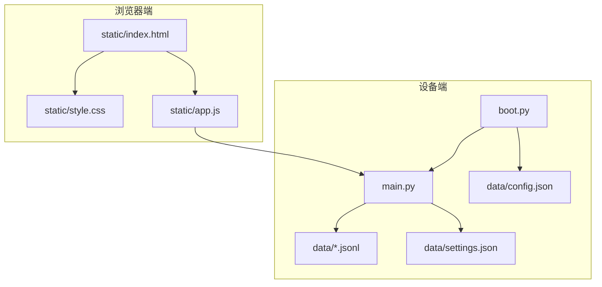
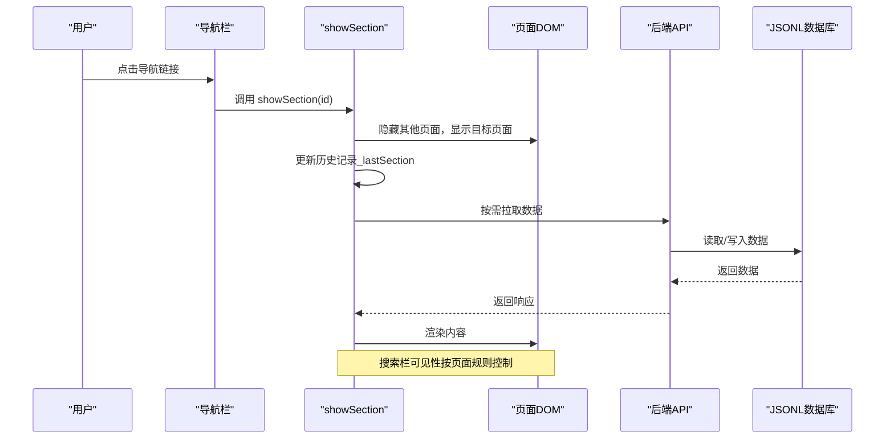
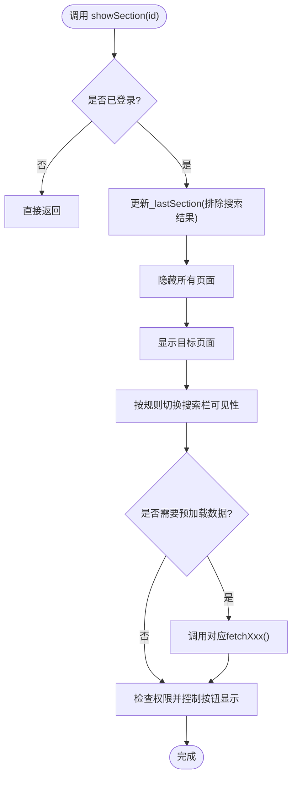
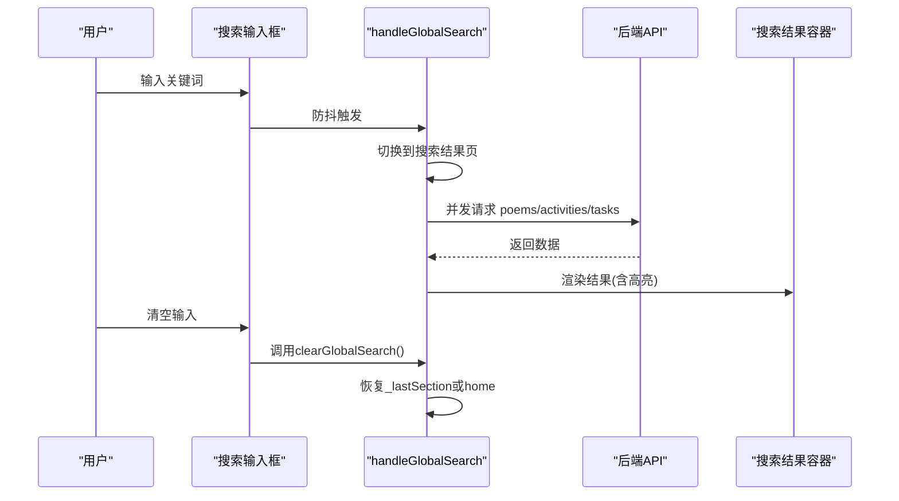
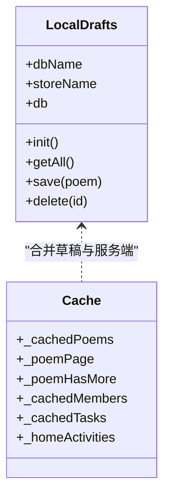
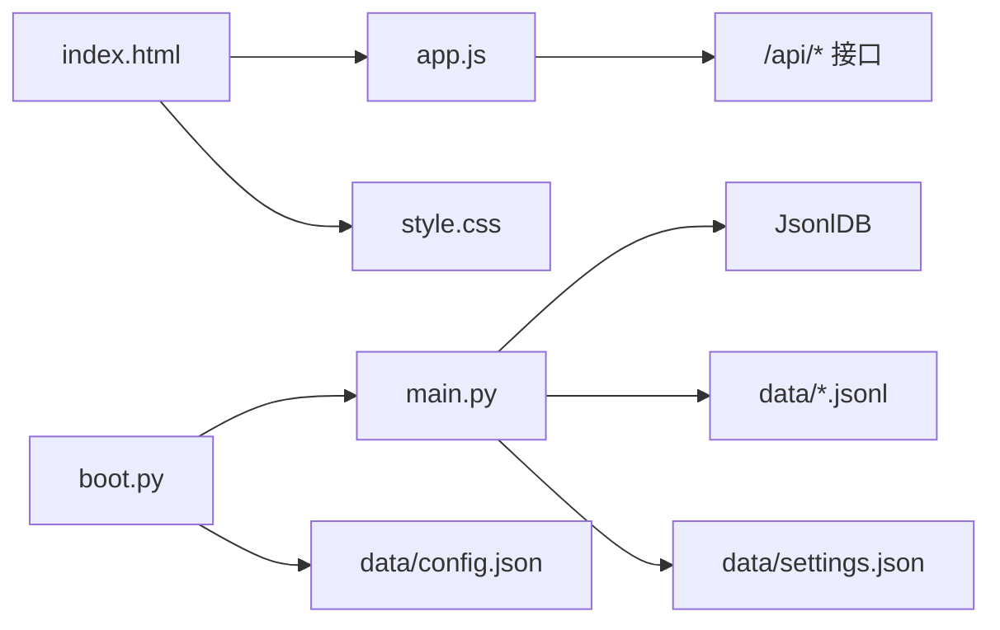

# 页面导航与路由

<cite>
**本文引用的文件**
- [index.html](file://static/index.html)
- [app.js](file://static/app.js)
- [main.py](file://main.py)
- [boot.py](file://boot.py)
- [style.css](file://static/style.css)
- [config.json](file://data/config.json)
- [settings.json](file://data/settings.json)
- [members.jsonl](file://data/members.jsonl)
- [poems.jsonl](file://data/poems.jsonl)
</cite>

## 目录
1. [简介](#简介)
2. [项目结构](#项目结构)
3. [核心组件](#核心组件)
4. [架构总览](#架构总览)
5. [详细组件分析](#详细组件分析)
6. [依赖关系分析](#依赖关系分析)
7. [性能考量](#性能考量)
8. [故障排查指南](#故障排查指南)
9. [结论](#结论)

## 简介
本文件面向“围炉诗社·理事台”项目的前端导航与路由系统，聚焦单页应用（SPA）的页面切换机制、历史记录管理、搜索栏可见性控制、面包屑与返回按钮、权限驱动的导航显示与菜单项动态控制、页面缓存策略、数据预加载与懒加载、导航性能优化与内存管理等主题。文档通过代码级图示与路径引用，帮助开发者与产品人员快速理解系统行为与扩展点。

## 项目结构
该项目采用前后端分离的嵌入式Web方案：
- 前端静态资源位于 static/，包含 HTML、CSS、JS 与图片
- 后端使用 Microdot 提供 HTTP 服务与 API，数据以 JSON Lines 文件形式持久化
- 设备启动流程由 boot.py 负责网络连接与服务启动

图表来源
- [index.html](file://static/index.html#L1-L269)
- [app.js](file://static/app.js#L1-L1312)
- [main.py](file://main.py#L1-L548)
- [boot.py](file://boot.py#L1-L122)
- [config.json](file://data/config.json#L1-L6)
- [settings.json](file://data/settings.json#L1-L1)

章节来源
- [index.html](file://static/index.html#L1-L269)
- [app.js](file://static/app.js#L1-L1312)
- [main.py](file://main.py#L1-L548)
- [boot.py](file://boot.py#L1-L122)

## 核心组件
- 导航与页面切换：基于 showSection 的显隐控制与历史记录跟踪
- 搜索系统：全局搜索输入监听、防抖、并发请求与结果渲染
- 权限控制：根据用户角色动态显示菜单项与操作按钮
- 缓存与懒加载：页面级缓存、分页加载、本地 IndexedDB 草稿
- 数据预加载：进入首页与后台页时自动拉取系统信息与设置
- 面包屑与返回：通过历史栈与搜索结果视图的切换实现

章节来源
- [app.js](file://static/app.js#L109-L147)
- [app.js](file://static/app.js#L1128-L1242)
- [app.js](file://static/app.js#L1244-L1312)
- [main.py](file://main.py#L299-L307)

## 架构总览
前端 SPA 通过事件驱动的 showSection 切换页面，配合全局搜索与权限控制，形成轻量级的单页应用体验。后端提供 REST 风格 API，数据以 JSON Lines 文件存储，支持分页与服务端搜索。

图表来源
- [app.js](file://static/app.js#L109-L147)
- [main.py](file://main.py#L309-L333)

章节来源
- [app.js](file://static/app.js#L109-L147)
- [main.py](file://main.py#L299-L333)

## 详细组件分析

### 导航与页面切换：showSection
- 功能要点
  - 基于 DOM 选择器隐藏/显示页面容器，实现 SPA 切换
  - 维护_lastSection作为历史记录，用于清空搜索后返回上一页
  - 控制全局搜索栏的显示/隐藏（home、activities、poems、tasks、search-results-section）
  - 进入页面时触发对应数据拉取（poems、activities、members、finance、tasks、home/admin）
  - 权限控制：根据角色显示“录入社员/发起活动”等按钮

图表来源
- [app.js](file://static/app.js#L109-L147)

章节来源
- [app.js](file://static/app.js#L109-L147)

### 全局搜索与搜索结果视图
- 输入监听与防抖：500ms 防抖，避免频繁请求
- 并发请求：同时拉取 poems、activities、tasks，提升响应速度
- 结果渲染：按类型分组展示，支持高亮匹配关键词
- 视图切换：当输入非空时强制显示搜索结果页；清空时回到上次页面
- 竞态处理：使用请求序号避免新旧请求混杂

图表来源
- [app.js](file://static/app.js#L1128-L1242)

章节来源
- [app.js](file://static/app.js#L1128-L1242)

### 权限驱动的导航显示与菜单项控制
- 用户角色：super_admin、admin、director、finance、member
- 显示规则
  - 录入社员/发起活动按钮：仅当角色为 super_admin、admin 或 director 时显示
  - 后台管理：仅登录用户可见
  - 普通成员：仅可查看与基础操作
- 实现方式：在 showSection 中根据 currentUser.role 判断，动态设置按钮 display 属性

章节来源
- [app.js](file://static/app.js#L140-L147)
- [members.jsonl](file://data/members.jsonl#L1-L4)

### 页面缓存策略、数据预加载与懒加载
- 页面级缓存
  - Poems：_cachedPoems 存储合并后的服务端与本地草稿列表
  - Members：_cachedMembers 存储成员列表
  - Tasks：_cachedTasks 存储任务列表
  - Home：_homeActivities 存储最近活动
- 预加载
  - 进入 home/admin 自动拉取系统信息与后台设置
  - 进入各页面时按需拉取数据（poems/activities/members/finance/tasks）
- 懒加载
  - Poems：分页加载，Load More 按钮控制下一页
  - Activities：点击卡片打开详情视图，避免一次性渲染全部
- 本地草稿
  - IndexedDB：LocalDrafts 封装，支持保存、读取、删除
  - 首次刷新合并本地草稿与服务端数据，后续仅增量加载

图表来源
- [app.js](file://static/app.js#L6-L58)
- [app.js](file://static/app.js#L155-L161)
- [app.js](file://static/app.js#L165-L212)

章节来源
- [app.js](file://static/app.js#L6-L58)
- [app.js](file://static/app.js#L155-L212)
- [app.js](file://static/app.js#L488-L537)
- [app.js](file://static/app.js#L683-L711)

### 历史记录管理与返回逻辑
- lastSection 记录：每次 showSection 调用时更新（搜索结果页除外），用于清空搜索后返回
- 搜索返回：clearGlobalSearch 优先恢复 lastSection，否则退回 home
- 交互一致性：保证用户在搜索与浏览之间的切换路径清晰

章节来源
- [app.js](file://static/app.js#L107-L115)
- [app.js](file://static/app.js#L1204-L1215)

### 面包屑导航与返回按钮
- 当前实现：页面顶部导航栏提供返回首页与各模块入口；搜索结果页内提供返回上一页的能力
- 建议增强：可在页面头部增加“当前位置”提示与“返回上级”的显式按钮，结合 lastSection 实现更直观的层级导航

章节来源
- [index.html](file://static/index.html#L24-L39)
- [app.js](file://static/app.js#L1204-L1215)

### 登录与会话管理
- 登录流程：前端提交账号密码，后端验证并返回用户信息（不含敏感字段）
- 会话保持：localStorage 存储用户信息，刷新后自动恢复
- 退出登录：清除本地存储并重置界面

章节来源
- [app.js](file://static/app.js#L61-L104)
- [main.py](file://main.py#L485-L502)

### 后端 API 与数据模型
- 前端 API 基础路径：/api
- 主要接口
  - /api/poems: GET 分页查询；POST 新增；/update 更新；/delete 删除
  - /api/activities: GET 分页查询；POST 新增；/update 更新；/delete 删除
  - /api/tasks: GET 获取全部；/complete 完成并计分
  - /api/members: GET 获取全部；POST 新增；/update 更新；/delete 删除
  - /api/finance: GET 获取；POST 新增
  - /api/settings/fields: GET/POST 自定义字段
  - /api/system/info: GET 系统信息
- 数据存储：每个实体对应 data/*.jsonl 文件，采用 JSON Lines 格式，支持按页扫描与全文检索

章节来源
- [main.py](file://main.py#L309-L527)
- [poems.jsonl](file://data/poems.jsonl#L1-L4)
- [members.jsonl](file://data/members.jsonl#L1-L4)

## 依赖关系分析
- 前端依赖
  - app.js 依赖浏览器 fetch 与 IndexedDB（草稿）
  - index.html 依赖 style.css 样式与 app.js 逻辑
- 后端依赖
  - main.py 依赖 Microdot 提供路由与静态文件服务
  - 数据访问通过 JsonlDB 抽象，支持分页与全文检索
  - boot.py 负责网络初始化与服务启动

图表来源
- [app.js](file://static/app.js#L1-L1312)
- [main.py](file://main.py#L1-L548)
- [boot.py](file://boot.py#L1-L122)
- [config.json](file://data/config.json#L1-L6)
- [settings.json](file://data/settings.json#L1-L1)

章节来源
- [app.js](file://static/app.js#L1-L1312)
- [main.py](file://main.py#L1-L548)
- [boot.py](file://boot.py#L1-L122)

## 性能考量
- 请求优化
  - 搜索采用防抖与并发请求，减少网络压力
  - 分页加载与懒加载避免一次性渲染大量数据
- 内存管理
  - 使用局部变量与页面级缓存，避免全局污染
  - IndexedDB 异步操作，避免阻塞主线程
- 交互体验
  - 页面切换带淡入动画，提升感知流畅度
  - 按钮禁用与文案替换，防止重复提交
- 可扩展建议
  - 对高频数据引入 LRU 缓存
  - 对搜索结果增加“空状态占位图”
  - 对移动端优化触摸反馈与字体大小

章节来源
- [app.js](file://static/app.js#L1128-L1242)
- [style.css](file://static/style.css#L83-L86)

## 故障排查指南
- 登录失败
  - 检查账号密码是否正确，确认 data/members.jsonl 中是否存在对应记录
  - 查看浏览器网络面板与后端日志
- 页面空白或切换异常
  - 确认 showSection 是否被调用且已登录
  - 检查对应 fetchXxx() 是否正常返回数据
- 搜索无结果
  - 确认后端 API 支持 q 参数与 limit
  - 检查搜索关键词是否过短或包含特殊字符
- 权限相关问题
  - 确认 currentUser.role 是否正确，按钮显示逻辑是否生效
- 系统信息为空
  - 确认 /api/system/info 能正常返回平台、存储与内存信息

章节来源
- [app.js](file://static/app.js#L75-L98)
- [main.py](file://main.py#L485-L502)
- [main.py](file://main.py#L528-L539)

## 结论
本项目通过轻量的前端 SPA 与简洁的后端 API，实现了围绕“围炉诗社”的高效管理界面。showSection 提供了稳定的页面切换与历史记录管理，全局搜索提升了跨模块检索效率，权限控制确保了不同角色的操作边界。通过页面级缓存、分页与懒加载，系统在有限资源下仍具备良好的性能与可维护性。建议后续在导航层级、搜索结果占位与移动端交互方面进一步优化，以提升整体用户体验。