# Web界面

<cite>
**本文引用的文件**
- [index.html](file://src/static/index.html)
- [style.css](file://src/static/style.css)
- [app.js](file://src/static/app.js)
- [main.py](file://src/main.py)
- [boot.py](file://src/boot.py)
- [config.json](file://src/data/config.json)
- [settings.json](file://src/data/settings.json)
- [WifiConnector.py](file://src/lib/WifiConnector.py)
</cite>

## 更新摘要
**变更内容**
- 新增IndexedDB离线草稿存储功能，支持本地草稿保存与同步
- 增强移动端导航响应式设计，新增汉堡菜单与移动端适配
- 新增积分排行榜界面，显示年度积分排名
- 新增登录日志界面，展示最近20条登录记录
- 新增数据备份与导入功能，支持全站数据迁移
- 新增系统设置管理功能，支持积分名称和密码盐值配置
- 完善管理员界面，增强后台管理能力

## 目录
1. [简介](#简介)
2. [项目结构](#项目结构)
3. [核心组件](#核心组件)
4. [架构总览](#架构总览)
5. [详细组件分析](#详细组件分析)
6. [依赖关系分析](#依赖关系分析)
7. [性能考量](#性能考量)
8. [故障排查指南](#故障排查指南)
9. [结论](#结论)
10. [附录](#附录)

## 简介
本项目为"围炉诗社·理事台"的Web界面与后端服务一体化实现，采用前后端同构部署方案：前端以静态HTML/CSS/JS形式嵌入在ESP32设备上，后端基于Microdot框架提供REST API，数据以JSONL文件持久化存储。Web界面支持响应式布局、用户认证、导航系统、全局搜索、内容管理（藏诗阁、活动、事务、财务、社员）、后台管理（系统信息、自定义字段、积分设置、登录日志）以及本地草稿与IndexedDB离线能力。移动端适配完善，具备良好的交互体验与可扩展性。

## 项目结构
- 前端静态资源位于 `src/static/` 目录：
  - index.html：页面骨架、导航、模态框、各功能区段
  - style.css：主题变量、卡片、表格、网格、导航栏、模态框、统计卡、移动端优化
  - app.js：路由与导航、登录/登出、数据拉取与渲染、全局搜索、模态交互、IndexedDB草稿、权限控制
- 后端服务位于 `src/` 目录：
  - main.py：Microdot应用、路由与API、JSONL数据库封装、系统状态接口
  - boot.py：WiFi连接与AP启动、系统引导
  - data/：配置与设置、JSONL数据文件
  - lib/：WiFi连接工具、系统状态指示等

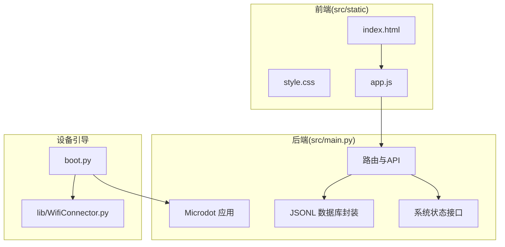

**更新** 静态资源文件已从根目录移动到 `src/static/` 目录，所有前端文件路径均需更新为相对路径 `/static/`

图表来源
- [index.html](file://src/static/index.html#L1-L515)
- [style.css](file://src/static/style.css#L1-L920)
- [app.js](file://src/static/app.js#L1-L2163)
- [main.py](file://src/main.py#L1-L1164)
- [boot.py](file://src/boot.py#L1-L122)
- [WifiConnector.py](file://src/lib/WifiConnector.py#L1-L1930)

章节来源
- [index.html](file://src/static/index.html#L1-L515)
- [style.css](file://src/static/style.css#L1-L920)
- [app.js](file://src/static/app.js#L1-L2163)
- [main.py](file://src/main.py#L1-L1164)
- [boot.py](file://src/boot.py#L1-L122)

## 核心组件
- 用户认证与会话
  - 登录页与登录流程：前端校验输入，调用后端 /api/login，成功后写入localStorage并进入主应用
  - 登出：清除localStorage并回到登录页
- 导航与视图切换
  - 顶部导航栏与侧边内容区，通过 showSection 控制显示隐藏；搜索栏随视图切换显示/隐藏
  - **新增** 移动端汉堡菜单，支持响应式导航切换
- 全局搜索
  - 输入防抖，同时并发请求后端诗歌、活动、事务接口，展示聚合结果
- 内容管理
  - 藏诗阁：支持发布、修订、撤回、草稿（IndexedDB）、分页加载
  - 活动：发起、编辑、查看、删除
  - 财务：记账、收支统计
  - 事务：任务列表、认领完成、积分奖励
  - 社员：录入、编辑、删除、自定义字段
  - 后台：系统信息（平台、存储、内存）、自定义字段管理、积分设置、登录日志、数据备份
- 权限控制
  - 不同角色显示不同按钮（录入、编辑、删除）
- 积分管理
  - 年度积分排行榜：显示最近一年新增积分排名
  - 积分名称自定义：支持修改积分名称
- 日志管理
  - 登录日志：展示最近20条登录记录，支持成功/失败状态
- **新增** 离线草稿管理
  - IndexedDB本地存储：支持草稿保存、同步与恢复
  - 草稿状态标识：本地草稿显示橙色左侧标记
- **新增** 数据备份与恢复
  - 全站数据导出：包含成员、作品、活动、事务、财务、积分日志、登录日志、设置等
  - 数据导入：支持从备份文件恢复全站数据

章节来源
- [app.js](file://src/static/app.js#L107-L161)
- [app.js](file://src/static/app.js#L166-L204)
- [app.js](file://src/static/app.js#L46-L104)
- [app.js](file://src/static/app.js#L1556-L1595)
- [app.js](file://src/static/app.js#L1930-L1960)
- [app.js](file://src/static/app.js#L2083-L2162)
- [main.py](file://src/main.py#L797-L836)
- [main.py](file://src/main.py#L875-L880)
- [main.py](file://src/main.py#L1049-L1155)

## 架构总览
前端通过 fetch 与后端API通信，后端以Microdot提供路由，数据持久化采用JSONL文件，系统状态通过 /api/system/info 返回。设备启动时通过 boot.py 连接WiFi或创建AP，然后启动HTTP服务。

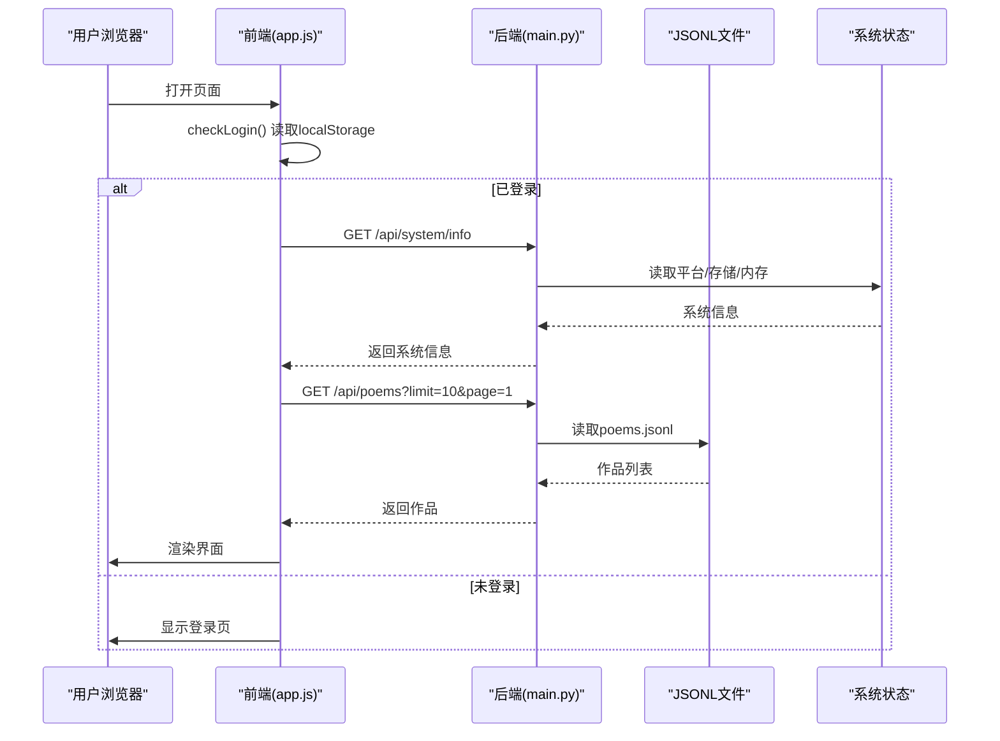

**更新** 所有静态资源路径已更新为 `/static/` 前缀

图表来源
- [app.js](file://src/static/app.js#L107-L161)
- [main.py](file://src/main.py#L1005-L1023)
- [main.py](file://src/main.py#L378-L402)

## 详细组件分析

### 用户认证与会话
- 登录流程
  - 前端收集手机号与密码，POST /api/login
  - 成功后将用户信息写入 localStorage，切换到主应用并加载自定义字段
- 登出流程
  - 清除 localStorage 并回到登录页
- 权限控制
  - 导航按钮根据角色显示（super_admin/admin/director）

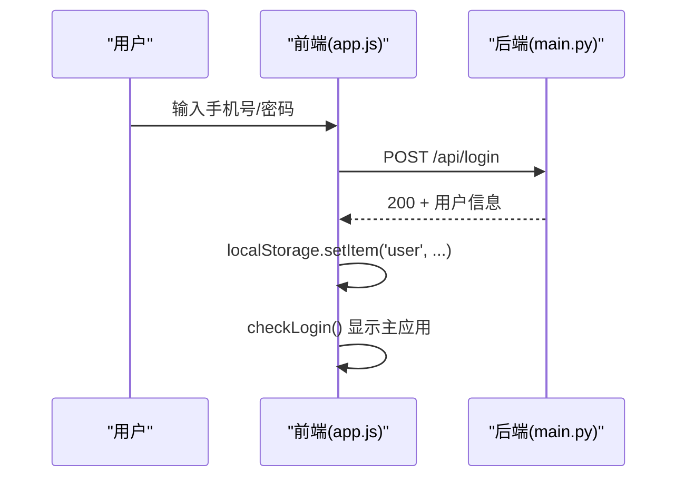

**更新** 所有静态资源路径已更新为 `/static/` 路径

图表来源
- [app.js](file://src/static/app.js#L132-L155)
- [main.py](file://src/main.py#L838-L860)

章节来源
- [app.js](file://src/static/app.js#L107-L161)
- [main.py](file://src/main.py#L838-L860)

### 导航与视图切换
- showSection 控制各 section 的显示/隐藏
- 搜索栏仅在 home、activities、poems、tasks、search-results-section 显示
- 进入各 section 自动触发对应数据拉取
- **新增** 移动端汉堡菜单：通过 toggleMobileMenu() 和 closeMobileMenu() 控制导航展开/收起

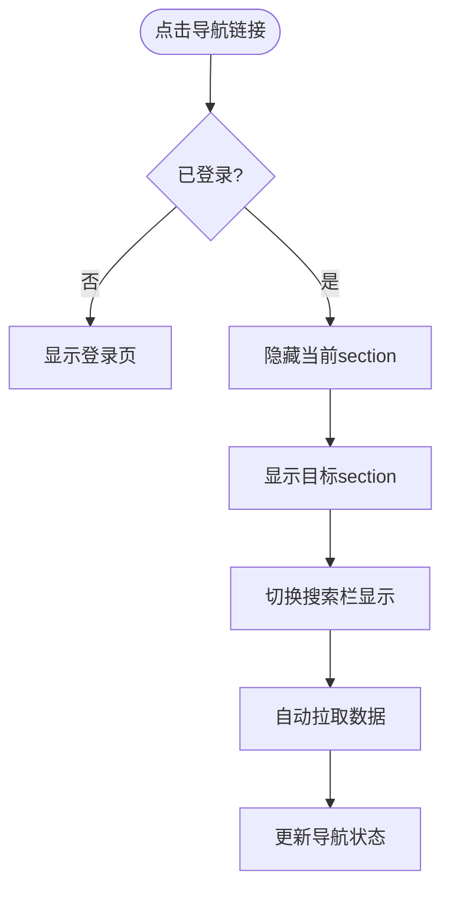

**更新** 新增移动端导航响应式设计

图表来源
- [app.js](file://src/static/app.js#L218-L256)
- [app.js](file://src/static/app.js#L8-L20)

章节来源
- [app.js](file://src/static/app.js#L218-L256)
- [index.html](file://src/static/index.html#L22-L42)

### 全局搜索
- 防抖 500ms，同时请求 /api/poems、/api/activities、/api/tasks
- 结果高亮匹配关键词，点击跳转到相应详情或编辑弹窗
- 支持清空搜索并回到上次浏览的页面

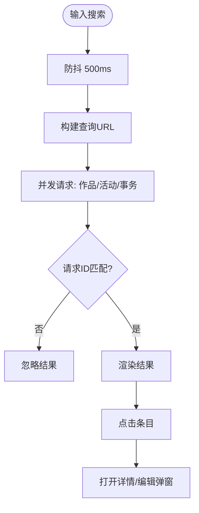

**更新** 所有静态资源路径已更新为 `/static/` 路径

图表来源
- [app.js](file://src/static/app.js#L1534-L1607)

章节来源
- [app.js](file://src/static/app.js#L1514-L1621)

### 藏诗阁（Poems）
- 分页加载：每页10条，支持"加载更多"
- 本地草稿：首次刷新合并本地 IndexedDB 草稿，草稿条目带橙色左侧标记
- 发布/修订/撤回：发布时可选择是否从草稿删除；撤回将作品移回本地草稿
- 类型标签样式区分不同体裁

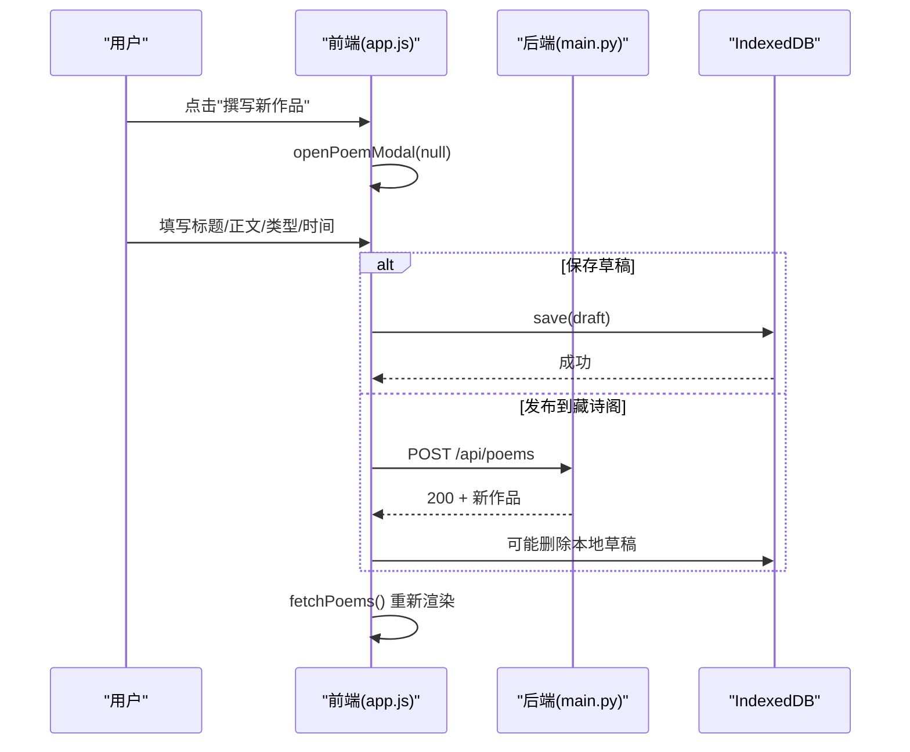

**更新** 新增IndexedDB离线草稿存储功能

图表来源
- [app.js](file://src/static/app.js#L46-L104)
- [app.js](file://src/static/app.js#L406-L590)
- [main.py](file://src/main.py#L404-L415)

章节来源
- [app.js](file://src/static/app.js#L222-L277)
- [app.js](file://src/static/app.js#L406-L590)
- [main.py](file://src/main.py#L378-L415)

### 活动（Activities）
- 发起/编辑：弹窗收集主题、详情、时间、地点、状态
- 查看详情：只读弹窗，支持编辑/删除（管理员）
- 删除：调用 /api/activities/delete

章节来源
- [app.js](file://src/static/app.js#L1178-L1206)
- [app.js](file://src/static/app.js#L1125-L1154)
- [main.py](file://src/main.py#L442-L478)

### 财务（Finance）
- 记账：类型（收入/支出）、金额、摘要、经办人、日期
- 统计：总收入、总支出、结余，表格展示明细

章节来源
- [app.js](file://src/static/app.js#L720-L752)
- [app.js](file://src/static/app.js#L772-L804)
- [main.py](file://src/main.py#L862-L873)

### 事务（Tasks）
- 列表：标题、描述、奖励积分
- 认领完成：POST /api/tasks/complete，完成后给积分

章节来源
- [app.js](file://src/static/app.js#L806-L898)
- [main.py](file://src/main.py#L480-L677)

### 社员（Members）
- 录入/编辑：姓名、雅号、手机号、初始密码、角色、初始积分
- 删除：仅超级管理员可删除
- 自定义字段：从后端设置项加载，渲染到录入/编辑弹窗

章节来源
- [app.js](file://src/static/app.js#L595-L770)
- [main.py](file://src/main.py#L691-L795)
- [settings.json](file://src/data/settings.json#L1-L5)

### 后台管理（Admin）
- 系统信息：平台、总存储、剩余存储、空闲内存
- 自定义字段管理：增删字段定义，保存到后端设置
- 系统设置：积分名称、密码盐值配置
- 登录日志：最近20条登录记录，支持成功/失败状态
- 数据维护：密码安全迁移（将明文密码转换为哈希存储）
- **新增** 数据备份：导出全站数据备份，支持灾难恢复
- **新增** WiFi配置：支持STA和AP模式配置

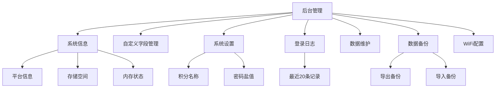

**更新** 新增登录日志界面、数据备份、WiFi配置等功能

图表来源
- [app.js](file://src/static/app.js#L1930-L1960)
- [app.js](file://src/static/app.js#L2083-L2162)
- [main.py](file://src/main.py#L875-L880)
- [main.py](file://src/main.py#L1049-L1155)

章节来源
- [app.js](file://src/static/app.js#L83-L154)
- [app.js](file://src/static/app.js#L1930-L1960)
- [main.py](file://src/main.py#L1005-L1047)
- [main.py](file://src/main.py#L875-L912)

### 积分管理与排行榜
- 年度积分排行榜：计算最近一年的积分变动，显示前10名
- 积分名称自定义：支持修改积分名称，动态更新界面显示
- 积分日志：记录积分变动历史

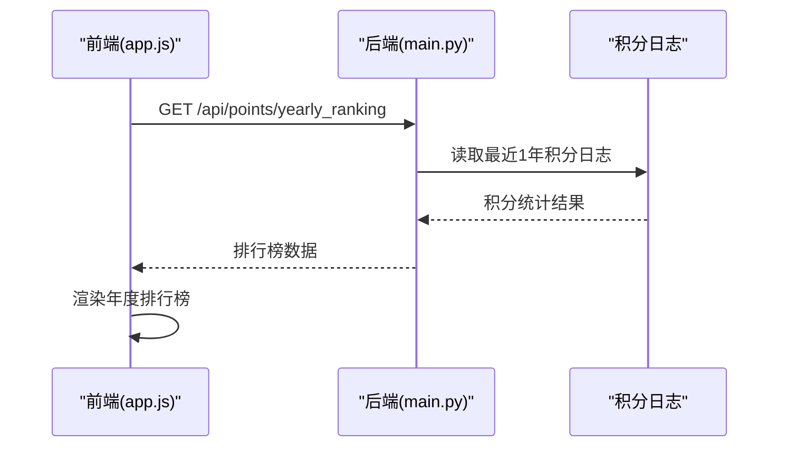

**更新** 新增积分排行榜功能

图表来源
- [app.js](file://src/static/app.js#L1556-L1595)
- [main.py](file://src/main.py#L797-L836)

章节来源
- [app.js](file://src/static/app.js#L1556-L1595)
- [main.py](file://src/main.py#L797-L836)

### 登录日志管理
- 登录记录：展示最近20条登录记录，包含用户信息、时间、状态
- 日志清理：自动保留最近100条记录，超出数量自动清理
- 状态标识：成功/失败状态使用不同颜色标识

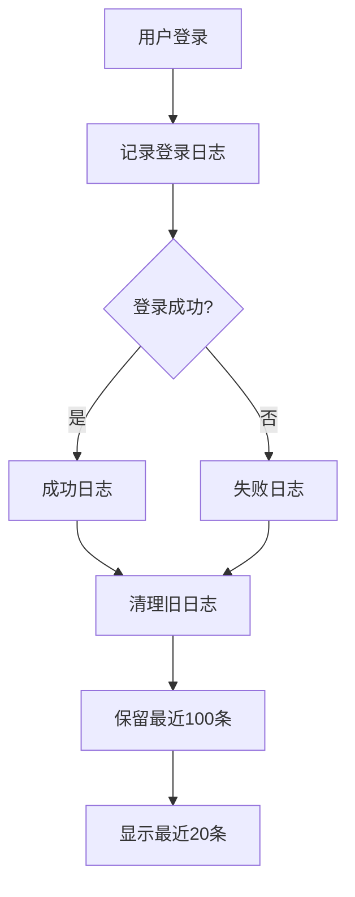

**更新** 新增登录日志功能

图表来源
- [app.js](file://src/static/app.js#L1930-L1960)
- [main.py](file://src/main.py#L312-L336)

章节来源
- [app.js](file://src/static/app.js#L1930-L1960)
- [main.py](file://src/main.py#L312-L336)

### 数据备份与恢复
- 全站数据导出：包含成员、作品、活动、事务、财务、积分日志、登录日志、设置等
- 数据导入：支持从备份文件恢复全站数据
- 安全考虑：导出时隐藏WiFi密码，导入时保留原有密码

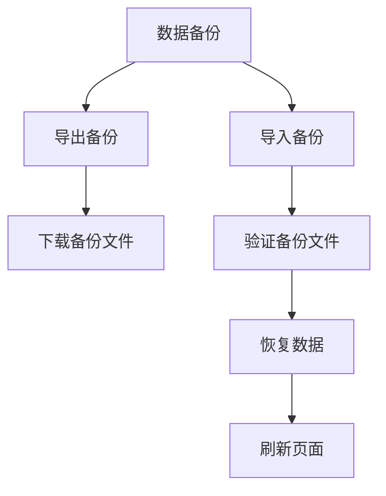

**更新** 新增数据备份与导入功能

图表来源
- [app.js](file://src/static/app.js#L2083-L2162)
- [main.py](file://src/main.py#L1049-L1155)

章节来源
- [app.js](file://src/static/app.js#L2083-L2162)
- [main.py](file://src/main.py#L1049-L1155)

### IndexedDB离线草稿存储
- 本地草稿管理：支持草稿保存、同步与恢复
- 草稿状态标识：本地草稿显示橙色左侧标记
- 数据同步：发布时自动删除本地草稿，撤回时自动保存为本地草稿

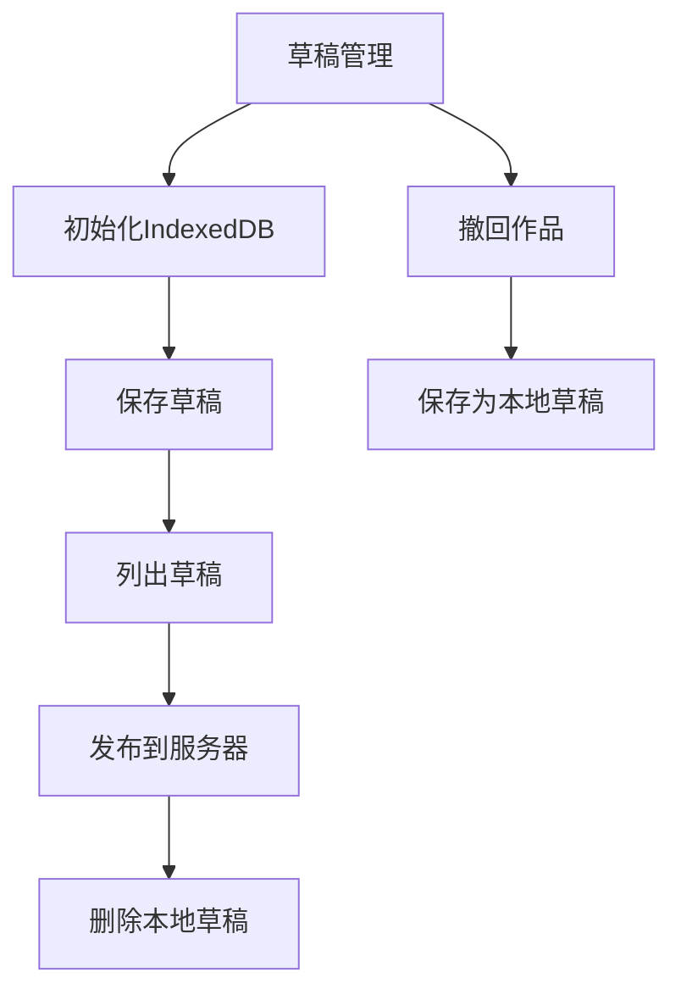

**更新** 新增IndexedDB离线草稿存储功能

图表来源
- [app.js](file://src/static/app.js#L46-L104)
- [app.js](file://src/static/app.js#L450-L590)

章节来源
- [app.js](file://src/static/app.js#L46-L104)
- [app.js](file://src/static/app.js#L450-L590)

### 样式系统与主题
- CSS变量主题：--primary、--accent、--bg、--card-bg、--text、--text-muted、--border、--radius、--shadow
- 卡片、表格、网格、导航栏、模态框、统计卡、任务项、成员卡片等组件化样式
- 移动端优化：导航横向滚动、统计卡换行、字体放大、间距调整
- 响应式设计增强：优化移动端交互体验

**更新** 增强响应式设计和主题系统

章节来源
- [style.css](file://src/static/style.css#L1-L12)
- [style.css](file://src/static/style.css#L25-L86)
- [style.css](file://src/static/style.css#L107-L149)
- [style.css](file://src/static/style.css#L150-L166)
- [style.css](file://src/static/style.css#L167-L184)
- [style.css](file://src/static/style.css#L185-L221)
- [style.css](file://src/static/style.css#L222-L250)
- [style.css](file://src/static/style.css#L251-L303)
- [style.css](file://src/static/style.css#L304-L315)
- [style.css](file://src/static/style.css#L316-L326)
- [style.css](file://src/static/style.css#L327-L385)

### 响应式设计与交互模式
- 视口设置与缩放限制，防止双指缩放
- 导航栏吸顶、模糊背景、阴影
- 模态框毛玻璃效果、滑入动画
- 表单统一圆角、焦点高亮、自定义下拉箭头
- 移动端导航横向滚动、统计卡换行、输入字号放大
- **新增** 汉堡菜单：移动端专用导航按钮，支持展开/收起
- **新增** 移动端菜单样式：统一的移动端导航样式和交互体验

**更新** 响应式设计进一步优化，新增移动端导航功能

章节来源
- [index.html](file://src/static/index.html#L4-L6)
- [style.css](file://src/static/style.css#L25-L36)
- [style.css](file://src/static/style.css#L540-L723)
- [style.css](file://src/static/style.css#L127-L135)
- [style.css](file://src/static/style.css#L327-L385)

## 依赖关系分析

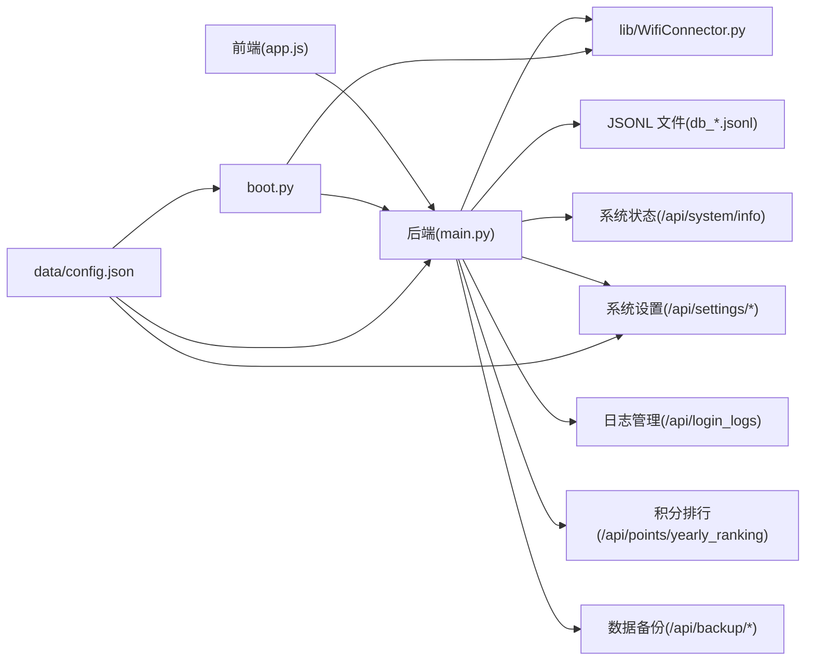

**更新** 所有静态资源路径已更新为 `/static/` 路径

图表来源
- [app.js](file://src/static/app.js#L1-L10)
- [main.py](file://src/main.py#L369-L376)
- [boot.py](file://src/boot.py#L14-L21)
- [config.json](file://src/data/config.json#L1-L6)

章节来源
- [main.py](file://src/main.py#L369-L376)
- [boot.py](file://src/boot.py#L14-L21)

## 性能考量
- 前端
  - 防抖搜索减少请求压力
  - IndexedDB本地草稿避免重复网络请求
  - 分页加载与"加载更多"降低一次性渲染成本
  - 响应式设计优化移动端性能
  - **新增** IndexedDB异步操作，避免阻塞主线程
- 后端
  - JSONL数据库按页扫描，支持倒序与全文检索（慢路径）
  - 系统状态接口轻量，仅读取文件系统与内存信息
  - 登录日志自动清理，控制数据量大小
  - 积分排行计算优化，仅统计最近一年数据
  - **新增** 备份导出时进行垃圾回收，释放内存
- 移动端
  - 字体放大、触摸友好尺寸、横向滚动导航
  - 模态框动画与过渡优化交互体验
  - 响应式布局自动适配不同屏幕尺寸
  - **新增** 移动端菜单切换优化，减少DOM操作

## 故障排查指南
- 登录失败
  - 检查 /api/login 返回的错误信息；确认手机号与密码与后端成员记录一致
- 页面空白或导航异常
  - 检查 localStorage 是否存在 user；若不存在，前端会回到登录页
- 搜索无结果
  - 确认后端 /api/poems 与 /api/activities 的 q 查询参数是否正确传递
- 财务记账失败
  - 检查金额与摘要是否填写；后端对金额与摘要进行校验
- 事务完成无积分
  - 确认 /api/tasks/complete 请求成功，后端会同步更新成员积分
- 设备无法联网
  - 检查 data/config.json 中的 WiFi 配置；若配置为默认值，设备将进入AP模式
  - 通过 boot.py 的 WiFi 连接逻辑与 lib/WifiConnector.py 的状态诊断
- 积分排行榜为空
  - 检查 /api/points/yearly_ranking 接口是否正常返回数据
  - 确认积分日志数据是否存在且格式正确
- 登录日志显示异常
  - 检查 /api/login_logs 接口是否正常工作
  - 确认日志文件是否正确生成和清理
- **新增** IndexedDB草稿存储问题
  - 检查浏览器是否支持IndexedDB；确认数据库版本升级是否成功
  - 确认草稿数据格式是否正确，本地草稿ID生成是否正常
- **新增** 数据备份失败
  - 检查备份文件格式是否正确，确认导入时的数据完整性
  - 确认服务器是否有足够磁盘空间进行数据恢复

章节来源
- [app.js](file://src/static/app.js#L132-L155)
- [app.js](file://src/static/app.js#L1534-L1607)
- [app.js](file://src/static/app.js#L772-L804)
- [app.js](file://src/static/app.js#L806-L898)
- [boot.py](file://src/boot.py#L22-L64)
- [config.json](file://src/data/config.json#L1-L6)
- [WifiConnector.py](file://src/lib/WifiConnector.py#L595-L696)

## 结论
本Web界面以简洁的主题、清晰的导航与完善的权限控制为核心，结合后端的JSONL数据模型与系统状态接口，实现了从内容创作到事务管理的全链路闭环。新增的积分排行榜、登录日志、数据备份和IndexedDB离线草稿功能进一步增强了系统的管理能力和用户体验，响应式设计优化提升了移动端用户体验。前端通过IndexedDB提供草稿能力，后端通过Microdot提供稳定API，设备引导层负责网络连接与AP模式，整体架构清晰、易于扩展与维护。

## 附录

### API一览（节选）
- GET /api/poems?page=&limit=&q=
- POST /api/poems
- POST /api/poems/update
- POST /api/poems/delete
- GET /api/activities?page=&limit=&q=
- POST /api/activities
- POST /api/activities/update
- POST /api/activities/delete
- GET /api/tasks
- POST /api/tasks/complete
- GET /api/members
- POST /api/members
- POST /api/members/update
- POST /api/members/delete
- POST /api/login
- GET /api/finance
- POST /api/finance
- GET /api/settings/fields
- POST /api/settings/fields
- GET /api/settings/system
- POST /api/settings/system
- GET /api/points/yearly_ranking
- GET /api/login_logs
- POST /api/migrate_passwords
- GET /api/system/info
- **新增** GET /api/backup/export
- **新增** POST /api/backup/import
- **新增** GET /api/wifi/config
- **新增** POST /api/wifi/config

**更新** 新增积分排行、登录日志、系统设置、备份导入导出、WiFi配置等相关API

章节来源
- [main.py](file://src/main.py#L378-L1155)

### 主题与定制化
- CSS变量：通过修改 :root 变量即可更换主色、强调色、背景与卡片色
- 组件样式：卡片、表格、网格、导航、模态框均有独立类名，便于局部覆盖
- 主题切换建议：可引入暗色变量并在 :root 中切换；或通过外部样式文件覆盖
- 响应式设计：自动适配不同屏幕尺寸，优化移动端体验

**更新** 增强响应式设计和主题系统

章节来源
- [style.css](file://src/static/style.css#L1-L12)
- [style.css](file://src/static/style.css#L88-L95)
- [style.css](file://src/static/style.css#L177-L184)

### 移动端适配
- 视口与缩放限制
- 导航栏吸顶与模糊背景
- 模态框滑入动画与毛玻璃效果
- 统计卡换行、输入字号放大、网格列数自适应
- **新增** 汉堡菜单：移动端专用导航按钮，支持展开/收起
- **新增** 移动端菜单样式：统一的移动端导航样式和交互体验
- 响应式布局优化，提升移动端交互体验

**更新** 响应式设计进一步优化，新增移动端导航功能

章节来源
- [index.html](file://src/static/index.html#L4-L6)
- [style.css](file://src/static/style.css#L25-L36)
- [style.css](file://src/static/style.css#L540-L723)
- [style.css](file://src/static/style.css#L327-L385)