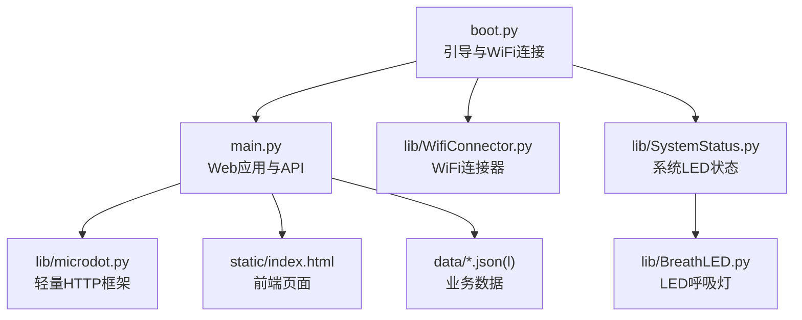
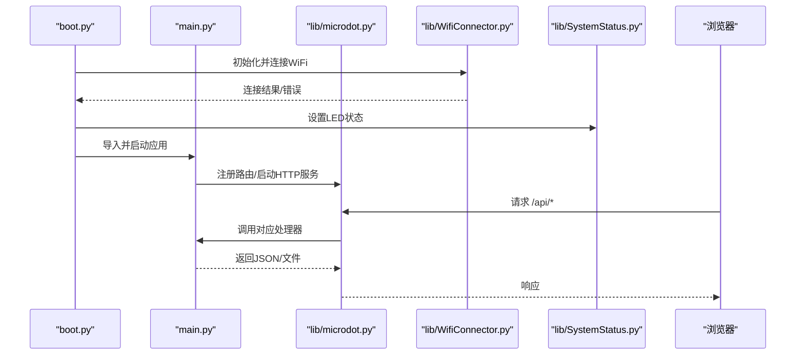
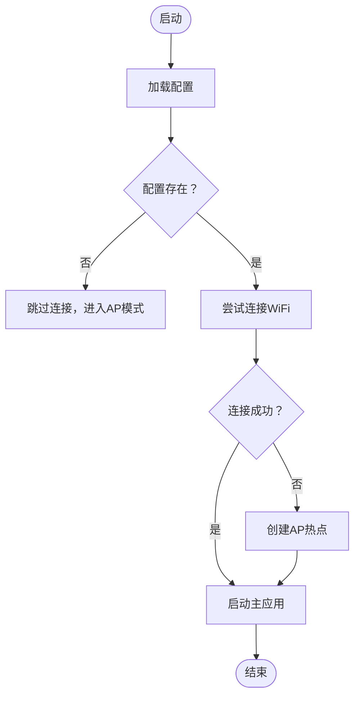
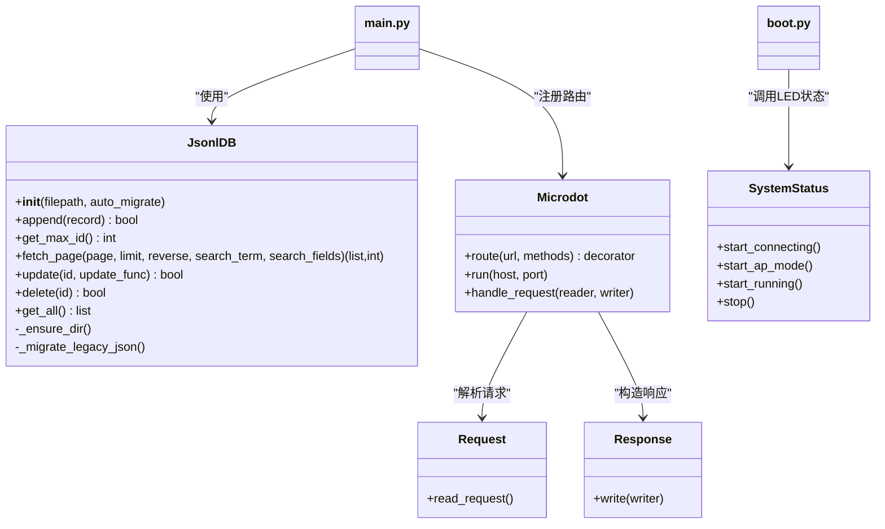
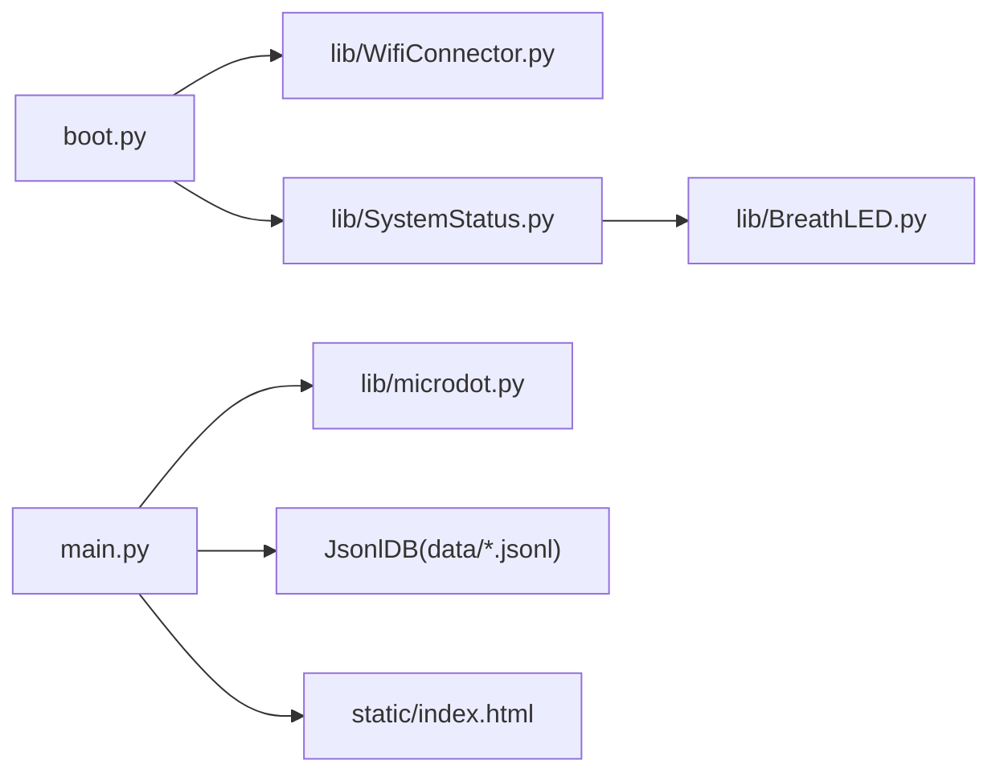

# 代码规范

<cite>
**本文引用的文件**
- [boot.py](file://boot.py)
- [main.py](file://main.py)
- [lib/microdot.py](file://lib/microdot.py)
- [lib/BreathLED.py](file://lib/BreathLED.py)
- [lib/WifiConnector.py](file://lib/WifiConnector.py)
- [lib/SystemStatus.py](file://lib/SystemStatus.py)
- [lib/breath_led_example.py](file://lib/breath_led_example.py)
- [lib/wifi_connector_example.py](file://lib/wifi_connector_example.py)
- [static/index.html](file://static/index.html)
- [data/config.json](file://data/config.json)
- [data/settings.json](file://data/settings.json)
- [data/members.jsonl](file://data/members.jsonl)
</cite>

## 目录
1. [简介](#简介)
2. [项目结构](#项目结构)
3. [核心组件](#核心组件)
4. [架构总览](#架构总览)
5. [详细组件分析](#详细组件分析)
6. [依赖分析](#依赖分析)
7. [性能考虑](#性能考虑)
8. [故障排查指南](#故障排查指南)
9. [结论](#结论)
10. [附录](#附录)

## 简介
本指南面向“围炉诗社·理事台”项目，制定Python（MicroPython）代码规范与最佳实践，覆盖命名约定、缩进与注释、模块组织、函数与类设计、异常处理、嵌入式Python特有注意事项（内存管理、性能优化、资源限制）、以及代码审查清单与质量检查标准。文档以仓库现有实现为依据，结合嵌入式与Web服务场景，给出可操作的规范与图示。

## 项目结构
项目采用“根目录 + 分层模块”的组织方式：
- 根目录：引导与应用入口（boot.py、main.py）
- lib：可复用的嵌入式组件（微Web框架、LED呼吸灯、WiFi连接器、系统状态指示）
- static：前端静态资源（HTML/CSS/JS）
- data：运行期数据与配置（JSON/JSONL）

图表来源
- [boot.py](file://boot.py#L1-L122)
- [main.py](file://main.py#L1-L548)
- [lib/microdot.py](file://lib/microdot.py#L1-L183)
- [lib/WifiConnector.py](file://lib/WifiConnector.py#L1-L800)
- [lib/SystemStatus.py](file://lib/SystemStatus.py#L1-L61)
- [lib/BreathLED.py](file://lib/BreathLED.py#L1-L633)
- [static/index.html](file://static/index.html#L1-L269)
- [data/config.json](file://data/config.json#L1-L6)

章节来源
- [boot.py](file://boot.py#L1-L122)
- [main.py](file://main.py#L1-L548)

## 核心组件
- 引导与连接：boot.py负责CPU频率设置、WiFi连接与AP降级、导入并启动主应用。
- Web应用：main.py提供路由、API控制器、JSONL数据库封装、系统状态查询。
- 轻量HTTP框架：lib/microdot.py实现请求解析、响应写入、路由注册与异步处理。
- 系统LED：lib/SystemStatus.py封装呼吸灯周期与状态指示。
- LED呼吸灯：lib/BreathLED.py提供WS2812与普通LED的呼吸效果控制。
- WiFi连接器：lib/WifiConnector.py提供扫描、连接、重连、热点、静态IP等能力。

章节来源
- [boot.py](file://boot.py#L1-L122)
- [main.py](file://main.py#L1-L548)
- [lib/microdot.py](file://lib/microdot.py#L1-L183)
- [lib/SystemStatus.py](file://lib/SystemStatus.py#L1-L61)
- [lib/BreathLED.py](file://lib/BreathLED.py#L1-L633)
- [lib/WifiConnector.py](file://lib/WifiConnector.py#L1-L800)

## 架构总览
系统由引导层、Web应用层、嵌入式组件层与前端层组成。引导层负责网络与LED状态；Web应用层提供REST风格API与静态资源；嵌入式组件层提供硬件抽象与网络管理；前端层提供交互界面。

图表来源
- [boot.py](file://boot.py#L1-L122)
- [main.py](file://main.py#L1-L548)
- [lib/microdot.py](file://lib/microdot.py#L1-L183)
- [lib/WifiConnector.py](file://lib/WifiConnector.py#L1-L800)
- [lib/SystemStatus.py](file://lib/SystemStatus.py#L1-L61)

## 详细组件分析

### 组件一：引导与连接（boot.py）
- 职责：设置CPU频率、加载配置、连接WiFi、失败时进入AP模式、启动主应用。
- 关键流程：加载配置 -> 连接WiFi（带重试）-> 成功则运行主应用，失败则创建AP -> 启动LED状态指示。
- 异常处理：捕获配置加载与连接异常，打印错误并降级至AP模式。
- 资源管理：导入main后触发LED状态更新，最后清理异常。

图表来源
- [boot.py](file://boot.py#L14-L98)

章节来源
- [boot.py](file://boot.py#L1-L122)

### 组件二：Web应用与API（main.py）
- 职责：定义路由、提供API、封装JSONL数据库、提供系统信息查询。
- 数据模型：JsonlDB封装追加、查询、更新、删除、迁移旧格式。
- API设计：GET/POST混合，参数校验与异常捕获，返回JSON或文件。
- 资源管理：使用gc与os.stat，避免大文件一次性加载。

图表来源
- [main.py](file://main.py#L53-L267)
- [lib/microdot.py](file://lib/microdot.py#L5-L183)
- [lib/SystemStatus.py](file://lib/SystemStatus.py#L19-L61)

章节来源
- [main.py](file://main.py#L1-L548)

### 组件三：轻量HTTP框架（lib/microdot.py）
- 设计要点：Request/Response/微Web框架三件套，支持JSON解析、文件发送、协程/生成器处理。
- 处理流程：读取请求头与体 -> 匹配路由 -> 调用处理器 -> 序列化响应 -> 写入socket。
- 错误处理：异常转为500，连接异常静默处理。

章节来源
- [lib/microdot.py](file://lib/microdot.py#L1-L183)

### 组件四：系统LED状态（lib/SystemStatus.py）
- 设计要点：单LED模式（GPIO15），三种呼吸周期映射不同状态。
- 优化：降低更新间隔与除数，平衡效果与CPU占用。

章节来源
- [lib/SystemStatus.py](file://lib/SystemStatus.py#L1-L61)

### 组件五：LED呼吸灯（lib/BreathLED.py）
- 设计要点：WS2812与普通LED双支持，正弦查找表、定时器回调、动态参数调整。
- 生命周期：构造校验 -> 硬件初始化 -> 启动/按次/停止/清理。
- 安全性：异常捕获与自动停止，析构清理。

章节来源
- [lib/BreathLED.py](file://lib/BreathLED.py#L1-L633)

### 组件六：WiFi连接器（lib/WifiConnector.py）
- 设计要点：扫描、连接、重连、断开、热点、静态IP、诊断。
- 稳定性：超时、重试、错误状态映射、自动同步网络信息。

章节来源
- [lib/WifiConnector.py](file://lib/WifiConnector.py#L1-L800)

## 依赖分析
- 模块耦合：boot.py依赖WifiConnector与SystemStatus；main.py依赖microdot与JsonlDB；SystemStatus依赖BreathLED。
- 外部依赖：machine、network、uasyncio、neopixel、ubinascii、ujson等MicroPython标准库与扩展。
- 资源约束：Timer/PWM/文件IO/网络栈均需谨慎使用，避免阻塞与资源泄漏。

图表来源
- [boot.py](file://boot.py#L1-L122)
- [main.py](file://main.py#L1-L548)
- [lib/microdot.py](file://lib/microdot.py#L1-L183)
- [lib/WifiConnector.py](file://lib/WifiConnector.py#L1-L800)
- [lib/SystemStatus.py](file://lib/SystemStatus.py#L1-L61)
- [lib/BreathLED.py](file://lib/BreathLED.py#L1-L633)
- [static/index.html](file://static/index.html#L1-L269)
- [data/config.json](file://data/config.json#L1-L6)

章节来源
- [boot.py](file://boot.py#L1-L122)
- [main.py](file://main.py#L1-L548)

## 性能考虑
- CPU频率：引导阶段设置为240MHz，提升处理能力。
- 内存管理：频繁使用gc.collect()，减少碎片；避免一次性加载大文件。
- I/O优化：JSONL按行读写，分页扫描；静态文件直接流式发送。
- 网络优化：连接超时与重试策略；热点IP自定义；静态IP与DHCP动态切换。
- LED优化：正弦查找表、最小更新间隔、定时器兼容不同平台。

章节来源
- [boot.py](file://boot.py#L8-L9)
- [main.py](file://main.py#L279-L293)
- [lib/microdot.py](file://lib/microdot.py#L166-L183)
- [lib/WifiConnector.py](file://lib/WifiConnector.py#L315-L375)
- [lib/SystemStatus.py](file://lib/SystemStatus.py#L16-L17)

## 故障排查指南
- WiFi连接失败
  - 检查配置文件与密码长度；查看连接状态码与错误信息；必要时重置WiFi模块。
  - 参考：连接超时、错误状态映射、重连与断开流程。
- LED不工作
  - 确认引脚与类型；检查定时器创建兼容性；异常时自动停止并清理。
- Web服务无响应
  - 检查路由注册与处理器返回；确认异常被捕获并返回500；检查文件是否存在。
- 资源泄漏
  - 确保stop/cleanup调用；Timer/PWM/文件句柄及时deinit/close。

章节来源
- [lib/WifiConnector.py](file://lib/WifiConnector.py#L315-L375)
- [lib/BreathLED.py](file://lib/BreathLED.py#L170-L190)
- [lib/microdot.py](file://lib/microdot.py#L133-L151)
- [main.py](file://main.py#L541-L548)

## 结论
本项目在嵌入式环境下实现了稳定的Web服务与硬件控制，遵循“模块化、资源可控、异常显式”的设计原则。建议在后续迭代中进一步完善单元测试、日志分级与配置热加载，以提升可维护性与可扩展性。

## 附录

### Python代码风格与命名规范
- 缩进与空行
  - 使用4空格缩进；函数/类之间保留空行；模块内逻辑分段清晰。
- 命名约定
  - 模块名：小写、下划线分隔（如lib/microdot.py）
  - 类名：PascalCase（如JsonlDB、Microdot、WifiConnector、BreathLED）
  - 函数/方法：snake_case（如connect、fetch_page、update）
  - 常量：UPPER_CASE（如DEFAULT_*、LED_TYPE_*）
  - 私有成员：_private（如_update_led、_validate_init_parameters）
- 注释与文档
  - 模块顶部提供简要说明；复杂函数/类提供docstring；关键逻辑添加行内注释。
  - 嵌入式注释强调资源限制与异常路径。

章节来源
- [lib/microdot.py](file://lib/microdot.py#L1-L183)
- [lib/BreathLED.py](file://lib/BreathLED.py#L1-L633)
- [lib/WifiConnector.py](file://lib/WifiConnector.py#L1-L800)

### 模块组织与文件结构规范
- lib：嵌入式组件与工具类，按功能拆分，避免跨模块循环依赖。
- static：前端资源，路径与main.py路由一致。
- data：运行期数据与配置，JSON/JSONL分离，提供迁移与容错。
- 根目录：引导与应用入口，职责单一，尽量减少全局副作用。

章节来源
- [boot.py](file://boot.py#L1-L122)
- [main.py](file://main.py#L1-L548)
- [static/index.html](file://static/index.html#L1-L269)
- [data/config.json](file://data/config.json#L1-L6)
- [data/settings.json](file://data/settings.json#L1-L1)
- [data/members.jsonl](file://data/members.jsonl#L1-L4)

### 函数与类设计规范
- 参数传递
  - 必填参数在前，可选参数提供默认值；对敏感参数（密码）进行长度与类型校验。
- 返回值处理
  - 明确返回类型与语义；错误时返回错误码或异常；API统一返回JSON或文件。
- 异常处理
  - 局部捕获并记录；向上抛出前转换为可读错误；避免吞掉异常。
- 类设计
  - 构造函数只做参数校验与初始化；生命周期方法明确（start/stop/cleanup）；提供状态查询接口。

章节来源
- [main.py](file://main.py#L309-L370)
- [lib/BreathLED.py](file://lib/BreathLED.py#L94-L169)
- [lib/WifiConnector.py](file://lib/WifiConnector.py#L315-L375)

### 嵌入式Python特有注意事项
- 内存管理
  - 频繁触发gc.collect()；避免大对象驻留；及时释放文件句柄与定时器。
- 性能优化
  - 使用正弦查找表、最小更新间隔；合理设置CPU频率；避免阻塞式I/O。
- 资源限制
  - Timer/PWM/Socket数量有限；注意平台差异；异常时自动清理。

章节来源
- [boot.py](file://boot.py#L8-L9)
- [main.py](file://main.py#L279-L293)
- [lib/BreathLED.py](file://lib/BreathLED.py#L79-L89)

### 代码审查清单与质量检查标准
- 代码风格
  - 缩进、命名、注释符合规范；模块职责清晰。
- 安全性
  - 输入校验（类型、范围、长度）；敏感信息不泄露；错误信息不暴露内部细节。
- 可靠性
  - 异常捕获与恢复；资源释放；超时与重试策略。
- 性能
  - I/O批量与分页；内存占用控制；CPU占用评估。
- 可维护性
  - 文档齐全；模块解耦；测试覆盖（建议补充）。

章节来源
- [lib/WifiConnector.py](file://lib/WifiConnector.py#L92-L105)
- [lib/BreathLED.py](file://lib/BreathLED.py#L184-L227)
- [lib/microdot.py](file://lib/microdot.py#L133-L151)