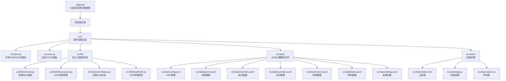
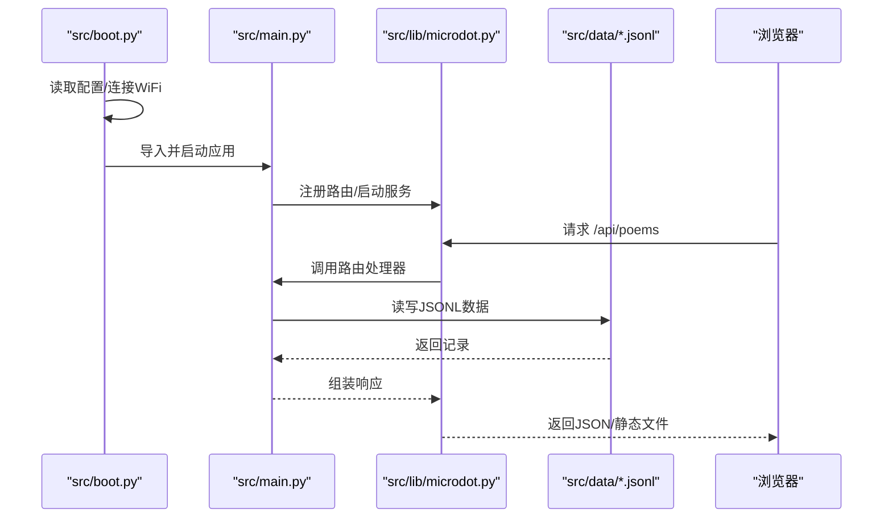
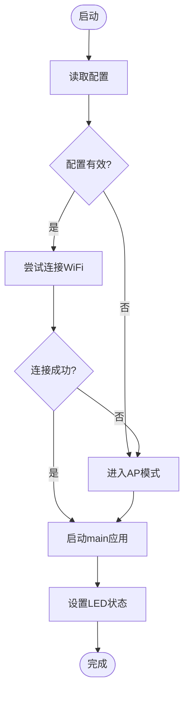
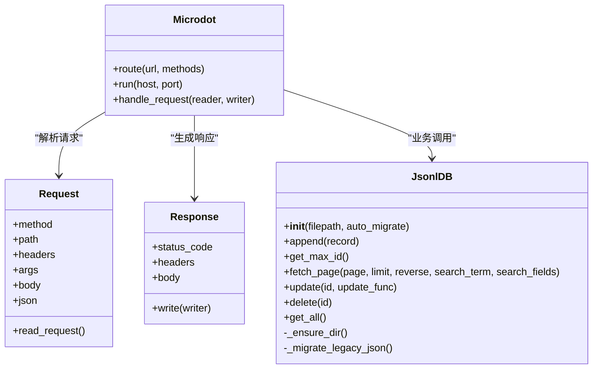
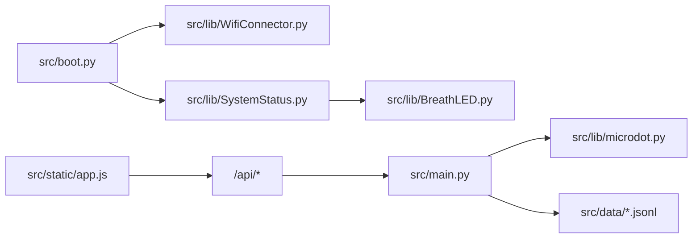

# 开发指南

<cite>
**本文引用的文件**
- [.gitignore](file://.gitignore)
- [README.md](file://README.md)
- [src/boot.py](file://src/boot.py)
- [src/main.py](file://src/main.py)
- [src/lib/microdot.py](file://src/lib/microdot.py)
- [src/lib/WifiConnector.py](file://src/lib/WifiConnector.py)
- [src/lib/SystemStatus.py](file://src/lib/SystemStatus.py)
- [src/lib/BreathLED.py](file://src/lib/BreathLED.py)
- [src/static/index.html](file://src/static/index.html)
- [src/static/app.js](file://src/static/app.js)
- [src/static/style.css](file://src/static/style.css)
- [src/data/config.json](file://src/data/config.json)
- [src/data/poems.jsonl](file://src/data/poems.jsonl)
- [src/data/members.jsonl](file://src/data/members.jsonl)
- [src/data/activities.jsonl](file://src/data/activities.jsonl)
- [src/data/finance.jsonl](file://src/data/finance.jsonl)
- [src/data/tasks.jsonl](file://src/data/tasks.jsonl)
- [src/data/settings.json](file://src/data/settings.json)
</cite>

## 更新摘要
**变更内容**
- 更新项目结构以反映新的src目录组织方式和标准化的文件路径
- 新增.gitignore文件的说明和Git版本控制最佳实践
- 更新开发规范章节，详细说明文件组织原则和目录结构
- 更新目录结构图和文件路径引用，确保与实际项目结构一致
- 增强代码规范和最佳实践指导，包括新功能开发流程

## 目录
1. [简介](#简介)
2. [项目结构](#项目结构)
3. [开发规范](#开发规范)
4. [核心组件](#核心组件)
5. [架构总览](#架构总览)
6. [详细组件分析](#详细组件分析)
7. [依赖关系分析](#依赖关系分析)
8. [性能考虑](#性能考虑)
9. [故障排查指南](#故障排查指南)
10. [结论](#结论)
11. [附录](#附录)

## 简介
本指南面向"围炉诗社·理事台"项目的开发者，提供从环境搭建、代码规范、调试技巧到架构设计、模块组织、API扩展与插件系统设计的全流程说明。项目采用 MicroPython 运行时，基于自研轻量 Web 框架 microdot，提供前端 HTML/CSS/JS 与后端 Python 的一体化服务，内置 JSONL 数据库存储与 WiFi 热点能力，支持系统状态 LED 指示。

**更新** 项目现已采用标准化的src目录结构，遵循现代Python项目的组织规范，提供更好的可维护性和扩展性。项目结构经过重构，包含完整的开发环境配置和版本控制支持。

## 项目结构
项目采用"src源代码根目录 + 分层模块"的标准化组织方式，配合.gitignore进行版本控制：
- **src/**: 源代码根目录，包含所有源文件
- **src/boot.py**: 系统启动引导程序（硬件初始化/网络连接）
- **src/main.py**: 主应用程序入口（路由定义/业务逻辑）
- **src/lib/**: 核心功能组件库（Web框架、WiFi、系统状态、LED控制）
- **src/data/**: 持久化 JSON/JSONL 数据文件
- **src/static/**: 前端 Web 资源（HTML/CSS/JS）
- **.gitignore**: Git版本控制忽略规则
- **README.md**: 项目说明文档

**图表来源**
- [.gitignore](file://.gitignore#L1-L3)
- [README.md](file://README.md#L34-L49)
- [src/boot.py](file://src/boot.py#L1-L122)
- [src/main.py](file://src/main.py#L1-L712)
- [src/lib/microdot.py](file://src/lib/microdot.py#L1-L183)
- [src/lib/WifiConnector.py](file://src/lib/WifiConnector.py#L1-L1930)
- [src/lib/SystemStatus.py](file://src/lib/SystemStatus.py#L1-L61)
- [src/lib/BreathLED.py](file://src/lib/BreathLED.py#L1-L633)
- [src/static/index.html](file://src/static/index.html#L1-L327)
- [src/static/app.js](file://src/static/app.js#L1-L1614)
- [src/static/style.css](file://src/static/style.css#L1-L385)

**章节来源**
- [README.md](file://README.md#L34-L49)
- [src/boot.py](file://src/boot.py#L1-L122)
- [src/main.py](file://src/main.py#L1-L712)

## 开发规范

### 目录结构规范
项目严格遵循以下目录组织规范：
- **src/**: 所有源代码必须放置在此目录下，包括boot.py、main.py、lib、data、static
- **src/lib/**: 核心库文件，包含可复用的功能模块（microdot.py、WifiConnector.py、SystemStatus.py、BreathLED.py）
- **src/data/**: 数据文件，包含JSON/JSONL格式的数据文件（config.json、poems.jsonl、members.jsonl等）
- **src/static/**: 前端静态资源（index.html、app.js、style.css）
- **src/boot.py**: 系统启动文件，负责硬件初始化和网络连接
- **src/main.py**: 应用主入口，提供路由和业务逻辑

### 文件命名规范
- **模块文件**: 使用小写 + 下划线命名（如 `wifi_connector.py`）
- **类文件**: 使用驼峰命名（如 `WifiConnector.py`）
- **配置文件**: 使用小写 + 下划线命名（如 `config.json`）
- **静态资源**: 使用小写 + 下划线命名（如 `style.css`）
- **数据文件**: 使用小写 + 下划线命名（如 `poems.jsonl`）

### 版本控制规范
- **.gitignore**: 忽略系统生成文件（.DS_Store、._.DS_Store）
- **README.md**: 项目说明文档，包含安装部署指南
- **开发分支**: 使用功能分支进行开发，合并前进行代码审查
- **提交信息**: 使用清晰的提交信息，描述变更内容和影响范围

### 代码组织原则
- **单一职责**: 每个模块只负责单一功能领域
- **接口统一**: 所有模块都应提供清晰的接口定义
- **错误处理**: 必须包含完整的异常处理和错误日志
- **资源管理**: 所有硬件资源使用后必须正确释放
- **内存优化**: 在MicroPython环境中严格控制内存使用

### 导入路径规范
- **相对导入**: 在同一目录下的模块间使用相对导入
- **绝对导入**: 从src根目录开始的绝对路径导入
- **跨模块导入**: 通过明确的模块路径进行导入
- **标准库导入**: 优先使用MicroPython标准库

**章节来源**
- [README.md](file://README.md#L34-L49)
- [.gitignore](file://.gitignore#L1-L3)
- [src/boot.py](file://src/boot.py#L1-L122)
- [src/main.py](file://src/main.py#L1-L712)

## 核心组件
- **引导与网络**: src/boot.py 负责 CPU 频率设置、WiFi 连接与 AP 备降、LED 状态指示、应用启动
- **Web 应用**: src/main.py 提供路由、API、JSONL 数据库访问、系统信息查询
- **轻量 Web 框架**: src/lib/microdot.py 实现请求解析、响应生成、静态文件发送
- **网络管理**: src/lib/WifiConnector.py 提供扫描、连接、断开、热点创建、状态监控
- **系统状态**: src/lib/SystemStatus.py 与 src/lib/BreathLED.py 提供 LED 呼吸指示
- **前端界面**: src/static/index.html、app.js、style.css 提供登录、导航、数据展示与交互

**章节来源**
- [src/boot.py](file://src/boot.py#L1-L122)
- [src/main.py](file://src/main.py#L1-L712)
- [src/lib/microdot.py](file://src/lib/microdot.py#L1-L183)
- [src/lib/WifiConnector.py](file://src/lib/WifiConnector.py#L1-L1930)
- [src/lib/SystemStatus.py](file://src/lib/SystemStatus.py#L1-L61)
- [src/lib/BreathLED.py](file://src/lib/BreathLED.py#L1-L633)
- [src/static/index.html](file://src/static/index.html#L1-L327)
- [src/static/app.js](file://src/static/app.js#L1-L1614)
- [src/static/style.css](file://src/static/style.css#L1-L385)

## 架构总览
系统采用"嵌入式 Web 服务 + 前后端一体化"的轻量架构：
- **启动阶段**: src/boot.py 读取配置、连接 WiFi，失败则进入 AP 模式，随后启动 src/main.py
- **运行阶段**: src/main.py 注册路由，使用 microdot 处理请求，访问 src/data/*.jsonl 数据，返回 JSON 或静态文件
- **前端**: index.html + app.js + style.css 提供用户界面与交互，通过 /api/* 与后端通信

**图表来源**
- [src/boot.py](file://src/boot.py#L88-L122)
- [src/main.py](file://src/main.py#L692-L712)
- [src/lib/microdot.py](file://src/lib/microdot.py#L94-L165)

## 详细组件分析

### 引导与网络（src/boot.py）
- **CPU 频率设置与调试输出**
- **配置加载**: 加载 src/data/config.json，判断是否配置 WiFi
- **WiFi 连接**: 失败则进入 AP 模式，支持自定义 AP IP 与密码
- **LED 状态**: 根据模式设置呼吸周期
- **应用启动**: 导入 main 并运行，打印系统状态

**图表来源**
- [src/boot.py](file://src/boot.py#L14-L122)

**章节来源**
- [src/boot.py](file://src/boot.py#L1-L122)
- [src/data/config.json](file://src/data/config.json#L1-L6)

### Web 应用与路由（src/main.py）
- **轻量 Web 框架**: Microdot 提供装饰器注册路由、请求解析、响应生成
- **JSONL 数据库**: JsonlDB 抽象文件存储，支持追加、分页、搜索、更新、删除
- **API 路由**:
  - 通用：/api/poems、/api/activities、/api/tasks、/api/members、/api/finance、/api/login、/api/system/info
  - 设置：/api/settings/fields、/api/settings/system
  - 管理：/api/migrate_passwords、/api/login_logs
- **静态资源**: /static/* 由 send_file 返回
- **系统状态**: /api/system/info 返回平台、存储、内存信息

**图表来源**
- [src/main.py](file://src/main.py#L76-L282)
- [src/lib/microdot.py](file://src/lib/microdot.py#L5-L165)

**章节来源**
- [src/main.py](file://src/main.py#L1-L712)
- [src/lib/microdot.py](file://src/lib/microdot.py#L1-L183)

### 轻量 Web 框架（src/lib/microdot.py）
- **Request**: 解析请求行、头、查询参数、JSON 载荷
- **Response**: 生成响应头、内容长度、写入响应体
- **Microdot**: 路由注册、请求处理、协程/生成器兼容、静态文件发送

**章节来源**
- [src/lib/microdot.py](file://src/lib/microdot.py#L1-L183)

### 网络管理（src/lib/WifiConnector.py）
- **功能**: 扫描网络、连接/断开、自动重连、热点创建、静态 IP、状态监控
- **设计**: 参数校验、错误日志、状态描述、网络信息同步、重置 WiFi 模块
- **静态 IP**: 支持 IP、子网掩码、网关、DNS 校验与配置

**章节来源**
- [src/lib/WifiConnector.py](file://src/lib/WifiConnector.py#L1-L1930)

### 系统状态与 LED（src/lib/SystemStatus.py、src/lib/BreathLED.py）
- **SystemStatus**: 根据连接状态设置 LED 呼吸周期（快速/中速/慢速）
- **BreathLED**: WS2812 彩色 LED 或普通 LED 呼吸控制，定时器驱动，正弦查找表平滑亮度

**章节来源**
- [src/lib/SystemStatus.py](file://src/lib/SystemStatus.py#L1-L61)
- [src/lib/BreathLED.py](file://src/lib/BreathLED.py#L1-L633)

### 前端界面（src/static/index.html、app.js、style.css）
- **登录**: /api/login，本地持久化用户信息
- **导航**: 首页、活动、藏诗阁、事务、财务、社员、系统
- **数据**: Poems、Activities、Tasks、Members、Finance 通过 /api/* 获取
- **交互**: 模态框、草稿本地 IndexedDB、权限控制、统计卡片

**章节来源**
- [src/static/index.html](file://src/static/index.html#L1-L327)
- [src/static/app.js](file://src/static/app.js#L1-L1614)
- [src/static/style.css](file://src/static/style.css#L1-L385)

## 依赖关系分析
- src/boot.py 依赖 src/lib/WifiConnector 与 src/lib/SystemStatus
- src/main.py 依赖 src/lib/microdot 与 src/data/*.jsonl
- SystemStatus 依赖 src/lib/BreathLED
- 前端通过 fetch 与 /api/* 通信

**图表来源**
- [src/boot.py](file://src/boot.py#L5-L6)
- [src/lib/WifiConnector.py](file://src/lib/WifiConnector.py#L1-L50)
- [src/lib/SystemStatus.py](file://src/lib/SystemStatus.py#L10-L10)
- [src/lib/BreathLED.py](file://src/lib/BreathLED.py#L1-L26)
- [src/main.py](file://src/main.py#L12-L13)
- [src/lib/microdot.py](file://src/lib/microdot.py#L1-L10)
- [src/static/app.js](file://src/static/app.js#L2-L2)

**章节来源**
- [src/boot.py](file://src/boot.py#L1-L122)
- [src/main.py](file://src/main.py#L1-L712)

## 性能考虑
- **JSONL 数据库**
  - 分页与搜索：分页扫描行偏移，搜索全量扫描，注意大数据量时的性能
  - 追加/更新/删除：均涉及临时文件与重命名，注意文件系统碎片与写放大
- **Web 框架**
  - 协程/生成器兼容，避免阻塞；静态文件采用流式写入
- **前端**
  - IndexedDB 草稿缓存，减少服务器压力；分页加载，避免一次性渲染大量数据
- **系统资源**
  - LED 呼吸周期与更新间隔可调，避免过度占用 CPU

**章节来源**
- [src/main.py](file://src/main.py#L119-L282)
- [src/lib/microdot.py](file://src/lib/microdot.py#L104-L152)
- [src/static/app.js](file://src/static/app.js#L46-L104)

## 故障排查指南
- **启动与网络**
  - 若 WiFi 未配置或连接失败，src/boot.py 会进入 AP 模式，检查 src/data/config.json
  - 使用 SystemStatus 检查 LED 呼吸状态，区分连接中/AP/运行
- **API 问题**
  - 检查 src/main.py 路由注册与异常处理，关注 JSON 解析与文件读写错误
  - /api/system/info 可查看存储与内存信息
- **前端问题**
  - 确认 /api/* 可访问，IndexedDB 初始化与权限
- **数据一致性**
  - JSONL 文件损坏或写入中断可能导致记录异常，必要时备份与重建

**章节来源**
- [src/boot.py](file://src/boot.py#L22-L87)
- [src/main.py](file://src/main.py#L692-L712)
- [src/lib/SystemStatus.py](file://src/lib/SystemStatus.py#L19-L61)
- [src/static/app.js](file://src/static/app.js#L7-L58)

## 结论
本项目以 MicroPython 为基础，构建了轻量、可维护的嵌入式 Web 应用。通过自研 microdot、JSONL 数据库与 WiFi/LED 工具库，实现了从引导、网络、服务到前端的一体化方案。新的src目录结构提供了更好的代码组织和可维护性，配合.gitignore进行版本控制，建议在后续迭代中完善测试体系、文档与 CI 流水线，以提升可维护性与可靠性。

## 附录

### 开发环境搭建
- **硬件**: ESP32/ESP32-S2 开发板
- **工具**: MpyCross、ampy/rshell 等上传工具
- **步骤**:
  - 将 src/data/config.json、src/lib/*.py、src/static/*、src/boot.py、src/main.py 上传到设备
  - 在 src/boot.py 中确保 src/data/config.json 可读
  - 通过串口监视器观察启动日志与 LED 状态

**章节来源**
- [src/boot.py](file://src/boot.py#L88-L122)
- [src/data/config.json](file://src/data/config.json#L1-L6)

### 代码规范与调试技巧
- **规范**
  - 文件命名：小写 + 下划线；模块独立文件
  - 路由与 API：清晰的 URL 与方法约定；错误返回统一
  - 日志：src/boot.py 与 src/lib/WifiConnector.py 使用统一日志输出
- **调试**
  - 启动阶段：观察 src/boot.py 输出与 LED 状态
  - 运行阶段：/api/system/info 查看系统状态
  - 前端：浏览器控制台与 Network 面板检查 /api/* 请求

**章节来源**
- [src/boot.py](file://src/boot.py#L1-L122)
- [src/main.py](file://src/main.py#L692-L712)
- [src/lib/WifiConnector.py](file://src/lib/WifiConnector.py#L135-L148)

### 新功能开发流程
- **前端**
  - 在 src/static/index.html 添加页面/模态框
  - 在 src/static/app.js 新增数据获取与提交逻辑
- **后端**
  - 在 src/main.py 注册路由与控制器
  - 使用 JsonlDB 操作 src/data/*.jsonl
- **集成**
  - 前端通过 /api/* 与后端通信
  - 如需静态资源，放置 src/static 并通过 send_file 返回

**章节来源**
- [src/static/index.html](file://src/static/index.html#L1-L327)
- [src/static/app.js](file://src/static/app.js#L1-L1614)
- [src/main.py](file://src/main.py#L356-L712)

### API 扩展方法
- **新增实体**
  - 在 src/data/ 新建 *.jsonl
  - 在 src/main.py 中新增 JsonlDB 实例与路由
  - 在前端 app.js 中新增数据获取与渲染
- **修改现有实体**
  - 保持 id 与字段兼容
  - 注意搜索与分页逻辑

**章节来源**
- [src/main.py](file://src/main.py#L284-L291)
- [src/data/poems.jsonl](file://src/data/poems.jsonl#L1-L4)
- [src/data/members.jsonl](file://src/data/members.jsonl#L1-L4)

### 插件系统设计指导
- **建议**
  - 将业务逻辑封装为模块（如 src/lib/xxx.py），通过 src/main.py 动态导入
  - 通过配置文件（如 src/data/config.json）控制插件开关
  - 为插件提供统一接口（如 register_routes(app)），便于集中注册
- **注意**
  - MicroPython 环境限制，避免复杂第三方库
  - 控制内存与文件系统占用

**章节来源**
- [src/main.py](file://src/main.py#L1-L17)
- [src/lib/microdot.py](file://src/lib/microdot.py#L98-L102)

### 测试策略
- **单元测试**
  - 对 JsonlDB 的增删改查进行断言
  - 对 microdot 的 Request/Response 进行模拟
- **集成测试**
  - 启动 src/main.py，调用 /api/* 验证路由与数据一致性
- **性能测试**
  - 大数据量分页与搜索的耗时与内存占用
  - LED 呼吸周期对 CPU 的影响

**章节来源**
- [src/main.py](file://src/main.py#L86-L247)
- [src/lib/microdot.py](file://src/lib/microdot.py#L104-L152)

### 版本管理、发布与 CI 最佳实践
- **版本管理**
  - 使用语义化版本（如 v1.x.y），在 README 或注释中标注
- **发布**
  - 打包 src/data/*.jsonl 与 src/lib/*.py、src/static/*、src/boot.py、src/main.py
  - 提供升级脚本或迁移说明
- **CI**
  - 代码风格检查（如缩进、命名）
  - 静态分析（导入与未使用变量）
  - 集成测试（模拟 /api/* 调用）

**章节来源**
- [src/boot.py](file://src/boot.py#L1-L122)
- [src/main.py](file://src/main.py#L1-L712)

### 开发规范最佳实践
- **目录结构**
  - 所有源代码必须放置在 src/ 目录下
  - 遵循模块化设计，避免单文件过大
- **代码质量**
  - 使用清晰的函数和变量命名
  - 添加必要的注释和文档字符串
  - 遵循 PEP 8 代码风格
- **资源管理**
  - 及时释放网络连接和文件句柄
  - 使用 try/finally 确保资源清理
- **错误处理**
  - 捕获并处理所有可能的异常
  - 提供有意义的错误信息

**章节来源**
- [README.md](file://README.md#L34-L49)
- [src/boot.py](file://src/boot.py#L1-L122)
- [src/main.py](file://src/main.py#L1-L712)

### Git版本控制最佳实践
- **忽略文件**
  - .DS_Store 和 ._DS_Store 系统文件
  - 本地开发环境生成的临时文件
- **分支管理**
  - master/main 分支保护，仅允许通过Pull Request合并
  - 功能开发使用特性分支，完成后合并到主分支
- **提交规范**
  - 使用清晰的提交信息，描述变更内容和影响范围
  - 遵循原子性提交原则，避免混杂多个不相关的变更
- **标签管理**
  - 使用语义化版本标签（v1.0.0、v1.1.0等）
  - 发布前创建标签并推送

**章节来源**
- [.gitignore](file://.gitignore#L1-L3)
- [README.md](file://README.md#L67-L75)