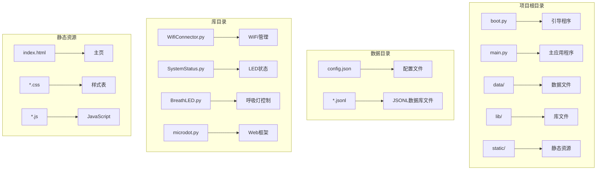
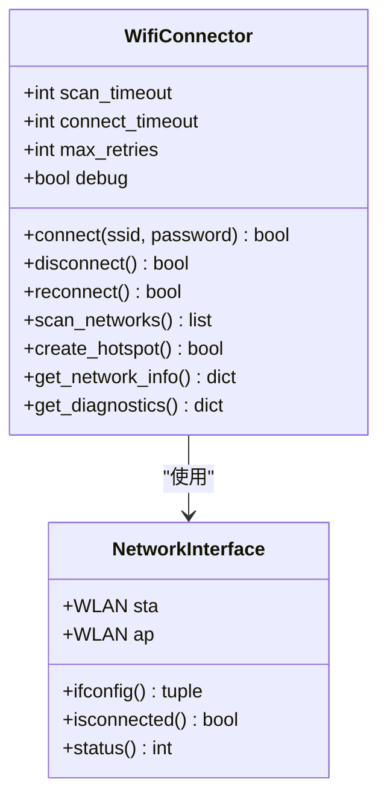
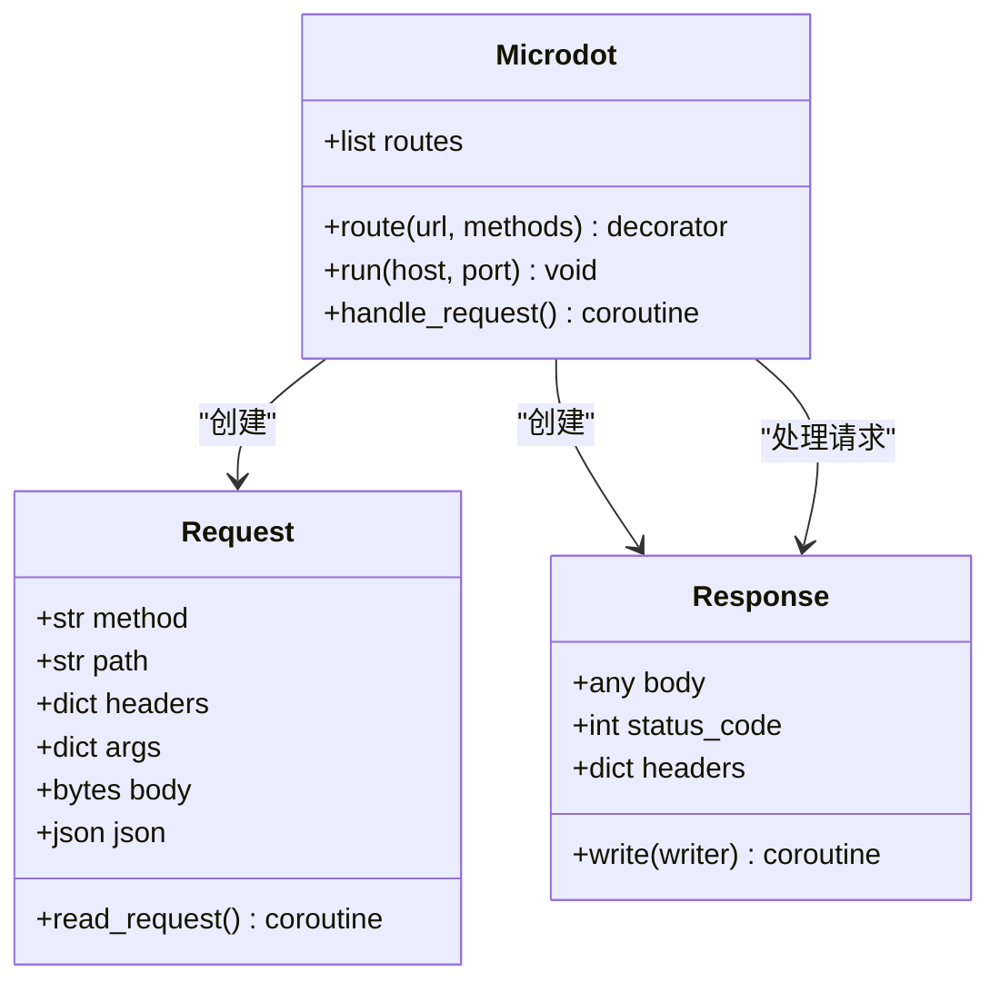
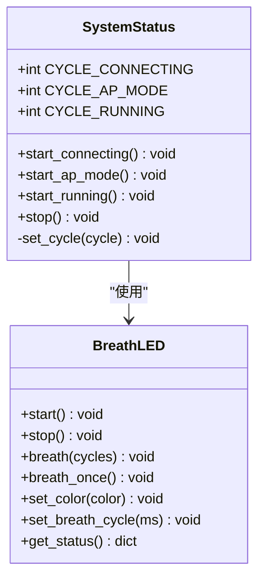
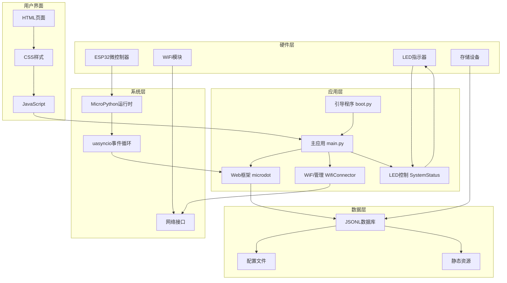
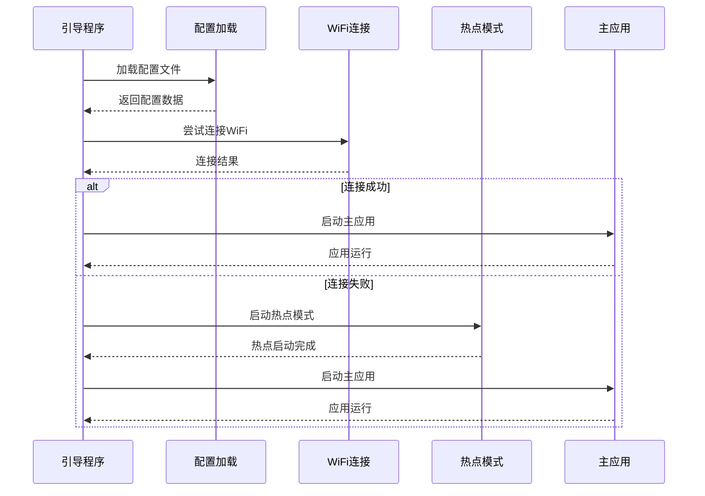
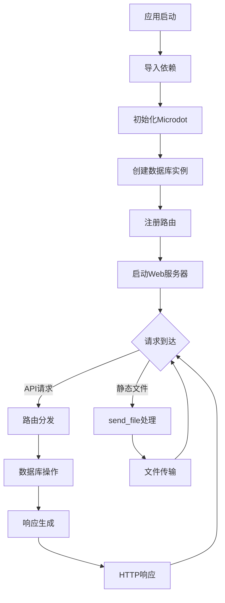
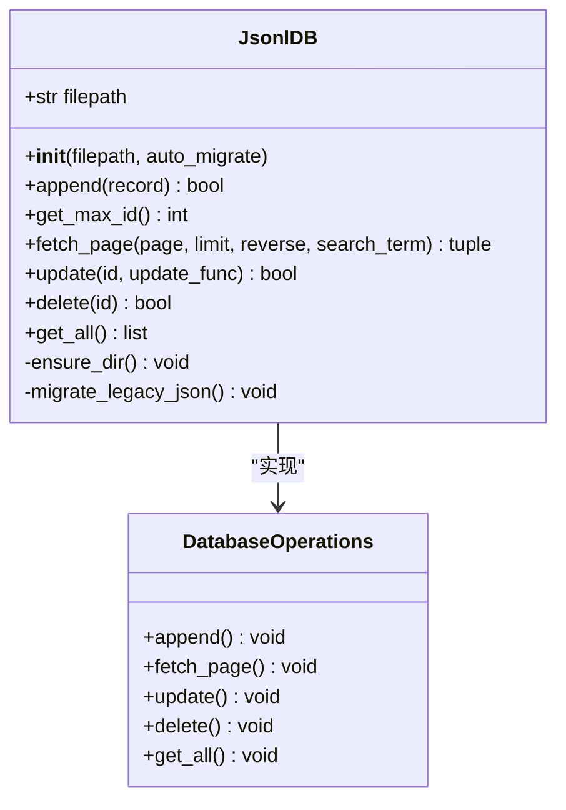
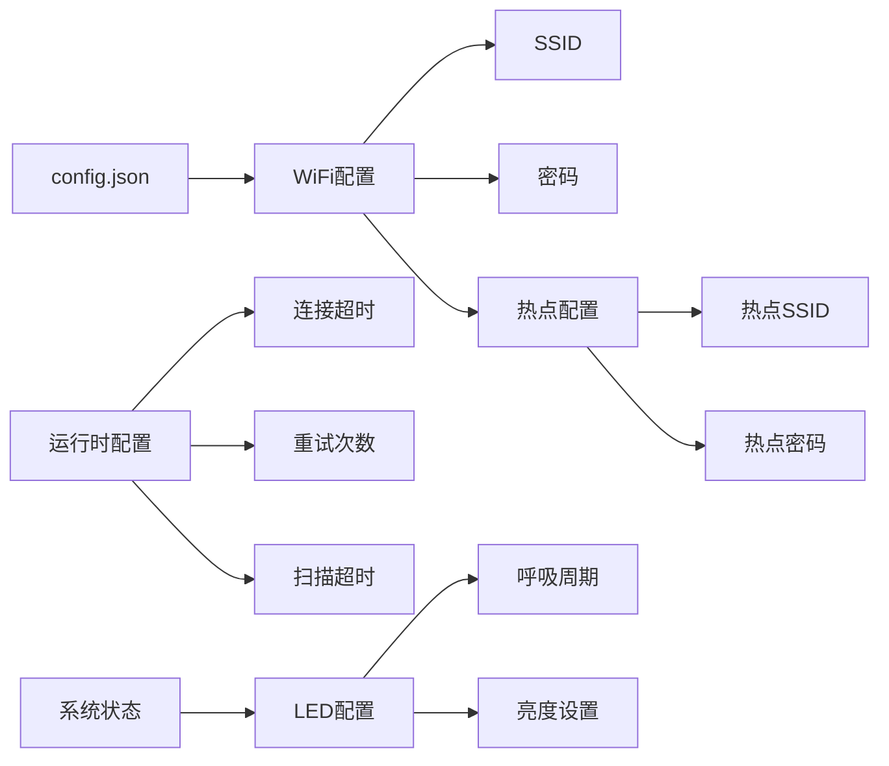
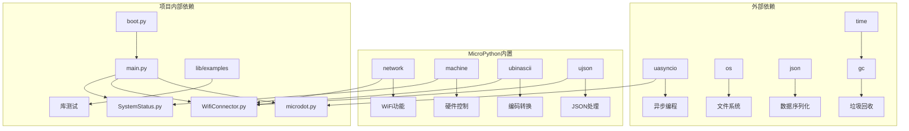

# 开发环境搭建

<cite>
**本文档引用的文件**
- [boot.py](file://boot.py)
- [main.py](file://main.py)
- [lib/microdot.py](file://lib/microdot.py)
- [lib/WifiConnector.py](file://lib/WifiConnector.py)
- [lib/SystemStatus.py](file://lib/SystemStatus.py)
- [lib/BreathLED.py](file://lib/BreathLED.py)
- [data/config.json](file://data/config.json)
- [static/index.html](file://static/index.html)
- [lib/wifi_connector_example.py](file://lib/wifi_connector_example.py)
- [lib/breath_led_example.py](file://lib/breath_led_example.py)
</cite>

## 目录
1. [简介](#简介)
2. [项目结构](#项目结构)
3. [核心组件](#核心组件)
4. [架构概览](#架构概览)
5. [详细组件分析](#详细组件分析)
6. [依赖分析](#依赖分析)
7. [性能考虑](#性能考虑)
8. [故障排除指南](#故障排除指南)
9. [结论](#结论)
10. [附录](#附录)

## 简介

围炉诗社·理事台是一个基于ESP32的Web应用项目，旨在为围炉诗社提供一个集活动管理、诗歌创作、成员管理和财务管理于一体的综合管理系统。该项目采用MicroPython作为运行时环境，使用自研的Microdot轻量级Web框架构建RESTful API服务。

本项目的核心特色包括：
- 基于ESP32的嵌入式Web服务器
- 实时WiFi连接管理和AP模式支持
- LED状态指示系统
- JSONL数据存储方案
- 响应式Web界面

## 项目结构

项目采用清晰的功能模块化组织方式，主要目录结构如下：

**图表来源**
- [boot.py](file://boot.py#L1-L122)
- [main.py](file://main.py#L1-L548)
- [lib/microdot.py](file://lib/microdot.py#L1-L183)

**章节来源**
- [boot.py](file://boot.py#L1-L122)
- [main.py](file://main.py#L1-L548)

## 核心组件

### WiFi连接管理器

WiFi连接管理器是项目的核心组件之一，提供了完整的WiFi连接生命周期管理功能：

**图表来源**
- [lib/WifiConnector.py](file://lib/WifiConnector.py#L11-L1930)

### Microdot Web框架

自研的Microdot框架提供了轻量级的Web服务功能：

**图表来源**
- [lib/microdot.py](file://lib/microdot.py#L94-L183)

### LED状态控制系统

系统LED状态指示器提供了直观的运行状态反馈：

**图表来源**
- [lib/SystemStatus.py](file://lib/SystemStatus.py#L19-L61)
- [lib/BreathLED.py](file://lib/BreathLED.py#L11-L633)

**章节来源**
- [lib/WifiConnector.py](file://lib/WifiConnector.py#L11-L1930)
- [lib/microdot.py](file://lib/microdot.py#L94-L183)
- [lib/SystemStatus.py](file://lib/SystemStatus.py#L19-L61)
- [lib/BreathLED.py](file://lib/BreathLED.py#L11-L633)

## 架构概览

项目采用分层架构设计，实现了硬件抽象、业务逻辑和用户界面的有效分离：

**图表来源**
- [boot.py](file://boot.py#L1-L122)
- [main.py](file://main.py#L1-L548)
- [lib/microdot.py](file://lib/microdot.py#L1-L183)
- [lib/WifiConnector.py](file://lib/WifiConnector.py#L1-L1930)
- [lib/SystemStatus.py](file://lib/SystemStatus.py#L1-L61)

## 详细组件分析

### 引导程序 (boot.py)

引导程序负责系统的初始化和启动流程管理：

**图表来源**
- [boot.py](file://boot.py#L22-L122)

引导程序的关键职责包括：
- CPU频率设置（240MHz）
- WiFi连接管理
- 热点模式切换
- 应用启动协调

**章节来源**
- [boot.py](file://boot.py#L1-L122)

### 主应用程序 (main.py)

主应用程序实现了完整的Web服务功能：

**图表来源**
- [main.py](file://main.py#L17-L548)

主要功能模块：
- **JSONL数据库管理**：实现高效的数据存储和检索
- **Web路由系统**：提供RESTful API接口
- **静态文件服务**：支持HTML/CSS/JS文件传输
- **系统状态监控**：提供设备信息查询

**章节来源**
- [main.py](file://main.py#L1-L548)

### 数据库管理系统

项目采用JSONL（JSON Lines）格式实现数据存储：

**图表来源**
- [main.py](file://main.py#L53-L267)

数据库特点：
- **内存优化**：支持大数据集的分页查询
- **搜索功能**：支持全文搜索和条件过滤
- **数据迁移**：自动从旧版JSON格式迁移
- **事务安全**：使用临时文件实现原子操作

**章节来源**
- [main.py](file://main.py#L53-L267)

### 配置管理系统

系统配置通过JSON文件管理：

**图表来源**
- [data/config.json](file://data/config.json#L1-L6)
- [boot.py](file://boot.py#L14-L20)

**章节来源**
- [data/config.json](file://data/config.json#L1-L6)
- [boot.py](file://boot.py#L14-L20)

## 依赖分析

项目依赖关系呈现清晰的层次结构：

**图表来源**
- [boot.py](file://boot.py#L1-L6)
- [main.py](file://main.py#L1-L16)
- [lib/microdot.py](file://lib/microdot.py#L1-L4)

**章节来源**
- [boot.py](file://boot.py#L1-L6)
- [main.py](file://main.py#L1-L16)
- [lib/microdot.py](file://lib/microdot.py#L1-L4)

## 性能考虑

### 内存管理

项目采用了多项内存优化策略：

1. **分页查询**：数据库查询使用分页机制，避免一次性加载大量数据
2. **垃圾回收**：定期触发垃圾回收以释放内存
3. **资源清理**：及时清理不再使用的对象和文件句柄

### 网络优化

1. **连接池**：复用WiFi连接减少握手开销
2. **超时配置**：合理设置连接超时避免长时间阻塞
3. **重连机制**：自动重连提高网络稳定性

### LED控制优化

1. **定时器优化**：使用高效的定时器实现平滑的呼吸效果
2. **更新频率**：动态调整更新频率平衡效果和性能
3. **内存映射**：使用查找表减少实时计算开销

## 故障排除指南

### 常见启动问题

**问题1：WiFi连接失败**
- 检查config.json中的SSID和密码配置
- 确认WiFi信号强度足够
- 查看boot.py中的调试输出

**问题2：热点模式无法启动**
- 检查热点配置参数
- 确认WiFi模块正常工作
- 验证IP地址段未被占用

**问题3：Web服务无法访问**
- 检查端口80是否被占用
- 验证防火墙设置
- 确认网络连接正常

### 调试技巧

1. **启用调试模式**：在WifiConnector初始化时设置debug=True
2. **查看系统状态**：通过/api/system/info端点获取设备信息
3. **检查内存使用**：监控gc.mem_free()返回的可用内存
4. **网络诊断**：使用get_diagnostics()方法获取详细诊断信息

**章节来源**
- [lib/WifiConnector.py](file://lib/WifiConnector.py#L1873-L1902)
- [main.py](file://main.py#L528-L547)

## 结论

围炉诗社·理事台项目展示了如何在ESP32平台上构建功能完整的Web应用。项目通过精心设计的架构和优化的实现，成功地将复杂的Web服务功能运行在资源受限的嵌入式设备上。

项目的主要优势包括：
- **模块化设计**：清晰的组件分离便于维护和扩展
- **性能优化**：针对嵌入式环境的多项优化措施
- **易用性**：提供完整的示例代码和测试程序
- **可靠性**：完善的错误处理和恢复机制

对于开发者而言，这个项目提供了在嵌入式Web开发领域的宝贵经验和技术参考。

## 附录

### 开发工具推荐

1. **代码编辑器**：VS Code配合MicroPython插件
2. **串口监视器**：用于调试和日志查看
3. **文件传输工具**：支持MPY格式的文件传输工具
4. **虚拟环境**：Python虚拟环境用于开发和测试

### 部署建议

1. **固件选择**：使用官方MicroPython固件
2. **权限设置**：确保正确的文件权限
3. **备份策略**：定期备份重要数据文件
4. **监控设置**：建立系统健康监控机制