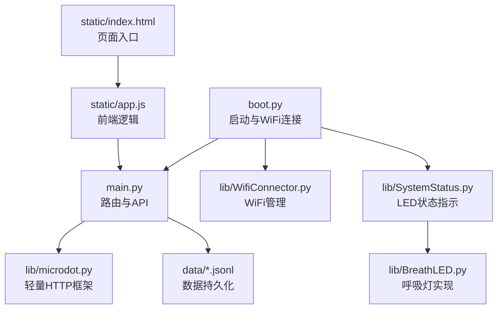
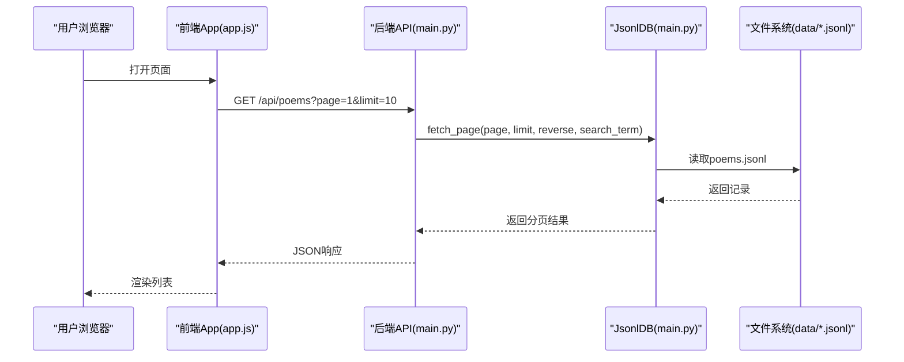
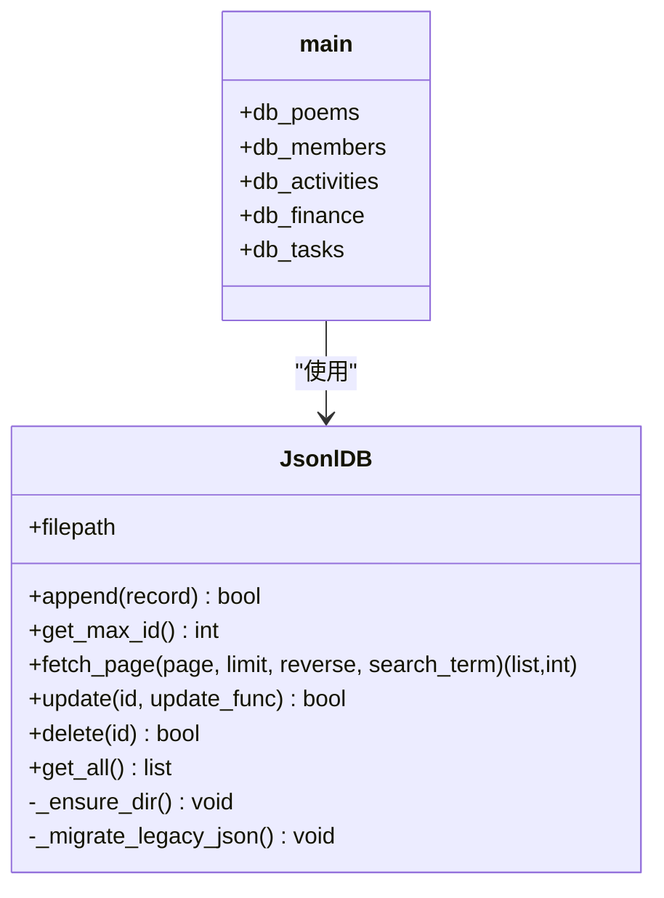
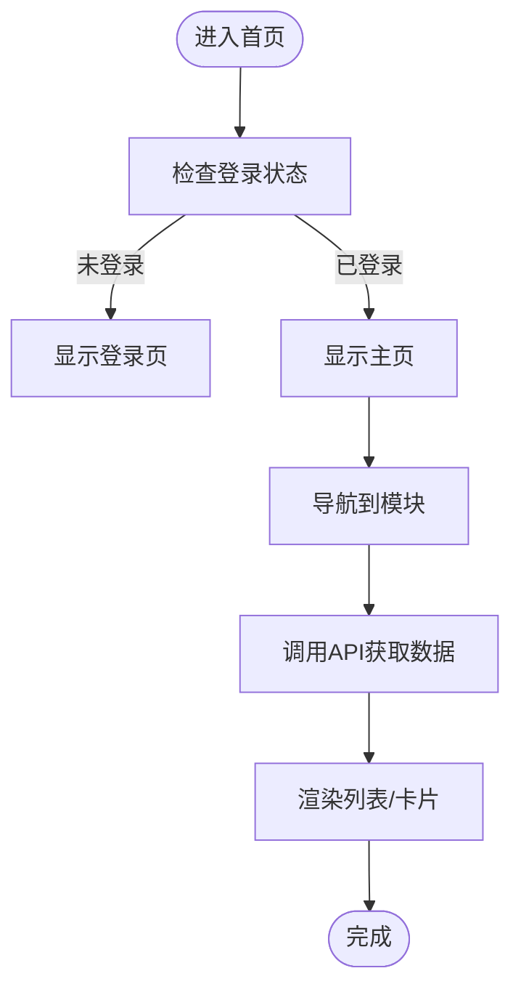
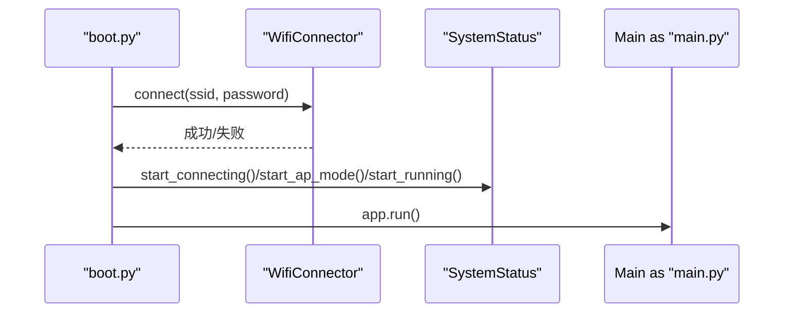
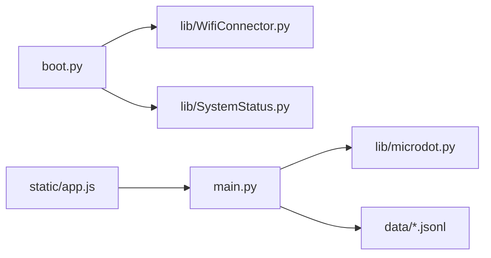

# 扩展开发

<cite>
**本文引用的文件**
- [main.py](file://main.py)
- [boot.py](file://boot.py)
- [index.html](file://static/index.html)
- [app.js](file://static/app.js)
- [config.json](file://data/config.json)
- [settings.json](file://data/settings.json)
- [poems.jsonl](file://data/poems.jsonl)
- [members.jsonl](file://data/members.jsonl)
- [WifiConnector.py](file://lib/WifiConnector.py)
- [SystemStatus.py](file://lib/SystemStatus.py)
- [microdot.py](file://lib/microdot.py)
- [BreathLED.py](file://lib/BreathLED.py)
</cite>

## 目录
1. [简介](#简介)
2. [项目结构](#项目结构)
3. [核心组件](#核心组件)
4. [架构总览](#架构总览)
5. [详细组件分析](#详细组件分析)
6. [依赖关系分析](#依赖关系分析)
7. [性能考量](#性能考量)
8. [故障排查指南](#故障排查指南)
9. [结论](#结论)
10. [附录](#附录)

## 简介
本指南面向“围炉诗社·理事台”项目的扩展开发者，目标是帮助你在现有基础上安全、高效地添加新功能模块，涵盖：
- 新增API接口与前端页面联动
- 插件化/模块化扩展的设计思路与落地方法
- 从需求分析到测试部署的完整流程
- 在现有模块上扩展现有功能（配置参数、业务逻辑）
- 第三方库/模块的集成方式与注意事项
- 最佳实践与常见陷阱规避

## 项目结构
项目采用“嵌入式Web服务 + 前端静态页面”的轻量架构，核心文件如下：
- 后端：main.py（基于自研轻量HTTP框架）、boot.py（启动与WiFi连接）、lib/*（工具库）
- 前端：static/*（HTML/CSS/JS）
- 数据：data/*（JSONL与JSON）

图表来源
- [boot.py](file://boot.py#L1-L122)
- [main.py](file://main.py#L1-L120)
- [index.html](file://static/index.html#L1-L269)
- [app.js](file://static/app.js#L1-L120)
- [WifiConnector.py](file://lib/WifiConnector.py#L1-L120)
- [SystemStatus.py](file://lib/SystemStatus.py#L1-L61)
- [microdot.py](file://lib/microdot.py#L1-L183)
- [BreathLED.py](file://lib/BreathLED.py#L1-L120)

章节来源
- [main.py](file://main.py#L1-L120)
- [boot.py](file://boot.py#L1-L122)
- [index.html](file://static/index.html#L1-L269)
- [app.js](file://static/app.js#L1-L120)

## 核心组件
- 轻量HTTP框架：基于自研的Microdot，支持路由装饰器、请求解析、响应写入与静态文件发送。
- 数据层：JsonlDB类封装JSONL文件数据库，提供追加、查询、分页、更新、删除等能力。
- 前端应用：单页应用（SPA），通过XHR/Fetch与后端API交互，支持权限控制、分页、草稿本地存储等。
- 启动与网络：boot.py负责WiFi连接与AP回退、LED状态指示；lib/WifiConnector.py提供WiFi连接管理；lib/SystemStatus.py控制LED呼吸周期。

章节来源
- [microdot.py](file://lib/microdot.py#L94-L183)
- [main.py](file://main.py#L53-L267)
- [app.js](file://static/app.js#L1-L120)
- [boot.py](file://boot.py#L22-L87)
- [WifiConnector.py](file://lib/WifiConnector.py#L11-L120)
- [SystemStatus.py](file://lib/SystemStatus.py#L19-L61)

## 架构总览
后端通过路由装饰器注册API，前端通过REST风格接口与后端通信。数据以JSONL文件形式存储，便于嵌入式环境下的读写与迁移。

图表来源
- [main.py](file://main.py#L309-L333)
- [main.py](file://main.py#L113-L186)
- [app.js](file://static/app.js#L165-L212)

章节来源
- [main.py](file://main.py#L299-L333)
- [app.js](file://static/app.js#L165-L212)

## 详细组件分析

### 组件A：API与数据层（JsonlDB）
- 设计要点
  - JsonlDB以JSONL文件作为数据源，支持快速分页与全文检索（按字段值包含匹配）。
  - 提供append、get_max_id、fetch_page、update、delete、get_all等方法。
  - 自动迁移旧版JSON文件为JSONL，兼容历史数据。
- 复杂度与性能
  - 分页：通过记录偏移定位，避免一次性加载全部数据，适合中等规模数据。
  - 搜索：无索引，按行扫描，复杂度O(N)；建议限制搜索字段或引入索引策略。
- 错误处理
  - 文件不存在、读写异常均捕获并返回False/空列表，保证服务稳定性。
- 优化建议
  - 对高频查询字段建立索引文件或缓存。
  - 大数据量场景考虑分片或压缩存储。

图表来源
- [main.py](file://main.py#L53-L267)

章节来源
- [main.py](file://main.py#L53-L267)

### 组件B：前端应用（SPA + Fetch）
- 设计要点
  - 单页应用，通过切换section显示不同模块。
  - 登录后根据角色显示/隐藏按钮与功能。
  - 使用IndexedDB存储本地草稿，首次进入合并展示。
  - 分页加载、搜索过滤、模态框交互。
- 复杂度与性能
  - 首屏渲染后，后续切换仅触发对应模块的数据拉取。
  - IndexedDB读写异步，避免阻塞UI。
- 错误处理
  - 登录失败、网络异常均有提示与降级处理。
- 优化建议
  - 对列表项进行虚拟滚动（大数据量时）。
  - 缓存最近请求结果，减少重复请求。

图表来源
- [app.js](file://static/app.js#L61-L147)

章节来源
- [index.html](file://static/index.html#L1-L269)
- [app.js](file://static/app.js#L61-L147)

### 组件C：启动与网络（boot.py + WifiConnector）
- 设计要点
  - 从config.json读取WiFi配置，优先连接；失败则启动AP模式。
  - SystemStatus控制LED呼吸周期，区分连接中、AP模式、运行中三种状态。
- 复杂度与性能
  - 连接过程包含重试与超时控制，避免长时间阻塞。
- 错误处理
  - 记录最后一次错误原因，便于排障。
- 优化建议
  - 增加重连策略与心跳检测。
  - AP模式下提供Web配置入口。

图表来源
- [boot.py](file://boot.py#L22-L121)
- [WifiConnector.py](file://lib/WifiConnector.py#L595-L800)
- [SystemStatus.py](file://lib/SystemStatus.py#L33-L57)

章节来源
- [boot.py](file://boot.py#L22-L121)
- [WifiConnector.py](file://lib/WifiConnector.py#L11-L120)
- [SystemStatus.py](file://lib/SystemStatus.py#L19-L61)

## 依赖关系分析
- 后端依赖
  - main.py依赖lib/microdot.py提供路由与HTTP处理。
  - boot.py依赖lib/WifiConnector.py与lib/SystemStatus.py。
- 前端依赖
  - app.js依赖后端API与本地IndexedDB。
- 数据依赖
  - data/*.jsonl为数据持久化载体，settings.json为系统配置。

图表来源
- [boot.py](file://boot.py#L1-L122)
- [main.py](file://main.py#L1-L17)
- [microdot.py](file://lib/microdot.py#L1-L183)

章节来源
- [main.py](file://main.py#L1-L17)
- [boot.py](file://boot.py#L1-L122)

## 性能考量
- 数据访问
  - JsonlDB分页避免全量加载，搜索需谨慎使用；建议限制搜索范围或引入索引。
- 网络与I/O
  - 静态文件通过send_file直接读取，减少中间处理。
  - 前端分页与懒加载降低首屏压力。
- 内存与资源
  - boot.py中对LED呼吸周期与更新间隔进行了优化，避免过度占用CPU。
- 建议
  - 对高频接口增加缓存层（如内存缓存或Redis）。
  - 对大文件传输采用分块或压缩策略。

[本节为通用指导，无需特定文件来源]

## 故障排查指南
- 启动阶段
  - 若WiFi连接失败，检查config.json中的SSID与密码；必要时进入AP模式查看日志。
- API访问
  - 检查main.py路由是否存在、参数是否正确、JsonlDB文件是否存在。
- 前端交互
  - 检查跨域与CORS问题；确认API路径与参数一致。
- 数据一致性
  - 更新/删除操作失败时，检查文件权限与磁盘空间。

章节来源
- [boot.py](file://boot.py#L22-L87)
- [main.py](file://main.py#L299-L540)
- [app.js](file://static/app.js#L165-L212)

## 结论
本项目以极简架构实现了诗社管理的核心功能。通过明确的模块边界与清晰的前后端职责划分，为后续扩展提供了良好的基础。遵循本文的扩展流程与最佳实践，可在不破坏现有稳定性的前提下，持续迭代新功能。

[本节为总结，无需特定文件来源]

## 附录

### A. 新功能模块开发流程（从需求到上线）
- 需求分析
  - 明确业务目标、数据模型、权限与交互。
- 前端设计
  - 在static/index.html中新增页面/组件，在static/app.js中实现数据拉取、渲染与交互。
- 后端API
  - 在main.py中新增路由，实现数据访问与业务逻辑。
  - 如需新增数据表，新增JsonlDB实例并维护数据文件。
- 测试
  - 单元测试：模拟API调用与数据读写。
  - 集成测试：端到端验证登录、列表、新增/编辑/删除流程。
- 部署
  - 上传文件、校验config.json、重启服务，观察LED状态与日志。

章节来源
- [main.py](file://main.py#L299-L540)
- [index.html](file://static/index.html#L1-L269)
- [app.js](file://static/app.js#L1-L120)

### B. 扩展现有模块（配置与业务逻辑）
- 添加自定义字段
  - 在settings.json中维护custom_member_fields，前端通过/api/settings/fields读取与更新。
  - 在成员管理界面动态渲染自定义输入框。
- 修改业务逻辑
  - 例如在任务完成时增加积分流水记录，可在main.py中扩展任务完成API，同时在前端渲染积分统计。
- 注意事项
  - 保持向后兼容，避免破坏既有数据结构。
  - 对外部依赖（如文件系统）做好异常处理。

章节来源
- [settings.json](file://data/settings.json#L1-L1)
- [main.py](file://main.py#L518-L527)
- [app.js](file://static/app.js#L566-L578)

### C. 插件系统设计与实现建议
- 设计原则
  - 模块化：每个功能作为一个独立模块，暴露统一的注册/卸载接口。
  - 配置驱动：通过配置文件声明模块启用状态与参数。
  - 生命周期：定义初始化、运行、关闭等阶段钩子。
- 实现路径
  - 在main.py中新增模块注册表，按需加载模块。
  - 模块内部通过装饰器或回调注册API路由与前端组件。
  - 通过data目录存放模块专属配置与数据。
- 示例思路
  - 新增“签到”模块：后端新增签到API与数据表，前端新增签到页面与统计视图。

[本节为概念性内容，无需特定文件来源]

### D. 第三方库集成方法与注意事项
- 集成方式
  - 将第三方库放入lib目录，按需导入。
  - 注意MicroPython生态差异，优先选择纯Python实现或兼容版本。
- 注意事项
  - 避免引入大型依赖，控制内存占用。
  - 对网络库进行超时与重试控制。
  - 对文件系统操作进行权限与容量检查。

章节来源
- [microdot.py](file://lib/microdot.py#L1-L183)
- [WifiConnector.py](file://lib/WifiConnector.py#L1-L120)

### E. 最佳实践与常见陷阱
- 最佳实践
  - 统一错误码与响应格式，便于前端处理。
  - 对敏感操作（如删除、修改密码）增加二次确认与审计日志。
  - 前端缓存与后端一致性结合，避免脏读。
  - 为关键路径添加限流与熔断保护。
- 常见陷阱
  - 忽略文件权限导致写入失败。
  - 搜索未加索引造成性能瓶颈。
  - 前端未做空值判断引发异常。
  - 配置变更未重启导致生效延迟。

[本节为通用指导，无需特定文件来源]