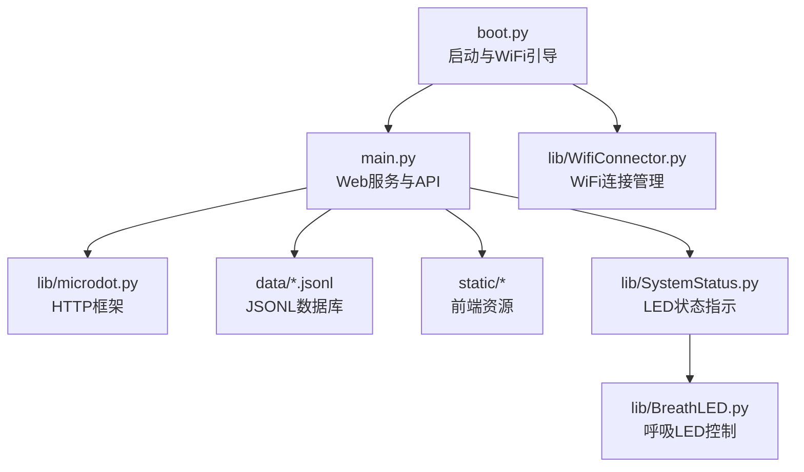
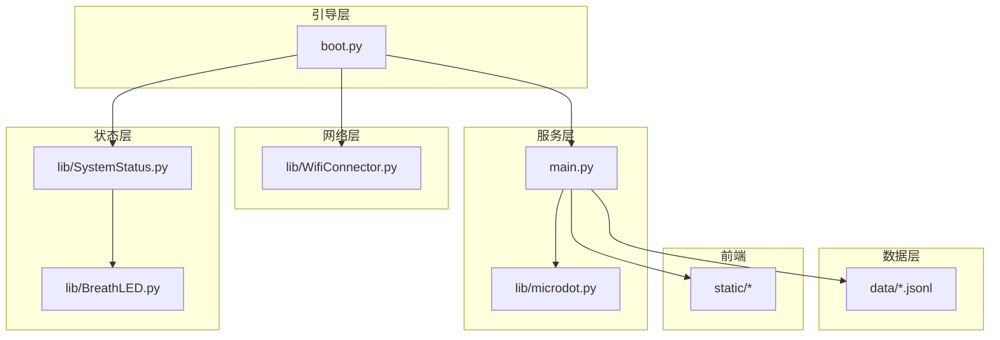
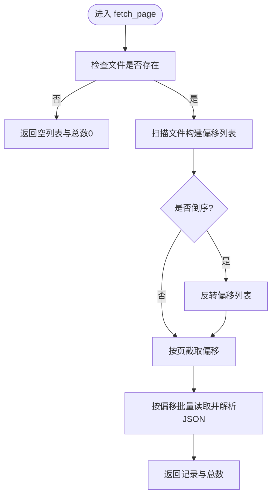
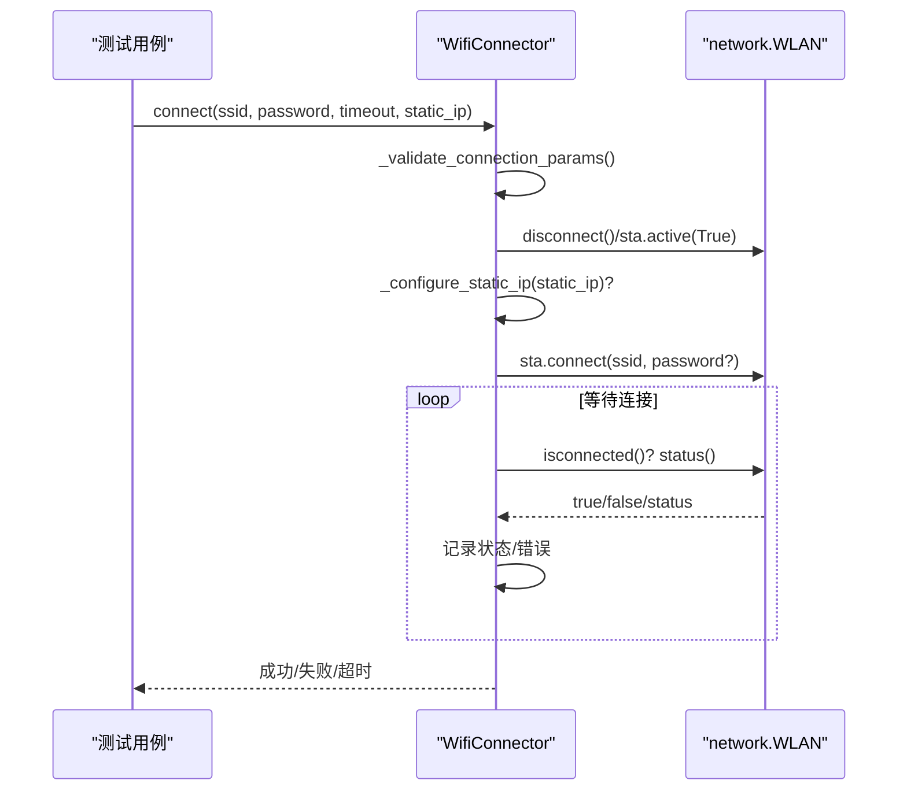
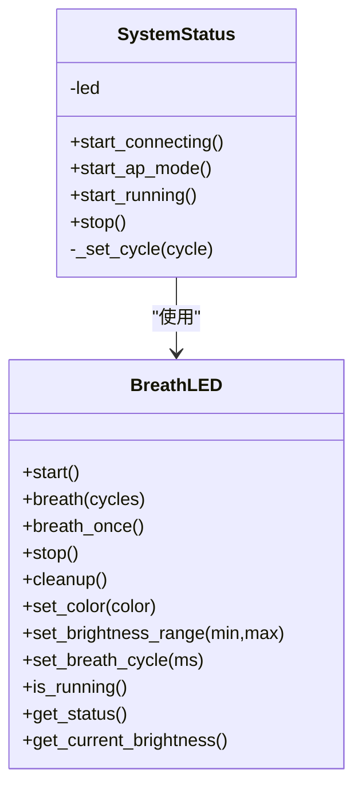
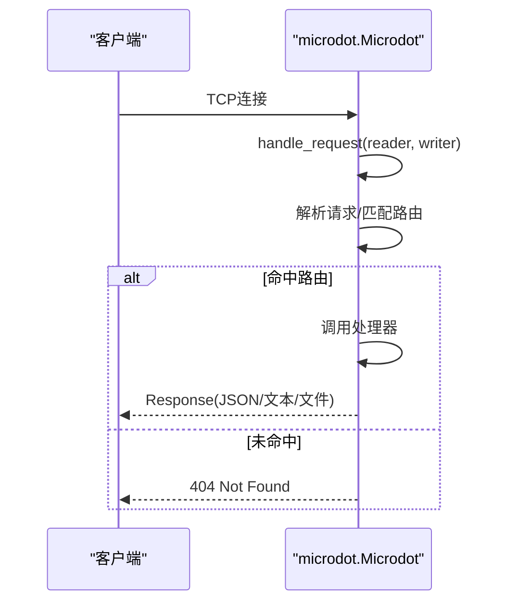
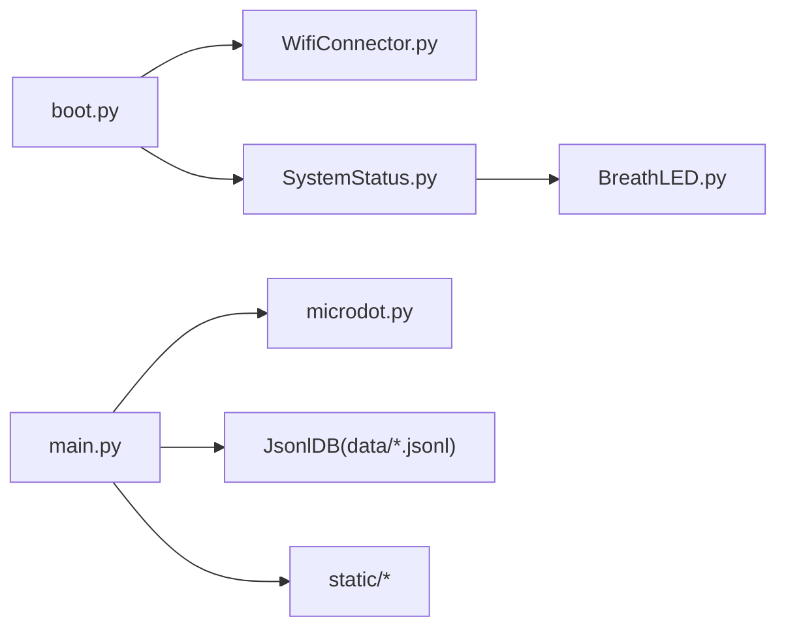

# 测试策略

<cite>
**本文引用的文件**
- [boot.py](file://boot.py)
- [main.py](file://main.py)
- [SystemStatus.py](file://lib/SystemStatus.py)
- [WifiConnector.py](file://lib/WifiConnector.py)
- [microdot.py](file://lib/microdot.py)
- [config.json](file://data/config.json)
- [settings.json](file://data/settings.json)
- [members.jsonl](file://data/members.jsonl)
- [poems.jsonl](file://data/poems.jsonl)
- [WifiConnector_README.md](file://lib/WifiConnector_README.md)
- [BreathLED_README.md](file://lib/BreathLED_README.md)
</cite>

## 目录
1. [简介](#简介)
2. [项目结构](#项目结构)
3. [核心组件](#核心组件)
4. [架构总览](#架构总览)
5. [详细组件分析](#详细组件分析)
6. [依赖分析](#依赖分析)
7. [性能考虑](#性能考虑)
8. [故障排查指南](#故障排查指南)
9. [结论](#结论)
10. [附录](#附录)

## 简介
本测试策略面向“围炉诗社·理事台”项目，覆盖单元测试、集成测试、性能测试与ESP32环境下的自动化测试与持续集成建议。重点围绕以下方面展开：
- 单元测试：针对数据库访问层（JsonlDB）、网络连接（WifiConnector）、系统状态指示（SystemStatus）、Web框架（microdot）等模块进行隔离测试与Mock。
- 集成测试：验证WiFi连接流程、系统状态LED联动、API路由与数据一致性、前端静态资源服务等端到端行为。
- 性能测试：内存使用监控（ESP32 GC与内存统计）、响应时间测试（API路由与静态资源）、并发请求压力评估。
- ESP32测试：串口调试、日志分析、断点与异常捕获、OTA/文件系统稳定性验证。
- 自动化与CI：本地与云端流水线、覆盖率与回归测试、部署前质量门禁。

## 项目结构
项目采用“模块化+数据文件”的组织方式：
- 启动与入口：boot.py负责WiFi初始化与AP回退、引导main.py启动Web服务。
- Web服务：main.py提供REST API与静态资源路由，基于lib/microdot.py实现轻量HTTP处理。
- 硬件状态：lib/SystemStatus.py与lib/BreathLED.py共同管理LED状态指示。
- 网络连接：lib/WifiConnector.py封装STA/AP、扫描、连接、热点、静态IP等能力。
- 数据存储：data/*.jsonl为各业务实体的JSONL数据库，main.py提供读写与分页检索。

图表来源
- [boot.py](file://boot.py#L1-L122)
- [main.py](file://main.py#L1-L548)
- [WifiConnector.py](file://lib/WifiConnector.py#L1-L800)
- [microdot.py](file://lib/microdot.py#L1-L183)
- [SystemStatus.py](file://lib/SystemStatus.py#L1-L61)

章节来源
- [boot.py](file://boot.py#L1-L122)
- [main.py](file://main.py#L1-L548)

## 核心组件
- JsonlDB：封装JSONL文件的增删改查、分页、搜索、迁移与事务式更新（临时文件重写）。
- WifiConnector：STA/AP管理、扫描、连接、重连、热点创建、静态IP配置与切换、诊断与持久化。
- SystemStatus：基于BreathLED的LED状态指示（连接中/AP模式/运行中）。
- microdot：轻量HTTP框架，支持路由注册、请求解析、响应写出与静态文件发送。
- 启动流程：boot.py加载配置、连接WiFi（失败则进入AP模式）、启动main.py并打印系统状态。

章节来源
- [main.py](file://main.py#L53-L267)
- [WifiConnector.py](file://lib/WifiConnector.py#L11-L120)
- [SystemStatus.py](file://lib/SystemStatus.py#L19-L61)
- [microdot.py](file://lib/microdot.py#L94-L165)
- [boot.py](file://boot.py#L14-L122)

## 架构总览
系统由“引导层（boot）—服务层（main）—网络层（WifiConnector）—状态层（SystemStatus/BreathLED）—数据层（JSONL）—前端（static）”构成。API路由与静态资源由microdot驱动，数据访问通过JsonlDB抽象，网络与LED状态通过外部模块提供。

图表来源
- [boot.py](file://boot.py#L1-L122)
- [main.py](file://main.py#L17-L30)
- [microdot.py](file://lib/microdot.py#L94-L165)
- [WifiConnector.py](file://lib/WifiConnector.py#L11-L120)
- [SystemStatus.py](file://lib/SystemStatus.py#L19-L61)
- [BreathLED.py](file://lib/BreathLED.py#L11-L120)

## 详细组件分析

### 组件A：JsonlDB（数据库访问层）
- 职责：封装JSONL文件的增删改查、分页、搜索、ID自增、全量加载、迁移兼容。
- 关键路径：
  - append：追加记录到文件尾。
  - fetch_page：按页返回记录，支持搜索与倒序；无搜索时先扫描偏移再定位读取，提升性能。
  - update：通过临时文件重写实现原子更新。
  - delete：通过临时文件重写实现原子删除。
  - get_max_id：扫描文件获取最大ID。
  - get_all：小数据集全量加载。
- Mock策略：
  - 使用unittest.mock.patch将open、os.stat、os.rename等替换为可控实现。
  - 构造内存文件句柄（io.BytesIO）模拟文件读写。
  - 验证异常分支（文件不存在、权限错误、JSON解析失败）。
- 测试用例设计要点：
  - 基础CRUD与边界条件（空文件、单行、多行）。
  - 分页与搜索组合（正向与反向、大小写、字段过滤）。
  - 原子性（update/delete临时文件存在性与原子替换）。
  - 迁移逻辑（.json到.jsonl）。

图表来源
- [main.py](file://main.py#L113-L186)

章节来源
- [main.py](file://main.py#L53-L267)

### 组件B：WifiConnector（网络连接与热点）
- 职责：STA连接、AP创建、扫描、重连、静态IP配置与切换、诊断与持久化。
- 关键路径：
  - connect：参数校验、断开旧连接、可选静态IP配置、等待连接完成、状态机轮询、错误状态识别。
  - create_hotspot：配置AP参数与IP，启动AP接口。
  - reconnect/forget_network/disconnect/cleanup：连接生命周期管理。
  - get_*_info/get_diagnostics：网络状态与诊断。
- Mock策略：
  - 使用unittest.mock.patch替换network.WLAN、time.sleep、ubinascii.hexlify等。
  - 替换sta.ifconfig、sta.connect、sta.isconnected、sta.status等接口行为。
  - 构造不同连接状态（成功、超时、错误）与异常场景（内部错误、MAC解析失败）。
- 测试用例设计要点：
  - 连接成功/失败/超时/错误状态（密码错误、未找到AP、连接失败）。
  - 静态IP配置有效性与切换（IP格式、网关推断、DNS校验）。
  - 重连与凭据管理（保存/忘记/重载）。
  - 热点创建与客户端查询（活跃状态、客户端数量、MAC格式）。
  - 诊断与错误日志（last_error、状态描述、信号质量）。

图表来源
- [WifiConnector.py](file://lib/WifiConnector.py#L595-L696)

章节来源
- [WifiConnector.py](file://lib/WifiConnector.py#L11-L800)
- [WifiConnector_README.md](file://lib/WifiConnector_README.md#L1-L418)

### 组件C：SystemStatus 与 BreathLED（LED状态指示）
- 职责：SystemStatus基于BreathLED控制单LED呼吸周期（连接中/AP/运行中），提供统一接口。
- 关键路径：
  - start_connecting/start_ap_mode/start_running：设置呼吸周期并启动。
  - stop：停止LED并清理资源。
  - BreathLED：支持WS2812与普通LED，提供breath(cycles)/breath_once/start/stop/cleanup。
- Mock策略：
  - 使用unittest.mock.patch替换machine.Pin、neopixel.NeoPixel、PWM、Timer等。
  - 替换math.sin、gc.collect等以控制时序与内存。
- 测试用例设计要点：
  - 呼吸周期与亮度范围（最小/最大、16位PWM精度）。
  - 精确次数控制（breath(cycles)自动停止）。
  - 优先级与累加（start与breath的交互）。
  - 资源清理（stop/cleanup后Pin/Timers释放）。

图表来源
- [SystemStatus.py](file://lib/SystemStatus.py#L19-L61)
- [BreathLED.py](file://lib/BreathLED.py#L11-L120)

章节来源
- [SystemStatus.py](file://lib/SystemStatus.py#L1-L61)
- [BreathLED.py](file://lib/BreathLED.py#L1-L633)
- [BreathLED_README.md](file://lib/BreathLED_README.md#L1-L442)

### 组件D：microdot（Web框架）
- 职责：注册路由、解析请求、生成响应、发送静态文件。
- 关键路径：
  - route装饰器注册URL与处理器。
  - handle_request：读取请求、匹配路由、调用处理器、序列化响应。
  - run：异步启动服务器。
- Mock策略：
  - 使用unittest.mock.patch替换uasyncio.start_server、writer/read等。
  - 构造Reader/Writer对象模拟网络I/O。
- 测试用例设计要点：
  - 路由匹配（精确匹配与静态文件前缀）。
  - 请求解析（方法、路径、查询参数、JSON体）。
  - 响应生成（文本/JSON/文件流）。
  - 错误处理（404/500、异常捕获与日志）。

图表来源
- [microdot.py](file://lib/microdot.py#L104-L165)

章节来源
- [microdot.py](file://lib/microdot.py#L1-L183)

### 组件E：启动与引导（boot.py）
- 职责：加载配置、连接WiFi（失败进入AP）、启动main.py、打印系统状态。
- 关键路径：
  - load_config：读取data/config.json。
  - connect_wifi：根据配置连接或进入AP模式。
  - start_ap：创建热点并打印信息。
  - 引导main并设置LED状态。
- Mock策略：
  - 使用unittest.mock.patch替换open、os.listdir、network.WLAN、time.sleep等。
  - 替换wifi.connect/create_hotspot行为与返回值。
- 测试用例设计要点：
  - 配置缺失/错误处理。
  - 连接成功/失败/重试与AP回退。
  - 文件系统存在性与静态资源目录检查。
  - 引导后LED状态与系统信息打印。

章节来源
- [boot.py](file://boot.py#L14-L122)

## 依赖分析
- 组件耦合：
  - boot.py依赖WifiConnector与SystemStatus，间接依赖BreathLED。
  - main.py依赖microdot、JsonlDB、SystemStatus（可选）。
  - WifiConnector依赖network、ubinascii、ujson、time。
  - SystemStatus依赖BreathLED。
- 外部依赖：
  - ESP32 MicroPython标准库（network、machine、uasyncio、ujson等）。
  - 文件系统（data/*.jsonl、static/*）。
- 潜在风险：
  - 网络异常与文件系统异常的边界处理。
  - LED与定时器资源竞争与清理。
  - 静态IP配置与DHCP切换的原子性。

图表来源
- [boot.py](file://boot.py#L5-L12)
- [main.py](file://main.py#L10-L17)
- [WifiConnector.py](file://lib/WifiConnector.py#L6-L11)
- [SystemStatus.py](file://lib/SystemStatus.py#L10-L11)

章节来源
- [boot.py](file://boot.py#L1-L122)
- [main.py](file://main.py#L1-L548)

## 性能考虑
- 内存监控：
  - 使用main.py中的print_system_status打印自由内存（gc.mem_free）。
  - 在关键路径前后采集内存，观察GC触发与峰值。
- 响应时间：
  - 对API路由（/api/poems、/api/members等）进行基准测试，记录P50/P95。
  - 静态资源（/static/style.css、/static/app.js）响应时间。
- 并发与压力：
  - 使用microdot的run进行并发请求压测，观察连接数与错误率。
- 优化建议：
  - JsonlDB分页读取避免全量加载；搜索路径仅在需要时启用。
  - 静态IP配置减少DHCP波动带来的重连成本。
  - LED更新间隔与呼吸周期参数平衡CPU占用与视觉效果。

[本节为通用指导，无需列出章节来源]

## 故障排查指南
- WiFi连接失败：
  - 检查config.json配置与网络扫描结果。
  - 使用WifiConnector.get_diagnostics与get_last_error定位错误。
  - 观察连接状态机（密码错误/未找到AP/连接失败）。
- LED不工作：
  - 检查SystemStatus初始化与BreathLED硬件初始化。
  - 确认引脚与LED类型配置。
- API异常：
  - 捕获main.py中的异常并记录错误堆栈。
  - 检查JsonlDB写入异常与文件权限。
- 日志与串口：
  - 启用debug模式输出详细日志。
  - 使用串口监视器观察引导、连接、LED状态与API响应。

章节来源
- [WifiConnector.py](file://lib/WifiConnector.py#L135-L148)
- [SystemStatus.py](file://lib/SystemStatus.py#L25-L31)
- [main.py](file://main.py#L279-L294)

## 结论
本测试策略通过“单元—集成—性能—ESP32环境—自动化与CI”的分层设计，覆盖项目关键路径与风险点。建议优先完成核心模块（JsonlDB、WifiConnector、microdot）的单元测试与集成测试，随后开展性能与稳定性测试，并结合ESP32环境进行串口调试与日志分析，最终建立自动化流水线保障质量门禁。

[本节为总结性内容，无需列出章节来源]

## 附录

### A. 单元测试编写方法与Mock清单
- JsonlDB
  - Mock：open、os.stat、os.rename、json.loads/dumps。
  - 关注：空文件、单行、多行、异常、临时文件存在性。
- WifiConnector
  - Mock：network.WLAN、ubinascii.hexlify、time.sleep。
  - 关注：连接成功/失败/超时、静态IP配置、热点创建、诊断。
- microdot
  - Mock：uasyncio.start_server、writer、reader。
  - 关注：路由匹配、JSON/文本/文件响应、错误处理。
- SystemStatus/BreathLED
  - Mock：machine.Pin、neopixel.NeoPixel、PWM、Timer。
  - 关注：呼吸周期、亮度范围、精确次数控制、资源清理。

章节来源
- [main.py](file://main.py#L53-L267)
- [WifiConnector.py](file://lib/WifiConnector.py#L11-L800)
- [microdot.py](file://lib/microdot.py#L1-L183)
- [SystemStatus.py](file://lib/SystemStatus.py#L1-L61)
- [BreathLED.py](file://lib/BreathLED.py#L1-L633)

### B. 集成测试策略
- 端到端流程：
  - 引导阶段：boot.py加载配置、连接WiFi、启动main.py。
  - API阶段：调用/api/*接口，验证返回与数据一致性。
  - 静态资源：访问/static/*，验证内容与MIME类型。
  - LED联动：连接成功后LED进入运行态，AP模式进入中速呼吸。
- 关键场景：
  - 配置缺失：进入AP模式。
  - 连接失败：重试与AP回退。
  - 数据库写入：创建/更新/删除后查询验证。
  - 热点创建：验证IP、认证模式、客户端数量。

章节来源
- [boot.py](file://boot.py#L22-L122)
- [main.py](file://main.py#L299-L540)

### C. 性能测试指导
- 内存使用：
  - 在关键API前后调用print_system_status，记录gc.mem_free。
  - 观察分页与搜索对内存的影响。
- 响应时间：
  - 使用ab/curl/wrk对/api/*与静态资源进行基准测试。
  - 记录P50/P95延迟与吞吐。
- 并发压力：
  - 使用microdot.run并发请求，观察错误率与资源占用。

章节来源
- [main.py](file://main.py#L279-L294)
- [microdot.py](file://lib/microdot.py#L154-L165)

### D. ESP32环境测试
- 串口调试：
  - 启用debug模式输出详细日志。
  - 使用串口监视器观察引导、连接、LED状态。
- 日志分析：
  - 关注连接状态描述、错误信息、网络信息同步。
  - 分析LED呼吸周期与CPU占用的关系。
- 断点与异常：
  - 在关键路径设置断点（连接、写入、LED控制）。
  - 捕获异常并记录堆栈信息。

章节来源
- [boot.py](file://boot.py#L100-L122)
- [WifiConnector.py](file://lib/WifiConnector.py#L135-L148)
- [SystemStatus.py](file://lib/SystemStatus.py#L34-L50)

### E. 自动化测试与持续集成建议
- 本地测试：
  - 使用unittest或pytest（需适配MicroPython环境）。
  - 通过unittest.mock进行模块隔离测试。
- 云端CI：
  - 使用GitHub Actions/GitLab CI，配置ESP32工具链与测试矩阵。
  - 覆盖单元测试、集成测试、性能基线与覆盖率。
- 质量门禁：
  - 设定失败阈值（错误率、P95延迟、内存峰值）。
  - 通过PR检查与发布前审批。

[本节为通用建议，无需列出章节来源]