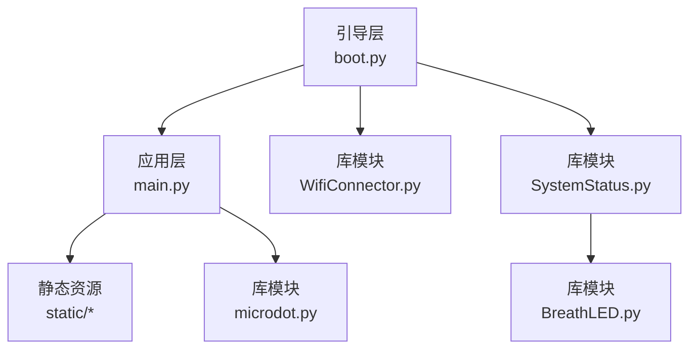
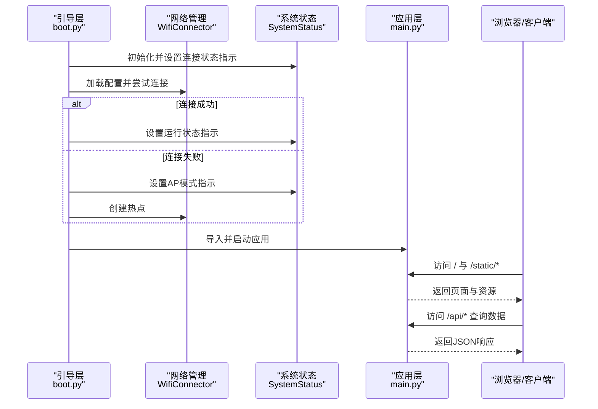
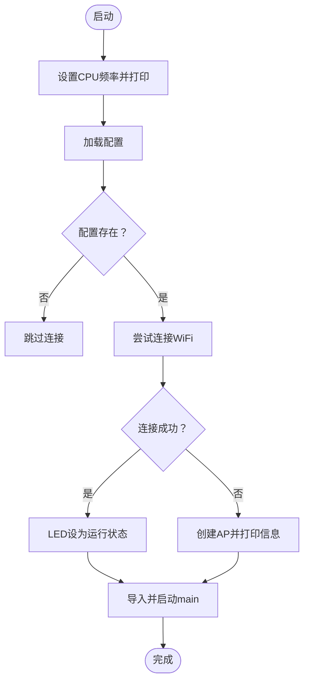
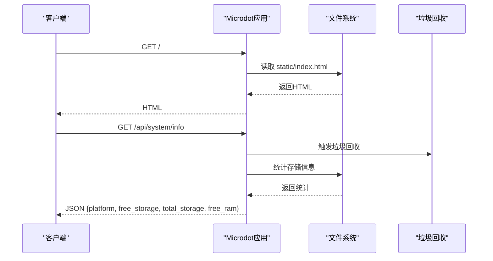
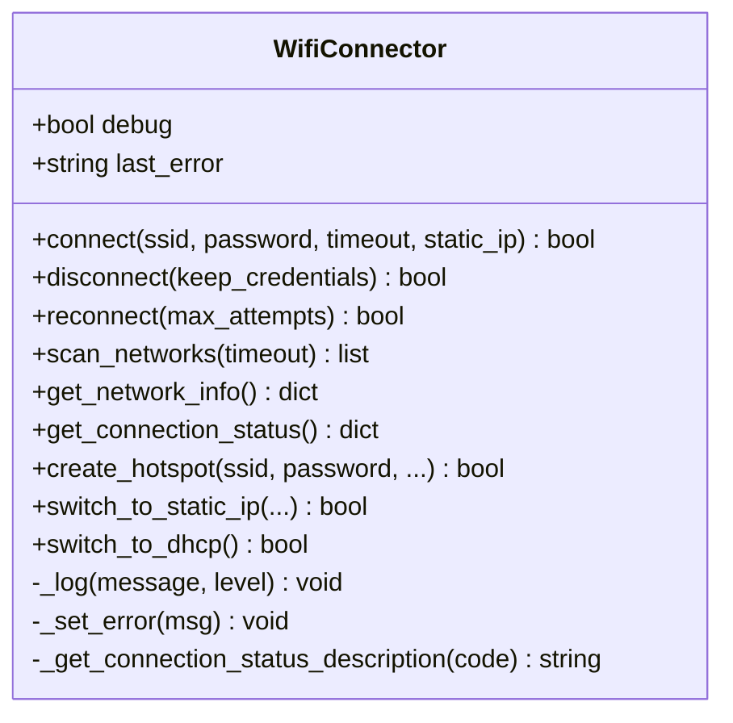
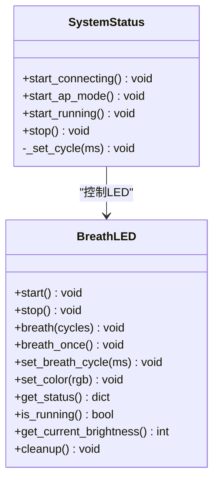
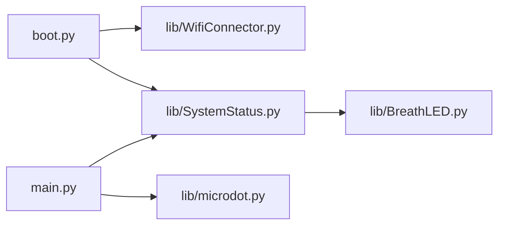

# 调试技巧

<cite>
**本文引用的文件**   
- [boot.py](file://boot.py)
- [main.py](file://main.py)
- [WifiConnector.py](file://lib/WifiConnector.py)
- [WifiConnector_min.py](file://lib/WifiConnector_min.py)
- [SystemStatus.py](file://lib/SystemStatus.py)
- [BreathLED.py](file://lib/BreathLED.py)
- [wifi_connector_example.py](file://lib/wifi_connector_example.py)
- [breath_led_example.py](file://lib/breath_led_example.py)
- [config.json](file://data/config.json)
- [index.html](file://static/index.html)
</cite>

## 目录
1. [简介](#简介)
2. [项目结构](#项目结构)
3. [核心组件](#核心组件)
4. [架构总览](#架构总览)
5. [详细组件分析](#详细组件分析)
6. [依赖分析](#依赖分析)
7. [性能考虑](#性能考虑)
8. [故障排查指南](#故障排查指南)
9. [结论](#结论)
10. [附录](#附录)

## 简介
本指南面向“围炉诗社·理事台”项目的开发者与运维人员，提供系统化的调试方法与技巧。内容覆盖：
- 串口调试输出与日志级别控制
- MicroPython 调试工具与断点、变量检查实践
- 常见问题诊断：WiFi 连接失败、内存不足、网络超时
- 系统状态与 LED 指示灯含义解析
- 性能分析与内存泄漏检测方法

## 项目结构
项目采用“引导层 + 应用层 + 库模块 + 前端静态资源”的分层组织方式：
- 引导层：boot.py 负责启动阶段的 WiFi 连接、AP 模式降级、LED 状态指示与应用入口
- 应用层：main.py 提供 Web API 与前端静态资源服务
- 库模块：WifiConnector、SystemStatus、BreathLED 等复用组件
- 前端静态资源：HTML/CSS/JS 位于 static/ 目录

图表来源
- [boot.py](file://boot.py#L1-L122)
- [main.py](file://main.py#L1-L17)

章节来源
- [boot.py](file://boot.py#L1-L122)
- [main.py](file://main.py#L1-L17)

## 核心组件
- 引导与网络：boot.py 使用 WifiConnector 进行 WiFi 连接与 AP 降级，并通过 SystemStatus 控制 LED 状态
- Web 应用：main.py 基于 microdot 提供 REST API 与静态资源服务，内置系统状态查询接口
- 网络管理：WifiConnector 提供扫描、连接、重连、热点创建、静态/DHCP 切换等能力
- 系统状态与指示灯：SystemStatus 通过 BreathLED 控制单 LED 的呼吸周期，反映连接、AP、运行三种状态
- 示例与诊断：lib 下的示例程序可用于验证功能与收集诊断信息

章节来源
- [boot.py](file://boot.py#L1-L122)
- [main.py](file://main.py#L1-L17)
- [WifiConnector.py](file://lib/WifiConnector.py#L1-L120)
- [SystemStatus.py](file://lib/SystemStatus.py#L1-L61)
- [BreathLED.py](file://lib/BreathLED.py#L1-L120)

## 架构总览
下图展示了启动流程、网络连接与 LED 指示的关系，以及应用层对外提供服务的路径。

图表来源
- [boot.py](file://boot.py#L22-L122)
- [WifiConnector.py](file://lib/WifiConnector.py#L595-L799)
- [SystemStatus.py](file://lib/SystemStatus.py#L33-L58)
- [main.py](file://main.py#L299-L540)

## 详细组件分析

### 组件一：引导与启动流程（boot.py）
- CPU 频率设置与调试输出
- WiFi 连接与 AP 降级策略
- 文件系统检查与延时提示
- 启动应用并设置 LED 状态

图表来源
- [boot.py](file://boot.py#L8-L122)

章节来源
- [boot.py](file://boot.py#L8-L122)

### 组件二：Web 应用与系统状态（main.py）
- 导入与异常处理
- 静态资源路由
- API 路由与业务逻辑
- 系统状态查询接口（存储、内存）

图表来源
- [main.py](file://main.py#L17-L17)
- [main.py](file://main.py#L278-L540)

章节来源
- [main.py](file://main.py#L1-L17)
- [main.py](file://main.py#L278-L540)

### 组件三：WiFi 连接管理（WifiConnector）
- 日志统一输出（调试开关）
- 连接参数校验、状态描述
- 连接流程与错误处理
- 网络信息同步与诊断

图表来源
- [WifiConnector.py](file://lib/WifiConnector.py#L11-L120)
- [WifiConnector.py](file://lib/WifiConnector.py#L595-L799)

章节来源
- [WifiConnector.py](file://lib/WifiConnector.py#L11-L120)
- [WifiConnector.py](file://lib/WifiConnector.py#L595-L799)

### 组件四：系统状态与 LED 指示（SystemStatus + BreathLED）
- 单 LED 呼吸周期定义
- 状态切换：连接中、AP 模式、运行中
- BreathLED 呼吸算法与资源管理

图表来源
- [SystemStatus.py](file://lib/SystemStatus.py#L19-L61)
- [BreathLED.py](file://lib/BreathLED.py#L11-L120)

章节来源
- [SystemStatus.py](file://lib/SystemStatus.py#L1-L61)
- [BreathLED.py](file://lib/BreathLED.py#L1-L120)

### 组件五：示例与诊断（lib 示例）
- wifi_connector_example.py：网络扫描、连接、热点、配置持久化、诊断
- breath_led_example.py：LED 呼吸演示与状态查询

章节来源
- [wifi_connector_example.py](file://lib/wifi_connector_example.py#L1-L200)
- [breath_led_example.py](file://lib/breath_led_example.py#L1-L120)

## 依赖分析
- boot.py 依赖 WifiConnector 与 SystemStatus
- main.py 依赖 microdot 与系统状态查询接口
- SystemStatus 依赖 BreathLED
- WifiConnector 依赖 network、ubinascii、ujson

图表来源
- [boot.py](file://boot.py#L1-L12)
- [main.py](file://main.py#L10-L11)
- [SystemStatus.py](file://lib/SystemStatus.py#L10-L10)
- [BreathLED.py](file://lib/BreathLED.py#L6-L9)

章节来源
- [boot.py](file://boot.py#L1-L12)
- [main.py](file://main.py#L10-L11)
- [SystemStatus.py](file://lib/SystemStatus.py#L10-L10)
- [BreathLED.py](file://lib/BreathLED.py#L6-L9)

## 性能考虑
- 内存管理
  - 在关键路径主动触发垃圾回收，降低碎片化
  - 定期检查可用内存，避免频繁大对象操作
- 网络与 I/O
  - 合理设置扫描/连接超时与重试次数
  - 静态/DHCP 模式切换需谨慎，避免频繁重连
- 前端交互
  - 避免一次性加载大量数据，采用分页与懒加载
  - 使用系统状态接口监控存储与内存，及时告警

章节来源
- [main.py](file://main.py#L278-L294)
- [main.py](file://main.py#L528-L540)
- [WifiConnector.py](file://lib/WifiConnector.py#L107-L110)

## 故障排查指南

### 一、串口调试与日志级别
- 启用调试输出
  - boot.py 中 WifiConnector 初始化时传入 debug=True
  - WifiConnector 内部通过统一日志方法输出连接状态、错误与诊断信息
- 关键日志位置
  - WiFi 连接尝试、状态轮询、错误状态描述
  - 网络信息同步、IP 模式切换、热点创建与停止
- 建议
  - 使用 USB-Serial 工具查看实时输出
  - 结合 LED 状态辅助判断：连接中/AP/运行

章节来源
- [boot.py](file://boot.py#L12-L12)
- [WifiConnector.py](file://lib/WifiConnector.py#L135-L148)
- [WifiConnector.py](file://lib/WifiConnector.py#L648-L667)

### 二、MicroPython 调试工具与断点
- 断点与变量检查
  - 在本地开发环境使用支持 MicroPython 的 IDE（如 Thonny、VS Code + MicroPython 插件）设置断点
  - 通过串口监视器观察变量与调用栈
- 常用技巧
  - 在关键函数入口打印参数与状态
  - 使用 try/except 捕获异常并打印堆栈信息
  - 对长耗时操作插入进度输出

[本节为通用指导，不直接分析具体文件]

### 三、常见问题与诊断步骤

1) WiFi 连接失败
- 现象
  - 一直显示“正在连接”，最终失败或进入 AP 模式
- 诊断步骤
  - 检查配置文件：确认 SSID/密码是否正确
  - 查看连接状态描述与错误码
  - 尝试网络扫描，确认可见性与信号强度
  - 若为密码错误或无 AP，修正配置后重试
- 相关实现
  - 连接超时、错误状态描述、重连逻辑

章节来源
- [config.json](file://data/config.json#L1-L6)
- [boot.py](file://boot.py#L22-L64)
- [WifiConnector.py](file://lib/WifiConnector.py#L648-L696)

2) 内存不足
- 现象
  - 页面加载缓慢、API 响应异常、系统状态显示可用内存极低
- 诊断步骤
  - 调用系统状态接口获取可用内存
  - 分析是否存在大对象未释放、缓存堆积
  - 在关键路径触发垃圾回收并观察变化
- 相关实现
  - 系统状态查询接口与内存打印

章节来源
- [main.py](file://main.py#L278-L294)
- [main.py](file://main.py#L528-L540)

3) 网络超时
- 现象
  - 连接在特定时间内未完成，返回超时
- 诊断步骤
  - 增加连接超时时间与重试次数
  - 检查路由器负载与干扰
  - 切换到静态 IP 或 DHCP 模式验证
- 相关实现
  - 超时参数与重试逻辑

章节来源
- [boot.py](file://boot.py#L41-L42)
- [WifiConnector.py](file://lib/WifiConnector.py#L107-L110)
- [WifiConnector.py](file://lib/WifiConnector.py#L315-L375)

4) 热点创建失败
- 现象
  - AP 模式无法启动或客户端无法连接
- 诊断步骤
  - 检查热点 SSID/密码/信道/最大客户端数
  - 查看热点 IP 配置与认证模式
  - 获取热点信息与客户端数量
- 相关实现
  - 热点创建、IP 配置、信息查询

章节来源
- [boot.py](file://boot.py#L65-L87)
- [WifiConnector.py](file://lib/WifiConnector.py#L610-L799)

### 四、系统状态与 LED 指示灯
- LED 呼吸周期
  - 正在连接：快速呼吸
  - AP 热点模式：中速呼吸
  - WiFi 运行模式：极慢呼吸
- 状态切换
  - 引导层根据连接结果设置 LED
  - 运行中可通过系统状态接口查看内存与存储

章节来源
- [SystemStatus.py](file://lib/SystemStatus.py#L20-L58)
- [boot.py](file://boot.py#L24-L118)
- [main.py](file://main.py#L278-L294)

### 五、性能分析与内存泄漏检测
- 性能分析
  - 使用系统状态接口定期采集可用内存与存储
  - 对热点功能与数据库写入操作进行压测
- 内存泄漏检测
  - 在大循环或高频操作前后对比可用内存
  - 关注未释放的大对象与全局缓存
  - 使用垃圾回收后观察内存回收效果

章节来源
- [main.py](file://main.py#L528-L540)
- [BreathLED.py](file://lib/BreathLED.py#L479-L481)

## 结论
通过结合串口日志、LED 指示、系统状态接口与示例程序，可以高效定位“围炉诗社·理事台”的网络、内存与性能问题。建议在开发与部署过程中：
- 始终开启调试输出，保留关键日志
- 合理设置超时与重试，避免阻塞
- 定期监控内存与存储，预防泄漏
- 使用示例程序进行回归验证

## 附录

### A. 关键接口与路径
- 首页与静态资源
  - GET / → 返回 index.html
  - GET /static/style.css | /static/app.js | /static/logo.png
- 系统信息
  - GET /api/system/info → 返回平台、存储、内存信息
- 前端页面
  - static/index.html 提供导航与各模块界面

章节来源
- [main.py](file://main.py#L299-L306)
- [main.py](file://main.py#L528-L540)
- [index.html](file://static/index.html#L1-L269)