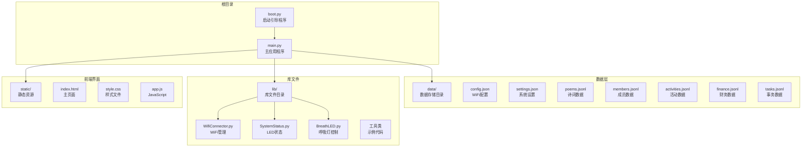
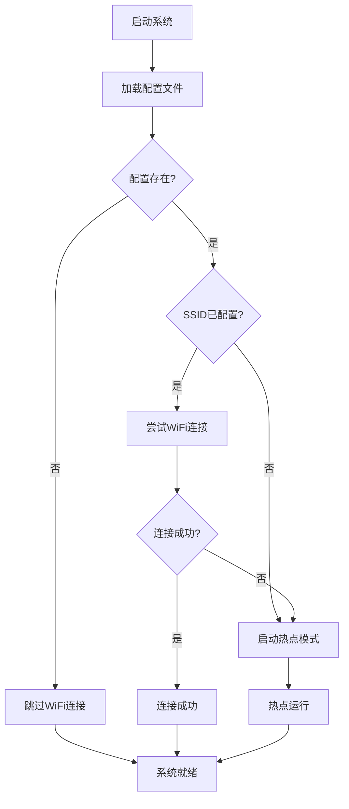
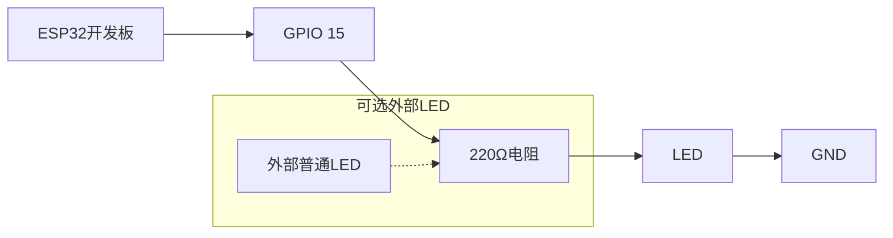
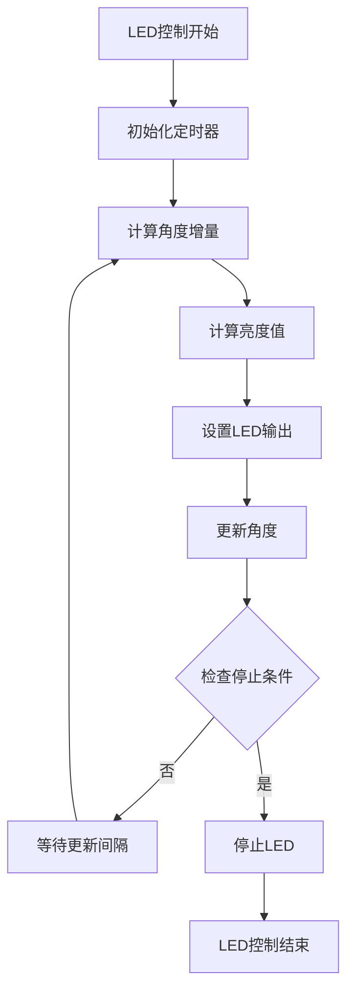
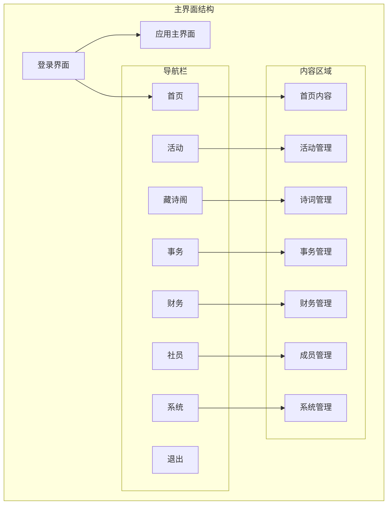

# 快速开始

<cite>
**本文档引用的文件**
- [boot.py](file://boot.py)
- [main.py](file://main.py)
- [config.json](file://data/config.json)
- [settings.json](file://data/settings.json)
- [WifiConnector.py](file://lib/WifiConnector.py)
- [SystemStatus.py](file://lib/SystemStatus.py)
- [BreathLED.py](file://lib/BreathLED.py)
- [index.html](file://static/index.html)
- [wifi_connector_example.py](file://lib/wifi_connector_example.py)
- [breath_led_example.py](file://lib/breath_led_example.py)
- [WifiConnector_README.md](file://lib/WifiConnector_README.md)
- [BreathLED_README.md](file://lib/BreathLED_README.md)
</cite>

## 目录
1. [简介](#简介)
2. [项目结构](#项目结构)
3. [硬件环境准备](#硬件环境准备)
4. [软件环境配置](#软件环境配置)
5. [WiFi配置](#wifi配置)
6. [文件系统设置](#文件系统设置)
7. [部署步骤详解](#部署步骤详解)
8. [LED状态指示系统](#led状态指示系统)
9. [Web界面使用](#web界面使用)
10. [常见问题解决](#常见问题解决)
11. [调试技巧](#调试技巧)
12. [故障排除指南](#故障排除指南)
13. [性能优化建议](#性能优化建议)
14. [总结](#总结)

## 简介

围炉诗社·理事台是一个基于ESP32的微型Web应用，专为传统诗社管理而设计。该项目集成了成员管理、活动组织、诗词创作、财务管理等核心功能，通过简洁直观的Web界面提供完整的诗社运营解决方案。

系统采用MicroPython运行时，结合轻量级的HTTP服务器和本地数据存储，实现了在资源受限环境下的高效运行。项目特别注重用户体验，通过LED状态指示系统和响应式Web界面，为用户提供清晰的操作反馈。

## 项目结构

项目采用模块化的文件组织结构，主要分为以下几个部分：



**图表来源**
- [boot.py](file://boot.py#L1-L122)
- [main.py](file://main.py#L1-L548)

**章节来源**
- [boot.py](file://boot.py#L1-L122)
- [main.py](file://main.py#L1-L548)

## 硬件环境准备

### ESP32开发板要求

围炉诗社·理事台项目对ESP32开发板有以下硬件要求：

#### 基础硬件配置
- **主控芯片**: ESP32-S2或ESP32系列
- **内存**: 至少4MB Flash存储空间
- **处理能力**: 240MHz CPU频率（项目已优化至最高性能）
- **网络接口**: 内置WiFi功能
- **GPIO引脚**: 至少1个可用的通用IO引脚（用于LED指示）

#### LED状态指示硬件
项目默认使用GPIO 15作为系统状态指示LED：
- **LED类型**: 板载LED或外部普通LED
- **连接方式**: LED正极串联限流电阻后连接到GPIO 15
- **负极**: 连接到GND
- **限流电阻**: 220Ω-330Ω（根据LED额定电流选择）

#### 开发工具准备

##### Python开发环境
- **Python版本**: Python 3.7+
- **必要的包**: 
  - esptool (用于固件烧录)
  - ampy (用于文件传输)
  - rshell (可选，用于交互式shell)

##### MicroPython固件
- **固件版本**: MicroPython v1.19.0或更高版本
- **架构支持**: ESP32-S2或ESP32架构
- **文件系统**: FAT格式，支持SPIFFS

**章节来源**
- [boot.py](file://boot.py#L8-L9)
- [SystemStatus.py](file://lib/SystemStatus.py#L27-L28)

## 软件环境配置

### 开发工具安装

#### 1. Python开发环境设置

首先安装Python 3.7+版本，然后安装必要的开发工具：

```bash
# 安装开发工具
pip install esptool ampy rshell

# 验证安装
esptool --help
ampy --help
```

#### 2. MicroPython固件烧录

##### 方法一：使用esptool（推荐）

```bash
# 1. 连接ESP32开发板到电脑
# 2. 确认串口设备
ls /dev/ttyUSB*  # Linux/Mac
dir COM*         # Windows

# 3. 烧录固件（以ESP32为例）
esptool.py --chip esp32 --port /dev/ttyUSB0 --baud 460800 erase_flash
esptool.py --chip esp32 --port /dev/ttyUSB0 --baud 460800 write_flash -z 0x1000 micropython-firmware.bin

# 4. 验证烧录结果
screen /dev/ttyUSB0 115200
```

##### 方法二：使用官方烧录工具

下载并安装ESP32烧录工具：
- 访问ESP32官方网站获取最新固件
- 使用烧录工具配置端口、波特率和固件路径
- 点击烧录按钮完成固件写入

#### 3. 文件系统格式化

首次使用前需要格式化文件系统：

```bash
# 使用esptool格式化
esptool.py --chip esp32 --port /dev/ttyUSB0 --baud 460800 erase_flash

# 或使用ampy格式化
ampy --port /dev/ttyUSB0 --baud 115200 put empty_file.txt
```

**章节来源**
- [boot.py](file://boot.py#L1-L122)

## WiFi配置

### 配置文件设置

WiFi配置存储在`data/config.json`文件中，包含以下关键参数：

#### 基础配置参数

| 参数名 | 类型 | 描述 | 默认值 |
|--------|------|------|--------|
| `wifi_ssid` | 字符串 | WiFi网络名称 | "YOUR_WIFI_SSID" |
| `wifi_password` | 字符串 | WiFi密码 | "" |
| `ap_ssid` | 字符串 | 热点网络名称 | "PoetrySociety_AP" |
| `ap_password` | 字符串 | 热点密码 | "admin1234" |

#### 配置文件示例

```json
{
    "wifi_ssid": "leilei-ja",
    "wifi_password": "lei67837729",
    "ap_ssid": "围炉诗社小热点",
    "ap_password": "weilu2018"
}
```

### WiFi连接流程

系统采用智能连接策略，自动处理连接失败的情况：



**图表来源**
- [boot.py](file://boot.py#L22-L64)

### WiFi连接参数优化

系统对WiFi连接进行了多项优化：

#### 连接超时设置
- **默认连接超时**: 15秒
- **最大重试次数**: 3次
- **连接超时可配置**: 支持动态调整

#### 热点配置参数
- **默认IP地址**: 192.168.18.1
- **子网掩码**: 255.255.255.0
- **网关IP**: 192.168.18.1
- **DNS服务器**: 8.8.8.8

**章节来源**
- [boot.py](file://boot.py#L31-L64)
- [WifiConnector.py](file://lib/WifiConnector.py#L595-L696)

## 文件系统设置

### 数据文件结构

项目使用JSON Lines (JSONL) 格式存储数据，每行一条记录：

#### 数据文件格式

| 文件名 | 数据类型 | 描述 |
|--------|----------|------|
| `poems.jsonl` | 诗词数据 | 存储诗社成员创作的诗词作品 |
| `members.jsonl` | 成员数据 | 存储诗社成员基本信息 |
| `activities.jsonl` | 活动数据 | 存储诗社组织的各种活动 |
| `finance.jsonl` | 财务数据 | 存储诗社财务收支记录 |
| `tasks.jsonl` | 事务数据 | 存储诗社日常事务和任务 |

#### JSONL数据格式示例

```json
{"id": 1, "title": "春日吟", "content": "春风十里不如你", "type": "绝句", "date": "2026-01-01"}
{"id": 2, "name": "李白", "phone": "13800000000", "role": "member", "points": 0}
{"id": 3, "title": "春游活动", "desc": "踏青赏花", "date": "2026-01-15", "location": "公园"}
{"id": 4, "type": "income", "amount": 100, "summary": "会费收入", "handler": "张三"}
{"id": 5, "title": "采购文房四宝", "status": "open", "reward": 10}
```

### 文件系统权限

系统需要以下文件权限：

#### 必需文件
- `boot.py`: 系统启动引导程序
- `main.py`: 主应用程序
- `data/config.json`: WiFi配置文件
- `data/settings.json`: 系统设置文件

#### 可选文件
- `data/poems.jsonl`: 诗词数据文件
- `data/members.jsonl`: 成员数据文件
- `data/activities.jsonl`: 活动数据文件
- `data/finance.jsonl`: 财务数据文件
- `data/tasks.jsonl`: 事务数据文件

**章节来源**
- [main.py](file://main.py#L262-L267)
- [config.json](file://data/config.json#L1-L6)

## 部署步骤详解

### 第一步：硬件连接

1. **连接ESP32开发板**
   - 使用USB数据线连接电脑和ESP32开发板
   - 确认开发板指示灯正常闪烁

2. **LED连接（可选）**
   - 将LED正极通过220Ω电阻连接到GPIO 15
   - LED负极连接到GND

3. **电源检查**
   - 确认开发板供电正常
   - 观察开发板指示灯状态

### 第二步：固件烧录

1. **准备固件文件**
   - 下载适合的MicroPython固件
   - 确认固件版本兼容性

2. **烧录固件**
   ```bash
   # 选择正确的串口设备
   ls /dev/ttyUSB*
   
   # 烧录固件
   esptool.py --chip esp32 --port /dev/ttyUSB0 --baud 460800 \
   write_flash -z 0x1000 micropython-esp32.bin
   ```

3. **验证烧录**
   - 打开串口监视器
   - 设置波特率为115200
   - 观察启动信息

### 第三步：文件系统初始化

1. **格式化文件系统**
   ```bash
   esptool.py --chip esp32 --port /dev/ttyUSB0 --baud 460800 erase_flash
   ```

2. **上传项目文件**
   ```bash
   # 上传核心文件
   ampy --port /dev/ttyUSB0 put boot.py
   ampy --port /dev/ttyUSB0 put main.py
   
   # 上传库文件
   ampy --port /dev/ttyUSB0 put lib/WifiConnector.py
   ampy --port /dev/ttyUSB0 put lib/SystemStatus.py
   ampy --port /dev/ttyUSB0 put lib/BreathLED.py
   
   # 创建数据目录
   ampy --port /dev/ttyUSB0 mkdir data
   ampy --port /dev/ttyUSB0 mkdir static
   ampy --port /dev/ttyUSB0 mkdir lib
   ```

3. **上传配置文件**
   ```bash
   # 上传配置文件
   ampy --port /dev/ttyUSB0 put data/config.json
   ampy --port /dev/ttyUSB0 put data/settings.json
   
   # 上传静态资源
   ampy --port /dev/ttyUSB0 put static/index.html
   ampy --port /dev/ttyUSB0 put static/style.css
   ampy --port /dev/ttyUSB0 put static/app.js
   ```

### 第四步：WiFi配置

1. **编辑配置文件**
   ```json
   {
       "wifi_ssid": "你的WiFi名称",
       "wifi_password": "你的WiFi密码",
       "ap_ssid": "围炉诗社热点",
       "ap_password": "12345678"
   }
   ```

2. **上传配置文件**
   ```bash
   ampy --port /dev/ttyUSB0 put data/config.json
   ```

### 第五步：系统启动

1. **重启开发板**
   ```bash
   ampy --port /dev/ttyUSB0 reset
   ```

2. **观察启动过程**
   - 观察LED指示灯状态
   - 查看串口输出信息
   - 等待系统初始化完成

3. **验证系统状态**
   - LED应显示稳定的呼吸状态
   - 系统应在80端口提供Web服务
   - 可通过浏览器访问系统

### 第六步：Web界面访问

1. **获取IP地址**
   - 通过串口监视器查看系统IP地址
   - 或在路由器管理界面查看设备列表

2. **访问Web界面**
   ```
   http://[设备IP地址]:80
   ```

3. **初始登录**
   - 默认管理员账户：admin/admin
   - 首次登录后建议修改密码

**章节来源**
- [boot.py](file://boot.py#L88-L122)
- [main.py](file://main.py#L541-L548)

## LED状态指示系统

### 系统LED状态设计

围炉诗社·理事台采用单LED状态指示系统，通过不同的呼吸模式传达系统状态：

#### LED状态模式

| 状态 | 呼吸周期 | LED行为 | 说明 |
|------|----------|---------|------|
| **正在连接** | 500ms | 快速呼吸 | WiFi连接中 |
| **AP热点模式** | 1500ms | 中速呼吸 | 热点已启动 |
| **运行中** | 4000ms | 极慢呼吸 | 系统正常运行 |

#### 硬件连接



**图表来源**
- [SystemStatus.py](file://lib/SystemStatus.py#L27-L28)

### 状态指示实现

#### 系统状态类

```python
class SystemStatus:
    def __init__(self):
        # 初始化LED控制器
        self.led = BreathLED(pin=15, led_type='normal', max_brightness=1023, breath_cycle=500)
    
    def start_connecting(self):
        """设置快速呼吸 - 正在连接状态"""
        self._set_cycle(500)
    
    def start_ap_mode(self):
        """设置中速呼吸 - 热点模式"""
        self._set_cycle(1500)
    
    def start_running(self):
        """设置慢速呼吸 - 系统运行状态"""
        self._set_cycle(4000)
```

#### LED控制算法

系统使用正弦波算法实现平滑的呼吸效果：



**图表来源**
- [BreathLED.py](file://lib/BreathLED.py#L304-L339)

**章节来源**
- [SystemStatus.py](file://lib/SystemStatus.py#L19-L61)
- [BreathLED.py](file://lib/BreathLED.py#L1-L633)

## Web界面使用

### 界面布局结构

围炉诗社·理事台采用现代化的响应式Web界面设计：



**图表来源**
- [index.html](file://static/index.html#L23-L172)

### 核心功能模块

#### 1. 成员管理模块

- **成员列表**: 显示所有诗社成员信息
- **成员注册**: 新成员信息录入
- **角色管理**: 管理员、理事、普通成员权限
- **积分系统**: 成员贡献积分统计

#### 2. 活动管理模块

- **活动发布**: 发起诗社活动
- **活动报名**: 成员在线报名
- **活动状态**: 活动进度跟踪
- **活动统计**: 活动参与情况统计

#### 3. 诗词管理模块

- **诗词创作**: 成员在线创作诗词
- **诗词收藏**: 诗词作品管理
- **诗词分类**: 按体裁、风格分类
- **诗词搜索**: 按关键词搜索

#### 4. 财务管理模块

- **收支记录**: 财务收支明细
- **财务报表**: 月度、年度财务报告
- **预算管理**: 活动预算控制
- **费用分摊**: 活动费用分摊

#### 5. 事务管理模块

- **任务分配**: 日常事务分配
- **任务跟踪**: 任务完成进度
- **积分奖励**: 任务完成积分奖励
- **事务统计**: 事务完成情况统计

**章节来源**
- [index.html](file://static/index.html#L109-L172)

## 常见问题解决

### 硬件连接问题

#### 问题1：ESP32无法识别

**症状**: 电脑无法识别ESP32开发板

**解决方案**:
1. 检查USB数据线是否为数据线（非充电线）
2. 确认驱动程序已正确安装
3. 尝试不同的USB端口
4. 检查开发板电源指示灯

#### 问题2：LED不亮

**症状**: 系统LED不显示任何状态

**解决方案**:
1. 检查LED连接是否正确
2. 验证限流电阻阻值（220Ω-330Ω）
3. 确认GPIO 15引脚未被其他功能占用
4. 检查LED正负极连接

### 固件烧录问题

#### 问题3：烧录失败

**症状**: esptool报错，无法烧录固件

**解决方案**:
1. 确认选择了正确的芯片类型
2. 检查串口端口配置
3. 确保开发板处于下载模式
4. 降低烧录速度（460800波特率）

#### 问题4：文件传输失败

**症状**: ampy命令执行失败

**解决方案**:
1. 确认文件系统已正确格式化
2. 检查串口连接稳定性
3. 验证文件路径和权限
4. 重新启动开发板

### WiFi连接问题

#### 问题5：无法连接WiFi

**症状**: 系统反复尝试连接但失败

**解决方案**:
1. 检查WiFi配置文件中的SSID和密码
2. 确认WiFi信号强度足够
3. 验证WiFi密码正确性
4. 尝试重启路由器

#### 问题6：热点无法启动

**症状**: 系统启动后无法创建热点

**解决方案**:
1. 检查AP配置参数
2. 确认WiFi模块正常工作
3. 验证热点密码长度（至少8位）
4. 检查IP地址冲突

### Web界面问题

#### 问题7：无法访问Web界面

**症状**: 浏览器无法打开系统界面

**解决方案**:
1. 确认系统已完全启动
2. 检查设备IP地址获取
3. 验证防火墙设置
4. 尝试使用不同浏览器

#### 问题8：页面加载缓慢

**症状**: Web界面响应迟缓

**解决方案**:
1. 检查网络连接质量
2. 清理浏览器缓存
3. 减少同时访问的用户数量
4. 优化静态资源加载

**章节来源**
- [boot.py](file://boot.py#L22-L64)
- [WifiConnector.py](file://lib/WifiConnector.py#L595-L696)

## 调试技巧

### 串口调试

#### 启用调试输出

系统在启动时会输出详细的调试信息：

```python
# 在boot.py中启用调试
wifi = WifiConnector(debug=True)
```

#### 常用调试命令

```bash
# 打开串口监视器
screen /dev/ttyUSB0 115200

# 查看系统状态
>>> import network
>>> wlan = network.WLAN(network.STA_IF)
>>> print(wlan.isconnected())
>>> print(wlan.ifconfig())

# 检查文件系统
>>> import os
>>> print(os.listdir())
```

### 状态监控

#### 系统状态查询

```python
# 在main.py中添加状态查询
def print_system_status():
    print("-" * 50)
    print("系统状态信息")
    print("-" * 50)
    try:
        wlan_sta = network.WLAN(network.STA_IF)
        if wlan_sta.active() and wlan_sta.isconnected():
            ifconf = wlan_sta.ifconfig()
            print(f"WiFi IP: {ifconf[0]}")
    except: pass
    try:
        import gc
        gc.collect() 
        print(f"可用内存: {gc.mem_free()/1024:.2f} KB")
    except: pass
    print("-" * 50)
```

#### LED状态监控

```python
# 检查LED状态
>>> from lib.SystemStatus import status_led
>>> status_led.led.get_status()
```

### 性能分析

#### 内存使用监控

```python
import gc
print(f"已用内存: {gc.mem_alloc()/1024:.2f} KB")
print(f"可用内存: {gc.mem_free()/1024:.2f} KB")
```

#### 网络性能监控

```python
# 检查WiFi连接状态
>>> import network
>>> sta = network.WLAN(network.STA_IF)
>>> print(sta.status())
```

**章节来源**
- [boot.py](file://boot.py#L11-L12)
- [main.py](file://main.py#L279-L294)

## 故障排除指南

### 系统启动故障

#### 启动失败排查

1. **检查启动文件**
   - 确认boot.py和main.py文件完整性
   - 验证文件编码格式（UTF-8）
   - 检查语法错误

2. **内存不足问题**
   ```python
   import gc
   gc.collect()
   print(f"可用内存: {gc.mem_free()}")
   ```

3. **文件系统损坏**
   ```bash
   # 重新格式化文件系统
   import os
   os.umount("/")
   # 重新挂载文件系统
   ```

#### 网络连接故障

1. **WiFi连接失败**
   - 检查WiFi配置文件
   - 验证路由器状态
   - 尝试重新连接

2. **热点功能异常**
   - 检查热点配置参数
   - 验证密码长度
   - 确认IP地址段可用

### 数据存储故障

#### JSONL文件损坏

1. **数据文件修复**
   ```python
   # 检查数据文件完整性
   import os
   try:
       os.stat('data/poems.jsonl')
       print("文件存在")
   except OSError:
       print("文件不存在，创建新文件")
   ```

2. **数据迁移**
   - 从旧格式迁移数据
   - 验证数据完整性
   - 清理临时文件

#### 存储空间不足

```python
import os
statvfs_result = os.statvfs('/')
print(f"总空间: {statvfs_result[0]*statvfs_result[2]/(1024*1024):.2f} MB")
print(f"可用空间: {statvfs_result[0]*statvfs_result[3]/(1024*1024):.2f} MB")
```

### Web服务故障

#### HTTP服务异常

1. **端口占用**
   ```bash
   # 检查端口占用
   import socket
   sock = socket.socket(socket.AF_INET, socket.SOCK_STREAM)
   result = sock.connect_ex(('localhost', 80))
   if result == 0:
       print("端口80被占用")
   else:
       print("端口80可用")
   sock.close()
   ```

2. **静态文件缺失**
   - 检查static目录完整性
   - 验证文件权限
   - 重新上传静态资源

#### API接口故障

```python
# 测试API接口
import urequests
response = urequests.get('http://localhost/api/system/info')
print(response.json())
response.close()
```

**章节来源**
- [main.py](file://main.py#L528-L540)
- [boot.py](file://boot.py#L88-L122)

## 性能优化建议

### 硬件优化

#### 电源管理

1. **电源稳定性**
   - 使用稳定的5V电源
   - 避免电源纹波干扰
   - 考虑添加滤波电容

2. **GPIO保护**
   - 添加限流电阻保护LED
   - 使用TVS管防静电
   - 考虑添加保险丝

#### 热管理

1. **散热设计**
   - 确保ESP32有足够的散热空间
   - 避免长时间高负载运行
   - 考虑添加散热片

### 软件优化

#### 内存优化

1. **垃圾回收**
   ```python
   import gc
   gc.enable()
   gc.collect()
   ```

2. **对象复用**
   - 复用数据库连接
   - 缓存常用数据
   - 及时释放大对象

#### 网络优化

1. **连接池**
   - 复用WiFi连接
   - 避免频繁重连
   - 使用连接保持

2. **数据压缩**
   - 压缩传输数据
   - 分页加载大数据
   - 缓存静态资源

#### 文件系统优化

1. **文件操作优化**
   ```python
   # 批量写入文件
   with open('data.jsonl', 'a') as f:
       for record in batch_records:
           f.write(json.dumps(record) + '\n')
   ```

2. **数据索引**
   - 为常用查询字段建立索引
   - 使用内存映射文件
   - 优化文件读取顺序

### 系统监控

#### 性能指标监控

```python
import time
import gc

def monitor_performance():
    start_time = time.time()
    start_memory = gc.mem_free()
    
    # 执行性能测试代码
    
    end_time = time.time()
    end_memory = gc.mem_free()
    
    print(f"执行时间: {end_time - start_time:.2f}秒")
    print(f"内存消耗: {start_memory - end_memory}字节")
```

#### 资源使用监控

```python
def resource_monitor():
    import os
    import network
    
    statvfs_result = os.statvfs('/')
    wlan = network.WLAN(network.STA_IF)
    
    print(f"文件系统使用率: {statvfs_result[0]*statvfs_result[2]/(statvfs_result[0]*statvfs_result[3]):.1%}")
    print(f"WiFi状态: {'连接' if wlan.isconnected() else '未连接'}")
```

**章节来源**
- [main.py](file://main.py#L279-L294)
- [boot.py](file://boot.py#L8-L9)

## 总结

围炉诗社·理事台项目为传统诗社管理提供了一个完整、易用的数字化解决方案。通过精心设计的硬件连接、完善的软件架构和直观的用户界面，项目实现了在资源受限环境下的高效运行。

### 项目优势

1. **易于部署**: 完整的快速开始指南，支持即插即用
2. **功能完整**: 涵盖诗社管理的核心业务需求
3. **用户体验**: 响应式界面设计，操作简便直观
4. **扩展性强**: 模块化架构，便于功能扩展
5. **成本低廉**: 基于开源技术栈，部署成本低

### 技术特色

1. **智能WiFi管理**: 自动连接、热点切换、配置持久化
2. **状态可视化**: LED指示系统提供清晰的状态反馈
3. **数据持久化**: JSONL格式存储，保证数据可靠性
4. **Web服务**: 轻量级HTTP服务器，支持远程访问
5. **资源优化**: 针对ESP32平台的性能优化

### 未来发展方向

1. **移动端支持**: 开发原生移动应用
2. **云同步**: 支持云端数据备份和同步
3. **语音交互**: 集成语音识别和合成技术
4. **物联网集成**: 支持更多传感器和执行器
5. **AI辅助**: 利用AI技术提供智能推荐和分析

通过遵循本快速开始指南，您可以在最短时间内成功部署围炉诗社·理事台系统，为传统诗社的数字化转型提供强有力的技术支撑。