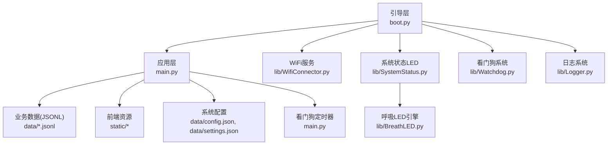
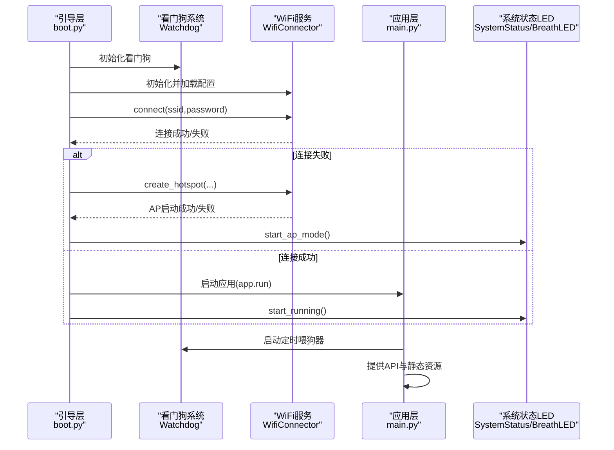
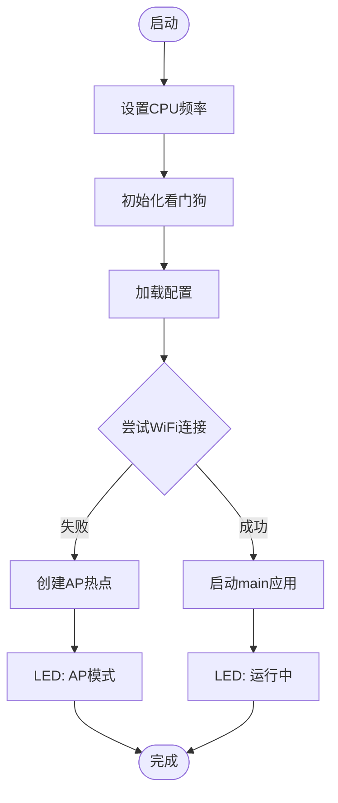
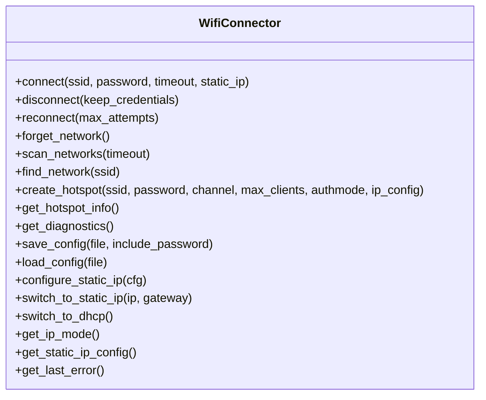
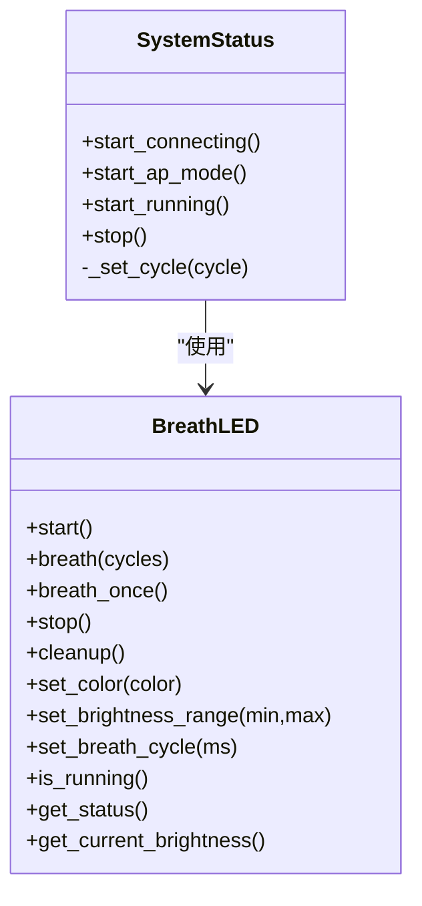
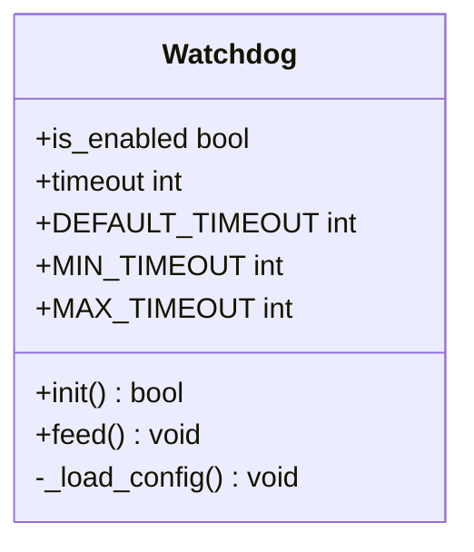
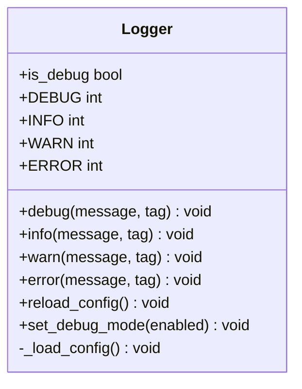
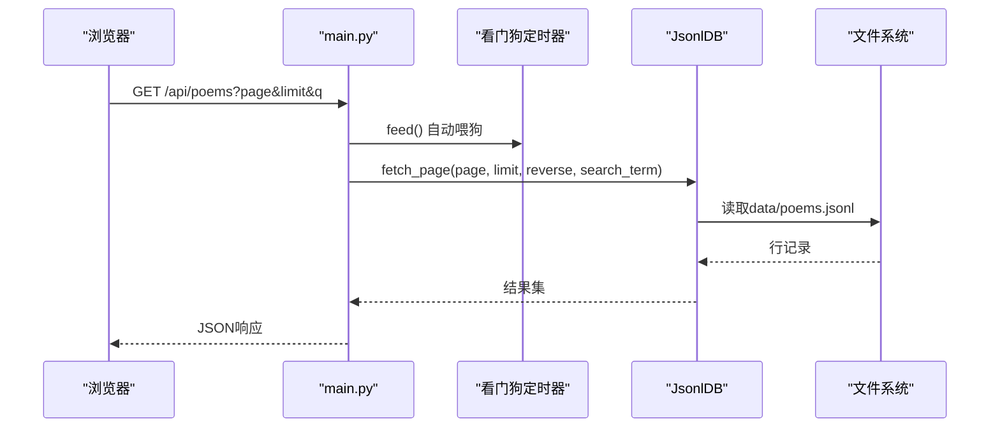
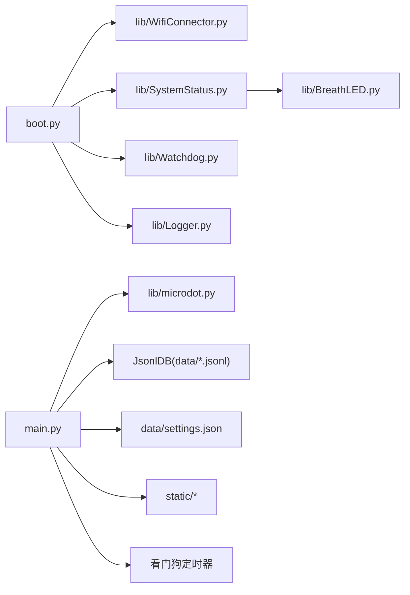

# 故障排除

<cite>
**本文引用的文件**
- [boot.py](file://src/boot.py)
- [main.py](file://src/main.py)
- [Watchdog.py](file://src/lib/Watchdog.py)
- [Logger.py](file://src/lib/Logger.py)
- [WifiConnector.py](file://src/lib/WifiConnector.py)
- [SystemStatus.py](file://src/lib/SystemStatus.py)
- [BreathLED.py](file://src/lib/BreathLED.py)
- [config.json](file://src/data/config.json)
- [settings.json](file://src/data/settings.json)
- [index.html](file://src/static/index.html)
</cite>

## 目录
1. [简介](#简介)
2. [项目结构](#项目结构)
3. [核心组件](#核心组件)
4. [架构总览](#架构总览)
5. [详细组件分析](#详细组件分析)
6. [依赖分析](#依赖分析)
7. [性能考虑](#性能考虑)
8. [故障排除指南](#故障排除指南)
9. [结论](#结论)
10. [附录](#附录)

## 简介
本手册面向"围炉诗社·理事台"项目，提供系统化的故障排除方法，覆盖WiFi连接问题、系统启动故障、网络配置错误、硬件兼容性问题、**新增的日志分析与看门狗故障排除**、调试工具使用、性能问题定位、紧急恢复与数据修复流程，以及问题报告与反馈机制。内容结合代码结构与实际实现，帮助开发者与运维人员快速定位并解决问题。

## 项目结构
项目采用"引导层 + 应用层 + 系统服务库"的分层组织：
- 引导层：boot.py 负责系统启动、WiFi连接与AP模式切换、LED状态指示、应用入口启动、**看门狗初始化**。
- 应用层：main.py 提供Web API与前端静态资源路由，承载业务数据库（JSONL）与系统状态查询，**集成看门狗定时喂狗器**。
- 系统服务库：lib/WifiConnector.py 提供WiFi连接、热点、诊断与配置持久化；lib/SystemStatus.py 与 lib/BreathLED.py 提供LED状态指示与呼吸效果；**lib/Watchdog.py 实现硬件看门狗机制；lib/Logger.py 提供日志级别控制**。
- 数据与配置：data/ 目录存放各业务JSONL数据与系统配置；static/ 提供前端页面与资源。

**图表来源**
- [boot.py](file://src/boot.py#L1-L153)
- [main.py](file://src/main.py#L1-L1789)
- [Watchdog.py](file://src/lib/Watchdog.py#L1-L119)
- [Logger.py](file://src/lib/Logger.py#L1-L128)
- [WifiConnector.py](file://src/lib/WifiConnector.py#L1-L800)
- [SystemStatus.py](file://src/lib/SystemStatus.py#L1-L61)
- [BreathLED.py](file://src/lib/BreathLED.py#L1-L633)
- [config.json](file://src/data/config.json#L1-L1)

**章节来源**
- [boot.py](file://src/boot.py#L1-L153)
- [main.py](file://src/main.py#L1-L1789)

## 核心组件
- 引导与启动：boot.py 负责CPU频率设置、WiFi连接尝试、AP模式降级、LED状态指示、应用启动与系统状态打印，**集成看门狗初始化**。
- WiFi连接：lib/WifiConnector.py 提供网络扫描、连接、重连、断开、热点创建、静态IP配置、诊断与配置持久化。
- 系统状态LED：lib/SystemStatus.py 与 lib/BreathLED.py 提供单LED呼吸指示（连接/AP/运行三种模式）。
- **看门狗系统**：lib/Watchdog.py 实现硬件看门狗机制，防止系统锁死，支持配置文件加载、超时控制、定时喂狗。
- **日志系统**：lib/Logger.py 提供轻量级日志管理器，支持调试模式控制、日志级别分级、配置文件加载。
- Web应用与API：main.py 提供静态资源路由、业务API（Poems/Members/Activities/Tasks/Finance）、系统信息查询，**集成看门狗定时喂狗器**。
- 数据与配置：data/ 目录下各业务JSONL文件与系统配置文件，负责数据持久化与系统行为控制。

**章节来源**
- [boot.py](file://src/boot.py#L1-L153)
- [Watchdog.py](file://src/lib/Watchdog.py#L1-L119)
- [Logger.py](file://src/lib/Logger.py#L1-L128)
- [WifiConnector.py](file://src/lib/WifiConnector.py#L1-L800)
- [SystemStatus.py](file://src/lib/SystemStatus.py#L1-L61)
- [BreathLED.py](file://src/lib/BreathLED.py#L1-L633)
- [main.py](file://src/main.py#L1-L1789)
- [config.json](file://src/data/config.json#L1-L1)
- [settings.json](file://src/data/settings.json#L1-L1)

## 架构总览
系统启动顺序与交互如下：
- boot.py 初始化WiFi连接器、加载配置、**初始化看门狗**、尝试连接WiFi，失败则进入AP模式；随后启动main应用并打印系统状态。
- main.py 提供HTTP服务，路由静态资源与业务API；业务数据以JSONL形式存储，settings.json提供系统设置；**启动看门狗定时喂狗器**。
- WiFi服务由WifiConnector统一管理，支持连接、重连、热点、诊断与配置持久化。
- SystemStatus与BreathLED共同提供LED状态指示，区分连接中、AP模式、运行中三种状态。
- **Watchdog提供硬件看门狗保护，防止系统长时间无响应导致死锁**。
- **Logger提供灵活的日志级别控制，支持调试模式动态切换**。

**图表来源**
- [boot.py](file://src/boot.py#L13-L15)
- [boot.py](file://src/boot.py#L28-L105)
- [Watchdog.py](file://src/lib/Watchdog.py#L57-L80)
- [main.py](file://src/main.py#L39-L48)
- [WifiConnector.py](file://src/lib/WifiConnector.py#L595-L760)
- [SystemStatus.py](file://src/lib/SystemStatus.py#L33-L46)

## 详细组件分析

### 组件A：引导与启动流程（boot.py）
- CPU频率设置与调试输出。
- **看门狗初始化**：在启动早期初始化硬件看门狗，确保系统安全。
- 配置加载与WiFi连接尝试，失败则进入AP模式。
- LED状态指示：连接中、AP模式、运行中。
- 应用启动与系统状态打印。

**图表来源**
- [boot.py](file://src/boot.py#L10-L153)

**章节来源**
- [boot.py](file://src/boot.py#L10-L153)

### 组件B：WiFi连接与热点管理（lib/WifiConnector.py）
- 网络扫描与连接：支持超时、重试、状态监控与诊断。
- 静态IP管理：配置、验证、切换、便捷访问器。
- 热点创建与管理：IP配置、客户端管理、配置持久化。
- 资源管理：断开、忘记网络、清理。

**图表来源**
- [WifiConnector.py](file://src/lib/WifiConnector.py#L11-L800)

**章节来源**
- [WifiConnector.py](file://src/lib/WifiConnector.py#L11-L800)

### 组件C：系统状态LED（lib/SystemStatus.py 与 lib/BreathLED.py）
- SystemStatus：封装单LED呼吸周期，提供连接中、AP模式、运行中三种状态。
- BreathLED：通用LED呼吸引擎，支持WS2812与普通LED，提供精确次数控制、自动停止、优先级管理等。

**图表来源**
- [SystemStatus.py](file://src/lib/SystemStatus.py#L19-L61)
- [BreathLED.py](file://src/lib/BreathLED.py#L11-L633)

**章节来源**
- [SystemStatus.py](file://src/lib/SystemStatus.py#L19-L61)
- [BreathLED.py](file://src/lib/BreathLED.py#L11-L633)

### 组件D：看门狗系统（lib/Watchdog.py）
- **硬件看门狗管理器**：实现单例模式，提供看门狗初始化、喂狗、状态查询功能。
- **配置加载**：从config.json加载watchdog_enabled和watchdog_timeout配置。
- **超时控制**：支持10-300秒的超时范围，防止系统长时间无响应。
- **安全机制**：WDT一旦启用就无法停止，直到下次重启。

**图表来源**
- [Watchdog.py](file://src/lib/Watchdog.py#L17-L119)

**章节来源**
- [Watchdog.py](file://src/lib/Watchdog.py#L17-L119)

### 组件E：日志系统（lib/Logger.py）
- **轻量级日志管理器**：实现单例模式，提供调试模式控制、日志级别分级。
- **日志级别**：DEBUG、INFO、WARN、ERROR四个级别，支持动态切换。
- **配置加载**：从config.json加载debug_mode配置，支持运行时更新。

**图表来源**
- [Logger.py](file://src/lib/Logger.py#L29-L128)

**章节来源**
- [Logger.py](file://src/lib/Logger.py#L29-L128)

### 组件F：Web应用与API（main.py）
- 静态资源路由：index.html、style.css、app.js、logo.png。
- 业务API：Poems、Members、Activities、Tasks、Finance、登录、系统信息。
- **看门狗定时喂狗器**：每30秒自动喂狗，防止空闲超时。
- 数据模型：JsonlDB（JSONL数据库），支持追加、更新、删除、分页检索、迁移旧JSON。

**图表来源**
- [main.py](file://src/main.py#L27-L29)
- [main.py](file://src/main.py#L544-L567)
- [main.py](file://src/main.py#L1777-L1778)

**章节来源**
- [main.py](file://src/main.py#L27-L29)
- [main.py](file://src/main.py#L544-L567)
- [main.py](file://src/main.py#L1777-L1778)

## 依赖分析
- boot.py 依赖 WifiConnector、SystemStatus、**Watchdog、Logger**。
- main.py 依赖 microdot（HTTP框架）、JsonlDB（数据访问）、**Watchdog、Logger**、network/time/os/gc 等。
- WifiConnector 依赖 network、ubinascii、ujson、time。
- SystemStatus 依赖 BreathLED。
- **Watchdog 依赖 machine、json、gc**。
- **Logger 依赖 json、gc**。
- 前端 index.html 依赖 static/app.js 与 style.css。

**图表来源**
- [boot.py](file://src/boot.py#L5-L8)
- [main.py](file://src/main.py#L12-L15)
- [Watchdog.py](file://src/lib/Watchdog.py#L13-L15)
- [Logger.py](file://src/lib/Logger.py#L12-L13)
- [WifiConnector.py](file://src/lib/WifiConnector.py#L6-L11)
- [SystemStatus.py](file://src/lib/SystemStatus.py#L10-L11)

**章节来源**
- [boot.py](file://src/boot.py#L5-L8)
- [main.py](file://src/main.py#L12-L15)

## 性能考虑
- 内存与GC：main.py 在系统状态打印与API调用前后使用 gc.collect()，有助于释放内存。
- 网络同步：WifiConnector 支持智能网络信息同步与强制同步间隔，避免频繁底层查询。
- LED更新：BreathLED 使用预计算正弦查找表与自适应更新间隔，降低CPU占用。
- JSONL读写：main.py 的JsonlDB采用逐行扫描与偏移定位，支持分页与搜索，注意大数据量时的I/O与内存压力。
- **看门狗性能**：定时喂狗器使用独立的Timer(1)，避免与LED呼吸效果冲突，喂狗间隔30秒留足安全裕度。
- **日志性能**：Logger支持调试模式控制，DEBUG级别日志仅在debug_mode=True时输出，减少生产环境日志开销。

**章节来源**
- [main.py](file://src/main.py#L289-L294)
- [WifiConnector.py](file://src/lib/WifiConnector.py#L253-L326)
- [BreathLED.py](file://src/lib/BreathLED.py#L72-L89)
- [main.py](file://src/main.py#L113-L186)
- [main.py](file://src/main.py#L42-L47)
- [Logger.py](file://src/lib/Logger.py#L74-L76)

## 故障排除指南

### 一、WiFi连接问题
常见症状
- 设备无法连接到路由器，反复尝试失败。
- 连接后无法获取IP或频繁掉线。
- 信号弱导致连接不稳定。

排查步骤
1. 检查配置文件
   - 确认 data/config.json 中的 wifi_ssid 与 wifi_password 是否正确。
   - 若SSID仍为默认占位符，系统将自动进入AP模式。
   - 参考：[config.json](file://src/data/config.json#L1-L1)

2. 启用调试与查看错误
   - boot.py 初始化 WifiConnector 时传入 debug=log.is_debug，可输出连接状态与错误。
   - 使用 WifiConnector.get_last_error() 获取最近错误信息。
   - 参考：[boot.py](file://src/boot.py#L17)、[WifiConnector.py](file://src/lib/WifiConnector.py#L140-L148)

3. 连接状态监控与重连
   - 使用 WifiConnector.monitor_connection() 定期监控连接状态。
   - 使用 reconnect(max_attempts) 进行自动重连。
   - 参考：[WifiConnector.py](file://src/lib/WifiConnector.py#L761-L800)

4. 静态IP与DHCP切换
   - 若网络环境需要固定IP，使用 configure_static_ip() 或 switch_to_static_ip()。
   - 使用 get_ip_mode() 检查当前IP模式（dhcp/static）。
   - 参考：[WifiConnector.py](file://src/lib/WifiConnector.py#L432-L502)、[WifiConnector.py](file://src/lib/WifiConnector.py#L197-L234)

5. 热点创建与诊断
   - 连接失败时进入AP模式，可通过 create_hotspot() 创建热点，便于本地调试。
   - 使用 get_diagnostics() 获取系统诊断信息。
   - 参考：[boot.py](file://src/boot.py#L65-L87)、[WifiConnector.py](file://src/lib/WifiConnector.py#L280-L289)

6. 日志与调试工具
   - 启动时 boot.py 会打印文件列表与等待时间，便于上传/调试。
   - 使用 wifi_connector_example.py 进行连接、扫描、热点等测试。
   - 参考：[boot.py](file://src/boot.py#L92-L103)、[wifi_connector_example.py](file://src/lib/wifi_connector_example.py#L1-L787)

**章节来源**
- [config.json](file://src/data/config.json#L1-L1)
- [boot.py](file://src/boot.py#L17)
- [WifiConnector.py](file://src/lib/WifiConnector.py#L140-L148)
- [WifiConnector.py](file://src/lib/WifiConnector.py#L761-L800)
- [WifiConnector.py](file://src/lib/WifiConnector.py#L432-L502)
- [WifiConnector.py](file://src/lib/WifiConnector.py#L197-L234)
- [boot.py](file://src/boot.py#L65-L87)
- [WifiConnector.py](file://src/lib/WifiConnector.py#L280-L289)
- [boot.py](file://src/boot.py#L92-L103)
- [wifi_connector_example.py](file://src/lib/wifi_connector_example.py#L1-L787)

### 二、系统启动故障
常见症状
- 设备启动后无响应或卡死。
- LED状态异常（不亮/常亮/闪烁异常）。
- 应用无法启动或端口占用。

排查步骤
1. CPU频率与等待
   - boot.py 设置CPU频率并打印当前频率；启动后有短暂等待时间，便于上传文件。
   - 参考：[boot.py](file://src/boot.py#L10-L12)、[boot.py](file://src/boot.py#L100-L103)

2. **看门狗初始化检查**
   - **确认看门狗是否正确初始化**：查看boot.py中watchdog.init()的输出信息。
   - **检查配置文件**：确认config.json中的watchdog_enabled和watchdog_timeout设置。
   - **参考**：[boot.py](file://src/boot.py#L13-L14)、[Watchdog.py](file://src/lib/Watchdog.py#L57-L80)、[config.json](file://src/data/config.json#L1-L1)

3. LED状态指示
   - SystemStatus 提供 start_connecting()/start_ap_mode()/start_running() 三态指示。
   - 若LED初始化失败，会打印错误信息；可通过 status_led.stop() 停止。
   - 参考：[SystemStatus.py](file://src/lib/SystemStatus.py#L25-L32)、[SystemStatus.py](file://src/lib/SystemStatus.py#L33-L46)

4. 应用启动
   - boot.py 在启动main.py后，打印系统状态并运行app；若启动失败会输出错误。
   - 参考：[boot.py](file://src/boot.py#L105-L122)、[main.py](file://src/main.py#L541-L548)

5. 文件与路径
   - boot.py 会列出根目录与static目录，确认静态资源是否存在。
   - 参考：[boot.py](file://src/boot.py#L92-L98)

**章节来源**
- [boot.py](file://src/boot.py#L10-L12)
- [boot.py](file://src/boot.py#L13-L14)
- [Watchdog.py](file://src/lib/Watchdog.py#L57-L80)
- [config.json](file://src/data/config.json#L1-L1)
- [SystemStatus.py](file://src/lib/SystemStatus.py#L25-L32)
- [SystemStatus.py](file://src/lib/SystemStatus.py#L33-L46)
- [boot.py](file://src/boot.py#L105-L122)
- [main.py](file://src/main.py#L541-L548)
- [boot.py](file://src/boot.py#L92-L98)

### 三、网络配置错误
常见症状
- 配置文件损坏或缺失。
- 静态IP配置无效或冲突。
- 热点IP与路由器网段冲突。

排查步骤
1. 配置文件校验
   - data/config.json 与 data/settings.json 格式应为合法JSON。
   - main.py 在启动时会尝试读取 settings.json；若不存在则返回空字典。
   - 参考：[main.py](file://src/main.py#L269-L277)、[settings.json](file://src/data/settings.json#L1-L1)

2. 静态IP配置
   - 使用 WifiConnector._validate_ip_address() 与 _validate_subnet_mask() 进行格式校验。
   - 使用 configure_static_ip() 或 connect_with_static_ip() 配置静态IP。
   - 参考：[WifiConnector.py](file://src/lib/WifiConnector.py#L363-L411)、[WifiConnector.py](file://src/lib/WifiConnector.py#L432-L497)

3. 热点IP配置
   - create_hotspot() 支持自定义IP配置；若与路由器网段冲突，可能导致设备无法访问。
   - 参考：[boot.py](file://src/boot.py#L72-L86)、[WifiConnector.py](file://src/lib/WifiConnector.py#L235-L279)

4. 配置持久化
   - 使用 save_config()/load_config() 保存/加载WiFi配置；注意是否包含密码。
   - 参考：[wifi_connector_example.py](file://src/lib/wifi_connector_example.py#L472-L508)

**章节来源**
- [main.py](file://src/main.py#L269-L277)
- [settings.json](file://src/data/settings.json#L1-L1)
- [WifiConnector.py](file://src/lib/WifiConnector.py#L363-L411)
- [WifiConnector.py](file://src/lib/WifiConnector.py#L432-L497)
- [boot.py](file://src/boot.py#L72-L86)
- [WifiConnector.py](file://src/lib/WifiConnector.py#L235-L279)
- [wifi_connector_example.py](file://src/lib/wifi_connector_example.py#L472-L508)

### 四、硬件兼容性问题
常见症状
- LED不工作或闪烁异常。
- WiFi模块初始化失败或报错。
- PWM频率/引脚不匹配。

排查步骤
1. LED兼容性
   - SystemStatus 默认使用GPIO 15；若硬件不同，需调整引脚。
   - BreathLED 支持WS2812与普通LED，注意引脚范围与亮度范围。
   - 参考：[SystemStatus.py](file://src/lib/SystemStatus.py#L27-L31)、[BreathLED.py](file://src/lib/BreathLED.py#L94-L169)

2. WiFi模块
   - WifiConnector 通过 network.WLAN 初始化STA/AP接口；若报"内部错误"，建议重置模块。
   - 参考：[WifiConnector.py](file://src/lib/WifiConnector.py#L341-L362)

3. 调试与示例
   - 使用 breath_led_example.py 与 wifi_connector_example.py 进行硬件与功能验证。
   - 参考：[breath_led_example.py](file://src/lib/breath_led_example.py#L1-L199)、[wifi_connector_example.py](file://src/lib/wifi_connector_example.py#L1-L787)

**章节来源**
- [SystemStatus.py](file://src/lib/SystemStatus.py#L27-L31)
- [BreathLED.py](file://src/lib/BreathLED.py#L94-L169)
- [WifiConnector.py](file://src/lib/WifiConnector.py#L341-L362)
- [breath_led_example.py](file://src/lib/breath_led_example.py#L1-L199)
- [wifi_connector_example.py](file://src/lib/wifi_connector_example.py#L1-L787)

### 五、日志分析与调试工具
- 启动日志
  - boot.py 打印CPU频率、文件列表、等待提示，便于判断启动阶段问题。
  - 参考：[boot.py](file://src/boot.py#L10-L12)、[boot.py](file://src/boot.py#L92-L103)

- **日志系统集成**
  - **Logger提供统一的日志接口**：log.debug/info/warn/error，支持标签化输出。
  - **调试模式控制**：通过config.json的debug_mode控制DEBUG级别日志输出。
  - **参考**：[Logger.py](file://src/lib/Logger.py#L72-L98)、[config.json](file://src/data/config.json#L1-L1)

- WiFi错误日志
  - WifiConnector 内部统一日志输出，错误通过 _set_error() 记录；可通过 get_last_error() 获取。
  - 参考：[WifiConnector.py](file://src/lib/WifiConnector.py#L135-L148)

- 系统状态
  - main.py 提供 print_system_status() 打印WiFi IP与内存信息。
  - 参考：[main.py](file://src/main.py#L512-L528)

- 调试示例
  - wifi_connector_example.py 与 breath_led_example.py 提供完整测试流程，便于复现与定位问题。
  - 参考：[wifi_connector_example.py](file://src/lib/wifi_connector_example.py#L1-L787)、[breath_led_example.py](file://src/lib/breath_led_example.py#L1-L199)

**章节来源**
- [boot.py](file://src/boot.py#L10-L12)
- [boot.py](file://src/boot.py#L92-L103)
- [Logger.py](file://src/lib/Logger.py#L72-L98)
- [config.json](file://src/data/config.json#L1-L1)
- [WifiConnector.py](file://src/lib/WifiConnector.py#L135-L148)
- [main.py](file://src/main.py#L512-L528)
- [wifi_connector_example.py](file://src/lib/wifi_connector_example.py#L1-L787)
- [breath_led_example.py](file://src/lib/breath_led_example.py#L1-L199)

### 六、看门狗故障排除指南
**新增** 本节专门针对看门狗系统的故障排除。

常见症状
- **系统无响应但LED仍在闪烁**：可能是看门狗超时导致的系统重启循环。
- **看门狗初始化失败**：WDT无法启动或配置加载错误。
- **看门狗超时重启**：系统在正常运行中意外重启。
- **看门狗配置无效**：watchdog_enabled或watchdog_timeout设置不生效。

排查步骤
1. **看门狗初始化检查**
   - **确认看门狗是否正确初始化**：查看boot.py中watchdog.init()的输出信息。
   - **检查看门狗状态**：使用watchdog.is_enabled属性确认看门狗是否启用。
   - **参考**：[boot.py](file://src/boot.py#L13-L14)、[Watchdog.py](file://src/lib/Watchdog.py#L93-L96)

2. **配置文件验证**
   - **检查config.json配置**：确认watchdog_enabled和watchdog_timeout设置。
   - **超时范围检查**：看门狗超时应在10-300秒范围内。
   - **参考**：[config.json](file://src/data/config.json#L1-L1)、[Watchdog.py](file://src/lib/Watchdog.py#L22-L25)

3. **看门狗初始化失败排查**
   - **检查硬件支持**：确认ESP32 MicroPython版本支持WDT功能。
   - **查看错误输出**：关注"[Watchdog] 看门狗初始化失败"等错误信息。
   - **参考**：[Watchdog.py](file://src/lib/Watchdog.py#L77-L80)

4. **看门狗超时重启问题**
   - **检查喂狗频率**：确认main.py中的定时喂狗器正常工作。
   - **检查API请求处理**：确认每次API请求都调用了watchdog.feed()。
   - **参考**：[main.py](file://src/main.py#L27-L29)、[main.py](file://src/main.py#L58)

5. **看门狗配置问题**
   - **动态配置更新**：使用Logger.reload_config()重新加载配置。
   - **检查配置加载**：确认_watchdog_timer_callback()中的配置读取逻辑。
   - **参考**：[Watchdog.py](file://src/lib/Watchdog.py#L42-L55)、[main.py](file://src/main.py#L39-L47)

6. **看门狗调试工具**
   - **手动喂狗测试**：在REPL中调用watchdog.feed()测试喂狗功能。
   - **状态查询**：使用watchdog.timeout检查当前超时设置。
   - **参考**：[Watchdog.py](file://src/lib/Watchdog.py#L93-L101)

**章节来源**
- [boot.py](file://src/boot.py#L13-L14)
- [Watchdog.py](file://src/lib/Watchdog.py#L93-L96)
- [config.json](file://src/data/config.json#L1-L1)
- [Watchdog.py](file://src/lib/Watchdog.py#L22-L25)
- [Watchdog.py](file://src/lib/Watchdog.py#L77-L80)
- [main.py](file://src/main.py#L27-L29)
- [main.py](file://src/main.py#L58)
- [Watchdog.py](file://src/lib/Watchdog.py#L42-L55)
- [main.py](file://src/main.py#L39-L47)
- [Watchdog.py](file://src/lib/Watchdog.py#L93-L101)

### 七、性能问题定位
- 内存与GC
  - main.py 在关键位置调用 gc.collect()，建议在高频API调用前后观察内存变化。
  - 参考：[main.py](file://src/main.py#L289-L292)

- LED性能
  - BreathLED 使用正弦查找表与自适应更新间隔，避免过度CPU占用；若出现闪烁抖动，可调整 UPDATE_INTERVAL_MIN 与 UPDATE_INTERVAL_DIVISOR。
  - 参考：[SystemStatus.py](file://src/lib/SystemStatus.py#L14-L18)、[BreathLED.py](file://src/lib/BreathLED.py#L54-L57)

- 网络同步
  - WifiConnector 的 sync_interval 与 force_sync_interval 控制网络信息同步频率，可根据网络稳定性调整。
  - 参考：[WifiConnector.py](file://src/lib/WifiConnector.py#L112-L115)、[WifiConnector.py](file://src/lib/WifiConnector.py#L291-L326)

- **看门狗性能优化**
  - **定时喂狗器**：使用Timer(1)避免与LED冲突，30秒喂狗间隔留足安全裕度。
  - **喂狗策略**：在API请求处理、数据备份导入等长时间操作中主动喂狗。
  - **参考**：[main.py](file://src/main.py#L42-L47)、[main.py](file://src/main.py#L1622-L1623)

- **日志性能优化**
  - **调试模式控制**：生产环境建议关闭debug_mode，减少DEBUG级别日志输出。
  - **日志级别选择**：根据问题严重程度选择INFO/WARN/ERROR级别。
  - **参考**：[Logger.py](file://src/lib/Logger.py#L74-L76)、[config.json](file://src/data/config.json#L1-L1)

**章节来源**
- [main.py](file://src/main.py#L289-L292)
- [SystemStatus.py](file://src/lib/SystemStatus.py#L14-L18)
- [BreathLED.py](file://src/lib/BreathLED.py#L54-L57)
- [WifiConnector.py](file://src/lib/WifiConnector.py#L112-L115)
- [WifiConnector.py](file://src/lib/WifiConnector.py#L291-L326)
- [main.py](file://src/main.py#L42-L47)
- [main.py](file://src/main.py#L1622-L1623)
- [Logger.py](file://src/lib/Logger.py#L74-L76)
- [config.json](file://src/data/config.json#L1-L1)

### 八、紧急恢复与数据修复
- 紧急恢复流程
  - 若应用无法启动，检查 boot.py 启动日志与 main.py 错误输出。
  - 若WiFi无法连接，进入AP模式（boot.py 已内置），使用热点访问本地服务。
  - **看门狗紧急处理**：若系统频繁重启，检查watchdog_enabled配置，必要时临时禁用看门狗进行故障排除。
  - 参考：[boot.py](file://src/boot.py#L65-L87)、[boot.py](file://src/boot.py#L105-L122)、[Watchdog.py](file://src/lib/Watchdog.py#L64-L66)

- 数据修复
  - JsonlDB 支持旧版 .json 迁移到 .jsonl；若迁移失败，检查文件权限与磁盘空间。
  - **备份导入优化**：在大数据量导入时主动喂狗，防止看门狗超时重启。
  - 参考：[main.py](file://src/main.py#L68-L84)、[main.py](file://src/main.py#L1622-L1623)

- 配置恢复
  - 使用 save_config()/load_config() 恢复WiFi配置；若配置损坏，可删除配置文件后重新配置。
  - **系统配置恢复**：通过/api/backup/export和/api/backup/import接口进行完整配置备份恢复。
  - 参考：[wifi_connector_example.py](file://src/lib/wifi_connector_example.py#L472-L508)、[main.py](file://src/main.py#L1522-L1592)

**章节来源**
- [boot.py](file://src/boot.py#L65-L87)
- [boot.py](file://src/boot.py#L105-L122)
- [Watchdog.py](file://src/lib/Watchdog.py#L64-L66)
- [main.py](file://src/main.py#L68-L84)
- [main.py](file://src/main.py#L1622-L1623)
- [wifi_connector_example.py](file://src/lib/wifi_connector_example.py#L472-L508)
- [main.py](file://src/main.py#L1522-L1592)

### 九、问题报告与反馈机制
- 问题分类
  - 硬件相关：LED、WiFi模块、引脚配置。
  - 软件相关：启动失败、API异常、数据损坏、性能问题。
  - 网络相关：连接失败、IP冲突、热点不可用。
  - **系统相关**：看门狗超时重启、日志级别配置问题、调试模式异常。

- 报告要素
  - 系统版本与固件信息（CPU频率、平台信息）。
  - 配置文件内容（脱敏处理）。
  - 日志片段（boot/main/WiFi/看门狗/日志）。
  - 复现步骤与期望/实际结果。
  - 硬件平台与引脚配置。
  - **看门狗配置与超时设置**。

- 反馈渠道
  - 仓库Issue：提供问题描述、日志与复现步骤。
  - 示例代码：附带 wifi_connector_example.py 与 breath_led_example.py 的最小复现。

**章节来源**
- [boot.py](file://src/boot.py#L92-L103)
- [main.py](file://src/main.py#L541-L548)
- [wifi_connector_example.py](file://src/lib/wifi_connector_example.py#L1-L787)
- [breath_led_example.py](file://src/lib/breath_led_example.py#L1-L199)

## 结论
本故障排除手册基于项目实际代码与配置，提供了从启动、网络、LED、API到数据与配置的全链路排查方法。**新增的看门狗和日志系统为系统稳定性提供了重要保障**。建议在日常运维中：
- 启用调试日志，定期检查系统状态与内存使用。
- 使用 WifiConnector 的监控与诊断能力，提前发现连接问题。
- **通过Watchdog的定时喂狗机制确保系统长期稳定运行**。
- **合理配置日志级别，在生产环境中避免过多DEBUG日志输出**。
- 通过示例程序快速验证硬件与功能，缩短定位时间。
- 建立问题报告模板，提升反馈效率与问题解决速度。

## 附录
- 前端页面：index.html 提供导航、搜索、各模块入口与模态框，便于本地调试与问题复现。
  - 参考：[index.html](file://src/static/index.html#L1-L269)

**章节来源**
- [index.html](file://src/static/index.html#L1-L269)