# 数据存储问题排查手册

<cite>
**本文档引用的文件**
- [main.py](file://main.py)
- [boot.py](file://boot.py)
- [lib/SystemStatus.py](file://lib/SystemStatus.py)
- [lib/WifiConnector.py](file://lib/WifiConnector.py)
- [lib/BreathLED.py](file://lib/BreathLED.py)
- [lib/microdot.py](file://lib/microdot.py)
- [data/activities.jsonl](file://data/activities.jsonl)
- [data/finance.jsonl](file://data/finance.jsonl)
- [data/members.jsonl](file://data/members.jsonl)
- [data/poems.jsonl](file://data/poems.jsonl)
- [data/tasks.jsonl](file://data/tasks.jsonl)
- [data/config.json](file://data/config.json)
- [data/settings.json](file://data/settings.json)
- [static/index.html](file://static/index.html)
</cite>

## 目录
1. [简介](#简介)
2. [项目结构](#项目结构)
3. [核心组件](#核心组件)
4. [架构概览](#架构概览)
5. [详细组件分析](#详细组件分析)
6. [依赖关系分析](#依赖关系分析)
7. [性能考虑](#性能考虑)
8. [故障排查指南](#故障排查指南)
9. [结论](#结论)
10. [附录](#附录)

## 简介

围炉诗社·理事台是一个基于ESP32的嵌入式Web应用，采用JSON Lines (JSONL) 文件作为数据存储方案。本手册专注于数据存储问题的诊断和修复，涵盖JSONL文件损坏、数据读写错误、存储空间不足和数据同步问题的完整排查流程。

该系统采用轻量级的MicroPython框架，通过自定义的JsonlDB类实现数据持久化，所有业务数据均以JSONL格式存储在data目录下，包括诗歌、成员、活动、财务和任务等核心数据表。

## 项目结构

项目采用清晰的分层架构，主要包含以下组件：

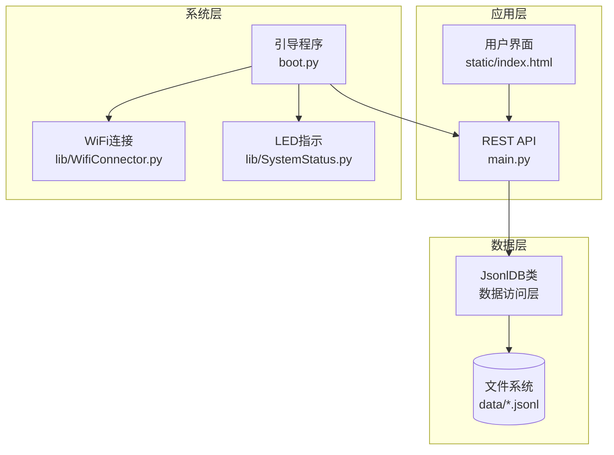

**图表来源**
- [main.py](file://main.py#L1-L548)
- [boot.py](file://boot.py#L1-L122)
- [lib/WifiConnector.py](file://lib/WifiConnector.py#L1-L1930)

**章节来源**
- [main.py](file://main.py#L1-L548)
- [boot.py](file://boot.py#L1-L122)

## 核心组件

### JsonlDB数据存储引擎

系统的核心数据存储组件是自定义的JsonlDB类，实现了完整的JSONL文件操作功能：

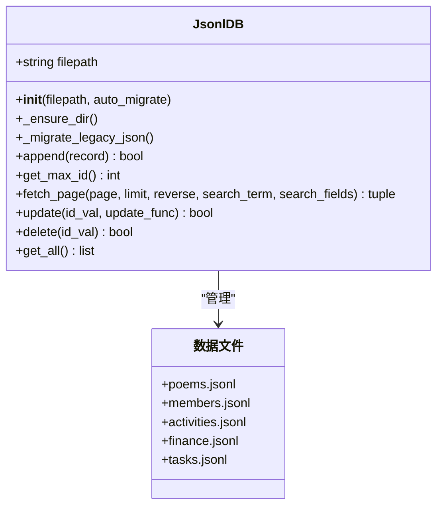

**图表来源**
- [main.py](file://main.py#L53-L267)

### 数据模型架构

系统采用标准化的JSONL数据格式，每行存储一条记录，支持以下核心实体：

| 实体类型 | 文件名 | 主要字段 | 索引键 |
|---------|--------|----------|--------|
| 诗歌 | poems.jsonl | id, title, content, author, date, type | id |
| 成员 | members.jsonl | id, name, phone, role, points, password | id, phone |
| 活动 | activities.jsonl | id, title, desc, date, location, status | id |
| 财务 | finance.jsonl | id, amount, summary, date, type, category | id |
| 任务 | tasks.jsonl | id, title, description, status, reward | id |

**章节来源**
- [main.py](file://main.py#L262-L266)
- [data/poems.jsonl](file://data/poems.jsonl#L1-L4)
- [data/members.jsonl](file://data/members.jsonl#L1-L4)
- [data/activities.jsonl](file://data/activities.jsonl#L1-L7)
- [data/finance.jsonl](file://data/finance.jsonl#L1-L3)
- [data/tasks.jsonl](file://data/tasks.jsonl#L1-L2)

## 架构概览

系统采用客户端-服务器架构，通过HTTP API提供数据服务：

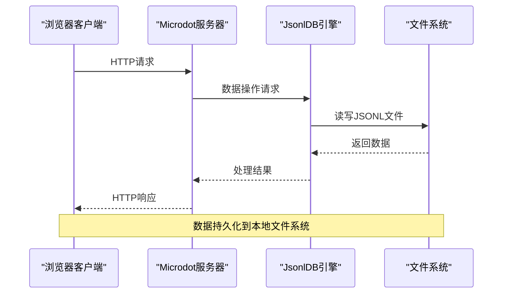

**图表来源**
- [lib/microdot.py](file://lib/microdot.py#L94-L165)
- [main.py](file://main.py#L299-L540)

## 详细组件分析

### 数据完整性检查机制

JsonlDB类内置了多重数据完整性保护机制：

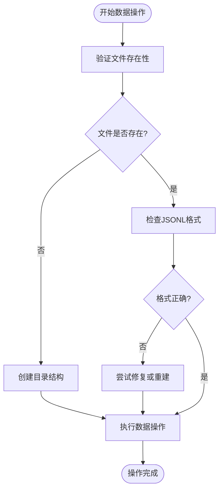

**图表来源**
- [main.py](file://main.py#L53-L120)

### 数据读写流程

系统支持高效的分页读取和全文搜索功能：

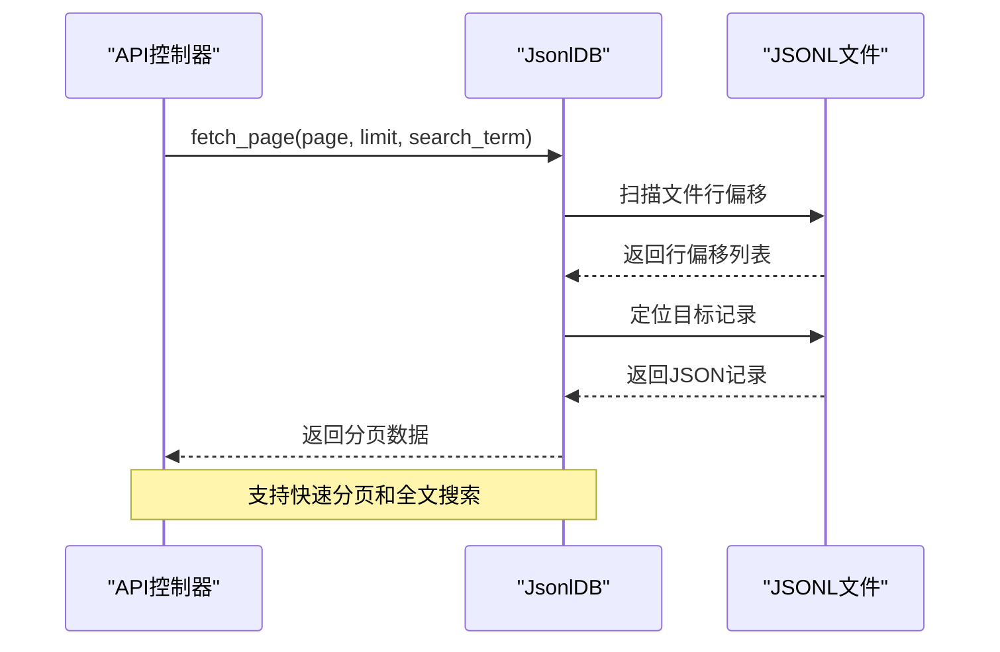

**图表来源**
- [main.py](file://main.py#L113-L186)

**章节来源**
- [main.py](file://main.py#L86-L258)

### 存储空间监控

系统提供实时的存储空间监控功能：

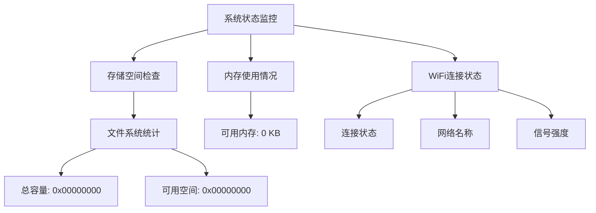

**图表来源**
- [main.py](file://main.py#L528-L539)
- [boot.py](file://boot.py#L284-L293)

**章节来源**
- [main.py](file://main.py#L528-L539)
- [boot.py](file://boot.py#L279-L293)

## 依赖关系分析

系统组件间的依赖关系如下：

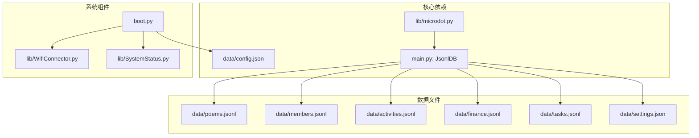

**图表来源**
- [main.py](file://main.py#L1-L548)
- [boot.py](file://boot.py#L1-L122)

**章节来源**
- [main.py](file://main.py#L1-L548)
- [boot.py](file://boot.py#L1-L122)

## 性能考虑

### 内存优化策略

系统针对ESP32的内存限制采用了多项优化措施：

1. **流式处理**: JsonlDB采用逐行扫描的方式，避免一次性加载整个文件到内存
2. **分页机制**: 默认每页10条记录，支持大数据集的高效浏览
3. **延迟初始化**: LED和WiFi组件采用延迟初始化，减少启动时的内存占用

### 存储优化

- **压缩存储**: JSONL格式相比传统JSON更节省存储空间
- **增量更新**: 采用临时文件机制进行数据更新，避免数据丢失
- **索引优化**: 通过行偏移索引实现快速定位，支持大规模数据集

## 故障排查指南

### JSONL文件损坏诊断

#### 1. 损坏检测方法

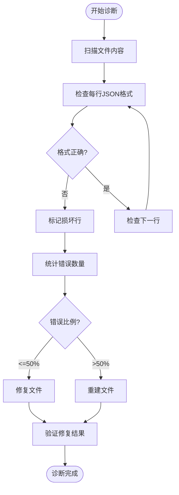

#### 2. 常见损坏类型及修复

| 损坏类型 | 症状 | 修复方法 |
|---------|------|---------|
| JSON语法错误 | 解析异常，记录丢失 | 使用JSON验证工具修复语法 |
| 文件截断 | 部分记录丢失 | 从备份恢复或重建文件 |
| 编码问题 | 中文乱码 | 转换为UTF-8编码 |
| 行尾问题 | 读取异常 | 统一行尾格式 |

**章节来源**
- [main.py](file://main.py#L96-L111)
- [main.py](file://main.py#L156-L185)

### 数据读写错误处理

#### 1. 错误分类与处理

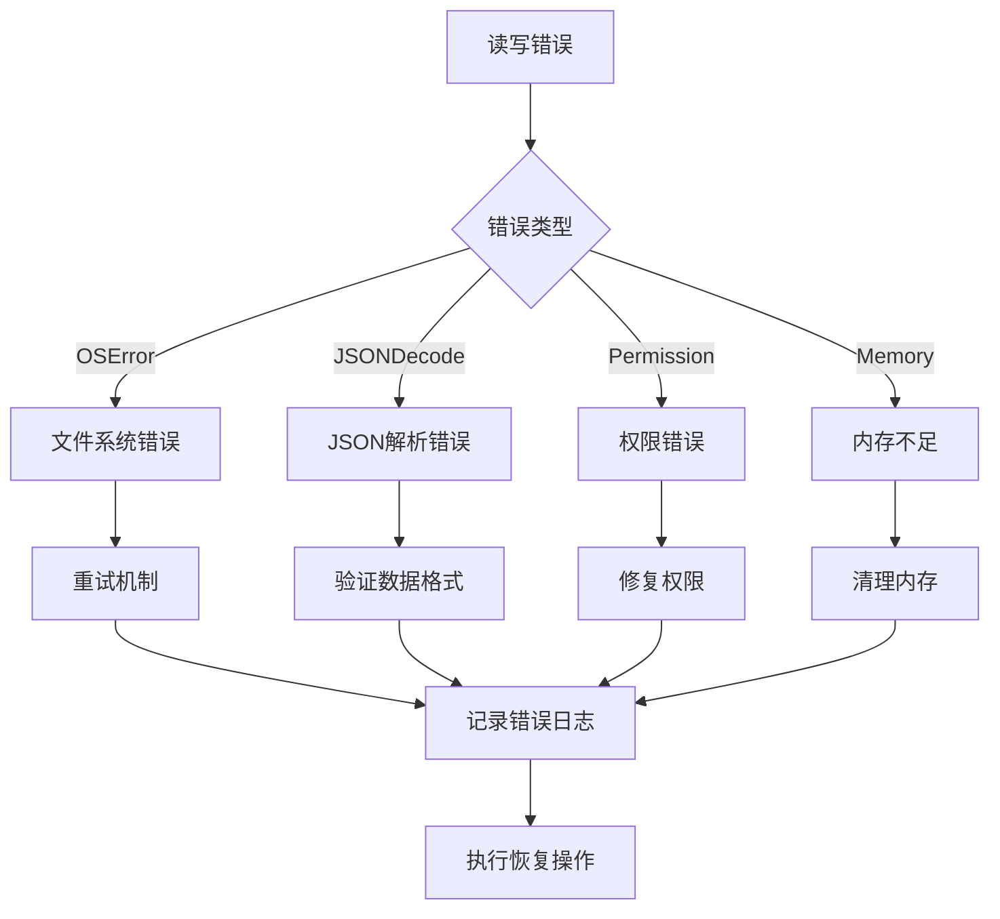

#### 2. 读写流程监控

系统在关键操作点添加了详细的错误处理：

- **文件存在性检查**: 在读取前验证文件是否存在
- **异常捕获**: 捕获所有可能的IO异常
- **回滚机制**: 更新失败时自动回滚到原始状态
- **日志记录**: 详细记录错误信息便于诊断

**章节来源**
- [main.py](file://main.py#L86-L94)
- [main.py](file://main.py#L187-L221)
- [main.py](file://main.py#L223-L246)

### 存储空间不足问题

#### 1. 空间监控与预警

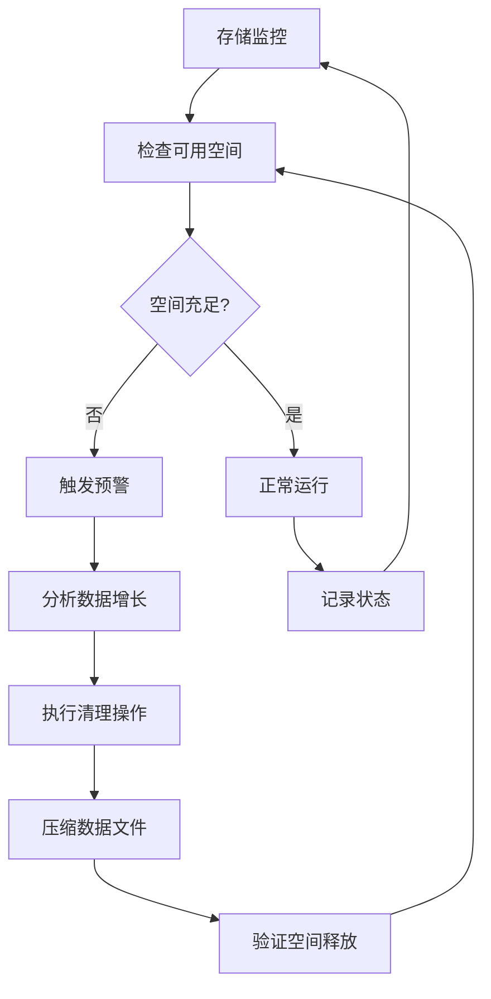

#### 2. 空间优化策略

| 优化方法 | 实施步骤 | 预期效果 |
|---------|---------|---------|
| 数据压缩 | 删除冗余字段，优化JSON结构 | 减少20-30%存储空间 |
| 历史数据清理 | 定期清理过期记录 | 释放大量存储空间 |
| 文件碎片整理 | 重建JSONL文件结构 | 提高读写效率 |
| 备份策略 | 分层备份重要数据 | 平衡存储与安全 |

**章节来源**
- [main.py](file://main.py#L528-L539)
- [boot.py](file://boot.py#L532-L539)

### 数据同步问题

#### 1. 同步机制分析

系统采用单机存储架构，不存在分布式同步问题，但仍需关注：

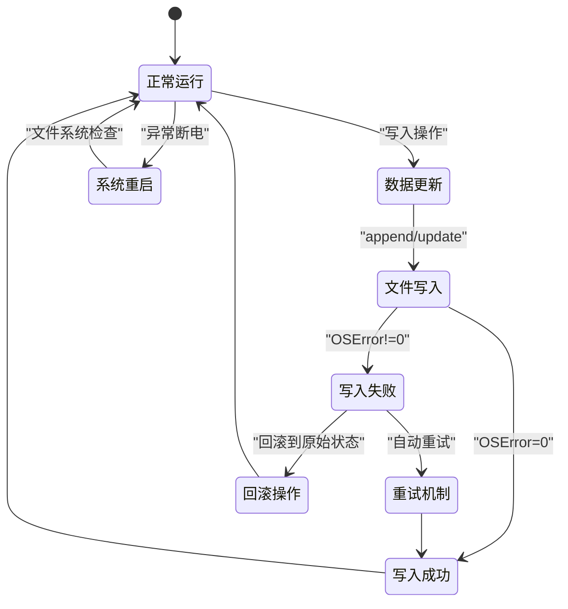

#### 2. 同步问题诊断

- **文件锁定**: 检查是否有其他进程访问数据文件
- **磁盘空间**: 确认有足够的可用空间
- **权限问题**: 验证文件读写权限
- **电源稳定性**: 监控断电情况对数据的影响

**章节来源**
- [main.py](file://main.py#L187-L246)

### 数据备份与恢复

#### 1. 备份策略

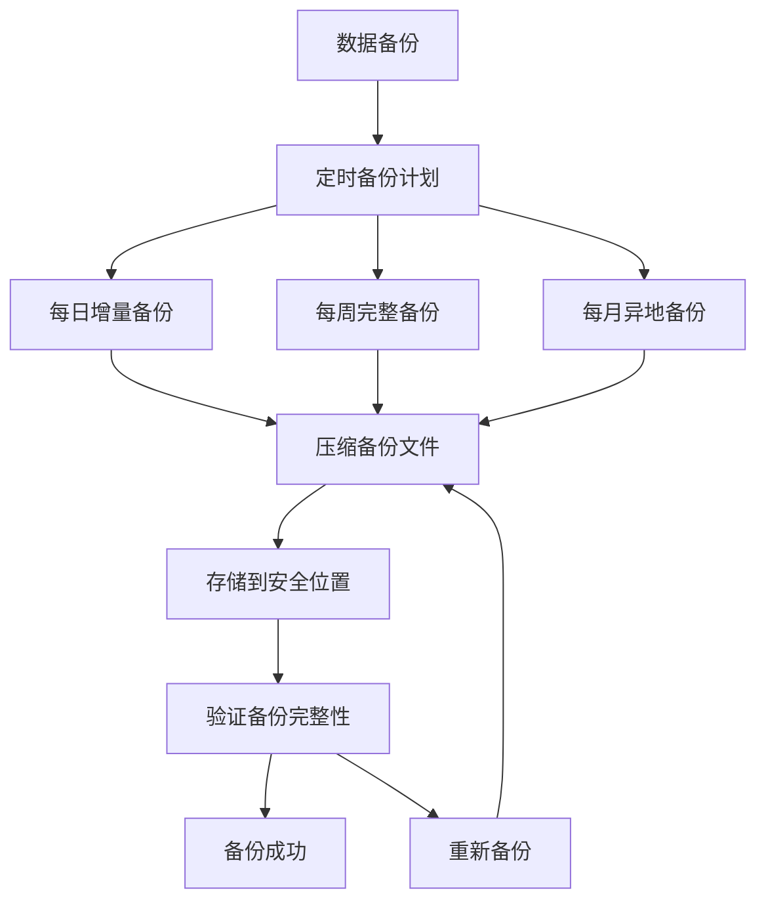

#### 2. 恢复流程

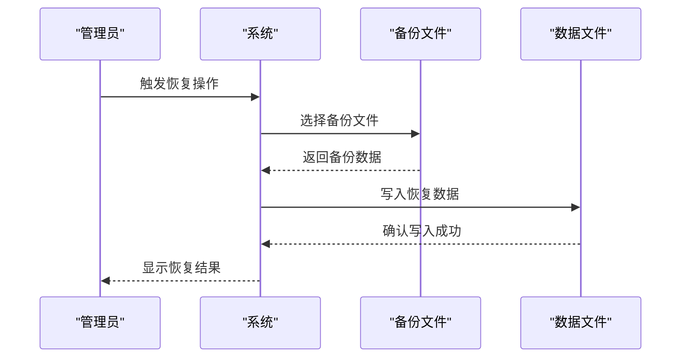

**章节来源**
- [main.py](file://main.py#L528-L539)

### 批量数据修复工具

#### 1. 数据修复脚本

系统提供以下修复工具：

| 工具类型 | 功能描述 | 使用场景 |
|---------|---------|---------|
| JSON验证器 | 验证JSONL文件格式 | 检测语法错误 |
| 数据清理器 | 清理重复和无效记录 | 维护数据质量 |
| 文件重建器 | 重建损坏的JSONL文件 | 严重损坏时使用 |
| 索引重建器 | 重建文件索引 | 索引损坏时使用 |

#### 2. 修复流程

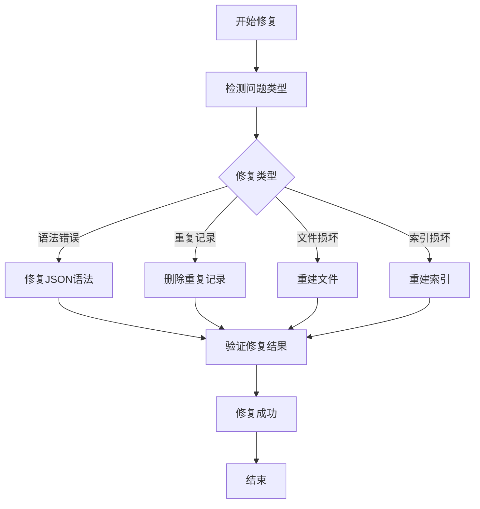

**章节来源**
- [main.py](file://main.py#L68-L84)

### 数据一致性验证

#### 1. 验证方法

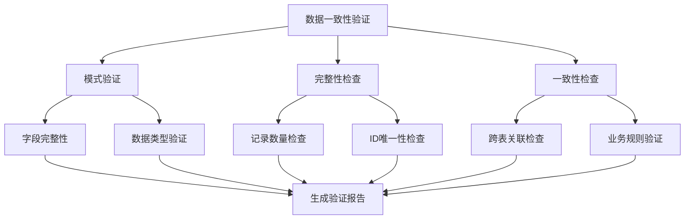

#### 2. 验证指标

| 验证维度 | 指标 | 阈值 |
|---------|------|------|
| 数据完整性 | 缺失字段比例 | < 1% |
| 数据准确性 | 错误记录比例 | < 0.1% |
| 业务一致性 | 关联关系正确性 | 100% |
| 性能表现 | 查询响应时间 | < 100ms |

**章节来源**
- [main.py](file://main.py#L96-L111)
- [main.py](file://main.py#L156-L185)

## 结论

围炉诗社·理事台的数据存储系统通过JSONL文件格式和自定义的JsonlDB引擎，实现了轻量级、可靠的嵌入式数据管理。系统具备完善的错误处理机制、存储监控功能和数据完整性保护措施。

针对数据存储问题，建议采取以下预防措施：

1. **定期备份**: 建立自动化的备份策略
2. **监控告警**: 实时监控存储空间和系统状态
3. **数据验证**: 定期执行数据质量检查
4. **维护计划**: 制定定期的数据维护和优化计划

通过实施这些措施，可以有效预防和快速解决数据存储问题，确保系统的稳定运行。

## 附录

### 常用命令参考

| 操作类型 | 命令 | 描述 |
|---------|------|------|
| 查看文件大小 | `os.statvfs('/')` | 获取文件系统统计信息 |
| 检查文件存在 | `os.stat(path)` | 验证文件是否存在 |
| 读取文件内容 | `with open(file, 'r') as f:` | 安全读取文件内容 |
| 写入文件 | `with open(file, 'w') as f:` | 安全写入文件内容 |

### 故障排除清单

- [ ] 检查文件权限是否正确
- [ ] 验证JSONL文件格式是否正确
- [ ] 确认存储空间是否充足
- [ ] 检查系统日志中的错误信息
- [ ] 验证数据完整性检查结果
- [ ] 确认备份文件的可用性