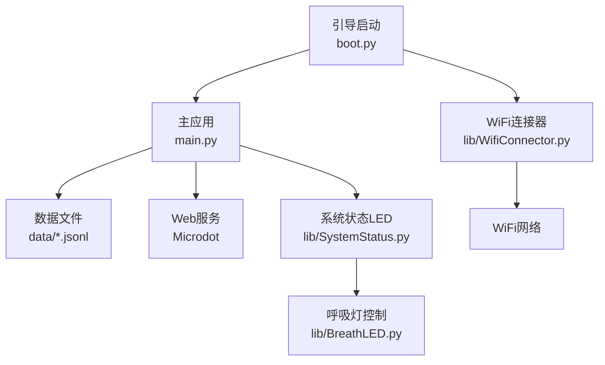
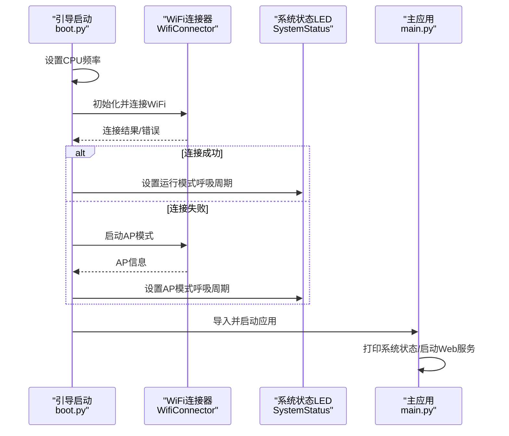
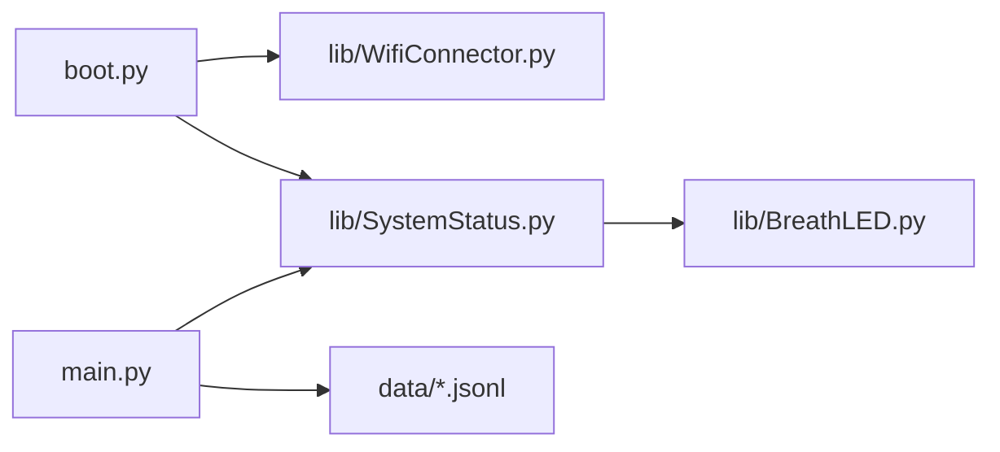

# 硬件问题排查

<cite>
**本文引用的文件**
- [boot.py](file://boot.py)
- [main.py](file://main.py)
- [lib/BreathLED.py](file://lib/BreathLED.py)
- [lib/SystemStatus.py](file://lib/SystemStatus.py)
- [lib/WifiConnector.py](file://lib/WifiConnector.py)
- [lib/WifiConnector_README.md](file://lib/WifiConnector_README.md)
- [lib/BreathLED_README.md](file://lib/BreathLED_README.md)
- [lib/breath_led_example.py](file://lib/breath_led_example.py)
- [lib/wifi_connector_example.py](file://lib/wifi_connector_example.py)
- [data/config.json](file://data/config.json)
- [data/settings.json](file://data/settings.json)
</cite>

## 目录
1. [简介](#简介)
2. [项目结构](#项目结构)
3. [核心组件](#核心组件)
4. [架构总览](#架构总览)
5. [详细组件分析](#详细组件分析)
6. [依赖分析](#依赖分析)
7. [性能考量](#性能考量)
8. [故障排查指南](#故障排查指南)
9. [结论](#结论)
10. [附录](#附录)

## 简介
本指南面向“围炉诗社·理事台”项目的硬件问题排查，覆盖ESP32开发板启动失败、LED指示灯异常、电源问题、硬件兼容性故障等场景，并结合项目中的引导启动、WiFi连接、系统状态指示与LED呼吸灯控制等模块，给出可操作的诊断步骤、工具使用方法、电路检查要点、替换部件判断标准以及预防性维护流程。内容兼顾技术细节与可读性，适合具备基础电子知识的运维与开发者使用。

## 项目结构
项目采用“引导启动 + Web服务 + 状态指示 + 硬件控制”的分层组织：
- 引导启动：boot.py 负责CPU频率设置、WiFi连接与AP降级、文件系统检查、启动主应用。
- 主应用：main.py 提供Web服务、数据库读写、系统状态查询等。
- 硬件控制：
  - WiFi：lib/WifiConnector.py 提供扫描、连接、热点、静态IP、诊断等能力。
  - 系统状态LED：lib/SystemStatus.py 基于 lib/BreathLED.py 控制单个GPIO上的呼吸灯。
  - LED呼吸灯：lib/BreathLED.py 支持WS2812与普通LED，提供呼吸周期、亮度、颜色、定时器等控制。
- 数据：data/config.json、data/settings.json 提供WiFi与系统配置。

图表来源
- [boot.py](file://boot.py#L1-L122)
- [main.py](file://main.py#L1-L548)
- [lib/WifiConnector.py](file://lib/WifiConnector.py#L1-L800)
- [lib/SystemStatus.py](file://lib/SystemStatus.py#L1-L61)
- [lib/BreathLED.py](file://lib/BreathLED.py#L1-L633)

章节来源
- [boot.py](file://boot.py#L1-L122)
- [main.py](file://main.py#L1-L548)
- [lib/WifiConnector.py](file://lib/WifiConnector.py#L1-L800)
- [lib/SystemStatus.py](file://lib/SystemStatus.py#L1-L61)
- [lib/BreathLED.py](file://lib/BreathLED.py#L1-L633)

## 核心组件
- 引导启动与系统初始化
  - CPU频率设置、WiFi连接与AP降级、文件系统检查、启动主应用。
- WiFi连接与网络管理
  - 扫描、连接、重连、热点、静态IP、诊断与状态查询。
- 系统状态LED
  - 基于呼吸灯的单LED指示：连接中、AP模式、运行中三种状态。
- LED呼吸灯控制
  - WS2812与普通LED双类型支持，呼吸周期、亮度范围、颜色、定时器兼容性等。

章节来源
- [boot.py](file://boot.py#L8-L122)
- [lib/WifiConnector.py](file://lib/WifiConnector.py#L54-L120)
- [lib/SystemStatus.py](file://lib/SystemStatus.py#L19-L61)
- [lib/BreathLED.py](file://lib/BreathLED.py#L94-L169)

## 架构总览
系统启动流程与硬件交互如下：

图表来源
- [boot.py](file://boot.py#L8-L122)
- [lib/WifiConnector.py](file://lib/WifiConnector.py#L595-L696)
- [lib/SystemStatus.py](file://lib/SystemStatus.py#L33-L58)
- [main.py](file://main.py#L279-L294)

## 详细组件分析

### 组件A：引导启动与启动失败排查
- 关键点
  - CPU频率设置：引导阶段设置为240MHz，若后续出现异常，可临时降低频率观察稳定性。
  - WiFi连接与AP降级：连接失败时自动进入AP模式；若AP也失败，需检查WiFi模块与配置。
  - 文件系统检查：引导阶段列出根目录与static目录，便于确认文件缺失或挂载异常。
  - 启动主应用：导入main并触发运行，若导入失败或异常，会打印错误信息。
- 常见启动失败原因
  - 配置文件缺失或损坏：data/config.json不存在或格式错误。
  - main.py导入失败：缺少依赖模块或路径错误。
  - WiFi模块异常：连接超时或内部错误，导致无法进入AP模式。
- 排查步骤
  - 检查data/config.json是否存在且包含正确的WiFi与AP配置。
  - 通过串口观察引导阶段输出，定位失败环节。
  - 若WiFi异常，尝试禁用AP降级逻辑，仅测试STA连接。
  - 逐步注释引导部分，缩小问题范围。

章节来源
- [boot.py](file://boot.py#L8-L122)
- [data/config.json](file://data/config.json#L1-L6)

### 组件B：WiFi连接与电源/兼容性问题
- 关键点
  - 连接超时、重试次数、密码长度校验、错误状态码映射。
  - 静态IP配置：IP、子网掩码、网关、DNS格式校验与自动推断。
  - 热点创建：自定义IP、子网掩码、认证模式、客户端管理与持久化。
  - 资源清理：断开连接、停止热点、清理网络状态。
- 电源/兼容性相关风险
  - 长时间连接或频繁重连可能导致WiFi模块过热或供电不足。
  - 静态IP配置不当可能与网络冲突，导致IP获取失败。
  - 热点模式下并发客户端过多可能影响稳定性。
- 排查步骤
  - 使用扫描功能确认可见网络与信号强度。
  - 检查密码长度与认证模式匹配。
  - 如启用静态IP，核对IP、子网掩码、网关、DNS格式。
  - 观察连接状态码与错误信息，定位失败原因。
  - 在稳定环境下降低重试次数与超时，减少功耗与发热。

章节来源
- [lib/WifiConnector.py](file://lib/WifiConnector.py#L595-L800)
- [lib/WifiConnector_README.md](file://lib/WifiConnector_README.md#L355-L380)

### 组件C：系统状态LED与LED指示灯异常
- 关键点
  - SystemStatus基于BreathLED控制GPIO 15的单LED呼吸灯。
  - 三种呼吸周期：连接中（快速）、AP模式（中速）、运行中（慢速）。
  - BreathLED支持WS2812与普通LED，定时器兼容不同平台，参数验证严格。
- 常见异常
  - LED不亮：引脚冲突、PWM/TIMER资源占用、电源不足。
  - 呼吸异常：呼吸周期设置过大、更新间隔计算异常、定时器冲突。
  - 颜色/亮度异常：参数越界、定时器回调错误、内存不足。
- 排查步骤
  - 确认引脚未被其他外设占用。
  - 检查是否同时存在多个定时器或PWM实例。
  - 降低呼吸周期与更新间隔，观察是否改善。
  - 使用调试模式输出，定位错误来源。
  - 逐步停用其他功能，隔离资源冲突。

章节来源
- [lib/SystemStatus.py](file://lib/SystemStatus.py#L19-L61)
- [lib/BreathLED.py](file://lib/BreathLED.py#L94-L169)
- [lib/BreathLED_README.md](file://lib/BreathLED_README.md#L337-L357)

### 组件D：内存不足与CPU频率设置
- 关键点
  - 引导阶段设置CPU频率为240MHz，提升性能但可能增加功耗与发热。
  - main.py中提供系统状态打印，包含可用内存统计。
  - Boot阶段在导入main前后打印文件列表，便于确认存储空间与文件完整性。
- 内存不足表现
  - 导入失败、运行时异常、系统状态打印内存过低。
- CPU频率设置
  - 高频有利于网络与Web处理，但需配合散热与电源稳定。
- 排查步骤
  - 在main.py中打印系统状态，关注可用内存。
  - 若内存紧张，减少一次性加载的数据量或优化数据结构。
  - 适当降低CPU频率以降低功耗与发热，观察稳定性。

章节来源
- [boot.py](file://boot.py#L8-L12)
- [main.py](file://main.py#L279-L294)

## 依赖分析
- 组件耦合
  - boot.py依赖WifiConnector与SystemStatus，负责启动阶段的网络与LED状态。
  - main.py依赖microdot、数据文件与SystemStatus（可选），提供Web服务与系统状态查询。
  - SystemStatus依赖BreathLED，控制单LED呼吸。
  - BreathLED依赖machine.Pin、Timer、PWM与neopixel，涉及硬件抽象层。
- 外部依赖
  - ESP32 MicroPython运行时、network、machine、gc、os等模块。
- 潜在环依赖
  - 无直接环依赖，但需避免在不同模块中重复初始化同一硬件资源。

图表来源
- [boot.py](file://boot.py#L5-L6)
- [lib/SystemStatus.py](file://lib/SystemStatus.py#L10)
- [lib/BreathLED.py](file://lib/BreathLED.py#L6)
- [main.py](file://main.py#L10)

章节来源
- [boot.py](file://boot.py#L5-L6)
- [lib/SystemStatus.py](file://lib/SystemStatus.py#L10)
- [lib/BreathLED.py](file://lib/BreathLED.py#L6)
- [main.py](file://main.py#L10)

## 性能考量
- CPU频率
  - 引导阶段设置为240MHz，适合网络与Web处理，但需注意功耗与发热。
- 呼吸灯更新策略
  - 基于呼吸周期与更新间隔的自适应计算，避免过高的CPU占用。
  - 正弦查找表预计算，减少实时三角函数计算。
- 内存管理
  - 引导阶段打印文件列表，便于确认存储空间。
  - main.py中打印系统状态，包含可用内存统计，便于监控内存压力。
- WiFi连接
  - 超时与重试参数可调，避免长时间阻塞与功耗过高。
  - 静态IP配置可减少DHCP交互，降低网络波动带来的性能影响。

章节来源
- [boot.py](file://boot.py#L8-L12)
- [lib/BreathLED.py](file://lib/BreathLED.py#L261-L284)
- [main.py](file://main.py#L279-L294)
- [lib/WifiConnector.py](file://lib/WifiConnector.py#L595-L696)

## 故障排查指南

### 启动失败排查
- 现象
  - 设备无法进入主应用，引导阶段报错或卡死。
- 可能原因
  - data/config.json缺失或格式错误。
  - main.py导入失败或异常。
  - WiFi模块异常导致无法进入AP模式。
- 排查步骤
  - 检查data/config.json是否存在且包含正确的WiFi与AP配置。
  - 通过串口观察引导阶段输出，定位失败环节。
  - 临时禁用AP降级逻辑，仅测试STA连接。
  - 逐步注释引导部分，缩小问题范围。

章节来源
- [boot.py](file://boot.py#L14-L21)
- [boot.py](file://boot.py#L88-L122)
- [data/config.json](file://data/config.json#L1-L6)

### LED指示灯异常排查
- 现象
  - LED不亮、闪烁异常、颜色/亮度异常。
- 可能原因
  - 引脚冲突、PWM/TIMER资源占用、电源不足。
  - 呼吸周期过大、更新间隔异常、定时器冲突。
  - 参数越界、定时器回调错误、内存不足。
- 排查步骤
  - 确认引脚未被其他外设占用。
  - 检查是否同时存在多个定时器或PWM实例。
  - 降低呼吸周期与更新间隔，观察是否改善。
  - 使用调试模式输出，定位错误来源。
  - 逐步停用其他功能，隔离资源冲突。

章节来源
- [lib/SystemStatus.py](file://lib/SystemStatus.py#L25-L58)
- [lib/BreathLED.py](file://lib/BreathLED.py#L184-L227)
- [lib/BreathLED.py](file://lib/BreathLED.py#L304-L339)

### 电源问题排查
- 现象
  - 设备频繁重启、WiFi连接不稳定、LED亮度异常。
- 可能原因
  - 电源功率不足、电压不稳定、电流峰值过高。
  - 多个高功耗外设同时工作。
- 排查步骤
  - 使用万用表测量供电电压与电流，确认在额定范围内。
  - 降低CPU频率与LED亮度，观察是否改善。
  - 分离高功耗外设，逐一排查。
  - 检查电源线与连接器接触是否良好。

章节来源
- [boot.py](file://boot.py#L8-L12)
- [lib/BreathLED.py](file://lib/BreathLED.py#L536-L556)

### 硬件兼容性故障排查
- 现象
  - 不同开发板上行为不一致、定时器/TIMER初始化失败。
- 可能原因
  - 不同平台对Timer初始化的支持差异。
  - 引脚定义与硬件限制不同。
- 排查步骤
  - 使用BreathLED提供的多平台Timer兼容逻辑，观察初始化日志。
  - 核对引脚范围与硬件限制，避免超出范围。
  - 在目标平台上运行示例程序，验证功能一致性。

章节来源
- [lib/BreathLED.py](file://lib/BreathLED.py#L261-L284)
- [lib/BreathLED.py](file://lib/BreathLED.py#L184-L197)

### WiFi连接与网络问题排查
- 现象
  - 无法连接WiFi、连接不稳定、热点无法启动。
- 可能原因
  - 密码长度不足、认证模式不匹配、网络不可达。
  - 静态IP配置不当、与网络冲突。
  - 热点配置错误或客户端过多。
- 排查步骤
  - 使用扫描功能确认可见网络与信号强度。
  - 检查密码长度与认证模式匹配。
  - 如启用静态IP，核对IP、子网掩码、网关、DNS格式。
  - 观察连接状态码与错误信息，定位失败原因。
  - 在稳定环境下降低重试次数与超时，减少功耗与发热。

章节来源
- [lib/WifiConnector.py](file://lib/WifiConnector.py#L166-L197)
- [lib/WifiConnector.py](file://lib/WifiConnector.py#L363-L411)
- [lib/WifiConnector_README.md](file://lib/WifiConnector_README.md#L355-L380)

### 内存不足与CPU频率问题
- 现象
  - 导入失败、运行时异常、系统状态打印内存过低。
- 可能原因
  - 数据量过大、模块导入过多、内存碎片化。
  - CPU频率过高导致功耗与发热增加，间接影响稳定性。
- 排查步骤
  - 在main.py中打印系统状态，关注可用内存。
  - 若内存紧张，减少一次性加载的数据量或优化数据结构。
  - 适当降低CPU频率以降低功耗与发热，观察稳定性。

章节来源
- [main.py](file://main.py#L279-L294)
- [boot.py](file://boot.py#L8-L12)

### 硬件测试工具与使用方法
- 万用表
  - 测量供电电压与电流，确认在额定范围内。
  - 检查引脚电平与PWM输出波形。
- 示波器（可选）
  - 观察PWM波形质量与频率。
- 网络分析仪（可选）
  - 检查热点信号强度与干扰。
- 调试工具
  - 串口监视器查看引导与运行日志。
  - 使用调试模式输出，定位错误来源。

章节来源
- [lib/BreathLED.py](file://lib/BreathLED.py#L249-L253)
- [lib/WifiConnector.py](file://lib/WifiConnector.py#L135-L144)

### 电路检查步骤
- 电源与地线
  - 确认电源线与地线连接良好，无松动或氧化。
  - 检查电源滤波电容是否正常。
- 引脚与负载
  - 确认LED限流电阻符合规格，避免过流损坏。
  - 检查引脚是否被其他外设占用。
- 信号完整性
  - 检查高频信号（如WiFi天线）走线是否合理。
  - 避免长走线与尖锐回路。

章节来源
- [lib/BreathLED.py](file://lib/BreathLED.py#L536-L556)

### 替换部件判断标准
- LED
  - 若更换后仍无法点亮，优先检查限流电阻与极性。
- WiFi模块
  - 若连接频繁失败，考虑更换或清洁接口。
- 开发板
  - 若在不同开发板上行为不一致，优先排查引脚定义与硬件限制。

章节来源
- [lib/BreathLED.py](file://lib/BreathLED.py#L184-L197)
- [lib/WifiConnector.py](file://lib/WifiConnector.py#L166-L197)

### 预防性维护流程
- 定期检查
  - 电源电压与电流、LED亮度与颜色、WiFi连接状态。
- 日志监控
  - 通过调试输出与系统状态打印，持续监控异常。
- 配置备份
  - 备份data/config.json与热点配置，便于快速恢复。
- 环境优化
  - 降低CPU频率与LED亮度，减少功耗与发热。
  - 合理安排任务调度，避免长时间高负载。

章节来源
- [lib/WifiConnector_README.md](file://lib/WifiConnector_README.md#L304-L337)
- [lib/BreathLED_README.md](file://lib/BreathLED_README.md#L325-L336)

## 结论
本指南围绕“围炉诗社·理事台”项目，结合引导启动、WiFi连接、系统状态LED与LED呼吸灯控制等模块，给出了针对ESP32开发板启动失败、LED指示灯异常、电源问题与硬件兼容性故障的系统化排查方法。通过明确的诊断步骤、工具使用与预防性维护流程，可有效提升系统的稳定性与可维护性。建议在实际部署中结合日志与系统状态打印，持续监控关键指标，及时发现并解决问题。

## 附录
- 示例与参考
  - LED呼吸灯示例：lib/breath_led_example.py
  - WiFi连接器示例：lib/wifi_connector_example.py
  - API与功能参考：lib/WifiConnector_README.md、lib/BreathLED_README.md

章节来源
- [lib/breath_led_example.py](file://lib/breath_led_example.py#L1-L199)
- [lib/wifi_connector_example.py](file://lib/wifi_connector_example.py#L1-L787)
- [lib/WifiConnector_README.md](file://lib/WifiConnector_README.md#L146-L290)
- [lib/BreathLED_README.md](file://lib/BreathLED_README.md#L99-L140)