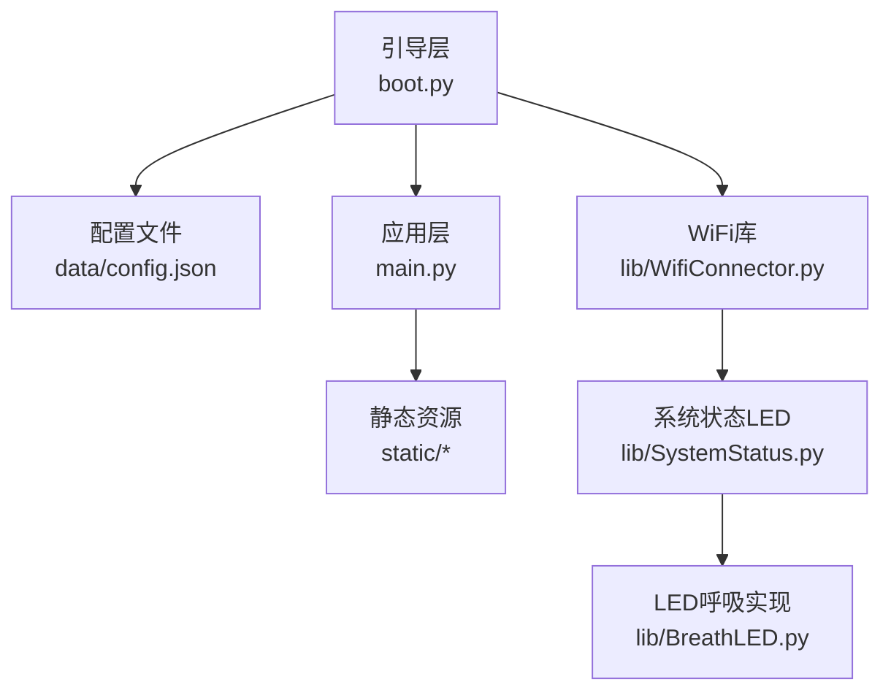
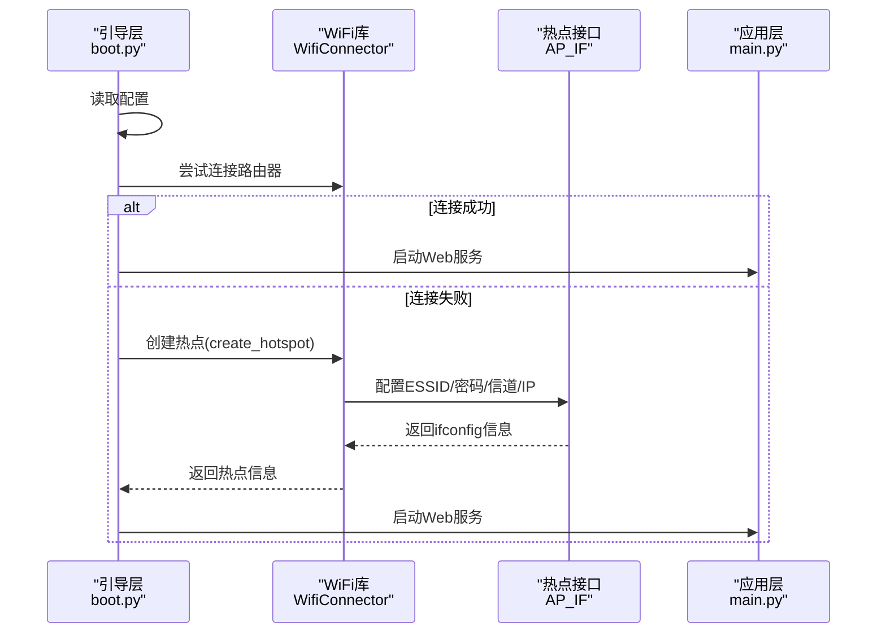
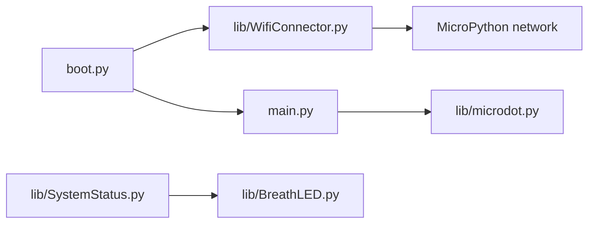
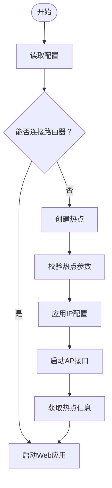

# AP模式问题

<cite>
**本文引用的文件**
- [main.py](file://main.py)
- [boot.py](file://boot.py)
- [data/config.json](file://data/config.json)
- [lib/WifiConnector.py](file://lib/WifiConnector.py)
- [lib/WifiConnector_README.md](file://lib/WifiConnector_README.md)
- [lib/SystemStatus.py](file://lib/SystemStatus.py)
- [lib/BreathLED.py](file://lib/BreathLED.py)
- [lib/wifi_connector_example.py](file://lib/wifi_connector_example.py)
</cite>

## 目录
1. [简介](#简介)
2. [项目结构](#项目结构)
3. [核心组件](#核心组件)
4. [架构总览](#架构总览)
5. [详细组件分析](#详细组件分析)
6. [依赖关系分析](#依赖关系分析)
7. [性能考量](#性能考量)
8. [故障排查指南](#故障排查指南)
9. [结论](#结论)
10. [附录](#附录)

## 简介
本手册聚焦于“WiFi热点（AP）模式”问题的系统化排查与解决，涵盖启动失败、客户端连接问题、IP地址分配错误、网络配置冲突等常见场景。结合项目中的 WiFi 管理组件与引导流程，提供可操作的诊断步骤、参数校验清单、IP池与频道选择策略，以及 AP 模式下的网络隔离与安全配置建议。

## 项目结构
该项目采用“引导层 + 应用层 + 网络库”的分层组织方式：
- 引导层：负责上电初始化、读取配置、优先连接路由器、失败后进入 AP 模式
- 应用层：基于 Microdot 的 Web 服务，提供系统状态与数据接口
- 网络库：封装 WiFi 扫描、连接、热点创建、IP 配置、诊断等能力

图表来源
- [boot.py](file://boot.py#L1-L122)
- [main.py](file://main.py#L1-L120)
- [lib/WifiConnector.py](file://lib/WifiConnector.py#L1-L120)
- [lib/SystemStatus.py](file://lib/SystemStatus.py#L1-L61)
- [lib/BreathLED.py](file://lib/BreathLED.py#L1-L120)

章节来源
- [boot.py](file://boot.py#L1-L122)
- [main.py](file://main.py#L1-L120)
- [data/config.json](file://data/config.json#L1-L6)

## 核心组件
- 引导与AP启动：引导脚本在无法连接路由器时自动创建热点，并可自定义热点IP段
- WiFi连接器：提供热点创建、IP配置、认证模式、客户端统计、诊断等能力
- 系统状态LED：通过不同呼吸周期指示连接、AP、运行三种状态
- Web应用：提供系统信息查询与前端页面

章节来源
- [boot.py](file://boot.py#L22-L87)
- [lib/WifiConnector.py](file://lib/WifiConnector.py#L1192-L1298)
- [lib/SystemStatus.py](file://lib/SystemStatus.py#L19-L61)

## 架构总览
AP模式的启动路径与关键交互如下：

图表来源
- [boot.py](file://boot.py#L22-L87)
- [lib/WifiConnector.py](file://lib/WifiConnector.py#L1192-L1298)

章节来源
- [boot.py](file://boot.py#L22-L87)
- [lib/WifiConnector.py](file://lib/WifiConnector.py#L1192-L1298)

## 详细组件分析

### 组件A：引导层（boot.py）
- 职责
  - 读取配置，优先连接路由器
  - 失败后进入 AP 模式，自定义热点IP段
  - 控制LED状态指示
- 关键行为
  - 若配置中的路由器SSID仍为占位符，直接进入AP模式
  - 设置连接超时与重试次数，提升成功率
  - 成功后根据WLAN接口状态设置LED模式

章节来源
- [boot.py](file://boot.py#L14-L87)
- [data/config.json](file://data/config.json#L1-L6)

### 组件B：WiFi连接器（lib/WifiConnector.py）
- 热点创建与配置
  - 支持自定义信道（1-13）、最大客户端数（1-10）、认证模式（开放/WPA2-PSK/WPA/WPA2-PSK）
  - 支持自定义热点IP段（IP/子网/网关/DNS）
  - 保存热点配置，便于后续查询与持久化
- 热点信息查询
  - 获取热点激活状态、SSID、信道、认证模式、IP、MAC、客户端数量
- IP配置与校验
  - 提供IP地址与子网掩码格式校验
  - 支持静态IP配置与DHCP/静态IP动态切换（v1.3.0新增）

章节来源
- [lib/WifiConnector.py](file://lib/WifiConnector.py#L1192-L1298)
- [lib/WifiConnector.py](file://lib/WifiConnector.py#L1391-L1462)
- [lib/WifiConnector.py](file://lib/WifiConnector.py#L432-L502)
- [lib/WifiConnector_README.md](file://lib/WifiConnector_README.md#L235-L278)

### 组件C：系统状态LED（lib/SystemStatus.py）
- 通过不同呼吸周期指示状态
  - 快速呼吸：正在连接
  - 中速呼吸：AP模式
  - 慢速呼吸：运行中
- 与引导层配合，在AP模式下点亮LED

章节来源
- [lib/SystemStatus.py](file://lib/SystemStatus.py#L19-L61)
- [boot.py](file://boot.py#L111-L116)

### 组件D：Web应用（main.py）
- 提供静态资源与API接口
- 展示系统状态（内存、WiFi连接状态等）
- 与WiFi库无直接耦合，但可作为AP模式下的Web界面入口

章节来源
- [main.py](file://main.py#L279-L294)
- [main.py](file://main.py#L299-L540)

## 依赖关系分析
- 引导层依赖WiFi库进行热点创建与状态查询
- WiFi库依赖 MicroPython 的 network 模块进行STA/AP接口操作
- 系统状态LED依赖BreathLED实现呼吸效果
- Web应用依赖Microdot框架

图表来源
- [boot.py](file://boot.py#L1-L12)
- [lib/WifiConnector.py](file://lib/WifiConnector.py#L6-L11)
- [lib/SystemStatus.py](file://lib/SystemStatus.py#L10-L11)
- [main.py](file://main.py#L10-L11)

章节来源
- [boot.py](file://boot.py#L1-L12)
- [lib/WifiConnector.py](file://lib/WifiConnector.py#L6-L11)
- [lib/SystemStatus.py](file://lib/SystemStatus.py#L10-L11)
- [main.py](file://main.py#L10-L11)

## 性能考量
- 热点信道选择：优先选择1、6、11（2.4GHz非重叠信道），降低干扰
- 客户端数量：合理设置最大客户端数，避免过载导致性能下降
- IP池大小：热点IP池应与最大客户端数匹配，避免地址冲突
- 超时与重试：根据网络环境调整连接超时与重试次数，避免长时间阻塞

## 故障排查指南

### 一、AP模式启动失败
- 现象
  - 启动后无热点广播，或热点无法被扫描到
- 诊断步骤
  - 检查引导层是否进入AP分支（配置中的路由器SSID是否为占位符）
  - 检查WiFi库热点创建返回值与错误信息
  - 校验热点参数：SSID、密码、信道、最大客户端数、认证模式
  - 校验热点IP配置：IP、子网掩码、网关、DNS
- 解决方案
  - 修改配置文件中的路由器SSID占位符为真实值，或确保引导层按预期进入AP分支
  - 调整热点参数至合法范围（信道1-13；客户端1-10；密码≥8位或开放）
  - 使用WiFi库的热点信息查询接口确认热点状态与IP
  - 如需自定义IP段，确保与设备网段一致且不冲突

章节来源
- [boot.py](file://boot.py#L34-L64)
- [lib/WifiConnector.py](file://lib/WifiConnector.py#L1192-L1298)
- [lib/WifiConnector.py](file://lib/WifiConnector.py#L1391-L1462)

### 二、客户端连接问题
- 现象
  - 设备可扫描到热点但无法连接，或连接后无法上网
- 诊断步骤
  - 确认认证模式与密码匹配（开放/加密）
  - 检查热点是否达到最大客户端上限
  - 检查热点IP段与客户端网段是否一致
  - 使用热点信息接口查看当前客户端数量
- 解决方案
  - 调整认证模式与密码，确保与客户端一致
  - 降低最大客户端数或释放部分连接
  - 修改热点IP段，确保与客户端在同一网段
  - 如需固定IP，可在引导层或WiFi库中配置静态IP（v1.3.0）

章节来源
- [lib/WifiConnector.py](file://lib/WifiConnector.py#L1391-L1462)
- [lib/WifiConnector_README.md](file://lib/WifiConnector_README.md#L235-L278)

### 三、IP地址分配错误
- 现象
  - 客户端获取到错误网关或DNS，或IP冲突
- 诊断步骤
  - 使用热点信息接口确认热点IP段与网关
  - 使用WiFi库的IP地址与子网掩码校验方法确认格式合法性
  - 检查热点IP配置是否与客户端网段一致
- 解决方案
  - 修改热点IP配置（IP/子网/网关/DNS），确保与客户端一致
  - 使用WiFi库的静态IP配置能力（v1.3.0），在连接后切换到静态IP
  - 避免与路由器或其他设备IP段冲突

章节来源
- [lib/WifiConnector.py](file://lib/WifiConnector.py#L432-L502)
- [lib/WifiConnector_README.md](file://lib/WifiConnector_README.md#L197-L234)

### 四、网络配置冲突
- 现象
  - 启动AP后，设备无法访问Web界面或出现网络异常
- 诊断步骤
  - 检查热点IP段是否与设备网段冲突
  - 检查热点子网掩码是否正确
  - 检查热点网关是否指向自身
- 解决方案
  - 更换热点IP段，避免与局域网其他设备冲突
  - 确保子网掩码与热点IP段匹配
  - 确保网关指向热点自身IP

章节来源
- [boot.py](file://boot.py#L72-L86)
- [lib/WifiConnector.py](file://lib/WifiConnector.py#L1192-L1298)

### 五、AP配置参数检查清单
- SSID：字符串，非空
- 密码：若提供需≥8位；开放网络可为空字符串
- 信道：1-13
- 最大客户端数：1-10
- 认证模式：开放/WPA2-PSK/WPA/WPA2-PSK
- IP配置：IP/子网掩码/网关/DNS均需合法且一致

章节来源
- [lib/WifiConnector.py](file://lib/WifiConnector.py#L1192-L1298)
- [lib/WifiConnector.py](file://lib/WifiConnector.py#L432-L502)

### 六、IP池设置验证
- 使用WiFi库的IP地址与子网掩码校验方法
- 确认热点IP段与客户端网段一致
- 避免与路由器或其他设备IP段冲突

章节来源
- [lib/WifiConnector.py](file://lib/WifiConnector.py#L432-L502)

### 七、无线频道选择
- 优先选择1、6、11（2.4GHz非重叠信道）
- 避免与周围热点同信道
- 如需自定义信道，确保在1-13范围内

章节来源
- [lib/WifiConnector.py](file://lib/WifiConnector.py#L1233-L1236)

### 八、客户端设备兼容性
- 确认设备支持的认证模式与密码长度
- 对老旧设备可考虑开放网络或较低强度加密
- 控制最大客户端数，避免过多设备同时连接造成拥塞

章节来源
- [lib/WifiConnector.py](file://lib/WifiConnector.py#L1252-L1275)

### 九、AP模式下的网络隔离与安全配置建议
- 网络隔离
  - 将热点IP段与路由器网段分离，避免跨网段通信
  - 仅在热点内提供必要服务（如Web界面），避免暴露内部网络
- 安全配置
  - 使用WPA2-PSK或更高强度加密
  - 设置足够长度的密码（≥8位）
  - 定期更换热点密码
  - 限制最大客户端数，防止滥用
- 可选增强
  - 使用静态IP配置，便于固定服务端口与访问
  - 结合引导层LED状态，直观提示AP模式

章节来源
- [lib/WifiConnector_README.md](file://lib/WifiConnector_README.md#L235-L278)
- [lib/SystemStatus.py](file://lib/SystemStatus.py#L19-L61)

## 结论
通过以上排查流程与配置建议，可系统性地定位并解决AP模式下的启动失败、连接异常、IP分配错误与网络冲突等问题。建议在生产部署前完成参数校验与IP段规划，并结合LED状态与热点信息接口进行持续监控。

## 附录

### A. 热点创建与信息查询流程图

图表来源
- [boot.py](file://boot.py#L22-L87)
- [lib/WifiConnector.py](file://lib/WifiConnector.py#L1192-L1298)
- [lib/WifiConnector.py](file://lib/WifiConnector.py#L1391-L1462)