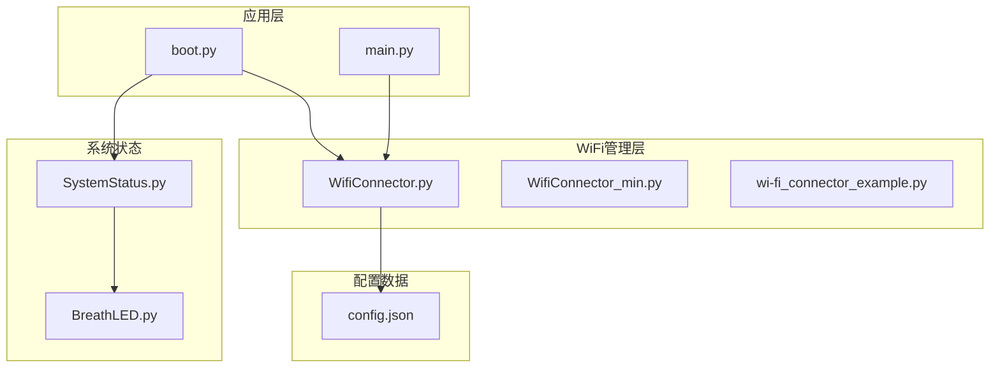
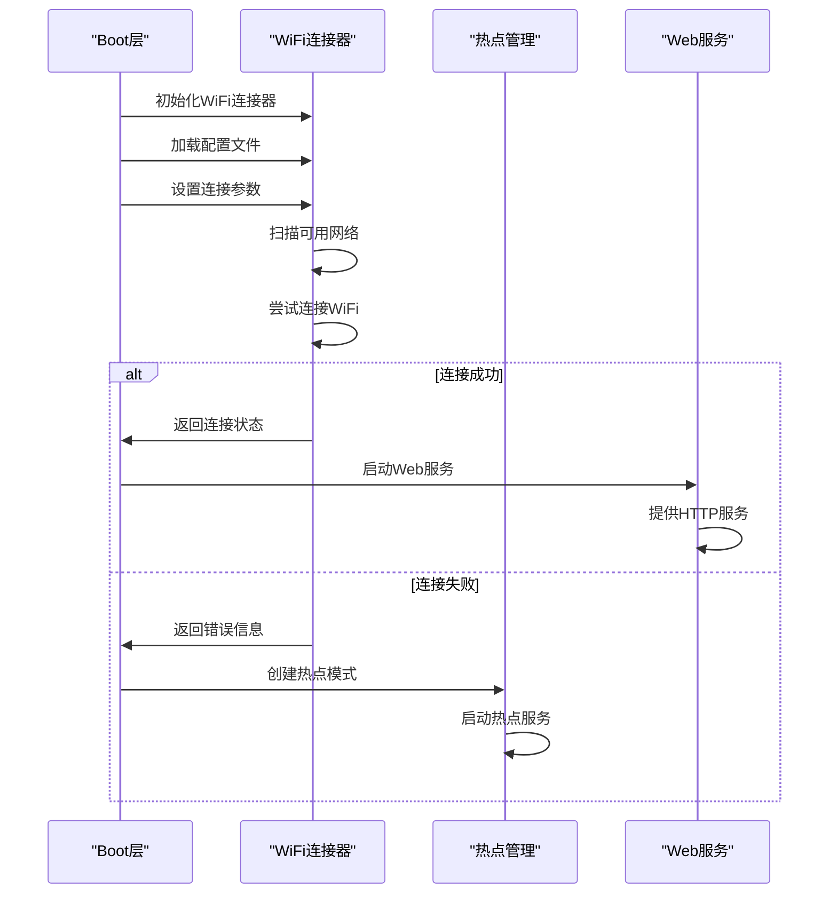
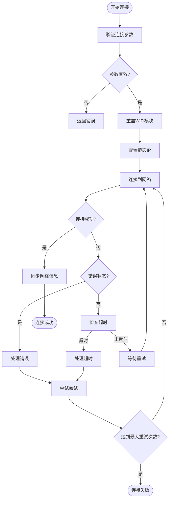
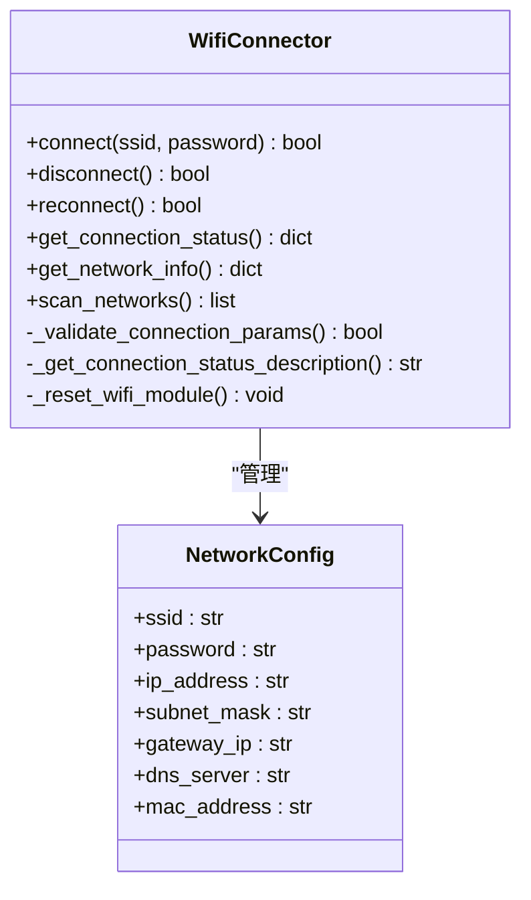
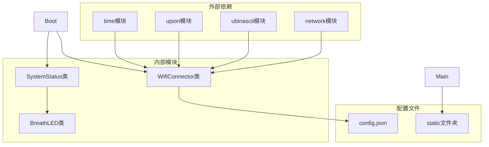
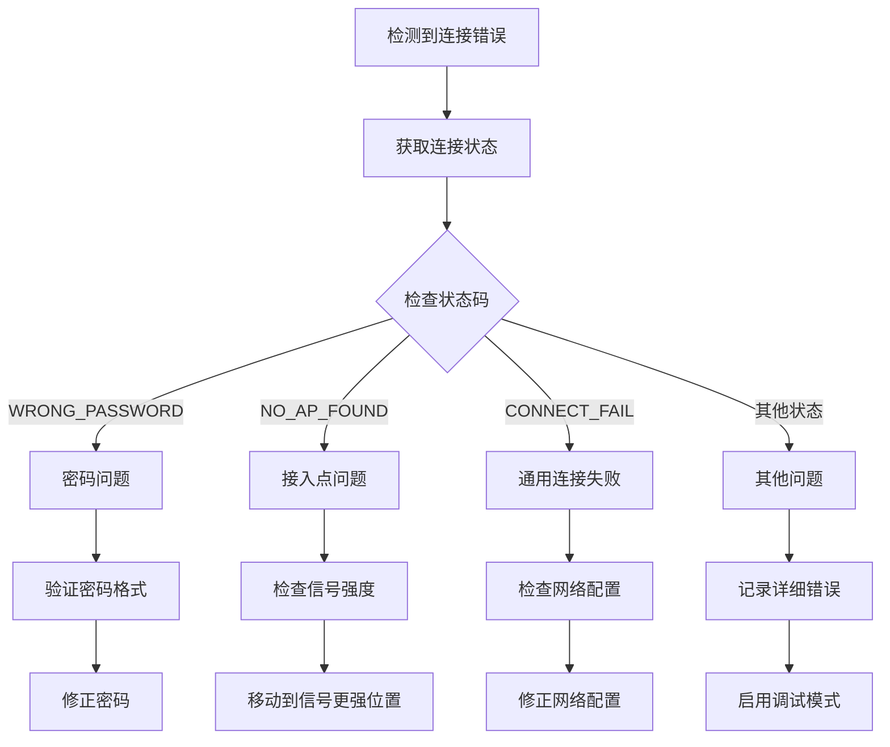

# WiFi连接失败

<cite>
**本文档引用的文件**
- [boot.py](file://boot.py)
- [main.py](file://main.py)
- [WifiConnector.py](file://lib/WifiConnector.py)
- [WifiConnector_min.py](file://lib/WifiConnector_min.py)
- [wifi_connector_example.py](file://lib/wifi_connector_example.py)
- [config.json](file://data/config.json)
- [SystemStatus.py](file://lib/SystemStatus.py)
- [BreathLED.py](file://lib/BreathLED.py)
</cite>

## 目录
1. [简介](#简介)
2. [项目结构](#项目结构)
3. [核心组件](#核心组件)
4. [架构概览](#架构概览)
5. [详细组件分析](#详细组件分析)
6. [依赖关系分析](#依赖关系分析)
7. [性能考虑](#性能考虑)
8. [故障排查指南](#故障排查指南)
9. [结论](#结论)

## 简介

本指南专注于ESP32设备的WiFi连接失败问题排查，基于项目中的WifiConnector类实现。该系统提供了完整的WiFi连接管理功能，包括网络扫描、连接重试、热点创建、静态IP配置等高级特性。文档将详细说明常见的连接失败原因、诊断方法和解决方案。

## 项目结构

该项目采用模块化设计，主要包含以下核心组件：



**图表来源**
- [boot.py](file://boot.py#L1-L122)
- [main.py](file://main.py#L1-L548)
- [WifiConnector.py](file://lib/WifiConnector.py#L1-L1930)

**章节来源**
- [boot.py](file://boot.py#L1-L122)
- [main.py](file://main.py#L1-L548)

## 核心组件

### WifiConnector类

WifiConnector是项目的核心WiFi管理类，提供了完整的WiFi连接生命周期管理：

#### 主要功能特性
- **网络扫描与连接**：支持WiFi网络扫描和连接管理
- **自动重连机制**：具备智能重连和连接监控功能
- **热点创建**：支持创建WiFi热点（AP模式）
- **静态IP配置**：支持DHCP/静态IP动态切换
- **诊断功能**：提供详细的连接状态和诊断信息

#### 关键常量配置
- 默认扫描超时：10秒
- 默认连接超时：15秒  
- 默认最大重试次数：3次
- 最小密码长度：8位
- 默认同步间隔：300秒
- 默认强制同步间隔：1800秒

**章节来源**
- [WifiConnector.py](file://lib/WifiConnector.py#L28-L53)
- [WifiConnector_min.py](file://lib/WifiConnector_min.py#L6-L23)

## 架构概览

系统采用分层架构设计，Boot层负责初始化和连接管理，Main层提供Web服务，WifiConnector层处理WiFi通信。



**图表来源**
- [boot.py](file://boot.py#L22-L87)
- [WifiConnector.py](file://lib/WifiConnector.py#L595-L799)

## 详细组件分析

### WiFi连接流程



**图表来源**
- [WifiConnector.py](file://lib/WifiConnector.py#L595-L695)

### 连接状态管理

WifiConnector实现了完整的连接状态跟踪机制：

#### 连接状态码映射
- `STAT_IDLE`: 空闲状态
- `STAT_CONNECTING`: 正在连接
- `STAT_WRONG_PASSWORD`: 密码错误
- `STAT_NO_AP_FOUND`: 未找到接入点
- `STAT_CONNECT_FAIL`: 连接失败
- `STAT_GOT_IP`: 已获取IP地址

#### 状态描述转换
系统提供人类可读的状态描述，便于调试和用户理解：



**图表来源**
- [WifiConnector.py](file://lib/WifiConnector.py#L11-L120)
- [WifiConnector.py](file://lib/WifiConnector.py#L233-L251)

**章节来源**
- [WifiConnector.py](file://lib/WifiConnector.py#L233-L251)
- [WifiConnector.py](file://lib/WifiConnector.py#L595-L695)

### 热点管理模式

系统支持WiFi热点创建和管理功能：

#### 热点认证模式
- `AP_AUTHMODE_OPEN`: 开放网络
- `AP_AUTHMODE_WEP`: WEP加密
- `AP_AUTHMODE_WPA_PSK`: WPA-PSK加密
- `AP_AUTHMODE_WPA2_PSK`: WPA2-PSK加密
- `AP_AUTHMODE_WPA_WPA2_PSK`: WPA/WPA2混合模式

#### 默认热点配置
- 默认IP地址: 192.168.4.1
- 默认子网掩码: 255.255.255.0
- 默认信道: 11
- 默认最大客户端数: 4

**章节来源**
- [WifiConnector.py](file://lib/WifiConnector.py#L36-L47)
- [WifiConnector.py](file://lib/WifiConnector.py#L610-L676)

### 静态IP配置管理

系统提供灵活的IP配置管理功能：

#### 验证机制
- IP地址格式验证
- 子网掩码有效性检查
- DNS服务器地址验证
- 网关地址推断功能

#### 配置选项
- 支持标准和非标准子网掩码
- 自动网关推断（基于IP地址）
- 双DNS服务器支持
- 动态IP模式切换

**章节来源**
- [WifiConnector.py](file://lib/WifiConnector.py#L363-L431)
- [WifiConnector.py](file://lib/WifiConnector.py#L432-L502)

## 依赖关系分析



**图表来源**
- [WifiConnector.py](file://lib/WifiConnector.py#L6-L9)
- [boot.py](file://boot.py#L1-L12)
- [main.py](file://main.py#L10-L11)

**章节来源**
- [boot.py](file://boot.py#L1-L12)
- [main.py](file://main.py#L1-L16)

## 性能考虑

### 连接超时优化
系统提供了灵活的超时配置机制：

#### 超时参数
- `scan_timeout`: 网络扫描超时（默认10秒）
- `connect_timeout`: 连接超时（默认15秒）
- `sync_interval`: 常规网络信息同步间隔（默认300秒）
- `force_sync_interval`: 强制同步间隔（默认1800秒）

#### 重试策略
- `max_retries`: 最大重试次数（默认3次）
- 指数退避机制
- 连接模块重置功能

### 内存管理
- 自动垃圾回收触发
- 资源清理机制
- 定时器资源管理

## 故障排查指南

### 常见连接失败原因及解决方案

#### 1. SSID密码错误

**症状表现**：
- 连接状态显示"密码错误"
- `STAT_WRONG_PASSWORD`状态码
- 连接立即失败

**诊断步骤**：
1. 验证WiFi密码长度（至少8位）
2. 检查密码字符集和特殊字符
3. 确认网络是否为开放网络

**解决方案**：
```python
# 在连接前验证密码
if password and len(password) < 8:
    print("密码长度不足8位")
    # 提示用户修改密码
```

**章节来源**
- [WifiConnector.py](file://lib/WifiConnector.py#L192-L194)
- [WifiConnector.py](file://lib/WifiConnector.py#L246-L247)

#### 2. 网络不可达

**症状表现**：
- 连接状态显示"未找到接入点"
- `STAT_NO_AP_FOUND`状态码
- 扫描不到目标网络

**诊断步骤**：
1. 使用`scan_networks()`方法扫描可用网络
2. 检查路由器是否正常工作
3. 验证信号强度和距离
4. 确认网络是否隐藏

**解决方案**：
```python
# 扫描并验证网络
networks = wifi.scan_networks()
if not networks:
    print("未发现任何WiFi网络")
    # 检查路由器状态或移动到信号更强的位置
```

**章节来源**
- [WifiConnector.py](file://lib/WifiConnector.py#L518-L576)
- [WifiConnector.py](file://lib/WifiConnector.py#L247-L248)

#### 3. 超时设置不当

**症状表现**：
- 连接超时但网络实际可达
- `STAT_CONNECT_FAIL`状态码
- 连接过程卡在"正在连接"

**诊断步骤**：
1. 检查当前超时设置
2. 分析网络响应时间
3. 考虑网络拥堵情况

**解决方案**：
```python
# 增加连接超时时间
wifi.connect_timeout = 30  # 30秒超时
wifi.max_retries = 5       # 5次重试
```

**章节来源**
- [boot.py](file://boot.py#L40-L43)
- [WifiConnector.py](file://lib/WifiConnector.py#L683-L688)

#### 4. 静态IP配置问题

**症状表现**：
- 静态IP连接失败
- 网络信息同步异常
- IP地址格式错误

**诊断步骤**：
1. 验证IP地址格式（xxx.xxx.xxx.xxx）
2. 检查子网掩码有效性
3. 确认网关地址正确性
4. 验证DNS服务器地址

**解决方案**：
```python
# 使用静态IP连接
success = wifi.connect_with_static_ip(
    ssid="your_network",
    password="your_password",
    ip="192.168.1.100",
    gateway="192.168.1.1",
    dns="8.8.8.8"
)
```

**章节来源**
- [WifiConnector.py](file://lib/WifiConnector.py#L590-L601)
- [WifiConnector.py](file://lib/WifiConnector.py#L432-L502)

### WiFi配置文件验证步骤

#### 配置文件结构
```json
{
    "wifi_ssid": "your_wifi_name",
    "wifi_password": "your_wifi_password",
    "ap_ssid": "your_ap_name", 
    "ap_password": "your_ap_password"
}
```

#### 验证流程
1. **文件存在性检查**
   - 确认`data/config.json`文件存在
   - 检查文件权限和格式

2. **字段完整性验证**
   - 验证必需字段是否存在
   - 检查字段类型和格式

3. **连接测试**
   - 使用示例程序测试连接
   - 验证网络可达性

**章节来源**
- [config.json](file://data/config.json#L1-L6)
- [boot.py](file://boot.py#L14-L21)

### 连接参数优化建议

#### 超时参数调优
- **扫描超时**: 根据网络密度调整（10-30秒）
- **连接超时**: 根据网络质量调整（15-60秒）
- **同步间隔**: 根据应用需求调整（300-3600秒）

#### 重试机制配置
```python
# 增强的重试配置
wifi.connect_timeout = 30
wifi.max_retries = 5
wifi.scan_timeout = 15
```

#### 网络监控
- 定期检查连接状态
- 监控信号强度变化
- 实施自动重连机制

### 错误代码解读

#### 系统状态码对照表

| 状态码 | 状态描述 | 可能原因 | 解决方案 |
|--------|----------|----------|----------|
| `STAT_IDLE` | 空闲状态 | 无连接活动 | 等待连接请求 |
| `STAT_CONNECTING` | 正在连接 | 网络握手进行中 | 等待连接完成 |
| `STAT_WRONG_PASSWORD` | 密码错误 | 密码不正确 | 检查并修正密码 |
| `STAT_NO_AP_FOUND` | 未找到接入点 | 路由器离线或信号弱 | 检查路由器状态 |
| `STAT_CONNECT_FAIL` | 连接失败 | 网络配置错误 | 检查网络设置 |
| `STAT_GOT_IP` | 已获取IP地址 | 连接成功 | 继续后续操作 |

#### 错误诊断流程



**图表来源**
- [WifiConnector.py](file://lib/WifiConnector.py#L233-L251)
- [WifiConnector.py](file://lib/WifiConnector.py#L657-L665)

### 重试机制配置

#### 自动重连策略
1. **指数退避**：每次重试间隔翻倍
2. **最大重试次数**：避免无限重试
3. **连接模块重置**：定期重置WiFi模块
4. **状态监控**：监控连接状态变化

#### 重试配置示例
```python
# 配置重试参数
wifi.max_retries = 5
wifi.connect_timeout = 30

# 执行重连
if not wifi.reconnect():
    print("重连失败，启动AP模式")
    start_ap_mode()
```

**章节来源**
- [WifiConnector.py](file://lib/WifiConnector.py#L761-L800)
- [boot.py](file://boot.py#L47-L63)

## 结论

本指南提供了完整的WiFi连接失败问题排查框架，涵盖了从基础诊断到高级优化的各个方面。通过理解WifiConnector类的设计理念和实现细节，开发者可以：

1. **快速定位问题**：利用状态码和错误信息准确定位问题根源
2. **实施有效解决方案**：根据具体问题选择合适的解决策略
3. **预防性维护**：通过合理的超时设置和重试机制提高系统稳定性
4. **性能优化**：通过参数调优提升连接成功率和响应速度

建议在实际部署中结合项目的具体配置和网络环境，制定个性化的WiFi连接策略，并建立完善的监控和告警机制，确保系统的稳定运行。