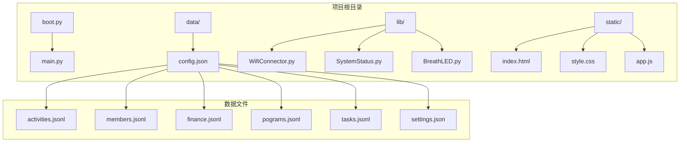
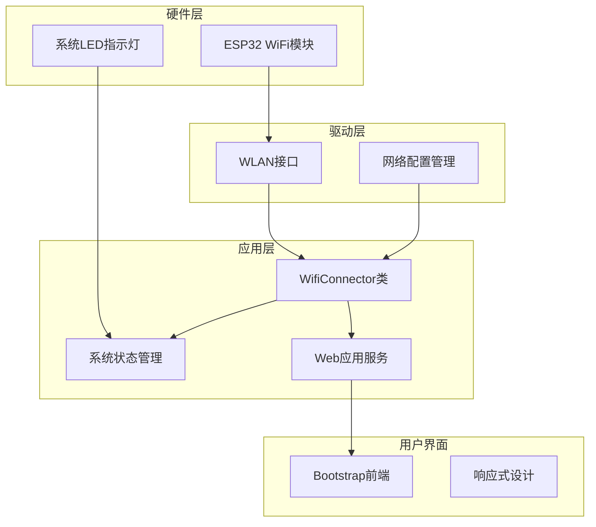
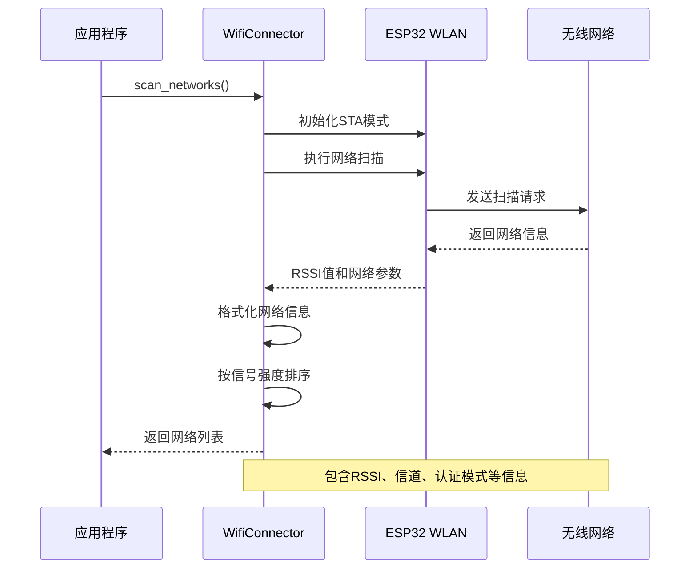
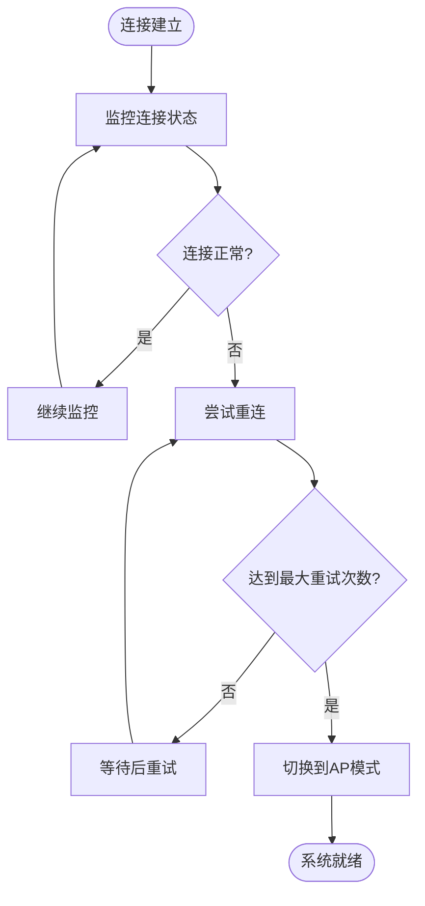
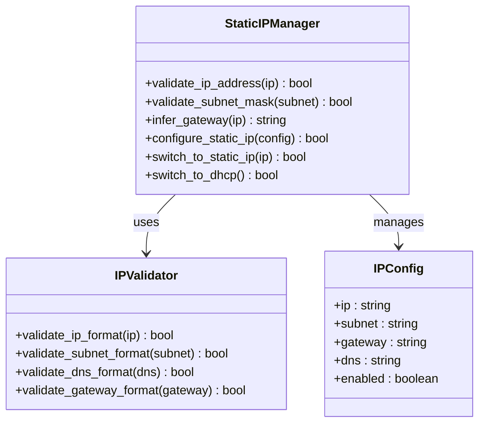
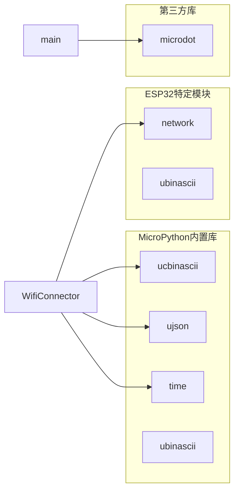
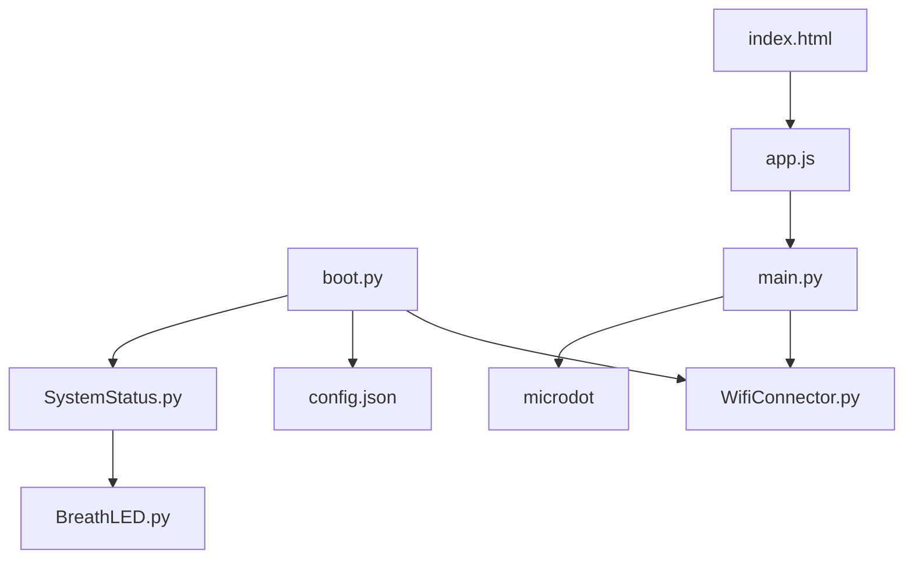

# 信号强度测试

<cite>
**本文引用的文件**
- [WifiConnector.py](file://lib/WifiConnector.py)
- [WifiConnector_README.md](file://lib/WifiConnector_README.md)
- [WifiConnector_min.py](file://lib/WifiConnector_min.py)
- [boot.py](file://boot.py)
- [main.py](file://main.py)
- [SystemStatus.py](file://lib/SystemStatus.py)
- [wifi_connector_example.py](file://lib/wifi_connector_example.py)
- [index.html](file://static/index.html)
- [config.json](file://data/config.json)
</cite>

## 目录
1. [简介](#简介)
2. [项目结构](#项目结构)
3. [核心组件](#核心组件)
4. [架构概览](#架构概览)
5. [详细组件分析](#详细组件分析)
6. [依赖关系分析](#依赖关系分析)
7. [性能考虑](#性能考虑)
8. [故障排除指南](#故障排除指南)
9. [结论](#结论)

## 简介

本项目是一个基于ESP32 MicroPython的WiFi连接管理系统，专门用于围炉诗社·理事台的物联网应用。该系统提供了全面的WiFi信号强度测试和优化功能，包括信号强度测量、信道干扰分析、连接稳定性评估以及路由器位置优化建议。

项目的核心是WifiConnector类，它提供了以下关键功能：
- WiFi网络扫描和信号强度测量
- 自动重连机制和连接状态监控
- 静态IP配置管理（v1.3.0新增）
- 热点创建和管理功能
- 详细的诊断和状态报告

## 项目结构

该项目采用模块化的文件组织方式，主要包含以下目录和文件：



**图表来源**
- [boot.py](file://boot.py#L1-L122)
- [main.py](file://main.py#L1-L548)
- [config.json](file://data/config.json#L1-L6)

**章节来源**
- [boot.py](file://boot.py#L1-L122)
- [main.py](file://main.py#L1-L548)

## 核心组件

### WifiConnector类

WifiConnector是整个系统的核心组件，提供了完整的WiFi连接管理功能。该类具有以下主要特性：

#### 信号强度测量功能
- **RSSI值获取**：通过`scan_networks()`方法获取网络的信号强度
- **信号质量描述**：使用`_get_signal_quality_description()`方法将RSSI值转换为可读的质量描述
- **网络排序**：按信号强度对扫描结果进行降序排列

#### 连接管理功能
- **自动重连**：实现智能重连机制，支持最大重试次数配置
- **连接状态监控**：实时监控连接状态并提供详细的诊断信息
- **网络信息同步**：自动同步和缓存网络配置信息

#### 静态IP管理（v1.3.0新增）
- **IP地址验证**：验证IP地址、子网掩码和网关格式
- **动态切换**：支持DHCP和静态IP之间的动态切换
- **配置持久化**：支持配置文件的保存和加载

**章节来源**
- [WifiConnector.py](file://lib/WifiConnector.py#L11-L800)
- [WifiConnector_README.md](file://lib/WifiConnector_README.md#L1-L418)

## 架构概览

系统采用分层架构设计，从底层硬件抽象到上层应用服务：



**图表来源**
- [WifiConnector.py](file://lib/WifiConnector.py#L54-L120)
- [SystemStatus.py](file://lib/SystemStatus.py#L19-L61)
- [main.py](file://main.py#L17-L548)

## 详细组件分析

### WiFi信号强度测试组件

#### 网络扫描功能
WifiConnector类实现了完整的WiFi网络扫描功能，能够检测周围可用的无线网络并提供详细的信号信息：



**图表来源**
- [WifiConnector.py](file://lib/WifiConnector.py#L518-L576)

#### 信号强度评估算法
系统使用基于RSSI值的信号质量评估算法：

| RSSI范围 (dBm) | 信号质量 | 连接稳定性 | 实际应用场景 |
|---------------|----------|------------|-------------|
| -50 到 -30 | 优秀 | 非常好 | 信号源附近，高带宽应用 |
| -60 到 -50 | 良好 | 很好 | 办公室、客厅等常用区域 |
| -70 到 -60 | 一般 | 良好 | 住宅走廊、卧室边缘 |
| -80 到 -70 | 较差 | 一般 | 住宅远端、多墙区域 |
| -100 到 -80 | 很差 | 较差 | 信号覆盖边缘区域 |

**章节来源**
- [WifiConnector.py](file://lib/WifiConnector.py#L198-L216)

### 连接稳定性监控组件

#### 自动重连机制
系统实现了智能的自动重连功能，能够在网络连接中断时自动恢复：



**图表来源**
- [WifiConnector.py](file://lib/WifiConnector.py#L761-L800)

#### 网络状态诊断
系统提供了全面的网络状态诊断功能：

**章节来源**
- [WifiConnector.py](file://lib/WifiConnector.py#L436-L477)

### 静态IP管理组件（v1.3.0）

#### IP地址验证系统
新的静态IP管理功能包含了完整的IP地址验证系统：



**图表来源**
- [WifiConnector.py](file://lib/WifiConnector.py#L432-L589)

**章节来源**
- [WifiConnector.py](file://lib/WifiConnector.py#L498-L589)

### 系统状态指示组件

#### LED状态指示系统
系统集成了基于LED的状态指示功能，通过不同的呼吸模式显示系统状态：

| 状态模式 | 呼吸周期 | 用途 | LED行为 |
|---------|---------|------|---------|
| 正在连接 | 500ms | WiFi连接中 | 快速闪烁 |
| AP模式 | 1500ms | 热点模式 | 中速呼吸 |
| 运行中 | 4000ms | 系统稳定运行 | 缓慢呼吸 |

**章节来源**
- [SystemStatus.py](file://lib/SystemStatus.py#L19-L61)

## 依赖关系分析

### 外部依赖
系统依赖于以下MicroPython库和模块：



**图表来源**
- [WifiConnector.py](file://lib/WifiConnector.py#L6-L10)
- [main.py](file://main.py#L10-L11)

### 内部模块依赖
系统内部模块之间的依赖关系如下：



**图表来源**
- [boot.py](file://boot.py#L5-L6)
- [main.py](file://main.py#L10-L11)

**章节来源**
- [boot.py](file://boot.py#L1-L122)
- [main.py](file://main.py#L1-L548)

## 性能考虑

### 内存优化策略
系统采用了多种内存优化策略来适应ESP32的有限资源：

1. **懒加载机制**：网络信息仅在需要时才进行同步
2. **缓存策略**：连接状态和网络配置信息被缓存以减少重复查询
3. **垃圾回收**：定期执行垃圾回收以释放内存

### 连接超时优化
系统提供了灵活的超时配置选项：

| 参数 | 默认值 | 优化建议 | 说明 |
|------|--------|----------|------|
| scan_timeout | 10秒 | 15-30秒 | 根据网络环境调整扫描时间 |
| connect_timeout | 15秒 | 20-45秒 | 给连接过程更多时间 |
| sync_interval | 300秒 | 600-1800秒 | 减少不必要的网络查询 |
| force_sync_interval | 1800秒 | 3600-7200秒 | 控制强制同步频率 |

### 信号强度优化建议

基于系统的信号强度测量功能，以下是具体的优化建议：

#### 路由器位置优化
1. **高度放置**：路由器应放置在离地面1.5-2米的高度
2. **中心位置**：尽量放置在房屋中央，避免靠近墙壁
3. **通风散热**：确保路由器周围有足够的空间散热
4. **远离干扰源**：距离微波炉、蓝牙设备至少2米

#### 信道选择策略
系统支持的信道范围为1-13，建议：
- **2.4GHz频段**：优先选择1、6、11信道，避免重叠
- **5GHz频段**：选择149-165信道，避开拥挤区域

#### 设备放置策略
1. **信号源附近**：将重要设备放置在信号强度为优秀的区域
2. **避免遮挡**：确保设备与路由器之间没有大型金属物体
3. **高度差异**：设备应避免放置在地面上，适当抬高

## 故障排除指南

### 常见连接问题

#### 连接失败排查
当WiFi连接失败时，可以按照以下步骤进行排查：

1. **检查网络参数**
   - 验证SSID和密码的正确性
   - 确认网络在扫描范围内
   - 检查密码长度（至少8位）

2. **查看错误信息**
   ```python
   error = wifi.get_last_error()
   print(f"连接错误: {error}")
   ```

3. **检查信号强度**
   ```python
   networks = wifi.scan_networks()
   for network in networks:
       if network['ssid'] == target_ssid:
           print(f"信号强度: {network['rssi']}dBm")
           print(f"信号质量: {network['signal_strength']}")
   ```

#### 重连机制故障
如果自动重连功能失效：

1. **检查重试配置**
   ```python
   wifi.max_retries = 5  # 增加重试次数
   wifi.connect_timeout = 30  # 增加连接超时
   ```

2. **手动重连测试**
   ```python
   if wifi.reconnect():
       print("重连成功")
   else:
       print(f"重连失败: {wifi.get_last_error()}")
   ```

#### 信号强度问题
针对信号强度不足的问题：

1. **网络扫描分析**
   ```python
   networks = wifi.scan_networks()
   for network in networks:
       print(f"{network['ssid']}: {network['rssi']}dBm - {network['signal_strength']}")
   ```

2. **信道干扰分析**
   - 查看同一信道上的其他网络数量
   - 选择较少使用的信道
   - 考虑使用5GHz频段

**章节来源**
- [WifiConnector_README.md](file://lib/WifiConnector_README.md#L355-L379)

### 系统诊断工具

#### 诊断信息获取
系统提供了全面的诊断功能：

```python
# 获取完整诊断信息
diagnostics = wifi.get_diagnostics()
print("系统诊断:")
for key, value in diagnostics.items():
    print(f"  {key}: {value}")

# 获取连接状态
connection_status = wifi.get_connection_status()
print("连接状态:")
for key, value in connection_status.items():
    print(f"  {key}: {value}")

# 获取网络信息
network_info = wifi.get_network_info()
print("网络信息:")
for key, value in network_info.items():
    print(f"  {key}: {value}")
```

#### 状态监控
```python
# 连续监控连接状态
for i in range(10):
    result = wifi.monitor_connection()
    print(f"监控 {i+1}: {result['status']}")
    time.sleep(5)
```

## 结论

本项目提供了一个功能完整、性能优化的WiFi连接管理系统，特别适合物联网应用和嵌入式设备使用。通过WifiConnector类提供的信号强度测量、连接状态监控、自动重连等功能，用户可以有效地测试和优化WiFi信号质量。

### 主要优势
1. **全面的信号测量**：提供准确的RSSI值和信号质量评估
2. **智能重连机制**：自动处理网络中断和恢复
3. **灵活的配置管理**：支持静态IP和DHCP的动态切换
4. **丰富的诊断功能**：提供详细的系统状态和错误信息
5. **低资源消耗**：优化的内存和CPU使用

### 应用场景
该系统特别适用于以下场景：
- 物联网设备的WiFi连接管理
- 嵌入式Web应用的网络通信
- 需要稳定连接的远程控制系统
- 多设备网络环境的信号优化

通过合理配置和使用本系统提供的功能，用户可以显著改善WiFi信号质量和连接稳定性，为围炉诗社·理事台的应用提供可靠的网络基础设施。