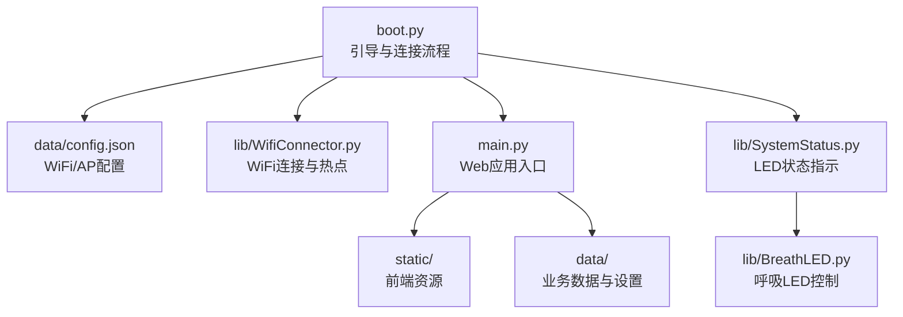
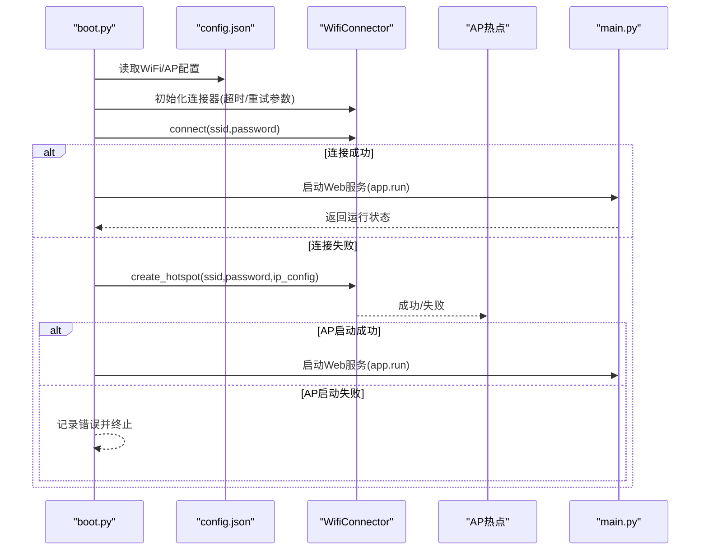
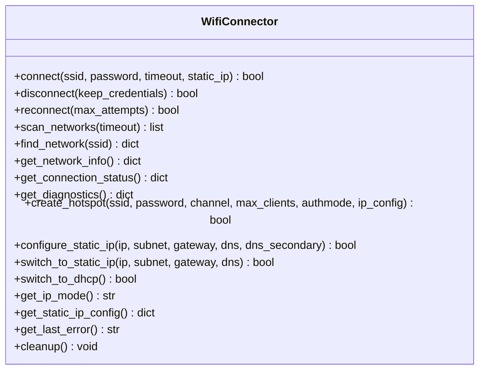
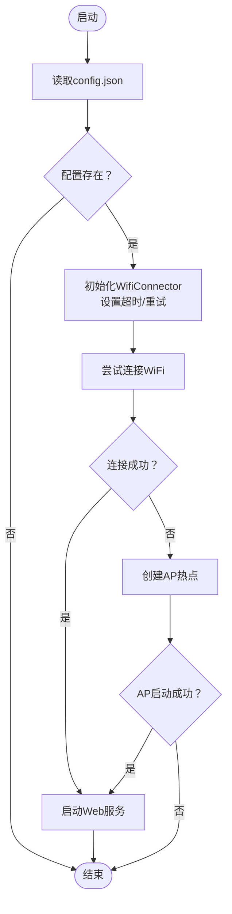
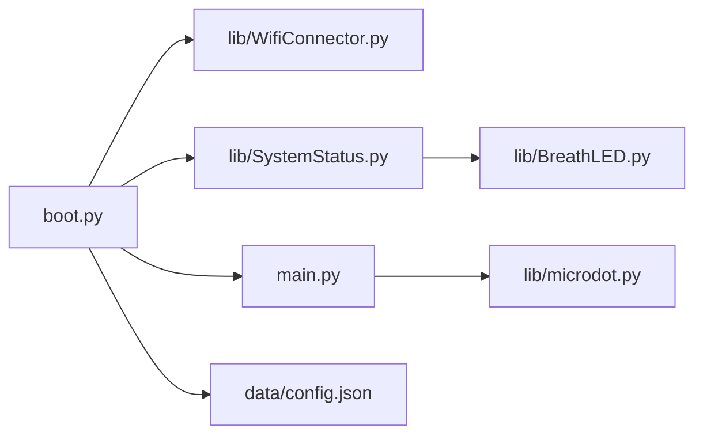

# 网络连接问题

<cite>
**本文引用的文件**
- [boot.py](file://boot.py)
- [main.py](file://main.py)
- [WifiConnector.py](file://lib/WifiConnector.py)
- [WifiConnector_min.py](file://lib/WifiConnector_min.py)
- [WifiConnector_README.md](file://lib/WifiConnector_README.md)
- [wifi_connector_example.py](file://lib/wifi_connector_example.py)
- [config.json](file://data/config.json)
- [settings.json](file://data/settings.json)
- [SystemStatus.py](file://lib/SystemStatus.py)
- [BreathLED.py](file://lib/BreathLED.py)
</cite>

## 目录
1. [简介](#简介)
2. [项目结构](#项目结构)
3. [核心组件](#核心组件)
4. [架构总览](#架构总览)
5. [详细组件分析](#详细组件分析)
6. [依赖分析](#依赖分析)
7. [性能考虑](#性能考虑)
8. [故障排查指南](#故障排查指南)
9. [结论](#结论)
10. [附录](#附录)

## 简介
本手册面向“围炉诗社·理事台”项目，聚焦ESP32设备的网络连接问题排查与恢复。内容覆盖：
- WiFi连接失败、IP地址获取错误、网络超时、AP模式启动失败的诊断步骤
- WiFi配置文件验证、网络参数检查、信号强度测试、路由器兼容性问题的解决方案
- 快速恢复方法与备用连接策略
- 预防措施与监控机制

## 项目结构
项目采用“引导层 + 应用层 + 网络库”的分层组织：
- 引导层：boot.py负责加载配置、尝试STA连接、失败时进入AP模式
- 应用层：main.py提供Web服务与数据接口
- 网络库：lib/WifiConnector.py提供WiFi连接、热点、诊断、配置持久化等能力

图表来源
- [boot.py](file://boot.py#L1-L122)
- [main.py](file://main.py#L1-L120)
- [WifiConnector.py](file://lib/WifiConnector.py#L1-L120)
- [config.json](file://data/config.json#L1-L6)
- [SystemStatus.py](file://lib/SystemStatus.py#L1-L61)
- [BreathLED.py](file://lib/BreathLED.py#L1-L120)

章节来源
- [boot.py](file://boot.py#L1-L122)
- [main.py](file://main.py#L1-L120)
- [config.json](file://data/config.json#L1-L6)

## 核心组件
- 引导与连接流程：boot.py加载配置，尝试STA连接；失败则创建AP热点
- WiFi连接器：lib/WifiConnector.py封装STA连接、热点、诊断、配置持久化
- Web应用：main.py提供REST API与静态页面
- 系统状态指示：SystemStatus.py + BreathLED.py通过LED反馈连接状态

章节来源
- [boot.py](file://boot.py#L22-L87)
- [WifiConnector.py](file://lib/WifiConnector.py#L11-L120)
- [main.py](file://main.py#L17-L120)
- [SystemStatus.py](file://lib/SystemStatus.py#L19-L61)
- [BreathLED.py](file://lib/BreathLED.py#L11-L120)

## 架构总览
下图展示从引导到应用的关键交互路径与错误处理分支。

图表来源
- [boot.py](file://boot.py#L22-L87)
- [config.json](file://data/config.json#L1-L6)
- [WifiConnector.py](file://lib/WifiConnector.py#L610-L676)
- [main.py](file://main.py#L541-L548)

## 详细组件分析

### 组件A：WiFi连接器（WifiConnector）
- 职责：STA连接、自动重连、热点创建、网络信息同步、诊断与配置持久化
- 关键能力：
  - 连接参数校验、连接状态描述、错误日志
  - 网络扫描、信号强度描述、认证模式识别
  - 静态IP配置与校验、DHCP/静态IP动态切换
  - 热点创建、IP配置、客户端管理、配置持久化
  - 网络信息缓存与自动刷新

图表来源
- [WifiConnector.py](file://lib/WifiConnector.py#L595-L800)
- [WifiConnector.py](file://lib/WifiConnector.py#L610-L764)
- [WifiConnector.py](file://lib/WifiConnector.py#L498-L589)

章节来源
- [WifiConnector.py](file://lib/WifiConnector.py#L11-L120)
- [WifiConnector_README.md](file://lib/WifiConnector_README.md#L146-L290)

### 组件B：引导与连接流程（boot.py）
- 职责：加载配置、设置连接超时与重试、尝试STA连接、失败则创建AP
- 关键流程：
  - 读取config.json中的WiFi与AP配置
  - 调整连接超时与重试次数
  - 调用WifiConnector.connect，成功则进入Web服务
  - 失败则调用create_hotspot并启动Web服务

图表来源
- [boot.py](file://boot.py#L22-L87)
- [config.json](file://data/config.json#L1-L6)

章节来源
- [boot.py](file://boot.py#L22-L87)
- [config.json](file://data/config.json#L1-L6)

### 组件C：Web应用（main.py）
- 职责：提供REST API与静态资源，打印系统状态
- 关键点：启动时打印WiFi IP，便于诊断

章节来源
- [main.py](file://main.py#L279-L294)
- [main.py](file://main.py#L541-L548)

### 组件D：系统状态指示（SystemStatus + BreathLED）
- 职责：通过LED反馈连接状态（连接中/AP模式/运行中）
- 关键点：不同呼吸周期代表不同状态，便于现场快速判断

章节来源
- [SystemStatus.py](file://lib/SystemStatus.py#L19-L61)
- [BreathLED.py](file://lib/BreathLED.py#L11-L120)

## 依赖分析
- boot.py依赖WifiConnector与SystemStatus
- WifiConnector提供STA/AP、诊断、配置持久化能力
- main.py依赖microdot框架提供Web服务
- SystemStatus依赖BreathLED控制LED

图表来源
- [boot.py](file://boot.py#L1-L12)
- [WifiConnector.py](file://lib/WifiConnector.py#L1-L12)
- [SystemStatus.py](file://lib/SystemStatus.py#L10-L10)
- [BreathLED.py](file://lib/BreathLED.py#L6-L9)
- [main.py](file://main.py#L10-L11)
- [config.json](file://data/config.json#L1-L6)

章节来源
- [boot.py](file://boot.py#L1-L12)
- [main.py](file://main.py#L10-L11)

## 性能考虑
- 连接监控与网络信息同步：通过缓存与定时刷新降低频繁调用底层接口的开销
- 超时与重试：合理设置扫描/连接超时与最大重试次数，避免长时间阻塞
- 静态IP与DHCP切换：在已连接状态下动态切换，减少不必要的断连重连
- LED状态指示：通过BreathLED的查找表与定时器实现低CPU占用的呼吸效果

章节来源
- [WifiConnector.py](file://lib/WifiConnector.py#L253-L326)
- [WifiConnector.py](file://lib/WifiConnector.py#L436-L456)
- [SystemStatus.py](file://lib/SystemStatus.py#L16-L17)
- [BreathLED.py](file://lib/BreathLED.py#L72-L89)

## 故障排查指南

### 一、WiFi连接失败
- 现象：连接状态停留在“正在连接”，最终返回错误
- 诊断步骤：
  1) 检查配置文件
     - 确认ssid/password正确，且未使用占位值
     - 参考：[config.json](file://data/config.json#L1-L6)
  2) 查看连接状态与错误
     - 使用连接状态查询与最后错误获取
     - 参考：[WifiConnector.py](file://lib/WifiConnector.py#L436-L456)
  3) 扫描并确认信号
     - 使用扫描接口获取可用网络与信号强度
     - 参考：[WifiConnector.py](file://lib/WifiConnector.py#L518-L576)
  4) 调整超时与重试
     - 在引导层已设置较长超时与重试，可进一步增大
     - 参考：[boot.py](file://boot.py#L40-L42)
  5) 忘记网络并重新输入
     - 清除保存的凭据后重新配置
     - 参考：[WifiConnector.py](file://lib/WifiConnector.py#L738-L759)

快速恢复方法
- 重连：调用重连接口，自动使用保存的凭据
  - 参考：[WifiConnector.py](file://lib/WifiConnector.py#L761-L800)
- 忘记网络：清除凭据，避免旧配置干扰
  - 参考：[WifiConnector.py](file://lib/WifiConnector.py#L738-L759)

章节来源
- [boot.py](file://boot.py#L22-L64)
- [WifiConnector.py](file://lib/WifiConnector.py#L518-L576)
- [WifiConnector.py](file://lib/WifiConnector.py#L738-L800)

### 二、IP地址获取错误
- 现象：连接成功但未获取到IP，或IP变化频繁
- 诊断步骤：
  1) 手动刷新网络信息
     - 强制刷新以获取最新ifconfig
     - 参考：[WifiConnector.py](file://lib/WifiConnector.py#L253-L289)
  2) 检查DHCP状态
     - 若使用静态IP，确认网关/DNS配置有效
     - 参考：[WifiConnector.py](file://lib/WifiConnector.py#L432-L502)
  3) 切换IP模式
     - 从DHCP切换到静态IP或反之
     - 参考：[WifiConnector.py](file://lib/WifiConnector.py#L553-L589)

快速恢复方法
- 强制刷新：refresh_network_info(force=True)
  - 参考：[WifiConnector.py](file://lib/WifiConnector.py#L253-L289)
- 切换IP模式：switch_to_dhcp()/switch_to_static_ip()
  - 参考：[WifiConnector.py](file://lib/WifiConnector.py#L553-L589)

章节来源
- [WifiConnector.py](file://lib/WifiConnector.py#L253-L289)
- [WifiConnector.py](file://lib/WifiConnector.py#L432-L502)
- [WifiConnector.py](file://lib/WifiConnector.py#L553-L589)

### 三、网络超时
- 现象：连接在超时时间内未完成
- 诊断步骤：
  1) 检查超时参数
     - 引导层已设置较长超时与重试
     - 参考：[boot.py](file://boot.py#L40-L42)
  2) 调整连接器超时
     - 通过set_timeouts设置扫描/连接超时
     - 参考：[WifiConnector_README.md](file://lib/WifiConnector_README.md#L189-L195)

快速恢复方法
- 增大超时：connect_timeout、scan_timeout
  - 参考：[boot.py](file://boot.py#L40-L42)
  - 参考：[WifiConnector_README.md](file://lib/WifiConnector_README.md#L291-L296)

章节来源
- [boot.py](file://boot.py#L40-L42)
- [WifiConnector_README.md](file://lib/WifiConnector_README.md#L189-L195)

### 四、AP模式启动失败
- 现象：STA连接失败后，热点创建失败
- 诊断步骤：
  1) 检查热点参数
     - SSID/密码长度、信道、最大客户端数、IP配置
     - 参考：[WifiConnector.py](file://lib/WifiConnector.py#L610-L676)
  2) 检查热点IP配置
     - 确认自定义IP与子网掩码有效
     - 参考：[WifiConnector.py](file://lib/WifiConnector.py#L688-L707)
  3) 获取热点信息
     - 通过get_hotspot_info检查状态与客户端数
     - 参考：[WifiConnector.py](file://lib/WifiConnector.py#L720-L763)

快速恢复方法
- 重试创建热点：create_hotspot(..., ip_config=...)
  - 参考：[boot.py](file://boot.py#L65-L87)
- 停止并重启热点：stop_hotspot() + create_hotspot()
  - 参考：[WifiConnector.py](file://lib/WifiConnector.py#L708-L717)

章节来源
- [boot.py](file://boot.py#L65-L87)
- [WifiConnector.py](file://lib/WifiConnector.py#L610-L763)

### 五、WiFi配置文件验证
- 配置文件位置与字段
  - [config.json](file://data/config.json#L1-L6)
- 验证要点
  - 字段齐全：wifi_ssid、wifi_password、ap_ssid、ap_password
  - 占位值检查：避免使用默认占位值
  - 密码长度：AP密码至少8位，STA密码至少8位
- 参考实现
  - 引导层加载配置并进行占位值判断
  - 参考：[boot.py](file://boot.py#L14-L37)

章节来源
- [config.json](file://data/config.json#L1-L6)
- [boot.py](file://boot.py#L14-L37)

### 六、网络参数检查
- IP/子网/DNS有效性验证
  - 参考：[WifiConnector.py](file://lib/WifiConnector.py#L363-L411)
- 网关自动推断
  - 参考：[WifiConnector.py](file://lib/WifiConnector.py#L412-L431)
- 认证模式与信号强度
  - 参考：[WifiConnector.py](file://lib/WifiConnector.py#L198-L232)
  - 参考：[WifiConnector.py](file://lib/WifiConnector.py#L518-L576)

章节来源
- [WifiConnector.py](file://lib/WifiConnector.py#L363-L431)
- [WifiConnector.py](file://lib/WifiConnector.py#L518-L576)

### 七、信号强度测试与路由器兼容性
- 信号强度测试
  - 使用scan_networks获取rssi与signal_strength
  - 参考：[WifiConnector.py](file://lib/WifiConnector.py#L518-L576)
- 路由器兼容性
  - 认证模式识别：WPA/WPA2等
  - 参考：[WifiConnector.py](file://lib/WifiConnector.py#L217-L232)
  - 信道选择：热点信道1-13
  - 参考：[WifiConnector.py](file://lib/WifiConnector.py#L628-L633)

章节来源
- [WifiConnector.py](file://lib/WifiConnector.py#L518-L576)
- [WifiConnector.py](file://lib/WifiConnector.py#L217-L232)
- [WifiConnector.py](file://lib/WifiConnector.py#L628-L633)

### 八、快速恢复与备用策略
- 快速恢复
  - 重连：reconnect()
    - 参考：[WifiConnector.py](file://lib/WifiConnector.py#L761-L800)
  - 忘记网络：forget_network()
    - 参考：[WifiConnector.py](file://lib/WifiConnector.py#L738-L759)
  - 强制刷新：refresh_network_info(force=True)
    - 参考：[WifiConnector.py](file://lib/WifiConnector.py#L253-L289)
- 备用策略
  - 切换IP模式：switch_to_dhcp()/switch_to_static_ip()
    - 参考：[WifiConnector.py](file://lib/WifiConnector.py#L553-L589)
  - 进入AP模式：create_hotspot(...)
    - 参考：[boot.py](file://boot.py#L65-L87)

章节来源
- [WifiConnector.py](file://lib/WifiConnector.py#L553-L800)
- [boot.py](file://boot.py#L65-L87)

### 九、预防措施与监控机制
- 预防措施
  - 启用调试日志：构造时传入debug=True
    - 参考：[boot.py](file://boot.py#L12)
    - 参考：[WifiConnector_README.md](file://lib/WifiConnector_README.md#L304-L336)
  - 合理设置超时与重试
    - 参考：[boot.py](file://boot.py#L40-L42)
  - 定期刷新网络信息与连接监控
    - 参考：[WifiConnector.py](file://lib/WifiConnector.py#L253-L326)
- 监控机制
  - 连接状态查询与诊断
    - 参考：[WifiConnector.py](file://lib/WifiConnector.py#L436-L477)
    - 参考：[WifiConnector.py](file://lib/WifiConnector.py#L253-L289)
  - LED状态指示
    - 参考：[SystemStatus.py](file://lib/SystemStatus.py#L33-L46)
    - 参考：[BreathLED.py](file://lib/BreathLED.py#L344-L380)

章节来源
- [boot.py](file://boot.py#L12)
- [WifiConnector_README.md](file://lib/WifiConnector_README.md#L304-L336)
- [WifiConnector.py](file://lib/WifiConnector.py#L253-L477)
- [SystemStatus.py](file://lib/SystemStatus.py#L33-L46)
- [BreathLED.py](file://lib/BreathLED.py#L344-L380)

## 结论
本手册基于项目实际代码，提供了从配置、连接、诊断到恢复的全流程排查方法。建议在部署前完成配置验证与信号测试，在运行中启用连接监控与LED状态指示，并在出现异常时优先使用内置的重连、刷新与切换机制进行快速恢复。

## 附录
- 示例参考：wifi_connector_example.py展示了扫描、连接、热点、诊断等完整用法
  - 参考：[wifi_connector_example.py](file://lib/wifi_connector_example.py#L35-L508)
- 设置文件：settings.json用于业务设置，不影响网络连接
  - 参考：[settings.json](file://data/settings.json#L1-L1)