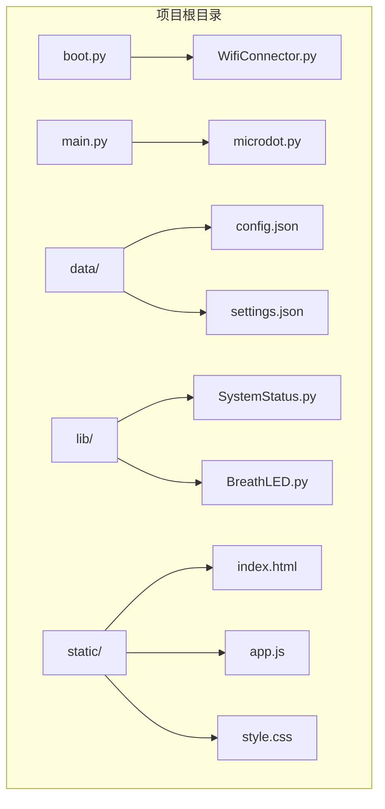
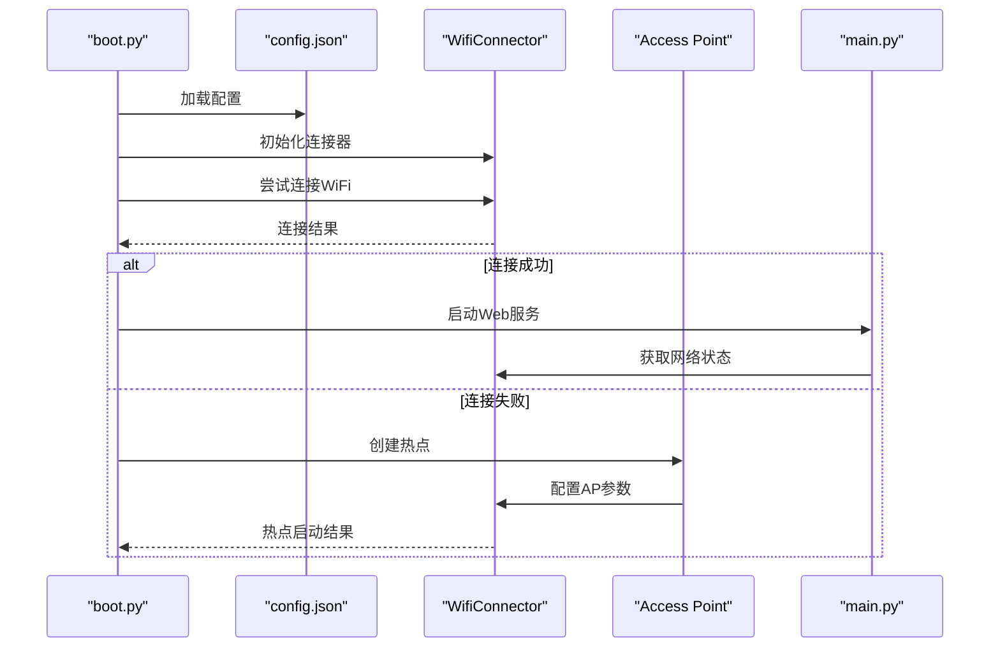
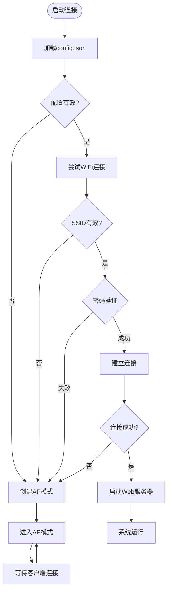
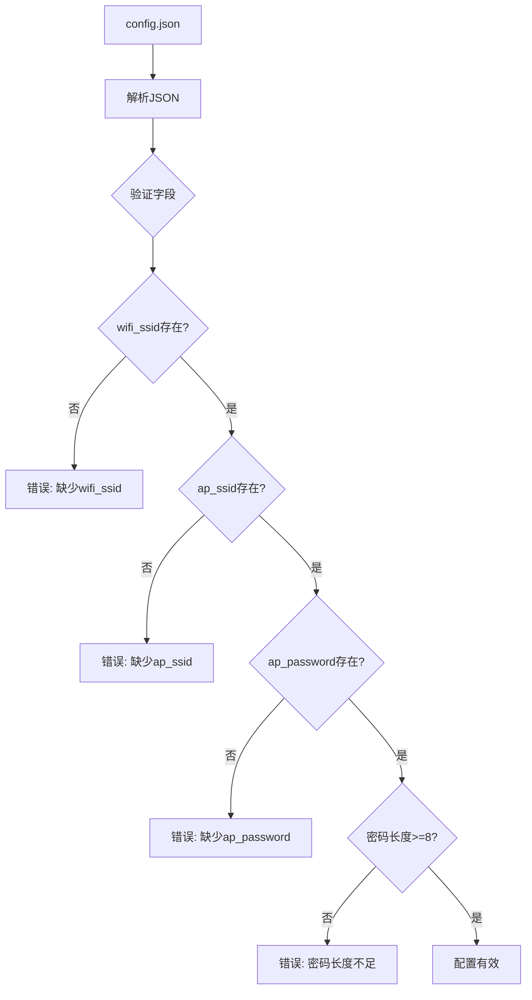
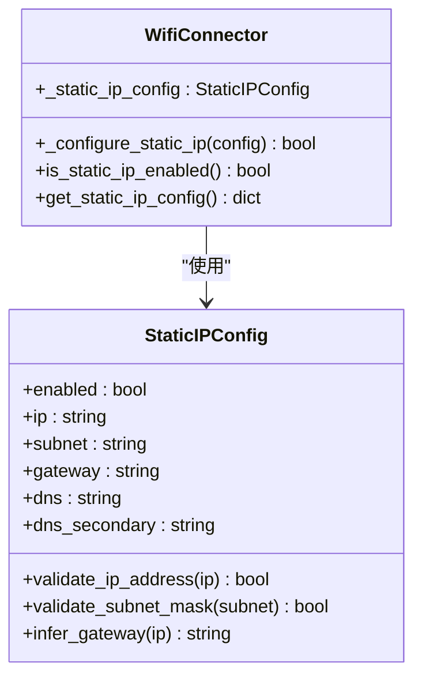
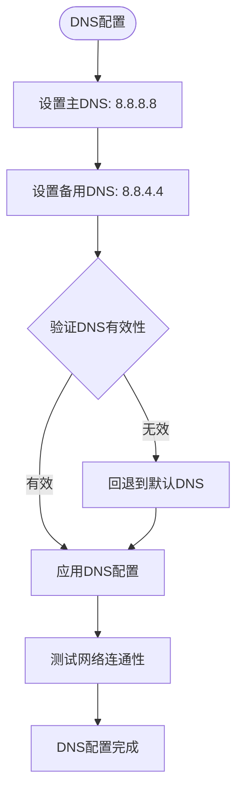
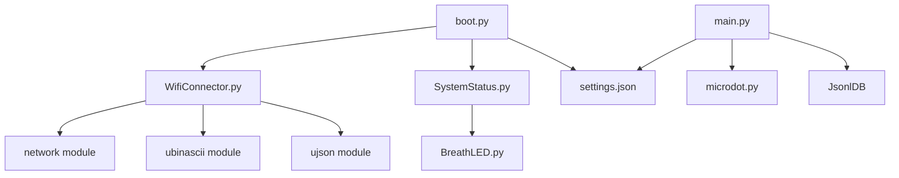
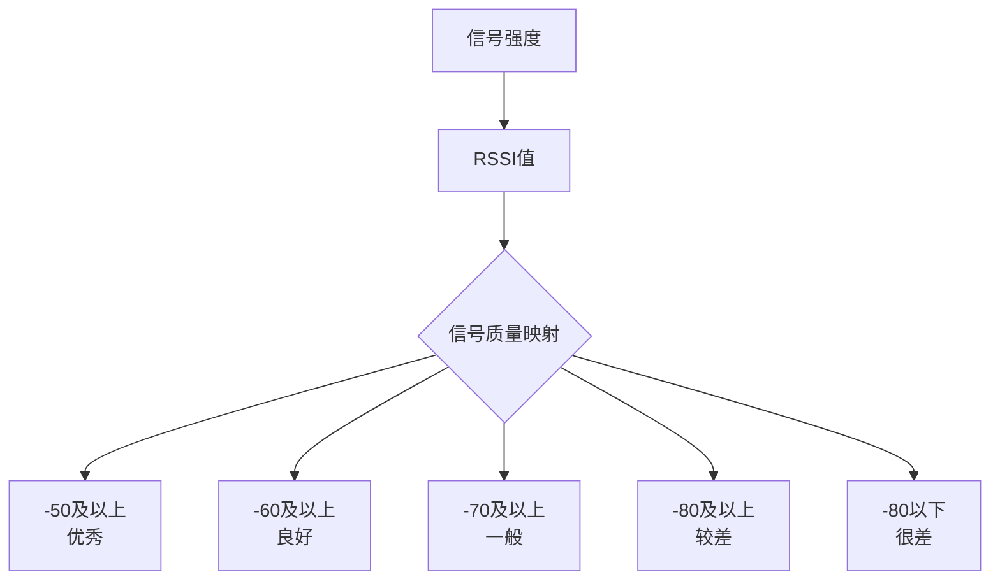

# 网络配置问题

<cite>
**本文档引用的文件**
- [config.json](file://data/config.json)
- [settings.json](file://data/settings.json)
- [WifiConnector.py](file://lib/WifiConnector.py)
- [boot.py](file://boot.py)
- [main.py](file://main.py)
- [SystemStatus.py](file://lib/SystemStatus.py)
- [BreathLED.py](file://lib/BreathLED.py)
</cite>

## 目录
1. [简介](#简介)
2. [项目结构](#项目结构)
3. [核心组件](#核心组件)
4. [架构概览](#架构概览)
5. [详细组件分析](#详细组件分析)
6. [依赖关系分析](#依赖关系分析)
7. [性能考虑](#性能考虑)
8. [故障排查指南](#故障排查指南)
9. [结论](#结论)
10. [附录](#附录)

## 简介

本指南专注于ESP32微控制器项目的网络配置问题排查，涵盖config.json配置文件的正确格式、必填字段验证、配置参数优化，以及路由器兼容性检查、网络参数调优、DNS设置和防火墙配置的解决方案。文档基于实际代码库分析，提供最佳实践和常见配置错误的预防措施。

## 项目结构

该项目是一个基于ESP32的Web应用，包含以下关键目录和文件：



**图表来源**
- [boot.py](file://boot.py#L1-L122)
- [main.py](file://main.py#L1-L548)
- [WifiConnector.py](file://lib/WifiConnector.py#L1-L1930)

**章节来源**
- [boot.py](file://boot.py#L1-L122)
- [main.py](file://main.py#L1-L548)

## 核心组件

### WiFi连接管理器

WifiConnector类是整个网络功能的核心，提供以下主要功能：

- **网络扫描与连接管理**
- **自动重连机制**
- **热点创建与管理**
- **网络配置管理**
- **连接状态监测与诊断**

### 配置文件管理

系统使用两个主要配置文件：
- **config.json**: WiFi网络配置
- **settings.json**: 应用设置配置

### 系统状态指示

SystemStatus类通过LED指示系统运行状态，提供三种模式：
- 正在连接：快速呼吸（500ms周期）
- AP模式：中速呼吸（1500ms周期）
- 运行模式：慢速呼吸（4000ms周期）

**章节来源**
- [WifiConnector.py](file://lib/WifiConnector.py#L11-L120)
- [config.json](file://data/config.json#L1-L6)
- [settings.json](file://data/settings.json#L1-L1)
- [SystemStatus.py](file://lib/SystemStatus.py#L19-L61)

## 架构概览



**图表来源**
- [boot.py](file://boot.py#L22-L98)
- [WifiConnector.py](file://lib/WifiConnector.py#L595-L800)

## 详细组件分析

### WiFi连接流程



**图表来源**
- [boot.py](file://boot.py#L22-L98)
- [WifiConnector.py](file://lib/WifiConnector.py#L595-L800)

### 配置文件格式规范

#### config.json配置格式

| 字段名 | 类型 | 必填 | 描述 | 示例值 |
|--------|------|------|------|--------|
| wifi_ssid | string | 是 | WiFi网络名称 | "leilei-ja" |
| wifi_password | string | 否 | WiFi密码（8位以上） | "lei67837729" |
| ap_ssid | string | 是 | 热点网络名称 | "围炉诗社小热点" |
| ap_password | string | 是 | 热点密码 | "weilu2018" |

#### 配置验证规则



**图表来源**
- [boot.py](file://boot.py#L14-L20)
- [WifiConnector.py](file://lib/WifiConnector.py#L166-L196)

**章节来源**
- [config.json](file://data/config.json#L1-L6)
- [boot.py](file://boot.py#L14-L20)
- [WifiConnector.py](file://lib/WifiConnector.py#L166-L196)

### 网络参数调优

#### 连接参数优化

WifiConnector类提供了多种可调参数：

| 参数 | 默认值 | 说明 | 优化建议 |
|------|--------|------|----------|
| scan_timeout | 10秒 | 网络扫描超时 | 根据环境调整，避免过短导致扫描失败 |
| connect_timeout | 15秒 | 连接超时 | 建议增加到30秒以上 |
| max_retries | 3次 | 最大重试次数 | 建议设置为5次 |
| sync_interval | 300秒 | 常规同步间隔 | 根据网络稳定性调整 |
| force_sync_interval | 1800秒 | 强制同步间隔 | 保持默认值 |

#### 静态IP配置



**图表来源**
- [WifiConnector.py](file://lib/WifiConnector.py#L82-L89)
- [WifiConnector.py](file://lib/WifiConnector.py#L432-L501)

**章节来源**
- [WifiConnector.py](file://lib/WifiConnector.py#L28-L53)
- [WifiConnector.py](file://lib/WifiConnector.py#L432-L501)

### DNS设置和防火墙配置

#### DNS配置策略

系统支持主备DNS服务器配置：



**图表来源**
- [WifiConnector.py](file://lib/WifiConnector.py#L49-L52)
- [WifiConnector.py](file://lib/WifiConnector.py#L470-L474)

#### 防火墙配置考虑

基于ESP32的网络特性，防火墙配置主要涉及：

1. **端口访问控制**: Web服务默认使用80端口
2. **网络隔离**: AP模式下的客户端隔离
3. **连接限制**: 最大客户端数量限制（默认4个）

**章节来源**
- [WifiConnector.py](file://lib/WifiConnector.py#L92-L104)
- [boot.py](file://boot.py#L72-L79)

## 依赖关系分析



**图表来源**
- [boot.py](file://boot.py#L1-L12)
- [main.py](file://main.py#L1-L17)
- [WifiConnector.py](file://lib/WifiConnector.py#L6-L10)

**章节来源**
- [boot.py](file://boot.py#L1-L12)
- [main.py](file://main.py#L1-L17)

## 性能考虑

### 内存优化

系统在启动时设置了CPU频率以平衡性能和功耗：
- CPU频率：240 MHz
- 内存管理：定期垃圾回收

### 网络性能优化

1. **连接超时设置**: 默认15秒，可根据网络环境调整
2. **重试机制**: 最多重试3次，避免长时间阻塞
3. **状态同步**: 定期同步网络状态，检测IP变化

### LED指示优化

SystemStatus类通过调整更新间隔和呼吸周期来平衡视觉效果与CPU占用：

- UPDATE_INTERVAL_MIN: 30ms
- UPDATE_INTERVAL_DIVISOR: 40
- 呼吸周期：500ms/1500ms/4000ms

## 故障排查指南

### 常见配置错误及解决方案

#### 1. 配置文件格式错误

**问题症状**:
- 启动时显示"Error loading config"
- 系统直接进入AP模式

**排查步骤**:
1. 检查config.json语法是否正确
2. 验证JSON格式的有效性
3. 确认必需字段存在

**解决方案**:
```json
{
    "wifi_ssid": "your_wifi_name",
    "wifi_password": "your_wifi_password",
    "ap_ssid": "your_ap_name", 
    "ap_password": "your_ap_password"
}
```

#### 2. WiFi连接失败

**可能原因**:
- SSID不存在或拼写错误
- 密码错误或长度不足
- 路由器不支持的加密方式
- 信号强度过弱

**诊断方法**:
1. 使用`scan_networks()`方法扫描可用网络
2. 检查路由器的认证模式兼容性
3. 验证密码长度（至少8位）

**解决方案**:
```python
# 增加连接超时和重试次数
wifi.connect_timeout = 30
wifi.max_retries = 5
```

#### 3. AP模式启动问题

**问题症状**:
- 热点无法创建
- 客户端无法连接

**排查步骤**:
1. 检查AP配置参数
2. 验证IP地址段是否与现有网络冲突
3. 确认通道设置合理

**解决方案**:
```python
ap_ip_config = {
    'ip': '192.168.18.1',
    'subnet': '255.255.255.0', 
    'gateway': '192.168.18.1',
    'dns': '8.8.8.8'
}
```

#### 4. DNS解析问题

**问题症状**:
- 可以连接WiFi但无法访问外网
- 域名解析失败

**排查步骤**:
1. 检查DNS服务器配置
2. 测试DNS连通性
3. 尝试更换DNS服务器

**解决方案**:
```python
# 验证DNS格式
if not self._validate_ip_address(dns):
    dns = self.DEFAULT_DNS  # 回退到默认DNS
```

### 网络兼容性检查

#### 路由器兼容性

| 路由器类型 | 支持情况 | 注意事项 |
|------------|----------|----------|
| WPA/WPA2混合 | ✅ 完全支持 | 无特殊要求 |
| WPA3 | ⚠️ 部分支持 | 可能需要降级到WPA2 |
| 企业认证 | ❌ 不支持 | 使用个人网络 |
| 5GHz频段 | ✅ 支持 | 确保ESP32天线位置 |
| 2.4GHz频段 | ✅ 支持 | 信号穿透性更好 |

#### 信号质量评估



**图表来源**
- [WifiConnector.py](file://lib/WifiConnector.py#L198-L216)

### 网络参数调优建议

#### 连接稳定性优化

1. **超时参数调整**:
   - scan_timeout: 15-30秒
   - connect_timeout: 20-45秒
   - max_retries: 3-5次

2. **同步间隔优化**:
   - sync_interval: 300-600秒
   - force_sync_interval: 1800秒

3. **静态IP配置**:
   - 确保IP地址段不与现有网络冲突
   - 配置合理的子网掩码
   - 设置正确的网关和DNS

#### 性能监控指标

| 指标 | 正常范围 | 警告阈值 | 异常阈值 |
|------|----------|----------|----------|
| 连接成功率 | ≥90% | 70%-90% | <70% |
| 平均连接时间 | ≤20秒 | 20-40秒 | >40秒 |
| DNS解析时间 | ≤3秒 | 3-5秒 | >5秒 |
| 数据传输速度 | ≥10KB/s | 5-10KB/s | <5KB/s |

**章节来源**
- [boot.py](file://boot.py#L40-L42)
- [WifiConnector.py](file://lib/WifiConnector.py#L28-L53)
- [WifiConnector.py](file://lib/WifiConnector.py#L198-L216)

## 结论

本网络配置问题排查指南基于实际代码库分析，提供了完整的配置文件格式规范、参数验证规则、兼容性检查和性能优化建议。通过遵循本文档的最佳实践，可以有效解决大多数WiFi连接问题，并确保系统在网络环境变化时具备良好的适应性和稳定性。

关键要点包括：
- 严格遵守config.json配置格式
- 合理设置连接参数和超时时间
- 进行充分的路由器兼容性测试
- 建立完善的故障排查流程
- 实施持续的性能监控和优化

## 附录

### 配置文件模板

#### 基础配置模板
```json
{
    "wifi_ssid": "YOUR_WIFI_SSID",
    "wifi_password": "YOUR_WIFI_PASSWORD",
    "ap_ssid": "YOUR_AP_SSID", 
    "ap_password": "YOUR_AP_PASSWORD"
}
```

#### 高级配置模板
```json
{
    "wifi_ssid": "your_network",
    "wifi_password": "secure_password_123",
    "ap_ssid": "device_hotspot",
    "ap_password": "ap_password_456",
    "static_ip": {
        "enabled": true,
        "ip": "192.168.1.100",
        "subnet": "255.255.255.0",
        "gateway": "192.168.1.1",
        "dns": "8.8.8.8"
    }
}
```

### 常用命令参考

#### 网络诊断命令
```bash
# 检查WiFi连接状态
ping google.com

# 查看网络配置
ifconfig

# 测试DNS解析
nslookup example.com

# 检查端口连通性
telnet your_device_ip 80
```

#### 系统监控命令
```bash
# 查看内存使用
free -h

# 监控CPU使用率
top

# 检查磁盘空间
df -h

# 查看进程状态
ps aux
```