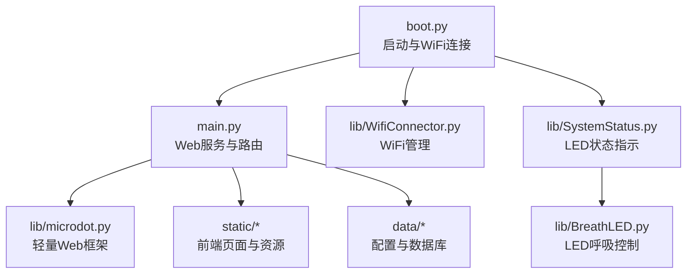
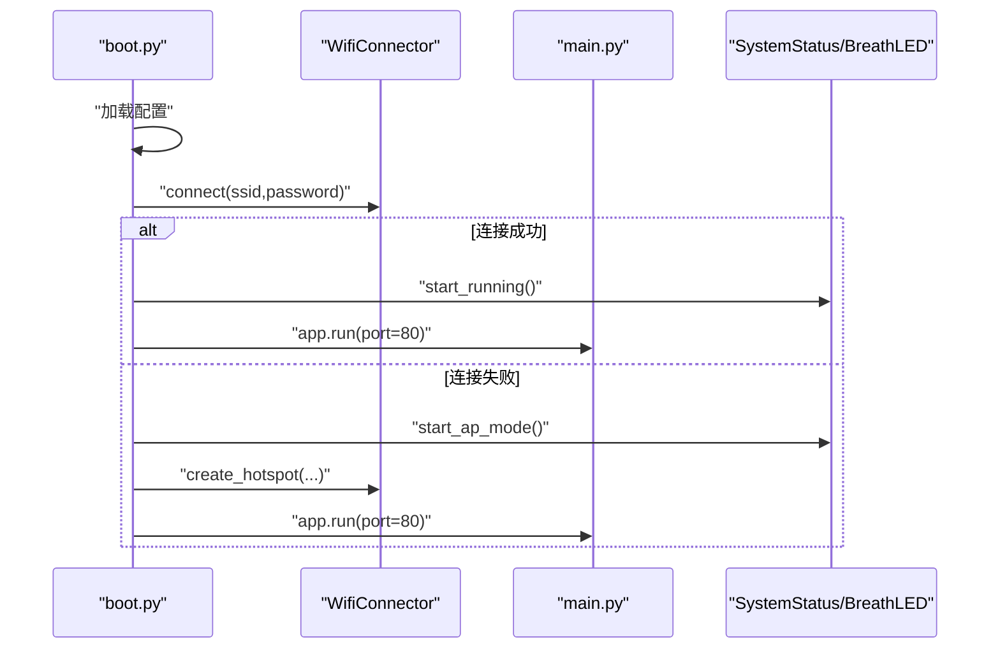
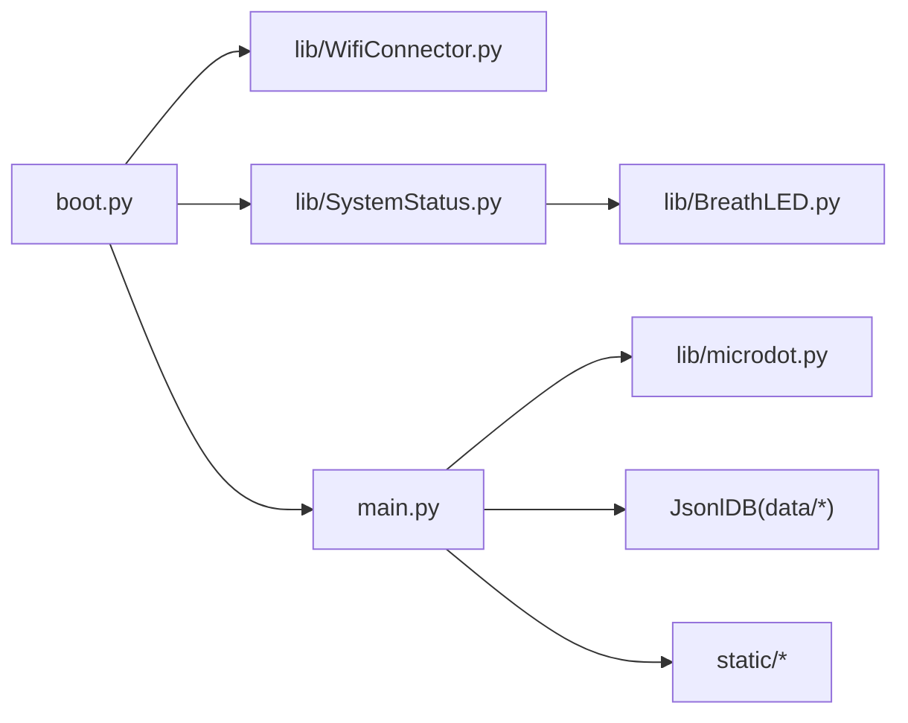

# 调试工具与方法

<cite>
**本文引用的文件**
- [boot.py](file://boot.py)
- [main.py](file://main.py)
- [WifiConnector.py](file://lib/WifiConnector.py)
- [SystemStatus.py](file://lib/SystemStatus.py)
- [BreathLED.py](file://lib/BreathLED.py)
- [microdot.py](file://lib/microdot.py)
- [config.json](file://data/config.json)
- [index.html](file://static/index.html)
- [breath_led_example.py](file://lib/breath_led_example.py)
- [wifi_connector_example.py](file://lib/wifi_connector_example.py)
</cite>

## 目录
1. [简介](#简介)
2. [项目结构](#项目结构)
3. [核心组件](#核心组件)
4. [架构总览](#架构总览)
5. [详细组件分析](#详细组件分析)
6. [依赖关系分析](#依赖关系分析)
7. [性能考虑](#性能考虑)
8. [故障排查指南](#故障排查指南)
9. [结论](#结论)
10. [附录](#附录)

## 简介
本指南面向“围炉诗社·理事台”项目的开发者与运维人员，提供一套系统化的调试工具与方法，覆盖串口调试、日志分析、性能监控与远程调试。内容包括：
- MicroPython REPL 使用与串口输出分析
- 日志与错误定位策略
- 内存使用监控与垃圾回收配合
- 网络连接调试（STA/AP 模式、热点、静态IP）
- 远程调试（Web 服务、静态资源、API 路由）
- 调试脚本示例、自动化测试思路与问题重现技术
- 标准化调试流程与问题记录模板

## 项目结构
项目采用“引导层 + 应用层 + 库模块 + 数据与静态资源”的分层组织方式：
- 引导层：boot.py 负责系统启动、WiFi 连接与应用入口
- 应用层：main.py 提供 Web 服务、路由与数据访问
- 库模块：lib/ 下封装 WiFi、LED、轻量 Web 框架等
- 数据与静态资源：data/ 存放配置与数据库；static/ 提供前端页面与资源

图表来源
- [boot.py](file://boot.py#L1-L122)
- [main.py](file://main.py#L1-L18)
- [WifiConnector.py](file://lib/WifiConnector.py#L1-L120)
- [SystemStatus.py](file://lib/SystemStatus.py#L1-L61)
- [BreathLED.py](file://lib/BreathLED.py#L1-L120)
- [microdot.py](file://lib/microdot.py#L1-L183)

章节来源
- [boot.py](file://boot.py#L1-L122)
- [main.py](file://main.py#L1-L18)
- [config.json](file://data/config.json#L1-L6)

## 核心组件
- 引导与网络：boot.py 负责加载配置、连接 WiFi、失败时进入 AP 模式，并启动应用
- Web 服务：main.py 使用自研 microdot 框架提供 REST API 与静态资源
- WiFi 管理：lib/WifiConnector 提供扫描、连接、重连、热点、静态IP、诊断等能力
- LED 状态：lib/SystemStatus 与 lib/BreathLED 提供 LED 呼吸指示，区分连接中、AP 模式、运行中
- 配置与数据：data/config.json 提供 WiFi 与热点配置；main.py 的 JSONL 数据库管理各业务数据

章节来源
- [boot.py](file://boot.py#L11-L122)
- [main.py](file://main.py#L17-L548)
- [WifiConnector.py](file://lib/WifiConnector.py#L11-L120)
- [SystemStatus.py](file://lib/SystemStatus.py#L19-L61)
- [BreathLED.py](file://lib/BreathLED.py#L11-L120)
- [microdot.py](file://lib/microdot.py#L94-L183)
- [config.json](file://data/config.json#L1-L6)

## 架构总览
系统启动流程与网络连接策略如下：

图表来源
- [boot.py](file://boot.py#L22-L122)
- [WifiConnector.py](file://lib/WifiConnector.py#L595-L799)
- [SystemStatus.py](file://lib/SystemStatus.py#L33-L57)
- [main.py](file://main.py#L541-L548)

## 详细组件分析

### 组件一：引导与启动（boot.py）
- 负责 CPU 频率设置、加载配置、WiFi 连接与 AP 备降、LED 状态指示、应用启动
- 连接失败时自动切换到 AP 模式，便于本地调试与配置
- 启动后打印系统状态与文件列表，辅助串口调试

调试要点
- 在连接失败路径中观察 AP 启动与 LED 指示
- 通过打印的文件列表确认静态资源与数据文件存在性
- 通过增加等待时间，便于上传文件与中断运行

章节来源
- [boot.py](file://boot.py#L8-L122)

### 组件二：WiFi 管理（lib/WifiConnector）
- 提供扫描、连接、重连、断开、忘记网络、热点创建、静态IP配置、诊断等
- 支持连接状态描述、信号质量描述、错误码映射
- 支持静态IP校验、推断网关、DNS 校验与配置

调试要点
- 使用扫描结果筛选目标网络，结合信号强度与认证模式
- 连接失败时查看状态描述与错误码映射，定位密码、AP 不存在或连接超时
- 静态IP场景下验证 IP、子网掩码、网关、DNS 格式
- 热点场景下核对 IP、子网掩码、网关、DNS 一致性

章节来源
- [WifiConnector.py](file://lib/WifiConnector.py#L11-L120)
- [WifiConnector.py](file://lib/WifiConnector.py#L518-L592)
- [WifiConnector.py](file://lib/WifiConnector.py#L595-L799)
- [WifiConnector.py](file://lib/WifiConnector.py#L432-L502)

### 组件三：LED 状态指示（lib/SystemStatus 与 lib/BreathLED）
- SystemStatus 通过 BreathLED 控制单 LED 的呼吸周期，区分连接中（快速）、AP 模式（中速）、运行中（慢速）
- BreathLED 支持 WS2812 与普通 LED，提供呼吸周期、颜色、亮度范围、定时器兼容等

调试要点
- 观察 LED 呼吸节奏判断当前状态
- 若 LED 不工作，检查引脚、类型、最大亮度与 PWM 配置
- 通过 get_status 查询当前配置与运行状态

章节来源
- [SystemStatus.py](file://lib/SystemStatus.py#L19-L61)
- [BreathLED.py](file://lib/BreathLED.py#L11-L120)
- [BreathLED.py](file://lib/BreathLED.py#L595-L633)

### 组件四：Web 服务与路由（main.py 与 lib/microdot）
- main.py 使用 microdot 提供路由与响应，支持 GET/POST、JSON 解析、静态资源发送
- 提供系统状态接口，返回平台、存储、内存等信息
- 集成 JSONL 数据库，实现 CRUD 与分页检索

调试要点
- 通过 /api/system/info 检查内存与存储
- 通过 /api/* 接口验证数据读写与搜索
- 通过静态资源路由确认 HTML/CSS/JS/PNG 文件存在性

章节来源
- [main.py](file://main.py#L17-L548)
- [microdot.py](file://lib/microdot.py#L94-L183)

### 组件五：配置与数据（data/config.json 与 JSONL 数据库）
- config.json 提供 WiFi 与热点配置
- main.py 的 JsonlDB 抽象 JSONL 文件，提供追加、查询、分页、更新、删除、迁移

调试要点
- 确认配置文件存在且字段完整
- 通过 get_max_id 与 fetch_page 验证数据完整性与索引
- 分页与搜索场景下关注内存与 IO 行为

章节来源
- [config.json](file://data/config.json#L1-L6)
- [main.py](file://main.py#L53-L267)

## 依赖关系分析
组件间的导入与调用关系如下：

图表来源
- [boot.py](file://boot.py#L5-L12)
- [SystemStatus.py](file://lib/SystemStatus.py#L10-L61)
- [BreathLED.py](file://lib/BreathLED.py#L1-L120)
- [main.py](file://main.py#L10-L17)
- [microdot.py](file://lib/microdot.py#L1-L183)

章节来源
- [boot.py](file://boot.py#L5-L12)
- [main.py](file://main.py#L10-L17)

## 性能考虑
- 内存管理
  - 使用 gc.collect() 主动触发垃圾回收，降低碎片化
  - 在高频操作（如搜索、分页）前后打印内存信息，评估内存峰值
- IO 与存储
  - JSONL 文件逐行扫描，搜索场景建议限制字段或分页
  - 大文件传输通过 send_file 返回文件流，避免一次性加载
- 网络与定时
  - WiFi 连接超时与重试次数可调，避免长时间阻塞
  - LED 呼吸周期与更新间隔可调，平衡视觉效果与 CPU 占用

章节来源
- [main.py](file://main.py#L279-L294)
- [main.py](file://main.py#L113-L186)
- [microdot.py](file://lib/microdot.py#L166-L183)
- [BreathLED.py](file://lib/BreathLED.py#L557-L590)

## 故障排查指南

### 串口调试与日志分析
- 启动阶段
  - 观察 boot.py 输出的 CPU 频率、配置加载、WiFi 连接尝试与 AP 启动
  - 若连接失败，检查 config.json 字段与 WiFi 名称/密码
- 运行阶段
  - 通过 print_system_status 输出内存与 IP 信息
  - API 调用异常会在路由层捕获并打印异常栈
- LED 状态
  - 根据呼吸节奏判断连接状态（快速/中速/慢速）

章节来源
- [boot.py](file://boot.py#L22-L122)
- [main.py](file://main.py#L279-L294)
- [main.py](file://main.py#L541-L548)
- [SystemStatus.py](file://lib/SystemStatus.py#L33-L57)

### 网络连接调试
- 连接失败排查
  - 使用 scan_networks() 获取可用网络，确认 SSID、信号强度、认证模式
  - 检查错误码映射与状态描述，定位密码错误、AP 不存在、连接超时
- AP 模式
  - 确认 AP SSID、密码、IP 段配置一致
  - 通过 get_hotspot_info() 核对热点状态与客户端数量
- 静态IP
  - 校验 IP、子网掩码、网关、DNS 格式
  - 使用 switch_to_static_ip/switch_to_dhcp 切换并验证 IP 模式

章节来源
- [WifiConnector.py](file://lib/WifiConnector.py#L518-L592)
- [WifiConnector.py](file://lib/WifiConnector.py#L595-L799)
- [WifiConnector.py](file://lib/WifiConnector.py#L432-L502)
- [boot.py](file://boot.py#L65-L87)

### 远程调试与 Web 服务
- 访问 /api/system/info 获取系统状态（平台、存储、内存）
- 通过静态资源路由确认 HTML/CSS/JS/PNG 文件存在
- 使用浏览器开发者工具查看网络请求与响应，定位 API 异常

章节来源
- [main.py](file://main.py#L528-L540)
- [microdot.py](file://lib/microdot.py#L166-L183)

### 调试脚本与自动化测试
- WiFi 调试脚本
  - 使用 wifi_connector_example.py 的测试用例快速验证扫描、连接、热点、静态IP、诊断等功能
- LED 调试脚本
  - 使用 breath_led_example.py 的演示函数验证呼吸周期、颜色、亮度、状态查询等
- 自动化测试建议
  - 编写最小化用例：连接/断开、热点创建/停止、静态IP切换、系统状态查询
  - 结合 gc.collect() 与内存打印，评估回归

章节来源
- [wifi_connector_example.py](file://lib/wifi_connector_example.py#L35-L594)
- [breath_led_example.py](file://lib/breath_led_example.py#L15-L199)

### 问题重现技术
- 环境隔离
  - 通过 boot.py 的 AP 模式与静态资源打印，快速复现问题场景
- 日志与状态
  - 在关键路径打印状态（连接状态、IP、内存、LED 呼吸周期）
- 回归验证
  - 使用最小用例（如仅连接/断开）验证修复前后行为一致性

章节来源
- [boot.py](file://boot.py#L92-L122)
- [main.py](file://main.py#L279-L294)
- [SystemStatus.py](file://lib/SystemStatus.py#L33-L57)

### 标准化调试流程
- 准备阶段
  - 确认 config.json 配置正确，静态资源与数据文件存在
- 启动阶段
  - 观察 boot.py 输出，记录 CPU 频率、WiFi 连接尝试、AP 启动
- 运行阶段
  - 访问 /api/system/info，记录内存与存储
  - 通过 API 验证数据读写与搜索
- 网络阶段
  - 使用扫描与连接测试，必要时切换到 AP 模式
  - 静态IP场景下验证 IP、子网掩码、网关、DNS
- LED 阶段
  - 观察 LED 呼吸节奏，确认状态指示正确
- 总结与记录
  - 记录异常栈、错误码、状态描述、内存峰值、网络参数

章节来源
- [boot.py](file://boot.py#L22-L122)
- [main.py](file://main.py#L528-L540)
- [WifiConnector.py](file://lib/WifiConnector.py#L518-L592)
- [SystemStatus.py](file://lib/SystemStatus.py#L33-L57)

## 结论
本指南围绕“围炉诗社·理事台”的启动、网络、LED、Web 服务与数据模块，给出了系统化的调试方法与流程。通过串口输出、日志分析、内存监控、网络诊断与远程调试，能够快速定位问题并形成可复现的测试用例。建议在日常开发中固化调试流程与问题记录模板，提升问题解决效率与系统稳定性。

## 附录

### 附录A：常用命令与路径
- 启动与调试
  - 访问 /api/system/info 查看系统状态
  - 通过 /static/* 访问前端资源
- 配置与数据
  - data/config.json：WiFi 与热点配置
  - data/*.jsonl：业务数据（诗歌、成员、活动、财务、任务）
- 调试脚本
  - lib/wifi_connector_example.py：WiFi 功能测试
  - lib/breath_led_example.py：LED 功能测试

章节来源
- [main.py](file://main.py#L528-L540)
- [microdot.py](file://lib/microdot.py#L166-L183)
- [config.json](file://data/config.json#L1-L6)
- [wifi_connector_example.py](file://lib/wifi_connector_example.py#L611-L700)
- [breath_led_example.py](file://lib/breath_led_example.py#L159-L199)