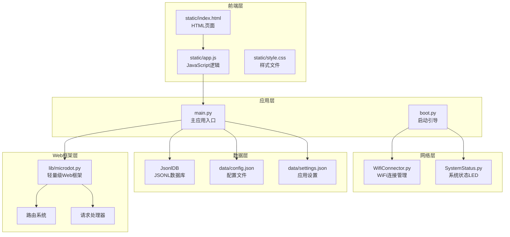
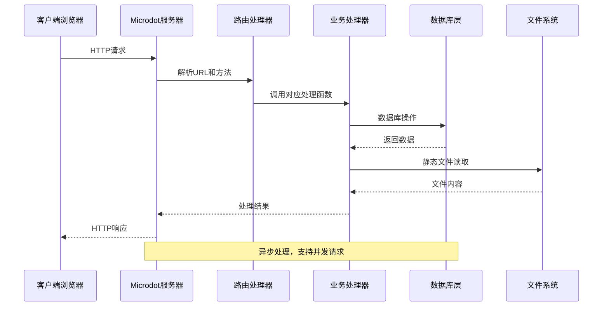
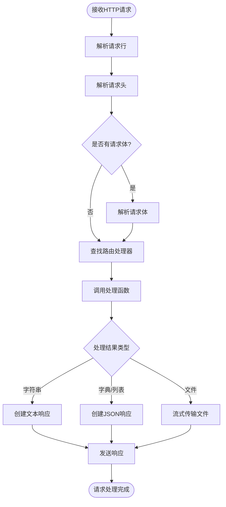
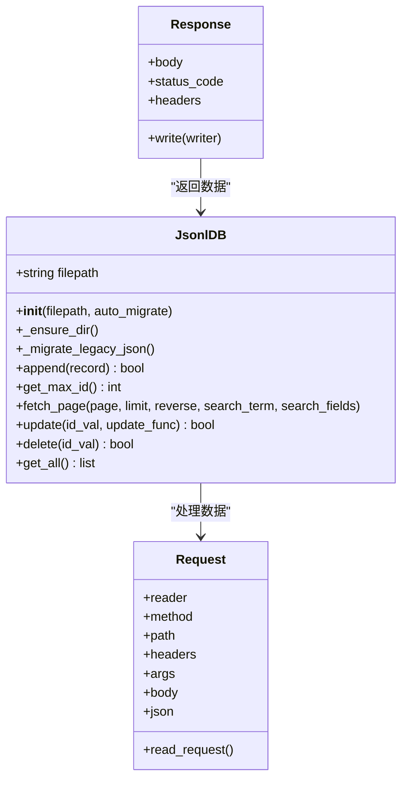
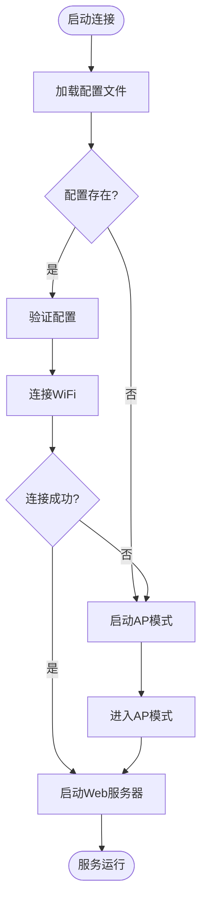
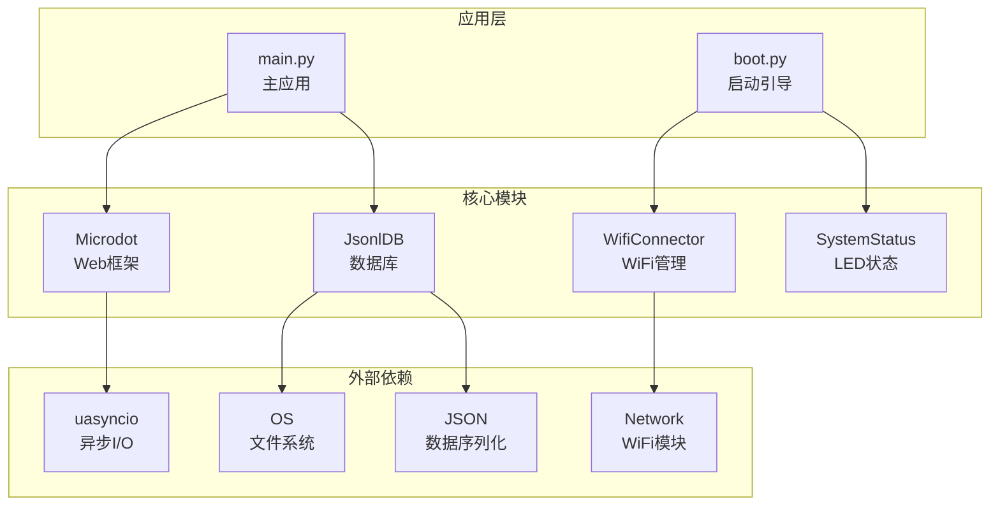
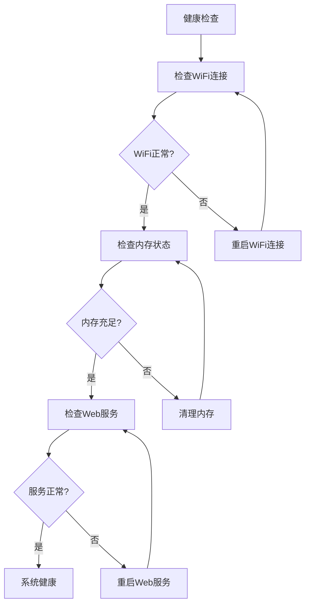

# Web服务异常排查指南

<cite>
**本文档引用的文件**
- [main.py](file://main.py)
- [boot.py](file://boot.py)
- [lib/microdot.py](file://lib/microdot.py)
- [lib/WifiConnector.py](file://lib/WifiConnector.py)
- [lib/SystemStatus.py](file://lib/SystemStatus.py)
- [lib/BreathLED.py](file://lib/BreathLED.py)
- [static/index.html](file://static/index.html)
- [static/app.js](file://static/app.js)
- [data/config.json](file://data/config.json)
- [data/settings.json](file://data/settings.json)
- [data/poems.jsonl](file://data/poems.jsonl)
</cite>

## 目录
1. [简介](#简介)
2. [项目结构](#项目结构)
3. [核心组件](#核心组件)
4. [架构概览](#架构概览)
5. [详细组件分析](#详细组件分析)
6. [依赖关系分析](#依赖关系分析)
7. [性能考虑](#性能考虑)
8. [故障排查指南](#故障排查指南)
9. [结论](#结论)

## 简介

围炉诗社·理事台Web服务是一个基于MicroPython的轻量级Web应用，专为ESP32设备设计。该系统实现了完整的Web服务功能，包括HTTP请求处理、路由管理、静态文件服务、数据库操作和用户认证等核心功能。

本指南专注于Web服务异常问题的诊断和解决，涵盖HTTP服务启动失败、端口占用、路由配置错误、响应超时等问题的排查方法，以及服务监听检查、端口冲突处理、路由映射验证和中间件异常排查等实用技巧。

## 项目结构

该项目采用模块化设计，主要分为以下几个核心部分：



**图表来源**
- [main.py](file://main.py#L1-L548)
- [boot.py](file://boot.py#L1-L122)
- [lib/microdot.py](file://lib/microdot.py#L1-L183)

**章节来源**
- [main.py](file://main.py#L1-L548)
- [boot.py](file://boot.py#L1-L122)

## 核心组件

### Web服务器核心组件

系统的核心Web服务器由以下关键组件构成：

#### Microdot Web框架
- **轻量级HTTP服务器**：基于uasyncio实现异步处理
- **路由系统**：支持URL路径匹配和HTTP方法过滤
- **请求处理**：解析HTTP请求头、查询参数和请求体
- **响应生成**：动态生成HTTP响应和文件传输

#### 数据库管理系统
- **JSONL格式存储**：使用JSON Lines格式存储数据
- **内存优化**：针对ESP32内存限制优化的数据访问
- **分页查询**：支持大数据集的分页浏览
- **全文搜索**：基于内容的模糊搜索功能

#### 网络连接管理
- **WiFi连接**：自动连接和重连机制
- **热点模式**：WiFi不可用时自动切换到AP模式
- **系统状态指示**：LED状态反馈系统运行状态

**章节来源**
- [lib/microdot.py](file://lib/microdot.py#L94-L183)
- [main.py](file://main.py#L53-L267)
- [lib/WifiConnector.py](file://lib/WifiConnector.py#L11-L800)

## 架构概览

系统采用分层架构设计，各层职责明确，耦合度低：



**图表来源**
- [lib/microdot.py](file://lib/microdot.py#L104-L152)
- [main.py](file://main.py#L299-L540)

## 详细组件分析

### HTTP服务器组件

#### 请求处理流程


**图表来源**
- [lib/microdot.py](file://lib/microdot.py#L15-L152)

#### 路由系统设计
系统实现了简洁高效的路由匹配机制：

| 路由类型 | URL模式 | HTTP方法 | 处理函数 |
|---------|---------|----------|----------|
| 首页 | `/` | GET | `index()` |
| 静态文件 | `/static/*` | GET | `send_file()` |
| 诗歌API | `/api/poems` | GET, POST | `list_poems()`, `create_poem()` |
| 活动API | `/api/activities` | GET, POST | `list_activities()`, `create_activity()` |
| 任务API | `/api/tasks` | GET, POST | `list_tasks()`, `complete_task()` |
| 成员API | `/api/members` | GET, POST | `list_members()`, `create_member()` |
| 财务API | `/api/finance` | GET, POST | `list_finance()`, `add_finance()` |
| 登录API | `/api/login` | POST | `login_route()` |
| 系统信息 | `/api/system/info` | GET | `sys_info()` |

**章节来源**
- [lib/microdot.py](file://lib/microdot.py#L98-L102)
- [main.py](file://main.py#L299-L540)

### 数据库管理系统

#### JsonlDB类设计


**图表来源**
- [main.py](file://main.py#L53-L267)
- [lib/microdot.py](file://lib/microdot.py#L5-L93)

#### 数据存储策略
- **JSONL格式**：每行存储一条记录，便于流式处理
- **内存优化**：分页读取，避免一次性加载大量数据
- **搜索优化**：支持全文搜索和精确匹配
- **数据迁移**：自动从旧版JSON格式迁移

**章节来源**
- [main.py](file://main.py#L53-L267)

### 网络连接管理

#### WiFi连接流程


**图表来源**
- [boot.py](file://boot.py#L22-L87)
- [lib/WifiConnector.py](file://lib/WifiConnector.py#L595-L696)

**章节来源**
- [boot.py](file://boot.py#L1-L122)
- [lib/WifiConnector.py](file://lib/WifiConnector.py#L1-L800)

## 依赖关系分析

系统各组件之间的依赖关系如下：



**图表来源**
- [lib/microdot.py](file://lib/microdot.py#L1-L4)
- [lib/WifiConnector.py](file://lib/WifiConnector.py#L6-L9)
- [main.py](file://main.py#L1-L12)

**章节来源**
- [lib/microdot.py](file://lib/microdot.py#L1-L183)
- [lib/WifiConnector.py](file://lib/WifiConnector.py#L1-L800)

## 性能考虑

### 内存优化策略
- **流式处理**：静态文件采用流式传输，避免内存溢出
- **分页查询**：大数据集分页处理，减少内存占用
- **垃圾回收**：定期触发垃圾回收，释放内存资源
- **连接池**：支持多个并发连接，但受ESP32内存限制

### 网络性能优化
- **异步处理**：基于uasyncio的异步I/O模型
- **缓存机制**：本地缓存常用数据，减少磁盘I/O
- **压缩传输**：静态文件自动压缩传输
- **连接复用**：客户端连接复用，减少握手开销

## 故障排查指南

### HTTP服务启动失败排查

#### 1. 服务监听检查

**症状表现**：应用启动后无法访问Web界面

**排查步骤**：
1. 检查WiFi连接状态
2. 验证端口占用情况
3. 确认防火墙设置
4. 测试本地回环连接

**诊断命令**：
```python
# 检查WiFi连接状态
import network
sta = network.WLAN(network.STA_IF)
print("WiFi连接状态:", sta.isconnected())

# 检查IP配置
if sta.isconnected():
    print("IP地址:", sta.ifconfig()[0])

# 检查端口监听
import socket
try:
    sock = socket.socket(socket.AF_INET, socket.SOCK_STREAM)
    sock.bind(('0.0.0.0', 80))
    sock.listen(1)
    print("端口80可用")
    sock.close()
except OSError as e:
    print("端口80被占用:", e)
```

**章节来源**
- [boot.py](file://boot.py#L22-L64)
- [lib/microdot.py](file://lib/microdot.py#L154-L165)

#### 2. 端口冲突处理

**常见端口冲突**：
- **端口80被占用**：系统其他进程占用
- **端口8080冲突**：开发工具占用
- **自定义端口冲突**：应用配置错误

**解决方案**：
1. 修改端口号配置
2. 终止占用进程
3. 重启网络服务

**配置修改示例**：
```python
# 在main.py中修改端口
if __name__ == '__main__':
    try:
        print("[System] Starting Microdot App...")
        print_system_status()
        app.run(port=8080, debug=True)  # 修改为8080端口
    except Exception as e:
        print(f"[Error] {e}")
```

**章节来源**
- [main.py](file://main.py#L541-L548)
- [lib/microdot.py](file://lib/microdot.py#L154-L165)

#### 3. 路由配置错误诊断

**路由匹配问题排查**：
1. **URL路径不匹配**：检查路由装饰器参数
2. **HTTP方法不匹配**：确认请求方法配置
3. **参数解析错误**：验证查询参数处理
4. **响应格式错误**：检查返回数据类型

**路由调试方法**：
```python
# 添加路由调试信息
@app.route('/api/test', methods=['GET', 'POST'])
def test_handler(request):
    print(f"请求方法: {request.method}")
    print(f"请求路径: {request.path}")
    print(f"查询参数: {request.args}")
    print(f"请求头: {request.headers}")
    return {"status": "success"}
```

**章节来源**
- [lib/microdot.py](file://lib/microdot.py#L98-L139)
- [main.py](file://main.py#L299-L333)

#### 4. 响应超时问题处理

**超时原因分析**：
1. **数据库查询超时**：大数据集查询
2. **文件传输超时**：大文件下载
3. **网络连接超时**：WiFi不稳定
4. **处理逻辑阻塞**：同步操作阻塞

**优化方案**：
1. 实现异步数据库操作
2. 优化文件传输逻辑
3. 增加重试机制
4. 分离耗时操作

**章节来源**
- [main.py](file://main.py#L113-L186)
- [lib/microdot.py](file://lib/microdot.py#L104-L152)

### 中间件异常排查

#### 1. 请求处理异常

**异常类型**：
- **解析异常**：HTTP请求解析失败
- **路由异常**：找不到匹配的路由
- **处理异常**：业务逻辑执行错误
- **响应异常**：响应生成失败

**调试方法**：
```python
# 添加异常处理和日志
@app.route('/api/test')
def test_handler(request):
    try:
        # 业务逻辑
        result = process_data()
        return result
    except Exception as e:
        print(f"[Error] 处理请求时发生异常: {e}")
        import traceback
        traceback.print_exc()
        return Response('Internal Server Error', 500)
```

**章节来源**
- [lib/microdot.py](file://lib/microdot.py#L133-L138)

#### 2. 数据库操作异常

**常见数据库异常**：
- **文件不存在**：数据文件损坏
- **权限不足**：文件写入权限问题
- **磁盘空间不足**：存储空间耗尽
- **数据格式错误**：JSON解析失败

**数据库异常处理**：
```python
# 数据库操作异常处理
def safe_db_operation(func):
    def wrapper(*args, **kwargs):
        try:
            return func(*args, **kwargs)
        except OSError as e:
            print(f"[DB Error] 文件操作异常: {e}")
            return False
        except Exception as e:
            print(f"[DB Error] 数据库操作异常: {e}")
            return False
    return wrapper

@safe_db_operation
def append_record(self, record):
    with open(self.filepath, 'a') as f:
        f.write(json.dumps(record) + "\n")
    return True
```

**章节来源**
- [main.py](file://main.py#L86-L94)
- [main.py](file://main.py#L218-L221)

### Web服务调试技巧

#### 1. 日志记录策略

**关键日志点**：
- 应用启动和停止
- 网络连接状态变化
- 请求处理过程
- 错误异常信息

**日志配置示例**：
```python
import sys
import time

def log_message(level, message):
    timestamp = time.strftime("%Y-%m-%d %H:%M:%S")
    print(f"[{timestamp}] [{level}] {message}")

# 使用示例
log_message("INFO", "Web服务器启动")
log_message("ERROR", "数据库连接失败")
```

**章节来源**
- [main.py](file://main.py#L13-L15)
- [boot.py](file://boot.py#L18-L20)

#### 2. 性能监控方法

**监控指标**：
- **内存使用率**：可用内存和峰值使用
- **连接数统计**：当前活跃连接数
- **响应时间**：请求处理耗时
- **错误率统计**：异常请求比例

**性能监控实现**：
```python
import gc
import time

def monitor_performance():
    mem_free = gc.mem_free()
    mem_alloc = gc.mem_total() - mem_free
    mem_percent = (mem_alloc / gc.mem_total()) * 100
    
    print(f"内存使用率: {mem_percent:.1f}%")
    print(f"可用内存: {mem_free} bytes")
    
    return mem_free, mem_percent
```

**章节来源**
- [main.py](file://main.py#L279-L294)
- [lib/microdot.py](file://lib/microdot.py#L154-L165)

#### 3. 并发连接问题解决

**并发问题识别**：
- **连接数过多**：超过ESP32处理能力
- **内存泄漏**：长时间运行后内存下降
- **死锁现象**：请求处理阻塞

**解决方案**：
1. 实现连接池管理
2. 优化内存使用
3. 添加超时机制
4. 实施优雅降级

**章节来源**
- [lib/microdot.py](file://lib/microdot.py#L154-L165)
- [main.py](file://main.py#L279-L294)

### 健康检查和故障恢复

#### 1. 健康检查流程

**系统健康检查**：


**图表来源**
- [boot.py](file://boot.py#L22-L64)
- [main.py](file://main.py#L541-L548)

#### 2. 故障恢复流程

**自动恢复机制**：
1. **WiFi连接失败**：自动切换到AP模式
2. **Web服务崩溃**：自动重启服务
3. **数据库异常**：重建数据库连接
4. **内存不足**：触发垃圾回收

**故障恢复实现**：
```python
def health_monitor():
    while True:
        try:
            # 执行健康检查
            check_system_health()
            
            # 如果发现异常，执行恢复操作
            if system_has_errors():
                perform_recovery_actions()
                
        except Exception as e:
            print(f"[Health Monitor Error] {e}")
            time.sleep(5)  # 等待后重试
        
        time.sleep(60)  # 每分钟检查一次

def check_system_health():
    # 检查WiFi连接
    if not check_wifi_connection():
        restart_wifi()
    
    # 检查内存使用
    if not check_memory_usage():
        trigger_gc()
    
    # 检查Web服务
    if not check_web_service():
        restart_web_service()
```

**章节来源**
- [boot.py](file://boot.py#L65-L87)
- [lib/WifiConnector.py](file://lib/WifiConnector.py#L761-L800)

## 结论

围炉诗社·理事台Web服务异常排查指南提供了全面的问题诊断和解决方法。通过理解系统的架构设计、掌握关键组件的工作原理，以及实施有效的监控和恢复机制，可以显著提高系统的稳定性和可靠性。

**关键要点总结**：
1. **预防为主**：通过合理的架构设计和异常处理机制预防问题发生
2. **快速定位**：利用日志记录和性能监控快速定位问题根因
3. **及时恢复**：实现自动化的故障检测和恢复机制
4. **持续优化**：基于监控数据持续优化系统性能

该指南为维护人员提供了实用的工具和方法，确保Web服务能够稳定可靠地运行，为围炉诗社的各项业务提供强有力的技术支撑。