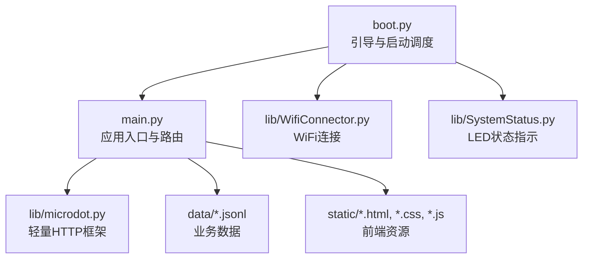
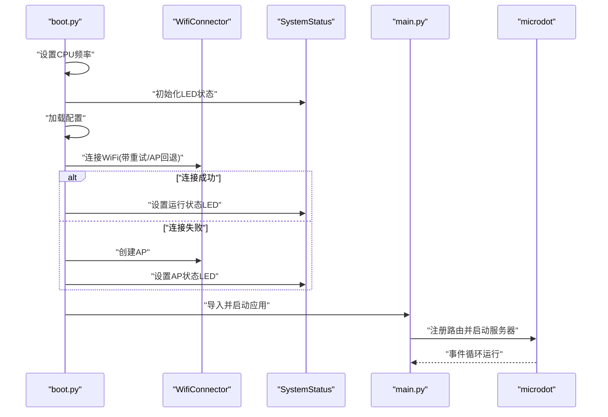
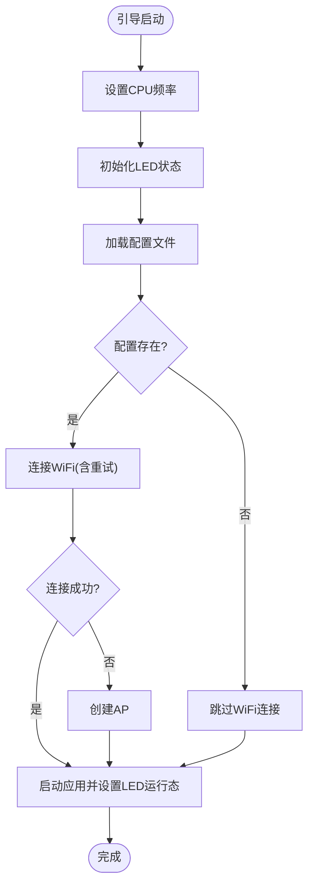
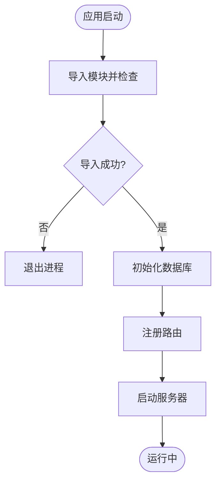
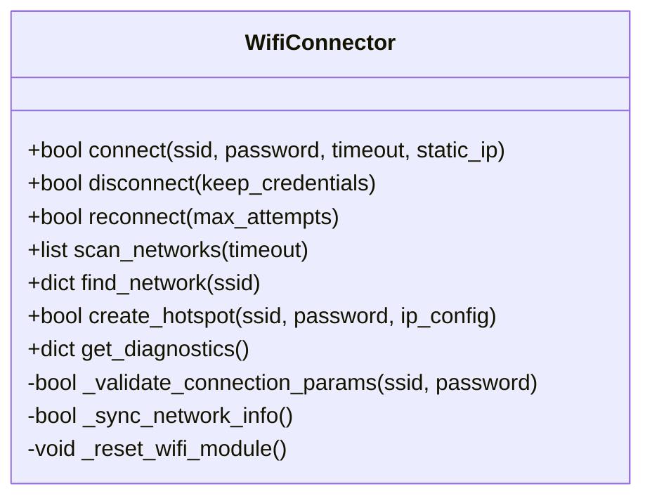
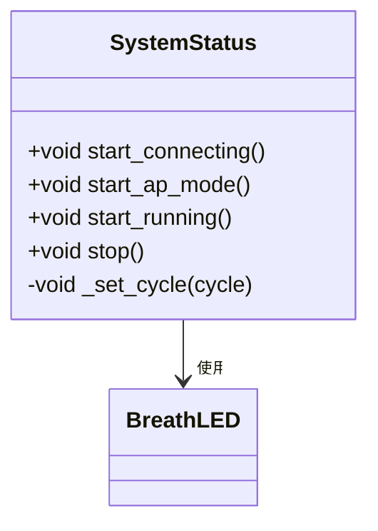
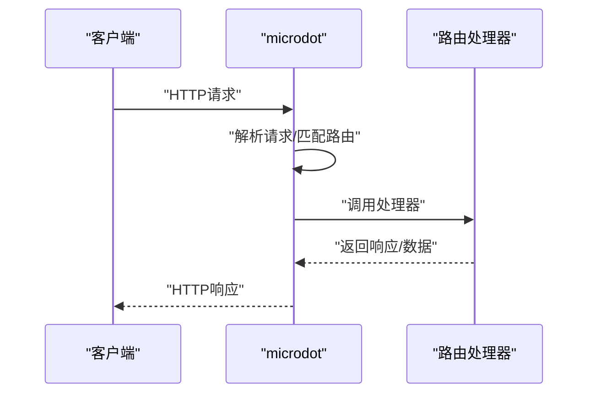
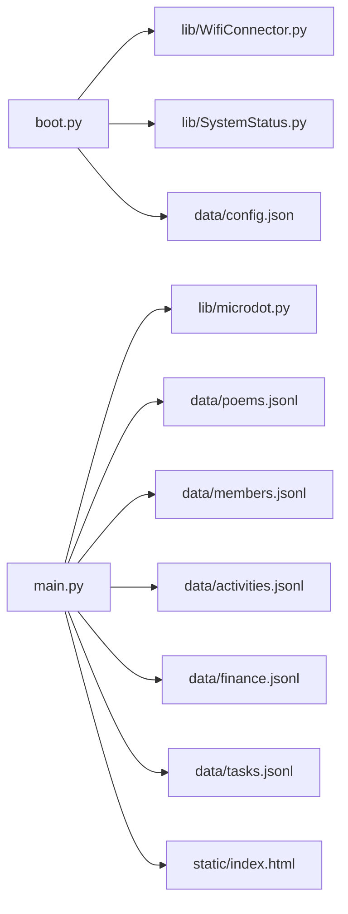

# 启动失败问题

<cite>
**本文引用的文件**
- [boot.py](file://boot.py)
- [main.py](file://main.py)
- [config.json](file://data/config.json)
- [settings.json](file://data/settings.json)
- [WifiConnector.py](file://lib/WifiConnector.py)
- [SystemStatus.py](file://lib/SystemStatus.py)
- [microdot.py](file://lib/microdot.py)
- [index.html](file://static/index.html)
- [poems.jsonl](file://data/poems.jsonl)
</cite>

## 目录
1. [简介](#简介)
2. [项目结构](#项目结构)
3. [核心组件](#核心组件)
4. [架构总览](#架构总览)
5. [详细组件分析](#详细组件分析)
6. [依赖关系分析](#依赖关系分析)
7. [性能考量](#性能考量)
8. [故障排查指南](#故障排查指南)
9. [结论](#结论)
10. [附录](#附录)

## 简介
本指南聚焦“围炉诗社·理事台”的启动失败问题，覆盖主程序无法启动、模块导入错误、文件系统异常等常见场景。文档提供启动顺序检查、依赖模块验证、配置文件加载失败的处理流程，并给出启动脚本调试技巧、异常堆栈分析方法以及系统初始化失败的恢复策略，帮助快速定位并解决问题。

## 项目结构
项目采用“引导层 + 应用层 + 配置与数据 + 静态资源 + 库模块”的分层组织方式：
- 引导层：boot.py 负责系统初始化、WiFi连接与AP回退、应用启动调度
- 应用层：main.py 实现Web服务、路由与业务API、数据库读写
- 配置与数据：data/ 下的 JSON/JSONL 文件，承载网络、系统设置与业务数据
- 静态资源：static/ 下的前端页面与样式
- 库模块：lib/ 下的 WiFi、LED、轻量HTTP框架等

图表来源
- [boot.py](file://boot.py#L88-L122)
- [main.py](file://main.py#L1-L548)
- [WifiConnector.py](file://lib/WifiConnector.py#L1-L120)
- [SystemStatus.py](file://lib/SystemStatus.py#L1-L61)
- [microdot.py](file://lib/microdot.py#L1-L183)
- [index.html](file://static/index.html#L1-L269)

章节来源
- [boot.py](file://boot.py#L1-L122)
- [main.py](file://main.py#L1-L50)

## 核心组件
- 引导与启动调度（boot.py）
  - CPU频率设置、WiFi连接与AP回退、应用启动与LED状态联动
- 应用入口与路由（main.py）
  - 轻量HTTP框架、路由注册、数据库访问、系统状态查询
- WiFi连接管理（lib/WifiConnector.py）
  - 连接/断开、热点创建、参数校验、状态诊断
- LED状态指示（lib/SystemStatus.py）
  - 单灯呼吸周期控制，区分连接、AP、运行三种状态
- 轻量HTTP框架（lib/microdot.py）
  - 请求解析、响应生成、静态文件发送、异步服务器

章节来源
- [boot.py](file://boot.py#L1-L122)
- [main.py](file://main.py#L1-L18)
- [WifiConnector.py](file://lib/WifiConnector.py#L1-L120)
- [SystemStatus.py](file://lib/SystemStatus.py#L1-L61)
- [microdot.py](file://lib/microdot.py#L1-L183)

## 架构总览
系统启动流程从引导层开始，依次完成网络初始化与连接、应用启动与路由注册，最后进入事件循环提供Web服务。

图表来源
- [boot.py](file://boot.py#L11-L122)
- [WifiConnector.py](file://lib/WifiConnector.py#L595-L799)
- [SystemStatus.py](file://lib/SystemStatus.py#L19-L61)
- [main.py](file://main.py#L17-L18)
- [microdot.py](file://lib/microdot.py#L154-L165)

## 详细组件分析

### 组件A：引导层（boot.py）
- 关键职责
  - 设置CPU频率，打印频率信息
  - 初始化全局WiFi连接器，支持调试
  - 加载配置文件（data/config.json），解析WiFi与AP参数
  - 连接WiFi（带超时与重试），失败则创建AP
  - 启动应用（main），根据网络模式设置LED状态
- 启动顺序要点
  - 频率设置应在导入模块前完成
  - WiFi连接应优先于应用启动
  - LED状态需与网络模式保持一致
- 常见问题
  - 配置文件缺失或格式错误导致连接跳过
  - WiFi连接超时或失败，AP创建失败
  - 应用导入异常导致主程序未运行

图表来源
- [boot.py](file://boot.py#L11-L122)

章节来源
- [boot.py](file://boot.py#L1-L122)

### 组件B：应用层（main.py）
- 关键职责
  - 导入必要模块并捕获导入错误
  - 创建轻量HTTP应用实例
  - 注册静态资源路由与业务API路由
  - 初始化多个JSONL数据库（Poems/Members/Activities/Finance/Tasks）
  - 提供系统状态查询与前端资源访问
- 启动顺序要点
  - 导入阶段必须成功，失败直接退出
  - 数据库初始化应在路由注册前完成
  - 静态资源路由应先于业务路由，避免路径冲突
- 常见问题
  - 导入第三方模块失败（如网络、文件系统）
  - 数据库文件不存在或损坏
  - 路由冲突或静态资源路径错误

图表来源
- [main.py](file://main.py#L4-L16)
- [main.py](file://main.py#L262-L278)
- [main.py](file://main.py#L299-L540)

章节来源
- [main.py](file://main.py#L1-L548)

### 组件C：WiFi连接管理（lib/WifiConnector.py）
- 关键职责
  - 连接/断开WiFi、自动重连、忘记网络
  - 扫描网络、参数校验、状态描述
  - 热点创建、静态IP配置、诊断信息
- 启动顺序要点
  - 连接前需初始化STA接口
  - 多次失败后可重置WiFi模块
  - 连接成功后同步网络信息
- 常见问题
  - 参数类型/长度校验失败
  - 连接状态异常（密码错误、未找到AP、连接失败）
  - 静态IP配置无效或DNS不可用

图表来源
- [WifiConnector.py](file://lib/WifiConnector.py#L11-L800)

章节来源
- [WifiConnector.py](file://lib/WifiConnector.py#L1-L800)

### 组件D：LED状态指示（lib/SystemStatus.py）
- 关键职责
  - 控制单灯呼吸周期，区分连接、AP、运行三种状态
  - 全局实例供引导与应用共享调用
- 启动顺序要点
  - LED初始化失败不影响应用运行，但状态指示不可用
  - 状态切换需在引导与应用之间协调
- 常见问题
  - 引脚配置错误或硬件不可用
  - 初始化异常导致LED对象为None

图表来源
- [SystemStatus.py](file://lib/SystemStatus.py#L19-L61)

章节来源
- [SystemStatus.py](file://lib/SystemStatus.py#L1-L61)

### 组件E：轻量HTTP框架（lib/microdot.py）
- 关键职责
  - 解析请求、路由匹配、生成响应
  - 发送静态文件、处理JSON请求/响应
  - 异步服务器运行与异常捕获
- 启动顺序要点
  - 路由注册完成后启动服务器
  - 异常捕获并返回标准错误响应
- 常见问题
  - 路由未注册导致404
  - 静态文件路径错误或权限不足
  - JSON解析异常

图表来源
- [microdot.py](file://lib/microdot.py#L104-L165)

章节来源
- [microdot.py](file://lib/microdot.py#L1-L183)

## 依赖关系分析
- boot.py 依赖
  - lib/WifiConnector.py：WiFi连接与AP创建
  - lib/SystemStatus.py：LED状态指示
  - data/config.json：WiFi与AP配置
- main.py 依赖
  - lib/microdot.py：HTTP框架
  - data/*.jsonl：业务数据
  - static/*：前端资源
- 配置与数据
  - data/config.json：WiFi与AP参数
  - data/settings.json：系统设置
  - data/*.jsonl：各业务表

图表来源
- [boot.py](file://boot.py#L5-L6)
- [main.py](file://main.py#L10-L11)
- [config.json](file://data/config.json#L1-L6)
- [settings.json](file://data/settings.json#L1-L1)
- [poems.jsonl](file://data/poems.jsonl#L1-L4)
- [index.html](file://static/index.html#L1-L269)

章节来源
- [boot.py](file://boot.py#L1-L122)
- [main.py](file://main.py#L1-L548)

## 性能考量
- CPU频率设置
  - 引导层将CPU频率提升至240MHz，有助于提升网络与IO性能
- 内存与存储
  - 应用启动时打印内存与存储信息，便于监控资源使用
- 静态资源
  - 通过静态文件发送减少不必要的序列化开销
- 异步服务器
  - 使用异步事件循环处理并发请求，降低阻塞

章节来源
- [boot.py](file://boot.py#L8-L9)
- [main.py](file://main.py#L279-L294)
- [microdot.py](file://lib/microdot.py#L154-L165)

## 故障排查指南

### 启动顺序检查清单
- 引导层
  - CPU频率设置是否成功
  - WiFi连接是否按预期重试与回退
  - LED状态是否与网络模式一致
- 应用层
  - 导入模块是否全部成功
  - 数据库文件是否存在且可读
  - 路由注册是否完整
  - 服务器是否正常监听端口

章节来源
- [boot.py](file://boot.py#L88-L122)
- [main.py](file://main.py#L4-L16)
- [main.py](file://main.py#L262-L278)
- [main.py](file://main.py#L541-L548)

### 模块导入错误诊断
- 现象
  - 应用启动时立即退出
- 排查步骤
  - 检查导入语句与模块是否存在
  - 确认运行环境支持所需模块
  - 查看导入异常的具体模块名
- 处理建议
  - 在引导层捕获并记录导入错误
  - 逐步注释导入项定位问题模块
  - 确保模块路径与命名正确

章节来源
- [main.py](file://main.py#L4-L16)

### 配置文件加载失败处理
- 现象
  - WiFi连接跳过或AP未启动
- 排查步骤
  - 检查 data/config.json 的存在与格式
  - 确认字段名称与类型符合预期
  - 验证AP参数是否合理
- 处理建议
  - 提供默认配置或提示用户修正
  - 在引导层记录配置加载错误并降级处理

章节来源
- [boot.py](file://boot.py#L14-L20)
- [boot.py](file://boot.py#L34-L37)
- [config.json](file://data/config.json#L1-L6)

### 文件系统异常诊断
- 现象
  - 数据库文件读写失败、静态资源404
- 排查步骤
  - 检查 data/*.jsonl 与 static/* 是否存在
  - 确认文件权限与路径拼接正确
  - 验证文件内容是否符合预期格式
- 处理建议
  - 在应用层捕获文件系统异常并记录
  - 提供文件完整性校验与重建策略

章节来源
- [main.py](file://main.py#L262-L278)
- [main.py](file://main.py#L300-L306)
- [index.html](file://static/index.html#L1-L269)

### 启动脚本调试技巧
- 引导层调试
  - 增加详细的日志输出，包括WiFi状态、AP信息、LED状态
  - 在关键节点插入延时，观察系统行为
- 应用层调试
  - 分段注册路由，逐段验证
  - 使用最小化配置启动，逐步恢复功能
- 异常堆栈分析
  - 记录导入错误、文件系统异常、网络连接异常的堆栈
  - 结合模块源码定位异常发生位置

章节来源
- [boot.py](file://boot.py#L88-L122)
- [main.py](file://main.py#L4-L16)
- [main.py](file://main.py#L541-L548)

### 系统初始化失败的恢复策略
- WiFi连接失败
  - 启用AP模式，允许本地调试
  - 重置WiFi模块并调整超时与重试参数
- 应用启动失败
  - 降级到最小路由集合，验证基础功能
  - 检查内存与存储空间，释放资源
- 配置与数据异常
  - 使用备份配置与数据进行恢复
  - 提供配置校验与修复工具

章节来源
- [boot.py](file://boot.py#L60-L87)
- [WifiConnector.py](file://lib/WifiConnector.py#L697-L736)
- [main.py](file://main.py#L279-L294)

## 结论
通过系统化的启动顺序检查、模块导入验证、配置文件与文件系统异常诊断，结合引导层与应用层的日志与异常处理，能够快速定位并解决“围炉诗社·理事台”的启动失败问题。建议在生产部署前完善配置校验、异常捕获与恢复策略，确保系统稳定运行。

## 附录
- 快速诊断清单
  - 引导层：CPU频率、WiFi连接、AP回退、LED状态
  - 应用层：导入模块、数据库文件、路由注册、服务器监听
  - 配置与数据：config.json、settings.json、JSONL文件
  - 文件系统：static资源、权限与路径
- 建议
  - 在引导层与应用层增加更详细的日志与错误码
  - 提供配置与数据的健康检查与自动修复能力
  - 对关键模块增加单元测试与集成测试