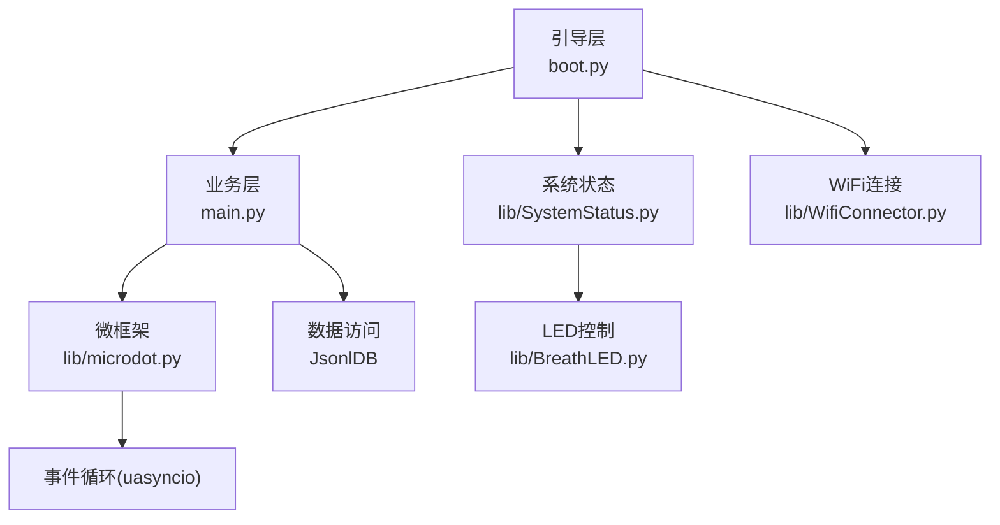
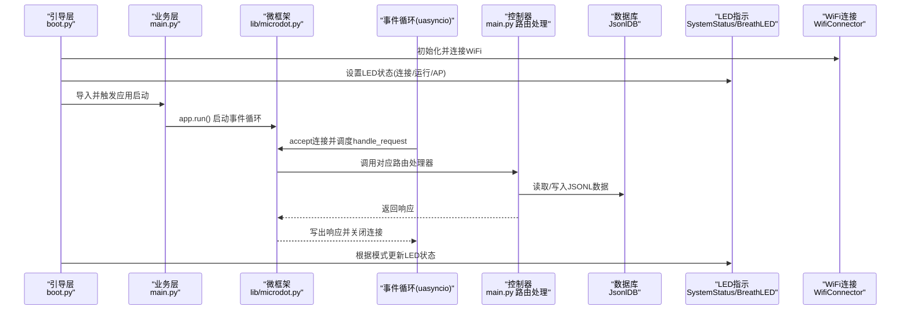
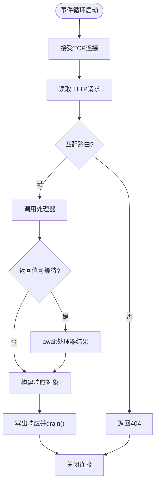
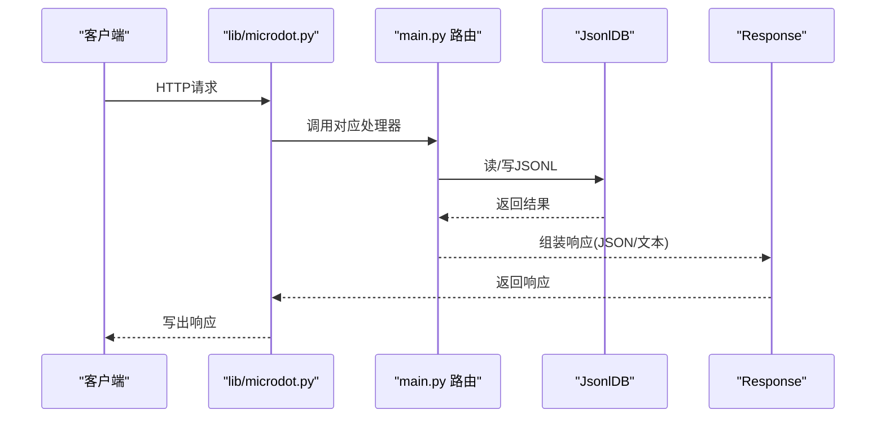
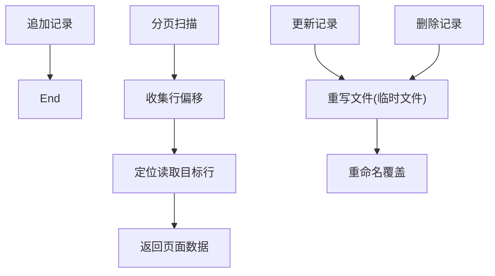
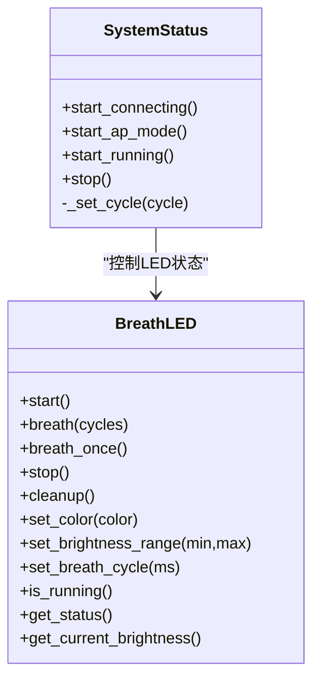
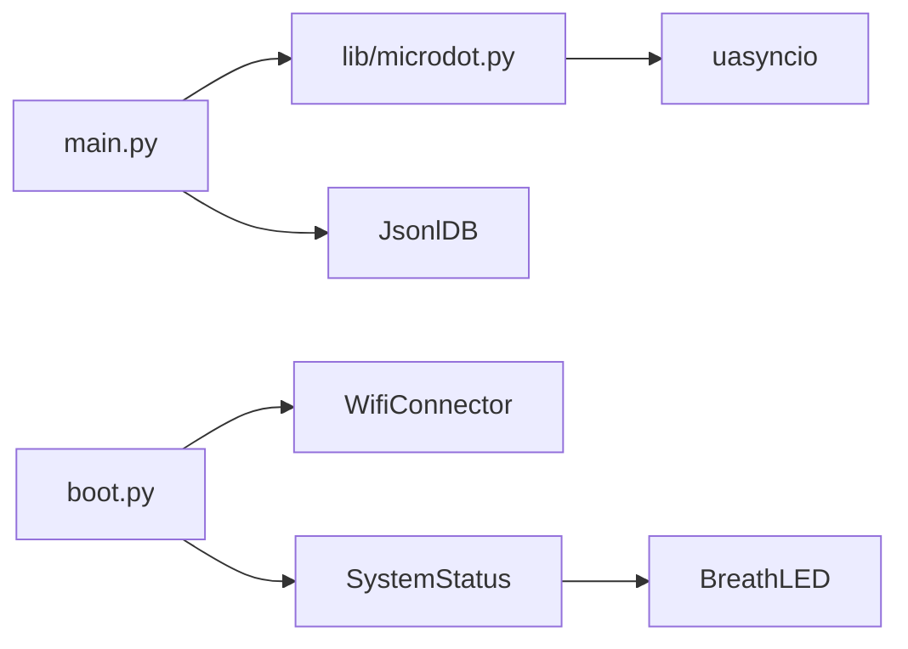

# 异步处理问题

<cite>
**本文引用的文件**
- [main.py](file://main.py)
- [boot.py](file://boot.py)
- [lib/microdot.py](file://lib/microdot.py)
- [lib/SystemStatus.py](file://lib/SystemStatus.py)
- [lib/BreathLED.py](file://lib/BreathLED.py)
- [lib/WifiConnector.py](file://lib/WifiConnector.py)
- [lib/wifi_connector_example.py](file://lib/wifi_connector_example.py)
</cite>

## 目录
1. [简介](#简介)
2. [项目结构](#项目结构)
3. [核心组件](#核心组件)
4. [架构总览](#架构总览)
5. [详细组件分析](#详细组件分析)
6. [依赖分析](#依赖分析)
7. [性能考虑](#性能考虑)
8. [故障排查指南](#故障排查指南)
9. [结论](#结论)
10. [附录](#附录)

## 简介
本指南面向“围炉诗社·理事台”项目，聚焦于异步处理问题的诊断与解决，涵盖协程执行异常、事件循环阻塞、异步任务超时、并发访问冲突等常见问题。文档结合项目中使用的自研微服务框架 microdot（基于 MicroPython 的 uasyncio）与系统状态指示组件，提供调试技巧、协程状态检查、事件循环监控与死锁检测方法，并给出最佳实践、性能优化建议与内存泄漏防护措施，以及预防性检查清单，帮助开发者在资源受限的嵌入式平台上稳定运行异步服务。

## 项目结构
项目采用“引导层 + 业务层 + 自研微框架”的组织方式：
- 引导层：boot.py 负责 WiFi 初始化与系统 LED 状态指示，随后启动主应用。
- 业务层：main.py 提供 Web API 与数据库读写逻辑，路由注册与控制器实现。
- 自研微框架：lib/microdot.py 提供轻量 HTTP 服务器与请求/响应处理，基于 uasyncio 的事件循环。
- 系统状态：lib/SystemStatus.py 与 lib/BreathLED.py 提供 LED 呼吸指示，便于运行状态可视化。
- 网络连接：lib/WifiConnector.py 提供 WiFi 连接、热点、配置持久化与诊断能力。

图表来源
- [boot.py](file://boot.py#L1-L122)
- [main.py](file://main.py#L1-L548)
- [lib/microdot.py](file://lib/microdot.py#L1-L183)
- [lib/SystemStatus.py](file://lib/SystemStatus.py#L1-L61)
- [lib/BreathLED.py](file://lib/BreathLED.py#L1-L633)
- [lib/WifiConnector.py](file://lib/WifiConnector.py#L1-L800)

章节来源
- [boot.py](file://boot.py#L1-L122)
- [main.py](file://main.py#L1-L548)
- [lib/microdot.py](file://lib/microdot.py#L1-L183)
- [lib/SystemStatus.py](file://lib/SystemStatus.py#L1-L61)
- [lib/BreathLED.py](file://lib/BreathLED.py#L1-L633)
- [lib/WifiConnector.py](file://lib/WifiConnector.py#L1-L800)

## 核心组件
- 事件循环与 HTTP 服务器：lib/microdot.py 基于 uasyncio 的 start_server 与 run，维持长驻事件循环，逐请求处理。
- 请求/响应模型：Request/Response 封装解析与写出，支持 JSON 与静态文件返回。
- 路由注册与控制器：main.py 通过 app.route 注册路由，控制器内调用 JsonlDB 读写与系统状态查询。
- 数据库抽象：JsonlDB 提供 append/fetch_page/update/delete/get_all 等方法，兼顾内存与 IO 性能。
- 系统状态指示：SystemStatus + BreathLED 提供 LED 呼吸状态，便于观察系统运行状态。
- WiFi 管理：WifiConnector 提供连接、重连、热点、配置持久化与诊断能力。

章节来源
- [lib/microdot.py](file://lib/microdot.py#L94-L183)
- [main.py](file://main.py#L53-L278)
- [lib/SystemStatus.py](file://lib/SystemStatus.py#L19-L61)
- [lib/BreathLED.py](file://lib/BreathLED.py#L11-L633)
- [lib/WifiConnector.py](file://lib/WifiConnector.py#L11-L800)

## 架构总览
下图展示了从引导层到业务层、再到事件循环与控制器的调用链路，以及 LED 与 WiFi 组件如何参与系统状态反馈。

图表来源
- [boot.py](file://boot.py#L1-L122)
- [main.py](file://main.py#L1-L548)
- [lib/microdot.py](file://lib/microdot.py#L154-L165)

## 详细组件分析

### 组件一：事件循环与 HTTP 服务器（microdot）
- 事件循环：run() 内部通过 asyncio.start_server 启动 TCP 服务器，随后进入 while True 的睡眠循环，维持事件循环活跃。
- 请求处理：handle_request() 读取请求、匹配路由、调用处理器；若处理器返回协程/可等待对象则 await；异常时返回 500。
- 响应写出：Response.write() 支持字符串、JSON 与文件流式写出，自动 drain()。

图表来源
- [lib/microdot.py](file://lib/microdot.py#L104-L152)

章节来源
- [lib/microdot.py](file://lib/microdot.py#L94-L183)

### 组件二：路由与控制器（main.py）
- 路由注册：app.route(...) 将 URL 与方法映射到处理器函数。
- 控制器职责：解析查询参数、调用 JsonlDB、返回 JSON 或文本响应；部分控制器包含跨表更新（如任务完成时更新成员积分）。
- 异常处理：控制器内 try/except 捕获异常并返回空数组或错误响应，避免传播到事件循环。

图表来源
- [main.py](file://main.py#L309-L450)
- [lib/microdot.py](file://lib/microdot.py#L120-L145)

章节来源
- [main.py](file://main.py#L299-L540)

### 组件三：数据库抽象（JsonlDB）
- 设计要点：基于 JSONL 文件的顺序存储，支持追加、按页扫描、全文检索、原地更新（重写文件）、删除（重写文件）。
- 性能策略：分页扫描先收集偏移再定位读取，避免全文件扫描；更新/删除采用临时文件重命名，保证原子性。
- 并发与一致性：无锁设计，更新/删除为重写流程，适合嵌入式小规模数据。

图表来源
- [main.py](file://main.py#L86-L247)

章节来源
- [main.py](file://main.py#L53-L278)

### 组件四：系统状态指示（SystemStatus + BreathLED）
- SystemStatus：封装单 LED 的呼吸周期设置，提供连接、AP、运行三种模式。
- BreathLED：基于 Timer/PWM 的呼吸控制，支持 WS2812 与普通 LED，具备参数校验、资源管理与调试输出。

图表来源
- [lib/SystemStatus.py](file://lib/SystemStatus.py#L19-L61)
- [lib/BreathLED.py](file://lib/BreathLED.py#L11-L633)

章节来源
- [lib/SystemStatus.py](file://lib/SystemStatus.py#L1-L61)
- [lib/BreathLED.py](file://lib/BreathLED.py#L1-L633)

### 组件五：WiFi 管理（WifiConnector）
- 连接流程：扫描、连接、状态轮询、超时与错误处理、自动重连。
- 静态 IP：v1.3.0 增强，支持独立配置、动态切换、便捷访问器与 IP 校验。
- 诊断与持久化：连接状态、网络信息、诊断报告、配置保存/加载。

章节来源
- [lib/WifiConnector.py](file://lib/WifiConnector.py#L11-L800)
- [lib/wifi_connector_example.py](file://lib/wifi_connector_example.py#L1-L787)

## 依赖分析
- microdot 依赖 uasyncio，负责事件循环与协程调度。
- main.py 依赖 microdot 的 Request/Response/Microdot，以及 JsonlDB 抽象。
- boot.py 依赖 WifiConnector 与 SystemStatus/BreathLED，负责启动阶段的网络与状态指示。
- SystemStatus 依赖 BreathLED，提供 LED 呼吸周期配置。
- WifiConnector 为独立模块，可被 boot.py 与示例程序复用。

图表来源
- [lib/microdot.py](file://lib/microdot.py#L1-L3)
- [main.py](file://main.py#L10-L11)
- [boot.py](file://boot.py#L5-L6)
- [lib/SystemStatus.py](file://lib/SystemStatus.py#L10-L11)
- [lib/BreathLED.py](file://lib/BreathLED.py#L6-L9)

章节来源
- [lib/microdot.py](file://lib/microdot.py#L1-L183)
- [main.py](file://main.py#L1-L548)
- [boot.py](file://boot.py#L1-L122)
- [lib/SystemStatus.py](file://lib/SystemStatus.py#L1-L61)
- [lib/BreathLED.py](file://lib/BreathLED.py#L1-L633)
- [lib/WifiConnector.py](file://lib/WifiConnector.py#L1-L800)

## 性能考虑
- 事件循环长驻：run() 中的 while True sleep 保证事件循环不退出，避免频繁重启带来的上下文切换成本。
- I/O 与 CPU 分离：控制器内的文件读写为阻塞式，但通过事件循环逐请求串行处理，避免并发竞争；若需提升吞吐，可考虑将耗时操作放入后台任务或外部队列。
- JSONL 读写：分页扫描与偏移收集减少随机访问；更新/删除采用重写文件，避免碎片化，适合小规模数据。
- LED 呼吸：基于定时器的硬件驱动，CPU 占用低，适合长期运行。
- WiFi：连接状态轮询与错误处理在事件循环之外，避免阻塞 HTTP 服务。

章节来源
- [lib/microdot.py](file://lib/microdot.py#L154-L165)
- [main.py](file://main.py#L113-L186)
- [lib/BreathLED.py](file://lib/BreathLED.py#L304-L339)

## 故障排查指南

### 一、协程执行异常
- 现象：请求处理抛出异常导致 500，或控制器返回空数组/空列表。
- 排查步骤：
  - 检查控制器内 try/except 是否捕获异常并返回错误响应。
  - 在 microdot.handle_request 中捕获异常并打印堆栈，定位具体处理器。
  - 对于 JSON 解析失败，检查 Content-Type 与请求体长度。
- 修复建议：
  - 在处理器中补充边界检查与类型转换，避免异常传播至事件循环。
  - 对外暴露的 API 返回结构化错误，便于前端处理。

章节来源
- [lib/microdot.py](file://lib/microdot.py#L133-L136)
- [main.py](file://main.py#L330-L332)

### 二、事件循环阻塞
- 现象：请求堆积、响应延迟增大、LED 呼吸卡顿。
- 排查步骤：
  - 确认控制器内无长时间阻塞操作（如大文件读写、复杂计算）。
  - 检查是否存在未 await 的协程或生成器。
  - 观察 LED 呼吸是否停止，判断是否因 CPU 被占用。
- 修复建议：
  - 将耗时操作拆分为异步任务或后台队列。
  - 使用非阻塞 I/O 与分块读写，避免长时间持有文件句柄。

章节来源
- [lib/microdot.py](file://lib/microdot.py#L125-L132)
- [lib/BreathLED.py](file://lib/BreathLED.py#L304-L339)

### 三、异步任务超时
- 现象：控制器内等待外部资源超时，或事件循环长时间无响应。
- 排查步骤：
  - 检查控制器中是否有未设置超时的网络/文件操作。
  - 在 boot.py 中观察 WiFi 连接超时与重试策略。
- 修复建议：
  - 为网络请求与文件操作设置合理超时。
  - 使用连接池与重试策略，避免单点失败拖垮整体。

章节来源
- [boot.py](file://boot.py#L41-L63)
- [lib/WifiConnector.py](file://lib/WifiConnector.py#L595-L696)

### 四、并发访问冲突
- 现象：多请求同时更新同一记录导致数据不一致。
- 排查步骤：
  - 检查控制器是否对同一资源进行并发写入。
  - 确认 JsonlDB 的更新/删除是否通过临时文件重命名实现原子性。
- 修复建议：
  - 对关键资源使用互斥锁或序列化写入。
  - 将并发写入合并为批处理，降低冲突概率。

章节来源
- [main.py](file://main.py#L187-L247)

### 五、协程状态检查与调试
- 使用 SystemStatus/BreathLED 的状态查询方法，判断 LED 是否仍在运行。
- 在控制器中加入轻量日志，记录关键路径耗时与异常。
- 在 microdot 中打印请求路径与异常堆栈，辅助定位问题。

章节来源
- [lib/SystemStatus.py](file://lib/SystemStatus.py#L59-L61)
- [lib/BreathLED.py](file://lib/BreathLED.py#L595-L625)
- [lib/microdot.py](file://lib/microdot.py#L133-L136)

### 六、事件循环监控与死锁检测
- 监控：通过 LED 呼吸周期与 boot.py 的状态切换，判断事件循环是否正常运行。
- 死锁检测：若响应长时间无返回，检查控制器是否 await 了不可等待对象；检查是否有未关闭的文件句柄或未释放的定时器。

章节来源
- [boot.py](file://boot.py#L110-L120)
- [lib/microdot.py](file://lib/microdot.py#L104-L152)
- [lib/BreathLED.py](file://lib/BreathLED.py#L460-L481)

### 七、内存泄漏防护
- 资源释放：确保控制器中打开的文件在异常分支也能关闭；LED cleanup() 释放 PWM/Timer。
- 垃圾回收：在关键路径调用 gc.collect()，避免内存碎片累积。
- 避免全局大对象：尽量局部化数据结构，及时释放不再使用的对象。

章节来源
- [lib/BreathLED.py](file://lib/BreathLED.py#L482-L502)
- [main.py](file://main.py#L290-L293)

### 八、最佳实践与预防性检查清单
- 事件循环
  - 保持事件循环长驻，避免频繁重启。
  - 控制器内避免阻塞操作，必要时拆分为异步任务。
- 路由与控制器
  - 为每个路由添加异常捕获与结构化错误返回。
  - 对输入参数进行类型与范围校验。
- 数据访问
  - 使用 JsonlDB 的分页与偏移收集，避免全文件扫描。
  - 更新/删除采用临时文件重命名，保证原子性。
- 系统状态
  - 使用 SystemStatus/BreathLED 反馈运行状态，便于远程诊断。
- 网络
  - 合理设置 WiFi 超时与重试，启用连接监控与诊断。
- 调试与监控
  - 在关键路径加入轻量日志，避免生产环境过度输出。
  - 定期检查内存与存储使用情况。

## 结论
本项目通过自研 microdot 微框架与系统状态指示组件，在资源受限的嵌入式平台上实现了稳定的异步 HTTP 服务。针对协程异常、事件循环阻塞、任务超时与并发冲突等常见问题，建议从“事件循环长驻、控制器无阻塞、资源及时释放、状态可视化反馈”四个方面入手，配合结构化的异常处理与日志输出，形成完善的故障排查与预防体系。

## 附录
- 相关文件路径与关键行号
  - [事件循环启动](file://lib/microdot.py#L154-L165)
  - [请求处理与异常捕获](file://lib/microdot.py#L104-L152)
  - [路由注册与控制器](file://main.py#L299-L540)
  - [JSONL 数据访问](file://main.py#L86-L247)
  - [系统状态指示](file://lib/SystemStatus.py#L19-L61)
  - [LED 呼吸控制](file://lib/BreathLED.py#L304-L339)
  - [WiFi 连接与诊断](file://lib/WifiConnector.py#L595-L800)