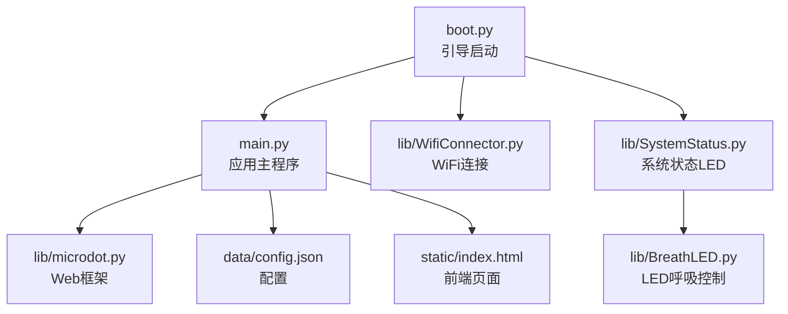
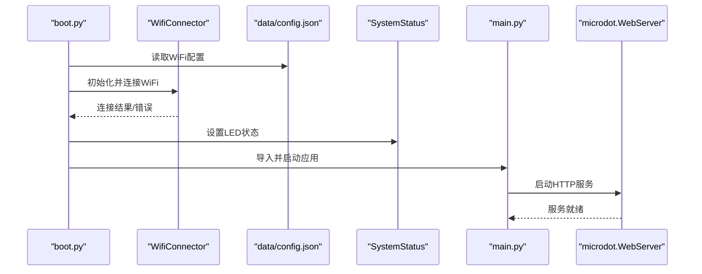
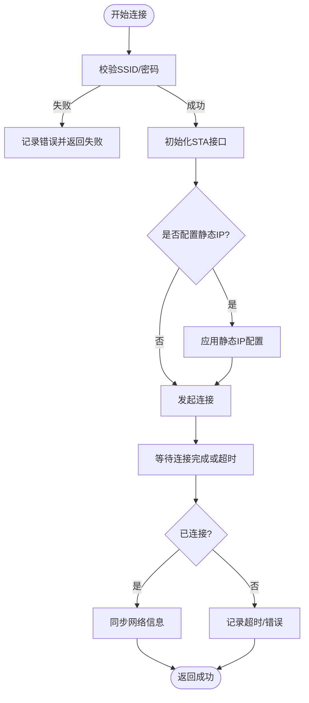
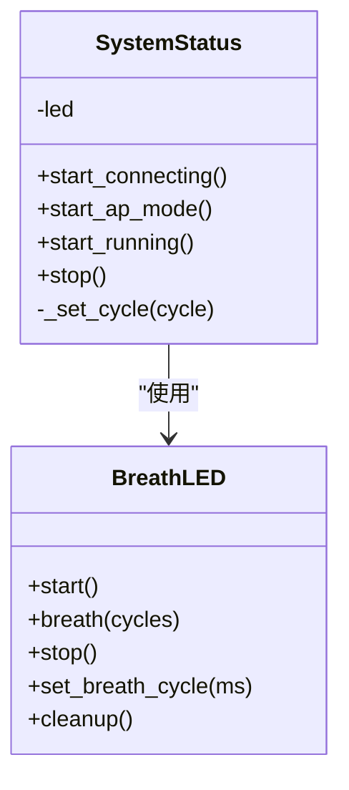
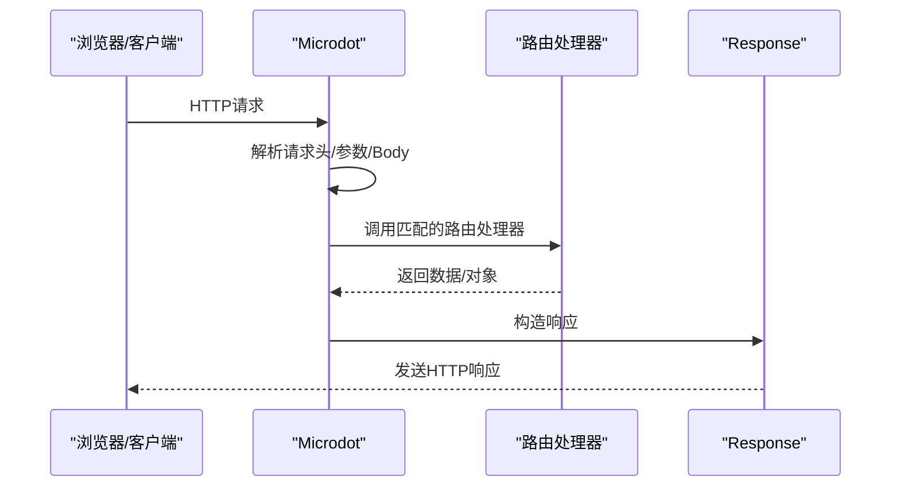
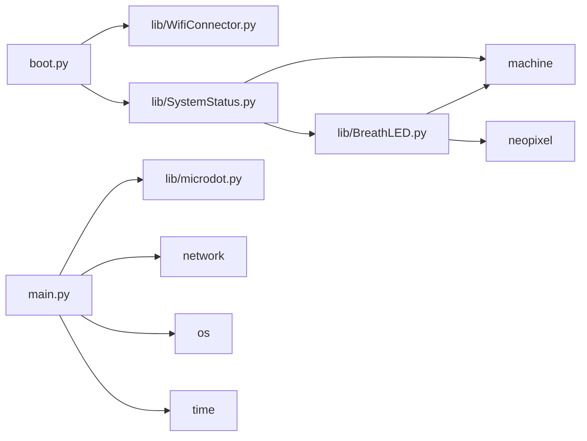

# 模块导入错误

<cite>
**本文引用的文件**
- [main.py](file://main.py)
- [boot.py](file://boot.py)
- [lib/WifiConnector.py](file://lib/WifiConnector.py)
- [lib/SystemStatus.py](file://lib/SystemStatus.py)
- [lib/microdot.py](file://lib/microdot.py)
- [lib/BreathLED.py](file://lib/BreathLED.py)
- [data/config.json](file://data/config.json)
- [static/index.html](file://static/index.html)
</cite>

## 目录
1. [简介](#简介)
2. [项目结构](#项目结构)
3. [核心组件](#核心组件)
4. [架构总览](#架构总览)
5. [详细组件分析](#详细组件分析)
6. [依赖关系分析](#依赖关系分析)
7. [性能考量](#性能考量)
8. [故障排查指南](#故障排查指南)
9. [结论](#结论)

## 简介
本指南聚焦“围炉诗社·理事台”项目在模块导入阶段可能遇到的问题，围绕以下三类模块展开：
- WiFi连接模块：负责STA/AP模式切换、连接与断线、热点创建与管理
- 系统状态模块：通过LED指示系统运行状态（连接中、AP模式、运行中）
- Web框架模块：基于轻量异步HTTP框架提供REST API与静态资源服务

文档将给出模块路径检查、依赖库验证、版本兼容性处理、调试方法、虚拟环境与第三方库安装指导，并建立可复用的检查清单与修复流程。

## 项目结构
项目采用“主程序 + 库模块 + 数据与静态资源”的组织方式：
- 主入口：boot.py（引导启动）、main.py（应用主程序）
- 库模块：lib/ 下的 WiFi、系统状态、微Web框架、LED呼吸控制等
- 数据与静态资源：data/（配置与数据）、static/（前端页面与资源）

图表来源
- [boot.py](file://boot.py#L1-L122)
- [main.py](file://main.py#L1-L548)
- [lib/WifiConnector.py](file://lib/WifiConnector.py#L1-L1930)
- [lib/SystemStatus.py](file://lib/SystemStatus.py#L1-L61)
- [lib/microdot.py](file://lib/microdot.py#L1-L183)
- [lib/BreathLED.py](file://lib/BreathLED.py#L1-L633)
- [data/config.json](file://data/config.json#L1-L6)
- [static/index.html](file://static/index.html#L1-L269)

章节来源
- [boot.py](file://boot.py#L1-L122)
- [main.py](file://main.py#L1-L548)

## 核心组件
- WiFi连接模块（lib/WifiConnector.py）
  - 功能：扫描网络、连接STA、断开、重连、创建AP、静态IP配置、状态诊断
  - 关键接口：connect、disconnect、reconnect、scan_networks、create_hotspot、get_ip_address
- 系统状态模块（lib/SystemStatus.py）
  - 功能：通过单LED指示连接中、AP模式、运行中三种状态
  - 关键接口：start_connecting、start_ap_mode、start_running、stop
- Web框架模块（lib/microdot.py）
  - 功能：请求解析、路由注册、响应生成、静态文件发送、异步服务器
  - 关键接口：Microdot.route、Microdot.run、send_file、Request/Response

章节来源
- [lib/WifiConnector.py](file://lib/WifiConnector.py#L1-L1930)
- [lib/SystemStatus.py](file://lib/SystemStatus.py#L1-L61)
- [lib/microdot.py](file://lib/microdot.py#L1-L183)

## 架构总览
系统启动流程概览如下：

图表来源
- [boot.py](file://boot.py#L1-L122)
- [lib/WifiConnector.py](file://lib/WifiConnector.py#L1-L1930)
- [lib/SystemStatus.py](file://lib/SystemStatus.py#L1-L61)
- [main.py](file://main.py#L1-L548)
- [lib/microdot.py](file://lib/microdot.py#L1-L183)
- [data/config.json](file://data/config.json#L1-L6)

## 详细组件分析

### WiFi连接模块（lib/WifiConnector.py）
- 设计要点
  - 面向ESP32的STA/AP双模管理，支持扫描、连接、断开、重连、热点创建、静态IP配置
  - 提供连接状态描述、错误码映射、日志输出与诊断
- 关键流程（连接）
  - 参数校验 → 断开旧连接（可选）→ 初始化STA → 可选静态IP配置 → 连接尝试 → 状态轮询 → 成功/失败处理
- 错误处理
  - 状态码映射：密码错误、未找到AP、连接失败、超时等
  - 内部错误提示与重置WiFi模块策略

图表来源
- [lib/WifiConnector.py](file://lib/WifiConnector.py#L595-L696)

章节来源
- [lib/WifiConnector.py](file://lib/WifiConnector.py#L1-L1930)

### 系统状态模块（lib/SystemStatus.py）
- 设计要点
  - 单LED指示：快速呼吸（连接中）、中速呼吸（AP模式）、慢速呼吸（运行中）
  - 通过BreathLED实现呼吸效果，支持WS2812与普通LED
- 关键流程
  - 初始化LED → 根据状态设置呼吸周期 → 启动/停止

图表来源
- [lib/SystemStatus.py](file://lib/SystemStatus.py#L1-L61)
- [lib/BreathLED.py](file://lib/BreathLED.py#L1-L633)

章节来源
- [lib/SystemStatus.py](file://lib/SystemStatus.py#L1-L61)
- [lib/BreathLED.py](file://lib/BreathLED.py#L1-L633)

### Web框架模块（lib/microdot.py）
- 设计要点
  - 轻量异步HTTP框架：Request/Response封装、路由装饰器、静态文件发送
  - 与uasyncio协作，提供异步服务器启动
- 关键流程（请求处理）
  - 解析请求 → 查找路由 → 执行处理器 → 序列化响应 → 写回客户端

图表来源
- [lib/microdot.py](file://lib/microdot.py#L104-L152)

章节来源
- [lib/microdot.py](file://lib/microdot.py#L1-L183)

## 依赖关系分析
- 模块导入链
  - boot.py → lib/WifiConnector.py、lib/SystemStatus.py
  - main.py → lib/microdot.py、内置network/os/time等
  - lib/SystemStatus.py → lib/BreathLED.py
- 外部依赖
  - MicroPython标准库：network、os、time、machine、uasyncio、ubinascii、ujson等
  - 第三方库：neopixel（WS2812驱动）

图表来源
- [boot.py](file://boot.py#L1-L122)
- [main.py](file://main.py#L1-L548)
- [lib/WifiConnector.py](file://lib/WifiConnector.py#L1-L1930)
- [lib/SystemStatus.py](file://lib/SystemStatus.py#L1-L61)
- [lib/microdot.py](file://lib/microdot.py#L1-L183)
- [lib/BreathLED.py](file://lib/BreathLED.py#L1-L633)

章节来源
- [boot.py](file://boot.py#L1-L122)
- [main.py](file://main.py#L1-L548)

## 性能考量
- 网络连接
  - 连接超时与重试次数可调，避免长时间阻塞
  - 静态IP配置减少DHCP协商开销
- LED呼吸
  - 通过查找表与定时器周期更新，降低CPU占用
  - 可调整更新间隔与呼吸周期以平衡效果与性能
- Web服务
  - 异步处理提升并发能力；静态文件直读减少中间层开销

[本节为通用性能讨论，不直接分析具体文件]

## 故障排查指南

### 一、模块路径检查
- 常见问题
  - 导入路径错误：相对/绝对路径不一致导致找不到模块
  - 文件缺失：lib/下缺少WifiConnector.py、SystemStatus.py、microdot.py、BreathLED.py
  - 目录结构不规范：模块未放置于lib/或data/目录内
- 检查清单
  - 确认lib/存在且包含以下文件：WifiConnector.py、SystemStatus.py、microdot.py、BreathLED.py
  - 确认data/存在且包含config.json
  - 确认static/存在且包含index.html及样式/脚本
  - 确认boot.py与main.py位于项目根目录
- 修复步骤
  - 将缺失文件补齐至对应目录
  - 统一使用相对导入（如 from lib.xxx import Yyy）
  - 在运行前确认工作目录为项目根目录

章节来源
- [boot.py](file://boot.py#L1-L122)
- [main.py](file://main.py#L1-L548)
- [lib/WifiConnector.py](file://lib/WifiConnector.py#L1-L1930)
- [lib/SystemStatus.py](file://lib/SystemStatus.py#L1-L61)
- [lib/microdot.py](file://lib/microdot.py#L1-L183)
- [lib/BreathLED.py](file://lib/BreathLED.py#L1-L633)
- [data/config.json](file://data/config.json#L1-L6)
- [static/index.html](file://static/index.html#L1-L269)

### 二、依赖库验证
- MicroPython标准库
  - network：WiFi接口（STA/AP）
  - os：文件系统操作
  - time：延时与时间戳
  - machine：Pin、Timer、PWM（LED控制）
  - uasyncio：异步事件循环
  - ubinascii、ujson：二进制与JSON处理
- 第三方库
  - neopixel：WS2812驱动
- 验证方法
  - 在交互环境下尝试导入：import network、import os、import machine、import uasyncio、import neopixel
  - 若报错，确认固件版本与库支持情况
- 版本兼容性
  - 不同MicroPython版本对uasyncio、network、neopixel支持程度不同
  - 若出现“模块不存在”或“方法未实现”，需降级固件或更换库版本

章节来源
- [lib/WifiConnector.py](file://lib/WifiConnector.py#L1-L1930)
- [lib/SystemStatus.py](file://lib/SystemStatus.py#L1-L61)
- [lib/microdot.py](file://lib/microdot.py#L1-L183)
- [lib/BreathLED.py](file://lib/BreathLED.py#L1-L633)

### 三、版本兼容性问题处理
- 现象
  - ImportError：模块名或路径不匹配
  - AttributeError：某方法不存在（如uasyncio.start_server）
  - RuntimeError：硬件初始化失败（Timer/PWM）
- 处理建议
  - 固件版本：确保使用官方推荐的MicroPython固件版本
  - 库版本：neopixel与machine.Timer/PWM在不同固件差异较大，必要时替换为兼容版本
  - 代码适配：针对不同固件分支做条件导入或降级处理

章节来源
- [lib/BreathLED.py](file://lib/BreathLED.py#L1-L633)
- [lib/microdot.py](file://lib/microdot.py#L1-L183)

### 四、模块加载失败的调试方法
- 启动阶段
  - boot.py：检查WiFi配置读取与连接流程
  - main.py：检查导入顺序与异常捕获
- 常用调试手段
  - 在关键位置打印调试信息（如连接状态、错误码）
  - 使用最小可复现脚本逐步排除问题模块
  - 分模块测试：单独导入lib/WifiConnector.py、lib/SystemStatus.py、lib/microdot.py
- 日志定位
  - WiFi模块：查看连接状态描述与错误码映射
  - LED模块：确认GPIO引脚与硬件初始化是否成功
  - Web模块：确认端口占用与路由注册

章节来源
- [boot.py](file://boot.py#L1-L122)
- [main.py](file://main.py#L1-L548)
- [lib/WifiConnector.py](file://lib/WifiConnector.py#L1-L1930)
- [lib/SystemStatus.py](file://lib/SystemStatus.py#L1-L61)
- [lib/microdot.py](file://lib/microdot.py#L1-L183)

### 五、虚拟环境配置与第三方库安装
- 说明
  - ESP32/MicroPython无传统虚拟环境，需在固件层面管理库
- 安装建议
  - 使用官方固件包，确保包含所需标准库
  - 对于WS2812：确认neopixel库可用；若不可用，考虑使用board或替代方案
  - 通过mpremote/frozen modules等方式将lib/模块固化到设备
- 注意事项
  - 避免在设备上频繁写入，减少磨损
  - 大型库（如neopixel）可能占用较多RAM，注意内存限制

[本节为通用安装指导，不直接分析具体文件]

### 六、模块依赖检查清单与修复流程
- 检查清单
  - 文件完整性：lib/、data/、static/目录齐全
  - 导入路径：from lib.xxx import Yyy
  - 外部库：network、os、time、machine、uasyncio、neopixel
  - 配置文件：data/config.json存在且格式正确
- 修复流程
  1) 确认目录结构与文件存在
  2) 在交互环境中逐一导入模块，定位失败模块
  3) 根据错误类型（ImportError/AttributeError/RuntimeError）采取相应措施
  4) 针对固件/库版本差异进行适配
  5) 重新部署并验证

章节来源
- [boot.py](file://boot.py#L1-L122)
- [main.py](file://main.py#L1-L548)
- [data/config.json](file://data/config.json#L1-L6)

## 结论
- WiFi连接模块、系统状态模块、Web框架模块在本项目中职责清晰、耦合度低
- 导入失败多源于路径错误、库缺失或固件版本不兼容
- 建议以“检查清单 + 逐模块测试 + 版本适配”的方式快速定位并解决问题
- 通过合理的调试与部署策略，可显著提升模块导入与运行的稳定性