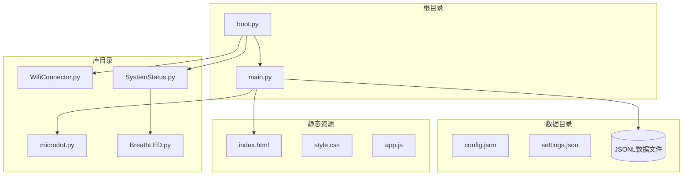
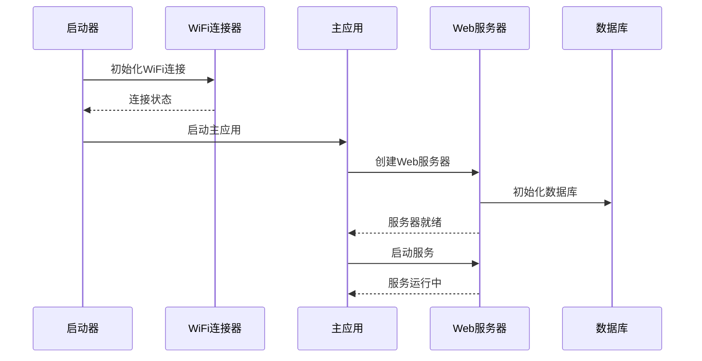
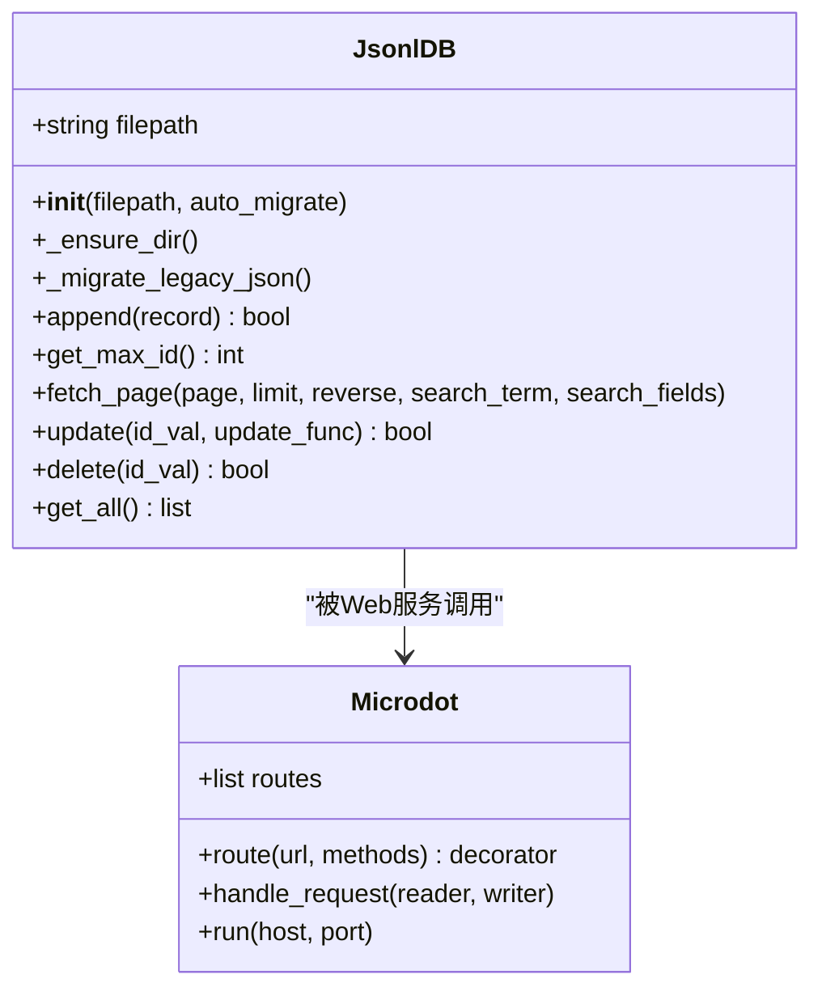
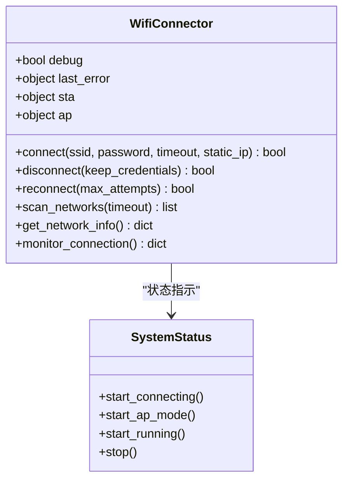
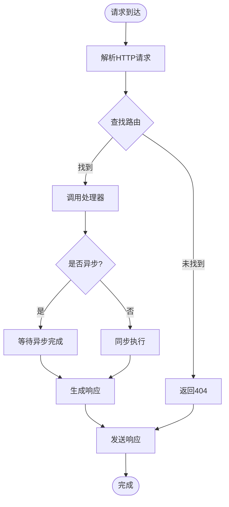
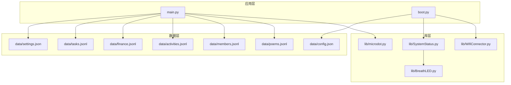

# 软件运行问题排查指南

<cite>
**本文档引用的文件**
- [main.py](file://main.py)
- [boot.py](file://boot.py)
- [microdot.py](file://lib/microdot.py)
- [WifiConnector.py](file://lib/WifiConnector.py)
- [SystemStatus.py](file://lib/SystemStatus.py)
- [BreathLED.py](file://lib/BreathLED.py)
- [WifiConnector_README.md](file://lib/WifiConnector_README.md)
- [config.json](file://data/config.json)
- [settings.json](file://data/settings.json)
- [index.html](file://static/index.html)
- [poems.jsonl](file://data/poems.jsonl)
- [members.jsonl](file://data/members.jsonl)
- [activities.jsonl](file://data/activities.jsonl)
- [finance.jsonl](file://data/finance.jsonl)
- [tasks.jsonl](file://data/tasks.jsonl)
</cite>

## 目录
1. [简介](#简介)
2. [项目结构](#项目结构)
3. [核心组件](#核心组件)
4. [架构概览](#架构概览)
5. [详细组件分析](#详细组件分析)
6. [依赖关系分析](#依赖关系分析)
7. [性能考虑](#性能考虑)
8. [故障排查指南](#故障排查指南)
9. [结论](#结论)
10. [附录](#附录)

## 简介

围炉诗社·理事台是一个基于ESP32的Web应用，提供诗歌创作、活动管理、财务管理、成员管理和任务调度等功能。本指南专注于软件运行问题的诊断和解决，涵盖主程序启动失败、模块导入错误、Web服务异常和异步处理问题的排查方法。

## 项目结构



**图表来源**
- [boot.py](file://boot.py#L1-L122)
- [main.py](file://main.py#L1-L548)
- [microdot.py](file://lib/microdot.py#L1-L183)

**章节来源**
- [boot.py](file://boot.py#L1-L122)
- [main.py](file://main.py#L1-L50)

## 核心组件

### Web应用框架
应用采用自定义的Microdot框架，这是一个轻量级的Web服务器实现，支持路由、请求处理和响应发送。

### 数据管理
使用JSONL格式存储数据，提供高效的读写操作和内存优化的数据处理能力。

### 网络连接
集成WiFi连接管理功能，支持自动重连、热点创建和网络状态监控。

### 系统状态指示
通过LED呼吸效果显示系统运行状态，提供直观的状态反馈。

**章节来源**
- [microdot.py](file://lib/microdot.py#L94-L165)
- [WifiConnector.py](file://lib/WifiConnector.py#L11-L120)
- [SystemStatus.py](file://lib/SystemStatus.py#L19-L61)

## 架构概览



**图表来源**
- [boot.py](file://boot.py#L88-L122)
- [main.py](file://main.py#L541-L548)
- [microdot.py](file://lib/microdot.py#L154-L165)

## 详细组件分析

### 主应用组件分析

#### JSONL数据库管理器
JsonlDB类提供了高效的数据存储和检索功能：



**图表来源**
- [main.py](file://main.py#L53-L260)
- [microdot.py](file://lib/microdot.py#L94-L152)

#### Web服务路由系统
应用定义了多个API端点，包括诗歌管理、活动管理、财务管理、成员管理和系统信息查询。

**章节来源**
- [main.py](file://main.py#L299-L540)

### 网络连接组件分析

#### WiFi连接管理器
WifiConnector类提供了完整的WiFi连接管理功能：



**图表来源**
- [WifiConnector.py](file://lib/WifiConnector.py#L11-L800)
- [SystemStatus.py](file://lib/SystemStatus.py#L19-L61)

**章节来源**
- [WifiConnector.py](file://lib/WifiConnector.py#L54-L120)
- [SystemStatus.py](file://lib/SystemStatus.py#L25-L58)

### 异步处理组件分析

#### MicroPython异步框架
应用使用MicroPython的uasyncio库实现异步处理：



**图表来源**
- [microdot.py](file://lib/microdot.py#L104-L152)

**章节来源**
- [microdot.py](file://lib/microdot.py#L1-L183)

## 依赖关系分析



**图表来源**
- [main.py](file://main.py#L1-L17)
- [boot.py](file://boot.py#L1-L12)

**章节来源**
- [main.py](file://main.py#L1-L17)
- [boot.py](file://boot.py#L1-L12)

## 性能考虑

### 内存管理
应用采用以下内存优化策略：
- 使用生成器和流式处理减少内存占用
- 实现垃圾回收机制
- 优化JSON解析和序列化

### 文件系统优化
- JSONL格式提供高效的随机访问
- 分页查询避免一次性加载大量数据
- 缓存常用配置信息

### 网络性能
- WiFi连接超时和重试机制
- 网络状态监控和自动恢复
- 静态IP配置支持

## 故障排查指南

### 主程序启动失败排查

#### 启动顺序检查
1. **检查boot.py执行**
   - 确认boot.py是否正常执行
   - 验证WiFi连接初始化
   - 检查LED状态指示

2. **验证main.py导入**
   ```bash
   # 检查必要的模块导入
   import json
   import os
   import gc
   import network
   from lib.microdot import Microdot
   ```

3. **内存检查**
   ```python
   import gc
   print(f"可用内存: {gc.mem_free()} 字节")
   ```

**章节来源**
- [boot.py](file://boot.py#L88-L122)
- [main.py](file://main.py#L1-L16)

#### 模块导入错误诊断

##### 常见导入问题
1. **模块路径问题**
   - 确认lib目录存在
   - 检查microdot.py文件完整性
   - 验证模块导入语法

2. **依赖缺失检查**
   ```python
   # 检查关键依赖
   try:
       import uasyncio
       import io
       import ujson
   except ImportError as e:
       print(f"缺少依赖: {e}")
   ```

3. **版本兼容性**
   - 确认MicroPython版本支持
   - 检查库文件版本兼容性

**章节来源**
- [main.py](file://main.py#L4-L15)
- [microdot.py](file://lib/microdot.py#L1-L5)

### Web服务异常排查

#### 服务器启动问题
1. **端口占用检查**
   ```bash
   # 检查80端口占用
   netstat -an | grep :80
   ```

2. **权限问题**
   - 确认有足够的权限绑定端口
   - 检查防火墙设置

3. **资源限制**
   ```python
   # 检查可用资源
   import gc
   import os
   print(f"内存: {gc.mem_free()}")
   print(f"存储: {os.statvfs('/')}")
   ```

**章节来源**
- [microdot.py](file://lib/microdot.py#L154-L165)
- [main.py](file://main.py#L541-L548)

#### 请求处理异常

##### 路由处理错误
1. **路由注册检查**
   - 验证所有路由正确注册
   - 检查HTTP方法匹配

2. **请求解析问题**
   ```python
   # 调试请求处理
   try:
       # 添加详细的错误日志
       print(f"请求方法: {request.method}")
       print(f"请求路径: {request.path}")
       print(f"请求头: {request.headers}")
   except Exception as e:
       print(f"请求处理错误: {e}")
   ```

3. **响应生成问题**
   - 检查JSON序列化
   - 验证Content-Type设置

**章节来源**
- [microdot.py](file://lib/microdot.py#L104-L152)

### 异步处理问题排查

#### 协程执行问题
1. **异步函数检查**
   ```python
   import uasyncio as asyncio
   
   # 检查协程函数
   async def test_coroutine():
       return "test"
   
   # 测试协程执行
   try:
       result = asyncio.run(test_coroutine())
       print(f"协程结果: {result}")
   except Exception as e:
       print(f"协程执行错误: {e}")
   ```

2. **事件循环问题**
   - 确认事件循环正常运行
   - 检查协程挂起状态

3. **超时处理**
   ```python
   # 设置合理的超时
   try:
       await asyncio.wait_for(async_operation(), timeout=5.0)
   except asyncio.TimeoutError:
       print("操作超时")
   ```

**章节来源**
- [microdot.py](file://lib/microdot.py#L124-L133)

### 文件系统检查

#### 数据文件完整性
1. **JSONL文件验证**
   ```python
   import json
   
   def validate_jsonl(file_path):
       try:
           with open(file_path, 'r') as f:
               for line_num, line in enumerate(f, 1):
                   if line.strip():
                       try:
                           json.loads(line)
                       except json.JSONDecodeError as e:
                           print(f"第{line_num}行错误: {e}")
                           return False
           return True
       except Exception as e:
           print(f"文件读取错误: {e}")
           return False
   ```

2. **文件权限检查**
   ```bash
   import os
   
   # 检查文件权限
   files = ['data/poems.jsonl', 'data/members.jsonl', 'data/config.json']
   for file_path in files:
       try:
           stat = os.stat(file_path)
           print(f"{file_path}: {stat}")
       except OSError:
           print(f"文件不存在: {file_path}")
   ```

3. **磁盘空间监控**
   ```python
   import os
   
   def check_disk_space():
       stat = os.statvfs('/')
       free_space = stat[0] * stat[3]
       total_space = stat[0] * stat[2]
       print(f"总空间: {total_space} 字节")
       print(f"可用空间: {free_space} 字节")
       return free_space > 1024 * 1024  # 检查是否大于1MB
   ```

**章节来源**
- [poems.jsonl](file://data/poems.jsonl#L1-L4)
- [members.jsonl](file://data/members.jsonl#L1-L4)
- [config.json](file://data/config.json#L1-L6)

### 模块依赖验证

#### 依赖完整性检查
1. **核心依赖验证**
   ```python
   # 验证所有必需模块
   required_modules = ['json', 'os', 'gc', 'network', 'uasyncio', 'io']
   
   for module in required_modules:
       try:
           exec(f"import {module}")
           print(f"✓ {module} 可用")
       except ImportError:
           print(f"✗ {module} 缺失")
   ```

2. **库文件完整性**
   ```python
   # 检查库文件是否存在
   lib_files = ['lib/microdot.py', 'lib/WifiConnector.py', 'lib/SystemStatus.py']
   
   for file_path in lib_files:
       try:
           with open(file_path, 'r') as f:
               print(f"✓ {file_path} 可读")
       except FileNotFoundError:
           print(f"✗ {file_path} 不存在")
       except PermissionError:
           print(f"✗ {file_path} 权限不足")
   ```

3. **版本兼容性检查**
   ```python
   # 检查MicroPython版本
   try:
       import sys
       print(f"MicroPython版本: {sys.version}")
       
       # 检查uasyncio支持
       import uasyncio
       print("✓ uasyncio 支持")
   except Exception as e:
       print(f"版本检查错误: {e}")
   ```

**章节来源**
- [main.py](file://main.py#L4-L11)
- [microdot.py](file://lib/microdot.py#L1-L5)

### 内存泄漏检测

#### 内存使用监控
1. **内存使用分析**
   ```python
   import gc
   
   def monitor_memory():
       # 强制垃圾回收
       gc.collect()
       
       # 获取内存统计
       mem_stats = gc.mem_free()
       print(f"可用内存: {mem_stats} 字节")
       
       # 监控内存增长
       return mem_stats
   
   # 在关键位置调用
   initial_memory = monitor_memory()
   ```

2. **对象跟踪**
   ```python
   import sys
   
   def count_objects():
       # 统计对象数量
       obj_count = len(gc.get_objects())
       print(f"对象总数: {obj_count}")
       return obj_count
   
   # 检查是否有异常的对象增长
   initial_count = count_objects()
   ```

3. **内存泄漏预防**
   ```python
   # 确保正确释放资源
   def cleanup_resources():
       try:
           # 清理网络连接
           if 'wifi' in globals():
               wifi.cleanup()
           
           # 清理LED
           if 'status_led' in globals():
               status_led.stop()
           
           # 强制垃圾回收
           gc.collect()
       except Exception as e:
           print(f"清理资源时错误: {e}")
   ```

**章节来源**
- [main.py](file://main.py#L279-L294)
- [SystemStatus.py](file://lib/SystemStatus.py#L48-L51)

### 性能瓶颈分析

#### 性能监控工具
1. **执行时间测量**
   ```python
   import time
   
   def measure_execution_time(func):
       def wrapper(*args, **kwargs):
           start_time = time.time()
           result = func(*args, **kwargs)
           end_time = time.time()
           print(f"{func.__name__} 执行时间: {end_time - start_time:.4f} 秒")
           return result
       return wrapper
   
   # 使用装饰器
   @measure_execution_time
   def slow_operation():
       # 执行可能耗时的操作
       pass
   ```

2. **数据库性能分析**
   ```python
   def analyze_db_performance():
       # 分析数据库操作性能
       import time
       
       start_time = time.time()
       # 执行数据库操作
       end_time = time.time()
       
       print(f"数据库操作耗时: {end_time - start_time:.4f} 秒")
   ```

3. **网络性能监控**
   ```python
   def monitor_network_performance():
       # 监控网络连接性能
       import time
       
       start_time = time.time()
       # 执行网络操作
       end_time = time.time()
       
       print(f"网络操作耗时: {end_time - start_time:.4f} 秒")
   ```

**章节来源**
- [main.py](file://main.py#L53-L260)
- [WifiConnector.py](file://lib/WifiConnector.py#L595-L696)

### 软件故障恢复流程

#### 系统恢复步骤
1. **基础恢复**
   ```
   1. 断电重启设备
   2. 检查boot.py是否正常执行
   3. 验证WiFi连接状态
   4. 重新启动main.py
   ```

2. **数据库恢复**
   ```python
   def recover_database():
       # 检查数据库文件完整性
       files = ['data/poems.jsonl', 'data/members.jsonl', 'data/activities.jsonl']
       
       for file_path in files:
           try:
               with open(file_path, 'r') as f:
                   # 尝试读取文件
                   f.read()
           except Exception as e:
               print(f"文件损坏: {file_path}")
               # 尝试重建文件
               create_empty_jsonl(file_path)
   ```

3. **网络恢复**
   ```python
   def recover_network():
       # 重置WiFi连接
       try:
           wifi.disconnect()
           time.sleep(1)
           wifi.reconnect()
           print("网络恢复成功")
       except Exception as e:
           print(f"网络恢复失败: {e}")
           # 切换到AP模式
           start_ap_mode()
   ```

4. **服务恢复**
   ```python
   def recover_web_service():
       # 停止当前服务
       try:
           # 停止Microdot服务器
           pass
       except:
           pass
       
       # 重新启动服务
       try:
           app.run(port=80)
           print("Web服务恢复成功")
       except Exception as e:
           print(f"Web服务恢复失败: {e}")
   ```

**章节来源**
- [boot.py](file://boot.py#L60-L87)
- [main.py](file://main.py#L541-L548)

### 代码调试技巧

#### 调试方法
1. **日志记录**
   ```python
   import sys
   
   def debug_print(message):
       # 条件调试输出
       if DEBUG_MODE:
           print(f"[DEBUG] {message}")
   
   # 在关键位置添加调试信息
   debug_print("进入函数: process_request")
   ```

2. **异常处理**
   ```python
   def safe_execute(func, *args, **kwargs):
       try:
           return func(*args, **kwargs)
       except Exception as e:
           print(f"函数执行错误 {func.__name__}: {e}")
           sys.print_exception(e)
           return None
   ```

3. **状态检查**
   ```python
   def check_system_state():
       # 检查系统关键状态
       try:
           import gc
           import network
           
           print(f"内存状态: {gc.mem_free()}")
           print(f"网络状态: {network.WLAN(network.STA_IF).isconnected()}")
       except Exception as e:
           print(f"状态检查失败: {e}")
   ```

**章节来源**
- [main.py](file://main.py#L279-L294)
- [microdot.py](file://lib/microdot.py#L133-L136)

### 运行时错误处理策略

#### 错误处理机制
1. **全局异常捕获**
   ```python
   import sys
   
   def global_exception_handler(type, value, traceback):
       print(f"全局异常: {type.__name__}: {value}")
       sys.print_exception(traceback)
       
       # 记录错误到日志
       log_error(type.__name__, str(value))
       
       # 尝试恢复
       attempt_recovery()
   
   # 设置全局异常处理器
   sys.excepthook = global_exception_handler
   ```

2. **资源清理**
   ```python
   def cleanup_on_error():
       # 清理所有资源
       resources = [wifi, status_led, app]
       
       for resource in resources:
           try:
               if hasattr(resource, 'cleanup'):
                   resource.cleanup()
               elif hasattr(resource, 'stop'):
                   resource.stop()
           except:
               pass
   ```

3. **错误恢复**
   ```python
   def recover_from_error(error_type):
       # 根据错误类型采取不同恢复策略
       if error_type == "ImportError":
           # 重新导入模块
           reload_modules()
       elif error_type == "MemoryError":
           # 清理内存
           gc.collect()
       elif error_type == "NetworkError":
           # 重置网络
           reset_network()
       elif error_type == "FileError":
           # 修复文件系统
           repair_filesystem()
   ```

**章节来源**
- [main.py](file://main.py#L13-L15)
- [microdot.py](file://lib/microdot.py#L133-L136)

### 预防性检查清单

#### 运行前检查
- [ ] 确认所有必需文件存在
- [ ] 验证模块导入成功
- [ ] 检查网络配置正确
- [ ] 确认数据库文件完整
- [ ] 验证权限设置正确

#### 运行中监控
- [ ] 监控内存使用情况
- [ ] 检查网络连接状态
- [ ] 验证服务响应时间
- [ ] 监控错误日志
- [ ] 检查磁盘空间

#### 定期维护
- [ ] 清理临时文件
- [ ] 备份重要数据
- [ ] 更新固件版本
- [ ] 检查硬件连接
- [ ] 验证配置文件

**章节来源**
- [boot.py](file://boot.py#L14-L21)
- [main.py](file://main.py#L279-L294)

## 结论

围炉诗社·理事台软件运行问题排查指南提供了全面的问题诊断和解决方案。通过理解应用架构、掌握关键组件的工作原理、实施有效的故障排查方法和建立预防性检查机制，可以显著提高系统的稳定性和可靠性。

关键要点包括：
- 系统化的启动流程检查
- 模块依赖的完整性验证
- Web服务的异步处理优化
- 文件系统的完整性监控
- 内存泄漏的有效检测
- 性能瓶颈的识别和分析
- 完善的故障恢复流程
- 实用的调试技巧和策略

建议在实际部署中建立标准化的运维流程，定期进行健康检查，并根据运行时监控数据持续优化系统性能。

## 附录

### 常用命令参考
```bash
# 检查文件完整性
md5sum data/*.jsonl

# 监控系统资源
free -h
df -h
top

# 网络诊断
ping 8.8.8.8
ifconfig
netstat -an
```

### 故障代码参考
- **ImportError**: 模块导入失败
- **MemoryError**: 内存不足
- **NetworkError**: 网络连接问题
- **FileNotFoundError**: 文件不存在
- **OSError**: 文件系统错误

### 支持信息
- **版本**: v1.0.0
- **平台**: ESP32 MicroPython
- **开发者**: 围炉诗社技术团队
- **文档**: 项目README和API文档