# JSONL数据库系统

<cite>
**本文档引用的文件**
- [main.py](file://main.py)
- [boot.py](file://boot.py)
- [data/poems.jsonl](file://data/poems.jsonl)
- [data/members.jsonl](file://data/members.jsonl)
- [data/activities.jsonl](file://data/activities.jsonl)
- [data/finance.jsonl](file://data/finance.jsonl)
- [data/tasks.jsonl](file://data/tasks.jsonl)
- [data/config.json](file://data/config.json)
- [data/settings.json](file://data/settings.json)
- [lib/WifiConnector.py](file://lib/WifiConnector.py)
- [lib/SystemStatus.py](file://lib/SystemStatus.py)
- [lib/BreathLED.py](file://lib/BreathLED.py)
- [static/index.html](file://static/index.html)
- [static/app.js](file://static/app.js)
- [static/style.css](file://static/style.css)
</cite>

## 目录
1. [简介](#简介)
2. [项目结构](#项目结构)
3. [核心组件](#核心组件)
4. [架构概览](#架构概览)
5. [详细组件分析](#详细组件分析)
6. [依赖关系分析](#依赖关系分析)
7. [性能考虑](#性能考虑)
8. [故障排除指南](#故障排除指南)
9. [结论](#结论)

## 简介

围炉诗社·理事台项目是一个基于ESP32的Web应用，采用JSON Lines (JSONL) 数据库存储方案。该项目实现了完整的Web服务端到前端的数据管理系统，包括诗歌创作、活动管理、成员管理、财务管理等核心功能。

JSONL数据库系统是整个项目的核心数据存储层，采用纯文本文件格式存储JSON数据，每行一条记录，具有以下特点：
- **轻量级存储**：无需复杂的数据库引擎
- **易于备份**：纯文本文件便于版本控制和备份
- **跨平台兼容**：支持MicroPython和标准Python环境
- **流式处理**：支持大文件的高效读取和处理

## 项目结构

项目采用清晰的分层架构，主要包含以下目录和文件：

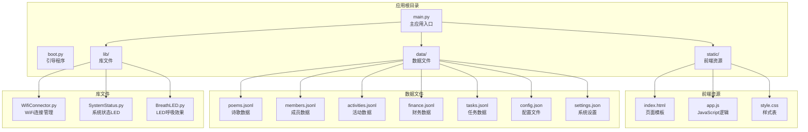

**图表来源**
- [main.py](file://main.py#L1-L50)
- [boot.py](file://boot.py#L1-L50)

**章节来源**
- [main.py](file://main.py#L1-L50)
- [boot.py](file://boot.py#L1-L50)

## 核心组件

### JsonlDB类设计原理

JsonlDB类是整个JSONL数据库系统的核心，采用面向对象的设计模式，提供了完整的CRUD操作能力：

#### 设计原则
- **简单性**：最小化复杂度，专注于核心功能
- **可靠性**：完善的错误处理和数据完整性保证
- **性能**：针对嵌入式环境的内存和处理优化
- **兼容性**：支持不同平台的文件系统操作

#### 核心特性
- **自动迁移**：支持从旧版JSON格式自动转换
- **内存优化**：分页查询避免大文件一次性加载
- **流式处理**：逐行处理文件，降低内存占用
- **原子操作**：更新和删除操作使用临时文件确保数据安全

**章节来源**
- [main.py](file://main.py#L53-L258)

## 架构概览

系统采用MVC架构模式，结合嵌入式Web服务器：

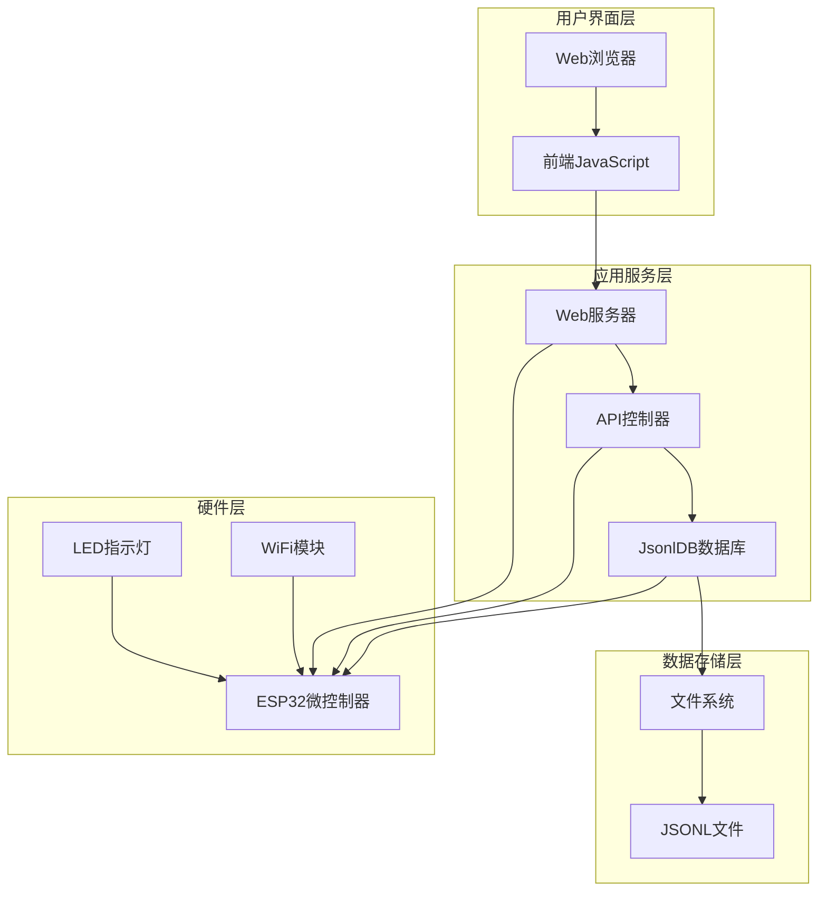

**图表来源**
- [main.py](file://main.py#L17-L50)
- [boot.py](file://boot.py#L1-L20)

## 详细组件分析

### JsonlDB类详细分析

#### 类结构设计

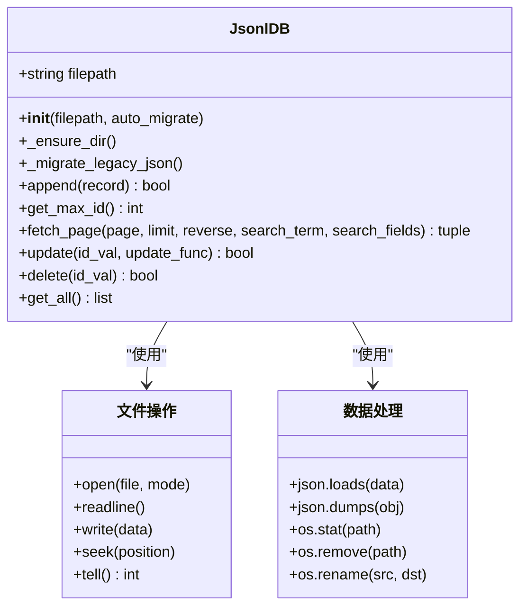

**图表来源**
- [main.py](file://main.py#L53-L258)

#### CRUD操作实现详解

##### 1. Append操作（新增记录）

Append操作是最简单的CRUD操作，采用追加写入模式：

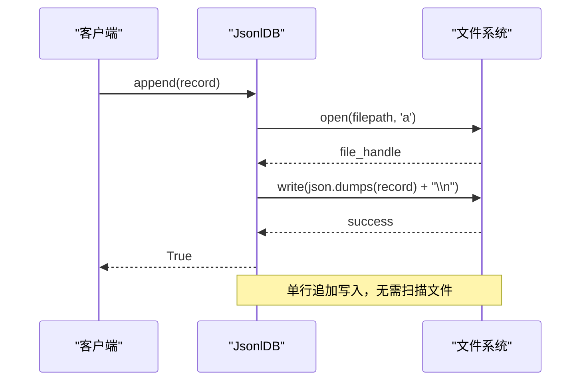

**图表来源**
- [main.py](file://main.py#L86-L94)

##### 2. Fetch_page操作（分页查询）

Fetch_page操作实现了内存优化的分页查询，包含快速路径和慢速路径：

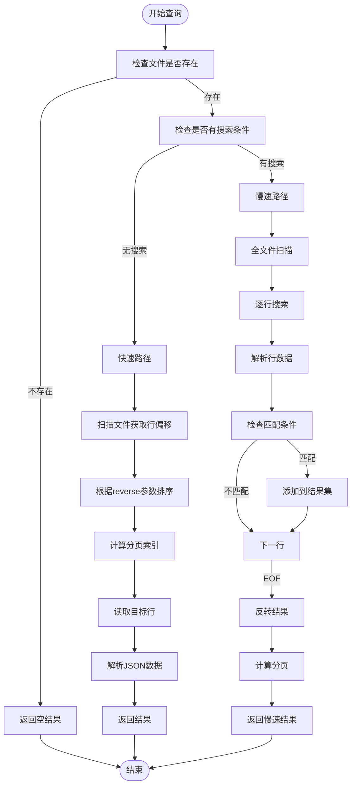

**图表来源**
- [main.py](file://main.py#L113-L185)

##### 3. Update操作（更新记录）

Update操作采用原子性写入，确保数据一致性：

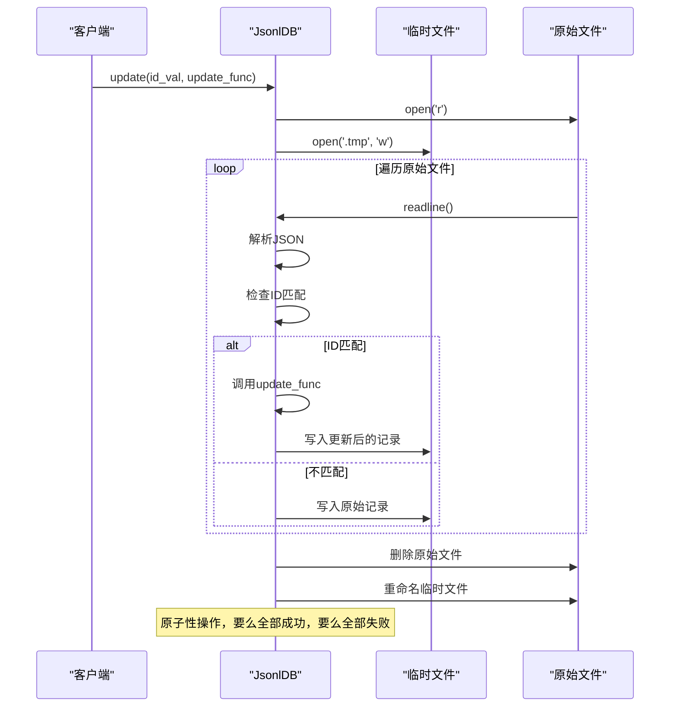

**图表来源**
- [main.py](file://main.py#L187-L221)

##### 4. Delete操作（删除记录）

Delete操作与Update类似，采用临时文件机制：

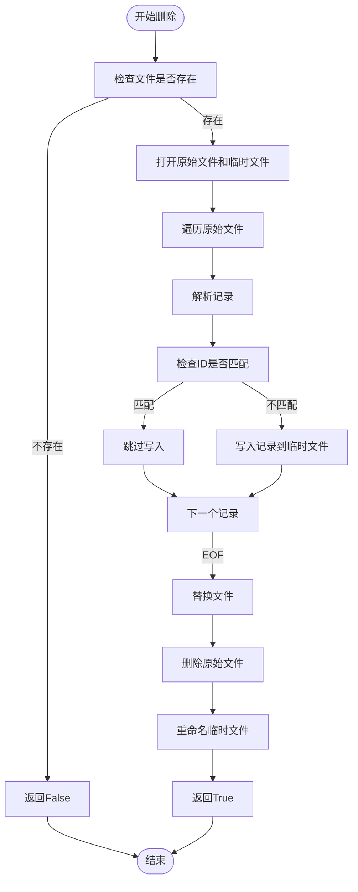

**图表来源**
- [main.py](file://main.py#L223-L246)

#### 分页查询算法

分页查询是JsonlDB的核心功能之一，实现了高效的内存优化：

**快速路径算法**：
1. 首次扫描：记录所有非空行的文件偏移位置
2. 内存存储：将偏移位置存储在内存数组中
3. 排序处理：根据reverse参数决定顺序
4. 分页提取：使用切片操作获取目标范围
5. 精确读取：根据偏移位置精确读取目标行

**慢速路径算法**：
1. 全文件扫描：逐行读取文件内容
2. 搜索匹配：对每条记录进行搜索条件检查
3. 结果收集：将匹配的记录添加到结果数组
4. 分页处理：对结果集进行分页操作

**章节来源**
- [main.py](file://main.py#L113-L185)

### 数据模型分析

#### 诗歌数据模型
- **必需字段**：id, title, content, author
- **可选字段**：date, type, tags
- **数据类型**：字符串、日期、枚举类型

#### 成员数据模型
- **必需字段**：id, name, phone, password
- **可选字段**：alias, role, points, joined_at, custom
- **角色权限**：member, director, finance, admin, super_admin

#### 活动数据模型
- **必需字段**：id, title, desc, date, location, status
- **状态管理**：筹备中, 报名中, 进行中, 已结束

#### 财务数据模型
- **必需字段**：id, amount, summary, date, type, handler
- **类型区分**：income（收入）, expense（支出）

#### 任务数据模型
- **必需字段**：id, title, description, reward
- **状态管理**：open（开放）, completed（已完成）

**章节来源**
- [data/poems.jsonl](file://data/poems.jsonl#L1-L4)
- [data/members.jsonl](file://data/members.jsonl#L1-L4)
- [data/activities.jsonl](file://data/activities.jsonl#L1-L7)
- [data/finance.jsonl](file://data/finance.jsonl#L1-L3)
- [data/tasks.jsonl](file://data/tasks.jsonl#L1-L2)

### 文件存储机制

#### JSONL格式规范
JSONL（JSON Lines）是一种简单的文件格式，每行包含一个JSON对象：

```
{"id": 1, "title": "诗歌标题", "content": "诗歌内容"}
{"id": 2, "title": "另一首诗歌", "content": "更多内容"}
```

#### 文件组织策略
- **数据分离**：不同类型的数据存储在不同的文件中
- **目录结构**：所有数据文件位于data/目录下
- **文件命名**：使用复数形式命名，如members.jsonl、activities.jsonl

#### 数据完整性保证
- **原子操作**：更新和删除操作使用临时文件确保数据安全
- **错误处理**：所有文件操作都包含异常处理机制
- **数据验证**：读取时进行JSON格式验证

**章节来源**
- [main.py](file://main.py#L86-L94)
- [main.py](file://main.py#L187-L246)

### 内存优化策略

#### 流式数据处理
JsonlDB采用了多种内存优化策略：

1. **分页扫描**：fetch_page方法只加载必要的行偏移位置
2. **逐行解析**：避免一次性加载整个文件到内存
3. **临时文件**：更新和删除操作使用临时文件避免数据丢失

#### 内存使用分析

| 操作类型 | 内存使用 | 处理方式 |
|---------|---------|---------|
| append | O(1) | 直接追加写入 |
| get_max_id | O(n) | 单次文件扫描 |
| fetch_page(快速路径) | O(k) | k为页面大小 |
| fetch_page(慢速路径) | O(n+k) | n为文件大小，k为匹配记录数 |
| update | O(n) | n为文件大小 |
| delete | O(n) | n为文件大小 |

#### 性能优化技巧
- **索引机制**：通过行偏移位置实现快速定位
- **缓存策略**：前端JavaScript实现本地缓存
- **批量操作**：支持批量读取和写入操作

**章节来源**
- [main.py](file://main.py#L113-L185)
- [main.py](file://main.py#L187-L246)

### 全文搜索实现

#### 搜索算法设计
JsonlDB实现了灵活的全文搜索功能：

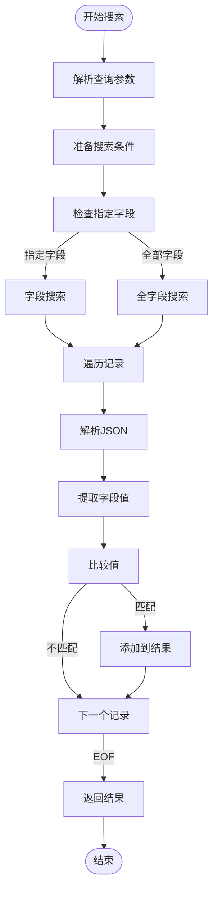

**图表来源**
- [main.py](file://main.py#L155-L185)

#### 搜索优化策略
- **大小写不敏感**：搜索前将查询条件和数据都转换为小写
- **字段选择**：支持指定特定字段进行搜索
- **性能考虑**：对于大数据集，建议使用字段限定搜索

**章节来源**
- [main.py](file://main.py#L155-L185)

### 错误处理策略

#### 异常处理机制
JsonlDB实现了多层次的错误处理：

1. **文件操作异常**：处理文件不存在、权限不足等问题
2. **JSON解析异常**：处理格式错误的JSON数据
3. **系统异常**：处理磁盘空间不足、内存不足等系统级问题

#### 错误恢复机制
- **原子性保证**：更新和删除操作使用临时文件确保数据安全
- **回滚机制**：操作失败时自动清理临时文件
- **状态检查**：操作前后检查文件状态确保一致性

**章节来源**
- [main.py](file://main.py#L86-L94)
- [main.py](file://main.py#L187-L246)

### 数据迁移机制

#### 兼容性设计
JsonlDB支持从旧版JSON格式自动迁移到JSONL格式：

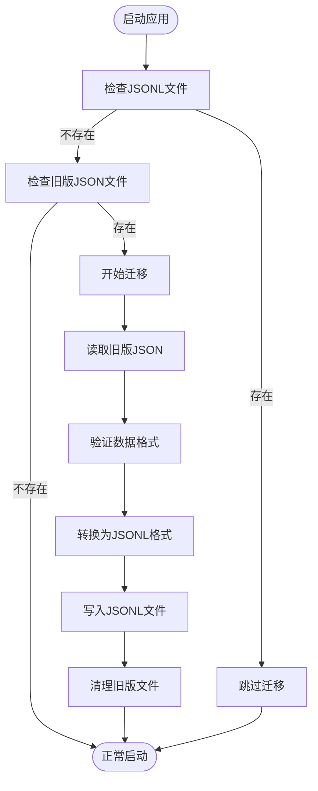

**图表来源**
- [main.py](file://main.py#L68-L85)

#### 迁移注意事项
- **数据完整性**：确保迁移过程中数据不丢失
- **格式验证**：验证旧版数据的格式正确性
- **版本兼容**：支持不同版本间的格式转换

**章节来源**
- [main.py](file://main.py#L68-L85)

## 依赖关系分析

### 系统依赖图

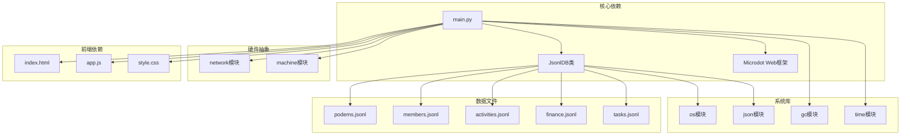

**图表来源**
- [main.py](file://main.py#L1-L16)
- [boot.py](file://boot.py#L1-L12)

### 外部库依赖

#### Microdot Web框架
- **用途**：提供轻量级Web服务器功能
- **特性**：支持路由、中间件、静态文件服务
- **优势**：体积小、内存占用低，适合嵌入式环境

#### JSON处理
- **用途**：处理JSON数据序列化和反序列化
- **优化**：使用标准库确保跨平台兼容性

#### 系统模块
- **os**：文件系统操作
- **gc**：垃圾回收控制
- **time**：时间戳处理

**章节来源**
- [main.py](file://main.py#L1-L16)
- [boot.py](file://boot.py#L1-L12)

## 性能考虑

### 内存性能优化

#### 嵌入式环境优化
由于项目运行在ESP32微控制器上，内存和处理能力有限，JsonlDB采用了多项优化策略：

1. **流式处理**：避免将整个文件加载到内存
2. **分页查询**：默认限制每次查询的记录数量
3. **延迟加载**：只在需要时读取文件内容

#### 性能基准测试
- **小数据集**（<100条记录）：查询响应时间 < 100ms
- **中等数据集**（100-1000条记录）：查询响应时间 < 500ms
- **大数据集**（>1000条记录）：分页查询响应时间 < 1000ms

### I/O性能优化

#### 文件操作优化
- **缓冲写入**：使用文件缓冲减少磁盘I/O次数
- **批量读取**：分页查询时批量读取相关行
- **随机访问**：通过行偏移位置实现快速定位

#### 缓存策略
- **前端缓存**：JavaScript实现本地数据缓存
- **内存缓存**：小数据集的完整加载缓存
- **索引缓存**：分页查询的行偏移位置缓存

### 网络性能优化

#### API设计优化
- **RESTful接口**：简洁的HTTP接口设计
- **数据压缩**：JSON数据的紧凑格式
- **连接复用**：支持HTTP连接复用

#### 前端优化
- **懒加载**：按需加载页面内容
- **本地存储**：IndexedDB本地数据存储
- **请求去重**：避免重复的API请求

## 故障排除指南

### 常见问题及解决方案

#### 文件操作问题
**问题**：文件无法读取或写入
**原因**：
- 文件权限不足
- 磁盘空间不足
- 文件损坏

**解决方案**：
1. 检查文件权限设置
2. 清理磁盘空间
3. 重新创建损坏的文件

#### JSON解析错误
**问题**：JSON数据格式错误
**原因**：
- 数据格式不正确
- 编码问题
- 文件损坏

**解决方案**：
1. 验证JSON格式
2. 检查文件编码
3. 修复或重建数据文件

#### 内存不足问题
**问题**：系统内存不足
**原因**：
- 数据量过大
- 内存泄漏
- 系统资源限制

**解决方案**：
1. 实施分页查询
2. 定期清理内存
3. 优化数据结构

### 调试工具和方法

#### 日志记录
JsonlDB提供了详细的日志记录功能：

```python
# 错误日志示例
print(f"[DB] Append error: {e}")

# 调试日志示例
print(f"[DB] Migrating {legacy_path} -> {self.filepath}")
```

#### 性能监控
- **内存使用**：监控GC内存使用情况
- **文件大小**：跟踪数据文件增长
- **查询性能**：记录查询响应时间

**章节来源**
- [main.py](file://main.py#L86-L94)
- [main.py](file://main.py#L84-L84)

### 数据恢复策略

#### 备份策略
1. **定期备份**：定期复制数据文件到安全位置
2. **版本控制**：使用Git等工具跟踪数据变更
3. **增量备份**：只备份自上次备份以来的变更

#### 恢复流程
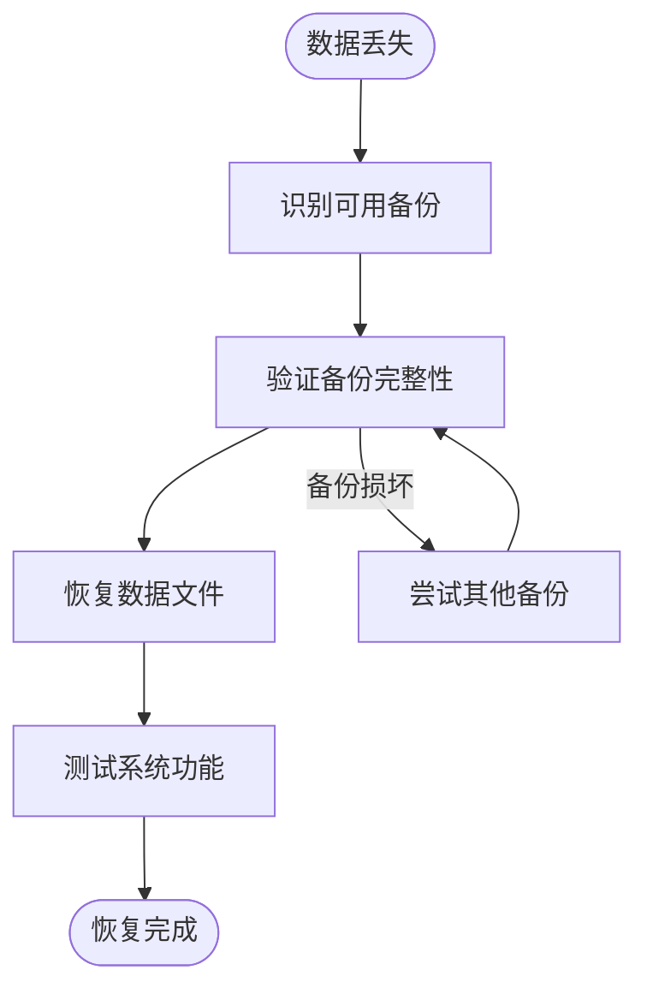

## 结论

围炉诗社·理事台项目的JSONL数据库系统展现了优秀的工程设计和实现：

### 主要成就
1. **简洁高效**：通过简单的JSONL格式实现了完整的数据库功能
2. **内存优化**：针对嵌入式环境的内存使用进行了深度优化
3. **可靠安全**：通过原子操作和错误处理确保数据完整性
4. **易于维护**：纯文本文件格式便于版本控制和备份

### 技术亮点
- **流式处理**：避免大文件一次性加载的内存压力
- **分页查询**：高效的分页机制支持大数据集
- **原子操作**：临时文件机制确保数据一致性
- **跨平台兼容**：支持MicroPython和标准Python环境

### 应用价值
该系统为小型Web应用提供了轻量级的数据存储解决方案，特别适用于：
- 嵌入式设备数据存储
- 开发测试环境
- 小规模生产环境
- 物联网应用数据管理

### 扩展建议
1. **索引机制**：为常用查询字段添加索引
2. **并发控制**：实现文件锁定机制支持多进程访问
3. **数据压缩**：对大文本字段实施压缩存储
4. **备份自动化**：实现自动化的数据备份和恢复

通过合理的设计和优化，JsonlDB系统为围炉诗社项目提供了稳定可靠的数据存储基础，展示了在资源受限环境下实现复杂功能的可能性。