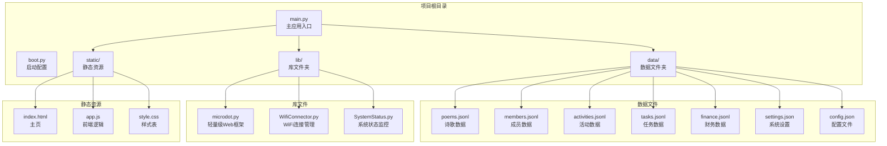
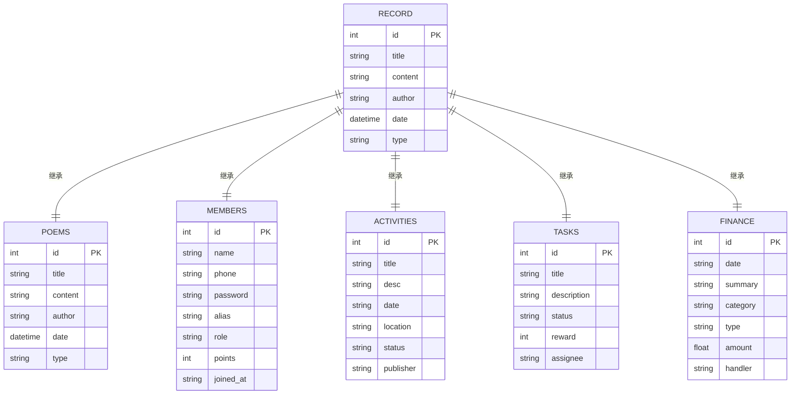
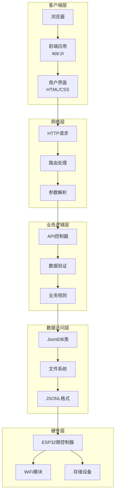
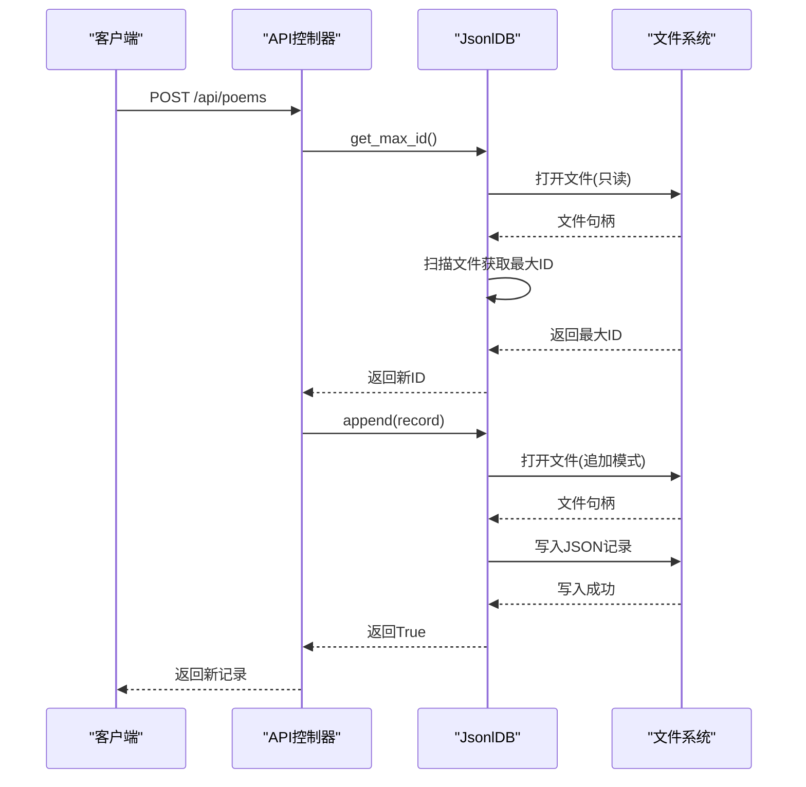
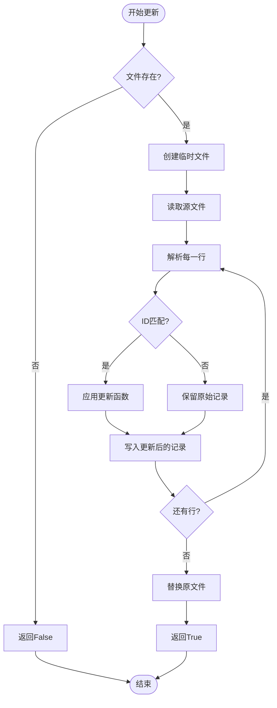
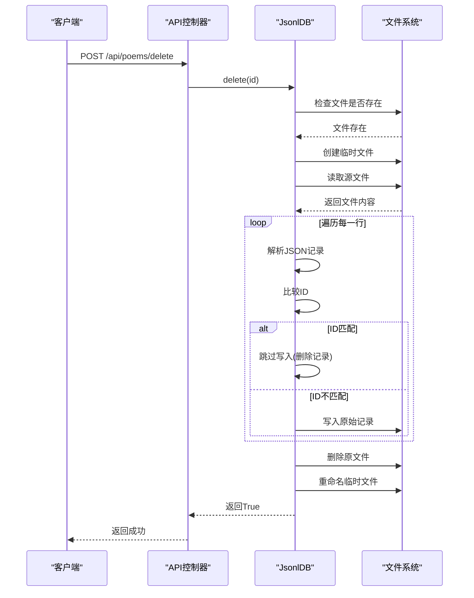
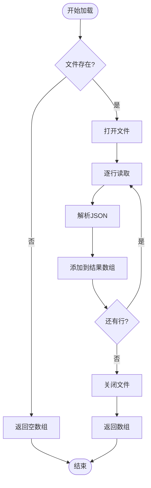
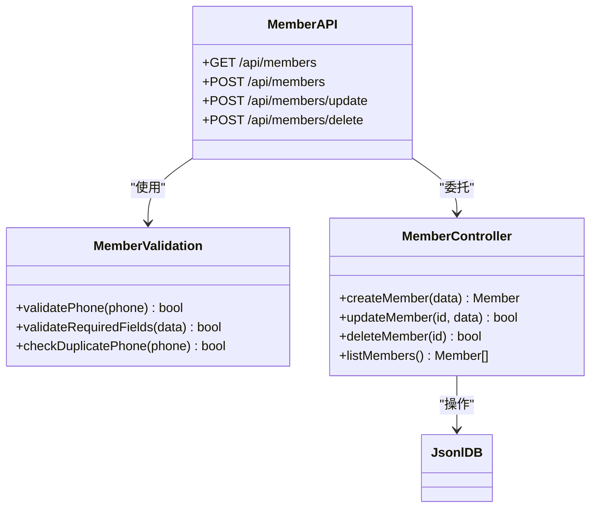
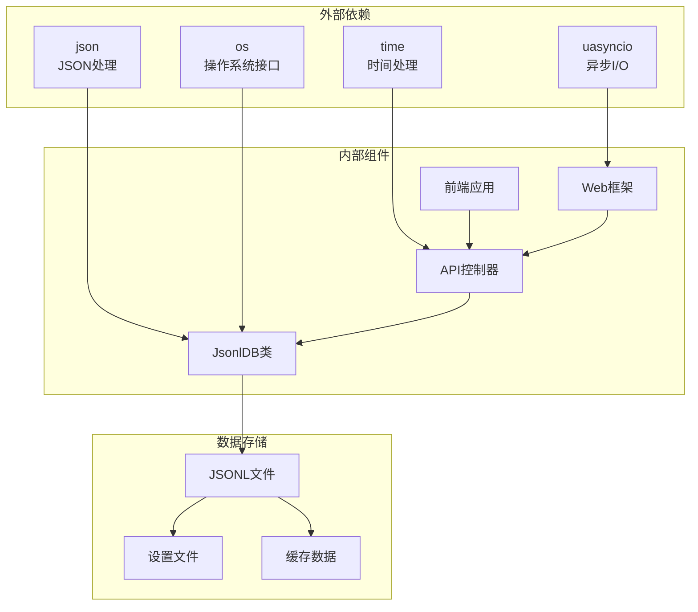
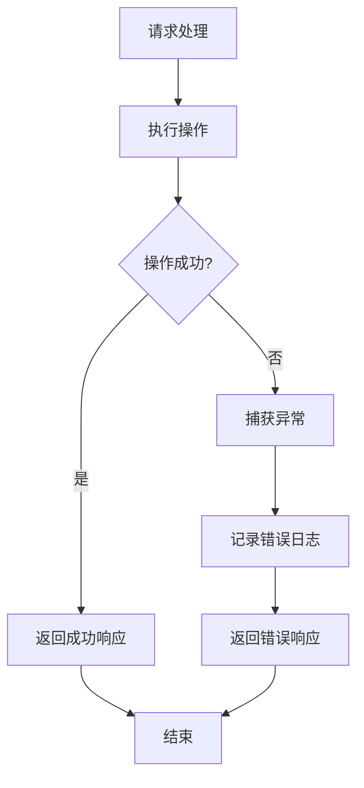

# CRUD操作

<cite>
**本文档引用的文件**
- [main.py](file://main.py)
- [app.js](file://static/app.js)
- [microdot.py](file://lib/microdot.py)
- [boot.py](file://boot.py)
- [poems.jsonl](file://data/poems.jsonl)
- [members.jsonl](file://data/members.jsonl)
- [activities.jsonl](file://data/activities.jsonl)
- [tasks.jsonl](file://data/tasks.jsonl)
</cite>

## 目录
1. [简介](#简介)
2. [项目结构](#项目结构)
3. [核心组件](#核心组件)
4. [架构概览](#架构概览)
5. [详细组件分析](#详细组件分析)
6. [依赖关系分析](#依赖关系分析)
7. [性能考虑](#性能考虑)
8. [故障排除指南](#故障排除指南)
9. [结论](#结论)

## 简介

围炉诗社·理事台是一个基于ESP32微控制器的Web应用，专门为传统文化社团管理而设计。该项目实现了完整的CRUD（创建、读取、更新、删除）操作，支持诗歌创作、成员管理、活动组织和财务管理等功能。

本项目的核心数据存储采用JSON Lines（JSONL）格式，每个记录占一行，便于高效的流式处理和内存优化。系统提供了RESTful API接口，配合前端JavaScript应用实现完整的Web管理功能。

## 项目结构

项目采用模块化的文件组织方式，主要包含以下目录和文件：

**图表来源**
- [main.py](file://main.py#L1-L50)
- [boot.py](file://boot.py#L1-L30)

**章节来源**
- [main.py](file://main.py#L1-L50)
- [boot.py](file://boot.py#L1-L30)

## 核心组件

### JsonlDB类 - JSONL数据库管理器

JsonlDB类是整个系统的核心数据访问层，提供了完整的CRUD操作能力。该类专门针对JSONL格式的数据文件进行了优化，支持高效的追加、查询、更新和删除操作。

#### 主要特性
- **流式处理**: 支持大文件的逐行处理，避免内存溢出
- **ID自动生成**: 自动检测现有最大ID并生成新ID
- **搜索功能**: 支持全文搜索和字段过滤
- **分页查询**: 内存友好的分页实现
- **事务安全**: 使用临时文件确保数据一致性

#### 数据结构设计

每个JSONL文件采用简单的行分隔格式，每行包含一个完整的JSON对象：

**图表来源**
- [poems.jsonl](file://data/poems.jsonl#L1-L4)
- [members.jsonl](file://data/members.jsonl#L1-L4)
- [activities.jsonl](file://data/activities.jsonl#L1-L7)

**章节来源**
- [main.py](file://main.py#L53-L260)

## 架构概览

系统采用客户端-服务器架构，前端使用纯JavaScript实现，后端基于轻量级Web框架。

**图表来源**
- [main.py](file://main.py#L299-L548)
- [microdot.py](file://lib/microdot.py#L94-L165)

**章节来源**
- [main.py](file://main.py#L299-L548)
- [microdot.py](file://lib/microdot.py#L94-L165)

## 详细组件分析

### JsonlDB类详细分析

#### append()方法 - 记录追加机制

append()方法实现了高效的记录追加功能，采用流式写入方式处理数据。

**图表来源**
- [main.py](file://main.py#L86-L94)
- [main.py](file://main.py#L339-L345)

**章节来源**
- [main.py](file://main.py#L86-L94)
- [main.py](file://main.py#L339-L345)

##### 实现特点
- **原子性**: 使用追加模式确保写入的原子性
- **错误处理**: 包装异常并返回布尔值
- **性能优化**: 直接文件写入，避免中间缓冲

#### update()方法 - 文件重写策略

update()方法采用"复制+重命名"的策略实现记录更新。

**图表来源**
- [main.py](file://main.py#L187-L222)

**章节来源**
- [main.py](file://main.py#L187-L222)

##### 实现策略
- **数据安全**: 使用临时文件避免部分更新
- **原子替换**: 成功后删除原文件并重命名临时文件
- **错误恢复**: 异常时清理临时文件

#### delete()方法 - 记录删除过程

delete()方法同样采用文件重写策略删除指定ID的记录。

**图表来源**
- [main.py](file://main.py#L223-L246)

**章节来源**
- [main.py](file://main.py#L223-L246)

##### 删除机制
- **选择性跳过**: 匹配ID的记录直接跳过写入
- **完整重写**: 其他记录保持不变重新写入
- **一致性保证**: 通过临时文件确保操作原子性

#### get_all()方法 - 完整数据加载

get_all()方法用于加载所有记录，适用于小型数据集。

**图表来源**
- [main.py](file://main.py#L248-L258)

**章节来源**
- [main.py](file://main.py#L248-L258)

### API控制器详细分析

#### 诗歌管理API

系统为不同实体提供了统一的RESTful API接口：

| 端点 | 方法 | 功能 | 参数 |
|------|------|------|------|
| `/api/poems` | GET | 获取诗歌列表 | page, limit, q |
| `/api/poems` | POST | 创建新诗歌 | title, content, type, date |
| `/api/poems/update` | POST | 更新诗歌 | id, title, content, type, date |
| `/api/poems/delete` | POST | 删除诗歌 | id |

#### 成员管理API

**图表来源**
- [main.py](file://main.py#L451-L483)

**章节来源**
- [main.py](file://main.py#L451-L483)

## 依赖关系分析

系统的主要依赖关系如下：

**图表来源**
- [main.py](file://main.py#L1-L16)
- [microdot.py](file://lib/microdot.py#L1-L10)

**章节来源**
- [main.py](file://main.py#L1-L16)
- [microdot.py](file://lib/microdot.py#L1-L10)

### 数据验证规则

系统实现了多层次的数据验证机制：

#### 基础验证
- **必需字段检查**: 确保关键字段存在
- **格式验证**: 验证数据类型和格式
- **范围限制**: 限制数值范围和字符串长度

#### 业务规则
- **唯一性约束**: 手机号码唯一性检查
- **角色权限**: 不同角色的操作权限控制
- **状态转换**: 任务状态的合法转换

**章节来源**
- [main.py](file://main.py#L461-L468)

## 性能考虑

### 内存优化策略

系统采用了多项内存优化技术：

1. **流式处理**: JsonlDB类使用逐行处理避免大文件加载到内存
2. **分页查询**: 默认限制每页10条记录，支持大数据集浏览
3. **延迟加载**: 仅在需要时加载完整数据集

### 文件系统优化

- **追加写入**: 新记录使用追加模式写入，避免文件重写
- **临时文件**: 更新和删除操作使用临时文件确保数据安全
- **批量操作**: 合理使用get_all()方法，避免频繁全量加载

### 并发访问控制

系统目前采用单线程异步模型，具备以下并发特性：

- **异步I/O**: 基于uasyncio实现非阻塞操作
- **请求队列**: Web服务器按顺序处理请求
- **文件锁**: Python文件操作天然提供基本的文件锁定

**章节来源**
- [microdot.py](file://lib/microdot.py#L154-L165)

## 故障排除指南

### 常见问题及解决方案

#### 文件访问错误
**症状**: API调用返回错误或数据丢失
**原因**: 文件不存在、权限不足、磁盘空间不足
**解决方案**: 
- 检查文件路径和权限
- 确认有足够的磁盘空间
- 验证文件完整性

#### 数据不一致
**症状**: 更新操作后数据状态异常
**原因**: 文件重写过程中断电或异常
**解决方案**:
- 确保操作期间电源稳定
- 检查临时文件清理情况
- 实施数据备份策略

#### 性能问题
**症状**: 大数据集查询缓慢
**原因**: 全量扫描和内存占用过高
**解决方案**:
- 使用分页查询
- 实施索引机制
- 优化搜索算法

**章节来源**
- [main.py](file://main.py#L84-L94)
- [main.py](file://main.py#L218-L221)

### 错误处理机制

系统实现了完善的错误处理机制：

**图表来源**
- [main.py](file://main.py#L88-L94)

**章节来源**
- [main.py](file://main.py#L88-L94)

## 结论

围炉诗社·理事台项目展示了如何在资源受限的嵌入式环境中实现完整的Web应用。JsonlDB类的设计体现了针对特定应用场景的优化思路，通过合理的数据结构和算法选择，在保证功能完整性的同时实现了良好的性能表现。

### 主要优势

1. **简洁高效**: 基于JSONL格式的简单设计，易于理解和维护
2. **内存友好**: 流式处理和分页查询避免了内存溢出风险
3. **数据安全**: 文件重写策略确保操作的原子性和数据一致性
4. **扩展性强**: 模块化设计便于功能扩展和维护

### 改进建议

1. **索引机制**: 为常用查询字段建立索引提高查询性能
2. **并发控制**: 实现更精细的并发访问控制机制
3. **数据备份**: 增加自动备份和恢复功能
4. **监控告警**: 添加系统状态监控和异常告警机制

这个项目为嵌入式Web应用开发提供了优秀的参考范例，特别是在资源有限的环境中实现复杂业务逻辑的实践方案。