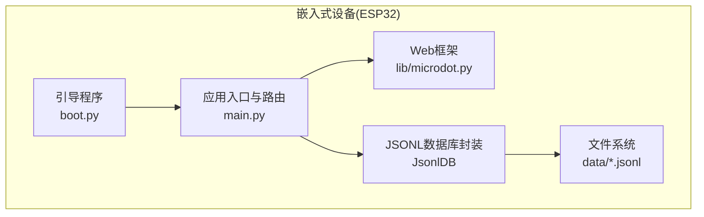
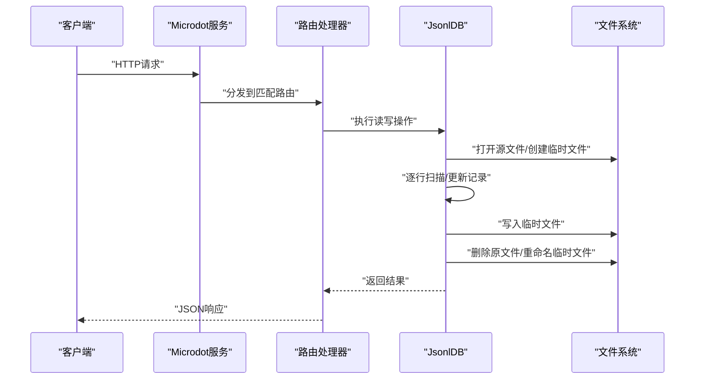
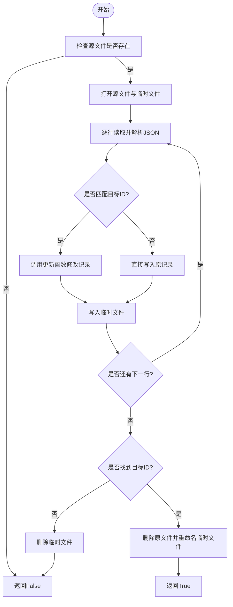
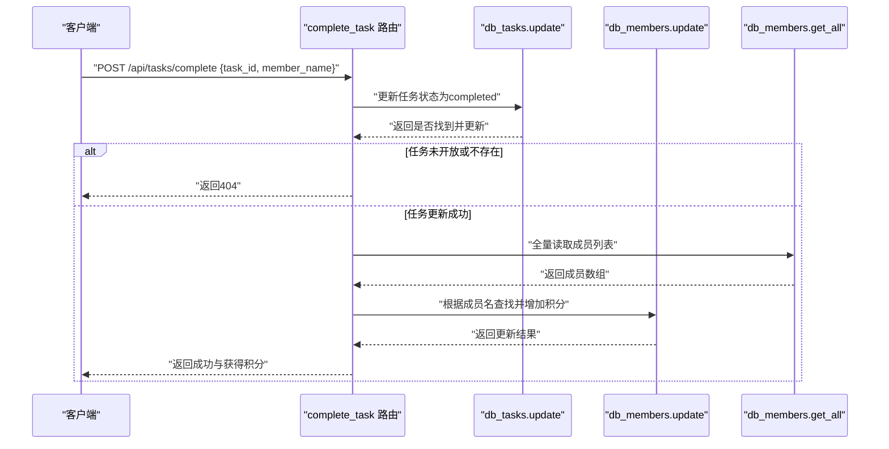
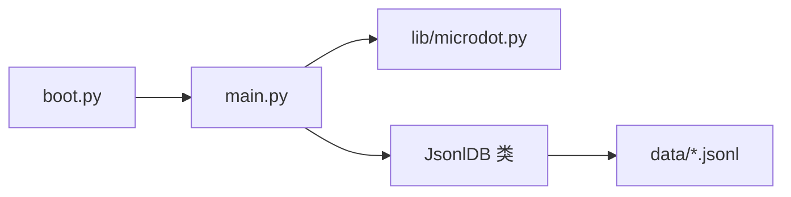

# 事务处理与批量操作

<cite>
**本文引用的文件**
- [main.py](file://main.py)
- [boot.py](file://boot.py)
- [lib/microdot.py](file://lib/microdot.py)
- [data/config.json](file://data/config.json)
- [data/settings.json](file://data/settings.json)
- [data/poems.jsonl](file://data/poems.jsonl)
- [data/members.jsonl](file://data/members.jsonl)
- [data/tasks.jsonl](file://data/tasks.jsonl)
- [data/finance.jsonl](file://data/finance.jsonl)
</cite>

## 目录
1. [简介](#简介)
2. [项目结构](#项目结构)
3. [核心组件](#核心组件)
4. [架构总览](#架构总览)
5. [详细组件分析](#详细组件分析)
6. [依赖关系分析](#依赖关系分析)
7. [性能考量](#性能考量)
8. [故障排查指南](#故障排查指南)
9. [结论](#结论)
10. [附录](#附录)

## 简介
本文件聚焦围炉诗社·理事台项目中的事务处理与批量操作能力，围绕以下目标展开：
- 深入解析 JsonlDB.update() 方法的文件重写机制与原子性保障，说明临时文件创建、数据重写与文件替换的安全流程。
- 解释批量操作的设计思路，包括事务边界控制、回滚机制与一致性保证。
- 展示 complete_task() 函数中的跨表事务处理，说明如何在多个数据表之间保持数据一致性。
- 提供事务处理的完整示例路径（不直接粘贴代码），包含错误处理、异常恢复与性能优化策略。
- 阐述在嵌入式环境（ESP32）进行事务处理的特殊考虑与最佳实践。

## 项目结构
项目采用“嵌入式 Web 应用 + 轻量级 JSONL 数据库”的架构：
- 后端：基于 Microdot 的轻量 HTTP 服务，路由集中于 main.py。
- 存储：每个业务实体对应一个 JSONL 文件，使用自定义 JsonlDB 封装读写与更新。
- 前端：静态 HTML/CSS/JS，通过 API 与后端交互。
- 引导：boot.py 负责 WiFi 初始化与应用启动。

图表来源
- [main.py](file://main.py#L1-L548)
- [boot.py](file://boot.py#L1-L122)
- [lib/microdot.py](file://lib/microdot.py#L1-L183)

章节来源
- [main.py](file://main.py#L1-L548)
- [boot.py](file://boot.py#L1-L122)

## 核心组件
- JsonlDB：提供 JSONL 文件的增删改查能力，支持分页检索、最大 ID 计算、全量加载等。
- 主应用路由：提供 Poems/Members/Activities/Finance/Tasks 等 API。
- complete_task：演示跨表事务处理的典型场景。

章节来源
- [main.py](file://main.py#L53-L266)
- [main.py](file://main.py#L415-L449)

## 架构总览
系统采用“单进程同步阻塞 + 轻量异步请求处理”的模式：
- 请求进入后，由 Microdot 解析并分发到对应路由处理器。
- 路由处理器调用 JsonlDB 执行读写操作，返回 JSON 响应。
- 在嵌入式环境下，所有写操作均以文件重写的方式实现，确保原子性。

图表来源
- [lib/microdot.py](file://lib/microdot.py#L104-L152)
- [main.py](file://main.py#L187-L246)

## 详细组件分析

### JsonlDB.update() 与文件重写机制
- 设计要点
  - 读取源文件，逐行解析 JSON。
  - 对匹配 id 的记录调用传入的更新函数进行原地修改。
  - 将每条记录序列化后写入临时文件。
  - 成功后删除原文件，将临时文件重命名为原文件，从而实现原子替换。
- 原子性保障
  - 通过“临时文件 + 原子重命名”实现，避免部分写入导致的数据损坏。
  - 若发生异常，临时文件会被清理，不会影响原文件。
- 错误处理
  - 捕获异常并清理临时文件，返回失败状态。
  - 对不存在目标 id 的情况返回 False，便于上层判断。

图表来源
- [main.py](file://main.py#L187-L221)

章节来源
- [main.py](file://main.py#L187-L221)

### delete() 与 update() 的一致性对比
- delete() 与 update() 共享相同的“临时文件 + 原子重命名”策略，确保写入过程的原子性。
- 区别在于：delete() 会跳过匹配记录，update() 会对匹配记录应用更新逻辑。

章节来源
- [main.py](file://main.py#L223-L246)

### complete_task() 跨表事务处理
- 业务目标
  - 将任务状态从“open”改为“completed”，并记录认领人。
  - 同步为成员增加相应积分。
- 处理流程
  - 使用 db_tasks.update() 更新任务记录。
  - 若任务未处于“open”状态则返回错误。
  - 通过 db_members.get_all() 查找目标成员，定位其 id。
  - 使用 db_members.update() 为其增加积分。
- 一致性问题
  - 当前实现并非严格意义上的 ACID 事务，而是“尽力而为”的顺序更新。
  - 若任务更新成功但成员更新失败，会出现数据不一致的风险。
  - 建议引入“回滚”策略或“补偿动作”。

图表来源
- [main.py](file://main.py#L415-L449)

章节来源
- [main.py](file://main.py#L415-L449)

### 批量操作设计思路与建议
- 事务边界控制
  - 将多个写操作封装在一个路由处理函数内，形成“请求级”事务边界。
  - 对每个写操作设置明确的成功/失败条件，并在失败时尽早返回。
- 回滚机制
  - 由于 JSONL 文件不具备原生回滚能力，可在失败时尝试“补偿”或“幂等”设计：
    - 为每个写操作生成“撤销动作”，在后续请求中执行。
    - 通过幂等键（如唯一请求 ID）避免重复提交造成二次积分。
- 一致性保证
  - 对于跨表更新，优先更新“强约束表”（如任务），再更新“弱约束表”（如成员）。
  - 在更新前先校验前置条件（如任务状态），减少失败概率。
- 性能优化
  - 使用 get_all() 时注意内存占用，仅在必要时全量读取。
  - 对高频查询使用分页与索引字段（当前实现为按行扫描，可通过扩展字段索引优化）。

章节来源
- [main.py](file://main.py#L415-L449)

### 示例：跨表事务处理的完整流程（路径指引）
- 任务完成接口
  - 路由定义与参数解析：[main.py](file://main.py#L415-L419)
  - 任务更新逻辑：[main.py](file://main.py#L424-L432)
  - 成员查找与积分更新：[main.py](file://main.py#L439-L447)
  - 返回结果：[main.py](file://main.py#L449)

章节来源
- [main.py](file://main.py#L415-L449)

## 依赖关系分析
- 组件耦合
  - 路由处理器直接依赖 JsonlDB 实例，耦合度适中。
  - 业务逻辑集中在路由函数内部，便于理解与维护。
- 外部依赖
  - Microdot 提供轻量 HTTP 服务与请求/响应封装。
  - ESP32 文件系统用于持久化存储 JSONL 文件。
- 可能的循环依赖
  - 当前结构无循环导入，模块职责清晰。

图表来源
- [main.py](file://main.py#L1-L548)
- [boot.py](file://boot.py#L1-L122)
- [lib/microdot.py](file://lib/microdot.py#L1-L183)

章节来源
- [main.py](file://main.py#L1-L548)
- [boot.py](file://boot.py#L1-L122)
- [lib/microdot.py](file://lib/microdot.py#L1-L183)

## 性能考量
- 写入性能
  - update()/delete() 采用“全量重写 + 临时文件 + 原子替换”，写放大明显，适合中小规模数据。
  - 对于大规模数据，建议：
    - 引入行偏移缓存或索引文件，减少全量扫描。
    - 分批写入，避免长时间阻塞。
- 读取性能
  - fetch_page() 支持分页与搜索，搜索路径会全量扫描，建议限制搜索范围或添加索引字段。
  - get_all() 仅适用于小数据集（如成员/设置），避免一次性加载大量记录。
- 内存与存储
  - ESP32 RAM 有限，应避免在路由中持有大对象。
  - 使用流式写入与及时释放资源，减少内存峰值。

章节来源
- [main.py](file://main.py#L113-L185)
- [main.py](file://main.py#L248-L258)

## 故障排查指南
- 常见问题
  - 文件不存在：检查 data 目录与 JSONL 文件是否存在。
  - 权限不足：确认文件权限与目录存在性。
  - 更新失败：查看 update()/delete() 的异常捕获与临时文件清理逻辑。
  - 跨表更新不一致：检查任务状态与成员查找逻辑，必要时引入补偿机制。
- 排查步骤
  - 启动日志：观察引导与系统状态输出。
  - API 日志：关注路由处理中的异常打印。
  - 文件状态：确认临时文件是否被清理，原文件是否被替换。
- 建议
  - 在生产环境增加更详细的日志与错误码。
  - 对关键写操作增加幂等校验与重试策略。

章节来源
- [boot.py](file://boot.py#L1-L122)
- [main.py](file://main.py#L13-L15)
- [main.py](file://main.py#L218-L221)

## 结论
- 本项目在嵌入式环境中以“文件重写 + 原子替换”的方式实现了类事务的写入语义，具备基本的原子性与容错能力。
- complete_task() 展示了跨表更新的典型流程，但当前实现缺乏严格的回滚与补偿，存在数据不一致风险。
- 建议在现有基础上引入“补偿动作”“幂等键”“索引与分页优化”等机制，进一步提升一致性与性能。

## 附录
- 数据样例
  - 诗歌数据：[data/poems.jsonl](file://data/poems.jsonl#L1-L4)
  - 成员数据：[data/members.jsonl](file://data/members.jsonl#L1-L4)
  - 任务数据：[data/tasks.jsonl](file://data/tasks.jsonl#L1-L2)
  - 财务数据：[data/finance.jsonl](file://data/finance.jsonl#L1-L3)
- 配置样例
  - WiFi 配置：[data/config.json](file://data/config.json#L1-L6)
  - 自定义字段配置：[data/settings.json](file://data/settings.json#L1-L1)