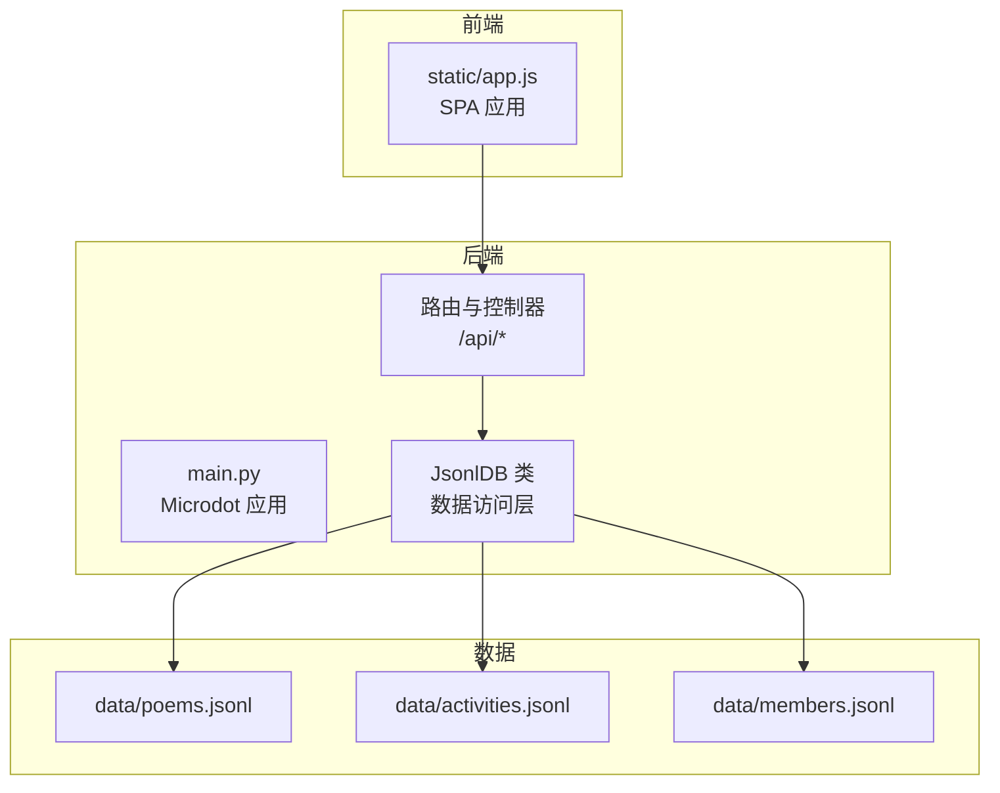
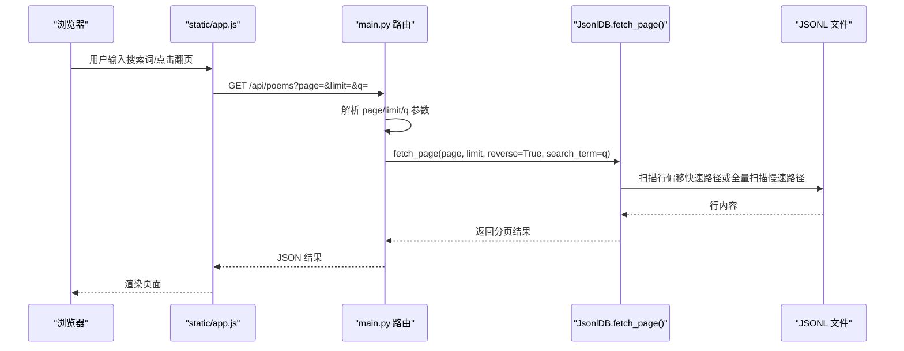
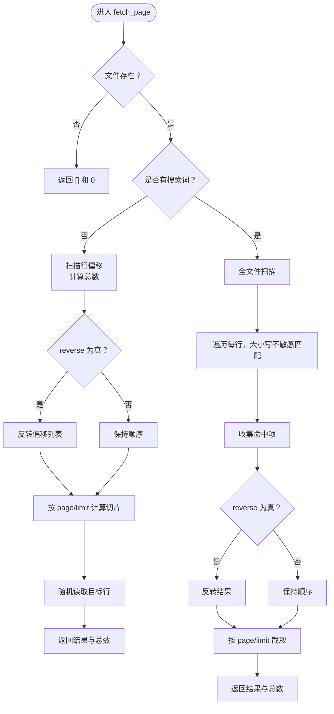
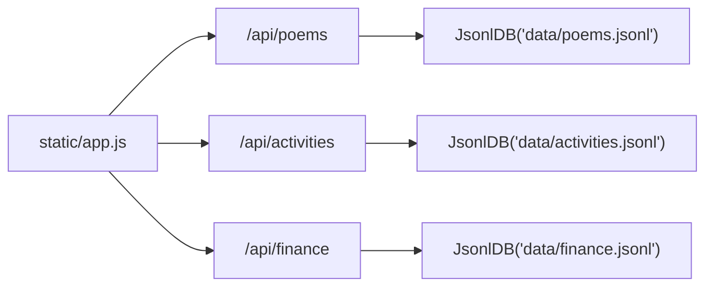

# 分页查询与搜索

<cite>
**本文引用的文件**
- [main.py](file://main.py)
- [app.js](file://static/app.js)
- [poems.jsonl](file://data/poems.jsonl)
- [activities.jsonl](file://data/activities.jsonl)
- [members.jsonl](file://data/members.jsonl)
</cite>

## 目录
1. [简介](#简介)
2. [项目结构](#项目结构)
3. [核心组件](#核心组件)
4. [架构概览](#架构概览)
5. [详细组件分析](#详细组件分析)
6. [依赖关系分析](#依赖关系分析)
7. [性能考量](#性能考量)
8. [故障排查指南](#故障排查指南)
9. [结论](#结论)
10. [附录](#附录)

## 简介
本文件围绕围炉诗社·理事台项目中的分页查询与搜索功能展开，重点解析 JsonlDB.fetch_page() 的实现机制，包括：
- 快速路径与慢速路径算法
- 内存优化策略（行偏移扫描）
- 分页参数 page、limit、reverse 的作用与使用
- 搜索功能的实现原理（大小写不敏感、字段范围限制、全文搜索优化）
- 完整 API 调用示例与最佳实践
- 错误处理与边界情况

## 项目结构
项目采用“嵌入式 Web 服务 + 前端 SPA”的架构，数据以 JSONL 文件存储，后端基于 Microdot 提供 REST API，前端通过静态资源提供交互界面。

图表来源
- [main.py](file://main.py#L1-L548)
- [app.js](file://static/app.js#L1-L200)

章节来源
- [main.py](file://main.py#L1-L548)
- [app.js](file://static/app.js#L1-L200)

## 核心组件
- JsonlDB：封装 JSONL 数据文件的增删改查与分页检索，提供 fetch_page() 实现。
- API 控制器：将前端请求参数解析为分页与搜索参数，调用 JsonlDB 并返回结果。
- 前端应用：负责构建查询 URL（含 page、limit、q），发起请求并渲染结果。

章节来源
- [main.py](file://main.py#L53-L266)
- [main.py](file://main.py#L309-L370)
- [main.py](file://main.py#L371-L410)
- [main.py](file://main.py#L505-L508)
- [app.js](file://static/app.js#L165-L200)

## 架构概览
后端通过 Microdot 暴露 REST 接口，前端通过 app.js 发起 GET 请求，后端解析参数并调用 JsonlDB.fetch_page() 获取分页数据。搜索逻辑支持大小写不敏感的全文检索，可选择限定字段范围。

图表来源
- [main.py](file://main.py#L309-L333)
- [main.py](file://main.py#L371-L381)
- [main.py](file://main.py#L505-L508)
- [main.py](file://main.py#L113-L185)
- [app.js](file://static/app.js#L165-L200)

## 详细组件分析

### JsonlDB.fetch_page() 实现机制
- 快速路径（无搜索）：先扫描文件记录行的起始偏移，计算总数，按 reverse 反转顺序，再按 page/limit 切片定位目标行偏移，最后仅随机读取所需行，避免加载整文件。
- 慢速路径（有搜索）：逐行读取并解析对象，对每个键值执行大小写不敏感的包含匹配，收集命中项，再按 reverse 反转，最后按 page/limit 截取返回。

图表来源
- [main.py](file://main.py#L113-L185)

章节来源
- [main.py](file://main.py#L113-L185)

### 分页参数详解
- page：页码，从 1 开始，默认 1。
- limit：每页条数，默认 10（poems 为 10，activities 为 50）。
- reverse：是否倒序（最新在前），默认 True。
- search_term：搜索关键词，可选。
- search_fields：当前实现未使用该参数，搜索会遍历对象的所有键值。

章节来源
- [main.py](file://main.py#L309-L333)
- [main.py](file://main.py#L371-L381)
- [main.py](file://main.py#L505-L508)
- [main.py](file://main.py#L113-L185)

### 搜索功能实现原理
- 大小写不敏感：将搜索词与字段值均转换为小写后进行包含匹配。
- 字段范围限制：当前实现未限制字段，会遍历对象所有键值进行匹配。
- 全文搜索优化：快速路径下不进行搜索，避免额外扫描；慢速路径下仅在命中时加入结果，减少中间集合大小。

章节来源
- [main.py](file://main.py#L113-L185)

### API 调用示例
以下示例展示不同场景下的调用方式，均通过 GET 请求发送参数。

- 获取诗歌列表（第一页，每页 10 条，倒序）
  - GET /api/poems?page=1&limit=10
- 搜索诗歌（关键词“围炉”，第一页，每页 10 条，倒序）
  - GET /api/poems?page=1&limit=10&q=围炉
- 获取活动列表（第一页，每页 50 条，倒序）
  - GET /api/activities?page=1&limit=50
- 获取财务记录（固定拉取最近 100 条）
  - GET /api/finance?page=1&limit=100

章节来源
- [main.py](file://main.py#L309-L333)
- [main.py](file://main.py#L371-L381)
- [main.py](file://main.py#L505-L508)
- [app.js](file://static/app.js#L165-L200)

### 前端集成要点
- 前端通过 app.js 构建查询 URL，自动拼接 page、limit、q 参数。
- 支持全局搜索：同时对 poems 与 activities 进行搜索，tasks 使用本地过滤。
- 加载更多：根据返回数组长度与 limit 判断是否还有下一页，自动递增 page。

章节来源
- [app.js](file://static/app.js#L165-L200)
- [app.js](file://static/app.js#L1146-L1220)

## 依赖关系分析
- main.py 中的路由依赖 JsonlDB 对应的数据表实例（poems、activities、finance、members、tasks）。
- 前端 app.js 依赖后端 /api/* 接口，按需发起请求并渲染结果。

图表来源
- [main.py](file://main.py#L262-L266)
- [main.py](file://main.py#L309-L333)
- [main.py](file://main.py#L371-L381)
- [main.py](file://main.py#L505-L508)
- [app.js](file://static/app.js#L165-L200)

章节来源
- [main.py](file://main.py#L262-L266)
- [main.py](file://main.py#L309-L333)
- [main.py](file://main.py#L371-L381)
- [main.py](file://main.py#L505-L508)
- [app.js](file://static/app.js#L165-L200)

## 性能考量
- 快速路径优势
  - 仅扫描一次文件获取行偏移，随后按需随机读取目标行，避免加载整文件，适合大数据集。
  - 通过切片定位目标偏移，时间复杂度近似 O(N) 扫描 + O(K) 随机读取（K 为每页记录数）。
- 慢速路径成本
  - 全文件扫描并逐行解析，时间复杂度 O(N*M)，N 为记录数，M 为平均对象键数。
  - 建议仅在必要时启用搜索，或配合较小的 limit 降低开销。
- 内存优化策略
  - 快速路径：只保存行偏移列表，不缓存完整记录。
  - 慢速路径：仅在命中时加入结果，避免构建超大中间集合。
- I/O 优化建议
  - 尽量使用较大的 limit（如 activities 默认 50）减少往返次数。
  - 在前端实现“加载更多”逻辑，避免一次性请求过多数据。
- 大数据集处理最佳实践
  - 优先使用快速路径（无搜索）进行分页浏览。
  - 若必须搜索，尽量缩短搜索词长度，缩小匹配范围。
  - 合理设置 limit，避免单次响应过大导致内存压力。

章节来源
- [main.py](file://main.py#L113-L185)
- [main.py](file://main.py#L371-L381)

## 故障排查指南
- 文件不存在
  - 当数据文件不存在时，fetch_page 返回空列表与总数 0。检查 data 目录与文件路径。
- 解析异常
  - 行解析失败或 JSON 不合法时，程序会跳过该行并继续处理，不会中断整体流程。
- 搜索无结果
  - 确认搜索词大小写不敏感，且当前实现会遍历所有键值。若无命中，检查数据中是否包含目标文本。
- 分页越界
  - page 从 1 开始计数，超出实际总数时返回空数组。可通过前端检测返回数组长度与 limit 判断是否还有下一页。
- 编码问题
  - 前端对搜索词进行 URL 解码，确保特殊字符正确传递到后端。

章节来源
- [main.py](file://main.py#L113-L185)
- [main.py](file://main.py#L309-L333)
- [main.py](file://main.py#L371-L381)
- [app.js](file://static/app.js#L165-L200)

## 结论
JsonlDB.fetch_page() 通过“快速路径 + 慢速路径”的双轨策略，在保证功能完整性的同时兼顾性能与内存占用。结合合理的分页参数与前端“加载更多”机制，可在大数据集场景下提供流畅的浏览体验。搜索功能目前支持大小写不敏感的全文匹配，未来可扩展为字段范围限制与索引优化以进一步提升性能。

## 附录

### API 定义与参数
- GET /api/poems
  - 参数：page（默认 1）、limit（默认 10）、q（可选，搜索词）
  - 返回：诗歌列表（JSON 数组）
- GET /api/activities
  - 参数：page（默认 1）、limit（默认 50）、q（可选，搜索词）
  - 返回：活动列表（JSON 数组）
- GET /api/finance
  - 参数：page（默认 1）、limit（默认 100）
  - 返回：财务记录（JSON 数组）

章节来源
- [main.py](file://main.py#L309-L333)
- [main.py](file://main.py#L371-L381)
- [main.py](file://main.py#L505-L508)

### 示例数据结构参考
- 诗歌（poems.jsonl）：包含 author、type、content、date、id、title 等字段
- 活动（activities.jsonl）：包含 location、date、status、publisher、desc、title、id 等字段
- 成员（members.jsonl）：包含 id、phone、name、password、alias、role、points、joined_at 等字段

章节来源
- [poems.jsonl](file://data/poems.jsonl#L1-L4)
- [activities.jsonl](file://data/activities.jsonl#L1-L7)
- [members.jsonl](file://data/members.jsonl#L1-L4)