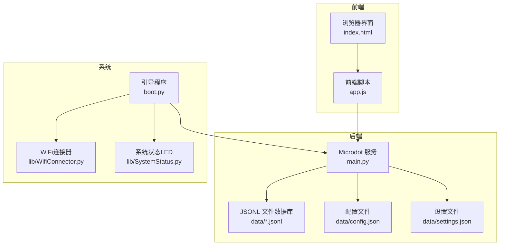
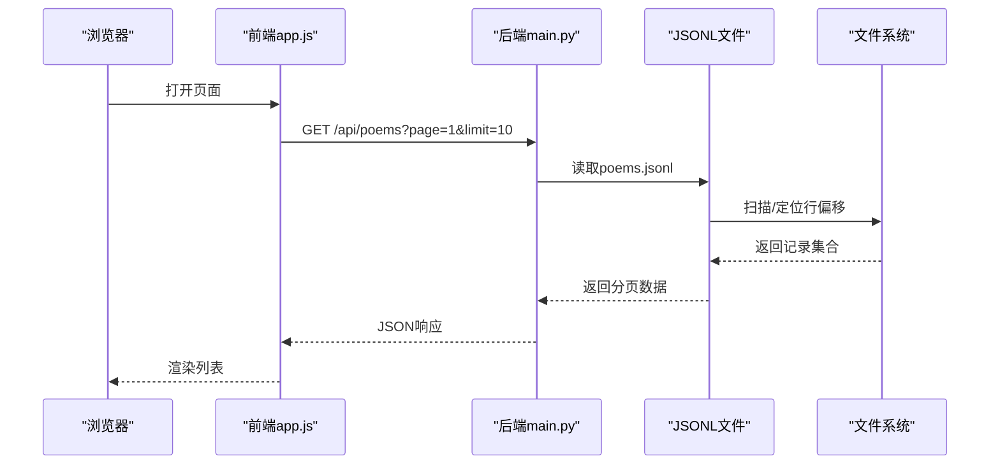
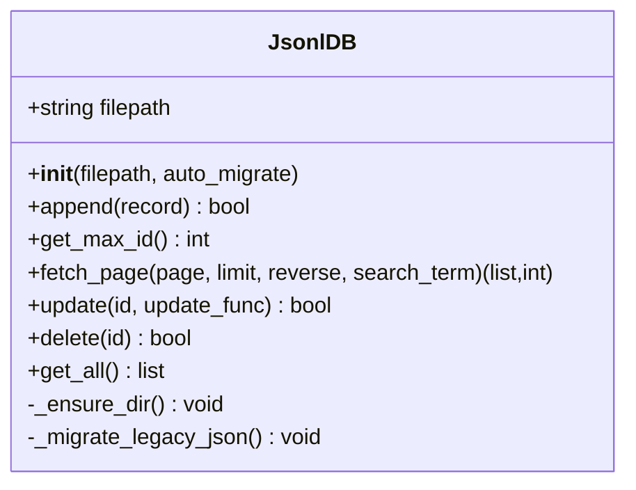
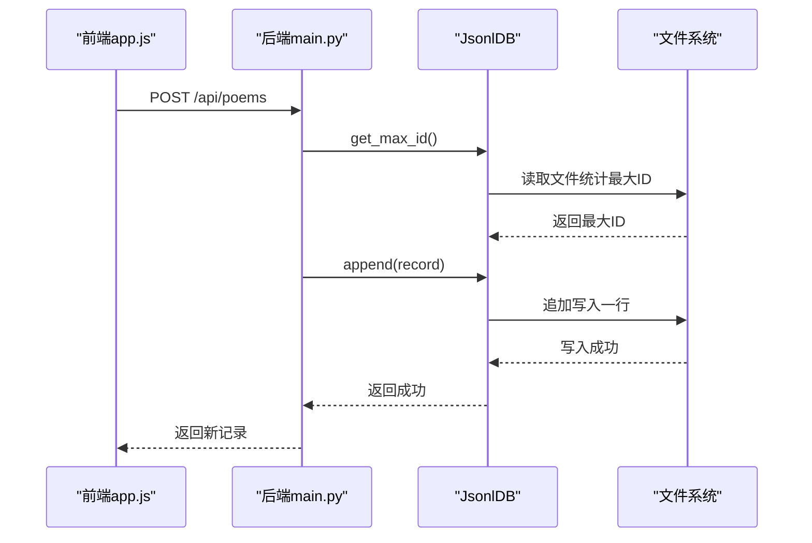
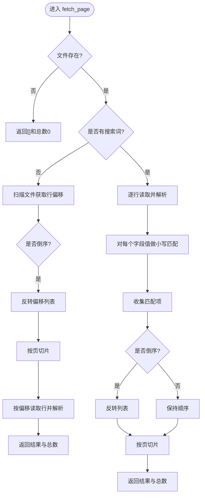
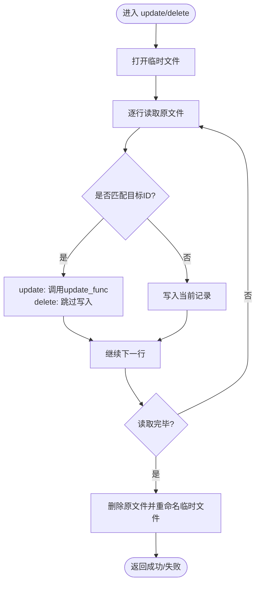
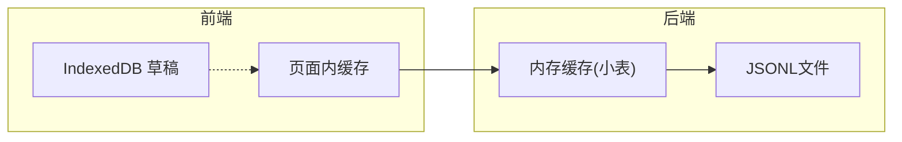
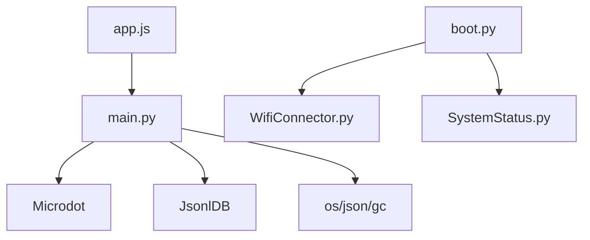

# 数据操作接口

<cite>
**本文引用的文件**
- [main.py](file://main.py)
- [boot.py](file://boot.py)
- [index.html](file://static/index.html)
- [app.js](file://static/app.js)
- [config.json](file://data/config.json)
- [settings.json](file://data/settings.json)
- [poems.jsonl](file://data/poems.jsonl)
- [members.jsonl](file://data/members.jsonl)
- [activities.jsonl](file://data/activities.jsonl)
- [finance.jsonl](file://data/finance.jsonl)
- [tasks.jsonl](file://data/tasks.jsonl)
- [WifiConnector.py](file://lib/WifiConnector.py)
- [SystemStatus.py](file://lib/SystemStatus.py)
</cite>

## 目录
1. [简介](#简介)
2. [项目结构](#项目结构)
3. [核心组件](#核心组件)
4. [架构总览](#架构总览)
5. [详细组件分析](#详细组件分析)
6. [依赖关系分析](#依赖关系分析)
7. [性能考虑](#性能考虑)
8. [故障排查指南](#故障排查指南)
9. [结论](#结论)
10. [附录](#附录)

## 简介
本文件面向围炉诗社·理事台项目的数据操作接口，系统性梳理后端数据持久化与前端交互机制，覆盖以下要点：
- 数据读取、写入、更新、删除的实现与使用方式
- 分页查询、条件筛选、排序机制
- 批量操作、事务处理与并发控制策略
- 数据缓存机制、性能优化与内存管理
- 完整API调用示例与错误处理方案

## 项目结构
项目采用“嵌入式Web服务 + 本地JSONL文件数据库”的轻量架构：
- 后端：基于Microdot框架的HTTP服务，提供REST风格API
- 数据层：以JSON Lines（每行一条记录）文件作为数据库，便于嵌入式部署与版本化
- 前端：静态HTML/CSS/JS，通过Fetch API调用后端接口
- 系统启动：boot.py负责WiFi连接与应用启动

图表来源
- [main.py](file://main.py#L1-L548)
- [boot.py](file://boot.py#L1-L122)
- [index.html](file://static/index.html#L1-L269)
- [app.js](file://static/app.js#L1-L800)
- [config.json](file://data/config.json#L1-L6)
- [settings.json](file://data/settings.json#L1-L1)

章节来源
- [main.py](file://main.py#L1-L548)
- [boot.py](file://boot.py#L1-L122)
- [index.html](file://static/index.html#L1-L269)
- [app.js](file://static/app.js#L1-L800)

## 核心组件
- JSONL数据库管理器：封装文件读写、分页、搜索、更新、删除等操作
- REST API控制器：暴露Poems/Members/Activities/Finance/Tasks等资源接口
- 前端路由与缓存：页面切换、分页加载、本地IndexedDB草稿缓存
- 系统启动与网络：引导程序负责WiFi连接与服务启动

章节来源
- [main.py](file://main.py#L53-L267)
- [app.js](file://static/app.js#L1-L800)

## 架构总览
后端服务通过Microdot提供HTTP接口，前端通过Fetch调用，数据持久化在本地JSONL文件中。系统启动时先连接WiFi，再启动HTTP服务。

图表来源
- [main.py](file://main.py#L309-L333)
- [app.js](file://static/app.js#L165-L212)

章节来源
- [main.py](file://main.py#L309-L333)
- [app.js](file://static/app.js#L165-L212)

## 详细组件分析

### JSONL数据库管理器（JsonlDB）
- 职责：封装对JSONL文件的增删改查、分页、搜索、迁移与ID生成
- 关键能力
  - 追加写入：append
  - 最大ID计算：get_max_id
  - 分页读取：fetch_page（支持倒序、搜索、分页）
  - 更新：update（逐行扫描，重写文件）
  - 删除：delete（逐行扫描，重写文件）
  - 全量读取：get_all（适用于小表，如Members/Settings）

图表来源
- [main.py](file://main.py#L53-L267)

章节来源
- [main.py](file://main.py#L53-L267)

### API控制器与数据操作
- Poems资源
  - GET /api/poems?page=&limit=&q=
  - POST /api/poems（创建）
  - POST /api/poems/update（更新）
  - POST /api/poems/delete（删除）
- Members资源
  - GET /api/members
  - POST /api/members（创建，校验手机号唯一）
  - POST /api/members/update（更新）
  - POST /api/members/delete（删除）
  - POST /api/login（登录）
- Activities资源
  - GET /api/activities?page=&limit=&q=
  - POST /api/activities（创建）
  - POST /api/activities/update（更新）
  - POST /api/activities/delete（删除）
- Finance资源
  - GET /api/finance
  - POST /api/finance（创建）
- Tasks资源
  - GET /api/tasks
  - POST /api/tasks/complete（完成任务并累计积分）
- Settings资源
  - GET/POST /api/settings/fields（自定义成员字段）
- System资源
  - GET /api/system/info（系统信息：存储、内存）

图表来源
- [main.py](file://main.py#L334-L346)
- [main.py](file://main.py#L86-L94)

章节来源
- [main.py](file://main.py#L309-L527)

### 分页查询、条件筛选与排序
- 分页：fetch_page(page, limit, reverse=True)
  - 快路径：无搜索时，先扫描文件记录行偏移，再按偏移顺序读取，避免全量加载
  - 慢路径：有搜索时，逐行解析并匹配关键词
- 条件筛选：search_term/q参数，对所有字段值做字符串匹配（大小写无关）
- 排序：reverse=True默认按最新记录在前

图表来源
- [main.py](file://main.py#L113-L186)

章节来源
- [main.py](file://main.py#L113-L186)

### 更新与删除（逐行重写）
- update：打开临时文件，逐行读取，命中id的记录调用update_func修改，最后原子替换原文件
- delete：同理，跳过匹配id的记录，其余写入临时文件，再替换原文件
- 特性：单条记录级原子性，适合小规模数据；对大文件写入成本较高

图表来源
- [main.py](file://main.py#L187-L246)

章节来源
- [main.py](file://main.py#L187-L246)

### 批量操作、事务与并发控制
- 批量写入：append逐条追加，适合批量导入场景
- 事务：无数据库事务，采用“临时文件+原子替换”保证单条更新/删除的原子性
- 并发控制：无显式锁，建议：
  - 前端串行提交（同一用户同一时刻只提交一次）
  - 后端避免同时对同一文件进行大量并发写入
  - 大数据量场景建议离线导入或分批写入

章节来源
- [main.py](file://main.py#L86-L94)
- [main.py](file://main.py#L187-L246)

### 缓存机制与性能优化
- 前端缓存
  - IndexedDB：本地草稿缓存（LocalDrafts），首页首次加载合并草稿与服务端数据
  - 页面内缓存：Poems/Activities/Members等列表缓存，分页加载
- 后端缓存
  - 小表（Members/Settings）：get_all一次性加载到内存，减少频繁IO
  - 大表（Poems/Activities/Finance/Tasks）：按需分页读取
- 性能优化
  - 分页读取：避免全量加载
  - 行偏移定位：快速路径减少随机IO
  - 字符串搜索：小写化后匹配，避免复杂正则
  - 内存：定期触发垃圾回收（系统状态接口）

图表来源
- [app.js](file://static/app.js#L6-L58)
- [app.js](file://static/app.js#L165-L212)
- [main.py](file://main.py#L248-L258)

章节来源
- [app.js](file://static/app.js#L6-L58)
- [app.js](file://static/app.js#L165-L212)
- [main.py](file://main.py#L248-L258)

### API调用示例与错误处理
- 登录
  - 方法：POST /api/login
  - 请求体：{ phone, password }
  - 成功：返回用户对象（不含密码）
  - 失败：401 无效凭证
- 发布作品
  - 方法：POST /api/poems
  - 请求体：{ title, content, type, date, author }
  - 成功：返回新记录
  - 失败：500 写入失败
- 更新作品
  - 方法：POST /api/poems/update
  - 请求体：{ id, title?, content?, type?, date? }
  - 成功：{"status":"success"}
  - 失败：404 未找到
- 删除作品
  - 方法：POST /api/poems/delete
  - 请求体：{ id }
  - 成功：{"status":"success"}
  - 失败：404 未找到
- 社员管理
  - 创建：POST /api/members（手机号唯一校验）
  - 更新：POST /api/members/update
  - 删除：POST /api/members/delete
  - 登录：POST /api/login
- 活动管理
  - 列表：GET /api/activities?page=&limit=&q=
  - 创建/更新/删除：对应POST接口
- 财务管理
  - 列表：GET /api/finance
  - 新增：POST /api/finance
- 任务管理
  - 列表：GET /api/tasks
  - 完成：POST /api/tasks/complete（累计积分）
- 系统信息
  - GET /api/system/info（平台、存储、内存）

章节来源
- [main.py](file://main.py#L309-L527)

## 依赖关系分析
- 后端依赖
  - Microdot：HTTP框架
  - OS/JSON/GC：文件系统、序列化、内存管理
- 前端依赖
  - Fetch：调用后端API
  - IndexedDB：本地草稿缓存
- 系统依赖
  - WiFi连接器：自动连接/热点模式
  - 系统状态LED：运行状态指示

图表来源
- [main.py](file://main.py#L1-L17)
- [boot.py](file://boot.py#L1-L122)
- [app.js](file://static/app.js#L1-L800)

章节来源
- [main.py](file://main.py#L1-L17)
- [boot.py](file://boot.py#L1-L122)
- [app.js](file://static/app.js#L1-L800)

## 性能考虑
- IO模型
  - JSONL逐行读写，适合嵌入式与小中型数据
  - 大文件分页读取，避免一次性加载
- 内存管理
  - 小表get_all缓存，大表按页读取
  - 定期触发垃圾回收，监控可用内存
- 网络与并发
  - WiFi连接失败自动切换热点模式
  - 建议前端串行提交，避免并发写入

章节来源
- [main.py](file://main.py#L279-L293)
- [boot.py](file://boot.py#L22-L87)

## 故障排查指南
- 常见错误
  - 400 无效JSON：请求体非JSON或缺少必要字段
  - 401 无效凭证：登录失败
  - 404 未找到：更新/删除的目标不存在
  - 500 写入失败：文件写入异常
- 日志与诊断
  - 后端打印错误信息
  - 系统信息接口返回存储与内存状态
  - WiFi连接器提供状态描述与错误码
- 建议
  - 检查数据文件是否存在与格式正确
  - 确认网络连接状态
  - 减少并发写入，必要时离线导入

章节来源
- [main.py](file://main.py#L330-L332)
- [main.py](file://main.py#L485-L502)
- [main.py](file://main.py#L528-L539)
- [WifiConnector.py](file://lib/WifiConnector.py#L233-L251)

## 结论
本项目以轻量、易部署为目标，采用JSONL文件数据库与Microdot服务，配合前端缓存与分页策略，实现了稳定的数据操作接口。对于更大规模或更高并发需求，可考虑引入更成熟的嵌入式数据库或分层缓存架构。

## 附录

### 数据模型概览
- Poems：id、title、content、type、date、author
- Members：id、name、alias、phone、role、points、password、joined_at、custom
- Activities：id、title、desc、date、location、status、publisher
- Finance：id、amount、summary、date、type、category、handler
- Tasks：id、title、description、status、assignee、reward

章节来源
- [poems.jsonl](file://data/poems.jsonl#L1-L4)
- [members.jsonl](file://data/members.jsonl#L1-L4)
- [activities.jsonl](file://data/activities.jsonl#L1-L7)
- [finance.jsonl](file://data/finance.jsonl#L1-L3)
- [tasks.jsonl](file://data/tasks.jsonl#L1-L2)