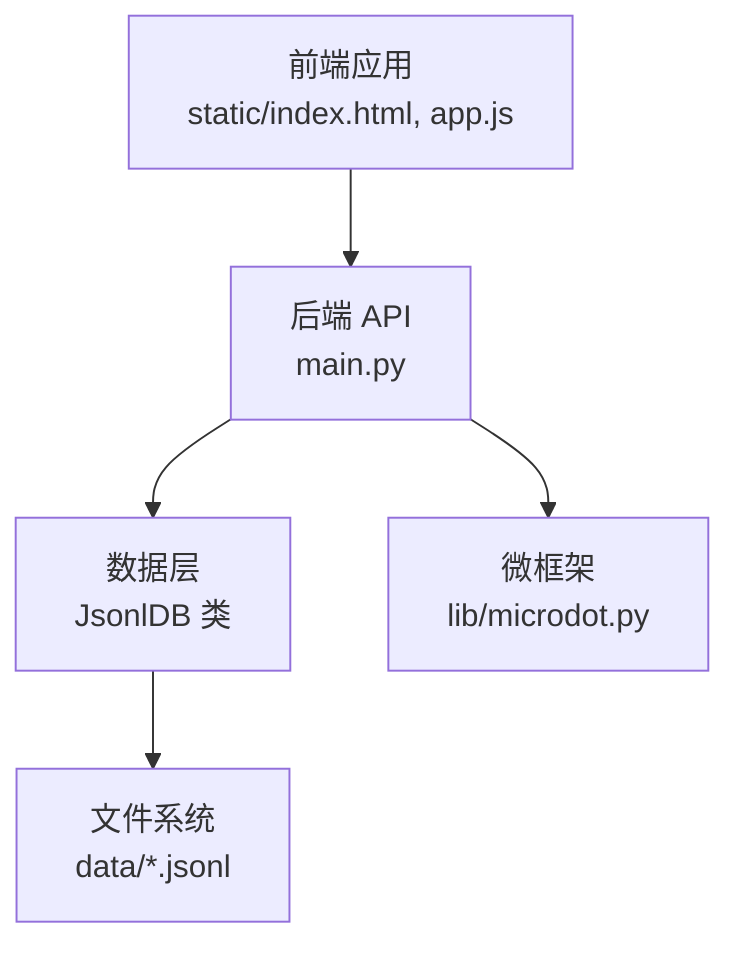
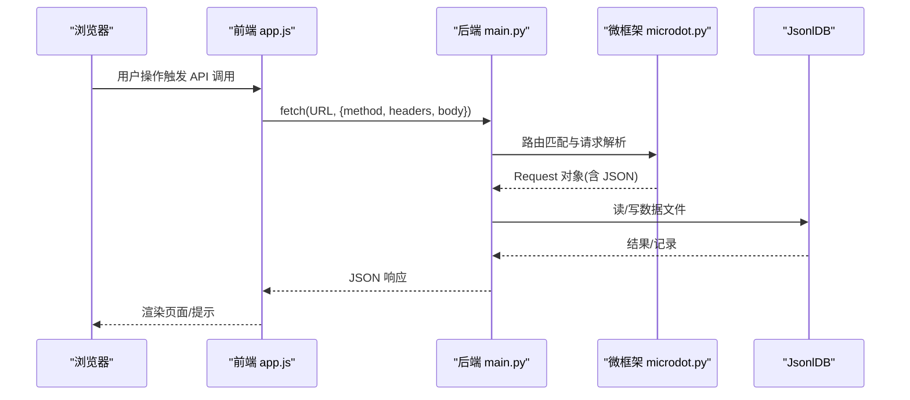
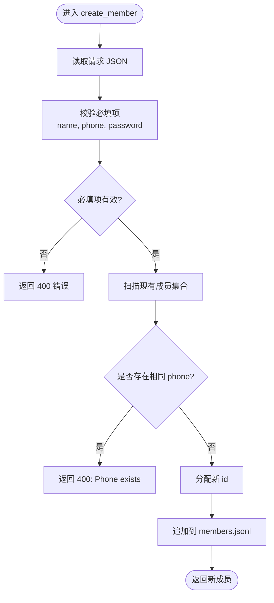
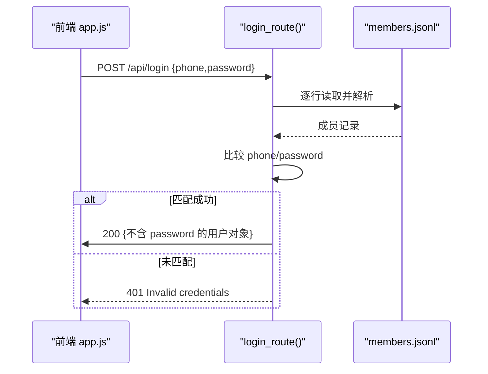
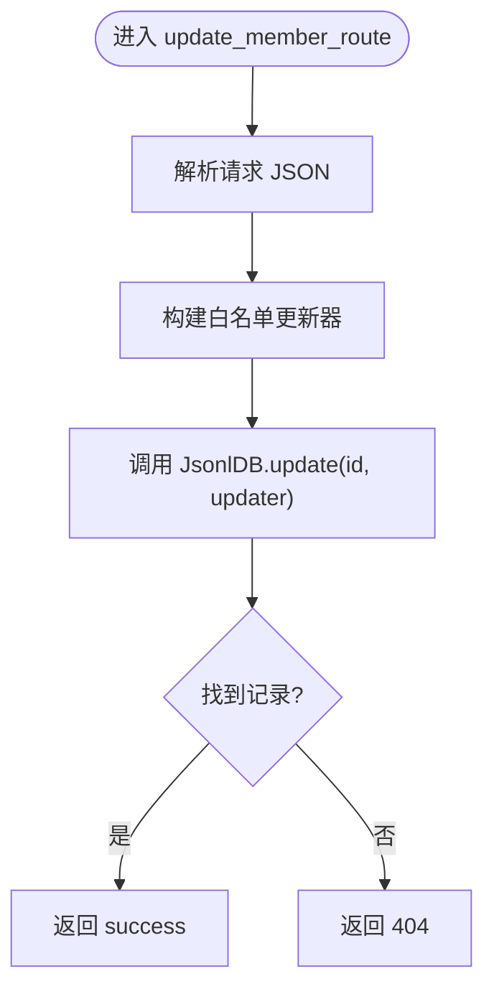
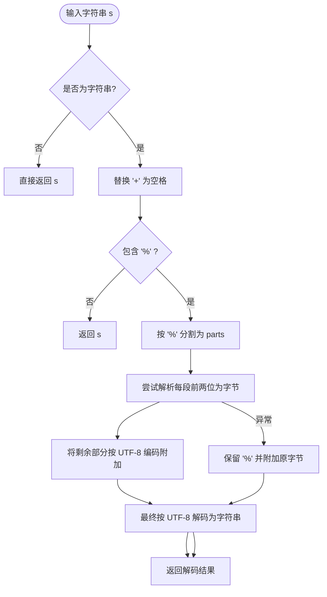
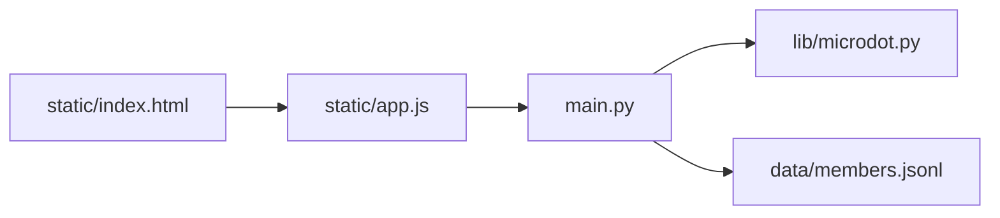

# 数据验证与安全

<cite>
**本文引用的文件列表**
- [main.py](file://main.py)
- [microdot.py](file://lib/microdot.py)
- [app.js](file://static/app.js)
- [index.html](file://static/index.html)
- [members.jsonl](file://data/members.jsonl)
- [settings.json](file://data/settings.json)
</cite>

## 目录
1. [简介](#简介)
2. [项目结构](#项目结构)
3. [核心组件](#核心组件)
4. [架构总览](#架构总览)
5. [详细组件分析](#详细组件分析)
6. [依赖关系分析](#依赖关系分析)
7. [性能考量](#性能考量)
8. [故障排查指南](#故障排查指南)
9. [结论](#结论)
10. [附录](#附录)

## 简介
本文件聚焦围炉诗社·理事台项目在数据验证与安全方面的实现与最佳实践，围绕以下关键场景展开：
- create_member() 中的手机号唯一性检查
- login_route() 中的凭据验证与敏感信息脱敏
- update_member_route() 中的字段白名单机制
- 输入数据的清洗与转义处理，特别是 simple_unquote() 的作用与 UTF-8 编码处理
- 客户端与服务器端双重验证的协同
- 防护 SQL 注入、XSS 攻击与数据完整性保护
- 安全最佳实践与常见漏洞的预防方法

## 项目结构
项目采用前后端分离的嵌入式 Web 架构：
- 前端静态资源与交互逻辑位于 static/ 目录，使用原生 JavaScript 实现页面渲染与 API 交互
- 后端服务基于轻量级微框架 lib/microdot.py，提供路由、请求解析与响应封装
- 数据持久化采用 JSON Lines 文件格式，分别存放诗歌、成员、活动、财务与任务等数据

图表来源
- [main.py](file://main.py#L17-L548)
- [microdot.py](file://lib/microdot.py#L1-L183)
- [app.js](file://static/app.js#L1-L1312)
- [index.html](file://static/index.html#L1-L269)

章节来源
- [main.py](file://main.py#L17-L548)
- [microdot.py](file://lib/microdot.py#L1-L183)
- [app.js](file://static/app.js#L1-L1312)
- [index.html](file://static/index.html#L1-L269)

## 核心组件
- 请求与响应处理：lib/microdot.py 提供 Request/Response 封装，自动解析 JSON 请求体、设置 Content-Type 并统一输出
- 路由与控制器：main.py 定义 /api/* 路由，实现成员、诗歌、活动、财务等业务接口
- 数据访问层：JsonlDB 抽象 JSON Lines 文件的增删改查、分页与全文检索
- 前端交互：static/app.js 负责登录、表单校验、API 调用与页面渲染

章节来源
- [microdot.py](file://lib/microdot.py#L5-L145)
- [main.py](file://main.py#L53-L267)
- [app.js](file://static/app.js#L60-L1312)

## 架构总览
后端服务启动后，接收前端请求，按路由分发到对应处理器。处理器读取/写入 JSON Lines 数据文件，返回标准化的 JSON 响应。前端通过 fetch API 与后端交互，实现 CRUD 与查询功能。

图表来源
- [app.js](file://static/app.js#L75-L98)
- [main.py](file://main.py#L485-L502)
- [microdot.py](file://lib/microdot.py#L104-L145)

## 详细组件分析

### 1) create_member() 手机号唯一性检查
- 服务器端验证：在创建成员前，遍历现有成员集合，比较 phone 字段是否重复，若重复直接返回 400
- 客户端验证：新增成员时，前端要求必填姓名、手机号与初始密码，避免空值进入后端
- 数据完整性：未通过校验的请求被拒绝，防止重复注册

图表来源
- [main.py](file://main.py#L456-L468)
- [app.js](file://static/app.js#L605-L621)

章节来源
- [main.py](file://main.py#L456-L468)
- [app.js](file://static/app.js#L605-L621)
- [members.jsonl](file://data/members.jsonl#L1-L4)

### 2) login_route() 凭据验证与敏感信息脱敏
- 登录流程：后端读取 members.jsonl，逐行解析 JSON，匹配 phone 与 password
- 成功响应：返回用户对象副本，但移除 password 字段，避免敏感信息泄露
- 失败处理：未找到匹配记录时返回 401

图表来源
- [main.py](file://main.py#L485-L502)
- [app.js](file://static/app.js#L75-L98)

章节来源
- [main.py](file://main.py#L485-L502)
- [app.js](file://static/app.js#L75-L98)

### 3) update_member_route() 字段白名单机制
- 白名单策略：仅允许更新 name、alias、phone、role、points、password、custom 等字段
- 更新过程：通过 JsonlDB.update 的回调函数，对目标记录进行就地修改
- 限制性：未在白名单内的字段会被忽略，避免意外覆盖

图表来源
- [main.py](file://main.py#L470-L478)

章节来源
- [main.py](file://main.py#L470-L478)

### 4) 输入数据清洗与转义：simple_unquote() 与 UTF-8 处理
- 功能定位：对 URL 查询参数进行鲁棒解码，支持 UTF-8 字符
- 处理流程：替换 + 为空格，按 % 分割，尝试解析两位十六进制字节，其余按 UTF-8 编码拼接，异常时回退原字符串
- 使用场景：在诗歌与活动列表的搜索接口中，对 q 参数进行解码后再检索

图表来源
- [main.py](file://main.py#L26-L48)
- [main.py](file://main.py#L317-L320)
- [main.py](file://main.py#L377-L379)

章节来源
- [main.py](file://main.py#L26-L48)
- [main.py](file://main.py#L317-L320)
- [main.py](file://main.py#L377-L379)

### 5) 客户端与服务器端双重验证的协同
- 前端职责：必填项校验、输入格式提示、错误消息弹窗、本地状态缓存
- 后端职责：幂等性检查（如手机号唯一）、字段白名单、敏感信息脱敏、错误码返回
- 协同效果：减少无效请求，提升用户体验与系统稳定性

章节来源
- [app.js](file://static/app.js#L75-L98)
- [app.js](file://static/app.js#L605-L644)
- [main.py](file://main.py#L456-L468)
- [main.py](file://main.py#L470-L478)

### 6) 安全防护措施与建议

- SQL 注入防护
  - 当前系统不使用传统 SQL，而是基于 JSON Lines 文件的纯文本存储，天然避免 SQL 注入
  - 建议：未来如引入数据库，务必使用参数化查询与最小权限原则

- XSS 攻击防范
  - 输出过滤：前端渲染时未发现直接拼接用户输入到 HTML 属性或内联脚本的模式
  - 建议：对用户输入进行 HTML 转义或使用模板引擎，避免内联事件与动态 eval

- 数据完整性保护
  - 唯一性约束：手机号唯一性检查
  - 白名单更新：仅允许受控字段变更
  - 敏感信息脱敏：登录响应不返回密码
  - 建议：对关键字段增加长度与格式校验，必要时引入 schema 校验库

- 认证与授权
  - 登录凭据：手机号+密码明文传输，建议在生产环境启用 HTTPS
  - 权限模型：角色字段用于界面与操作可见性控制，建议补充会话令牌与接口鉴权

- 日志与监控
  - 建议：记录关键操作日志（登录、成员变更、财务记账），便于审计与追踪

章节来源
- [main.py](file://main.py#L456-L468)
- [main.py](file://main.py#L470-L478)
- [main.py](file://main.py#L485-L502)
- [app.js](file://static/app.js#L75-L98)

## 依赖关系分析

图表来源
- [main.py](file://main.py#L10-L11)
- [microdot.py](file://lib/microdot.py#L1-L183)
- [app.js](file://static/app.js#L1-L1312)
- [index.html](file://static/index.html#L1-L269)

章节来源
- [main.py](file://main.py#L10-L11)
- [microdot.py](file://lib/microdot.py#L1-L183)
- [app.js](file://static/app.js#L1-L1312)
- [index.html](file://static/index.html#L1-L269)

## 性能考量
- JSON Lines 顺序扫描：查询与更新采用逐行扫描，适合中小规模数据；大规模数据建议引入索引或数据库
- 内存占用：get_all() 一次性加载全部成员，注意内存上限
- 建议：对高频查询字段建立索引文件，或迁移至轻量化数据库

## 故障排查指南
- 登录失败
  - 检查前端输入是否为空
  - 确认 members.jsonl 中是否存在对应 phone 与 password
  - 查看后端返回状态码与错误信息

- 创建成员失败
  - 确认必填项是否完整
  - 检查手机号是否重复
  - 查看后端返回的错误提示

- 更新成员字段无效
  - 确认字段是否在白名单范围内
  - 检查 id 是否正确

- 搜索结果异常
  - 确认查询参数是否正确编码
  - 检查 simple_unquote() 是否正常工作

章节来源
- [main.py](file://main.py#L456-L502)
- [app.js](file://static/app.js#L75-L98)
- [app.js](file://static/app.js#L605-L644)

## 结论
本项目在嵌入式环境下实现了简洁可靠的数据验证与安全机制：通过手机号唯一性检查、字段白名单更新与敏感信息脱敏，有效提升了数据一致性与安全性。simple_unquote() 对 UTF-8 查询参数的稳健解码，确保了国际化搜索体验。建议在后续版本中引入 HTTPS、参数化查询、更严格的输入校验与审计日志，以进一步增强系统的安全性与可维护性。

## 附录

### A. 数据验证与安全规则清单
- create_member()
  - 必填项：name, phone, password
  - 唯一性：phone 不可重复
  - 返回：新成员对象（不含 password）
- login_route()
  - 输入：phone, password
  - 返回：用户对象（不含 password），否则 401
- update_member_route()
  - 允许字段：name, alias, phone, role, points, password, custom
  - 返回：success 或 404

章节来源
- [main.py](file://main.py#L456-L502)
- [main.py](file://main.py#L470-L478)

### B. 客户端验证示例路径
- 登录表单校验与提交：[app.js](file://static/app.js#L75-L98)
- 新增/编辑成员表单校验与提交：[app.js](file://static/app.js#L605-L644)
- 搜索参数编码与解码：[app.js](file://static/app.js#L177-L181)，[main.py](file://main.py#L317-L320)

章节来源
- [app.js](file://static/app.js#L75-L98)
- [app.js](file://static/app.js#L605-L644)
- [main.py](file://main.py#L317-L320)