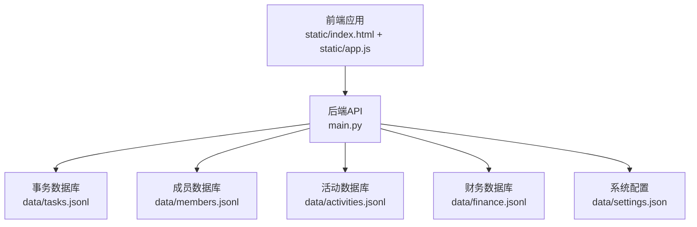
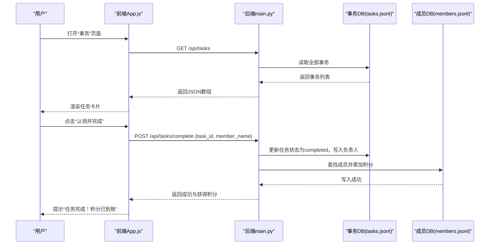
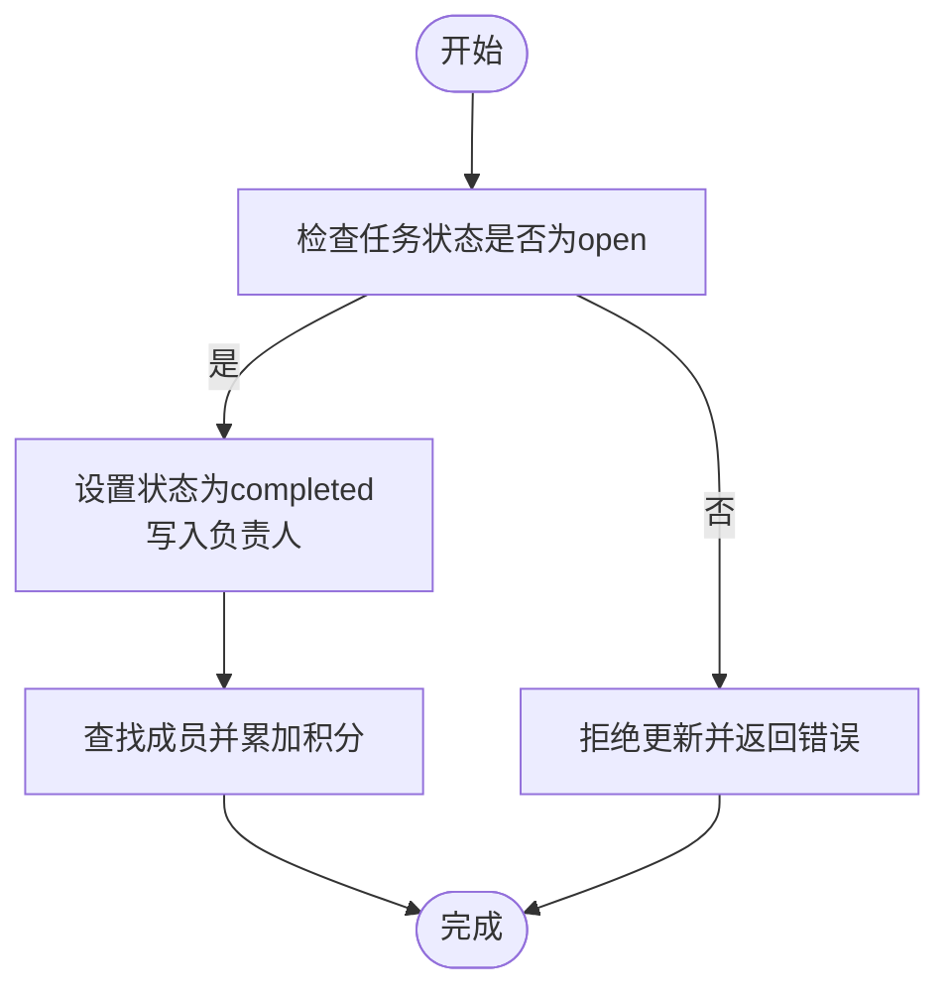
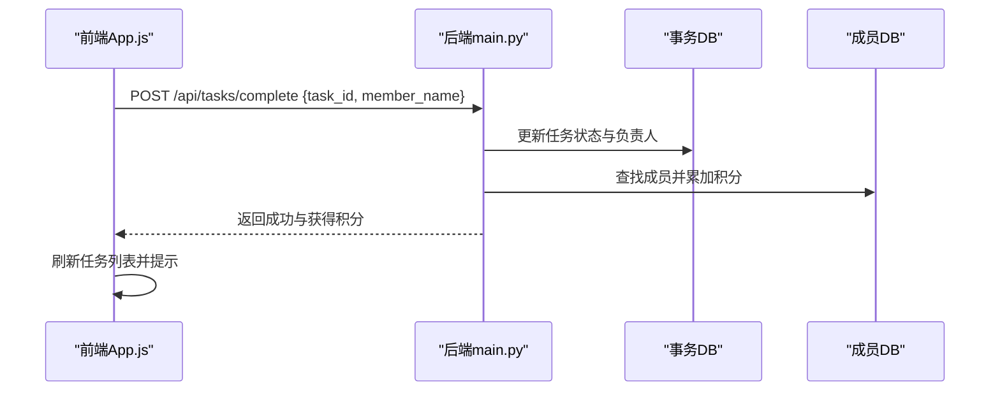
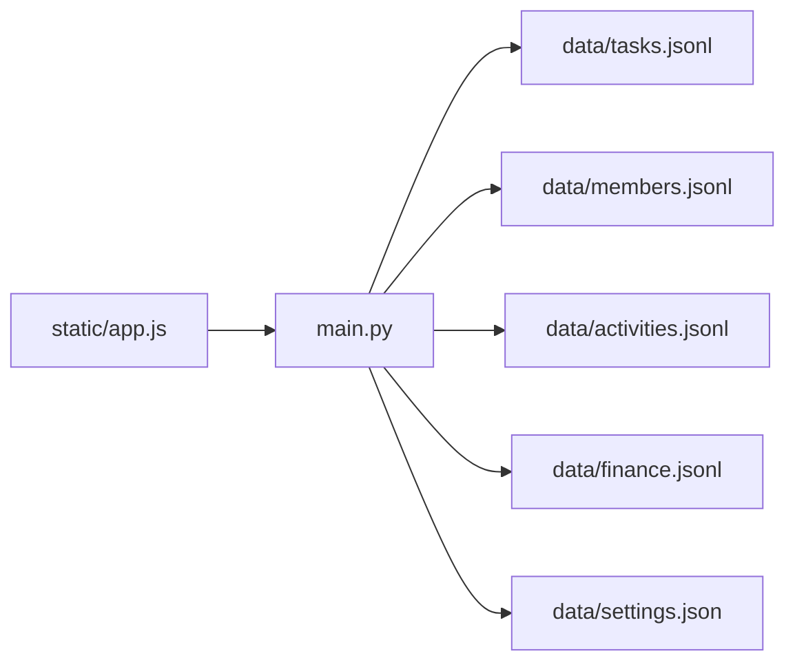

# 事务实体模型

<cite>
**本文引用的文件**
- [main.py](file://main.py)
- [app.js](file://static/app.js)
- [index.html](file://static/index.html)
- [tasks.jsonl](file://data/tasks.jsonl)
- [members.jsonl](file://data/members.jsonl)
- [activities.jsonl](file://data/activities.jsonl)
- [finance.jsonl](file://data/finance.jsonl)
- [settings.json](file://data/settings.json)
</cite>

## 目录
1. [引言](#引言)
2. [项目结构](#项目结构)
3. [核心组件](#核心组件)
4. [架构总览](#架构总览)
5. [详细组件分析](#详细组件分析)
6. [依赖分析](#依赖分析)
7. [性能考虑](#性能考虑)
8. [故障排查指南](#故障排查指南)
9. [结论](#结论)
10. [附录](#附录)

## 引言
本文件面向“围炉诗社·理事台”项目的事务实体模型，系统化梳理日常事务数据结构、字段定义、工作流与积分激励机制，并结合前端交互与后端API，给出事务创建、指派、执行、验收的完整业务流程示例。同时，说明事务与成员积分、工作量统计、效率分析等模块的关联关系，以及事务数据的自动化处理、提醒机制与报表生成的实现建议。

## 项目结构
项目采用前后端分离架构：前端使用静态HTML/CSS/JS，后端基于轻量HTTP框架提供REST API，数据以JSON Lines格式持久化存储在data目录中。事务实体主要对应tasks.jsonl文件，成员信息对应members.jsonl，活动与财务分别对应activities.jsonl与finance.jsonl，系统配置与自定义字段由settings.json提供。

图表来源
- [main.py](file://main.py#L261-L266)
- [index.html](file://static/index.html#L1-L269)
- [app.js](file://static/app.js#L1-L1312)

章节来源
- [main.py](file://main.py#L261-L266)
- [index.html](file://static/index.html#L1-L269)

## 核心组件
- 事务实体模型（tasks.jsonl）
  - 关键字段：任务ID、标题、描述、状态、奖励积分、负责人等
  - 状态流转：open → completed
  - 与成员积分联动：完成任务后为成员增加相应积分
- 成员实体模型（members.jsonl）
  - 角色与权限：member、director、finance、admin、super_admin
  - 积分points字段用于事务激励与统计
- 活动实体模型（activities.jsonl）
  - 与事务协同：活动策划与执行过程中的事务分解与追踪
- 财务实体模型（finance.jsonl）
  - 收支记录与结余统计，支撑事务成本核算与预算控制
- 系统配置（settings.json）
  - 自定义成员字段，扩展成员档案以支持更细粒度的事务管理

章节来源
- [tasks.jsonl](file://data/tasks.jsonl#L1-L2)
- [members.jsonl](file://data/members.jsonl#L1-L4)
- [activities.jsonl](file://data/activities.jsonl#L1-L7)
- [finance.jsonl](file://data/finance.jsonl#L1-L3)
- [settings.json](file://data/settings.json#L1-L1)

## 架构总览
后端通过路由暴露事务相关接口，前端通过XHR调用API完成事务列表展示、任务完成与积分发放。系统状态与设备信息通过独立接口返回，供前端仪表盘展示。

图表来源
- [app.js](file://static/app.js#L683-L727)
- [main.py](file://main.py#L411-L449)

章节来源
- [main.py](file://main.py#L411-L449)
- [app.js](file://static/app.js#L683-L727)

## 详细组件分析

### 事务实体模型（tasks.jsonl）
- 数据结构要点
  - 任务ID：唯一标识，用于更新与查询
  - 标题与描述：任务内容与背景说明
  - 状态：open（开放）、completed（已完成）
  - 奖励积分：完成任务后发放给负责人的积分值
  - 负责人：完成任务时写入的成员名称
- 字段复杂度与性能
  - 读取：全量获取适用于小规模事务数据
  - 更新：逐行扫描定位目标记录，重写文件，适合小数据量
- 工作流与状态机
  - open → completed：仅允许将open状态的任务标记为completed
  - 负责人字段在完成时写入，便于溯源与统计

图表来源
- [main.py](file://main.py#L415-L449)

章节来源
- [tasks.jsonl](file://data/tasks.jsonl#L1-L2)
- [main.py](file://main.py#L415-L449)

### 成员实体模型（members.jsonl）
- 字段与角色
  - 角色：member、director、finance、admin、super_admin
  - 积分：points，用于事务激励与绩效统计
  - 其他：姓名、雅号、手机号、密码、加入日期等
- 与事务的关联
  - 任务完成时，按奖励积分累加到对应成员的points字段
  - 前端显示积分badge，体现成员贡献

章节来源
- [members.jsonl](file://data/members.jsonl#L1-L4)
- [main.py](file://main.py#L436-L447)

### 活动与财务实体模型
- 活动（activities.jsonl）
  - 用于活动策划与执行过程中的事务分解与追踪
  - 前端支持活动详情查看与状态展示
- 财务（finance.jsonl）
  - 收入/支出记录，支持统计与报表生成
  - 与事务成本核算与预算控制相关联

章节来源
- [activities.jsonl](file://data/activities.jsonl#L1-L7)
- [finance.jsonl](file://data/finance.jsonl#L1-L3)

### 前端交互与API集成
- 事务列表渲染
  - 前端拉取任务列表，渲染卡片，显示标题、描述与奖励积分
  - 对未完成任务提供“认领并完成”按钮
- 任务完成流程
  - 前端构造请求体，包含任务ID与当前成员名称
  - 后端校验状态并更新任务与成员积分
  - 前端刷新列表并提示完成结果

图表来源
- [app.js](file://static/app.js#L713-L727)
- [main.py](file://main.py#L415-L449)

章节来源
- [app.js](file://static/app.js#L683-L727)
- [main.py](file://main.py#L415-L449)

### 事务类型分类与工作流程管理
- 事务类型分类（建议）
  - 行政事务：如资料整理、会务准备、资产登记
  - 技术维护：如系统巡检、设备维护、数据备份
  - 文化建设：如雅集组织、诗稿整理、对外宣传
  - 综合事务：跨部门协作、临时专项任务
- 工作流程管理
  - 任务创建：由管理员或理事发布，明确标题、描述、奖励积分
  - 任务认领：成员浏览并认领open任务
  - 任务完成：成员完成任务后提交，系统自动发放积分
  - 任务验收：由发布者或管理员核验，确保质量与时效

说明：当前数据模型未内置“事务类型”字段，可在settings.json中扩展字段定义，或在任务描述中约定分类标签，配合前端筛选与报表生成。

章节来源
- [settings.json](file://data/settings.json#L1-L1)
- [tasks.jsonl](file://data/tasks.jsonl#L1-L2)

### 任务分配机制、进度跟踪与绩效评估
- 任务分配机制
  - 采用“认领制”：成员可主动认领open任务
  - 可扩展为“指派制”：管理员直接指派给特定成员
- 进度跟踪
  - 通过状态字段（open/completed）与负责人字段实现
  - 前端按状态与负责人过滤与排序
- 绩效评估
  - 基于成员完成任务数量、奖励积分与平均耗时进行统计
  - 可结合活动与财务数据进行综合评估

章节来源
- [main.py](file://main.py#L426-L429)
- [members.jsonl](file://data/members.jsonl#L1-L4)

### 事务与成员积分、工作量统计、效率分析的关联
- 事务与积分
  - 任务完成后，系统自动为负责人增加相应积分
- 工作量统计
  - 通过任务完成次数与奖励积分汇总，形成个人与团队的工作量报表
- 效率分析
  - 结合任务创建时间、完成时间与负责人，计算平均完成时长与任务密度
  - 可与财务数据联动，评估事务成本与收益

章节来源
- [main.py](file://main.py#L436-L447)
- [finance.jsonl](file://data/finance.jsonl#L1-L3)

### 事务数据的自动化处理、提醒机制与报表生成
- 自动化处理
  - 任务完成自动积分发放，无需人工干预
  - 可扩展：到期提醒、重复任务模板、批量导入导出
- 提醒机制
  - 前端可基于任务状态与负责人进行本地提醒
  - 后端可扩展定时任务，推送到期预警
- 报表生成
  - 按成员维度：完成数、总积分、平均耗时
  - 按事务维度：类型分布、完成率、成本统计
  - 导出为表格或图表，辅助决策

章节来源
- [app.js](file://static/app.js#L1108-L1201)
- [main.py](file://main.py#L415-L449)

## 依赖分析
- 组件耦合
  - 前端与后端通过REST API耦合，事务完成流程涉及事务DB与成员DB的协同
  - 配置文件settings.json影响成员字段展示，间接影响事务数据的采集与呈现
- 外部依赖
  - 前端使用浏览器标准API（fetch、IndexedDB等）
  - 后端基于轻量HTTP框架与文件系统

图表来源
- [main.py](file://main.py#L261-L266)
- [app.js](file://static/app.js#L1-L1312)

章节来源
- [main.py](file://main.py#L261-L266)
- [app.js](file://static/app.js#L1-L1312)

## 性能考虑
- 小数据量优势
  - 事务与成员数据量较小，全量读取与逐行更新仍具备可接受的响应时间
- 可优化方向
  - 事务列表分页与搜索：后端已提供分页与搜索能力，前端应充分利用
  - 任务完成更新：可考虑引入内存缓存与增量更新策略，减少文件重写频率
  - 前端索引：对常用字段（如状态、负责人）建立索引，提升筛选与排序性能

章节来源
- [main.py](file://main.py#L113-L185)
- [app.js](file://static/app.js#L1148-L1201)

## 故障排查指南
- 登录失败
  - 检查手机号与密码是否匹配members.jsonl中的记录
- 任务完成失败
  - 确认任务状态为open且任务ID正确
  - 检查成员是否存在且名称一致
- 积分未到账
  - 确认任务完成接口返回成功
  - 检查成员points字段是否更新
- 前端搜索无结果
  - 确认后端搜索接口正常返回
  - 检查前端搜索缓存与防抖逻辑

章节来源
- [main.py](file://main.py#L485-L502)
- [main.py](file://main.py#L415-L449)
- [app.js](file://static/app.js#L1129-L1201)

## 结论
事务实体模型以简洁的JSON Lines结构实现了任务生命周期管理与成员积分激励，配合前端交互与后端API，形成了完整的事务工作流闭环。通过扩展字段与报表功能，可进一步支撑事务类型分类、进度跟踪与绩效评估，为围炉诗社的日常运营提供数据驱动的管理能力。

## 附录
- 事务创建、指派、执行、验收的完整业务流程示例
  - 创建：管理员在前端发起任务，填写标题、描述与奖励积分，保存后状态为open
  - 指派/认领：成员浏览open任务，选择认领
  - 执行：成员完成任务，提交完成申请
  - 验收：发布者或管理员核验，系统自动发放积分并更新状态为completed
- 数据模型字段定义（建议补充）
  - 事务类型：用于分类与报表
  - 截止日期：用于提醒与效率分析
  - 优先级：用于任务排序与资源分配
  - 描述附件/链接：用于任务说明与证据留存

章节来源
- [index.html](file://static/index.html#L158-L162)
- [app.js](file://static/app.js#L683-L727)
- [main.py](file://main.py#L415-L449)