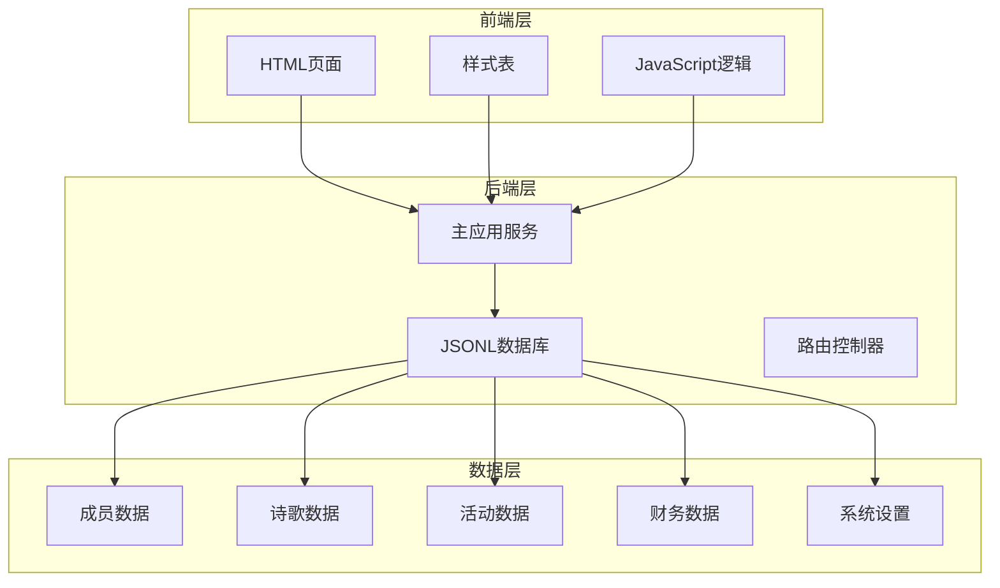
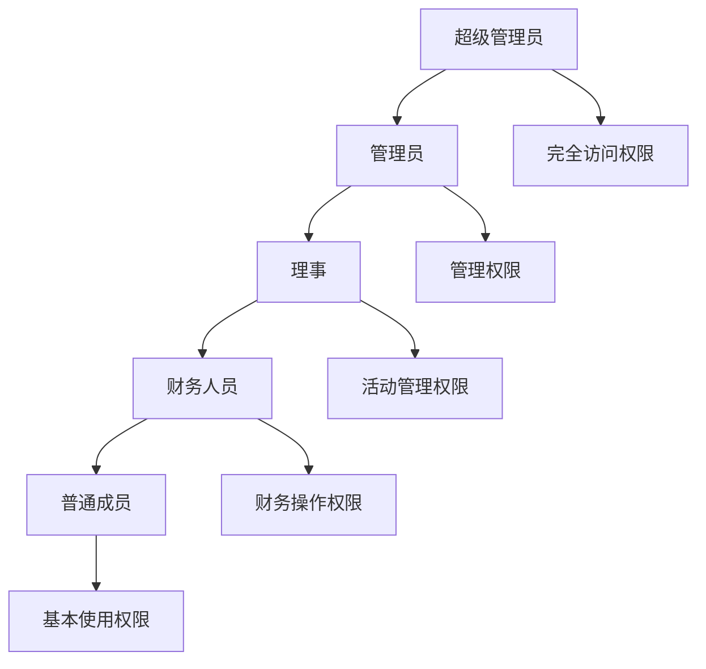
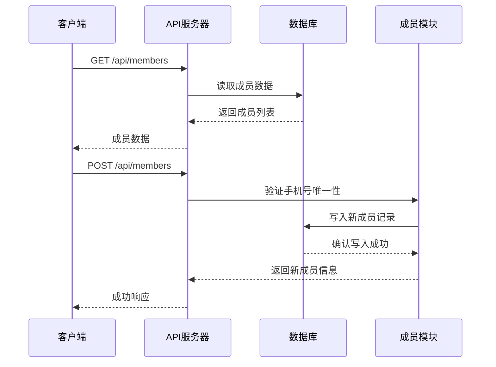
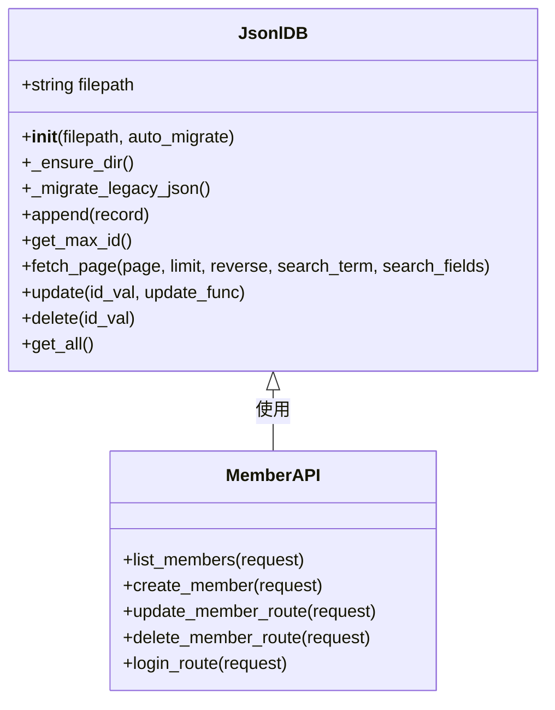
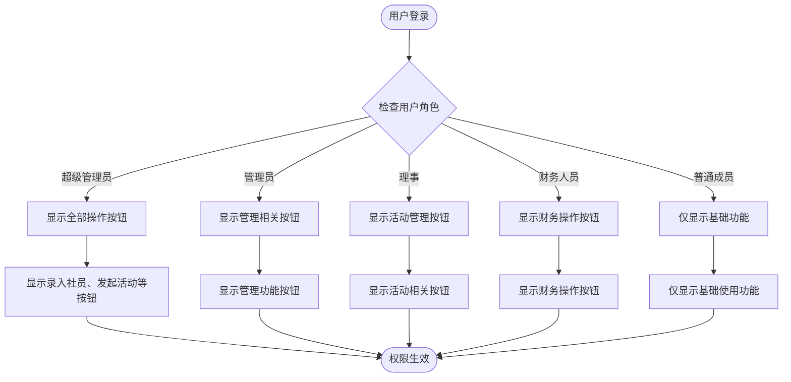
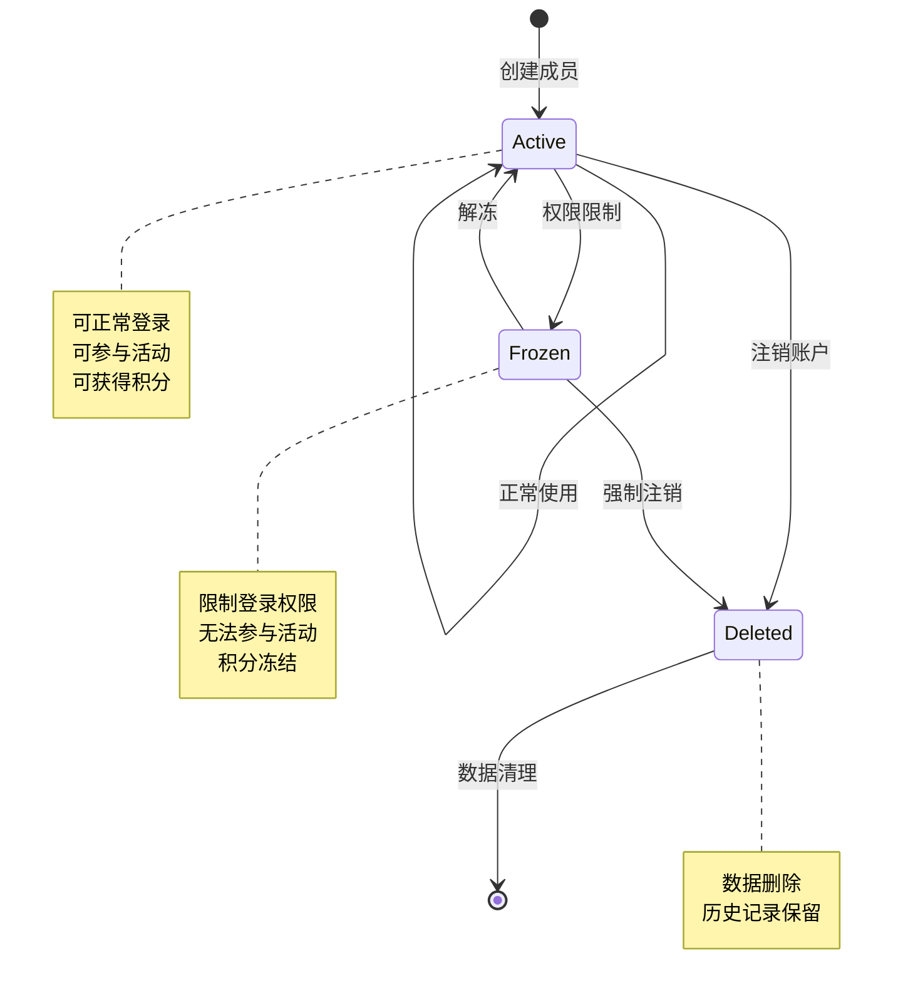
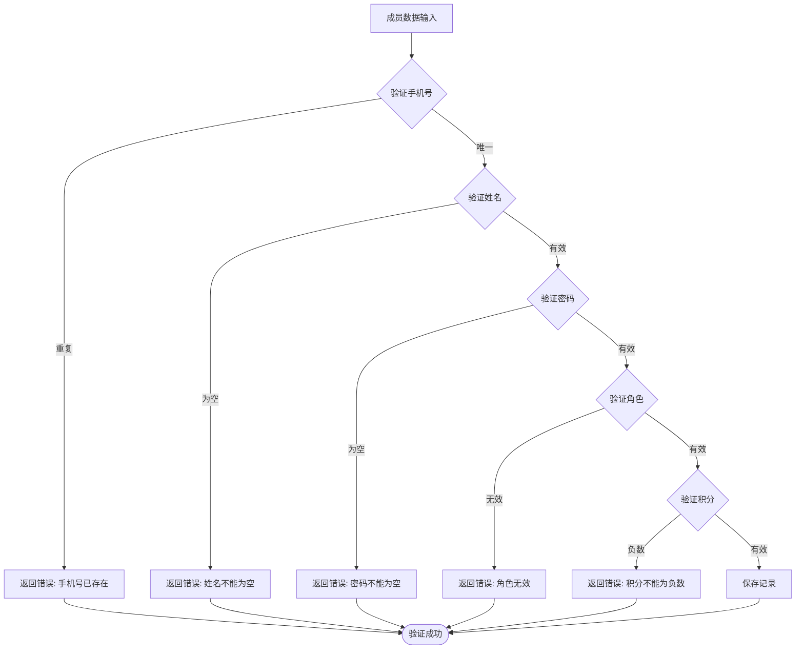
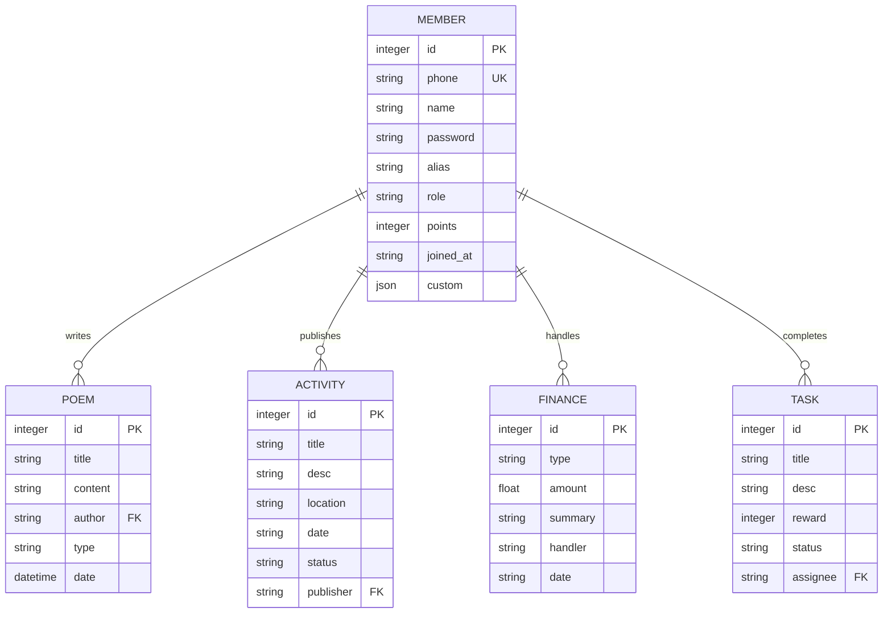
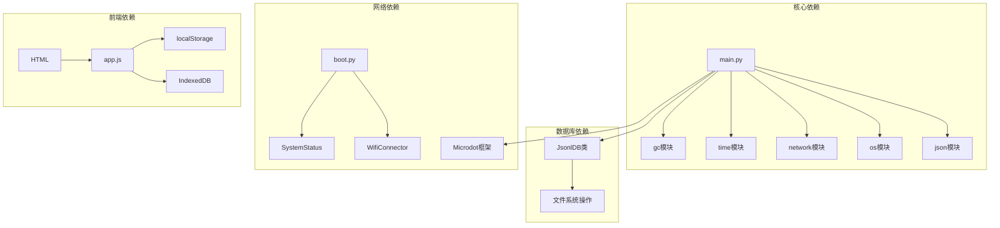

# 成员实体模型

<cite>
**本文档引用的文件**
- [main.py](file://main.py)
- [boot.py](file://boot.py)
- [index.html](file://static/index.html)
- [app.js](file://static/app.js)
- [members.jsonl](file://data/members.jsonl)
- [settings.json](file://data/settings.json)
- [config.json](file://data/config.json)
- [poems.jsonl](file://data/poems.jsonl)
- [activities.jsonl](file://data/activities.jsonl)
- [finance.jsonl](file://data/finance.jsonl)
</cite>

## 目录
1. [简介](#简介)
2. [项目结构](#项目结构)
3. [核心组件](#核心组件)
4. [架构概览](#架构概览)
5. [详细组件分析](#详细组件分析)
6. [依赖分析](#依赖分析)
7. [性能考虑](#性能考虑)
8. [故障排除指南](#故障排除指南)
9. [结论](#结论)

## 简介

围炉诗社·理事台项目是一个基于ESP32微控制器的Web应用，用于管理诗社的各项业务。成员实体模型是整个系统的核心数据结构，承载着诗社成员的基本信息、权限管理和积分体系。本文档将深入分析成员实体的完整设计，包括数据结构、角色权限体系、状态管理以及与其他功能模块的关联关系。

## 项目结构

该项目采用前后端分离的架构设计，主要包含以下核心组件：

**图表来源**
- [main.py](file://main.py#L261-L266)
- [index.html](file://static/index.html#L1-L269)

**章节来源**
- [main.py](file://main.py#L1-L548)
- [boot.py](file://boot.py#L1-L122)

## 核心组件

### 成员实体数据结构

成员实体采用JSON格式存储，包含以下核心字段：

| 字段名 | 类型 | 必填 | 默认值 | 描述 |
|--------|------|------|--------|------|
| id | 整数 | 是 | 自增 | 成员唯一标识符 |
| phone | 字符串 | 是 | - | 手机号码（登录凭证） |
| name | 字符串 | 是 | - | 成员真实姓名 |
| password | 字符串 | 是 | - | 登录密码 |
| alias | 字符串 | 否 | - | 雅号/花名 |
| role | 字符串 | 否 | "member" | 角色权限 |
| points | 整数 | 否 | 0 | 积分余额 |
| joined_at | 字符串 | 否 | 当前日期 | 加入日期 |
| custom | 对象 | 否 | {} | 自定义字段 |

### 角色权限体系

系统实现了多层次的权限控制机制：

**图表来源**
- [index.html](file://static/index.html#L219-L225)
- [app.js](file://static/app.js#L517-L518)

**章节来源**
- [members.jsonl](file://data/members.jsonl#L1-L4)
- [index.html](file://static/index.html#L219-L225)

## 架构概览

系统采用RESTful API架构，通过HTTP请求与响应进行数据交互：

**图表来源**
- [main.py](file://main.py#L451-L483)

**章节来源**
- [main.py](file://main.py#L299-L548)

## 详细组件分析

### 成员数据库管理

系统使用自定义的JsonlDB类来管理成员数据，该类提供了完整的CRUD操作：

**图表来源**
- [main.py](file://main.py#L53-L258)
- [main.py](file://main.py#L451-L483)

### 成员权限控制机制

权限控制通过前端JavaScript实现，根据不同角色显示相应的操作按钮：

**图表来源**
- [app.js](file://static/app.js#L140-L147)
- [app.js](file://static/app.js#L517-L518)

**章节来源**
- [app.js](file://static/app.js#L140-L147)
- [app.js](file://static/app.js#L517-L518)

### 成员状态管理

系统支持成员状态的完整生命周期管理：

**图表来源**
- [main.py](file://main.py#L485-L503)

### 成员字段验证规则

系统实现了多层次的数据验证机制：

**图表来源**
- [main.py](file://main.py#L456-L468)

**章节来源**
- [main.py](file://main.py#L456-L468)

### 成员与业务模块关联

成员实体与各个功能模块存在紧密的关联关系：

**图表来源**
- [poems.jsonl](file://data/poems.jsonl#L1-L4)
- [activities.jsonl](file://data/activities.jsonl#L1-L7)
- [finance.jsonl](file://data/finance.jsonl#L1-L3)

**章节来源**
- [poems.jsonl](file://data/poems.jsonl#L1-L4)
- [activities.jsonl](file://data/activities.jsonl#L1-L7)
- [finance.jsonl](file://data/finance.jsonl#L1-L3)

## 依赖分析

系统各组件之间的依赖关系如下：

**图表来源**
- [main.py](file://main.py#L1-L16)
- [boot.py](file://boot.py#L1-L12)

**章节来源**
- [main.py](file://main.py#L1-L16)
- [boot.py](file://boot.py#L1-L12)

## 性能考虑

系统在设计时充分考虑了性能优化：

1. **内存优化**: 使用流式文件读取，避免一次性加载大量数据
2. **缓存策略**: 前端使用localStorage缓存用户信息和自定义字段配置
3. **索引机制**: 通过ID字段实现快速查找
4. **分页处理**: API接口支持分页查询，减少单次传输数据量

## 故障排除指南

### 常见问题及解决方案

| 问题类型 | 症状 | 可能原因 | 解决方案 |
|----------|------|----------|----------|
| 登录失败 | 提示账号或密码错误 | 用户名或密码错误 | 检查输入的手机号和密码是否正确 |
| 成员注册失败 | 返回"Phone exists" | 手机号已被注册 | 更换其他手机号进行注册 |
| 权限不足 | 按钮不可见 | 角色权限不够 | 使用更高权限的账号登录 |
| 数据同步问题 | 页面显示异常 | 缓存数据过期 | 清除浏览器缓存或刷新页面 |

**章节来源**
- [main.py](file://main.py#L485-L503)
- [main.py](file://main.py#L461-L468)

## 结论

围炉诗社·理事台项目的成员实体模型设计合理，实现了完整的权限控制和数据管理功能。通过JSONL格式的数据库设计，系统具备良好的扩展性和维护性。角色权限体系清晰明确，能够满足诗社日常管理的各种需求。

系统的前端界面友好，后端API设计规范，为后续的功能扩展奠定了坚实的基础。建议在未来版本中进一步完善数据验证机制和错误处理流程，提升系统的稳定性和用户体验。