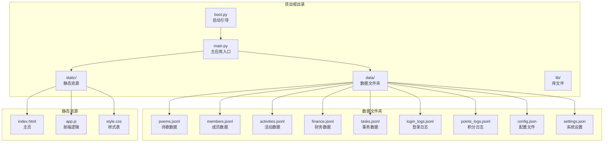
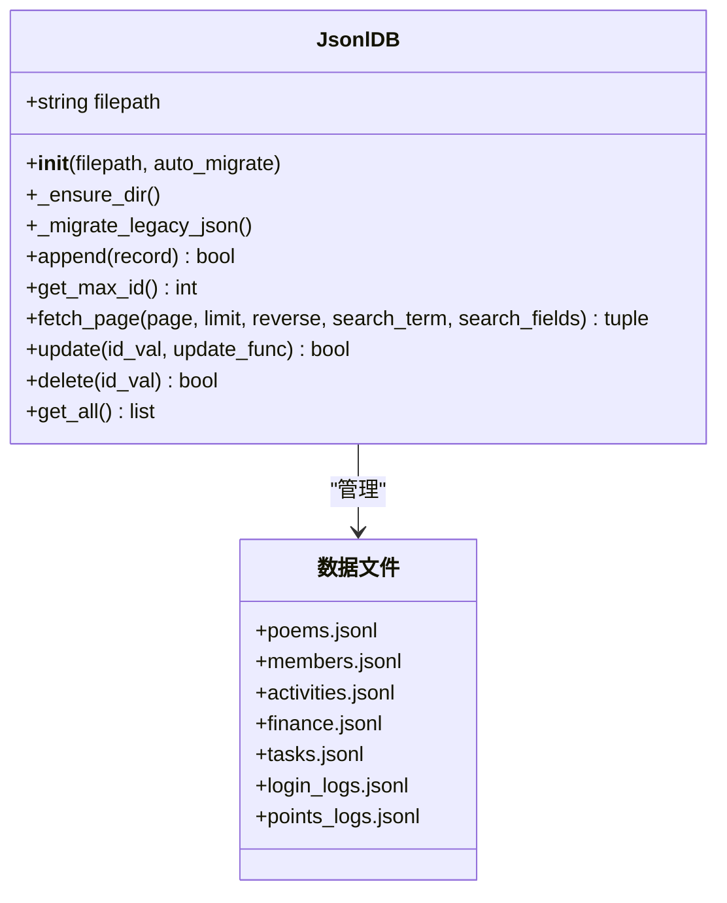
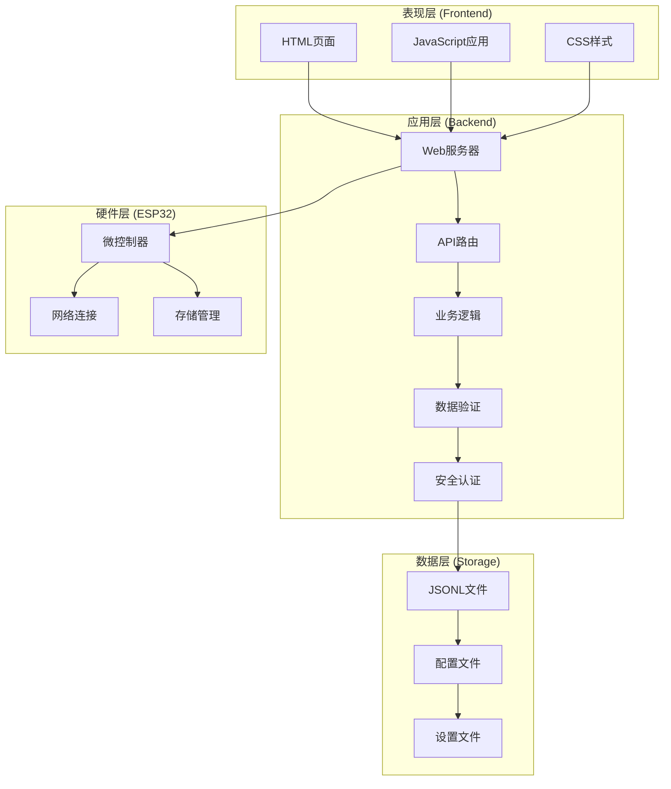
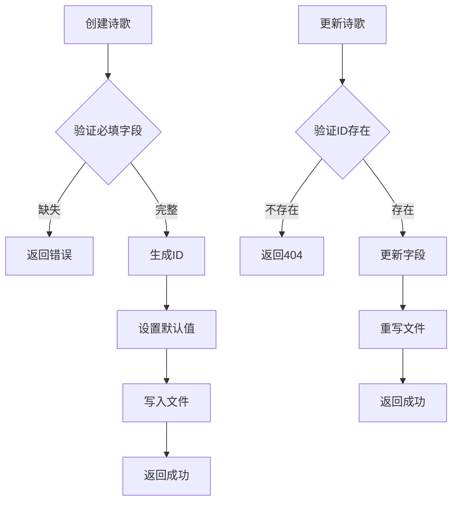
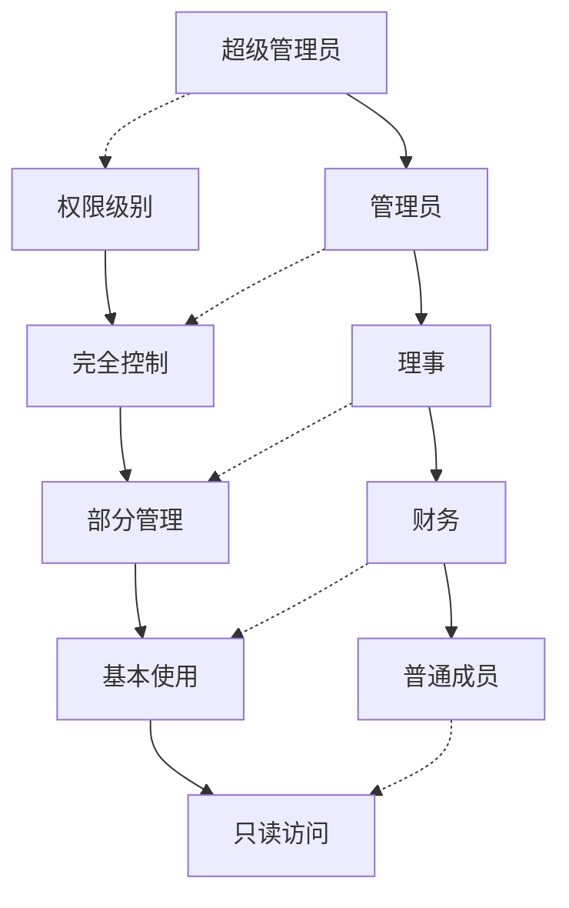
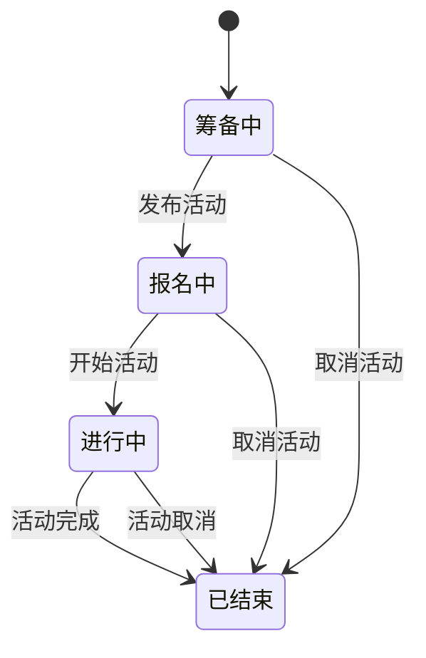
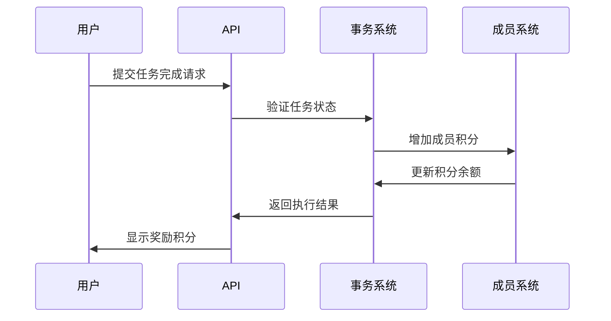
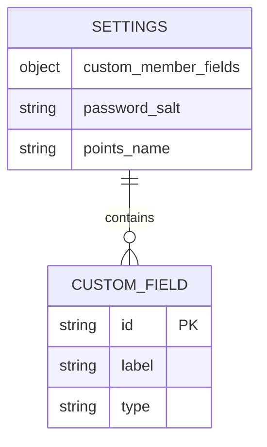
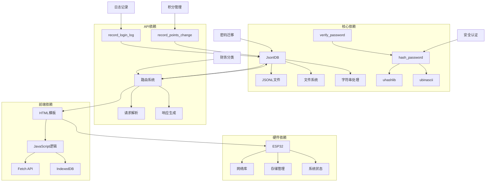

# 数据模型设计

<cite>
**本文档引用的文件**
- [main.py](file://src/main.py)
- [boot.py](file://src/boot.py)
- [index.html](file://src/static/index.html)
- [app.js](file://src/static/app.js)
- [poems.jsonl](file://src/data/poems.jsonl)
- [members.jsonl](file://src/data/members.jsonl)
- [activities.jsonl](file://src/data/activities.jsonl)
- [finance.jsonl](file://src/data/finance.jsonl)
- [tasks.jsonl](file://src/data/tasks.jsonl)
- [login_logs.jsonl](file://src/data/login_logs.jsonl)
- [points_logs.jsonl](file://src/data/points_logs.jsonl)
- [config.json](file://src/data/config.json)
- [settings.json](file://src/data/settings.json)
</cite>

## 目录
1. [简介](#简介)
2. [项目结构](#项目结构)
3. [核心组件](#核心组件)
4. [架构概览](#架构概览)
5. [详细组件分析](#详细组件分析)
6. [依赖关系分析](#依赖关系分析)
7. [性能考虑](#性能考虑)
8. [故障排除指南](#故障排除指南)
9. [结论](#结论)
10. [附录](#附录)

## 简介

围炉诗社·理事台是一个基于ESP32微控制器的诗词文化管理系统，采用JSONL文件格式存储数据，提供诗歌创作、成员管理、活动组织、财务管理等功能。本项目采用前后端分离架构，前端使用HTML/CSS/JavaScript，后端使用Python微服务框架，通过HTTP API进行数据交互。

**更新** 项目现已增强安全性和审计能力，新增登录日志和积分变动日志功能，改进密码存储机制为哈希加密，并更新财务实体模型以支持分类功能。

## 项目结构

项目采用模块化组织方式，主要包含以下目录和文件：



**图表来源**
- [main.py](file://src/main.py#L1-L887)
- [boot.py](file://src/boot.py#L1-L122)

**章节来源**
- [main.py](file://src/main.py#L1-L887)
- [boot.py](file://src/boot.py#L1-L122)

## 核心组件

### 数据库管理器 (JsonlDB)

项目实现了专门的JSONL数据库管理器，用于处理JSON Lines格式的数据文件：



**图表来源**
- [main.py](file://src/main.py#L76-L282)

JsonlDB提供了以下核心功能：
- **文件迁移**：自动将旧的JSON格式迁移到JSONL格式
- **分页查询**：支持大数据集的高效分页浏览
- **全文搜索**：在指定字段范围内进行内容搜索
- **记录更新**：通过重写整个文件的方式实现记录更新
- **ID管理**：自动分配递增的ID编号

**章节来源**
- [main.py](file://src/main.py#L76-L282)

### API路由系统

系统提供了RESTful API接口，支持各种数据操作：

```mermaid
graph LR
subgraph "API路由"
A[/api/poems<br/>诗歌管理]
B[/api/members<br/>成员管理]
C[/api/activities<br/>活动管理]
D[/api/finance<br/>财务管理]
E[/api/tasks<br/>事务管理]
F[/api/login<br/>用户登录]
G[/api/login_logs<br/>登录日志]
H[/api/settings/fields<br/>设置管理]
I[/api/system/info<br/>系统信息]
J[/api/migrate_passwords<br/>密码迁移]
K[/api/points/yearly_ranking<br/>积分年度排行]
end
subgraph "前端应用"
L[前端页面]
M[用户交互]
end
L --> M
M --> A
M --> B
M --> C
M --> D
M --> E
M --> F
M --> G
M --> H
M --> I
M --> J
M --> K
```

**图表来源**
- [main.py](file://src/main.py#L368-L887)

**章节来源**
- [main.py](file://src/main.py#L368-L887)

## 架构概览

系统采用三层架构设计：



**图表来源**
- [main.py](file://src/main.py#L1-L17)
- [boot.py](file://src/boot.py#L1-L122)

**章节来源**
- [main.py](file://src/main.py#L1-L17)
- [boot.py](file://src/boot.py#L1-L122)

## 详细组件分析

### 诗歌数据模型 (Poems)

诗歌数据是系统的核心实体，采用统一的JSONL格式存储：

#### 字段规范

| 字段名 | 类型 | 必填 | 默认值 | 说明 |
|--------|------|------|--------|------|
| id | 整数 | 是 | 自动生成 | 唯一标识符 |
| title | 字符串 | 是 | - | 作品标题 |
| content | 字符串 | 是 | - | 作品内容 |
| author | 字符串 | 否 | 当前用户 | 作者名称 |
| type | 字符串 | 否 | "文章" | 作品类型 |
| date | 字符串 | 否 | 当前日期 | 发布时间 |

#### 作品类型枚举

系统支持以下作品类型：
- 绝句
- 律诗  
- 词
- 现代诗
- 文章

#### 数据验证规则



**图表来源**
- [main.py](file://src/main.py#L404-L439)

#### JSONL序列化规则

每条记录占一行，使用UTF-8编码存储，支持中文字符和特殊符号。

**章节来源**
- [main.py](file://src/main.py#L404-L439)
- [poems.jsonl](file://src/data/poems.jsonl#L1-L4)

### 成员数据模型 (Members)

成员管理系统支持多角色权限控制和安全的密码存储：

#### 字段规范

| 字段名 | 类型 | 必填 | 默认值 | 说明 |
|--------|------|------|--------|------|
| id | 整数 | 是 | 自动生成 | 唯一标识符 |
| name | 字符串 | 是 | - | 真实姓名 |
| alias | 字符串 | 否 | - | 花名/雅号 |
| phone | 字符串 | 是 | - | 登录手机号 |
| password | 字符串 | 是 | - | 登录密码（哈希存储） |
| role | 字符串 | 否 | "member" | 角色权限 |
| points | 整数 | 否 | 0 | 积分余额 |
| joined_at | 字符串 | 否 | 当前日期 | 入社日期 |
| custom | 对象 | 否 | {} | 自定义字段 |

#### 密码存储机制

**更新** 密码存储已从明文改为哈希存储，支持以下特性：

- **SHA256哈希加密**：使用salt值进行双重加密
- **盐值配置**：可通过系统设置配置salt值
- **兼容性支持**：自动识别64位哈希值和明文密码
- **安全迁移**：提供一次性密码迁移接口

#### 角色权限层级



**图表来源**
- [main.py](file://src/main.py#L456-L483)

#### 数据完整性保证

- 手机号唯一性验证
- 密码长度和复杂度要求
- 角色权限继承关系
- 积分变更审计

**章节来源**
- [main.py](file://src/main.py#L456-L483)
- [members.jsonl](file://src/data/members.jsonl#L1-L4)

### 活动数据模型 (Activities)

活动管理支持多种状态和复杂的生命周期：

#### 字段规范

| 字段名 | 类型 | 必填 | 默认值 | 说明 |
|--------|------|------|--------|------|
| id | 整数 | 是 | 自动生成 | 唯一标识符 |
| title | 字符串 | 是 | - | 活动主题 |
| desc | 字符串 | 否 | - | 活动详情 |
| date | 字符串 | 否 | - | 活动时间 |
| location | 字符串 | 否 | - | 活动地点 |
| status | 字符串 | 否 | "筹备中" | 活动状态 |
| publisher | 字符串 | 否 | 当前用户 | 发布人 |

#### 活动状态流转



**图表来源**
- [main.py](file://src/main.py#L383-L408)

#### 数据验证规则

- 活动主题不能为空
- 时间格式必须符合ISO标准
- 地点信息可为空表示线上活动
- 状态必须在预定义集合内

**章节来源**
- [main.py](file://src/main.py#L383-L408)
- [activities.jsonl](file://src/data/activities.jsonl#L1-L7)

### 财务数据模型 (Finance)

**更新** 财务系统现已支持分类功能，增强收支管理能力和余额统计：

#### 字段规范

| 字段名 | 类型 | 必填 | 默认值 | 说明 |
|--------|------|------|--------|------|
| id | 整数 | 是 | 自动生成 | 唯一标识符 |
| type | 字符串 | 是 | "income" | 收支类型 |
| amount | 数值 | 是 | - | 金额 |
| summary | 字符串 | 是 | - | 摘要说明 |
| category | 字符串 | 否 | - | 分类标签 |
| date | 字符串 | 否 | 当前日期 | 记账日期 |
| handler | 字符串 | 否 | - | 经办人 |

#### 收支类型枚举

- income: 收入
- expense: 支出

#### 财务分类

系统支持以下分类标签：
- 会费
- 活动费用
- 物资采购
- 稿费
- 捐赠
- 其他

#### 财务统计

系统自动计算：
- 总收入
- 总支出  
- 当前余额
- 收支明细

**章节来源**
- [main.py](file://src/main.py#L505-L516)
- [finance.jsonl](file://src/data/finance.jsonl#L1-L3)

### 事务数据模型 (Tasks)

事务管理系统支持积分奖励和任务追踪：

#### 字段规范

| 字段名 | 类型 | 必填 | 默认值 | 说明 |
|--------|------|------|--------|------|
| id | 整数 | 是 | 自动生成 | 唯一标识符 |
| title | 字符串 | 是 | - | 任务标题 |
| description | 字符串 | 是 | - | 任务描述 |
| reward | 整数 | 否 | 0 | 积分奖励 |
| status | 字符串 | 否 | "open" | 任务状态 |
| assignee | 字符串 | 否 | null | 执行人 |
| creator | 字符串 | 否 | - | 创建者 |
| created_at | 字符串 | 否 | 当前时间 | 创建时间 |
| claimed_at | 字符串 | 否 | - | 领取时间 |
| submitted_at | 字符串 | 否 | - | 提交时间 |
| completed_at | 字符串 | 否 | - | 完成时间 |

#### 任务状态

- open: 待认领
- claimed: 已认领
- submitted: 已提交
- completed: 已完成

#### 任务执行流程



**图表来源**
- [main.py](file://src/main.py#L507-L677)

**章节来源**
- [main.py](file://src/main.py#L507-L677)
- [tasks.jsonl](file://src/data/tasks.jsonl#L1-L2)

### 登录日志数据模型 (Login Logs)

**新增** 登录日志系统用于安全审计和用户行为追踪：

#### 字段规范

| 字段名 | 类型 | 必填 | 默认值 | 说明 |
|--------|------|------|--------|------|
| id | 整数 | 是 | 自动生成 | 唯一标识符 |
| member_id | 整数 | 否 | - | 成员ID |
| member_name | 字符串 | 否 | - | 成员姓名 |
| phone | 字符串 | 否 | - | 手机号（脱敏显示） |
| login_time | 字符串 | 否 | 当前时间 | 登录时间 |
| status | 字符串 | 否 | - | 登录状态 |

#### 登录状态

- success: 登录成功
- failed: 登录失败

#### 日志管理

- **自动清理**：最多保留最近100条日志
- **数据脱敏**：手机号中间部分显示为星号
- **实时记录**：每次登录操作都会记录日志

**章节来源**
- [main.py](file://src/main.py#L312-L336)
- [login_logs.jsonl](file://src/data/login_logs.jsonl#L1-L1)

### 积分变动日志数据模型 (Points Logs)

**新增** 积分变动日志用于追踪积分的增减情况：

#### 字段规范

| 字段名 | 类型 | 必填 | 默认值 | 说明 |
|--------|------|------|--------|------|
| id | 整数 | 是 | 自动生成 | 唯一标识符 |
| member_id | 整数 | 是 | - | 成员ID |
| member_name | 字符串 | 是 | - | 成员姓名 |
| change | 整数 | 是 | - | 积分变动值 |
| reason | 字符串 | 是 | - | 变动原因 |
| timestamp | 字符串 | 否 | 当前时间 | 变动时间 |

#### 变动原因

- 完成任务
- 活动奖励
- 系统调整
- 其他

#### 年度统计

系统提供年度积分排行榜功能，基于积分日志进行统计分析。

**章节来源**
- [main.py](file://src/main.py#L300-L311)
- [points_logs.jsonl](file://src/data/points_logs.jsonl#L1-L1)

### 配置和设置模型

#### 网络配置 (config.json)

| 字段名 | 类型 | 必填 | 默认值 | 说明 |
|--------|------|------|--------|------|
| wifi_ssid | 字符串 | 是 | - | WiFi网络名称 |
| wifi_password | 字符串 | 是 | - | WiFi密码 |
| ap_ssid | 字符串 | 是 | - | 热点网络名称 |
| ap_password | 字符串 | 是 | - | 热点密码 |

#### 系统设置 (settings.json)

**更新** 系统设置现在包含安全配置：

| 字段名 | 类型 | 必填 | 默认值 | 说明 |
|--------|------|------|--------|------|
| custom_member_fields | 数组 | 否 | [] | 自定义成员字段 |
| password_salt | 字符串 | 否 | "weilu2018" | 密码盐值 |
| points_name | 字符串 | 否 | "围炉值" | 积分名称 |

#### 自定义字段设置 (settings.json)

系统支持动态配置成员自定义字段：



**图表来源**
- [settings.json](file://src/data/settings.json#L1-L5)

**章节来源**
- [config.json](file://src/data/config.json#L1-L6)
- [settings.json](file://src/data/settings.json#L1-L5)

## 依赖关系分析

系统各组件之间的依赖关系如下：



**图表来源**
- [main.py](file://src/main.py#L1-L17)
- [boot.py](file://src/boot.py#L1-L122)

**章节来源**
- [main.py](file://src/main.py#L1-L17)
- [boot.py](file://src/boot.py#L1-L122)

## 性能考虑

### 数据存储优化

1. **JSONL格式优势**
   - 逐行存储，支持流式读取
   - 无需完整加载整个文件
   - 支持增量更新

2. **索引策略**
   - 使用ID字段作为主键
   - 支持基于时间的排序查询
   - 全文搜索通过文件扫描实现

3. **内存管理**
   - 分页加载避免内存溢出
   - 缓存机制减少重复读取
   - 及时释放不再使用的资源

### 网络性能

1. **API设计**
   - RESTful接口设计
   - 标准HTTP状态码
   - 错误处理机制

2. **前端优化**
   - IndexedDB本地缓存
   - 防抖搜索功能
   - 懒加载机制

### 安全性能

**更新** 新增安全相关性能考虑：

1. **密码哈希性能**
   - SHA256哈希计算开销较小
   - 支持批量密码迁移
   - 兼容旧版明文密码

2. **日志管理性能**
   - 登录日志自动清理，限制数量
   - 积分日志按需查询，避免全量扫描

3. **财务分类性能**
   - 分类字段支持快速筛选
   - 统计查询优化，避免全量扫描

## 故障排除指南

### 常见问题及解决方案

#### 数据库连接问题

**症状**: API请求返回错误
**原因**: JSONL文件损坏或权限不足
**解决方法**:
1. 检查文件是否存在和可读
2. 验证文件格式是否正确
3. 确认有足够的磁盘空间

#### 网络连接问题

**症状**: 设备无法连接WiFi
**原因**: 配置错误或网络不可用
**解决方法**:
1. 检查config.json配置
2. 验证WiFi凭证
3. 确认热点模式启用

#### 前端数据同步问题

**症状**: 页面显示数据不一致
**原因**: 缓存未及时更新
**解决方法**:
1. 刷新页面强制重新加载
2. 清除浏览器缓存
3. 检查IndexedDB状态

#### 密码安全问题

**症状**: 登录失败或密码无法更新
**原因**: 密码哈希不匹配或迁移未完成
**解决方法**:
1. 检查settings.json中的password_salt配置
2. 如有旧版明文密码，执行密码迁移接口
3. 确认密码长度和格式要求

#### 日志记录问题

**症状**: 登录日志不显示或异常
**原因**: 日志文件权限或容量限制
**解决方法**:
1. 检查login_logs.jsonl文件权限
2. 确认系统有足够的存储空间
3. 验证日志自动清理功能正常

#### 财务分类问题

**症状**: 财务分类显示异常
**原因**: 分类字段缺失或格式错误
**解决方法**:
1. 检查finance.jsonl中的category字段
2. 确认分类值在允许范围内
3. 验证财务数据的完整性

**章节来源**
- [main.py](file://src/main.py#L13-L15)
- [boot.py](file://src/boot.py#L22-L64)

## 结论

围炉诗社·理事台项目通过精心设计的数据模型和架构，成功实现了诗词文化管理系统的各项功能。项目采用JSONL文件存储方案，既保证了数据的持久化，又保持了系统的简洁性和可维护性。

**更新** 项目现已具备完善的安全审计能力，通过新增的登录日志和积分日志系统，以及改进的密码存储机制，显著提升了系统的安全性。财务实体模型的分类功能增强了收支管理的精细化程度，为系统的长期发展奠定了坚实基础。

### 主要特点

1. **模块化设计**: 清晰的组件分离和职责划分
2. **数据一致性**: 通过ID管理和文件重写确保数据完整性
3. **扩展性强**: 支持自定义字段和灵活的角色权限
4. **用户体验**: 前后端分离提供流畅的交互体验
5. **安全可靠**: 哈希密码存储和完整的审计日志
6. **财务精细**: 支持分类管理的收支统计系统

### 技术亮点

- 基于ESP32的嵌入式部署
- JSONL文件格式的创新应用
- 前端本地缓存机制
- 动态权限控制系统
- 完善的安全审计体系
- 兼容性的密码迁移机制
- 财务分类管理功能

## 附录

### 数据模型完整示例

#### 诗歌记录示例
```json
{
  "id": 1,
  "title": "围炉诗社｜缘起",
  "content": "戊戌岁末，时在小雪...",
  "author": "超级管理员",
  "type": "文章",
  "date": "2021-01-23T00:00"
}
```

#### 成员记录示例
```json
{
  "id": 1,
  "name": "超级管理员",
  "alias": "超级管理员",
  "phone": "13800000000",
  "password": "a1b2c3d4e5f67890abcdef1234567890abcdef1234567890abcdef1234567890",
  "role": "super_admin",
  "points": 100,
  "joined_at": "2024-01-01",
  "custom": {}
}
```

#### 活动记录示例
```json
{
  "id": 1,
  "title": "雪夜新火·原创首发会",
  "desc": "主题：以“初雪”“新火”为题...",
  "date": "2026-01-12T00:52",
  "location": "重庆",
  "status": "筹备中",
  "publisher": "超级管理员"
}
```

#### 财务记录示例
```json
{
  "id": 1,
  "type": "income",
  "amount": 500,
  "summary": "2026年春季会费收取",
  "category": "会费",
  "date": "2026-01-20",
  "handler": "张社长"
}
```

#### 事务记录示例
```json
{
  "id": 1,
  "title": "整理雅集诗稿",
  "description": "整理上周雅集各位社员的诗作，录入系统。",
  "reward": 20,
  "status": "open",
  "assignee": null,
  "creator": "超级管理员",
  "created_at": "2026-01-25T10:30:00"
}
```

#### 登录日志记录示例
```json
{
  "id": 1,
  "member_id": 1,
  "member_name": "超级管理员",
  "phone": "138****0000",
  "login_time": "2026-01-25T14:30:00",
  "status": "success"
}
```

#### 积分日志记录示例
```json
{
  "id": 1,
  "member_id": 1,
  "member_name": "超级管理员",
  "change": 20,
  "reason": "完成任务",
  "timestamp": "2026-01-25T14:30:00"
}
```

### 版本兼容性

系统支持以下版本兼容性：

1. **JSON到JSONL迁移**: 自动检测并转换旧格式
2. **字段扩展**: 新增字段不影响现有数据
3. **API演进**: 保持向后兼容的接口设计
4. **配置升级**: 支持动态配置更新
5. **密码迁移**: 从明文密码平滑迁移到哈希存储
6. **安全增强**: 新增日志功能不影响原有功能
7. **财务分类**: 新增分类字段不影响现有财务数据

### 安全配置建议

**新增** 为确保系统安全，建议：

1. **定期更新盐值**: 在settings.json中定期更改password_salt
2. **监控登录日志**: 定期检查登录失败记录
3. **备份重要数据**: 定期备份members.jsonl和login_logs.jsonl
4. **权限最小化**: 严格控制管理员权限的授予
5. **审计日志**: 定期审查积分变动和敏感操作日志
6. **财务分类管理**: 定期审核财务分类的合理性和准确性